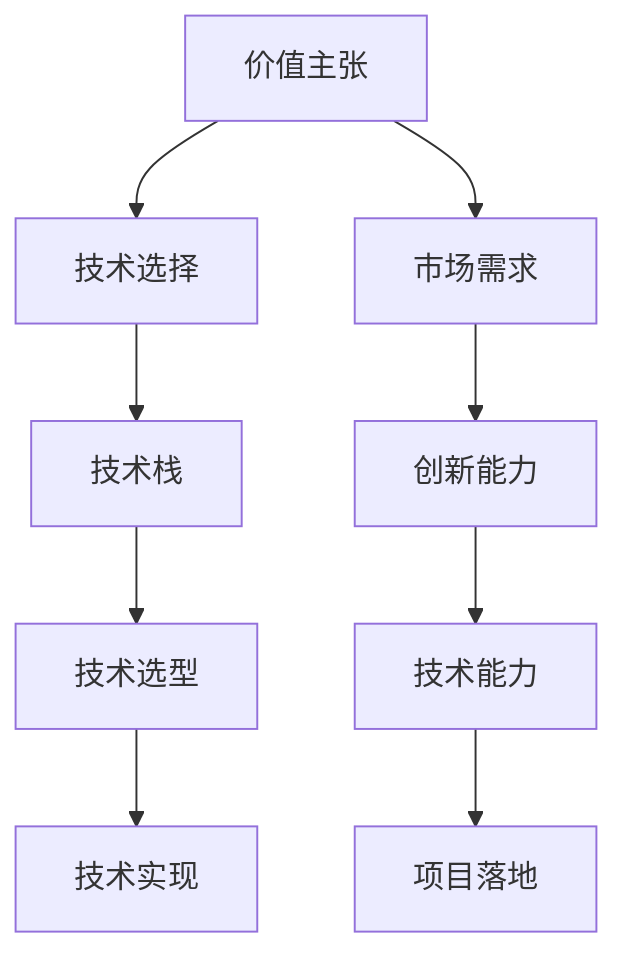

                 

# 定义你的独特价值主张：找到你的专业领域

> 关键词：价值主张, 专业领域, 技术选择, 市场需求, 创新能力

## 1. 背景介绍

### 1.1 问题由来

在现代科技快速发展的时代，每个行业都在追求技术创新的突破。特别是在IT领域，技术变革的速度令人目不暇接，人工智能(AI)、机器学习(ML)、深度学习(DL)等前沿技术不断涌现，推动着各行各业的数字化转型。然而，技术的发展也带来了新的挑战，如何在众多技术中选择最适合自己的领域，发挥出最大的价值，成为每个从业者都需要思考的问题。

### 1.2 问题核心关键点

选择适合自己的技术领域，需要综合考虑多方面因素。这不仅包括技术本身的特点、市场需求、应用前景等，还涉及到个人的兴趣、能力、资源配置等多维度因素。本文将从核心概念与联系、算法原理与步骤、数学模型构建等多个方面，全面系统地介绍如何找到自己的专业领域，并在此基础上定义独特的价值主张。

### 1.3 问题研究意义

找到适合自己的专业领域，并在此基础上建立独特的价值主张，不仅能够最大化个人或团队的技术潜力，还能够推动技术创新，提升产业竞争力。这不仅能帮助个人在职业生涯中不断进步，还能为所在公司或组织带来新的增长点，推动行业发展。

## 2. 核心概念与联系

### 2.1 核心概念概述

1. **价值主张（Value Proposition）**：
   - 定义：一种承诺，用以区分和解释为什么某个产品或服务对客户更有价值，以及与竞争对手相比有何独特优势。
   - 示例：自动驾驶技术的价值主张是其能提供更安全、更高效的交通出行方式。

2. **技术选择（Technology Selection）**：
   - 定义：从多个可用技术中选择最符合业务需求和市场趋势的技术的过程。
   - 示例：企业在选择云计算平台时，需考虑其成本、性能、可扩展性等因素。

3. **市场需求（Market Demand）**：
   - 定义：市场上对于某项产品或服务的需求情况。
   - 示例：数据分析服务因大数据时代的到来，市场需求猛增。

4. **创新能力（Innovation Capability）**：
   - 定义：一个组织或个人在技术创新方面所具备的资源、知识和经验。
   - 示例：谷歌在人工智能领域的不断突破，展示了其强大的创新能力。

5. **技术栈（Technology Stack）**：
   - 定义：实现特定应用所依赖的一组技术和工具的集合。
   - 示例：Web应用通常需要前端框架（如React）和后端语言（如Node.js）。

### 2.2 核心概念联系

这些概念之间相互关联，共同构成了选择专业领域和定义价值主张的基础。下图展示了这些概念之间的联系和互动：



这些概念的互动，帮助我们从市场需求出发，选择合适的技术栈，并在此基础上通过技术创新，构建独特的价值主张，从而实现项目的成功落地。

## 3. 核心算法原理 & 具体操作步骤

### 3.1 算法原理概述

找到适合自己的专业领域，并定义价值主张，可以通过以下算法流程实现：

1. **市场需求分析**：分析市场趋势和需求，识别出行业热点和潜在机会。
2. **技术评估**：评估不同技术的性能、成本、适用性等，筛选出最适合的技术栈。
3. **竞争分析**：评估竞争对手的技术优势和市场地位，定位自身的竞争策略。
4. **创新定位**：确定技术创新的方向，建立独特的价值主张。
5. **技术栈构建**：根据市场需求和技术评估结果，构建适合的技术栈。
6. **项目落地**：通过持续的技术创新和市场反馈，不断优化和完善项目。

### 3.2 算法步骤详解

**Step 1: 市场调研与需求分析**
- 收集市场报告、行业白皮书、新闻报道等，了解市场需求和趋势。
- 分析竞争对手的市场表现和策略，识别出潜在机会和威胁。

**Step 2: 技术评估与选择**
- 列出所有可用的技术选项，包括开源软件、商业解决方案、定制开发等。
- 使用技术评估矩阵，从性能、成本、易用性、可扩展性等方面进行打分和对比。
- 选择得分最高的技术栈，作为项目的基础。

**Step 3: 竞争分析与定位**
- 分析竞争对手的技术优势和市场地位，识别出自身的核心竞争力。
- 确定创新方向，定位技术栈的特色和优势。

**Step 4: 技术栈构建与实现**
- 根据市场需求和技术评估结果，构建适合的技术栈。
- 设计技术架构，确定系统组件和接口。
- 实现技术栈的关键模块，并进行初步测试。

**Step 5: 项目落地与迭代**
- 根据市场反馈和技术迭代，持续优化项目。
- 进行A/B测试，验证不同功能的效果。
- 不断收集用户反馈，提升产品体验。

### 3.3 算法优缺点

基于市场调研和需求分析的技术选择方法具有以下优点：
1. 科学合理：通过系统的分析和评估，能够找出最符合市场和业务需求的技术栈。
2. 风险可控：通过全面的评估和对比，能够降低选择不合适的技术带来的风险。
3. 灵活适应：通过持续的优化和迭代，能够快速适应市场变化和需求调整。

同时，也存在一些缺点：
1. 投入较大：市场调研和需求分析需要时间和资源，初期成本较高。
2. 周期较长：技术评估和实现周期较长，难以快速响应市场变化。
3. 主观性强：评估过程中主观判断较多，难以完全消除误差。

### 3.4 算法应用领域

该算法广泛应用于企业技术选型、软件开发、产品规划等多个领域。例如：

- **企业技术选型**：企业在选择云计算平台、数据存储方案时，需综合考虑市场需求和技术评估，选择最适合的技术栈。
- **软件开发**：开发者在选择技术栈时，需通过市场需求分析和技术评估，确定最符合项目需求的技术组合。
- **产品规划**：产品经理在规划新产品时，需通过市场调研和需求分析，确定最符合用户需求的功能和技术。

## 4. 数学模型和公式 & 详细讲解  
### 4.1 数学模型构建

假设市场需求和技术的评分矩阵分别为 $R$ 和 $T$，则市场需求和技术评估的总评分矩阵 $M$ 可以表示为：

$$ M = R \times T $$

其中，$R$ 和 $T$ 分别为 $n \times m$ 和 $m \times p$ 的评分矩阵，$M$ 为 $n \times p$ 的评分矩阵。

### 4.2 公式推导过程

需求和技术评估的总评分矩阵 $M$ 中的每个元素 $M_{ij}$ 表示第 $i$ 个市场需求与第 $j$ 个技术的评分乘积。因此，市场需求和技术评估的总评分矩阵可以通过简单的乘法运算得到：

$$ M = R \times T $$

在得到总评分矩阵 $M$ 后，可以通过最大值选择法，选择得分最高的技术栈，即：

$$ \max_{i=1}^n \max_{j=1}^p M_{ij} $$

### 4.3 案例分析与讲解

**案例：选择合适的云计算平台**

- **市场需求评分矩阵 $R$**：
  ```
  +------+----------+----------+----------+
  | 可靠 | 性能     | 成本     | 扩展性   |
  +------+----------+----------+----------+
  | 4     | 4        | 3        | 5        |
  +------+----------+----------+----------+
  | 5     | 5        | 4        | 4        |
  +------+----------+----------+----------+
  | 3     | 3        | 2        | 3        |
  +------+----------+----------+----------+
  ```

- **技术评估评分矩阵 $T$**：
  ```
  +------+----------+----------+----------+----------+
  | AWS  | Azure   | Google Cloud | 自建    | OpenStack |
  +------+----------+----------+----------+----------+
  | 3     | 4        | 5        | 2        | 3        |
  +------+----------+----------+----------+----------+
  | 4     | 3        | 3        | 4        | 4        |
  +------+----------+----------+----------+----------+
  | 5     | 2        | 2        | 5        | 5        |
  +------+----------+----------+----------+----------+
  ```

- **总评分矩阵 $M$**：
  ```
  +------+----------+----------+----------+----------+
  | AWS  | Azure   | Google Cloud | 自建    | OpenStack |
  +------+----------+----------+----------+----------+
  | 12    | 12       | 20        | 6        | 9        |
  +------+----------+----------+----------+----------+
  | 15    | 15       | 12        | 16       | 12       |
  +------+----------+----------+----------+----------+
  | 15    | 6        | 6         | 20       | 15       |
  +------+----------+----------+----------+----------+
  ```

通过最大值选择法，得分最高的技术栈为 Google Cloud，选择其为云计算平台。

## 5. 项目实践：代码实例和详细解释说明
### 5.1 开发环境搭建

项目实践首先需要搭建开发环境。以下是基于 Python 的开发环境配置流程：

1. 安装 Anaconda：从官网下载并安装 Anaconda，用于创建独立的 Python 环境。

2. 创建并激活虚拟环境：
```bash
conda create -n python-env python=3.8 
conda activate python-env
```

3. 安装 Python 相关工具：
```bash
pip install numpy pandas matplotlib jupyter notebook
```

4. 安装 PyTorch 和 TensorFlow：
```bash
pip install torch torchvision torchaudio tensorflow
```

5. 安装 Pandas 和 Scikit-learn：
```bash
pip install pandas scikit-learn
```

6. 安装 Flask 和 Django：
```bash
pip install flask django
```

完成上述步骤后，即可在 `python-env` 环境中开始项目开发。

### 5.2 源代码详细实现

下面以 Python 开发一个简单的 Web 应用为例，展示如何使用 Flask 构建技术栈。

```python
from flask import Flask, request, jsonify

app = Flask(__name__)

@app.route('/api/query', methods=['POST'])
def query():
    query_string = request.json['query']
    # 根据 query_string 调用技术栈进行查询
    # ...
    result = {
        'status': 'success',
        'data': '结果数据'
    }
    return jsonify(result)

if __name__ == '__main__':
    app.run(debug=True)
```

### 5.3 代码解读与分析

上述代码实现了一个简单的 Flask Web 应用，用于处理 POST 请求。当收到查询请求时，解析 JSON 数据，调用技术栈进行查询，并返回结果。

- **Flask 框架**：Flask 是一个轻量级的 Web 应用框架，易于上手，支持灵活扩展。
- **JSON 解析**：使用 Flask 的 `request.json` 解析 JSON 数据，方便与前端交互。
- **API 设计**：通过 `@app.route` 装饰器定义 API 路由，接收 POST 请求并处理查询。
- **返回结果**：使用 `jsonify` 函数将查询结果转换为 JSON 格式，返回给客户端。

### 5.4 运行结果展示

运行上述代码，可以通过 POST 请求调用 `/api/query` 接口，发送查询请求，获取查询结果。

```
POST http://localhost:5000/api/query
Content-Type: application/json

{
    "query": "查询请求数据"
}
```

```json
{
    "status": "success",
    "data": "查询结果数据"
}
```

## 6. 实际应用场景

### 6.1 智能推荐系统

智能推荐系统广泛应用于电商、视频、社交媒体等平台，通过分析用户行为和兴趣，提供个性化的推荐内容。利用技术栈和市场调研，可以快速构建一个高效的推荐系统。

- **市场需求**：个性化推荐、增加用户粘性、提升转化率。
- **技术栈选择**：推荐算法（如协同过滤、基于内容的推荐）、数据存储（如 Hadoop、Hive）、Web 应用框架（如 Flask、Django）。

### 6.2 智能客服系统

智能客服系统通过自然语言处理(NLP)技术，自动回答用户问题，提升客户服务效率。利用技术栈和市场调研，可以构建一个高效、智能的客服系统。

- **市场需求**：7x24 小时在线客服、自动回答常见问题、提高客户满意度。
- **技术栈选择**：NLP 技术（如BERT、GPT）、对话系统（如Rasa、IBM Watson）、Web 应用框架（如Flask、Django）。

### 6.3 数据挖掘与分析

数据挖掘和分析广泛应用于金融、营销、运营等多个领域，通过数据分析，挖掘出有价值的信息，为业务决策提供支持。利用技术栈和市场调研，可以快速构建一个高效的数据分析系统。

- **市场需求**：数据清洗、特征工程、预测分析、用户画像。
- **技术栈选择**：数据处理（如Pandas、NumPy）、机器学习（如Scikit-learn、TensorFlow）、数据可视化（如Matplotlib、Seaborn）。

### 6.4 未来应用展望

未来，随着技术的发展，更多的应用场景将出现。例如：

- **人工智能医疗**：通过 NLP 技术，分析医疗记录，提供精准的诊断和治疗建议。
- **智能家居**：通过物联网和 NLP 技术，实现智能控制和语音交互。
- **智能交通**：通过 NLP 技术，提供交通出行规划和智能导航。

## 7. 工具和资源推荐
### 7.1 学习资源推荐

为了帮助开发者掌握技术栈和市场调研的方法，推荐以下学习资源：

1. **《深入浅出 Python 编程》**：全面介绍 Python 语言的基本概念和高级特性，适合入门学习和进阶提升。
2. **《机器学习实战》**：详细讲解机器学习算法和实现方法，涵盖多种经典算法和应用案例。
3. **Coursera 《Python 数据科学基础》**：由斯坦福大学开设的在线课程，系统讲解数据科学的基本知识和技能。
4. **Kaggle**：数据科学和机器学习竞赛平台，提供丰富的数据集和社区资源，适合学习和实践。
5. **Google Cloud Platform**：提供云计算资源和开发工具，支持多种技术栈和应用场景。

### 7.2 开发工具推荐

1. **PyCharm**：功能强大的 Python IDE，支持代码编辑、调试、版本控制等。
2. **Git**：版本控制系统，支持多人协作开发，方便代码管理和版本控制。
3. **Jupyter Notebook**：交互式编程环境，支持编写、运行和分享 Jupyter Notebook 文件。
4. **Docker**：容器化技术，方便构建、部署和扩展应用。
5. **Anaconda**：Python 发行版，包含大量科学计算和数据分析库，适合数据科学项目。

### 7.3 相关论文推荐

1. **《深度学习》**：Ian Goodfellow 所著，全面介绍深度学习的基本原理和算法。
2. **《Python 数据科学手册》**：Jake VanderPlas 所著，涵盖数据科学和机器学习的各种工具和库。
3. **《NLP 实战》**：涉及自然语言处理的基本概念和实用技术，适合 NLP 初学者和进阶者。
4. **《The Hundred-Page Machine Learning Book》**：Andriy Burkov 所著，简明扼要地介绍机器学习的基础知识和应用。

## 8. 总结：未来发展趋势与挑战
### 8.1 研究成果总结

通过市场调研和需求分析，选择最合适的技术栈，构建高效的项目，是找到专业领域和定义价值主张的关键步骤。本文从核心概念与联系、算法原理与步骤、数学模型构建等多个方面，系统介绍了技术选型的全流程。

### 8.2 未来发展趋势

1. **技术融合**：未来技术趋势将更加注重跨领域的融合和创新，如人工智能与物联网的结合、机器学习与区块链的融合等。
2. **边缘计算**：随着物联网和移动设备的普及，边缘计算技术将迎来新的发展机遇，解决延迟和带宽问题。
3. **自监督学习**：无需大量标注数据，通过自监督学习提升模型的泛化能力，减少对人工标注的依赖。
4. **联邦学习**：在数据隐私和安全的前提下，通过分布式计算提升模型的训练效率和效果。
5. **智能合约**：结合区块链和智能合约技术，实现自动化和去中心化的业务逻辑。

### 8.3 面临的挑战

1. **数据隐私和安全**：数据隐私保护和数据安全成为越来越重要的挑战，需采用加密、匿名化等技术。
2. **计算资源**：随着数据量和模型复杂度的增加，计算资源的需求将大幅提升，需采用分布式计算和云计算技术。
3. **算法透明和可解释性**：复杂模型的可解释性问题需得到解决，便于用户理解和信任。
4. **伦理和法律**：人工智能技术的伦理和法律问题需引起重视，如数据偏见、算法歧视等。

### 8.4 研究展望

1. **自动化技术选型**：开发自动化技术选型工具，帮助开发者快速找到最适合的技术栈。
2. **市场趋势预测**：利用大数据和机器学习技术，预测市场需求和趋势，指导技术选型。
3. **跨领域技术融合**：探索跨领域技术的融合应用，如人工智能与医疗、金融的结合，提升应用效果。
4. **算法透明和可解释性**：研究可解释性算法和工具，增强模型的透明性和可解释性。
5. **伦理和法律研究**：深入研究人工智能伦理和法律问题，制定相应的规范和标准。

## 9. 附录：常见问题与解答

**Q1：如何选择最合适的技术栈？**

A: 选择最合适的技术栈需综合考虑市场需求、技术能力、资源配置等因素。通过市场调研和需求分析，列出所有可用技术选项，并使用技术评估矩阵进行评分和对比。最终选择得分最高的技术栈，作为项目的基础。

**Q2：如何选择最优的市场需求？**

A: 选择最优的市场需求需进行市场调研和数据分析。利用行业报告、用户反馈、竞品分析等手段，了解市场趋势和用户需求。同时，进行 A/B 测试和市场验证，确保需求的真实性和有效性。

**Q3：如何在项目中实现技术创新？**

A: 技术创新需结合市场需求和现有技术，找到创新的切入点。进行持续的市场调研和用户反馈，不断优化和完善技术栈。同时，引入开源社区的技术和资源，保持技术的前沿性。

**Q4：如何选择最合适的技术框架？**

A: 选择最合适的技术框架需考虑项目的需求、技术栈的成熟度和开发团队的能力。通过市场调研和需求分析，了解各类技术框架的优缺点，并结合实际项目情况进行选择。

**Q5：如何管理技术选型的风险？**

A: 管理技术选型的风险需进行充分的调研和评估。采用风险评估矩阵，从技术可行性、成本、时间等多个维度进行打分和对比。选择风险较低的技术栈，并在项目实施过程中进行持续监控和优化。

总之，找到适合自己的专业领域，并在此基础上定义独特的价值主张，是每个从业者都需要深入思考的问题。通过市场调研和需求分析，选择最合适的技术栈，构建高效的项目，是实现技术创新的重要步骤。未来，随着技术的不断进步，探索更多新技术和新应用场景，将为行业带来更多的突破和创新。

