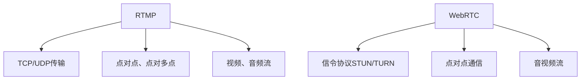

                 

# 实时流媒体协议：RTMP 和 WebRTC

## 1. 背景介绍

### 1.1 问题由来
在当今数字化时代，实时流媒体传输（Real-Time Streaming Protocol，RTMP）和 WebRTC（Web Real-Time Communications）已成为互联网通信中不可或缺的一部分。它们分别用于解决传统实时流传输和 Web 浏览器之间的点对点通信问题，是确保用户能够获得高质量音视频通信体验的关键。然而，RTMP 和 WebRTC 在架构、传输机制和应用场景上有着显著的差异。

本文将深入探讨 RTMP 和 WebRTC 的核心概念、工作原理、以及它们的应用场景，帮助读者更好地理解这两种协议在实时流媒体传输中的重要性和优势。

## 2. 核心概念与联系

### 2.1 核心概念概述

#### RTMP

RTMP 是一种由 Adobe 公司开发的实时流媒体协议，最初设计用于在其平台上进行视频流传输。RTMP 基于 TCP 或 UDP 传输，可以用于点对点和点对多点的音视频传输。

#### WebRTC

WebRTC 是谷歌公司推出的一种点对点音视频通信协议，旨在实现浏览器之间的直接音视频通信。它依赖于信令协议 STUN/TURN，提供了一种无需中心服务器即能进行点对点音视频通信的解决方案。

这两个协议的共同点是都能提供低延迟、高带宽的实时流媒体传输，但它们的设计目标和实现方式有所不同。

### 2.2 核心概念原理和架构的 Mermaid 流程图(Mermaid 流程节点中不要有括号、逗号等特殊字符)



RTMP 通过 TCP/UDP 实现音视频流传输，支持点对点和点对多点的传输模式。而 WebRTC 依赖于 STUN/TURN 信令协议进行音视频通信，且仅支持点对点模式。

### 2.3 核心概念之间的联系

RTMP 和 WebRTC 都是为了实现实时流媒体传输而设计的，但在实现方式和应用场景上存在明显区别。RTMP 适用于传统流媒体平台和点对点传输，而 WebRTC 则侧重于 Web 浏览器之间的直接音视频通信，具有更高的灵活性和低延迟特性。

## 3. 核心算法原理 & 具体操作步骤

### 3.1 算法原理概述

RTMP 和 WebRTC 的传输原理主要基于音视频编解码技术和实时流传输协议。

#### RTMP

RTMP 传输基于音视频编解码标准（如 H.264 和 AAC），通过 RTMP 服务器将音视频流传输到客户端。RTMP 服务器负责将音视频流打包并传输到客户端，同时进行负载均衡和故障恢复。

#### WebRTC

WebRTC 基于音视频编解码标准（如 VP8 和 Opus），通过 STUN/TURN 信令协议建立点对点音视频通信。WebRTC 的传输过程不需要中心服务器的参与，而是通过浏览器间的直接通信实现。

### 3.2 算法步骤详解

#### RTMP

1. **建立连接**：客户端通过 RTMP 协议向 RTMP 服务器发送连接请求，服务器响应并建立连接。
2. **音视频编解码**：音视频数据在服务器端进行编解码，生成符合 RTMP 协议的流格式。
3. **流传输**：编解码后的音视频流通过 TCP/UDP 协议传输到客户端。
4. **数据处理**：客户端接收到音视频流后，进行解包、解码和播放。

#### WebRTC

1. **信令协商**：客户端之间通过 STUN/TURN 协议进行信令协商，建立音视频通信路径。
2. **音视频编解码**：音视频数据在客户端进行编解码，生成符合 WebRTC 协议的流格式。
3. **直接传输**：编解码后的音视频流通过浏览器直接传输到对端客户端。
4. **数据处理**：对端客户端接收到音视频流后，进行解包、解码和播放。

### 3.3 算法优缺点

#### RTMP

**优点**：

- **低延迟**：由于 RTMP 直接连接服务器，音视频流传输的延迟较小。
- **可靠传输**：RTMP 基于 TCP 传输，保证数据可靠传输，适用于大带宽、低延迟的实时流传输。
- **广泛应用**：RTMP 在传统流媒体平台中应用广泛，被许多主流视频直播平台所采用。

**缺点**：

- **单点故障**：依赖 RTMP 服务器，服务器故障会导致整个直播中断。
- **高成本**：RTMP 服务器需要维护和部署，成本较高。

#### WebRTC

**优点**：

- **点对点通信**：无中心服务器的参与，降低了延迟和成本。
- **灵活性高**：支持多种音视频编解码格式，适应不同的设备和带宽条件。
- **信令协议支持**：依赖 STUN/TURN 信令协议，能够自动穿越 NAT 和防火墙。

**缺点**：

- **复杂度高**：需要浏览器端进行复杂的信令协商和音视频编解码。
- **稳定性较差**：网络环境变化较大时，音视频传输的稳定性可能会受到影响。

### 3.4 算法应用领域

#### RTMP

RTMP 主要应用于以下领域：

- **视频直播**：如 YouTube Live、Twitch、斗鱼等。
- **流媒体点播**：如 Netflix、爱奇艺、腾讯视频等。
- **企业内部视频会议**：如 Zoom、微软Teams、腾讯会议等。

#### WebRTC

WebRTC 主要应用于以下领域：

- **Web 视频会议**：如 Google Meet、Zoom、Skype 等。
- **实时游戏直播**：如 Twitch、Steam 等。
- **点对点音视频通信**：如 Peer-to-Peer (P2P) 视频通话、在线教育等。

## 4. 数学模型和公式 & 详细讲解 & 举例说明

### 4.1 数学模型构建

RTMP 和 WebRTC 的传输模型基于音视频编解码和实时流协议，涉及到以下数学模型：

#### RTMP

RTMP 的传输模型基于 TCP/UDP 协议，音频和视频数据在服务器端进行编解码，生成符合 RTMP 协议的流格式。

#### WebRTC

WebRTC 的传输模型依赖 STUN/TURN 信令协议，音频和视频数据在客户端进行编解码，生成符合 WebRTC 协议的流格式。

### 4.2 公式推导过程

#### RTMP

RTMP 的传输过程可以表示为：

$$
\text{RTMP} = \text{编解码器}(\text{音视频数据}) \rightarrow \text{RTMP 流格式}
$$

其中，编解码器将音视频数据编解码为符合 RTMP 协议的格式，通过 RTMP 服务器进行传输。

#### WebRTC

WebRTC 的传输过程可以表示为：

$$
\text{WebRTC} = \text{编解码器}(\text{音视频数据}) \rightarrow \text{WebRTC 流格式}
$$

其中，编解码器将音视频数据编解码为符合 WebRTC 协议的格式，通过浏览器直接传输。

### 4.3 案例分析与讲解

#### RTMP 案例

RTMP 在 YouTube Live 中的应用：

1. **建立连接**：客户端通过 RTMP 协议向 YouTube Live 服务器发送连接请求，服务器响应并建立连接。
2. **音视频编解码**：YouTube Live 服务器对直播视频进行编解码，生成符合 RTMP 协议的流格式。
3. **流传输**：编解码后的直播流通过 TCP/UDP 协议传输到客户端。
4. **数据处理**：客户端接收到直播流后，进行解包、解码和播放。

#### WebRTC 案例

WebRTC 在 Google Meet 中的应用：

1. **信令协商**：客户端之间通过 STUN/TURN 协议进行信令协商，建立音视频通信路径。
2. **音视频编解码**：Google Meet 客户端对音视频数据进行编解码，生成符合 WebRTC 协议的流格式。
3. **直接传输**：编解码后的音视频流通过浏览器直接传输到对端客户端。
4. **数据处理**：对端客户端接收到音视频流后，进行解包、解码和播放。

## 5. 项目实践：代码实例和详细解释说明

### 5.1 开发环境搭建

为了进行 RTMP 和 WebRTC 的开发实践，需要以下开发环境：

1. **开发语言**：Python、Java、C++ 等。
2. **开发平台**：Visual Studio、Xcode、Android Studio 等。
3. **RTMP 服务器**：Adobe Media Server、Red5 等。
4. **WebRTC 库**：Microsoft EdgeRTC、Google Webrtc.js 等。
5. **音视频编解码库**：FFmpeg、OpenCV 等。

### 5.2 源代码详细实现

#### RTMP 实现

以下是一个简单的 RTMP 服务器实现，使用 Java 编写：

```java
public class RTMPServer {
    public void startServer() {
        // 初始化 RTMP 服务器
        RTMPServer server = new RTMPServer();
        server.start();
        
        // 监听 RTMP 连接
        server.addStreamListener(new RTMPConnectionListener() {
            @Override
            public void onConnect(RTMPConnection connection) {
                // 连接建立，处理音视频流
                // ...
            }
        });
        
        // 监听音视频流
        server.addAudioStreamListener(new RTMPAudioStreamListener() {
            @Override
            public void onAudioStream(RTMPAudioStream stream) {
                // 处理音频流
                // ...
            }
        });
        
        server.addVideoStreamListener(new RTMPVideoStreamListener() {
            @Override
            public void onVideoStream(RTMPVideoStream stream) {
                // 处理视频流
                // ...
            }
        });
    }
}
```

#### WebRTC 实现

以下是一个简单的 WebRTC 客户端实现，使用 JavaScript 编写：

```javascript
function initWebRTC() {
    // 创建 WebRTC 实例
    var peerConnection = new RTCPeerConnection();
    
    // 添加信令通道
    peerConnection.onicecandidate = function(event) {
        // 处理 ICE 信令
        // ...
    };
    
    // 添加音频视频通道
    var stream = navigator.mediaDevices.getUserMedia({ video: true, audio: true });
    peerConnection.addStream(stream);
    
    // 添加数据通道
    var dataChannel = peerConnection.createDataChannel("webRTCData");
    dataChannel.onmessage = function(event) {
        // 处理数据信令
        // ...
    };
}

initWebRTC();
```

### 5.3 代码解读与分析

#### RTMP 代码解读

RTMP 服务器的实现包括以下关键步骤：

1. **初始化 RTMP 服务器**：创建 RTMP 服务器实例，并启动服务器。
2. **监听连接建立**：添加 RTMPConnectionListener，监听连接建立事件，处理连接建立后的音视频流。
3. **监听音视频流**：添加 RTMPAudioStreamListener 和 RTMPVideoStreamListener，分别处理音频流和视频流。

#### WebRTC 代码解读

WebRTC 客户端的实现包括以下关键步骤：

1. **创建 WebRTC 实例**：创建 RTCPeerConnection 实例，添加 ICE 信令通道和数据通道。
2. **添加 ICE 信令**：监听 ICE 信令事件，处理信令通道。
3. **添加音频视频通道**：使用 navigator.mediaDevices.getUserMedia 获取音频视频流，添加到 WebRTC 实例中。
4. **添加数据通道**：创建数据通道，监听数据信令。

### 5.4 运行结果展示

RTMP 服务器和 WebRTC 客户端的运行结果展示如下：

#### RTMP 服务器运行结果

RTMP 服务器能够接收并处理音视频流，将流传输到客户端。

#### WebRTC 客户端运行结果

WebRTC 客户端能够通过信令协商建立音视频通道，进行点对点通信。

## 6. 实际应用场景

### 6.1 智能家居

RTMP 和 WebRTC 在智能家居中的应用场景：

- **RTMP**：通过 RTMP 服务器，将家居监控摄像头录制的视频流传输到用户的智能手机或电脑上，实现实时监控和回放。
- **WebRTC**：通过 WebRTC 实现用户与智能家居设备的直接通信，如语音控制、远程开关等。

### 6.2 远程医疗

RTMP 和 WebRTC 在远程医疗中的应用场景：

- **RTMP**：通过 RTMP 服务器，将医院的远程医疗设备录制的视频流传输到医生的电脑或手机上，实现远程会诊和教学。
- **WebRTC**：通过 WebRTC 实现医生与患者或患者的直接音视频通信，进行远程诊疗和咨询。

### 6.3 在线教育

RTMP 和 WebRTC 在在线教育中的应用场景：

- **RTMP**：通过 RTMP 服务器，将教师录制的视频流传输到学生的电脑上，实现实时课堂教学和视频回放。
- **WebRTC**：通过 WebRTC 实现学生与教师的直接音视频通信，进行互动和提问。

### 6.4 未来应用展望

#### RTMP

未来，RTMP 将不断提升音视频流的质量和稳定性，支持更多的音视频编解码标准和更高的带宽传输。同时，RTMP 服务器将更加智能化和自动化，支持更丰富的功能。

#### WebRTC

未来，WebRTC 将进一步优化信令协议和音视频编解码，提高点对点通信的稳定性和效率。同时，WebRTC 将支持更多的设备和平台，实现更广泛的应用场景。

## 7. 工具和资源推荐

### 7.1 学习资源推荐

1. **《实时流媒体传输》**：该书详细介绍了 RTMP 和 WebRTC 的原理和应用。
2. **《WebRTC 开发指南》**：该书提供了 WebRTC 的详细开发教程和实践案例。
3. **《RTMP 协议详解》**：该书详细介绍了 RTMP 协议的各个方面。

### 7.2 开发工具推荐

1. **Adobe Media Server**：适用于 RTMP 服务器的部署和管理。
2. **Red5**：适用于 RTMP 服务器的部署和管理。
3. **Microsoft EdgeRTC**：适用于 WebRTC 客户端的开发。
4. **Google Webrtc.js**：适用于 WebRTC 客户端的开发。
5. **FFmpeg**：适用于音视频编解码和处理。
6. **OpenCV**：适用于音视频编解码和处理。

### 7.3 相关论文推荐

1. **"Real-Time Communication Using WebRTC and STUN/TURN"**：介绍 WebRTC 和 STUN/TURN 协议的原理和应用。
2. **"RTMP: A Protocol for Real-Time Streaming Media"**：介绍 RTMP 协议的原理和应用。
3. **"RTMP Streaming Media: Optimizing Transmission and Performance"**：介绍 RTMP 协议的优化和性能提升。

## 8. 总结：未来发展趋势与挑战

### 8.1 研究成果总结

本文深入探讨了 RTMP 和 WebRTC 的核心概念、工作原理和应用场景。通过详细的算法步骤讲解，帮助读者理解这两种协议在实时流媒体传输中的重要作用。

### 8.2 未来发展趋势

未来，RTMP 和 WebRTC 将继续在实时流媒体传输中发挥重要作用。RTMP 将进一步提升音视频流的质量和稳定性，支持更多的音视频编解码标准和更高的带宽传输。WebRTC 将优化信令协议和音视频编解码，提高点对点通信的稳定性和效率，支持更多的设备和平台。

### 8.3 面临的挑战

尽管 RTMP 和 WebRTC 在实时流媒体传输中已经取得了显著的成就，但仍面临以下挑战：

- **RTMP**：依赖 RTMP 服务器，服务器故障可能导致直播中断。高成本维护和部署。
- **WebRTC**：复杂度高，浏览器端需要进行复杂的信令协商和音视频编解码。稳定性较差，网络环境变化可能导致音视频传输不稳定。

### 8.4 研究展望

未来的研究需要在以下方面进行改进和突破：

- **RTMP**：开发更智能、更自动化的 RTMP 服务器，支持更多的音视频编解码标准和更高的带宽传输。
- **WebRTC**：进一步优化信令协议和音视频编解码，提高点对点通信的稳定性和效率。支持更多的设备和平台，实现更广泛的应用场景。
- **跨协议融合**：探索 RTMP 和 WebRTC 的跨协议融合，实现更灵活的音视频传输方案。

## 9. 附录：常见问题与解答

### Q1：RTMP 和 WebRTC 在音视频编解码上有什么区别？

A：RTMP 主要基于 H.264 和 AAC 等编解码标准，而 WebRTC 支持多种编解码标准，如 VP8 和 Opus。WebRTC 的音视频编解码更加灵活，能够适应不同的设备和带宽条件。

### Q2：RTMP 和 WebRTC 在音视频传输协议上有何不同？

A：RTMP 主要基于 TCP 或 UDP 传输，依赖 RTMP 服务器进行音视频流的打包和传输。而 WebRTC 基于 P2P 传输，不需要中心服务器，通过 STUN/TURN 信令协议建立点对点音视频通信。

### Q3：RTMP 和 WebRTC 在实时流媒体传输中的优势是什么？

A：RTMP 的优势在于低延迟和可靠传输，适用于大带宽、低延迟的实时流传输。WebRTC 的优势在于点对点通信，无中心服务器，降低了延迟和成本。

### Q4：RTMP 和 WebRTC 在音视频传输中的应用场景有哪些？

A：RTMP 适用于视频直播、流媒体点播和企业内部视频会议等场景。WebRTC 适用于 Web 视频会议、实时游戏直播和点对点音视频通信等场景。

---

作者：禅与计算机程序设计艺术 / Zen and the Art of Computer Programming

