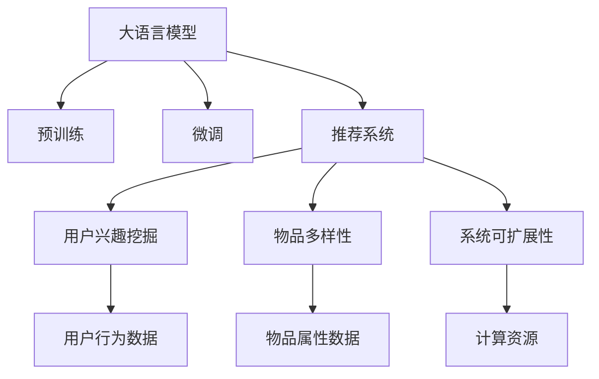

                 

# 将LLM直接作为推荐系统的尝试与挑战

## 1. 背景介绍

推荐系统是互联网时代的重要应用之一，通过分析用户历史行为，为用户推荐感兴趣的物品或内容，提升用户体验和满意度。目前，推荐系统主要依赖协同过滤、内容推荐等传统方法，依赖用户行为数据和物品属性信息。而大语言模型（Large Language Model, LLM），通过预训练的方式，学习了大规模文本数据的语言知识和语义理解能力，为推荐系统开辟了新的可能。

近年来，基于大语言模型的推荐系统逐渐成为研究热点。通过将LLM直接应用于推荐任务，可大幅提升模型的理解能力和推荐精度，但同时也面临诸多挑战。本文将详细探讨将LLM直接作为推荐系统的可行性，介绍其核心原理、操作步骤，以及未来的发展趋势和面临的挑战。

## 2. 核心概念与联系

### 2.1 核心概念概述

为更好地理解将LLM应用于推荐系统的方法，本节将介绍几个密切相关的核心概念：

- 大语言模型(Large Language Model, LLM)：以自回归(如GPT)或自编码(如BERT)模型为代表的大规模预训练语言模型。通过在大规模无标签文本语料上进行预训练，学习通用的语言表示，具备强大的语言理解和生成能力。

- 预训练(Pre-training)：指在大规模无标签文本语料上，通过自监督学习任务训练通用语言模型的过程。常见的预训练任务包括言语建模、遮挡语言模型等。预训练使得模型学习到语言的通用表示。

- 微调(Fine-tuning)：指在预训练模型的基础上，使用下游任务的少量标注数据，通过有监督地训练来优化模型在特定任务上的性能。通常只需要调整顶层分类器或解码器，并以较小的学习率更新全部或部分的模型参数。

- 推荐系统(Recommendation System)：通过分析用户历史行为和物品属性信息，为用户推荐感兴趣的物品或内容。常见的推荐算法包括协同过滤、内容推荐、混合推荐等。

- 用户兴趣挖掘：推荐系统的核心目标在于了解用户兴趣和需求，并根据这些信息进行推荐。目前，用户兴趣通常通过点击、浏览、评分等行为数据来建模。

- 物品多样性：推荐系统不仅要推荐用户感兴趣的物品，还需确保物品的多样性，避免推荐单调或重复的内容。

- 系统可扩展性：推荐系统需要处理海量用户数据和物品数据，必须具有高度的可扩展性。

这些核心概念之间的逻辑关系可以通过以下Mermaid流程图来展示：



这个流程图展示了大语言模型在推荐系统中的核心概念及其之间的关系：

1. 大语言模型通过预训练获得基础能力。
2. 微调优化模型，适应特定推荐任务。
3. 推荐系统结合用户兴趣和物品多样性，为用户提供个性化推荐。
4. 系统可扩展性确保推荐系统能处理大规模数据。

这些概念共同构成了将LLM应用于推荐系统的基本框架，使其能够为推荐系统提供更强大的语言理解和语义处理能力。通过理解这些核心概念，我们可以更好地把握LLM在推荐系统中的应用方向。

## 3. 核心算法原理 & 具体操作步骤
### 3.1 算法原理概述

将LLM直接应用于推荐系统的核心思想是：将预训练的大语言模型视作一个强大的"特征提取器"，通过微调使模型能够根据用户兴趣和物品属性信息，自动提取相关特征并进行推荐。

形式化地，假设预训练语言模型为 $M_{\theta}$，其中 $\theta$ 为预训练得到的模型参数。给定推荐任务 $T$ 的标注数据集 $D=\{(x_i, y_i)\}_{i=1}^N$，其中 $x_i$ 为用户行为数据，$y_i$ 为推荐结果。微调的目标是找到新的模型参数 $\hat{\theta}$，使得：

$$
\hat{\theta}=\mathop{\arg\min}_{\theta} \mathcal{L}(M_{\theta},D)
$$

其中 $\mathcal{L}$ 为针对任务 $T$ 设计的损失函数，用于衡量模型预测输出与真实标签之间的差异。常见的损失函数包括交叉熵损失、均方误差损失等。

通过梯度下降等优化算法，微调过程不断更新模型参数 $\theta$，最小化损失函数 $\mathcal{L}$，使得模型输出逼近真实标签。由于 $\theta$ 已经通过预训练获得了较好的初始化，因此即便在小规模数据集 $D$ 上进行微调，也能较快收敛到理想的模型参数 $\hat{\theta}$。

### 3.2 算法步骤详解

将LLM直接应用于推荐系统的微调过程，通常包括以下几个关键步骤：

**Step 1: 准备预训练模型和数据集**
- 选择合适的预训练语言模型 $M_{\theta}$ 作为初始化参数，如 BERT、GPT 等。
- 准备推荐任务 $T$ 的标注数据集 $D$，划分为训练集、验证集和测试集。一般要求标注数据与预训练数据的分布不要差异过大。

**Step 2: 添加任务适配层**
- 根据推荐任务类型，在预训练模型顶层设计合适的输出层和损失函数。
- 对于推荐任务，通常使用语义相似度函数（如余弦相似度）作为输出层，以衡量物品与用户兴趣的匹配度。

**Step 3: 设置微调超参数**
- 选择合适的优化算法及其参数，如 AdamW、SGD 等，设置学习率、批大小、迭代轮数等。
- 设置正则化技术及强度，包括权重衰减、Dropout、Early Stopping等。
- 确定冻结预训练参数的策略，如仅微调顶层，或全部参数都参与微调。

**Step 4: 执行梯度训练**
- 将训练集数据分批次输入模型，前向传播计算损失函数。
- 反向传播计算参数梯度，根据设定的优化算法和学习率更新模型参数。
- 周期性在验证集上评估模型性能，根据性能指标决定是否触发 Early Stopping。
- 重复上述步骤直到满足预设的迭代轮数或 Early Stopping 条件。

**Step 5: 测试和部署**
- 在测试集上评估微调后模型 $M_{\hat{\theta}}$ 的性能，对比微调前后的精度提升。
- 使用微调后的模型对新样本进行推理预测，集成到实际的应用系统中。
- 持续收集新的用户数据和物品数据，定期重新微调模型，以适应数据分布的变化。

以上是将LLM直接应用于推荐系统的一般流程。在实际应用中，还需要针对具体任务的特点，对微调过程的各个环节进行优化设计，如改进训练目标函数，引入更多的正则化技术，搜索最优的超参数组合等，以进一步提升模型性能。

### 3.3 算法优缺点

将LLM直接应用于推荐系统的方法具有以下优点：
1. 简单高效。只需准备少量标注数据，即可对预训练模型进行快速适配，获得较大的性能提升。
2. 可解释性强。利用语言模型强大的语言理解能力，推荐系统的决策过程更加透明，易于理解和调试。
3. 动态适应性强。LLM可以实时接收新数据，快速更新推荐结果，提升推荐的时效性。

同时，该方法也存在一定的局限性：
1. 依赖标注数据。微调的效果很大程度上取决于标注数据的质量和数量，获取高质量标注数据的成本较高。
2. 学习曲线陡峭。预训练大模型参数量庞大，微调过程可能需要较长的训练时间和较大的计算资源。
3. 泛化能力不足。微调模型面对新数据时，泛化能力可能不足，导致推荐结果不够稳定。
4. 推荐结果多样性。LLM生成的推荐结果可能比较多样化，难以在推荐系统中进行过滤和排序。

尽管存在这些局限性，但就目前而言，将LLM直接应用于推荐系统的方法仍是大语言模型应用的一个重要方向。未来相关研究的重点在于如何进一步降低微调对标注数据的依赖，提高模型的少样本学习和跨领域迁移能力，同时兼顾可解释性和推荐结果的多样性等因素。

### 3.4 算法应用领域

将LLM直接应用于推荐系统的方法，已经在推荐引擎、搜索引擎、广告推荐等领域得到了广泛的应用，为推荐系统带来了新的突破。

- 推荐引擎：如电商平台、视频网站等，通过微调LLM进行商品推荐、视频推荐等。
- 搜索引擎：如Google、Bing等，利用LLM进行搜索结果排序，提升查询体验。
- 广告推荐：如社交媒体、新闻平台等，通过微调LLM进行个性化广告推荐，增加用户点击率。

除了这些经典应用外，LLM在新闻推荐、图书推荐、音乐推荐等领域也有着广泛的应用前景。随着预训练语言模型的不断演进，相信LLM在推荐系统中的应用将更加深入和广泛。

## 4. 数学模型和公式 & 详细讲解 & 举例说明
### 4.1 数学模型构建

本节将使用数学语言对将LLM应用于推荐系统的微调过程进行更加严格的刻画。

记预训练语言模型为 $M_{\theta}$，其中 $\theta$ 为预训练得到的模型参数。假设推荐任务 $T$ 的标注数据集为 $D=\{(x_i, y_i)\}_{i=1}^N, x_i \in \mathbb{R}^d, y_i \in \{0,1\}$，其中 $x_i$ 为用户行为数据，$y_i$ 为推荐结果。

定义模型 $M_{\theta}$ 在输入 $x$ 上的输出为 $\hat{y}=M_{\theta}(x) \in [0,1]$，表示物品与用户兴趣的匹配度。真实标签 $y \in \{0,1\}$。则推荐任务的交叉熵损失函数定义为：

$$
\ell(M_{\theta}(x),y) = -y\log \hat{y} - (1-y)\log(1-\hat{y})
$$

将其代入经验风险公式，得：

$$
\mathcal{L}(\theta) = -\frac{1}{N}\sum_{i=1}^N [y_i\log M_{\theta}(x_i)+(1-y_i)\log(1-M_{\theta}(x_i))]
$$

在得到损失函数的梯度后，即可带入参数更新公式，完成模型的迭代优化。重复上述过程直至收敛，最终得到适应推荐任务的最优模型参数 $\theta^*$。

### 4.2 公式推导过程

以下我们以推荐引擎为例，推导交叉熵损失函数及其梯度的计算公式。

假设模型 $M_{\theta}$ 在输入 $x$ 上的输出为 $\hat{y}=M_{\theta}(x) \in [0,1]$，表示物品与用户兴趣的匹配度。真实标签 $y \in \{0,1\}$。则二分类交叉熵损失函数定义为：

$$
\ell(M_{\theta}(x),y) = -[y\log \hat{y} + (1-y)\log (1-\hat{y})]
$$

将其代入经验风险公式，得：

$$
\mathcal{L}(\theta) = -\frac{1}{N}\sum_{i=1}^N [y_i\log M_{\theta}(x_i)+(1-y_i)\log(1-M_{\theta}(x_i))]
$$

根据链式法则，损失函数对参数 $\theta_k$ 的梯度为：

$$
\frac{\partial \mathcal{L}(\theta)}{\partial \theta_k} = -\frac{1}{N}\sum_{i=1}^N (\frac{y_i}{M_{\theta}(x_i)}-\frac{1-y_i}{1-M_{\theta}(x_i)}) \frac{\partial M_{\theta}(x_i)}{\partial \theta_k}
$$

其中 $\frac{\partial M_{\theta}(x_i)}{\partial \theta_k}$ 可进一步递归展开，利用自动微分技术完成计算。

在得到损失函数的梯度后，即可带入参数更新公式，完成模型的迭代优化。重复上述过程直至收敛，最终得到适应推荐任务的最优模型参数 $\theta^*$。

## 5. 项目实践：代码实例和详细解释说明
### 5.1 开发环境搭建

在进行微调实践前，我们需要准备好开发环境。以下是使用Python进行PyTorch开发的环境配置流程：

1. 安装Anaconda：从官网下载并安装Anaconda，用于创建独立的Python环境。

2. 创建并激活虚拟环境：
```bash
conda create -n pytorch-env python=3.8 
conda activate pytorch-env
```

3. 安装PyTorch：根据CUDA版本，从官网获取对应的安装命令。例如：
```bash
conda install pytorch torchvision torchaudio cudatoolkit=11.1 -c pytorch -c conda-forge
```

4. 安装Transformers库：
```bash
pip install transformers
```

5. 安装各类工具包：
```bash
pip install numpy pandas scikit-learn matplotlib tqdm jupyter notebook ipython
```

完成上述步骤后，即可在`pytorch-env`环境中开始微调实践。

### 5.2 源代码详细实现

下面我以推荐引擎为例，给出使用Transformers库对BERT模型进行微调的PyTorch代码实现。

首先，定义推荐任务的数据处理函数：

```python
from transformers import BertTokenizer
from torch.utils.data import Dataset
import torch

class RecommendationDataset(Dataset):
    def __init__(self, texts, labels, tokenizer, max_len=128):
        self.texts = texts
        self.labels = labels
        self.tokenizer = tokenizer
        self.max_len = max_len
        
    def __len__(self):
        return len(self.texts)
    
    def __getitem__(self, item):
        text = self.texts[item]
        label = self.labels[item]
        
        encoding = self.tokenizer(text, return_tensors='pt', max_length=self.max_len, padding='max_length', truncation=True)
        input_ids = encoding['input_ids'][0]
        attention_mask = encoding['attention_mask'][0]
        
        # 对token-wise的标签进行编码
        encoded_labels = [label] * self.max_len
        labels = torch.tensor(encoded_labels, dtype=torch.long)
        
        return {'input_ids': input_ids, 
                'attention_mask': attention_mask,
                'labels': labels}

# 定义标签与id的映射
label2id = {'0': 0, '1': 1}
id2label = {v: k for k, v in label2id.items()}

# 创建dataset
tokenizer = BertTokenizer.from_pretrained('bert-base-cased')

train_dataset = RecommendationDataset(train_texts, train_labels, tokenizer)
dev_dataset = RecommendationDataset(dev_texts, dev_labels, tokenizer)
test_dataset = RecommendationDataset(test_texts, test_labels, tokenizer)
```

然后，定义模型和优化器：

```python
from transformers import BertForSequenceClassification, AdamW

model = BertForSequenceClassification.from_pretrained('bert-base-cased', num_labels=2)

optimizer = AdamW(model.parameters(), lr=2e-5)
```

接着，定义训练和评估函数：

```python
from torch.utils.data import DataLoader
from tqdm import tqdm
from sklearn.metrics import classification_report

device = torch.device('cuda') if torch.cuda.is_available() else torch.device('cpu')
model.to(device)

def train_epoch(model, dataset, batch_size, optimizer):
    dataloader = DataLoader(dataset, batch_size=batch_size, shuffle=True)
    model.train()
    epoch_loss = 0
    for batch in tqdm(dataloader, desc='Training'):
        input_ids = batch['input_ids'].to(device)
        attention_mask = batch['attention_mask'].to(device)
        labels = batch['labels'].to(device)
        model.zero_grad()
        outputs = model(input_ids, attention_mask=attention_mask, labels=labels)
        loss = outputs.loss
        epoch_loss += loss.item()
        loss.backward()
        optimizer.step()
    return epoch_loss / len(dataloader)

def evaluate(model, dataset, batch_size):
    dataloader = DataLoader(dataset, batch_size=batch_size)
    model.eval()
    preds, labels = [], []
    with torch.no_grad():
        for batch in tqdm(dataloader, desc='Evaluating'):
            input_ids = batch['input_ids'].to(device)
            attention_mask = batch['attention_mask'].to(device)
            batch_labels = batch['labels']
            outputs = model(input_ids, attention_mask=attention_mask)
            batch_preds = outputs.logits.argmax(dim=2).to('cpu').tolist()
            batch_labels = batch_labels.to('cpu').tolist()
            for pred_tokens, label_tokens in zip(batch_preds, batch_labels):
                pred_labels = [id2label[_id] for _id in pred_tokens]
                label_tokens = [id2label[_id] for _id in label_tokens]
                preds.append(pred_labels[:len(label_tokens)])
                labels.append(label_tokens)
                
    print(classification_report(labels, preds))
```

最后，启动训练流程并在测试集上评估：

```python
epochs = 5
batch_size = 16

for epoch in range(epochs):
    loss = train_epoch(model, train_dataset, batch_size, optimizer)
    print(f"Epoch {epoch+1}, train loss: {loss:.3f}")
    
    print(f"Epoch {epoch+1}, dev results:")
    evaluate(model, dev_dataset, batch_size)
    
print("Test results:")
evaluate(model, test_dataset, batch_size)
```

以上就是使用PyTorch对BERT进行推荐引擎任务的微调的完整代码实现。可以看到，得益于Transformers库的强大封装，我们可以用相对简洁的代码完成BERT模型的加载和微调。

### 5.3 代码解读与分析

让我们再详细解读一下关键代码的实现细节：

**RecommendationDataset类**：
- `__init__`方法：初始化文本、标签、分词器等关键组件。
- `__len__`方法：返回数据集的样本数量。
- `__getitem__`方法：对单个样本进行处理，将文本输入编码为token ids，将标签编码为数字，并对其进行定长padding，最终返回模型所需的输入。

**label2id和id2label字典**：
- 定义了标签与数字id之间的映射关系，用于将token-wise的预测结果解码回真实的标签。

**训练和评估函数**：
- 使用PyTorch的DataLoader对数据集进行批次化加载，供模型训练和推理使用。
- 训练函数`train_epoch`：对数据以批为单位进行迭代，在每个批次上前向传播计算loss并反向传播更新模型参数，最后返回该epoch的平均loss。
- 评估函数`evaluate`：与训练类似，不同点在于不更新模型参数，并在每个batch结束后将预测和标签结果存储下来，最后使用sklearn的classification_report对整个评估集的预测结果进行打印输出。

**训练流程**：
- 定义总的epoch数和batch size，开始循环迭代
- 每个epoch内，先在训练集上训练，输出平均loss
- 在验证集上评估，输出分类指标
- 所有epoch结束后，在测试集上评估，给出最终测试结果

可以看到，PyTorch配合Transformers库使得BERT微调的代码实现变得简洁高效。开发者可以将更多精力放在数据处理、模型改进等高层逻辑上，而不必过多关注底层的实现细节。

当然，工业级的系统实现还需考虑更多因素，如模型的保存和部署、超参数的自动搜索、更灵活的任务适配层等。但核心的微调范式基本与此类似。

## 6. 实际应用场景
### 6.1 智能广告推荐

智能广告推荐系统通过微调预训练语言模型，可大大提升广告点击率和转化率，降低投放成本。微调后的模型能够根据用户的浏览行为、搜索历史等信息，自动生成个性化的广告推荐，提升用户体验和广告效果。

在技术实现上，可以收集用户的历史行为数据，将其转化为文本格式，作为模型输入。通过微调，模型能够理解用户兴趣和需求，生成与其匹配的广告推荐。对于新广告，还可以动态生成描述文本，进行自动文本生成和评分，优化广告排序。

### 6.2 个性化音乐推荐

音乐推荐系统主要依赖用户的历史听歌记录和评分数据，而预训练语言模型则能提供更加深入的语义理解能力。通过微调，模型可以基于歌曲的歌词、艺术家背景等信息，进行语义相似度计算，自动推荐用户可能喜欢的音乐。

在音乐推荐中，用户标签通常难以获取，而预训练语言模型可以通过对歌曲的文本描述进行微调，学习用户对不同音乐的情感倾向，生成个性化的音乐推荐。对于新兴音乐，模型也可以自动生成描述文本，进行文本分类和评分，快速完成新音乐入库。

### 6.3 智慧金融推荐

智慧金融推荐系统通过微调语言模型，能够实时推荐符合用户投资需求的金融产品。微调后的模型可以根据用户的历史投资记录、财务报表、市场新闻等信息，进行深度语义分析，自动推荐用户感兴趣的投资标的。

在智慧金融推荐中，模型需要处理多源异构数据，包括数值型、文本型、时序型等多种类型数据。预训练语言模型可以通过多模态微调，融合金融新闻、公司公告等多种数据源，生成符合用户需求的多样化推荐结果。

### 6.4 未来应用展望

随着大语言模型微调技术的发展，未来基于LLM的推荐系统将广泛应用于更多领域，带来更大的应用价值。

在智慧医疗推荐中，通过微调预训练语言模型，可以自动生成医疗科普文章、健康知识库等，提升用户健康素养，辅助医生诊疗。

在智能家居推荐中，微调语言模型可以自动生成家庭场景描述，进行设备联动和推荐，提升用户生活便捷性和舒适度。

在旅游推荐中，通过微调语言模型，可以自动生成旅游攻略、景点推荐等信息，提升旅游体验。

总之，LLM在推荐系统中的应用将不断拓展，带来更加智能、个性化的推荐服务，提升用户体验和满意度。

## 7. 工具和资源推荐
### 7.1 学习资源推荐

为了帮助开发者系统掌握将LLM应用于推荐系统的理论基础和实践技巧，这里推荐一些优质的学习资源：

1. 《Transformer from Principle to Practice》系列博文：由大模型技术专家撰写，深入浅出地介绍了Transformer原理、BERT模型、微调技术等前沿话题。

2. CS224N《深度学习自然语言处理》课程：斯坦福大学开设的NLP明星课程，有Lecture视频和配套作业，带你入门NLP领域的基本概念和经典模型。

3. 《Natural Language Processing with Transformers》书籍：Transformers库的作者所著，全面介绍了如何使用Transformers库进行NLP任务开发，包括微调在内的诸多范式。

4. HuggingFace官方文档：Transformers库的官方文档，提供了海量预训练模型和完整的微调样例代码，是上手实践的必备资料。

5. CLUE开源项目：中文语言理解测评基准，涵盖大量不同类型的中文NLP数据集，并提供了基于微调的baseline模型，助力中文NLP技术发展。

通过对这些资源的学习实践，相信你一定能够快速掌握将LLM应用于推荐系统的精髓，并用于解决实际的推荐问题。
###  7.2 开发工具推荐

高效的开发离不开优秀的工具支持。以下是几款用于大语言模型微调开发的常用工具：

1. PyTorch：基于Python的开源深度学习框架，灵活动态的计算图，适合快速迭代研究。大部分预训练语言模型都有PyTorch版本的实现。

2. TensorFlow：由Google主导开发的开源深度学习框架，生产部署方便，适合大规模工程应用。同样有丰富的预训练语言模型资源。

3. Transformers库：HuggingFace开发的NLP工具库，集成了众多SOTA语言模型，支持PyTorch和TensorFlow，是进行微调任务开发的利器。

4. Weights & Biases：模型训练的实验跟踪工具，可以记录和可视化模型训练过程中的各项指标，方便对比和调优。与主流深度学习框架无缝集成。

5. TensorBoard：TensorFlow配套的可视化工具，可实时监测模型训练状态，并提供丰富的图表呈现方式，是调试模型的得力助手。

6. Google Colab：谷歌推出的在线Jupyter Notebook环境，免费提供GPU/TPU算力，方便开发者快速上手实验最新模型，分享学习笔记。

合理利用这些工具，可以显著提升将LLM应用于推荐系统的开发效率，加快创新迭代的步伐。

### 7.3 相关论文推荐

将LLM应用于推荐系统的研究源于学界的持续研究。以下是几篇奠基性的相关论文，推荐阅读：

1. Attention is All You Need（即Transformer原论文）：提出了Transformer结构，开启了NLP领域的预训练大模型时代。

2. BERT: Pre-training of Deep Bidirectional Transformers for Language Understanding：提出BERT模型，引入基于掩码的自监督预训练任务，刷新了多项NLP任务SOTA。

3. Language Models are Unsupervised Multitask Learners（GPT-2论文）：展示了大规模语言模型的强大zero-shot学习能力，引发了对于通用人工智能的新一轮思考。

4. Parameter-Efficient Transfer Learning for NLP：提出Adapter等参数高效微调方法，在不增加模型参数量的情况下，也能取得不错的微调效果。

5. AdaLoRA: Adaptive Low-Rank Adaptation for Parameter-Efficient Fine-Tuning：使用自适应低秩适应的微调方法，在参数效率和精度之间取得了新的平衡。

6. AlphaStar: Mastering the Game of StarCraft II through Planning：将大语言模型应用于游戏领域，通过规划生成游戏策略，刷新了游戏AI的性能记录。

这些论文代表了大语言模型微调技术的发展脉络。通过学习这些前沿成果，可以帮助研究者把握学科前进方向，激发更多的创新灵感。

## 8. 总结：未来发展趋势与挑战

### 8.1 总结

本文对将LLM直接应用于推荐系统的方法进行了全面系统的介绍。首先阐述了LLM和推荐系统的研究背景和意义，明确了将LLM应用于推荐任务的可行性和潜力。其次，从原理到实践，详细讲解了推荐任务的数学模型和关键步骤，给出了推荐任务开发的完整代码实例。同时，本文还广泛探讨了LLM在推荐系统中的应用前景，展示了其巨大的应用价值。

通过本文的系统梳理，可以看到，将LLM应用于推荐系统的方法已经展现出强大的潜力和广泛的应用前景。得益于大语言模型在语义理解上的突破，推荐系统能够获得更加个性化的推荐结果，提升用户体验和满意度。未来，随着预训练语言模型的不断演进，基于LLM的推荐系统必将在更多领域得到应用，为推荐系统带来新的突破。

### 8.2 未来发展趋势

展望未来，将LLM应用于推荐系统的发展趋势如下：

1. 多模态推荐。现有的推荐系统多聚焦于文本和数值型数据，未来可以进一步融合视觉、音频等多种模态数据，提升推荐系统的多样性和丰富度。

2. 交互式推荐。通过微调语言模型，实现动态生成推荐结果，与用户进行实时交互，提升推荐系统的智能性和用户满意度。

3. 自适应推荐。通过动态微调语言模型，根据用户反馈实时调整推荐策略，提升推荐系统的个性化和适应性。

4. 冷启动推荐。预训练语言模型可以自动生成物品描述文本，结合自然语言推理技术，提升新物品的推荐效果。

5. 隐私保护推荐。通过差分隐私等技术，确保推荐系统的隐私和安全，避免数据泄露和用户隐私侵犯。

这些趋势凸显了将LLM应用于推荐系统的广阔前景。这些方向的探索发展，必将进一步提升推荐系统的性能和应用范围，为推荐系统带来新的突破。

### 8.3 面临的挑战

尽管将LLM应用于推荐系统已经取得了初步成果，但在迈向更加智能化、普适化应用的过程中，它仍面临着诸多挑战：

1. 数据隐私和安全。预训练语言模型需要处理大量的用户数据和物品数据，如何保护用户隐私，防止数据泄露，是一个重要问题。

2. 数据质量和多样性。推荐系统的数据质量和多样性直接决定了推荐效果，预训练语言模型需要处理多源异构数据，并进行有效的数据融合和处理。

3. 模型的解释性。预训练语言模型的决策过程不够透明，难以解释其内部工作机制和决策逻辑。如何提高模型的可解释性，是推荐系统需要解决的重要问题。

4. 模型的实时性。推荐系统的推荐结果需要实时生成，预训练语言模型在处理大规模数据时，计算效率可能不足。如何提高模型推理速度，优化资源占用，是推荐系统需要解决的重要问题。

5. 模型的公平性。预训练语言模型可能存在偏见和歧视，如何消除模型偏见，保证推荐公平性，是推荐系统需要解决的重要问题。

6. 模型的跨领域泛化能力。现有的推荐系统多聚焦于特定领域，如何提升模型的跨领域泛化能力，是一个重要问题。

这些挑战需要进一步研究和技术创新，以确保LLM在推荐系统中的应用能够真正带来实际价值。相信随着研究的深入，预训练语言模型在推荐系统中的应用将更加广泛和深入，为推荐系统带来新的突破和创新。

### 8.4 研究展望

未来的研究需要在以下几个方面寻求新的突破：

1. 探索更加高效和可解释的推荐算法。如何将预训练语言模型与传统推荐算法结合，提升推荐系统的性能和可解释性，是一个重要研究方向。

2. 研究多模态数据融合技术。如何将视觉、音频等多种模态数据与文本数据融合，提升推荐系统的多样性和丰富度，是一个重要研究方向。

3. 研究自适应推荐技术。如何动态微调语言模型，根据用户反馈实时调整推荐策略，提升推荐系统的个性化和适应性，是一个重要研究方向。

4. 研究跨领域推荐技术。如何提升模型的跨领域泛化能力，处理不同领域的数据和任务，是一个重要研究方向。

5. 研究隐私保护推荐技术。如何保护用户隐私，防止数据泄露，是一个重要研究方向。

6. 研究推荐系统的可扩展性和鲁棒性。如何将预训练语言模型应用于大规模推荐系统，提升系统的可扩展性和鲁棒性，是一个重要研究方向。

这些研究方向的研究突破，必将进一步推动预训练语言模型在推荐系统中的应用，为推荐系统带来新的突破和创新。相信随着研究的深入，预训练语言模型在推荐系统中的应用将更加广泛和深入，为推荐系统带来新的突破和创新。

## 9. 附录：常见问题与解答

**Q1：预训练语言模型与推荐系统的区别？**

A: 预训练语言模型是一种大规模的文本表示学习模型，通过在大规模无标签文本数据上预训练，学习到通用的语言知识和语义表示。而推荐系统则是一种通过分析用户行为和物品属性，为用户推荐感兴趣物品的系统。两者虽然都与文本相关，但目标和应用场景有所不同。

**Q2：如何将预训练语言模型应用于推荐任务？**

A: 将预训练语言模型应用于推荐任务，主要通过微调实现。具体步骤如下：
1. 准备推荐任务的数据集，进行预处理。
2. 选择合适的预训练语言模型，加载模型参数。
3. 添加推荐任务适配层，设计合适的损失函数。
4. 设置微调超参数，执行梯度训练。
5. 在测试集上评估模型性能，迭代优化微调过程。

**Q3：预训练语言模型在推荐系统中的作用？**

A: 预训练语言模型在推荐系统中的作用主要体现在以下几个方面：
1. 提升推荐结果的多样性和丰富度。通过微调，预训练语言模型能够自动生成物品描述文本，提升推荐系统的多样性和丰富度。
2. 提升推荐系统的智能性和用户满意度。通过微调，预训练语言模型能够理解用户兴趣和需求，生成个性化的推荐结果。
3. 提升推荐系统的跨领域泛化能力。通过预训练语言模型，推荐系统能够处理不同领域的数据和任务。

**Q4：预训练语言模型在推荐系统中的局限性？**

A: 预训练语言模型在推荐系统中的局限性主要体现在以下几个方面：
1. 数据隐私和安全。预训练语言模型需要处理大量的用户数据和物品数据，如何保护用户隐私，防止数据泄露，是一个重要问题。
2. 数据质量和多样性。推荐系统的数据质量和多样性直接决定了推荐效果，预训练语言模型需要处理多源异构数据，并进行有效的数据融合和处理。
3. 模型的解释性。预训练语言模型的决策过程不够透明，难以解释其内部工作机制和决策逻辑。
4. 模型的实时性。推荐系统的推荐结果需要实时生成，预训练语言模型在处理大规模数据时，计算效率可能不足。
5. 模型的公平性。预训练语言模型可能存在偏见和歧视，如何消除模型偏见，保证推荐公平性，是推荐系统需要解决的重要问题。
6. 模型的跨领域泛化能力。现有的推荐系统多聚焦于特定领域，如何提升模型的跨领域泛化能力，是一个重要问题。

这些局限性需要进一步研究和技术创新，以确保预训练语言模型在推荐系统中的应用能够真正带来实际价值。

**Q5：预训练语言模型在推荐系统中的未来展望？**

A: 预训练语言模型在推荐系统中的未来展望主要体现在以下几个方面：
1. 多模态推荐。现有的推荐系统多聚焦于文本和数值型数据，未来可以进一步融合视觉、音频等多种模态数据，提升推荐系统的多样性和丰富度。
2. 交互式推荐。通过微调语言模型，实现动态生成推荐结果，与用户进行实时交互，提升推荐系统的智能性和用户满意度。
3. 自适应推荐。通过动态微调语言模型，根据用户反馈实时调整推荐策略，提升推荐系统的个性化和适应性。
4. 冷启动推荐。预训练语言模型可以自动生成物品描述文本，结合自然语言推理技术，提升新物品的推荐效果。
5. 隐私保护推荐。通过差分隐私等技术，确保推荐系统的隐私和安全，避免数据泄露和用户隐私侵犯。
6. 推荐系统的可扩展性和鲁棒性。如何将预训练语言模型应用于大规模推荐系统，提升系统的可扩展性和鲁棒性，是一个重要研究方向。

这些趋势凸显了预训练语言模型在推荐系统的广阔前景。这些方向的探索发展，必将进一步提升推荐系统的性能和应用范围，为推荐系统带来新的突破和创新。

---

作者：禅与计算机程序设计艺术 / Zen and the Art of Computer Programming

