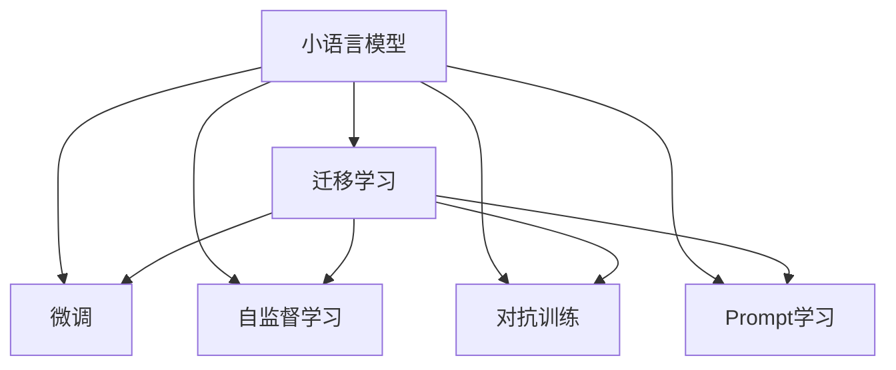

                 

## 1. 背景介绍

### 1.1 问题由来

近年来，人工智能技术快速发展，以深度学习为代表的机器学习技术在各个领域取得了突破性进展。在自然语言处理（Natural Language Processing, NLP）领域，以语言模型为代表的基础模型，通过在大规模无标签文本数据上进行预训练，学习到语言的深层表示，显示出卓越的性能。然而，这些大模型也存在一些局限性，如资源需求高、训练时间长、泛化能力不足等。因此，一种新型的模型——小语言模型（Small Language Model）应运而生。

### 1.2 问题核心关键点

小语言模型相比于大语言模型，具有以下几个关键特点：

1. **参数量小**：小模型通常只有几十百万个参数，远小于大模型的几亿参数。
2. **训练时间短**：小模型训练速度较快，可以在几小时甚至几分钟内完成训练。
3. **泛化能力强**：小模型通过迁移学习等方式，可以在特定领域或任务上表现优异。
4. **资源需求低**：小模型对计算资源和存储空间的需求较小，适合于资源有限的场景。
5. **灵活性高**：小模型可以方便地进行任务适配，适合于快速迭代和动态调整。

### 1.3 问题研究意义

研究小语言模型，对于提升NLP技术的灵活性和泛化能力，降低开发和部署成本，具有重要意义：

1. **降低资源成本**：小模型资源需求低，可以大幅降低训练和部署成本。
2. **提升模型效率**：小模型训练时间短，适应性高，可以在线实时推理，提升模型响应速度。
3. **促进创新**：小模型结构简单，便于研究人员进行快速实验和迭代，推动技术创新。
4. **广泛应用**：小模型可以应用于各种NLP任务，如文本分类、命名实体识别、机器翻译等，具有广泛的实用价值。
5. **推动标准化**：小模型的应用普及，将推动NLP技术标准的制定和应用。

## 2. 核心概念与联系

### 2.1 核心概念概述

为更好地理解小语言模型的原理和应用，本节将介绍几个密切相关的核心概念：

- **小语言模型（Small Language Model）**：参数量小、训练时间短、泛化能力强、资源需求低的新型语言模型。与大模型相比，小模型在参数量、计算资源、训练时间等方面具有显著优势。

- **迁移学习（Transfer Learning）**：指将一个领域学习到的知识，迁移到另一个相关领域进行学习的方法。小模型可以通过迁移学习，在大模型预训练的基础上，快速适应特定任务。

- **微调（Fine-tuning）**：指在预训练模型的基础上，使用下游任务的少量标注数据，通过有监督地训练优化模型在特定任务上的性能。小模型通常通过微调，提升在特定领域的应用效果。

- **自监督学习（Self-supervised Learning）**：指使用无标签数据进行模型训练的方法。小模型可以利用自监督学习，在大规模无标签数据上进行预训练，学习到语言的深层表示。

- **对抗训练（Adversarial Training）**：通过引入对抗样本，提高模型鲁棒性，增强模型的泛化能力。

- ** Prompt 学习**：通过在输入文本中添加提示模板（Prompt Template），引导小模型进行特定任务的推理和生成，减少微调参数。

这些核心概念之间的逻辑关系可以通过以下Mermaid流程图来展示：



这个流程图展示出小语言模型的核心概念及其之间的关系：

1. 小语言模型通过自监督学习获得初始化的语言表示。
2. 通过迁移学习，在大模型预训练的基础上，快速适应特定任务。
3. 微调过程可以进一步优化模型，提升特定任务的效果。
4. 对抗训练和Prompt学习等技术可以进一步提升模型鲁棒性和泛化能力。

## 3. 核心算法原理 & 具体操作步骤

### 3.1 算法原理概述

小语言模型的核心思想是利用有限的数据和计算资源，通过迁移学习和微调技术，快速获得高性能的模型。其核心算法原理包括以下几个方面：

1. **预训练**：在大规模无标签文本数据上，通过自监督学习任务进行预训练，学习到语言的深层表示。
2. **迁移学习**：在预训练模型的基础上，使用下游任务的少量标注数据，通过微调优化模型在特定任务上的性能。
3. **微调**：在少量标注数据上进行有监督训练，进一步优化模型参数，提升在特定任务上的表现。
4. **对抗训练**：通过引入对抗样本，增强模型鲁棒性，避免过拟合。
5. **Prompt 学习**：通过在输入文本中添加提示模板，引导小模型进行特定任务的推理和生成，减少微调参数。

### 3.2 算法步骤详解

基于小语言模型的迁移学习和微调方法，一般包括以下几个关键步骤：

**Step 1: 准备预训练模型和数据集**
- 选择合适的预训练语言模型作为初始化参数，如BERT、GPT等。
- 准备下游任务的数据集，划分为训练集、验证集和测试集。

**Step 2: 添加任务适配层**
- 根据任务类型，在预训练模型顶层设计合适的输出层和损失函数。
- 对于分类任务，通常在顶层添加线性分类器和交叉熵损失函数。
- 对于生成任务，通常使用语言模型的解码器输出概率分布，并以负对数似然为损失函数。

**Step 3: 设置微调超参数**
- 选择合适的优化算法及其参数，如AdamW、SGD等，设置学习率、批大小、迭代轮数等。
- 设置正则化技术及强度，包括权重衰减、Dropout、Early Stopping等。
- 确定冻结预训练参数的策略，如仅微调顶层，或全部参数都参与微调。

**Step 4: 执行梯度训练**
- 将训练集数据分批次输入模型，前向传播计算损失函数。
- 反向传播计算参数梯度，根据设定的优化算法和学习率更新模型参数。
- 周期性在验证集上评估模型性能，根据性能指标决定是否触发Early Stopping。
- 重复上述步骤直到满足预设的迭代轮数或Early Stopping条件。

**Step 5: 测试和部署**
- 在测试集上评估微调后模型在特定任务上的性能。
- 使用微调后的模型对新样本进行推理预测，集成到实际的应用系统中。
- 持续收集新的数据，定期重新微调模型，以适应数据分布的变化。

以上是基于小语言模型的迁移学习和微调的一般流程。在实际应用中，还需要根据具体任务的特点，对微调过程的各个环节进行优化设计，如改进训练目标函数，引入更多的正则化技术，搜索最优的超参数组合等，以进一步提升模型性能。

### 3.3 算法优缺点

小语言模型相比于大语言模型，具有以下优点：

1. **资源需求低**：小模型参数量小，计算资源和存储空间需求低，适合资源有限的场景。
2. **训练速度快**：小模型训练时间短，可以在几小时甚至几分钟内完成训练，便于快速迭代和实验。
3. **泛化能力强**：小模型可以通过迁移学习和大模型预训练，在特定领域或任务上表现优异。
4. **灵活性高**：小模型方便进行任务适配，可以快速调整和优化，适应不同任务需求。
5. **可解释性强**：小模型结构简单，参数量少，便于理解模型决策过程。

同时，小语言模型也存在一些局限性：

1. **泛化能力有限**：小模型参数量少，无法涵盖大规模语言的全部表示，可能在大规模数据上表现较差。
2. **资源受限**：小模型的泛化能力依赖于预训练数据的规模和质量，如果预训练数据不足，可能无法达到理想效果。
3. **模型复杂度低**：小模型结构简单，可能无法处理复杂的多模态数据和深度逻辑推理。

尽管存在这些局限性，但小语言模型在资源受限、实时推理和快速迭代等方面展现出独特的优势，将在特定领域和场景中发挥重要作用。

### 3.4 算法应用领域

小语言模型在NLP领域已经得到了广泛的应用，覆盖了几乎所有常见任务，例如：

- 文本分类：如情感分析、主题分类、意图识别等。通过迁移学习，小模型可以快速适应不同领域的文本分类任务。
- 命名实体识别：识别文本中的人名、地名、机构名等特定实体。通过微调，小模型能够学习到实体边界和类型。
- 关系抽取：从文本中抽取实体之间的语义关系。通过微调，小模型能够学习到实体-关系三元组。
- 问答系统：对自然语言问题给出答案。将问题-答案对作为微调数据，训练小模型学习匹配答案。
- 机器翻译：将源语言文本翻译成目标语言。通过微调，小模型能够学习到语言-语言映射。
- 文本摘要：将长文本压缩成简短摘要。将文章-摘要对作为微调数据，使小模型学习抓取要点。
- 对话系统：使机器能够与人自然对话。将多轮对话历史作为上下文，微调小模型进行回复生成。

除了上述这些经典任务外，小语言模型也被创新性地应用到更多场景中，如可控文本生成、常识推理、代码生成、数据增强等，为NLP技术带来了全新的突破。随着预训练模型和微调方法的不断进步，相信小语言模型将在更广阔的应用领域大放异彩。

## 4. 数学模型和公式 & 详细讲解 & 举例说明

### 4.1 数学模型构建

本节将使用数学语言对小语言模型的迁移学习和微调过程进行更加严格的刻画。

记预训练语言模型为 $M_{\theta}$，其中 $\theta$ 为预训练得到的模型参数。假设微调任务的训练集为 $D=\{(x_i,y_i)\}_{i=1}^N, x_i \in \mathcal{X}, y_i \in \mathcal{Y}$。

定义模型 $M_{\theta}$ 在输入 $x$ 上的输出为 $\hat{y}=M_{\theta}(x) \in [0,1]$，表示样本属于正类的概率。真实标签 $y \in \{0,1\}$。则二分类交叉熵损失函数定义为：

$$
\ell(M_{\theta}(x),y) = -[y\log \hat{y} + (1-y)\log (1-\hat{y})]
$$

将其代入经验风险公式，得：

$$
\mathcal{L}(\theta) = -\frac{1}{N}\sum_{i=1}^N [y_i\log M_{\theta}(x_i)+(1-y_i)\log(1-M_{\theta}(x_i))]
$$

在得到损失函数的梯度后，即可带入参数更新公式，完成模型的迭代优化。重复上述过程直至收敛，最终得到适应下游任务的最优模型参数 $\theta^*$。

### 4.2 公式推导过程

以下我们以二分类任务为例，推导交叉熵损失函数及其梯度的计算公式。

假设模型 $M_{\theta}$ 在输入 $x$ 上的输出为 $\hat{y}=M_{\theta}(x) \in [0,1]$，表示样本属于正类的概率。真实标签 $y \in \{0,1\}$。则二分类交叉熵损失函数定义为：

$$
\ell(M_{\theta}(x),y) = -[y\log \hat{y} + (1-y)\log (1-\hat{y})]
$$

将其代入经验风险公式，得：

$$
\mathcal{L}(\theta) = -\frac{1}{N}\sum_{i=1}^N [y_i\log M_{\theta}(x_i)+(1-y_i)\log(1-M_{\theta}(x_i))]
$$

根据链式法则，损失函数对参数 $\theta_k$ 的梯度为：

$$
\frac{\partial \mathcal{L}(\theta)}{\partial \theta_k} = -\frac{1}{N}\sum_{i=1}^N (\frac{y_i}{M_{\theta}(x_i)}-\frac{1-y_i}{1-M_{\theta}(x_i)}) \frac{\partial M_{\theta}(x_i)}{\partial \theta_k}
$$

其中 $\frac{\partial M_{\theta}(x_i)}{\partial \theta_k}$ 可进一步递归展开，利用自动微分技术完成计算。

在得到损失函数的梯度后，即可带入参数更新公式，完成模型的迭代优化。重复上述过程直至收敛，最终得到适应下游任务的最优模型参数 $\theta^*$。

## 5. 项目实践：代码实例和详细解释说明

### 5.1 开发环境搭建

在进行微调实践前，我们需要准备好开发环境。以下是使用Python进行PyTorch开发的环境配置流程：

1. 安装Anaconda：从官网下载并安装Anaconda，用于创建独立的Python环境。

2. 创建并激活虚拟环境：
```bash
conda create -n pytorch-env python=3.8 
conda activate pytorch-env
```

3. 安装PyTorch：根据CUDA版本，从官网获取对应的安装命令。例如：
```bash
conda install pytorch torchvision torchaudio cudatoolkit=11.1 -c pytorch -c conda-forge
```

4. 安装Transformers库：
```bash
pip install transformers
```

5. 安装各类工具包：
```bash
pip install numpy pandas scikit-learn matplotlib tqdm jupyter notebook ipython
```

完成上述步骤后，即可在`pytorch-env`环境中开始微调实践。

### 5.2 源代码详细实现

下面我们以命名实体识别(NER)任务为例，给出使用Transformers库对BERT模型进行微调的PyTorch代码实现。

首先，定义NER任务的数据处理函数：

```python
from transformers import BertTokenizer
from torch.utils.data import Dataset
import torch

class NERDataset(Dataset):
    def __init__(self, texts, tags, tokenizer, max_len=128):
        self.texts = texts
        self.tags = tags
        self.tokenizer = tokenizer
        self.max_len = max_len
        
    def __len__(self):
        return len(self.texts)
    
    def __getitem__(self, item):
        text = self.texts[item]
        tags = self.tags[item]
        
        encoding = self.tokenizer(text, return_tensors='pt', max_length=self.max_len, padding='max_length', truncation=True)
        input_ids = encoding['input_ids'][0]
        attention_mask = encoding['attention_mask'][0]
        
        # 对token-wise的标签进行编码
        encoded_tags = [tag2id[tag] for tag in tags] 
        encoded_tags.extend([tag2id['O']] * (self.max_len - len(encoded_tags)))
        labels = torch.tensor(encoded_tags, dtype=torch.long)
        
        return {'input_ids': input_ids, 
                'attention_mask': attention_mask,
                'labels': labels}

# 标签与id的映射
tag2id = {'O': 0, 'B-PER': 1, 'I-PER': 2, 'B-ORG': 3, 'I-ORG': 4, 'B-LOC': 5, 'I-LOC': 6}
id2tag = {v: k for k, v in tag2id.items()}

# 创建dataset
tokenizer = BertTokenizer.from_pretrained('bert-base-cased')

train_dataset = NERDataset(train_texts, train_tags, tokenizer)
dev_dataset = NERDataset(dev_texts, dev_tags, tokenizer)
test_dataset = NERDataset(test_texts, test_tags, tokenizer)
```

然后，定义模型和优化器：

```python
from transformers import BertForTokenClassification, AdamW

model = BertForTokenClassification.from_pretrained('bert-base-cased', num_labels=len(tag2id))

optimizer = AdamW(model.parameters(), lr=2e-5)
```

接着，定义训练和评估函数：

```python
from torch.utils.data import DataLoader
from tqdm import tqdm
from sklearn.metrics import classification_report

device = torch.device('cuda') if torch.cuda.is_available() else torch.device('cpu')
model.to(device)

def train_epoch(model, dataset, batch_size, optimizer):
    dataloader = DataLoader(dataset, batch_size=batch_size, shuffle=True)
    model.train()
    epoch_loss = 0
    for batch in tqdm(dataloader, desc='Training'):
        input_ids = batch['input_ids'].to(device)
        attention_mask = batch['attention_mask'].to(device)
        labels = batch['labels'].to(device)
        model.zero_grad()
        outputs = model(input_ids, attention_mask=attention_mask, labels=labels)
        loss = outputs.loss
        epoch_loss += loss.item()
        loss.backward()
        optimizer.step()
    return epoch_loss / len(dataloader)

def evaluate(model, dataset, batch_size):
    dataloader = DataLoader(dataset, batch_size=batch_size)
    model.eval()
    preds, labels = [], []
    with torch.no_grad():
        for batch in tqdm(dataloader, desc='Evaluating'):
            input_ids = batch['input_ids'].to(device)
            attention_mask = batch['attention_mask'].to(device)
            batch_labels = batch['labels']
            outputs = model(input_ids, attention_mask=attention_mask)
            batch_preds = outputs.logits.argmax(dim=2).to('cpu').tolist()
            batch_labels = batch_labels.to('cpu').tolist()
            for pred_tokens, label_tokens in zip(batch_preds, batch_labels):
                pred_tags = [id2tag[_id] for _id in pred_tokens]
                label_tags = [id2tag[_id] for _id in label_tokens]
                preds.append(pred_tags[:len(label_tags)])
                labels.append(label_tags)
                
    print(classification_report(labels, preds))
```

最后，启动训练流程并在测试集上评估：

```python
epochs = 5
batch_size = 16

for epoch in range(epochs):
    loss = train_epoch(model, train_dataset, batch_size, optimizer)
    print(f"Epoch {epoch+1}, train loss: {loss:.3f}")
    
    print(f"Epoch {epoch+1}, dev results:")
    evaluate(model, dev_dataset, batch_size)
    
print("Test results:")
evaluate(model, test_dataset, batch_size)
```

以上就是使用PyTorch对BERT进行命名实体识别任务微调的完整代码实现。可以看到，得益于Transformers库的强大封装，我们可以用相对简洁的代码完成BERT模型的加载和微调。

### 5.3 代码解读与分析

让我们再详细解读一下关键代码的实现细节：

**NERDataset类**：
- `__init__`方法：初始化文本、标签、分词器等关键组件。
- `__len__`方法：返回数据集的样本数量。
- `__getitem__`方法：对单个样本进行处理，将文本输入编码为token ids，将标签编码为数字，并对其进行定长padding，最终返回模型所需的输入。

**tag2id和id2tag字典**：
- 定义了标签与数字id之间的映射关系，用于将token-wise的预测结果解码回真实的标签。

**训练和评估函数**：
- 使用PyTorch的DataLoader对数据集进行批次化加载，供模型训练和推理使用。
- 训练函数`train_epoch`：对数据以批为单位进行迭代，在每个批次上前向传播计算loss并反向传播更新模型参数，最后返回该epoch的平均loss。
- 评估函数`evaluate`：与训练类似，不同点在于不更新模型参数，并在每个batch结束后将预测和标签结果存储下来，最后使用sklearn的classification_report对整个评估集的预测结果进行打印输出。

**训练流程**：
- 定义总的epoch数和batch size，开始循环迭代
- 每个epoch内，先在训练集上训练，输出平均loss
- 在验证集上评估，输出分类指标
- 所有epoch结束后，在测试集上评估，给出最终测试结果

可以看到，PyTorch配合Transformers库使得BERT微调的代码实现变得简洁高效。开发者可以将更多精力放在数据处理、模型改进等高层逻辑上，而不必过多关注底层的实现细节。

当然，工业级的系统实现还需考虑更多因素，如模型的保存和部署、超参数的自动搜索、更灵活的任务适配层等。但核心的微调范式基本与此类似。

## 6. 实际应用场景

### 6.1 智能客服系统

基于小语言模型微调的对话技术，可以广泛应用于智能客服系统的构建。传统客服往往需要配备大量人力，高峰期响应缓慢，且一致性和专业性难以保证。而使用微调后的对话模型，可以7x24小时不间断服务，快速响应客户咨询，用自然流畅的语言解答各类常见问题。

在技术实现上，可以收集企业内部的历史客服对话记录，将问题和最佳答复构建成监督数据，在此基础上对预训练对话模型进行微调。微调后的对话模型能够自动理解用户意图，匹配最合适的答案模板进行回复。对于客户提出的新问题，还可以接入检索系统实时搜索相关内容，动态组织生成回答。如此构建的智能客服系统，能大幅提升客户咨询体验和问题解决效率。

### 6.2 金融舆情监测

金融机构需要实时监测市场舆论动向，以便及时应对负面信息传播，规避金融风险。传统的人工监测方式成本高、效率低，难以应对网络时代海量信息爆发的挑战。基于小语言模型微调的文本分类和情感分析技术，为金融舆情监测提供了新的解决方案。

具体而言，可以收集金融领域相关的新闻、报道、评论等文本数据，并对其进行主题标注和情感标注。在此基础上对预训练语言模型进行微调，使其能够自动判断文本属于何种主题，情感倾向是正面、中性还是负面。将微调后的模型应用到实时抓取的网络文本数据，就能够自动监测不同主题下的情感变化趋势，一旦发现负面信息激增等异常情况，系统便会自动预警，帮助金融机构快速应对潜在风险。

### 6.3 个性化推荐系统

当前的推荐系统往往只依赖用户的历史行为数据进行物品推荐，无法深入理解用户的真实兴趣偏好。基于小语言模型微调技术，个性化推荐系统可以更好地挖掘用户行为背后的语义信息，从而提供更精准、多样的推荐内容。

在实践中，可以收集用户浏览、点击、评论、分享等行为数据，提取和用户交互的物品标题、描述、标签等文本内容。将文本内容作为模型输入，用户的后续行为（如是否点击、购买等）作为监督信号，在此基础上微调预训练语言模型。微调后的模型能够从文本内容中准确把握用户的兴趣点。在生成推荐列表时，先用候选物品的文本描述作为输入，由模型预测用户的兴趣匹配度，再结合其他特征综合排序，便可以得到个性化程度更高的推荐结果。

### 6.4 未来应用展望

随着小语言模型和微调方法的不断发展，基于微调范式将在更多领域得到应用，为传统行业带来变革性影响。

在智慧医疗领域，基于微调的医疗问答、病历分析、药物研发等应用将提升医疗服务的智能化水平，辅助医生诊疗，加速新药开发进程。

在智能教育领域，微调技术可应用于作业批改、学情分析、知识推荐等方面，因材施教，促进教育公平，提高教学质量。

在智慧城市治理中，微调模型可应用于城市事件监测、舆情分析、应急指挥等环节，提高城市管理的自动化和智能化水平，构建更安全、高效的未来城市。

此外，在企业生产、社会治理、文娱传媒等众多领域，基于小语言模型微调的人工智能应用也将不断涌现，为经济社会发展注入新的动力。相信随着技术的日益成熟，微调方法将成为人工智能落地应用的重要范式，推动人工智能技术在垂直行业的规模化落地。总之，微调需要开发者根据具体任务，不断迭代和优化模型、数据和算法，方能得到理想的效果。

## 7. 工具和资源推荐

### 7.1 学习资源推荐

为了帮助开发者系统掌握小语言模型微调的理论基础和实践技巧，这里推荐一些优质的学习资源：

1. 《Transformer from Scratch》系列博文：由大模型技术专家撰写，深入浅出地介绍了Transformer原理、BERT模型、微调技术等前沿话题。

2. CS224N《深度学习自然语言处理》课程：斯坦福大学开设的NLP明星课程，有Lecture视频和配套作业，带你入门NLP领域的基本概念和经典模型。

3. 《Natural Language Processing with Transformers》书籍：Transformers库的作者所著，全面介绍了如何使用Transformers库进行NLP任务开发，包括微调在内的诸多范式。

4. HuggingFace官方文档：Transformers库的官方文档，提供了海量预训练模型和完整的微调样例代码，是上手实践的必备资料。

5. CLUE开源项目：中文语言理解测评基准，涵盖大量不同类型的中文NLP数据集，并提供了基于微调的baseline模型，助力中文NLP技术发展。

通过对这些资源的学习实践，相信你一定能够快速掌握小语言模型微调的精髓，并用于解决实际的NLP问题。
###  7.2 开发工具推荐

高效的开发离不开优秀的工具支持。以下是几款用于小语言模型微调开发的常用工具：

1. PyTorch：基于Python的开源深度学习框架，灵活动态的计算图，适合快速迭代研究。大部分预训练语言模型都有PyTorch版本的实现。

2. TensorFlow：由Google主导开发的开源深度学习框架，生产部署方便，适合大规模工程应用。同样有丰富的预训练语言模型资源。

3. Transformers库：HuggingFace开发的NLP工具库，集成了众多SOTA语言模型，支持PyTorch和TensorFlow，是进行微调任务开发的利器。

4. Weights & Biases：模型训练的实验跟踪工具，可以记录和可视化模型训练过程中的各项指标，方便对比和调优。与主流深度学习框架无缝集成。

5. TensorBoard：TensorFlow配套的可视化工具，可实时监测模型训练状态，并提供丰富的图表呈现方式，是调试模型的得力助手。

6. Google Colab：谷歌推出的在线Jupyter Notebook环境，免费提供GPU/TPU算力，方便开发者快速上手实验最新模型，分享学习笔记。

合理利用这些工具，可以显著提升小语言模型微调任务的开发效率，加快创新迭代的步伐。

### 7.3 相关论文推荐

小语言模型和微调技术的发展源于学界的持续研究。以下是几篇奠基性的相关论文，推荐阅读：

1. Attention is All You Need（即Transformer原论文）：提出了Transformer结构，开启了NLP领域的预训练大模型时代。

2. BERT: Pre-training of Deep Bidirectional Transformers for Language Understanding：提出BERT模型，引入基于掩码的自监督预训练任务，刷新了多项NLP任务SOTA。

3. Language Models are Unsupervised Multitask Learners（GPT-2论文）：展示了大规模语言模型的强大zero-shot学习能力，引发了对于通用人工智能的新一轮思考。

4. Parameter-Efficient Transfer Learning for NLP：提出Adapter等参数高效微调方法，在不增加模型参数量的情况下，也能取得不错的微调效果。

5. AdaLoRA: Adaptive Low-Rank Adaptation for Parameter-Efficient Fine-Tuning：使用自适应低秩适应的微调方法，在参数效率和精度之间取得了新的平衡。

这些论文代表了大语言模型微调技术的发展脉络。通过学习这些前沿成果，可以帮助研究者把握学科前进方向，激发更多的创新灵感。

## 8. 总结：未来发展趋势与挑战

### 8.1 总结

本文对基于小语言模型的迁移学习和微调方法进行了全面系统的介绍。首先阐述了小语言模型的背景和意义，明确了小语言模型在资源需求、训练时间、泛化能力等方面的独特优势。其次，从原理到实践，详细讲解了小语言模型的迁移学习和微调过程，给出了微调任务开发的完整代码实例。同时，本文还广泛探讨了小语言模型在智能客服、金融舆情、个性化推荐等多个行业领域的应用前景，展示了小语言模型微调范式的广阔应用空间。此外，本文精选了微调技术的各类学习资源，力求为读者提供全方位的技术指引。

通过本文的系统梳理，可以看到，小语言模型在资源受限、实时推理和快速迭代等方面展现出独特的优势，将在特定领域和场景中发挥重要作用。尽管小语言模型在参数量、泛化能力、计算效率等方面仍存在局限性，但其在大规模数据上的快速适应性和高效推理能力，使其具备广泛的应用前景。未来，伴随预训练模型和微调方法的不断进步，相信小语言模型将在更广阔的应用领域大放异彩，深刻影响人类的生产生活方式。

### 8.2 未来发展趋势

展望未来，小语言模型微调技术将呈现以下几个发展趋势：

1. **参数量增大**：随着模型的参数量增大，小语言模型将逐渐具备大语言模型的泛化能力和推理能力，可用于更多复杂的任务。
2. **自监督学习改进**：自监督学习技术将不断改进，使得小模型在预训练阶段能够更好地学习语言的深层表示。
3. **多任务学习普及**：多任务学习将更广泛地应用于小模型的预训练和微调过程中，提升模型在多领域上的泛化能力。
4. **计算效率提升**：计算资源和硬件技术的进步将进一步提升小模型的训练和推理效率。
5. **跨领域迁移增强**：小模型的跨领域迁移能力将进一步增强，使其在更多领域上表现优异。
6. **模型压缩与优化**：模型压缩与优化技术将进一步发展，使得小模型能够在资源受限的环境下高效运行。

以上趋势凸显了小语言模型微调技术的广泛应用前景和不断进步的空间。这些方向的探索发展，必将进一步提升小语言模型的性能和应用范围，为NLP技术在更多领域的应用带来新的突破。

### 8.3 面临的挑战

尽管小语言模型微调技术已经取得了显著进展，但在迈向更加智能化、普适化应用的过程中，它仍面临诸多挑战：

1. **泛化能力不足**：小模型参数量少，难以覆盖大规模语言的全部表示，可能在大规模数据上表现较差。
2. **资源限制**：小模型的泛化能力依赖于预训练数据的规模和质量，如果预训练数据不足，可能无法达到理想效果。
3. **模型复杂度低**：小模型结构简单，可能无法处理复杂的多模态数据和深度逻辑推理。
4. **推理效率低**：小模型的推理速度较慢，需要优化模型结构和推理算法，提高推理效率。
5. **可解释性差**：小模型结构简单，缺乏足够的参数，难以提供详细的模型解释和推理过程。

尽管存在这些挑战，但小语言模型在资源受限、实时推理和快速迭代等方面展现出独特的优势，将在特定领域和场景中发挥重要作用。相信随着技术的发展和优化，小语言模型微调技术将逐步克服这些挑战，广泛应用于更多的NLP任务和领域。

### 8.4 研究展望

面对小语言模型微调所面临的挑战，未来的研究需要在以下几个方面寻求新的突破：

1. **参数量增大**：通过改进自监督学习技术，使得小模型在预训练阶段能够学习到更多语言的深层表示。
2. **多任务学习**：通过引入多任务学习，提升小模型在多领域上的泛化能力。
3. **模型压缩与优化**：开发更加高效的模型压缩与优化技术，提升小模型的计算效率和推理速度。
4. **自适应学习**：研究自适应学习技术，使得小模型能够动态调整和优化，适应不同任务需求。
5. **多模态融合**：将视觉、语音、文本等多模态数据进行融合，提升小模型在多模态数据上的表现。
6. **模型解释**：开发更加详细的模型解释工具，提升小模型的可解释性和可理解性。

这些研究方向的探索，必将引领小语言模型微调技术迈向更高的台阶，为构建安全、可靠、可解释、可控的智能系统铺平道路。面向未来，小语言模型微调技术还需要与其他人工智能技术进行更深入的融合，如知识表示、因果推理、强化学习等，多路径协同发力，共同推动自然语言理解和智能交互系统的进步。只有勇于创新、敢于突破，才能不断拓展语言模型的边界，让智能技术更好地造福人类社会。

## 9. 附录：常见问题与解答

**Q1：小语言模型和大语言模型有何区别？**

A: 小语言模型和大语言模型在参数量、训练时间、泛化能力等方面有显著区别。小模型参数量小，训练时间短，泛化能力有限，但资源需求低，适合资源受限的场景。大模型参数量多，训练时间长，泛化能力强，但资源需求高，适合大规模数据和计算资源。

**Q2：小语言模型如何进行迁移学习？**

A: 小语言模型可以通过微调在大模型预训练的基础上进行迁移学习。首先在大模型上进行预训练，然后在特定领域或任务上使用少量标注数据进行微调，提升模型在该领域或任务上的表现。

**Q3：小语言模型在实时推理中面临哪些挑战？**

A: 小语言模型在实时推理中面临的主要挑战包括：推理速度慢、内存占用大、计算效率低等。为了提升推理效率，需要优化模型结构、使用混合精度计算、采用模型压缩等技术。

**Q4：小语言模型如何进行任务适配？**

A: 小语言模型通常通过微调进行任务适配。首先在大模型上进行预训练，然后在特定任务上使用少量标注数据进行微调，优化模型在该任务上的表现。常见的微调方法包括全参数微调和参数高效微调（PEFT）。

**Q5：小语言模型如何提高鲁棒性？**

A: 小语言模型可以通过对抗训练、正则化、数据增强等方法提高鲁棒性。对抗训练通过引入对抗样本，提高模型的鲁棒性，防止过拟合。正则化通过加入L2正则、Dropout等技术，防止模型过拟合。数据增强通过扩充训练集，提高模型的泛化能力。

这些问题的解答，有助于深入理解小语言模型的原理和应用，为实际开发和应用提供指导。

---

作者：禅与计算机程序设计艺术 / Zen and the Art of Computer Programming

