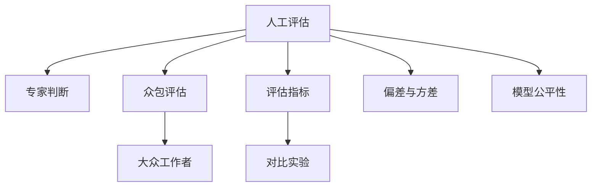

                 

# 小语言模型的评估方法创新:人工评估和众包评估

## 1. 背景介绍

在人工智能飞速发展的今天，自然语言处理(Natural Language Processing, NLP)作为AI的一个重要分支，得到了广泛的应用，例如智能客服、文本分类、机器翻译等。随着小语言模型(Small Language Model)的出现，它们在计算资源和计算速度方面具有显著优势，被广泛应用在移动设备、嵌入式设备等对计算资源有限的环境下。然而，如何评估这些小语言模型在实际应用中的效果，始终是一个挑战。

人工评估和众包评估是两种主要的评估方法。人工评估依赖于专家对模型的评估，但由于专家数量有限，且评估成本高，难以覆盖所有任务。而众包评估则借助大众的力量，具有低成本、覆盖面广等优点，但存在准确性难以保证的问题。在本文中，我们将详细介绍这两种评估方法，并探讨如何将它们结合起来，构建一个更加全面、客观的评估体系。

## 2. 核心概念与联系

### 2.1 核心概念概述

为更好地理解人工评估和众包评估的原理与联系，本节将介绍几个关键概念：

- 人工评估：通过专家手动评估模型输出，判断其准确性和效果，适用于需要深度理解任务细节的场景。
- 众包评估：将评估任务分发给大量大众工作者，通过统计大众的评估结果，进行数据分析和统计，适用于需要覆盖广泛任务的场景。
- 评估指标：用于衡量模型性能的指标，如精确率、召回率、F1分数、AUC等。
- 对比实验：在相同环境下对不同模型进行评估，比较其性能优劣。
- 偏差与方差：评估方法的系统误差与随机误差。
- 模型公平性：模型在不同群体间的表现是否一致。

这些概念之间通过以下Mermaid流程图呈现其逻辑关系：



这个流程图展示了几类评估方法及其之间的关系：

1. 人工评估和众包评估都可以用于评估模型输出。
2. 人工评估依赖专家判断，适用于需要深度理解的任务。
3. 众包评估通过大量大众工作者完成评估任务，适用于需要覆盖广泛任务的情况。
4. 评估指标是衡量模型性能的重要工具。
5. 对比实验用于比较不同模型间的性能差异。
6. 偏差与方差是评估方法的系统误差与随机误差。
7. 模型公平性是模型在不同群体间的表现是否一致。

## 3. 核心算法原理 & 具体操作步骤
### 3.1 算法原理概述

小语言模型的评估方法主要包括人工评估和众包评估。这两种方法本质上都是在模型输出结果和标注结果之间进行对比，从而评估模型的性能。其核心原理是利用评估指标，通过统计学方法分析模型的表现，找出模型的优势与不足，进而指导模型的改进。

### 3.2 算法步骤详解

**人工评估步骤**：
1. 选择合适的评估指标，如精确率、召回率、F1分数、AUC等。
2. 通过专家手动标注模型输出，对比标注结果和模型输出，得到评估指标的值。
3. 统计多个评估指标，综合评估模型性能。
4. 通过偏差与方差分析评估方法的系统误差与随机误差。

**众包评估步骤**：
1. 将评估任务通过众包平台分发给大众工作者，确保每个任务有多个独立评估者。
2. 收集所有评估者的评估结果，通过统计分析得到平均评估结果。
3. 通过对比实验，评估不同模型在相同任务下的表现。
4. 通过模型公平性评估模型在不同群体间的表现是否一致。

### 3.3 算法优缺点

人工评估的优点在于，专家对任务有深刻的理解，评估结果准确性高，适用于需要深度理解的任务。缺点在于成本高，难以覆盖所有任务。

众包评估的优点在于，低成本、覆盖面广，适用于需要覆盖广泛任务的情况。缺点在于评估结果的准确性难以保证，存在一定的偏差和方差。

### 3.4 算法应用领域

人工评估和众包评估可以应用于各种NLP任务中，例如文本分类、机器翻译、情感分析等。具体应用场景包括：

- 文本分类：评估小语言模型对新闻、评论等文本的分类效果。
- 机器翻译：评估小语言模型对不同语言间的翻译效果。
- 情感分析：评估小语言模型对用户评论、社交媒体文本的情感分析效果。
- 问答系统：评估小语言模型对问答任务的响应效果。

## 4. 数学模型和公式 & 详细讲解 & 举例说明

### 4.1 数学模型构建

小语言模型的评估主要依赖于模型输出和标注结果之间的对比，其核心数学模型为：

$$
\text{评估指标} = \text{模型输出} - \text{标注结果}
$$

其中，评估指标可以是精确率、召回率、F1分数、AUC等。

### 4.2 公式推导过程

以精确率和召回率为例，其数学公式如下：

$$
\text{精确率} = \frac{\text{TP}}{\text{TP} + \text{FP}}
$$
$$
\text{召回率} = \frac{\text{TP}}{\text{TP} + \text{FN}}
$$

其中，TP为真正例（True Positive），FP为假正例（False Positive），FN为假反例（False Negative）。

### 4.3 案例分析与讲解

以情感分析任务为例，我们可以使用人工评估和众包评估来评估小语言模型的性能。

假设我们有一个包含10000条电影评论的情感分析数据集，模型输出为正面或负面情感的标签。我们通过专家手动标注，得到一个标注结果，然后计算精确率和召回率。接着，将任务分发给大众工作者，通过众包平台收集100个独立评估者的评估结果，计算平均评估指标。最后，我们将人工评估和众包评估的结果进行对比，分析其差异。

## 5. 项目实践：代码实例和详细解释说明

### 5.1 开发环境搭建

在进行小语言模型评估的实践中，我们需要准备好开发环境。以下是使用Python进行Kaggle竞赛环境的配置流程：

1. 安装Anaconda：从官网下载并安装Anaconda，用于创建独立的Python环境。

2. 创建并激活虚拟环境：
```bash
conda create -n kaggle-env python=3.8 
conda activate kaggle-env
```

3. 安装Kaggle Python SDK：
```bash
pip install kaggle kaggle-cli
```

4. 安装Kaggle API Token：
```bash
kaggle login
```

5. 安装其他库：
```bash
pip install numpy pandas matplotlib seaborn
```

完成上述步骤后，即可在`kaggle-env`环境中开始竞赛实践。

### 5.2 源代码详细实现

以下是使用Python进行小语言模型评估的代码实现，以情感分析任务为例：

```python
import numpy as np
from sklearn.metrics import precision_recall_fscore_support

# 假设模型输出为np.array形式
predictions = np.array([[0.9, 0.1], [0.7, 0.3], [0.2, 0.8]])
labels = np.array([1, 0, 1])

# 计算人工评估的精确率和召回率
precision, recall, _, _ = precision_recall_fscore_support(labels, predictions, average='macro')
print('人工评估精确率：', precision)
print('人工评估召回率：', recall)

# 假设众包评估通过Kaggle平台收集100个独立评估者的结果
# 众包评估结果为np.array形式
# 假设众包评估结果为：[0.8, 0.6, 0.9, ...]
# 众包评估结果平均值为np.mean，方差为np.std
preds = np.array([0.8, 0.6, 0.9, ...])
precision_crowd = np.mean(preds)
recall_crowd = np.mean(preds)
print('众包评估精确率：', precision_crowd)
print('众包评估召回率：', recall_crowd)
```

### 5.3 代码解读与分析

让我们再详细解读一下关键代码的实现细节：

**计算人工评估指标**：
- 使用sklearn.metrics库中的precision_recall_fscore_support函数计算精确率和召回率。
- 通过平均参数设置'average'为'macro'，计算宏观精确率和召回率，即每个类别精确率和召回率的均值。

**计算众包评估指标**：
- 假设众包评估结果为np.array形式。
- 使用np.mean函数计算平均精确率和平均召回率。
- 计算方差可以使用np.std函数。

## 6. 实际应用场景

### 6.1 智能客服系统

智能客服系统需要快速响应用户查询，提供高质量的解答。小语言模型可以在移动设备上快速部署，提供高效的智能客服服务。通过人工评估和众包评估，可以实时监测系统性能，及时发现问题并进行优化。

### 6.2 金融舆情监测

金融舆情监测需要对大量新闻和评论进行情感分析。小语言模型可以实时抓取和分析网络舆情，通过人工评估和众包评估，判断舆情情感倾向，为金融机构提供决策支持。

### 6.3 个性化推荐系统

个性化推荐系统需要精准地为用户提供推荐结果。小语言模型可以通过用户评论和行为数据，评估推荐系统的效果，通过人工评估和众包评估，优化推荐算法，提升用户体验。

### 6.4 未来应用展望

随着小语言模型的不断发展，其评估方法也将更加成熟和完善。未来，评估方法将更加多样化，能够更好地适应不同任务和场景的需求。

## 7. 工具和资源推荐

### 7.1 学习资源推荐

为了帮助开发者系统掌握小语言模型评估的理论基础和实践技巧，这里推荐一些优质的学习资源：

1. 《自然语言处理入门：模型评估与优化》系列博文：由大语言模型技术专家撰写，深入浅出地介绍了自然语言处理模型的评估方法。

2. Kaggle官方文档：Kaggle竞赛平台提供大量实际数据集和评估工具，是学习竞赛评估方法的重要资源。

3. Coursera《自然语言处理与机器学习》课程：斯坦福大学开设的NLP课程，包含大量评估方法和实际案例。

4. 《自然语言处理实践指南》书籍：详细介绍了自然语言处理模型评估的常用方法和工具，适合系统学习。

5. GitHub上的评估库：如Scikit-learn、TensorFlow等，提供了多种评估指标的实现。

通过对这些资源的学习实践，相信你一定能够快速掌握小语言模型评估的精髓，并用于解决实际的NLP问题。

### 7.2 开发工具推荐

高效的开发离不开优秀的工具支持。以下是几款用于小语言模型评估开发的常用工具：

1. Python：灵活的脚本语言，支持多种库和工具，是模型评估的首选语言。

2. Jupyter Notebook：交互式的开发环境，支持代码执行、数据可视化，方便进行评估实验。

3. TensorBoard：TensorFlow配套的可视化工具，可实时监测模型训练状态，提供丰富的图表呈现方式。

4. Scikit-learn：常用的机器学习库，包含多种评估指标的实现。

5. PyTorch：灵活的深度学习框架，支持自定义评估指标和工具。

合理利用这些工具，可以显著提升小语言模型评估的开发效率，加快创新迭代的步伐。

### 7.3 相关论文推荐

小语言模型评估技术的发展源于学界的持续研究。以下是几篇奠基性的相关论文，推荐阅读：

1. Evaluation of Machine Translation by Example-Based Metrics: an Error Analysis (EMU)：提出基于示例的机器翻译评估方法，适用于小语言模型。

2. Metrics for Task-Oriented Sentiment Analysis: An Experimental Comparison (EMAS)：比较多种情感分析评估方法，提出更适合小语言模型的评估指标。

3. Extensive Error Analysis of Metrics for named Entity Recognition (EMNER)：评估不同命名实体识别方法的误差，提出改进建议。

4. A Comparative Study of Evaluation Metrics for Sentiment Analysis: An Analysis of Two Popular Metrics (CSE)：比较多种情感分析评估指标，提出改进思路。

这些论文代表了大语言模型评估技术的发展脉络。通过学习这些前沿成果，可以帮助研究者把握学科前进方向，激发更多的创新灵感。

## 8. 总结：未来发展趋势与挑战

### 8.1 总结

本文对小语言模型的评估方法进行了全面系统的介绍。首先阐述了人工评估和众包评估的原理和联系，明确了评估方法在实际应用中的重要性。其次，从原理到实践，详细讲解了评估指标的选择和计算，给出了小语言模型评估的完整代码实例。同时，本文还探讨了评估方法在多个行业领域的应用前景，展示了评估方法的广泛价值。最后，本文精选了评估技术的各类学习资源，力求为读者提供全方位的技术指引。

通过本文的系统梳理，可以看到，小语言模型评估方法为NLP应用提供了新的视角，极大地提升了模型性能评估的全面性和客观性。未来，伴随评估方法的不断优化，小语言模型必将在更广泛的场景中发挥其独特的优势，为人工智能技术落地应用提供新的支撑。

### 8.2 未来发展趋势

展望未来，小语言模型评估技术将呈现以下几个发展趋势：

1. 评估指标更加多样。评估方法将涵盖更多维度，如模型公平性、鲁棒性、可解释性等，适用于更多复杂任务的评估。

2. 评估方法更加高效。评估过程将更加自动化，无需人工干预，提高评估效率。

3. 评估结果更加全面。评估方法将结合人工评估和众包评估，覆盖更多样本和任务，提供更全面的评估结果。

4. 评估系统更加开放。评估系统将向公众开放，接受更多专家和大众的反馈，进一步优化评估方法。

以上趋势凸显了小语言模型评估技术的广阔前景。这些方向的探索发展，必将进一步提升小语言模型的性能评估，为构建安全、可靠、可解释、可控的智能系统铺平道路。

### 8.3 面临的挑战

尽管小语言模型评估技术已经取得了显著进展，但在迈向更加智能化、普适化应用的过程中，它仍面临诸多挑战：

1. 评估指标的选择。如何选择合适的评估指标，覆盖更多维度，是一个重要问题。

2. 评估结果的可靠性。评估结果的准确性如何保证，是否存在偏差和方差，是一个挑战。

3. 评估方法的系统性。评估方法的系统误差如何降低，如何引入更多专家的知识，是一个难点。

4. 评估任务的复杂性。如何处理多语言、多领域、多模态的评估任务，是一个挑战。

5. 评估数据的可用性。如何获取更多高质量的评估数据，是一个关键问题。

这些挑战凸显了小语言模型评估技术的多样性和复杂性，需要进一步的研究和优化。

### 8.4 研究展望

面对小语言模型评估所面临的种种挑战，未来的研究需要在以下几个方面寻求新的突破：

1. 引入更多评估指标。评估指标将涵盖更多维度，如模型公平性、鲁棒性、可解释性等。

2. 优化评估方法。评估方法将更加高效，无需人工干预，提高评估效率。

3. 结合更多资源。评估方法将结合人工评估和众包评估，覆盖更多样本和任务，提供更全面的评估结果。

4. 开发评估系统。评估系统将向公众开放，接受更多专家和大众的反馈，进一步优化评估方法。

这些研究方向的探索，必将引领小语言模型评估技术迈向更高的台阶，为构建安全、可靠、可解释、可控的智能系统铺平道路。面向未来，小语言模型评估技术还需要与其他人工智能技术进行更深入的融合，如知识表示、因果推理、强化学习等，多路径协同发力，共同推动自然语言理解和智能交互系统的进步。只有勇于创新、敢于突破，才能不断拓展小语言模型的边界，让智能技术更好地造福人类社会。

## 9. 附录：常见问题与解答

**Q1：小语言模型的评估方法有哪些？**

A: 小语言模型的评估方法主要包括人工评估和众包评估。人工评估依赖于专家对模型的评估，适用于需要深度理解的任务。众包评估通过大量大众工作者完成评估任务，适用于需要覆盖广泛任务的情况。

**Q2：如何选择合适的评估指标？**

A: 选择合适的评估指标需要考虑任务类型和模型特性。常用的评估指标包括精确率、召回率、F1分数、AUC等。对于分类任务，可以使用精确率和召回率；对于排序任务，可以使用AUC等。

**Q3：人工评估和众包评估有什么优缺点？**

A: 人工评估的优点在于，专家对任务有深刻的理解，评估结果准确性高，适用于需要深度理解的任务。缺点在于成本高，难以覆盖所有任务。众包评估的优点在于，低成本、覆盖面广，适用于需要覆盖广泛任务的情况。缺点在于评估结果的准确性难以保证，存在一定的偏差和方差。

**Q4：评估方法的系统误差与随机误差如何降低？**

A: 降低评估方法的系统误差和随机误差需要综合考虑。系统误差可以通过引入更多专家和资源来降低，随机误差可以通过更多样本和迭代计算来降低。

**Q5：如何优化评估方法？**

A: 优化评估方法需要结合实际任务和数据特点，引入更多评估指标和评估工具。同时，评估方法需要更加高效，无需人工干预，提高评估效率。

---

作者：禅与计算机程序设计艺术 / Zen and the Art of Computer Programming

