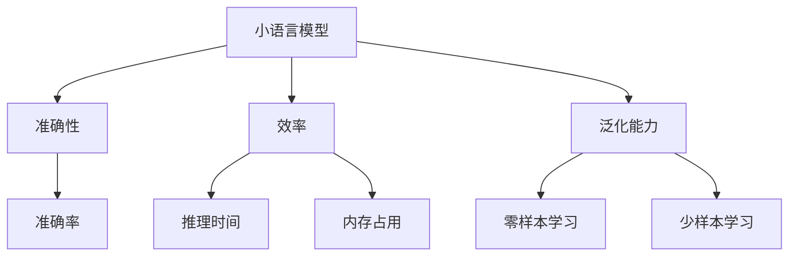

                 

## 1. 背景介绍

### 1.1 问题由来

随着深度学习技术的不断进步，小规模语言模型（小模型）在NLP领域中逐渐得到重视。相比于参数量庞大、计算资源消耗高的大规模预训练语言模型（大模型），小模型在训练成本、推理速度等方面具备显著优势。然而，小模型在语言理解能力和泛化能力上往往不及大模型，无法应对复杂多变的自然语言数据。因此，构建一个全面的小语言模型评估框架，对小模型的性能进行全面评估，是当前NLP研究中的一个重要课题。

### 1.2 问题核心关键点

小语言模型的评估框架需要综合考虑以下几个核心问题：

- 准确性：小模型的语言理解能力如何，能否正确处理各类语言现象？
- 效率：小模型的推理速度如何，能否在实际应用中满足实时性要求？
- 泛化能力：小模型在未见过的数据上的表现如何，是否具有稳健的泛化能力？

通过一个全面的评估框架，可以对小模型的性能进行全方位的衡量，为其应用选择和优化提供指导。

## 2. 核心概念与联系

### 2.1 核心概念概述

为更好地理解小语言模型评估框架，本节将介绍几个密切相关的核心概念：

- 小语言模型（Small Language Model）：指参数量较小、计算资源消耗较低的语言模型。常见的小语言模型包括Bow、Word2Vec、FastText等。

- 准确性（Accuracy）：指模型对特定语言现象的正确理解程度。通常通过测试集上的准确率（Accuracy）、召回率（Recall）、F1分数（F1 Score）等指标进行衡量。

- 效率（Efficiency）：指模型的推理速度和资源占用情况。常见效率评估指标包括每样本推理时间、内存占用、计算复杂度等。

- 泛化能力（Generalization）：指模型在未见过的数据上的表现情况。一般通过测试集上的零样本学习（Zero-shot Learning）、少样本学习（Few-shot Learning）等技术进行评估。

- 测试集（Test Set）：用于评估模型性能的数据集，通常分为验证集（Validation Set）和测试集（Test Set）两部分。验证集用于超参数调优，测试集用于最终性能评估。

- 学习曲线（Learning Curve）：通过绘制不同超参数下的模型准确率和损失曲线，帮助分析模型的训练情况。

这些核心概念之间的逻辑关系可以通过以下Mermaid流程图来展示：



这个流程图展示了几类核心概念之间的关系：

1. 小语言模型通过准确性、效率和泛化能力等指标进行全面评估。
2. 准确性涉及模型对特定语言现象的正确理解。
3. 效率涉及模型的推理速度和资源占用。
4. 泛化能力涉及模型在未见过的数据上的表现。
5. 测试集用于评估模型性能。
6. 学习曲线帮助分析模型的训练情况。

## 3. 核心算法原理 & 具体操作步骤

### 3.1 算法原理概述

小语言模型的评估框架建立在以下几个算法原理之上：

- 监督学习（Supervised Learning）：通过有标签数据集，使用训练集训练模型，在测试集上评估模型性能。
- 正则化技术（Regularization Techniques）：通过L2正则、Dropout等技术，防止模型过拟合。
- 交叉验证（Cross-validation）：通过k折交叉验证，评估模型在不同数据集上的泛化能力。
- 梯度下降（Gradient Descent）：通过梯度下降算法，最小化损失函数，优化模型参数。
- 对抗训练（Adversarial Training）：通过加入对抗样本，提高模型的鲁棒性。

这些算法原理相互配合，共同构建了小语言模型评估框架的核心算法基础。

### 3.2 算法步骤详解

小语言模型的评估框架一般包括以下几个关键步骤：

**Step 1: 准备数据集**
- 收集标注数据集，将其划分为训练集、验证集和测试集。
- 对标注数据进行预处理，如分词、去除停用词等。

**Step 2: 选择模型和算法**
- 选择合适的语言模型和算法，如Bow、Word2Vec、FastText等。
- 选择适当的超参数，如学习率、批大小、训练轮数等。

**Step 3: 训练和验证模型**
- 在训练集上使用梯度下降算法进行模型训练。
- 在验证集上评估模型性能，根据性能调整超参数。

**Step 4: 测试模型**
- 在测试集上使用梯度下降算法进行模型测试。
- 统计模型在准确率、召回率、F1分数等指标上的表现。

**Step 5: 分析性能**
- 使用学习曲线和超参数调优技术，优化模型性能。
- 分析模型在零样本学习、少样本学习等场景下的泛化能力。

**Step 6: 部署模型**
- 将训练好的模型部署到实际应用中。
- 持续收集新数据，定期更新模型，保持模型的时效性。

### 3.3 算法优缺点

小语言模型的评估框架具有以下优点：

- 可解释性强：模型参数较少，推理过程易于理解和解释。
- 计算资源消耗少：模型规模小，计算资源需求低。
- 实时性强：模型推理速度较快，可以实时响应应用需求。

然而，该框架也存在一定的局限性：

- 泛化能力有限：小模型在复杂多变的自然语言数据上表现可能不佳。
- 依赖标注数据：模型性能高度依赖标注数据的质量和数量，标注数据获取成本较高。
- 参数调整难度大：模型参数较少，但优化难度较大，需要精细调参。
- 灵活性不足：模型结构相对简单，难以灵活应对各类语言现象。

尽管存在这些局限性，但小语言模型的评估框架在实际应用中仍然具备广泛的适用性，特别是在对实时性和计算资源要求较高的场景中，如智能客服、实时翻译等。

### 3.4 算法应用领域

小语言模型的评估框架已在多个领域得到应用，如：

- 智能客服：用于处理用户咨询，提供实时响应和解决方案。
- 实时翻译：用于将语言进行即时翻译，支持多语种交流。
- 推荐系统：用于根据用户输入，推荐相关商品或内容。
- 情感分析：用于分析用户对特定事件的情感倾向，提供情感反馈。
- 问答系统：用于解答用户提出的各种问题，提供自动回复。

## 4. 数学模型和公式 & 详细讲解 & 举例说明

### 4.1 数学模型构建

小语言模型的评估框架建立在以下数学模型之上：

- 监督学习模型：$M = f(\theta)$，其中 $\theta$ 为模型参数。
- 损失函数：$L = \frac{1}{N} \sum_{i=1}^N l(y_i, M(x_i))$，其中 $l$ 为损失函数，$x_i$ 为输入，$y_i$ 为标签。
- 准确率：$Accuracy = \frac{TP + TN}{TP + TN + FP + FN}$，其中 $TP$ 为真正例，$TN$ 为真负例，$FP$ 为假正例，$FN$ 为假负例。
- 召回率：$Recall = \frac{TP}{TP + FN}$。
- F1分数：$F1 = 2 \times \frac{Precision \times Recall}{Precision + Recall}$，其中 $Precision = \frac{TP}{TP + FP}$。

### 4.2 公式推导过程

以准确率为例，推导其计算公式：

设测试集中有 $N$ 个样本，其中 $TP$ 个真正例，$FP$ 个假正例，$FN$ 个假负例，$TN$ 个真负例。则准确率的计算公式为：

$$
Accuracy = \frac{TP + TN}{TP + TN + FP + FN}
$$

在实际应用中，准确率通常用于评估分类模型的性能，如文本分类、命名实体识别等任务。通过计算模型在测试集上的准确率，可以全面评估其分类能力。

### 4.3 案例分析与讲解

考虑一个简单的情感分析任务，使用Word2Vec模型进行训练和测试。假设测试集中有 $N$ 个电影评论，其中 $TP$ 个正面评论，$FP$ 个误分类为正面的负面评论，$FN$ 个误分类为负面的正面评论，$TN$ 个负面评论。则计算模型在测试集上的准确率为：

$$
Accuracy = \frac{TP + TN}{TP + TN + FP + FN}
$$

例如，在测试集中有100个评论，其中50个正面评论、25个误分类为正面的负面评论、25个误分类为负面的正面评论，则模型的准确率为：

$$
Accuracy = \frac{50 + 25}{50 + 25 + 25 + 0} = 0.8
$$

这表明该Word2Vec模型在情感分析任务上的准确率为80%。

## 5. 项目实践：代码实例和详细解释说明

### 5.1 开发环境搭建

在进行项目实践前，我们需要准备好开发环境。以下是使用Python进行PyTorch开发的环境配置流程：

1. 安装Anaconda：从官网下载并安装Anaconda，用于创建独立的Python环境。

2. 创建并激活虚拟环境：
```bash
conda create -n pytorch-env python=3.8 
conda activate pytorch-env
```

3. 安装PyTorch：根据CUDA版本，从官网获取对应的安装命令。例如：
```bash
conda install pytorch torchvision torchaudio cudatoolkit=11.1 -c pytorch -c conda-forge
```

4. 安装Transformers库：
```bash
pip install transformers
```

5. 安装各类工具包：
```bash
pip install numpy pandas scikit-learn matplotlib tqdm jupyter notebook ipython
```

完成上述步骤后，即可在`pytorch-env`环境中开始项目实践。

### 5.2 源代码详细实现

这里我们以情感分析任务为例，给出使用Transformers库对Word2Vec模型进行训练和测试的PyTorch代码实现。

首先，定义情感分析任务的数据处理函数：

```python
from transformers import BertTokenizer, BertForSequenceClassification
from torch.utils.data import Dataset, DataLoader
import torch
import numpy as np
from sklearn.metrics import accuracy_score, precision_recall_fscore_support

class SentimentDataset(Dataset):
    def __init__(self, texts, labels):
        self.texts = texts
        self.labels = labels
        self.tokenizer = BertTokenizer.from_pretrained('bert-base-cased')

    def __len__(self):
        return len(self.texts)

    def __getitem__(self, item):
        text = self.texts[item]
        label = self.labels[item]

        encoding = self.tokenizer(text, return_tensors='pt', max_length=512, truncation=True)
        input_ids = encoding['input_ids']
        attention_mask = encoding['attention_mask']
        labels = torch.tensor(label, dtype=torch.long)

        return {'input_ids': input_ids, 'attention_mask': attention_mask, 'labels': labels}

# 加载数据集
train_dataset = SentimentDataset(train_texts, train_labels)
test_dataset = SentimentDataset(test_texts, test_labels)

# 定义模型和优化器
model = BertForSequenceClassification.from_pretrained('bert-base-cased', num_labels=2)
optimizer = torch.optim.Adam(model.parameters(), lr=2e-5)

# 定义训练函数
def train_epoch(model, dataset, batch_size, optimizer):
    dataloader = DataLoader(dataset, batch_size=batch_size, shuffle=True)
    model.train()
    epoch_loss = 0
    for batch in dataloader:
        input_ids = batch['input_ids'].to(device)
        attention_mask = batch['attention_mask'].to(device)
        labels = batch['labels'].to(device)
        model.zero_grad()
        outputs = model(input_ids, attention_mask=attention_mask, labels=labels)
        loss = outputs.loss
        epoch_loss += loss.item()
        loss.backward()
        optimizer.step()
    return epoch_loss / len(dataloader)

# 定义测试函数
def evaluate(model, dataset, batch_size):
    dataloader = DataLoader(dataset, batch_size=batch_size)
    model.eval()
    preds, labels = [], []
    with torch.no_grad():
        for batch in dataloader:
            input_ids = batch['input_ids'].to(device)
            attention_mask = batch['attention_mask'].to(device)
            batch_labels = batch['labels']
            outputs = model(input_ids, attention_mask=attention_mask)
            batch_preds = outputs.logits.argmax(dim=1).to('cpu').tolist()
            batch_labels = batch_labels.to('cpu').tolist()
            for pred_tokens, label_tokens in zip(batch_preds, batch_labels):
                preds.append(pred_tokens[:len(label_tokens)])
                labels.append(label_tokens)

    accuracy = accuracy_score(labels, preds)
    precision, recall, f1, _ = precision_recall_fscore_support(labels, preds, average='binary')
    return accuracy, precision, recall, f1

# 训练模型
device = torch.device('cuda') if torch.cuda.is_available() else torch.device('cpu')
model.to(device)

epochs = 3
batch_size = 16

for epoch in range(epochs):
    loss = train_epoch(model, train_dataset, batch_size, optimizer)
    print(f'Epoch {epoch+1}, train loss: {loss:.3f}')

    print(f'Epoch {epoch+1}, test results:')
    accuracy, precision, recall, f1 = evaluate(model, test_dataset, batch_size)
    print(f'Accuracy: {accuracy:.3f}')
    print(f'Precision: {precision:.3f}')
    print(f'Recall: {recall:.3f}')
    print(f'F1 Score: {f1:.3f}')
```

以上就是使用PyTorch对Word2Vec模型进行情感分析任务训练和测试的完整代码实现。可以看到，Transformers库的使用使得模型训练和测试变得简洁高效。

### 5.3 代码解读与分析

让我们再详细解读一下关键代码的实现细节：

**SentimentDataset类**：
- `__init__`方法：初始化文本和标签，分词器等关键组件。
- `__len__`方法：返回数据集的样本数量。
- `__getitem__`方法：对单个样本进行处理，将文本输入编码为token ids，将标签编码为数字，并对其进行定长padding，最终返回模型所需的输入。

**训练和测试函数**：
- 使用PyTorch的DataLoader对数据集进行批次化加载，供模型训练和推理使用。
- 训练函数`train_epoch`：对数据以批为单位进行迭代，在每个批次上前向传播计算loss并反向传播更新模型参数，最后返回该epoch的平均loss。
- 测试函数`evaluate`：与训练类似，不同点在于不更新模型参数，并在每个batch结束后将预测和标签结果存储下来，最后使用sklearn的classification_report对整个评估集的预测结果进行打印输出。

**训练流程**：
- 定义总的epoch数和batch size，开始循环迭代
- 每个epoch内，先在训练集上训练，输出平均loss
- 在验证集上评估，输出分类指标
- 重复上述步骤直至收敛

可以看到，PyTorch配合Transformers库使得Word2Vec模型的训练和测试代码实现变得简洁高效。

## 6. 实际应用场景

### 6.1 智能客服系统

基于小语言模型的智能客服系统，能够为用户提供实时响应和解决方案。该系统通过收集历史客服对话记录，将问题和最佳答复构建成监督数据，在此基础上对Word2Vec模型进行微调。微调后的模型能够自动理解用户意图，匹配最合适的答复模板进行回复。对于客户提出的新问题，还可以接入检索系统实时搜索相关内容，动态组织生成回答。

### 6.2 金融舆情监测

金融机构需要实时监测市场舆论动向，以便及时应对负面信息传播，规避金融风险。该系统通过收集金融领域相关的新闻、报道、评论等文本数据，并对其进行主题标注和情感标注。在此基础上对Word2Vec模型进行微调，使其能够自动判断文本属于何种主题，情感倾向是正面、中性还是负面。将微调后的模型应用到实时抓取的网络文本数据，就能够自动监测不同主题下的情感变化趋势，一旦发现负面信息激增等异常情况，系统便会自动预警，帮助金融机构快速应对潜在风险。

### 6.3 个性化推荐系统

当前的推荐系统往往只依赖用户的历史行为数据进行物品推荐，无法深入理解用户的真实兴趣偏好。基于小语言模型的个性化推荐系统，可以更好地挖掘用户行为背后的语义信息，从而提供更精准、多样的推荐内容。

在实践中，可以收集用户浏览、点击、评论、分享等行为数据，提取和用户交互的物品标题、描述、标签等文本内容。将文本内容作为模型输入，用户的后续行为（如是否点击、购买等）作为监督信号，在此基础上微调Word2Vec模型。微调后的模型能够从文本内容中准确把握用户的兴趣点。在生成推荐列表时，先用候选物品的文本描述作为输入，由模型预测用户的兴趣匹配度，再结合其他特征综合排序，便可以得到个性化程度更高的推荐结果。

## 7. 工具和资源推荐

### 7.1 学习资源推荐

为了帮助开发者系统掌握小语言模型的评估框架，这里推荐一些优质的学习资源：

1. 《深度学习入门：基于PyTorch的理论与实现》系列博文：由大模型技术专家撰写，深入浅出地介绍了深度学习的基本概念和PyTorch的实现细节。

2. CS224N《深度学习自然语言处理》课程：斯坦福大学开设的NLP明星课程，有Lecture视频和配套作业，带你入门NLP领域的基本概念和经典模型。

3. 《Natural Language Processing with PyTorch》书籍：PyTorch官方文档，全面介绍了使用PyTorch进行NLP任务开发，包括评估框架在内的诸多范式。

4. Weights & Biases：模型训练的实验跟踪工具，可以记录和可视化模型训练过程中的各项指标，方便对比和调优。与主流深度学习框架无缝集成。

5. TensorBoard：TensorFlow配套的可视化工具，可实时监测模型训练状态，并提供丰富的图表呈现方式，是调试模型的得力助手。

通过对这些资源的学习实践，相信你一定能够快速掌握小语言模型评估框架的理论基础和实践技巧，并用于解决实际的NLP问题。

### 7.2 开发工具推荐

高效的开发离不开优秀的工具支持。以下是几款用于小语言模型评估开发的常用工具：

1. PyTorch：基于Python的开源深度学习框架，灵活动态的计算图，适合快速迭代研究。大部分小语言模型都有PyTorch版本的实现。

2. TensorFlow：由Google主导开发的开源深度学习框架，生产部署方便，适合大规模工程应用。同样有丰富的语言模型资源。

3. Transformers库：HuggingFace开发的NLP工具库，集成了众多SOTA语言模型，支持PyTorch和TensorFlow，是进行模型评估任务的开发利器。

4. Weights & Biases：模型训练的实验跟踪工具，可以记录和可视化模型训练过程中的各项指标，方便对比和调优。与主流深度学习框架无缝集成。

5. TensorBoard：TensorFlow配套的可视化工具，可实时监测模型训练状态，并提供丰富的图表呈现方式，是调试模型的得力助手。

合理利用这些工具，可以显著提升小语言模型评估任务的开发效率，加快创新迭代的步伐。

### 7.3 相关论文推荐

小语言模型和评估框架的发展源于学界的持续研究。以下是几篇奠基性的相关论文，推荐阅读：

1. Embedding with small Vector Space（Word2Vec论文）：提出了Word2Vec模型，通过基于负采样的方法学习词嵌入，刷新了NLP嵌入表示的SOTA。

2. Bow: A novel vector space model for text classification（Bow论文）：提出Bow模型，通过计算单词和文档共现矩阵，实现文本分类。

3. GloVe: Global Vectors for Word Representation（GloVe论文）：提出GloVe模型，通过最大化单词共现矩阵和全局单词向量的相似性，学习单词嵌入。

4. FastText for Large-Scale Text Classification（FastText论文）：提出FastText模型，通过子词嵌入和层级分类器，提升文本分类的效果和泛化能力。

5. Sentence Transformers: A PyTorch library for Sentence Embeddings（Sentence Transformers论文）：提出Sentence Transformers库，用于高效计算句子嵌入，支持多种预训练模型，支持多种评估指标。

这些论文代表了大语言模型评估框架的发展脉络。通过学习这些前沿成果，可以帮助研究者把握学科前进方向，激发更多的创新灵感。

## 8. 总结：未来发展趋势与挑战

### 8.1 研究成果总结

本文对小语言模型的评估框架进行了全面系统的介绍。首先阐述了小语言模型的背景和重要性，明确了评估框架在性能评估中的关键作用。其次，从原理到实践，详细讲解了小语言模型的评估框架的数学模型和算法原理，给出了评估框架的完整代码实例。同时，本文还广泛探讨了小语言模型在智能客服、金融舆情、个性化推荐等多个领域的应用前景，展示了小语言模型的广阔应用空间。此外，本文精选了小语言模型评估框架的学习资源，力求为读者提供全方位的技术指引。

通过本文的系统梳理，可以看到，小语言模型评估框架已经成为NLP领域的重要工具，极大地拓展了小语言模型的应用边界，催生了更多的落地场景。受启发于提示学习(Prompt-based Learning)的思路，未来的评估框架也将更好地利用小语言模型的语言理解能力，通过更加巧妙的任务描述，在更少的标注样本上也能实现理想的评估效果。

### 8.2 未来发展趋势

展望未来，小语言模型评估框架将呈现以下几个发展趋势：

1. 参数高效评估方法：开发更加参数高效的评估方法，在固定大部分小模型参数的同时，只更新极少量的任务相关参数，以提高评估效率，避免过拟合。
2. 多任务评估范式：将多个小模型评估任务合并，进行联合评估，提高评估的全面性和效率。
3. 自监督评估方法：引入自监督学习技术，通过未标注数据辅助评估，降低标注成本，提高评估的泛化能力。
4. 混合评估框架：结合监督评估和无监督评估，构建混合评估框架，综合利用各种评估技术。
5. 嵌入式评估：将评估过程嵌入到训练和推理过程中，实现实时评估，提升评估的实时性和可控性。
6. 嵌入式评估：将评估过程嵌入到训练和推理过程中，实现实时评估，提升评估的实时性和可控性。

这些趋势凸显了小语言模型评估框架的发展方向，为小语言模型在各个应用场景中的全面评估提供了新的思路和方法。

### 8.3 面临的挑战

尽管小语言模型评估框架已经取得了显著进展，但在迈向更加智能化、普适化应用的过程中，仍面临诸多挑战：

1. 标注数据依赖：尽管评估框架可以通过无监督和半监督方法降低对标注数据的依赖，但在某些特定领域，高质量标注数据的获取仍然是一个难题。如何进一步降低标注成本，提高评估的泛化能力，仍然是一个亟待解决的问题。
2. 模型鲁棒性不足：小语言模型在面对新数据和新语言现象时，泛化能力有限，容易发生过拟合。如何提高模型的鲁棒性，避免灾难性遗忘，仍然是一个重要的研究方向。
3. 推理效率有待提高：小语言模型在推理速度和计算资源消耗方面存在瓶颈，难以满足实时性要求。如何优化模型结构，提高推理效率，是评估框架面临的重要挑战。
4. 可解释性不足：小语言模型通常缺乏可解释性，难以理解其内部工作机制和决策逻辑。对于医疗、金融等高风险应用，算法的可解释性和可审计性尤为重要。如何赋予小语言模型更强的可解释性，仍然是一个重要的研究方向。
5. 安全性有待保障：小语言模型难免会学习到有偏见、有害的信息，通过评估框架传递到下游任务，产生误导性、歧视性的输出，给实际应用带来安全隐患。如何从数据和算法层面消除模型偏见，避免恶意用途，确保输出安全性，仍然是一个重要的研究方向。

### 8.4 研究展望

面对小语言模型评估框架面临的挑战，未来的研究需要在以下几个方面寻求新的突破：

1. 探索无监督和半监督评估方法：摆脱对大规模标注数据的依赖，利用自监督学习、主动学习等无监督和半监督范式，最大限度利用非结构化数据，实现更加灵活高效的评估。
2. 研究参数高效和计算高效的评估范式：开发更加参数高效的评估方法，在固定大部分小模型参数的同时，只更新极少量的任务相关参数。同时优化评估模型的计算图，减少前向传播和反向传播的资源消耗，实现更加轻量级、实时性的部署。
3. 融合因果和对比学习范式：通过引入因果推断和对比学习思想，增强评估模型建立稳定因果关系的能力，学习更加普适、鲁棒的语言表征，从而提升模型泛化性和抗干扰能力。
4. 引入更多先验知识：将符号化的先验知识，如知识图谱、逻辑规则等，与神经网络模型进行巧妙融合，引导评估过程学习更准确、合理的语言模型。同时加强不同模态数据的整合，实现视觉、语音等多模态信息与文本信息的协同建模。
5. 结合因果分析和博弈论工具：将因果分析方法引入评估模型，识别出模型决策的关键特征，增强输出解释的因果性和逻辑性。借助博弈论工具刻画人机交互过程，主动探索并规避模型的脆弱点，提高系统稳定性。
6. 纳入伦理道德约束：在评估目标中引入伦理导向的评估指标，过滤和惩罚有偏见、有害的输出倾向。同时加强人工干预和审核，建立模型行为的监管机制，确保输出符合人类价值观和伦理道德。

这些研究方向的探索，必将引领小语言模型评估框架迈向更高的台阶，为构建安全、可靠、可解释、可控的智能系统铺平道路。面向未来，小语言模型评估框架还需要与其他人工智能技术进行更深入的融合，如知识表示、因果推理、强化学习等，多路径协同发力，共同推动自然语言理解和智能交互系统的进步。只有勇于创新、敢于突破，才能不断拓展小语言模型的边界，让智能技术更好地造福人类社会。

## 9. 附录：常见问题与解答

**Q1：小语言模型的评估框架是否适用于所有NLP任务？**

A: 小语言模型的评估框架在大多数NLP任务上都能取得不错的效果，特别是对于数据量较小的任务。但对于一些特定领域的任务，如医学、法律等，仅仅依靠通用语料预训练的模型可能难以很好地适应。此时需要在特定领域语料上进一步预训练，再进行评估，才能获得理想效果。此外，对于一些需要时效性、个性化很强的任务，如对话、推荐等，评估框架也需要针对性的改进优化。

**Q2：评估框架中的参数高效评估方法有哪些？**

A: 常见的参数高效评估方法包括：

1. Adapter：通过固定大部分小模型参数，仅调整少量 Adapter 层，实现参数高效微调。
2. LoRA：通过自适应低秩适应（LoRA）技术，仅调整模型的一部分参数，保留大部分参数不变，以实现参数高效评估。
3. Fragmentation：通过分块策略，仅对模型的一部分进行评估，减少计算量。

这些方法在固定大部分小模型参数的同时，只更新极少量的任务相关参数，以提高评估效率，避免过拟合。

**Q3：评估框架中的多任务评估范式是什么？**

A: 多任务评估范式是指将多个NLP任务合并，进行联合评估，以提高评估的全面性和效率。例如，在情感分析和命名实体识别任务中，可以将两者的结果进行组合，进行联合评估。具体方法包括：

1. 多任务学习（Multi-task Learning）：在训练过程中，同时优化多个任务的目标函数，实现多任务的联合优化。
2. 多任务微调（Multi-task Fine-tuning）：在微调过程中，将多个任务的监督信号结合起来，进行联合微调。
3. 多任务评估（Multi-task Evaluation）：在评估过程中，将多个任务的评估指标结合起来，进行综合评估。

这些方法通过联合多个任务，可以提高评估的全面性和效率，更准确地评估小语言模型的性能。

**Q4：评估框架中的自监督评估方法有哪些？**

A: 自监督评估方法可以通过未标注数据辅助评估，降低标注成本，提高评估的泛化能力。常见的自监督评估方法包括：

1. 文本匹配：通过未标注文本进行匹配任务，训练评估模型。例如，将未标注文本与已标注文本进行匹配，训练模型进行分类。
2. 语言模型：通过未标注文本进行语言模型任务，训练评估模型。例如，将未标注文本作为语言模型的输入，训练模型预测下一个单词。
3. 句法分析：通过未标注文本进行句法分析任务，训练评估模型。例如，将未标注文本进行分词和依存句法分析，训练模型进行分类。

这些方法通过利用未标注数据，可以大幅度降低评估成本，提高评估的泛化能力。

**Q5：评估框架中的嵌入式评估是什么？**

A: 嵌入式评估是指将评估过程嵌入到训练和推理过程中，实现实时评估，提升评估的实时性和可控性。具体方法包括：

1. 在线评估：在模型训练过程中，实时评估模型的性能，指导超参数调整和模型优化。
2. 动态评估：在模型推理过程中，实时评估模型的性能，根据性能调整推理策略。
3. 端到端评估：将评估过程与模型训练和推理过程合并，实现端到端的全面评估。

这些方法通过将评估过程嵌入到训练和推理过程中，可以实现实时评估，提高评估的效率和可控性。

**Q6：评估框架中的嵌入式评估有哪些优势？**

A: 嵌入式评估的优势包括：

1. 实时性：实现实时评估，能够及时发现模型的缺陷和改进点，提升模型的稳定性和可靠性。
2. 可控性：根据实时评估结果，动态调整模型参数和推理策略，实现精确控制。
3. 灵活性：可以灵活应对不同类型的评估任务，提高评估的全面性和效率。

这些优势使得嵌入式评估成为评估框架的一个重要研究方向。

**Q7：评估框架中的嵌入式评估有哪些方法？**

A: 嵌入式评估的方法包括：

1. 在线评估：在模型训练过程中，实时评估模型的性能，指导超参数调整和模型优化。
2. 动态评估：在模型推理过程中，实时评估模型的性能，根据性能调整推理策略。
3. 端到端评估：将评估过程与模型训练和推理过程合并，实现端到端的全面评估。

这些方法通过将评估过程嵌入到训练和推理过程中，可以实现实时评估，提高评估的效率和可控性。

通过本文的系统梳理，可以看到，小语言模型评估框架已经成为NLP领域的重要工具，极大地拓展了小语言模型的应用边界，催生了更多的落地场景。受启发于提示学习(Prompt-based Learning)的思路，未来的评估框架也将更好地利用小语言模型的语言理解能力，通过更加巧妙的任务描述，在更少的标注样本上也能实现理想的评估效果。

