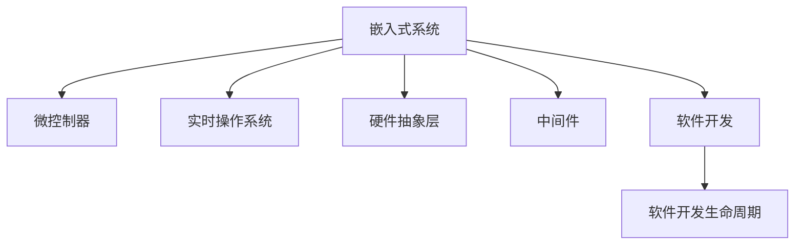

                 

# 嵌入式系统开发：智能设备的核心技术

> 关键词：嵌入式系统,智能设备,核心技术,开发工具,硬件设计,软件开发,应用场景

## 1. 背景介绍

随着物联网(IoT)和智能设备的普及，嵌入式系统在各个领域的应用日益广泛。从智能手机、智能家居到工业自动化，嵌入式系统无处不在。它们承担着数据采集、处理和响应的重要任务，是智能设备的核心技术之一。嵌入式系统的开发涉及硬件设计、软件开发和系统集成等多个环节，需要开发者具备扎实的硬件基础和丰富的软件开发经验。本文将详细介绍嵌入式系统开发的核心技术，包括硬件设计、软件开发和应用场景等，帮助读者全面掌握嵌入式系统开发的各项关键要素。

## 2. 核心概念与联系

### 2.1 核心概念概述

为了更好地理解嵌入式系统开发的核心技术，本节将介绍几个密切相关的核心概念：

- **嵌入式系统(Embedded System)**：以应用为中心，以计算机技术为基础，软件与硬件可裁剪，适应应用系统对功能、可靠性、成本、体积、功耗等严格要求的专用计算机系统。
- **微控制器(Microcontroller Unit, MCU)**：集成了CPU、RAM、ROM、I/O口等多种功能于一体的芯片，是嵌入式系统的核心部件之一。
- **实时操作系统(Real-Time Operating System, RTOS)**：一种专门用于实时应用的操作系统，具有快速响应和高可靠性，支持多任务并发。
- **硬件抽象层(Hardware Abstraction Layer, HAL)**：用于屏蔽底层硬件差异，提供统一的软件接口，便于软件跨平台移植和开发。
- **中间件(Middleware)**：介于应用软件和操作系统之间，提供通用的服务功能，如网络通信、数据存储、安全认证等。
- **软件开发生命周期(Software Development Lifecycle, SDLC)**：包括需求分析、设计、编码、测试、部署和维护等多个阶段，是软件开发的标准流程。

这些核心概念之间的逻辑关系可以通过以下Mermaid流程图来展示：



这个流程图展示了几大核心概念及其之间的关系：

1. 嵌入式系统由微控制器、实时操作系统、硬件抽象层、中间件和软件开发构成。
2. 微控制器是嵌入式系统的核心部件，提供计算和控制功能。
3. 实时操作系统保障系统的实时性，支持多任务并发。
4. 硬件抽象层屏蔽底层硬件差异，提供统一接口。
5. 中间件提供通用服务功能，便于系统集成。
6. 软件开发涉及需求分析、设计、编码等多个环节，遵循SDLC流程。

这些核心概念共同构成了嵌入式系统开发的理论框架，指导开发者进行系统的设计、开发和部署。

## 3. 核心算法原理 & 具体操作步骤

### 3.1 算法原理概述

嵌入式系统开发的核心算法原理主要涉及硬件设计、软件设计、系统集成等多个方面。本节将从这些角度详细阐述嵌入式系统开发的算法原理。

- **硬件设计**：包括电路设计、PCB布局、元器件选择等。硬件设计需要考虑系统性能、功耗、成本和可靠性等因素，采用数字逻辑设计、模拟电路设计和混合信号设计等多种方法。
- **软件设计**：包括需求分析、架构设计、编码实现和测试优化等。软件设计需要遵循可维护性、可扩展性和可重用性原则，采用模块化设计、面向对象设计和设计模式等方法。
- **系统集成**：包括硬件集成和软件集成。硬件集成需要确保各模块的功能正确和性能优化，软件集成需要确保各模块之间的接口兼容和协同工作。

### 3.2 算法步骤详解

嵌入式系统开发的具体操作步骤可以分为以下几个阶段：

**Step 1: 需求分析与系统设计**
- 收集用户需求和系统功能要求，确定嵌入式系统的硬件和软件需求。
- 选择合适的微控制器和实时操作系统，进行系统架构设计。
- 设计硬件电路和PCB布局，选择合适的元器件。

**Step 2: 硬件实现与测试**
- 实现硬件电路和PCB布局，进行硬件测试和调试。
- 进行硬件验证，确保系统可靠性和稳定性。

**Step 3: 软件实现与测试**
- 根据系统需求，设计软件架构和模块，实现软件功能。
- 进行软件编码和测试，确保软件功能正确和性能优化。

**Step 4: 系统集成与测试**
- 将硬件和软件进行集成，进行系统测试和调试。
- 确保系统功能完整和性能稳定，进行优化和改进。

**Step 5: 部署与维护**
- 将系统部署到目标设备上，进行系统维护和更新。
- 根据实际使用情况，进行系统优化和升级。

### 3.3 算法优缺点

嵌入式系统开发具备以下优点：

- **适应性强**：可以根据不同的应用场景进行硬件和软件设计，满足不同领域的需求。
- **高性能低功耗**：嵌入式系统的设计和实现通常注重性能和功耗的平衡，适合对能效有高要求的场景。
- **应用广泛**：嵌入式系统应用广泛，涉及工业自动化、消费电子、医疗设备等多个领域。

同时，嵌入式系统开发也存在以下缺点：

- **开发周期长**：嵌入式系统开发涉及硬件和软件多个环节，需要较长的开发周期。
- **调试复杂**：嵌入式系统通常结构复杂，调试过程中需要面对硬件和软件的多种问题。
- **资源限制**：嵌入式系统的资源有限，需要精确地控制存储、内存和计算资源的使用。

### 3.4 算法应用领域

嵌入式系统开发的应用领域非常广泛，涵盖了以下几大类：

- **消费电子**：智能手机、平板电脑、智能穿戴设备等。
- **工业自动化**：机器人、传感器、控制设备等。
- **医疗设备**：生命监测、手术设备、健康管理等。
- **汽车电子**：自动驾驶、车载娱乐、车联网等。
- **智能家居**：智能音箱、智能照明、智能锁等。
- **安全监控**：监控摄像头、门禁系统、网络安全设备等。
- **航空航天**：无人机、卫星控制、航天器等。

这些领域的应用展示了嵌入式系统开发的巨大潜力和广阔前景。

## 4. 数学模型和公式 & 详细讲解 & 举例说明

### 4.1 数学模型构建

嵌入式系统开发涉及许多数学模型，本节将介绍几个常用的数学模型及其构建方法。

- **控制模型**：用于描述嵌入式系统的控制过程，包括PID控制、自适应控制和模型预测控制等。
- **信号处理模型**：用于处理嵌入式系统中的信号，包括滤波、调制和解调等。
- **通信模型**：用于描述嵌入式系统中的通信过程，包括数据传输、路由和拥塞控制等。
- **优化模型**：用于优化嵌入式系统的性能，包括线性规划、整数规划和动态规划等。

### 4.2 公式推导过程

下面以PID控制模型为例，介绍控制模型的推导过程。

设被控对象的状态方程为：

$$
\dot{x}(t) = Ax(t) + Bu(t) + w(t)
$$

其中，$x(t)$ 为系统状态向量，$u(t)$ 为输入向量，$w(t)$ 为扰动向量。

PID控制器的控制律为：

$$
u(t) = Kp(e(t)) + Kd\dot{e}(t) + Kif(t)
$$

其中，$e(t) = r(t) - y(t)$ 为误差向量，$r(t)$ 为参考输入，$y(t)$ 为系统输出，$Kp$、$Kd$ 和 $Ki$ 为PID控制器的参数。

控制器的状态方程为：

$$
\dot{\theta}(t) = \frac{d}{dt}\begin{bmatrix} Kp & Kd & Ki \end{bmatrix}^T
$$

其中，$\theta(t)$ 为PID控制器的参数向量。

将状态方程代入控制器方程，得到：

$$
\dot{u}(t) = -(Kp+A)(x(t)-y(t))-Kd\dot{e}(t)-Kif(t)
$$

即为PID控制器的输出公式。

### 4.3 案例分析与讲解

假设一个无人机需要进行飞行控制，其控制模型可以表示为：

$$
\dot{x}(t) = A\begin{bmatrix} x(t) \\ y(t) \\ z(t) \end{bmatrix} + B\begin{bmatrix} \omega(t) \\ \alpha(t) \\ \theta(t) \end{bmatrix} + w(t)
$$

其中，$x(t)$ 为位置向量，$y(t)$ 为速度向量，$z(t)$ 为姿态向量，$\omega(t)$ 为角速度输入，$\alpha(t)$ 为加速度输入，$\theta(t)$ 为PID控制器参数。

通过构建PID控制模型，可以对无人机进行精确的控制，确保其在不同环境下的稳定性。

## 5. 项目实践：代码实例和详细解释说明

### 5.1 开发环境搭建

在进行嵌入式系统开发之前，需要先搭建开发环境。以下是使用Keil MDK进行ARM开发环境搭建的步骤：

1. 安装Keil MDK：从Keil官网下载并安装Keil MDK，这是一个常用的ARM开发环境。
2. 配置开发板：连接ARM开发板，打开Keil MDK，选择开发板对应的目标芯片。
3. 设置编译选项：配置编译器选项，如编译器路径、编译模式等。
4. 下载调试器：下载ARM调试器，如OpenOCD，连接调试器与开发板。
5. 连接USB调试：将开发板通过USB连接至计算机，打开Keil MDK，选择连接USB调试器。

完成上述步骤后，即可在Keil MDK中进行嵌入式系统开发。

### 5.2 源代码详细实现

下面以ARM开发环境为例，介绍ARM开发板上的简单程序实现。

首先，定义程序主函数：

```c
int main(void)
{
    // 初始化硬件设备
    // ...

    // 主循环
    while (1)
    {
        // 读取传感器数据
        // ...

        // 处理数据
        // ...

        // 输出控制命令
        // ...
    }

    // 返回0
    return 0;
}
```

然后，定义传感器读取函数：

```c
void read_sensor_data()
{
    // 读取传感器数据
    // ...
}
```

最后，定义数据处理函数和控制命令输出函数：

```c
void process_data()
{
    // 处理传感器数据
    // ...
}

void output_control_command()
{
    // 输出控制命令
    // ...
}
```

这些函数将依次连接起来，形成完整的嵌入式系统程序。

### 5.3 代码解读与分析

下面我们对关键代码的实现细节进行解读：

**read_sensor_data函数**：
- 读取传感器数据：使用I/O函数读取传感器数据。
- 处理数据：将传感器数据进行滤波、转换等处理。
- 输出控制命令：根据处理后的数据，生成控制命令并输出。

**process_data函数**：
- 处理传感器数据：对读取到的传感器数据进行处理，如去噪、滤波等。
- 生成控制命令：根据处理后的数据，生成控制命令。

**output_control_command函数**：
- 输出控制命令：将生成的控制命令输出至控制模块。

这些函数展示了嵌入式系统开发中常见的程序结构，开发者可以根据具体需求进行扩展和优化。

### 5.4 运行结果展示

运行嵌入式系统程序，可以通过串口调试或图形界面展示系统运行状态。例如，使用串口调试可以实时查看传感器数据和控制命令，确保系统的稳定性和准确性。

## 6. 实际应用场景

### 6.1 智能家居

智能家居系统通过嵌入式系统的控制和通信功能，实现对家居设备的远程控制和智能化管理。例如，智能音箱、智能灯泡、智能温控器等设备可以通过Wi-Fi或蓝牙与智能手机或智能控制中心进行通信，实现语音控制、场景模式设置等功能。

### 6.2 医疗设备

医疗设备中的嵌入式系统用于监控患者健康状态、处理传感器数据、输出控制命令等。例如，生命监测设备可以通过传感器实时监测患者的生理参数，如心率、血压等，通过嵌入式系统的控制算法进行异常判断和报警。

### 6.3 汽车电子

汽车电子中的嵌入式系统用于实现车辆的自动驾驶、车载娱乐、车联网等功能。例如，自动驾驶系统通过传感器获取周围环境信息，通过嵌入式系统的算法进行路径规划和控制，确保车辆安全行驶。

### 6.4 未来应用展望

随着技术的不断进步，嵌入式系统将迎来更广泛的应用场景和更高的技术要求。未来，嵌入式系统将朝着智能化、网络化、服务化方向发展，成为智能设备的核心技术之一。

- **智能化**：通过引入人工智能技术，嵌入式系统可以实现语音识别、自然语言处理、图像识别等功能，提升系统的智能化水平。
- **网络化**：通过网络通信技术，嵌入式系统可以实现远程监控、远程控制、数据共享等功能，拓展系统的应用范围。
- **服务化**：通过云端服务，嵌入式系统可以实现数据存储、数据处理、软件更新等功能，提升系统的灵活性和可维护性。

## 7. 工具和资源推荐

### 7.1 学习资源推荐

为了帮助开发者掌握嵌入式系统开发的技术，这里推荐一些优质的学习资源：

1. **嵌入式系统开发入门教程**：介绍嵌入式系统的基本概念、硬件设计、软件开发等基础知识，适合初学者入门。
2. **Keil MDK开发环境教程**：详细介绍Keil MDK的使用方法，包括安装、配置、调试等，适合Keil MDK用户参考。
3. **ARM Cortex-M系列开发手册**：介绍ARM Cortex-M系列芯片的硬件架构和编程方法，适合ARM开发者参考。
4. **RTOS原理与应用**：介绍实时操作系统的基本原理、应用场景和设计方法，适合嵌入式系统开发者参考。
5. **嵌入式系统开发实战案例**：通过实际案例介绍嵌入式系统开发的流程和技巧，适合进阶开发者参考。

通过对这些资源的学习实践，相信你一定能够快速掌握嵌入式系统开发的精髓，并用于解决实际的嵌入式系统问题。

### 7.2 开发工具推荐

嵌入式系统开发的工具众多，以下是几款常用的工具：

1. **Keil MDK**：ARM开发环境，提供全面的ARM开发工具和调试功能。
2. **IAR Embedded Workbench**：另一个流行的ARM开发环境，支持多种编译器和调试器。
3. **OpenOCD**：ARM调试器，支持多种ARM芯片的调试功能。
4. **LmToolchain**：Linux环境下的ARM交叉编译工具链，支持多种编译器和调试器。
5. **MPLAB IDE**：另一个流行的ARM开发环境，支持多种编译器和调试器。

合理利用这些工具，可以显著提升嵌入式系统开发的效率和质量，加速创新迭代的步伐。

### 7.3 相关论文推荐

嵌入式系统开发的研究方向众多，以下是几篇有代表性的论文，推荐阅读：

1. **"Design and Implementation of Embedded Systems" by Yan, Y.**：介绍了嵌入式系统的基本设计方法和实现技术，适合初学者参考。
2. **"Embedded System Development: Principles and Practice" by Dobbs, J.**：详细介绍嵌入式系统开发的全流程，包括需求分析、设计、实现和测试等环节，适合进阶开发者参考。
3. **"Real-Time Embedded Systems: Design and Implementation" by Coughlin, J.**：介绍实时嵌入式系统的设计方法和实现技术，适合实时系统开发者参考。
4. **"Understanding Modern Embedded Systems: A Design-Focused Approach" by Tanenbaum, A.**：详细介绍嵌入式系统硬件和软件的协同设计方法，适合系统设计开发者参考。

这些论文代表嵌入式系统开发的研究进展，为开发者提供了丰富的理论基础和技术参考。

## 8. 总结：未来发展趋势与挑战

### 8.1 研究成果总结

本文详细介绍了嵌入式系统开发的核心技术，包括硬件设计、软件开发和系统集成等，帮助读者全面掌握嵌入式系统开发的各项关键要素。通过分析嵌入式系统开发的技术特点和应用场景，展示了嵌入式系统开发的广阔前景。

### 8.2 未来发展趋势

展望未来，嵌入式系统开发将呈现以下几个发展趋势：

1. **智能化**：通过引入人工智能技术，嵌入式系统可以实现语音识别、自然语言处理、图像识别等功能，提升系统的智能化水平。
2. **网络化**：通过网络通信技术，嵌入式系统可以实现远程监控、远程控制、数据共享等功能，拓展系统的应用范围。
3. **服务化**：通过云端服务，嵌入式系统可以实现数据存储、数据处理、软件更新等功能，提升系统的灵活性和可维护性。
4. **嵌入式操作系统**：未来的嵌入式系统将更加依赖操作系统，采用成熟的实时操作系统和中间件技术，提高系统的稳定性和可靠性。
5. **资源优化**：未来的嵌入式系统将更加注重资源优化，采用低功耗设计、高效能计算等技术，提升系统的能效比。
6. **安全性**：未来的嵌入式系统将更加注重安全性，采用加密、认证、防火墙等技术，确保系统的安全性。

这些趋势展示了嵌入式系统开发的前景和潜力，为开发者提供了明确的努力方向。

### 8.3 面临的挑战

尽管嵌入式系统开发已经取得了显著的进展，但在迈向更加智能化、网络化、服务化应用的过程中，它仍面临诸多挑战：

1. **资源限制**：嵌入式系统的资源有限，如何实现高性能低功耗设计，仍是重要的技术挑战。
2. **系统复杂性**：嵌入式系统的硬件和软件结构复杂，如何实现高效、可靠的开发和调试，仍需不断优化。
3. **安全性和可靠性**：嵌入式系统面临多种安全威胁，如何保证系统的安全性和可靠性，仍需不断改进。
4. **算法优化**：嵌入式系统中的算法需要优化，以提高系统的能效比和稳定性能。
5. **系统集成**：嵌入式系统的硬件和软件需要进行高效集成，确保系统性能和可靠性的最优。
6. **技术演进**：嵌入式系统技术快速演进，开发者需要不断学习和适应新技术。

这些挑战需要开发者在技术、工程、管理和业务等多个层面协同解决，才能推动嵌入式系统开发向更高层次发展。

### 8.4 研究展望

未来的嵌入式系统开发将面临更多的机遇和挑战。开发者需要在以下几个方面进行深入研究：

1. **算法优化**：采用高效的算法设计和优化，提升嵌入式系统的性能和可靠性。
2. **系统集成**：采用先进的系统集成技术，实现硬件和软件的协同工作，提高系统性能。
3. **资源优化**：采用低功耗设计和高性能计算技术，提升嵌入式系统的能效比。
4. **安全性**：采用先进的加密、认证、防火墙等技术，提高嵌入式系统的安全性。
5. **云-端协同**：采用云-端协同技术，实现嵌入式系统的数据共享、云存储和云服务等功能。
6. **智能化应用**：采用人工智能技术，实现嵌入式系统的语音识别、自然语言处理、图像识别等功能。

这些研究方向将推动嵌入式系统开发向更高层次发展，为智能设备的核心技术注入新的活力。

## 9. 附录：常见问题与解答

**Q1：嵌入式系统开发和一般软件开发的区别是什么？**

A: 嵌入式系统开发与一般软件开发的区别主要体现在以下几个方面：
1. 资源限制：嵌入式系统的硬件资源有限，需要精确控制存储、内存和计算资源的使用。
2. 实时性要求：嵌入式系统通常需要实时响应，对系统的稳定性有更高的要求。
3. 硬件差异：嵌入式系统的硬件差异较大，需要在软件中实现硬件抽象层，提供统一接口。
4. 调试复杂：嵌入式系统通常结构复杂，调试过程中需要面对硬件和软件的多种问题。

**Q2：嵌入式系统开发中常用的调试工具有哪些？**

A: 嵌入式系统开发常用的调试工具包括：
1. IAR Embedded Workbench：支持多种编译器和调试器，广泛应用于嵌入式系统开发。
2. OpenOCD：ARM调试器，支持多种ARM芯片的调试功能。
3. JTAG调试器：通过JTAG接口进行硬件调试，广泛应用于嵌入式系统开发。
4. Keil MDK：ARM开发环境，提供全面的ARM开发工具和调试功能。
5. MPLAB IDE：另一个流行的ARM开发环境，支持多种编译器和调试器。

这些工具可以帮助开发者进行高效的嵌入式系统开发和调试。

**Q3：嵌入式系统开发中常用的操作系统有哪些？**

A: 嵌入式系统开发常用的操作系统包括：
1. RTOS：如FreeRTOS、uC/OS、μC/OS等，适用于实时应用的系统。
2. Linux：适用于高性能和网络化的嵌入式系统。
3. Windows Embedded：适用于嵌入式设备的Windows系统。
4. Embedded Linux：适用于高性能和网络化的嵌入式系统。
5. IoT操作系统：如Eclipse Nebula、OpenWrt等，适用于物联网应用。

选择合适的操作系统需要根据系统的需求和硬件平台进行选择。

**Q4：嵌入式系统开发中常见的设计模式有哪些？**

A: 嵌入式系统开发中常见的设计模式包括：
1. MVC模式：用于分离模型、视图和控制器，提高系统的可维护性和可扩展性。
2. Singleton模式：用于控制系统中只有一个实例，适用于共享资源的应用。
3. Observer模式：用于实现系统组件之间的解耦和通信，提高系统的灵活性和可维护性。
4. Strategy模式：用于实现算法的灵活选择和替换，提高系统的可扩展性。
5. Factory模式：用于创建对象的工厂化设计，提高系统的可维护性和可扩展性。

这些设计模式可以帮助开发者实现高效、可靠和可维护的嵌入式系统设计。

**Q5：嵌入式系统开发中常见的硬件设计工具有哪些？**

A: 嵌入式系统开发中常见的硬件设计工具包括：
1. Keil MDK：支持ARM开发，提供全面的硬件设计工具和调试功能。
2. IAR Embedded Workbench：支持多种编译器和调试器，广泛应用于嵌入式系统开发。
3. MPLAB IDE：另一个流行的ARM开发环境，支持多种编译器和调试器。
4. HDL综合工具：如Xilinx、Altera等，用于硬件描述语言综合和仿真。
5. EDA软件：如Altium Designer、Cadence、Siemens等，用于电路设计、PCB布局和元器件选择。

这些工具可以帮助开发者实现高效的嵌入式系统硬件设计。

---

作者：禅与计算机程序设计艺术 / Zen and the Art of Computer Programming

