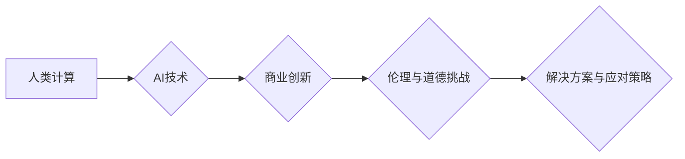

                 

## AI驱动的创新：人类计算在商业中的道德考虑因素与创新应用

> 关键词：人工智能、商业创新、道德伦理、人类计算、算法、数据隐私、可解释性、公平性、透明度

### 1. 背景介绍

人工智能（AI）正以惊人的速度发展，深刻地改变着我们生活的方方面面。从自动驾驶汽车到个性化医疗，从智能家居到金融科技，AI技术的应用无处不在。在商业领域，AI驱动的创新正在掀起一场革命，为企业带来前所未有的机遇和挑战。

然而，AI技术的快速发展也引发了广泛的伦理和社会问题。如何确保AI技术的应用安全、公平、透明，并最大程度地造福人类，成为全球范围内亟待解决的关键问题。

### 2. 核心概念与联系

**2.1 人类计算与AI**

人类计算是指人类利用自身的认知能力和创造力进行计算和决策的过程。传统上，人类计算是通过逻辑推理、经验积累和直觉判断来完成的。而AI，特别是深度学习技术的兴起，使得机器能够模拟人类的学习和决策过程，并超越人类在某些特定领域的能力。

**2.2 AI驱动的商业创新**

AI驱动的商业创新是指利用AI技术来创造新的商业模式、产品和服务，从而提升企业效率、降低成本、创造新的价值。

**2.3 伦理与道德挑战**

AI技术的应用引发了诸多伦理和道德挑战，主要包括：

* **数据隐私:** AI算法依赖于海量数据进行训练和运行，这可能会侵犯个人隐私。
* **算法偏见:** AI算法可能存在偏见，导致歧视或不公平的结果。
* **透明度与可解释性:** 许多AI算法过于复杂，难以理解其决策过程，这可能会导致缺乏信任和责任追究。
* **责任与问责:** 当AI系统导致负面后果时，谁应该承担责任？

**2.4 解决方案与应对策略**

为了应对AI带来的伦理和道德挑战，需要采取一系列解决方案和应对策略，包括：

* **制定明确的伦理准则:** 建立AI开发和应用的伦理规范，确保AI技术的应用符合人类价值观。
* **加强数据隐私保护:** 采用加密、匿名化等技术保护个人数据隐私。
* **检测和缓解算法偏见:** 开发算法公平性检测工具，并采取措施缓解算法偏见。
* **提高AI透明度和可解释性:** 研究开发可解释AI算法，使AI决策过程更加透明。
* **建立责任机制:** 明确AI系统开发、运营和应用各方的责任，并建立相应的问责机制。

**2.5 Mermaid 流程图**



### 3. 核心算法原理 & 具体操作步骤

**3.1 算法原理概述**

深度学习是AI领域的重要分支，其核心算法是多层神经网络。深度学习算法能够从海量数据中自动学习特征，并进行复杂的模式识别和预测。

**3.2 算法步骤详解**

1. **数据预处理:** 收集和清洗数据，并将其转换为深度学习算法可以理解的格式。
2. **网络结构设计:** 根据具体任务选择合适的网络结构，例如卷积神经网络（CNN）、循环神经网络（RNN）等。
3. **参数初始化:** 为网络中的参数赋予初始值。
4. **前向传播:** 将输入数据通过网络层层传递，最终得到输出结果。
5. **反向传播:** 计算输出结果与真实值的误差，并根据误差调整网络参数。
6. **迭代训练:** 重复前向传播和反向传播的过程，直到网络性能达到预定目标。

**3.3 算法优缺点**

**优点:**

* 能够自动学习特征，无需人工特征工程。
* 性能优异，在图像识别、自然语言处理等领域取得了突破性进展。

**缺点:**

* 训练数据量大，计算资源消耗高。
* 算法复杂，难以理解其决策过程。
* 容易受到数据偏差的影响。

**3.4 算法应用领域**

* **图像识别:** 人脸识别、物体检测、图像分类等。
* **自然语言处理:** 机器翻译、文本摘要、情感分析等。
* **语音识别:** 语音转文本、语音助手等。
* **推荐系统:** 商品推荐、内容推荐等。
* **医疗诊断:** 疾病诊断、影像分析等。

### 4. 数学模型和公式 & 详细讲解 & 举例说明

**4.1 数学模型构建**

深度学习算法的核心是多层神经网络，其数学模型可以表示为一系列的线性变换和非线性激活函数。

**4.2 公式推导过程**

深度学习算法的训练过程基于梯度下降优化算法。目标函数是衡量模型预测结果与真实值的误差，梯度下降算法通过迭代更新网络参数，最小化目标函数值。

**4.3 案例分析与讲解**

以图像分类为例，假设我们有一个包含猫和狗的图像数据集。深度学习算法可以学习到猫和狗的特征，并将其分类。

**4.3.1 损失函数:**

常用的损失函数是交叉熵损失函数，其公式如下：

$$
L = -\sum_{i=1}^{N} y_i \log(\hat{y}_i)
$$

其中：

* $N$ 是样本数量。
* $y_i$ 是真实标签（0或1）。
* $\hat{y}_i$ 是模型预测的概率。

**4.3.2 梯度下降算法:**

梯度下降算法通过迭代更新网络参数，最小化损失函数值。更新公式如下：

$$
\theta = \theta - \alpha \nabla L(\theta)
$$

其中：

* $\theta$ 是网络参数。
* $\alpha$ 是学习率。
* $\nabla L(\theta)$ 是损失函数对参数的梯度。

### 5. 项目实践：代码实例和详细解释说明

**5.1 开发环境搭建**

使用Python语言和深度学习框架TensorFlow或PyTorch搭建开发环境。

**5.2 源代码详细实现**

```python
import tensorflow as tf

# 定义模型结构
model = tf.keras.models.Sequential([
    tf.keras.layers.Conv2D(32, (3, 3), activation='relu', input_shape=(28, 28, 1)),
    tf.keras.layers.MaxPooling2D((2, 2)),
    tf.keras.layers.Conv2D(64, (3, 3), activation='relu'),
    tf.keras.layers.MaxPooling2D((2, 2)),
    tf.keras.layers.Flatten(),
    tf.keras.layers.Dense(10, activation='softmax')
])

# 编译模型
model.compile(optimizer='adam',
              loss='sparse_categorical_crossentropy',
              metrics=['accuracy'])

# 加载数据
(x_train, y_train), (x_test, y_test) = tf.keras.datasets.mnist.load_data()

# 训练模型
model.fit(x_train, y_train, epochs=5)

# 评估模型
loss, accuracy = model.evaluate(x_test, y_test)
print('Test loss:', loss)
print('Test accuracy:', accuracy)
```

**5.3 代码解读与分析**

这段代码定义了一个简单的卷积神经网络模型，用于识别手写数字。

* `tf.keras.models.Sequential` 创建了一个顺序模型，即层级结构。
* `tf.keras.layers.Conv2D` 定义了卷积层，用于提取图像特征。
* `tf.keras.layers.MaxPooling2D` 定义了最大池化层，用于降低特征图维度。
* `tf.keras.layers.Flatten` 将多维特征图转换为一维向量。
* `tf.keras.layers.Dense` 定义了全连接层，用于分类。
* `model.compile` 编译模型，指定优化器、损失函数和评价指标。
* `tf.keras.datasets.mnist.load_data` 加载MNIST手写数字数据集。
* `model.fit` 训练模型。
* `model.evaluate` 评估模型性能。

**5.4 运行结果展示**

训练完成后，模型可以对新的手写数字图像进行分类。

### 6. 实际应用场景

**6.1 医疗诊断**

AI算法可以辅助医生进行疾病诊断，例如分析医学影像、预测患者风险等。

**6.2 金融科技**

AI算法可以用于欺诈检测、风险评估、个性化金融服务等。

**6.3 自动驾驶**

AI算法是自动驾驶汽车的核心技术，用于感知环境、决策路径、控制车辆。

**6.4 个性化推荐**

AI算法可以根据用户的行为数据和偏好，推荐个性化的商品、内容和服务。

**6.5 工业自动化**

AI算法可以用于工业过程的优化和自动化，提高生产效率和降低成本。

**6.6 未来应用展望**

AI技术的应用前景广阔，未来将应用于更多领域，例如教育、娱乐、环境保护等。

### 7. 工具和资源推荐

**7.1 学习资源推荐**

* **在线课程:** Coursera、edX、Udacity等平台提供丰富的AI课程。
* **书籍:** 《深度学习》、《人工智能：一种现代方法》等。
* **开源项目:** TensorFlow、PyTorch等深度学习框架。

**7.2 开发工具推荐**

* **Python:** AI开发的主要编程语言。
* **TensorFlow:** Google开发的开源深度学习框架。
* **PyTorch:** Facebook开发的开源深度学习框架。
* **Jupyter Notebook:** 用于代码编写和可视化分析的工具。

**7.3 相关论文推荐**

* **《ImageNet Classification with Deep Convolutional Neural Networks》**
* **《Attention Is All You Need》**
* **《BERT: Pre-training of Deep Bidirectional Transformers for Language Understanding》**

### 8. 总结：未来发展趋势与挑战

**8.1 研究成果总结**

近年来，AI技术取得了显著进展，在图像识别、自然语言处理、语音识别等领域取得了突破性成果。

**8.2 未来发展趋势**

* **模型规模和能力提升:** 模型规模将继续扩大，能力将进一步增强。
* **算法效率和可解释性提升:** 研究将更加注重算法效率和可解释性。
* **跨模态学习:** AI模型将能够处理多种模态数据，例如文本、图像、音频等。
* **边缘计算:** AI模型将部署在边缘设备上，实现更快速的响应和更低的延迟。

**8.3 面临的挑战**

* **数据安全和隐私保护:** 确保AI算法的训练数据安全和隐私保护。
* **算法公平性和可解释性:** 缓解算法偏见，提高算法的可解释性。
* **伦理和社会影响:** 评估和应对AI技术的伦理和社会影响。

**8.4 研究展望**

未来，AI研究将更加注重伦理、可解释性和安全性，并探索AI与人类更加紧密协作的模式。

### 9. 附录：常见问题与解答

**9.1 如何选择合适的AI算法？**

选择合适的AI算法取决于具体的应用场景和数据特点。

**9.2 如何解决AI算法的偏见问题？**

可以通过数据预处理、算法设计和模型评估等方式来缓解算法偏见。

**9.3 如何确保AI算法的安全性？**

可以通过安全评估、漏洞修复和安全监控等措施来确保AI算法的安全性。


作者：禅与计算机程序设计艺术 / Zen and the Art of Computer Programming<end_of_turn>

