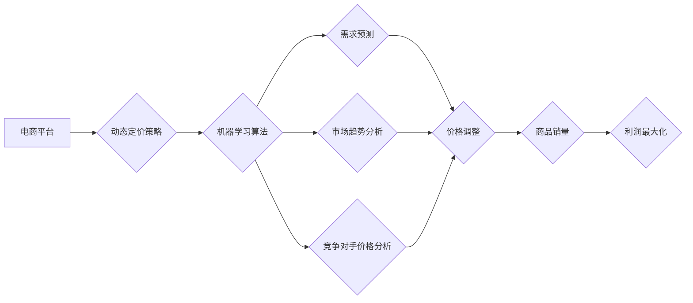

                 

## AI驱动的电商平台动态定价策略优化

> 关键词：电商平台、动态定价、机器学习、预测模型、优化算法、需求弹性、市场竞争

## 1. 背景介绍

在当今激烈的电商市场竞争中，定价策略是企业获取利润和提升市场份额的关键因素。传统的定价策略往往依赖于经验和主观判断，难以适应市场瞬息万变的需求和竞争环境。随着人工智能技术的快速发展，AI驱动的动态定价策略逐渐成为电商平台优化定价的重要手段。

AI驱动的动态定价策略利用机器学习算法分析海量数据，预测商品需求、竞争对手价格、市场趋势等因素，并根据这些预测结果动态调整商品价格，以实现最大化利润的目标。这种策略能够更加精准地把握市场变化，提高定价效率，并为消费者提供更具竞争力的价格。

## 2. 核心概念与联系

### 2.1  动态定价策略

动态定价策略是指根据实时市场变化，灵活调整商品价格的策略。与传统的固定定价相比，动态定价策略能够更好地适应市场需求波动，提高利润率。

### 2.2  机器学习

机器学习是人工智能领域的重要分支，它通过算法训练模型，使模型能够从数据中学习规律，并对新数据进行预测或分类。在电商平台动态定价中，机器学习算法可以用于预测商品需求、分析市场趋势、识别竞争对手价格等。

### 2.3  需求弹性

需求弹性是指商品价格变化对商品需求量变化的敏感程度。需求弹性越大，价格变化对需求量的影响越大。在动态定价策略中，需求弹性是重要的参考因素，需要根据商品的特性和市场情况进行分析。

### 2.4  市场竞争

市场竞争是电商平台动态定价策略的重要考虑因素。竞争对手的价格、促销活动等都会影响到商品的销量和利润。

**核心概念与联系流程图**



## 3. 核心算法原理 & 具体操作步骤

### 3.1  算法原理概述

AI驱动的电商平台动态定价策略通常采用以下核心算法：

* **回归算法:** 用于预测商品需求量，例如线性回归、逻辑回归、支持向量机等。
* **分类算法:** 用于识别商品的类别和属性，例如决策树、随机森林、神经网络等。
* **优化算法:** 用于根据预测结果和市场情况，优化商品价格，例如梯度下降、遗传算法等。

### 3.2  算法步骤详解

1. **数据收集:** 收集商品销售数据、市场价格数据、用户行为数据等相关信息。
2. **数据预处理:** 对收集到的数据进行清洗、转换、特征工程等处理，使其适合机器学习算法的训练。
3. **模型训练:** 选择合适的机器学习算法，并利用训练数据训练模型。
4. **模型评估:** 使用测试数据评估模型的预测精度和性能。
5. **价格调整:** 根据模型预测结果和市场情况，动态调整商品价格。
6. **监控和优化:** 持续监控模型的性能，并根据实际情况进行模型调整和优化。

### 3.3  算法优缺点

**优点:**

* **精准预测:** 利用机器学习算法可以更精准地预测商品需求和市场趋势。
* **动态调整:** 可以根据实时市场变化动态调整商品价格，提高利润率。
* **数据驱动:** 基于数据分析，避免了主观判断带来的偏差。

**缺点:**

* **数据依赖:** 需要大量高质量的数据进行训练，否则模型的预测精度会降低。
* **算法复杂:** 需要专业的技术人员进行模型开发和维护。
* **解释性差:** 一些机器学习算法的决策过程难以解释，难以理解模型的预测结果。

### 3.4  算法应用领域

AI驱动的动态定价策略广泛应用于以下领域:

* **电商平台:** 优化商品价格，提高利润率。
* **旅游行业:** 动态调整机票和酒店价格，根据市场需求进行优化。
* **金融行业:** 动态调整贷款利率和保险费率，根据客户风险进行评估。
* **能源行业:** 动态调整能源价格，根据供需情况进行优化。

## 4. 数学模型和公式 & 详细讲解 & 举例说明

### 4.1  数学模型构建

在AI驱动的电商平台动态定价策略中，常用的数学模型包括线性回归模型、逻辑回归模型和神经网络模型。

**线性回归模型:**

线性回归模型假设商品需求量与价格之间存在线性关系，可以用以下公式表示:

$$
Q = a + bP
$$

其中:

* $Q$ 是商品需求量
* $P$ 是商品价格
* $a$ 是截距
* $b$ 是价格系数

**逻辑回归模型:**

逻辑回归模型用于预测商品是否会被购买，可以用以下公式表示:

$$
P(购买) = \frac{1}{1 + e^{-(a + bP)}}
$$

其中:

* $P(购买)$ 是商品被购买的概率
* $a$ 是截距
* $b$ 是价格系数

**神经网络模型:**

神经网络模型是一种更复杂的模型，可以学习更复杂的非线性关系。

### 4.2  公式推导过程

线性回归模型的系数 $a$ 和 $b$ 可以通过最小二乘法进行估计。逻辑回归模型的系数 $a$ 和 $b$ 可以通过最大似然估计进行估计。神经网络模型的权重可以通过反向传播算法进行训练。

### 4.3  案例分析与讲解

假设一家电商平台销售一款商品，其历史销售数据如下:

| 价格 (元) | 销量 (件) |
|---|---|
| 10 | 100 |
| 15 | 80 |
| 20 | 60 |
| 25 | 40 |

可以使用线性回归模型对这些数据进行拟合，得到以下模型:

$$
Q = 150 - 6P
$$

根据这个模型，当价格为20元时，预测的销量为60件。

## 5. 项目实践：代码实例和详细解释说明

### 5.1  开发环境搭建

* Python 3.x
* Jupyter Notebook
* scikit-learn
* pandas
* matplotlib

### 5.2  源代码详细实现

```python
import pandas as pd
from sklearn.linear_model import LinearRegression
from sklearn.model_selection import train_test_split
import matplotlib.pyplot as plt

# 加载数据
data = pd.read_csv('sales_data.csv')

# 将价格作为特征，销量作为目标变量
X = data[['Price']]
y = data['Sales']

# 将数据分为训练集和测试集
X_train, X_test, y_train, y_test = train_test_split(X, y, test_size=0.2, random_state=42)

# 创建线性回归模型
model = LinearRegression()

# 训练模型
model.fit(X_train, y_train)

# 预测测试集的销量
y_pred = model.predict(X_test)

# 绘制预测结果图
plt.scatter(X_test, y_test, color='blue', label='实际销量')
plt.plot(X_test, y_pred, color='red', label='预测销量')
plt.xlabel('价格')
plt.ylabel('销量')
plt.legend()
plt.show()

# 打印模型系数
print('模型系数:', model.coef_)
print('截距:', model.intercept_)
```

### 5.3  代码解读与分析

* 首先，加载数据并将其分为特征和目标变量。
* 然后，使用 `train_test_split` 函数将数据分为训练集和测试集。
* 创建线性回归模型并使用 `fit` 方法训练模型。
* 使用 `predict` 方法预测测试集的销量。
* 绘制预测结果图，并打印模型系数和截距。

### 5.4  运行结果展示

运行代码后，会生成一个散点图，展示实际销量和预测销量之间的关系。

## 6. 实际应用场景

AI驱动的电商平台动态定价策略已经在许多电商平台得到应用，例如亚马逊、阿里巴巴、京东等。

### 6.1  案例分析

亚马逊利用机器学习算法分析商品需求、竞争对手价格、用户行为等数据，动态调整商品价格，提高利润率。

### 6.2  应用效果

AI驱动的动态定价策略能够显著提高电商平台的利润率，并提升用户体验。

### 6.3  未来应用展望

随着人工智能技术的不断发展，AI驱动的电商平台动态定价策略将会更加智能化、个性化和精准化。

## 7. 工具和资源推荐

### 7.1  学习资源推荐

* **书籍:**
    * 《Python机器学习》
    * 《深度学习》
* **在线课程:**
    * Coursera
    * edX
    * Udemy

### 7.2  开发工具推荐

* **Python:**
    * scikit-learn
    * TensorFlow
    * PyTorch

### 7.3  相关论文推荐

* **论文:**
    * 《Dynamic Pricing with Machine Learning》
    * 《A Survey of Dynamic Pricing Algorithms》

## 8. 总结：未来发展趋势与挑战

### 8.1  研究成果总结

AI驱动的电商平台动态定价策略已经取得了显著的成果，能够提高电商平台的利润率和用户体验。

### 8.2  未来发展趋势

* **更智能化:** 利用更先进的机器学习算法，实现更精准的预测和更智能的决策。
* **更个性化:** 根据用户的购买历史、偏好等信息，提供个性化的价格推荐。
* **更透明化:** 提高模型的解释性，让用户能够理解价格调整的原因。

### 8.3  面临的挑战

* **数据质量:** 需要高质量的数据进行模型训练，否则模型的预测精度会降低。
* **算法复杂性:** 需要专业的技术人员进行模型开发和维护。
* **伦理问题:** 动态定价策略可能会导致价格歧视等伦理问题，需要谨慎考虑。

### 8.4  研究展望

未来，AI驱动的电商平台动态定价策略将会更加智能化、个性化和透明化，并更好地服务于消费者和企业。

## 9. 附录：常见问题与解答

### 9.1  常见问题

* **动态定价策略会损害用户体验吗？**

动态定价策略可能会导致价格波动，但如果合理实施，可以提高用户体验，例如提供更具竞争力的价格。

* **如何保证动态定价策略的公平性？**

需要制定合理的算法和规则，避免价格歧视等问题。

* **如何评估动态定价策略的有效性？**

可以通过分析利润率、用户满意度等指标来评估动态定价策略的有效性。


作者：禅与计算机程序设计艺术 / Zen and the Art of Computer Programming 
<end_of_turn>

