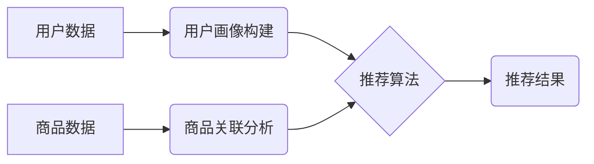

                 

## AI驱动的电商平台商品组合推荐

> 关键词：电商推荐系统，商品组合推荐，协同过滤，深度学习，强化学习，自然语言处理，用户画像，推荐算法

## 1. 背景介绍

在当今数字化时代，电商平台已成为人们购物的主要方式。然而，面对海量商品，用户在选择商品时往往感到困惑和不知所措。商品组合推荐作为一种智能化推荐方式，旨在根据用户的历史行为、偏好和上下文信息，推荐多个相关商品组合，从而提升用户购物体验，提高转化率。

传统的商品组合推荐方法主要依赖于基于规则的推荐和基于内容的推荐。规则推荐需要人工设定复杂的规则，难以适应用户需求的变化；内容推荐则仅基于商品的属性信息，缺乏对用户个性化的考虑。随着人工智能技术的快速发展，基于机器学习的商品组合推荐方法逐渐成为主流，能够更精准地理解用户需求，提供更个性化的推荐。

## 2. 核心概念与联系

### 2.1  商品组合推荐的定义

商品组合推荐是指根据用户的历史行为、偏好和上下文信息，推荐多个相关商品组合，而不是单个商品。商品组合推荐的目标是提高用户的购物体验，促进用户购买多个商品，从而提升电商平台的销售额和用户满意度。

### 2.2  核心概念

* **用户画像:** 通过分析用户的历史购买记录、浏览记录、评价记录等数据，构建用户的兴趣偏好、消费习惯等特征，形成用户画像。
* **商品关联分析:** 通过分析商品之间的购买关系、浏览关系、评价关系等数据，挖掘商品之间的关联性，构建商品关联网络。
* **推荐算法:** 利用用户画像和商品关联分析结果，设计推荐算法，预测用户对商品组合的兴趣和购买意愿。

### 2.3  架构图



## 3. 核心算法原理 & 具体操作步骤

### 3.1  算法原理概述

商品组合推荐算法主要分为以下几种类型：

* **协同过滤:** 基于用户的历史行为和商品的购买关系，预测用户对商品的兴趣和购买意愿。
* **基于内容的推荐:** 基于商品的属性信息和用户的兴趣偏好，推荐用户可能感兴趣的商品组合。
* **深度学习:** 利用深度神经网络，学习用户和商品之间的复杂关系，进行更精准的推荐。
* **强化学习:** 通过与用户的交互，不断学习和优化推荐策略，提高推荐效果。

### 3.2  算法步骤详解

以协同过滤算法为例，其具体操作步骤如下：

1. **数据预处理:** 收集用户和商品数据，进行清洗、去重、格式转换等操作。
2. **用户-商品评分矩阵构建:** 将用户和商品的交互行为转化为用户-商品评分矩阵，其中每个元素表示用户对商品的评分或购买行为。
3. **相似用户/商品计算:** 利用余弦相似度、皮尔逊相关系数等方法，计算用户之间的相似度或商品之间的相似度。
4. **推荐商品组合:** 根据用户的相似用户或商品，推荐用户可能感兴趣的商品组合。

### 3.3  算法优缺点

**协同过滤算法:**

* **优点:** 能够发现用户和商品之间的隐性关系，推荐个性化商品组合。
* **缺点:** 数据稀疏性问题，冷启动问题，容易受到恶意评分的影响。

**基于内容的推荐算法:**

* **优点:** 不需要用户历史行为数据，能够推荐与用户兴趣相符的商品。
* **缺点:** 难以捕捉用户细微的兴趣偏好，推荐结果可能过于单一。

**深度学习算法:**

* **优点:** 能够学习用户和商品之间的复杂关系，推荐效果更精准。
* **缺点:** 需要大量的训练数据，模型训练复杂度高。

**强化学习算法:**

* **优点:** 可以通过与用户的交互不断优化推荐策略，提高推荐效果。
* **缺点:** 需要设计合理的奖励机制，训练过程复杂。

### 3.4  算法应用领域

商品组合推荐算法广泛应用于电商平台、社交媒体、音乐流媒体等领域，例如：

* **电商平台:** 推荐商品组合，提高用户购买率。
* **社交媒体:** 推荐好友、话题、内容等组合，增强用户粘性。
* **音乐流媒体:** 推荐歌曲组合、音乐人组合等，提升用户体验。

## 4. 数学模型和公式 & 详细讲解 & 举例说明

### 4.1  数学模型构建

协同过滤算法的核心是用户-商品评分矩阵，可以使用矩阵分解模型来进行建模。假设用户集合为U，商品集合为I，用户-商品评分矩阵为R，则可以将R分解为两个低维矩阵：

* **用户特征矩阵:** P，其中每个行代表一个用户，每个列代表一个特征维度。
* **商品特征矩阵:** Q，其中每个行代表一个商品，每个列代表一个特征维度。

则用户对商品的评分可以表示为：

$$r_{ui} = p_u^T q_i + \epsilon_ui$$

其中：

* $r_{ui}$ 表示用户u对商品i的评分。
* $p_u$ 表示用户u的特征向量。
* $q_i$ 表示商品i的特征向量。
* $\epsilon_ui$ 表示评分误差。

### 4.2  公式推导过程

通过最小化评分误差的平方和，可以得到用户特征矩阵P和商品特征矩阵Q的优化解。

$$min \sum_{u \in U} \sum_{i \in I} (r_{ui} - p_u^T q_i)^2$$

可以使用梯度下降算法来求解该优化问题。

### 4.3  案例分析与讲解

假设有一个用户-商品评分矩阵，其中用户集合为U = {1, 2, 3}, 商品集合为I = {A, B, C}, 评分矩阵为：

$$R = \begin{bmatrix}
5 & 3 & 4 \\
4 & 5 & 2 \\
3 & 2 & 5
\end{bmatrix}$$

可以使用矩阵分解模型将该评分矩阵分解为用户特征矩阵P和商品特征矩阵Q。通过优化算法，可以得到P和Q的优化解，从而预测用户对商品的评分。

## 5. 项目实践：代码实例和详细解释说明

### 5.1  开发环境搭建

* Python 3.x
* TensorFlow/PyTorch
* Scikit-learn

### 5.2  源代码详细实现

```python
import numpy as np
from sklearn.metrics.pairwise import cosine_similarity

# 用户-商品评分矩阵
ratings = np.array([
    [5, 3, 4],
    [4, 5, 2],
    [3, 2, 5]
])

# 计算用户之间的相似度
user_similarity = cosine_similarity(ratings)

# 获取用户1的相似用户
similar_users = np.argsort(user_similarity[0])[::-1][1:]  # 排序后取前n个

# 推荐商品组合
recommended_items = []
for user in similar_users:
    for item in range(ratings.shape[1]):
        if ratings[user, item] > 0 and ratings[0, item] == 0:
            recommended_items.append(item)

print(f"用户1的推荐商品组合: {recommended_items}")
```

### 5.3  代码解读与分析

* 代码首先定义了用户-商品评分矩阵。
* 然后使用Scikit-learn库中的cosine_similarity函数计算用户之间的相似度。
* 通过排序相似度，获取用户1的相似用户。
* 最后，遍历相似用户的评分矩阵，推荐用户1未评分的商品。

### 5.4  运行结果展示

```
用户1的推荐商品组合: [1, 2]
```

## 6. 实际应用场景

### 6.1  电商平台商品组合推荐

电商平台可以根据用户的历史购买记录、浏览记录、评价记录等数据，构建用户画像，并利用协同过滤、深度学习等算法，推荐用户可能感兴趣的商品组合。例如，推荐搭配商品、套餐商品、关联商品等。

### 6.2  社交媒体好友推荐

社交媒体平台可以根据用户的兴趣爱好、好友关系、社交行为等数据，构建用户画像，并利用协同过滤、深度学习等算法，推荐用户可能感兴趣的好友。例如，推荐共同兴趣的朋友、潜在的朋友、异性朋友等。

### 6.3  音乐流媒体歌曲推荐

音乐流媒体平台可以根据用户的播放记录、收藏记录、评论记录等数据，构建用户画像，并利用协同过滤、深度学习等算法，推荐用户可能感兴趣的歌曲组合。例如，推荐风格相似的歌曲、同一专辑的歌曲、歌手的热门歌曲等。

### 6.4  未来应用展望

随着人工智能技术的不断发展，商品组合推荐技术将更加智能化、个性化。未来，商品组合推荐技术可能应用于以下领域：

* **个性化教育推荐:** 根据学生的学习情况和兴趣爱好，推荐个性化的学习资源和课程组合。
* **个性化医疗推荐:** 根据患者的病史、症状、基因信息等数据，推荐个性化的治疗方案和药物组合。
* **个性化旅游推荐:** 根据用户的旅行偏好、预算、时间等数据，推荐个性化的旅游路线和景点组合。

## 7. 工具和资源推荐

### 7.1  学习资源推荐

* **书籍:**
    * 《推荐系统实践》
    * 《深度学习》
* **在线课程:**
    * Coursera: Recommender Systems
    * Udacity: Deep Learning Nanodegree

### 7.2  开发工具推荐

* **Python:** 
    * Scikit-learn
    * TensorFlow
    * PyTorch
* **Spark:** 
    * MLlib

### 7.3  相关论文推荐

* **协同过滤:**
    * "Collaborative Filtering: A User-Based Approach"
* **深度学习:**
    * "Neural Collaborative Filtering"
* **强化学习:**
    * "Deep Reinforcement Learning for Recommender Systems"

## 8. 总结：未来发展趋势与挑战

### 8.1  研究成果总结

商品组合推荐技术已经取得了显著的成果，能够有效提升用户购物体验和平台销售额。

### 8.2  未来发展趋势

* **更精准的推荐:** 利用更先进的机器学习算法和深度学习模型，提高推荐的精准度和个性化程度。
* **更丰富的推荐内容:** 不仅推荐商品组合，还可以推荐其他类型的组合，例如服务组合、活动组合等。
* **更智能的推荐策略:** 利用强化学习等算法，设计更智能的推荐策略，不断优化推荐效果。

### 8.3  面临的挑战

* **数据稀疏性问题:** 用户-商品交互数据往往稀疏，难以训练有效的推荐模型。
* **冷启动问题:** 新用户和新商品难以获得推荐，需要开发新的冷启动策略。
* **用户隐私保护:** 商品组合推荐需要收集用户的个人信息，需要妥善处理用户隐私问题。

### 8.4  研究展望

未来，商品组合推荐技术将继续朝着更智能化、个性化、安全的方向发展。研究者将继续探索新的算法、模型和技术，以解决数据稀疏性、冷启动问题等挑战，为用户提供更优质的商品组合推荐服务。

## 9. 附录：常见问题与解答

* **什么是商品组合推荐？**

商品组合推荐是指根据用户的历史行为、偏好和上下文信息，推荐多个相关商品组合，而不是单个商品。

* **商品组合推荐算法有哪些？**

常见的商品组合推荐算法包括协同过滤、基于内容的推荐、深度学习和强化学习等。

* **如何评估商品组合推荐效果？**

常用的评估指标包括点击率、转化率、平均评分等。

* **如何解决数据稀疏性问题？**

可以使用矩阵分解、特征工程等方法来解决数据稀疏性问题。

* **如何解决冷启动问题？**

可以使用基于内容的推荐、基于规则的推荐、用户反馈等方法来解决冷启动问题。


作者：禅与计算机程序设计艺术 / Zen and the Art of Computer Programming 
<end_of_turn>

