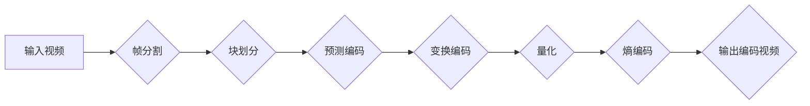

                 

## AV1 视频格式：下一代开放媒体编码

> 关键词：AV1, 视频编码, 压缩算法, 媒体格式, 开放标准, HEVC, VP9, 

## 1. 背景介绍

随着互联网带宽的不断提升和移动设备的普及，视频内容的消费量呈指数级增长。高效的视频编码技术成为保证高质量视频流传输的关键。传统视频编码标准如H.264/AVC和HEVC/H.265，虽然在压缩率和视频质量方面取得了显著进步，但随着视频分辨率和复杂度的不断提高，它们面临着越来越大的挑战。

为了应对这一挑战，一个新的开放视频编码标准AV1应运而生。AV1由Alliance for Open Media (AOMedia) 联盟主导开发，并得到了众多科技巨头的支持，包括Google、Netflix、Amazon、Microsoft等。AV1 作为下一代视频编码标准，旨在提供更高的压缩效率、更好的视频质量和更广泛的平台兼容性。

## 2. 核心概念与联系

AV1 基于现代编码理论和技术，融合了多种先进的编码算法，包括：

* **基于块的预测编码 (Block-based Predictive Coding):** 将视频画面划分为多个块，并利用相邻块的信息进行预测，减少冗余信息。
* **变换编码 (Transform Coding):** 将视频块数据进行变换，将空间相关信息转换为频率相关信息，提高编码效率。
* **量化 (Quantization):** 将变换后的系数进行量化，降低数据精度，进一步压缩数据量。
* **熵编码 (Entropy Coding):** 利用统计规律对量化后的系数进行编码，进一步压缩数据量。

AV1 采用了一种全新的编码架构，称为**多层编码 (Multi-Layer Encoding)**。该架构将视频编码分为多个层次，每个层次负责不同的编码任务，并通过层级之间的相互协作，实现更高的压缩效率和更好的视频质量。

**Mermaid 流程图:**

## 3. 核心算法原理 & 具体操作步骤

### 3.1  算法原理概述

AV1 的核心算法原理是基于**多层编码**和**深度学习**的。

* **多层编码:** 将视频编码分为多个层次，每个层次负责不同的编码任务，并通过层级之间的相互协作，实现更高的压缩效率和更好的视频质量。
* **深度学习:** AV1 采用了深度学习技术来优化编码过程，例如使用深度神经网络进行预测编码和量化，提高编码效率和视频质量。

### 3.2  算法步骤详解

AV1 的编码过程可以概括为以下步骤：

1. **帧分割:** 将视频画面分割成多个帧。
2. **块划分:** 将每一帧分割成多个块。
3. **预测编码:** 利用相邻块的信息对当前块进行预测，减少冗余信息。
4. **变换编码:** 将预测编码后的块数据进行变换，将空间相关信息转换为频率相关信息。
5. **量化:** 将变换后的系数进行量化，降低数据精度。
6. **熵编码:** 利用统计规律对量化后的系数进行编码，进一步压缩数据量。
7. **输出编码视频:** 将编码后的数据打包成视频文件。

### 3.3  算法优缺点

**优点:**

* **更高的压缩效率:** AV1 采用多种先进的编码算法和深度学习技术，能够实现比 HEVC 更高的压缩效率。
* **更好的视频质量:** AV1 在相同压缩率下，能够提供比 HEVC 更高的视频质量。
* **更广泛的平台兼容性:** AV1 作为开放标准，能够在各种平台和设备上运行。

**缺点:**

* **更高的编码复杂度:** AV1 的编码算法更加复杂，需要更强大的计算能力。
* **更大的解码延迟:** AV1 的解码过程也更加复杂，可能导致更大的解码延迟。

### 3.4  算法应用领域

AV1 广泛应用于各种视频传输和存储场景，例如：

* **流媒体视频:** AV1 能够提供更高的压缩效率和更好的视频质量，适用于流媒体视频平台。
* **视频会议:** AV1 的低延迟特性，适用于视频会议和远程协作。
* **视频游戏:** AV1 的高压缩效率，能够降低视频游戏传输带宽需求。
* **视频存储:** AV1 的高压缩效率，能够节省视频存储空间。

## 4. 数学模型和公式 & 详细讲解 & 举例说明

### 4.1  数学模型构建

AV1 的核心算法原理基于以下数学模型：

* **预测误差:** 预测编码的核心是计算预测误差，即当前块与预测块之间的差异。

* **变换矩阵:** 变换编码使用变换矩阵将视频块数据进行变换，常见的变换矩阵包括离散余弦变换 (DCT) 和离散正弦变换 (DST)。

* **量化矩阵:** 量化过程使用量化矩阵将变换后的系数进行量化，量化矩阵可以根据视频内容的特性进行调整。

* **熵编码模型:** 熵编码使用统计模型对量化后的系数进行编码，常见的熵编码模型包括算术编码 (Arithmetic Coding) 和哈夫曼编码 (Huffman Coding)。

### 4.2  公式推导过程

以下是一些 AV1 算法中常用的公式：

* **预测误差:**

$$
e(x,y) = f(x,y) - p(x,y)
$$

其中，$e(x,y)$ 是预测误差，$f(x,y)$ 是当前块的像素值，$p(x,y)$ 是预测块的像素值。

* **DCT 变换:**

$$
X(u,v) = \sum_{x=0}^{N-1} \sum_{y=0}^{N-1} f(x,y) \cdot cos(\frac{(2x+1)u \pi}{2N}) \cdot cos(\frac{(2y+1)v \pi}{2N})
$$

其中，$X(u,v)$ 是 DCT 变换后的系数，$f(x,y)$ 是视频块的像素值，$N$ 是块大小。

* **量化:**

$$
Q(u,v) = X(u,v) / Q(u,v)
$$

其中，$Q(u,v)$ 是量化后的系数，$X(u,v)$ 是 DCT 变换后的系数，$Q(u,v)$ 是量化矩阵。

### 4.3  案例分析与讲解

例如，在预测编码过程中，AV1 会使用深度学习模型来预测当前块的像素值。该模型会根据相邻块的信息进行训练，并学习到预测像素值的规律。在实际编码过程中，模型会根据当前块的上下文信息，预测出当前块的像素值，并计算预测误差。

## 5. 项目实践：代码实例和详细解释说明

### 5.1  开发环境搭建

AV1 的开发环境搭建需要以下软件：

* **编译器:** GCC 或 Clang
* **开发工具:** CMake 或 Autotools
* **AV1 编码库:** libaom

### 5.2  源代码详细实现

AV1 的源代码主要位于 libaom 库中，可以从官方网站下载。

### 5.3  代码解读与分析

AV1 的源代码非常复杂，涉及到大量的算法和数据结构。需要对视频编码原理和 AV1 标准有一定的了解才能进行代码解读。

### 5.4  运行结果展示

AV1 编码库提供了命令行工具来进行视频编码和解码。可以通过这些工具将视频文件编码成 AV1 格式，并解码成原始视频格式。

## 6. 实际应用场景

AV1 已经开始在各种实际应用场景中得到应用，例如：

* **YouTube:** YouTube 已经开始使用 AV1 格式来提供视频流。
* **Netflix:** Netflix 也计划使用 AV1 格式来提供视频流。
* **WebRTC:** WebRTC 协议已经支持 AV1 格式。

### 6.4  未来应用展望

AV1 作为下一代视频编码标准，未来将在更多领域得到应用，例如：

* **8K 视频:** AV1 的高压缩效率能够满足 8K 视频的传输需求。
* **虚拟现实 (VR) 和增强现实 (AR):** AV1 的低延迟特性能够满足 VR 和 AR 的实时视频传输需求。
* **物联网 (IoT):** AV1 的低带宽需求能够满足物联网设备的视频传输需求。

## 7. 工具和资源推荐

### 7.1  学习资源推荐

* **AV1 官方网站:** https://aomedia.org/
* **libaom 库官方网站:** https://github.com/AOMediaCodec/libaom
* **AV1 标准文档:** https://aomedia.org/docs/

### 7.2  开发工具推荐

* **CMake:** https://cmake.org/
* **FFmpeg:** https://ffmpeg.org/

### 7.3  相关论文推荐

* **AV1 Video Coding Standard:** https://aomedia.org/docs/av1-video-coding-standard/
* **AOMedia Video Coding (AV1) Specification:** https://aomedia.org/docs/av1-specification/

## 8. 总结：未来发展趋势与挑战

### 8.1  研究成果总结

AV1 作为下一代视频编码标准，取得了显著的成果，在压缩效率、视频质量和平台兼容性方面都取得了突破。

### 8.2  未来发展趋势

AV1 的未来发展趋势包括：

* **提高编码效率:** 研究人员将继续探索新的编码算法和深度学习技术，提高 AV1 的编码效率。
* **降低解码延迟:** 研究人员将致力于降低 AV1 的解码延迟，使其更适合实时视频应用。
* **扩展应用场景:** AV1 将在更多领域得到应用，例如 8K 视频、VR/AR 和物联网。

### 8.3  面临的挑战

AV1 还面临着一些挑战，例如：

* **编码复杂度:** AV1 的编码算法非常复杂，需要更强大的计算能力。
* **硬件支持:** AV1 的硬件支持还比较有限，需要更多的芯片厂商加入支持。
* **生态系统建设:** AV1 的生态系统还需要进一步完善，需要更多的软件和硬件厂商加入支持。

### 8.4  研究展望

未来，AV1 将继续朝着更高压缩效率、更低解码延迟和更广泛应用场景的方向发展。

## 9. 附录：常见问题与解答

**Q1: AV1 和 HEVC 的区别是什么？**

**A1:** AV1 和 HEVC 都是视频编码标准，但 AV1 是开源的，而 HEVC 是专利标准。AV1 的压缩效率更高，但编码复杂度也更高。

**Q2: AV1 是否支持所有平台？**

**A2:** AV1 作为开放标准，理论上支持所有平台，但实际支持情况取决于硬件和软件厂商的实现。

**Q3: 如何使用 AV1 编码视频？**

**A3:** 可以使用 libaom 库或 FFmpeg 等工具进行 AV1 视频编码。

**Q4: AV1 的未来发展趋势是什么？**

**A4:** AV1 将朝着更高压缩效率、更低解码延迟和更广泛应用场景的方向发展。

作者：禅与计算机程序设计艺术 / Zen and the Art of Computer Programming 
<end_of_turn>

