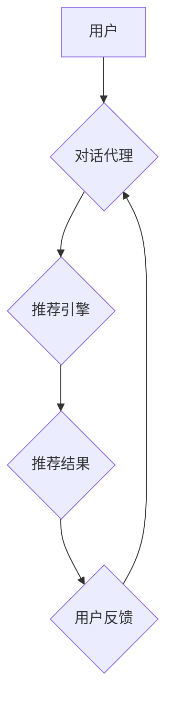

                 

## Chat-Rec的实践：交互式推荐系统的进步

> 关键词：交互式推荐系统，Chat-Rec，对话推荐，自然语言处理，机器学习，个性化推荐，用户行为分析

### 1. 背景介绍

推荐系统作为互联网时代的重要技术支柱，在电商、社交媒体、内容平台等领域发挥着至关重要的作用。传统的推荐系统主要依赖于用户的历史行为数据，例如浏览记录、购买历史等，通过协同过滤、内容过滤等算法进行预测。然而，随着用户行为的复杂化和个性化的需求不断提升，传统的推荐系统面临着新的挑战。

近年来，随着自然语言处理（NLP）技术的飞速发展，对话推荐系统（Chat-Rec）应运而生。Chat-Rec 旨在通过与用户进行自然语言交互，更深入地理解用户的需求和偏好，从而提供更精准、个性化的推荐结果。

### 2. 核心概念与联系

Chat-Rec 系统的核心概念是将推荐过程融入到对话交互中。它结合了推荐系统的个性化推荐能力和对话系统的自然语言理解能力，实现了一种更加人性化、智能化的推荐体验。

**Chat-Rec 系统架构**



**核心概念解释:**

* **用户:** Chat-Rec 系统的目标用户，通过自然语言与系统进行交互。
* **对话代理:** 负责与用户进行对话交互，理解用户的意图和需求，并将其转化为推荐引擎可以理解的格式。
* **推荐引擎:** 基于用户的历史行为数据、对话上下文和机器学习模型，生成个性化的推荐结果。
* **推荐结果:** 包含推荐物品的列表、描述、评分等信息。
* **用户反馈:** 用户对推荐结果的评价和反馈，用于优化推荐引擎的模型和策略。

### 3. 核心算法原理 & 具体操作步骤

#### 3.1  算法原理概述

Chat-Rec 系统的核心算法通常基于深度学习模型，例如 Transformer、BERT 等，能够有效地捕捉对话上下文信息和用户意图。

常见的 Chat-Rec 算法包括：

* **序列到序列模型 (Seq2Seq):** 将对话历史作为输入，预测下一个推荐物品。
* **强化学习 (RL):** 通过奖励机制训练模型，学习生成更符合用户偏好的推荐序列。
* **图神经网络 (GNN):** 建立用户-物品交互图，挖掘用户之间的关系和物品之间的相似性，进行推荐。

#### 3.2  算法步骤详解

以 Seq2Seq 模型为例，Chat-Rec 系统的具体操作步骤如下：

1. **数据预处理:** 收集用户对话数据，进行文本清洗、分词、词向量化等预处理操作。
2. **模型训练:** 使用 Seq2Seq 模型训练，输入对话历史，输出推荐物品。
3. **对话交互:** 用户与系统进行对话，系统根据对话历史生成推荐结果。
4. **用户反馈:** 用户对推荐结果进行评价，反馈信息用于模型优化。
5. **模型更新:** 根据用户反馈，更新模型参数，提高推荐效果。

#### 3.3  算法优缺点

**优点:**

* **个性化推荐:** 通过对话交互，更深入地理解用户的需求和偏好，提供更精准的推荐。
* **交互式体验:** 用户可以与系统进行自然语言对话，获得更人性化的推荐体验。
* **实时更新:** 可以根据用户的实时反馈，动态调整推荐策略，提供更及时、更准确的推荐。

**缺点:**

* **数据需求:** 需要大量的对话数据进行模型训练，数据质量对模型效果至关重要。
* **模型复杂度:** Chat-Rec 系统的模型通常比较复杂，训练和部署成本较高。
* **对话理解:** 对话理解仍然是一个技术难题，系统可能无法准确理解用户的意图和需求。

#### 3.4  算法应用领域

Chat-Rec 系统在以下领域具有广泛的应用前景:

* **电商推荐:** 提供个性化的商品推荐，提高用户购买意愿。
* **内容推荐:** 根据用户的兴趣爱好，推荐相关新闻、视频、文章等内容。
* **旅游推荐:** 根据用户的旅行偏好，推荐合适的旅游目的地、酒店、景点等。
* **教育推荐:** 根据用户的学习目标和进度，推荐合适的学习资源和课程。

### 4. 数学模型和公式 & 详细讲解 & 举例说明

#### 4.1  数学模型构建

Chat-Rec 系统通常使用 Transformer 模型作为其核心，Transformer 模型通过自注意力机制 (Self-Attention) 来捕捉对话历史中的上下文信息。

**自注意力机制公式:**

$$
Attention(Q, K, V) = \frac{exp(Q \cdot K^T / \sqrt{d_k})}{exp(Q \cdot K^T / \sqrt{d_k})} \cdot V
$$

其中:

* $Q$: 查询矩阵
* $K$: 键矩阵
* $V$: 值矩阵
* $d_k$: 键向量的维度

#### 4.2  公式推导过程

自注意力机制的核心思想是计算每个词与所有其他词之间的相关性，并根据相关性权重来聚合信息。

公式推导过程如下:

1. 计算查询矩阵 $Q$ 与键矩阵 $K$ 的点积，并进行归一化处理，得到注意力权重矩阵。
2. 将注意力权重矩阵与值矩阵 $V$ 进行加权求和，得到最终的输出。

#### 4.3  案例分析与讲解

假设我们有一个对话历史: "用户: 我想买一部手机。 助手: 您喜欢什么品牌的手机？"

在自注意力机制中，每个词都会与所有其他词进行计算，例如 "手机" 与 "品牌" 之间的相关性会比较高。

通过自注意力机制，Transformer 模型可以捕捉到对话历史中的上下文信息，例如用户想要购买手机，并且对手机品牌感兴趣。

### 5. 项目实践：代码实例和详细解释说明

#### 5.1  开发环境搭建

Chat-Rec 系统的开发环境通常包括:

* Python 编程语言
* 深度学习框架 (例如 TensorFlow, PyTorch)
* 自然语言处理库 (例如 NLTK, SpaCy)
* 数据库 (例如 MySQL, MongoDB)

#### 5.2  源代码详细实现

以下是一个简单的 Chat-Rec 系统代码示例，使用 TensorFlow 和 Keras 框架实现:

```python
import tensorflow as tf
from tensorflow.keras.models import Sequential
from tensorflow.keras.layers import Embedding, LSTM, Dense

# 数据预处理
# ...

# 模型构建
model = Sequential()
model.add(Embedding(input_dim=vocab_size, output_dim=embedding_dim))
model.add(LSTM(units=128))
model.add(Dense(units=num_classes, activation='softmax'))

# 模型训练
model.compile(loss='categorical_crossentropy', optimizer='adam', metrics=['accuracy'])
model.fit(X_train, y_train, epochs=10)

# 模型预测
predictions = model.predict(X_test)
```

#### 5.3  代码解读与分析

* **Embedding 层:** 将单词转换为稠密的向量表示。
* **LSTM 层:** 用于捕捉对话历史中的上下文信息。
* **Dense 层:** 输出层，预测推荐物品的类别。

#### 5.4  运行结果展示

运行结果展示包括模型的训练精度、测试精度以及推荐结果的展示。

### 6. 实际应用场景

#### 6.1  电商推荐

Chat-Rec 系统可以帮助电商平台提供更个性化的商品推荐，例如根据用户的对话历史，推荐相关的商品、优惠活动等。

#### 6.2  内容推荐

Chat-Rec 系统可以帮助内容平台推荐更符合用户兴趣的内容，例如根据用户的对话历史，推荐相关的新闻、视频、文章等。

#### 6.3  旅游推荐

Chat-Rec 系统可以帮助旅游平台推荐更符合用户需求的旅游目的地、酒店、景点等，例如根据用户的对话历史，推荐合适的旅行路线、酒店预订等。

#### 6.4  未来应用展望

Chat-Rec 系统在未来将有更广泛的应用场景，例如:

* **医疗保健:** 提供个性化的医疗建议和健康信息。
* **金融服务:** 提供个性化的理财建议和金融产品推荐。
* **教育培训:** 提供个性化的学习建议和课程推荐。

### 7. 工具和资源推荐

#### 7.1  学习资源推荐

* **书籍:**
    * 《深度学习》
    * 《自然语言处理》
* **在线课程:**
    * Coursera: 深度学习
    * edX: 自然语言处理
* **博客:**
    * TensorFlow Blog
    * PyTorch Blog

#### 7.2  开发工具推荐

* **深度学习框架:** TensorFlow, PyTorch
* **自然语言处理库:** NLTK, SpaCy
* **数据库:** MySQL, MongoDB

#### 7.3  相关论文推荐

* **BERT: Pre-training of Deep Bidirectional Transformers for Language Understanding**
* **Attention Is All You Need**
* **Seq2Seq Learning with Neural Networks**

### 8. 总结：未来发展趋势与挑战

#### 8.1  研究成果总结

Chat-Rec 系统在推荐系统领域取得了显著的进展，能够提供更个性化、更智能化的推荐体验。

#### 8.2  未来发展趋势

* **多模态交互:** 将语音、图像、视频等多模态信息融入到对话交互中，提供更丰富的推荐体验。
* **个性化模型:** 基于用户的个性化特征，构建更精准的推荐模型。
* **可解释性:** 提高 Chat-Rec 系统的透明度和可解释性，让用户更了解推荐结果背后的逻辑。

#### 8.3  面临的挑战

* **数据隐私:** 如何保护用户的对话数据隐私，是 Chat-Rec 系统面临的重要挑战。
* **对话理解:** 对话理解仍然是一个技术难题，系统可能无法准确理解用户的意图和需求。
* **模型效率:** Chat-Rec 系统的模型通常比较复杂，训练和部署成本较高。

#### 8.4  研究展望

未来，Chat-Rec 系统的研究将继续朝着更智能化、更个性化、更安全的方向发展。


### 9. 附录：常见问题与解答

* **Chat-Rec 系统与传统的推荐系统有什么区别？**

Chat-Rec 系统与传统的推荐系统的主要区别在于交互方式。传统的推荐系统主要依赖于用户的历史行为数据，而 Chat-Rec 系统则通过与用户进行自然语言交互，更深入地理解用户的需求和偏好。

* **Chat-Rec 系统的数据需求量大吗？**

是的，Chat-Rec 系统需要大量的对话数据进行模型训练，数据质量对模型效果至关重要。

* **Chat-Rec 系统的开发难度高吗？**

Chat-Rec 系统的开发难度较高，需要对深度学习、自然语言处理等技术有深入的了解。

* **Chat-Rec 系统有哪些应用场景？**

Chat-Rec 系统在电商推荐、内容推荐、旅游推荐等领域具有广泛的应用前景。


作者：禅与计算机程序设计艺术 / Zen and the Art of Computer Programming 
<end_of_turn>

