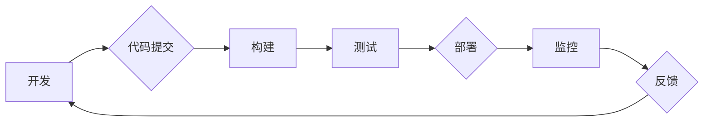

                 

## DevOps 实践指南：构建高效的软件交付流程

> 关键词：DevOps, 软件交付, 持续集成, 持续部署, 自动化, 敏捷开发, 监控, 协作

### 1. 背景介绍

在当今快速迭代的软件开发环境中，高效的软件交付流程至关重要。传统的软件开发模式往往面临着长周期、低效率、沟通障碍等问题，难以满足市场对快速响应和持续创新需求。DevOps 作为一种软件开发和运维的协作模式，应运而生，旨在通过自动化、持续集成和持续部署等实践，加速软件交付速度，提高软件质量和可靠性。

DevOps 的核心思想是打破开发和运维之间的壁垒，实现团队协作和流程自动化。它强调将开发、测试、部署和运维等环节紧密集成，形成一个持续反馈的循环，从而实现快速迭代、持续交付和快速响应。

### 2. 核心概念与联系

DevOps 的核心概念包括：

* **持续集成 (Continuous Integration):** 开发人员频繁地将代码提交到共享代码库，并自动触发构建和测试流程，确保代码质量和稳定性。
* **持续部署 (Continuous Deployment):** 将经过测试的代码自动部署到生产环境，实现快速交付和持续更新。
* **自动化:** 通过自动化工具和脚本，实现代码构建、测试、部署等环节的自动化，提高效率和降低人为错误。
* **监控和反馈:** 实时监控软件运行状态，收集用户反馈，并及时进行调整和优化。
* **协作:** 开发、测试、运维等团队紧密协作，共同负责软件的开发、测试、部署和维护。

DevOps 流程图：



### 3. 核心算法原理 & 具体操作步骤

DevOps 并非依赖于特定的算法，而是通过一系列实践和工具实现软件交付流程的优化。

#### 3.1 算法原理概述

DevOps 的核心原理是基于敏捷开发理念，强调快速迭代、持续反馈和团队协作。通过自动化工具和流程，DevOps 实现了代码构建、测试、部署和监控的自动化，从而提高了软件交付效率和质量。

#### 3.2 算法步骤详解

DevOps 的具体操作步骤包括：

1. **代码管理:** 使用版本控制系统 (如 Git) 管理代码，并采用持续集成策略，定期将代码提交到共享代码库。
2. **自动化构建:** 使用构建工具 (如 Jenkins, Travis CI) 自动化代码构建和测试流程。
3. **持续测试:** 采用自动化测试工具 (如 Selenium, JUnit) 进行单元测试、集成测试和系统测试，确保代码质量和稳定性。
4. **持续部署:** 使用部署工具 (如 Ansible, Puppet) 自动化代码部署到测试环境和生产环境。
5. **监控和反馈:** 使用监控工具 (如 Prometheus, Grafana) 实时监控软件运行状态，收集用户反馈，并及时进行调整和优化。

#### 3.3 算法优缺点

**优点:**

* **提高软件交付速度:** 自动化流程和持续集成/持续部署策略，显著缩短软件交付周期。
* **提高软件质量:** 自动化测试和持续反馈机制，有效降低软件缺陷率。
* **增强团队协作:** DevOps 强调团队协作，打破开发和运维之间的壁垒，促进信息共享和沟通。
* **提高运营效率:** 自动化运维流程，降低人工成本，提高运营效率。

**缺点:**

* **实施成本:** DevOps 的实施需要投入一定的成本，包括人员培训、工具购买和流程改造。
* **文化转变:** DevOps 需要组织文化和团队思维的转变，需要打破传统的部门壁垒和思维模式。
* **技术复杂性:** DevOps 需要掌握多种技术和工具，对技术人员的要求较高。

#### 3.4 算法应用领域

DevOps 的应用领域非常广泛，包括：

* **软件开发:** 提高软件开发效率和质量，缩短软件交付周期。
* **云计算:** 优化云资源利用率，提高云服务交付效率。
* **网络安全:** 自动化安全测试和漏洞修复，提高网络安全防护能力。
* **数据分析:** 自动化数据处理和分析流程，提高数据分析效率。

### 4. 数学模型和公式 & 详细讲解 & 举例说明

DevOps 的核心概念和实践可以抽象为一些数学模型和公式，例如：

#### 4.1 数学模型构建

* **软件交付周期模型:**  

$$T_{delivery} = \frac{T_{development} + T_{testing} + T_{deployment}}{N}$$

其中：

* $T_{delivery}$: 软件交付周期
* $T_{development}$: 开发周期
* $T_{testing}$: 测试周期
* $T_{deployment}$: 部署周期
* $N$: 并行执行的任务数量

* **软件缺陷率模型:**

$$D_{rate} = \frac{D_{total}}{L_{code}}$$

其中：

* $D_{rate}$: 软件缺陷率
* $D_{total}$: 代码中的缺陷总数
* $L_{code}$: 代码行数

#### 4.2 公式推导过程

以上模型的推导过程基于软件开发和运维的实际经验和数据分析。

#### 4.3 案例分析与讲解

假设一个软件项目，开发周期为 2 周，测试周期为 1 周，部署周期为 0.5 周，并行执行的任务数量为 2，则软件交付周期为：

$$T_{delivery} = \frac{2 + 1 + 0.5}{2} = 1.75 \text{ 周}$$

如果代码行数为 10000 行，缺陷总数为 100，则软件缺陷率为：

$$D_{rate} = \frac{100}{10000} = 0.01$$

### 5. 项目实践：代码实例和详细解释说明

#### 5.1 开发环境搭建

DevOps 项目的开发环境搭建需要根据具体项目需求和技术栈进行配置。一般来说，需要包含以下组件：

* **版本控制系统:** Git
* **构建工具:** Jenkins, Travis CI
* **测试工具:** Selenium, JUnit
* **部署工具:** Ansible, Puppet
* **监控工具:** Prometheus, Grafana

#### 5.2 源代码详细实现

以下是一个简单的代码示例，演示了如何使用 Jenkins 进行持续集成和部署：

```
# Jenkinsfile
pipeline {
    agent any
    stages {
        stage('Build') {
            steps {
                sh 'mvn clean package'
            }
        }
        stage('Test') {
            steps {
                sh 'mvn test'
            }
        }
        stage('Deploy') {
            steps {
                sh 'scp target/*.war user@server:/var/www/html'
                sh 'ssh user@server "sudo systemctl restart tomcat"'
            }
        }
    }
}
```

#### 5.3 代码解读与分析

* `pipeline`: 定义一个流水线，包含多个阶段。
* `agent any`: 指定流水线可以使用任何代理节点执行。
* `stages`: 定义流水线中的多个阶段，每个阶段包含一系列步骤。
* `Build`: 构建阶段，使用 Maven 命令构建项目。
* `Test`: 测试阶段，使用 Maven 命令执行测试用例。
* `Deploy`: 部署阶段，使用 SCP 命令将构建好的 WAR 文件上传到服务器，并使用 SSH 命令重启 Tomcat 服务器。

#### 5.4 运行结果展示

当流水线运行成功时，Jenkins 会自动构建、测试和部署项目，并将结果展示在 Jenkins 界面上。

### 6. 实际应用场景

DevOps 的应用场景非常广泛，以下是一些实际应用场景：

* **电商平台:** 提高商品发布速度和效率，实现快速响应用户需求。
* **金融服务:** 确保金融系统稳定性和安全性，快速修复系统漏洞。
* **医疗健康:** 提高医疗软件的开发和部署效率，加速新功能的上线。
* **物联网:** 优化物联网设备的开发和部署流程，实现大规模设备管理。

#### 6.4 未来应用展望

未来，DevOps 将更加深入地融入软件开发和运维流程，并与其他新兴技术融合，例如：

* **人工智能:** 利用人工智能技术自动识别和修复软件缺陷，提高软件质量。
* **区块链:** 利用区块链技术实现软件交付的透明性和安全性。
* **边缘计算:** 将 DevOps 扩展到边缘计算环境，实现边缘设备的自动化管理和部署。

### 7. 工具和资源推荐

#### 7.1 学习资源推荐

* **书籍:**

    * "The Phoenix Project: A Novel About IT, DevOps, and Helping Your Business Win" by Gene Kim, Kevin Behr, and George Spafford
    * "DevOps Handbook: How to Create World-Class Agility, Reliability, and Security in Technology Organizations" by Gene Kim, Jez Humble, Patrick Debois, and John Willis

* **在线课程:**

    * Udemy: DevOps Fundamentals
    * Coursera: DevOps Specialization

#### 7.2 开发工具推荐

* **版本控制系统:** Git
* **构建工具:** Jenkins, Travis CI
* **测试工具:** Selenium, JUnit
* **部署工具:** Ansible, Puppet
* **监控工具:** Prometheus, Grafana

#### 7.3 相关论文推荐

* "The DevOps Handbook: How to Create World-Class Agility, Reliability, and Security in Technology Organizations" by Gene Kim, Jez Humble, Patrick Debois, and John Willis
* "Accelerate: The Science of Lean Software and DevOps: Building and Scaling High Performing Technology Organizations" by Nicole Forsgren, Jez Humble, and Gene Kim

### 8. 总结：未来发展趋势与挑战

#### 8.1 研究成果总结

DevOps 已经成为软件开发和运维领域的重要趋势，它通过自动化、持续集成和持续部署等实践，显著提高了软件交付效率和质量。

#### 8.2 未来发展趋势

未来，DevOps 将继续朝着以下方向发展：

* **更深入的自动化:** 利用人工智能和机器学习技术，实现更深入的自动化，例如自动代码生成、自动测试用例编写和自动部署。
* **更强大的协作:** 利用协作工具和平台，加强团队协作，实现更有效的沟通和信息共享。
* **更完善的监控和反馈:** 利用更先进的监控和分析工具，实时监控软件运行状态，并及时进行调整和优化。

#### 8.3 面临的挑战

DevOps 的实施也面临一些挑战，例如：

* **文化转变:** DevOps 需要组织文化和团队思维的转变，需要打破传统的部门壁垒和思维模式。
* **技术复杂性:** DevOps 需要掌握多种技术和工具，对技术人员的要求较高。
* **安全风险:** 自动化部署和运维可能会增加安全风险，需要加强安全防护措施。

#### 8.4 研究展望

未来，研究者将继续探索 DevOps 的新应用场景和新技术，例如：

* 将 DevOps 应用于边缘计算和物联网领域。
* 利用区块链技术实现软件交付的透明性和安全性。
* 开发更智能的 DevOps 工具和平台，实现更深入的自动化和协作。

### 9. 附录：常见问题与解答

* **什么是 DevOps?**

DevOps 是软件开发和运维的协作模式，旨在通过自动化、持续集成和持续部署等实践，加速软件交付速度，提高软件质量和可靠性。

* **DevOps 的优势是什么?**

DevOps 的优势包括：提高软件交付速度、提高软件质量、增强团队协作、提高运营效率。

* **如何实施 DevOps?**

DevOps 的实施需要从以下几个方面着手：

* 建立 DevOps 文化
* 选择合适的工具和平台
* 构建自动化流程
* 持续改进和优化

* **DevOps 的挑战是什么?**

DevOps 的挑战包括：文化转变、技术复杂性、安全风险。


作者：禅与计算机程序设计艺术 / Zen and the Art of Computer Programming 
<end_of_turn>

