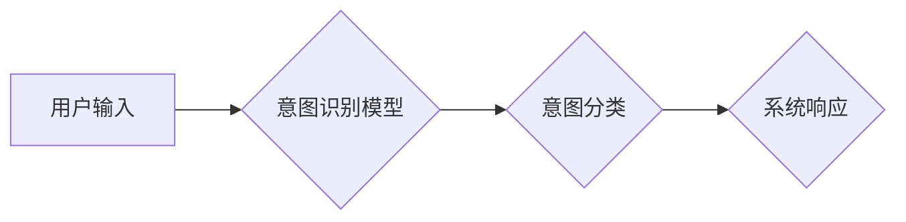

                 

## LLM与人类意图的最佳契合

> 关键词：大型语言模型 (LLM)、自然语言理解 (NLU)、意图识别、对话系统、人类-计算机交互、深度学习、Transformer

## 1. 背景介绍

近年来，大型语言模型 (LLM) 凭借其强大的文本生成和理解能力，在自然语言处理 (NLP) 领域取得了突破性的进展。从 ChatGPT 的问答能力到 LaMDA 的对话流自然度，LLM 正在改变我们与计算机交互的方式。然而，LLM 的成功离不开对人类意图的精准理解。

人类意图是指用户在与系统交互时所表达的真实需求或目标。准确识别用户意图是构建有效对话系统的关键，因为它决定了系统如何生成合适的响应并引导对话走向。传统的基于规则的意图识别方法难以应对自然语言的复杂性和多样性，而深度学习技术的兴起为 LLMs 提供了强大的工具，使其能够学习和理解人类意图的复杂模式。

## 2. 核心概念与联系

### 2.1 自然语言理解 (NLU)

NLU 是让计算机理解人类语言的核心技术。它涵盖了多种任务，包括：

* **词义消歧:** 识别词语在不同语境下的不同含义。
* **依存句法分析:** 分析句子结构，识别词语之间的关系。
* **命名实体识别:** 识别句子中的实体，如人名、地名、时间等。
* **意图识别:** 识别用户表达的意图，例如查询信息、预订服务、进行交易等。

### 2.2 意图识别

意图识别是 NLU 中的关键任务之一，它旨在从用户输入中识别用户的真实意图。例如，用户输入 "今天的天气怎么样？"，意图识别模型应该识别出用户的意图是查询天气信息。

### 2.3 LLM 在意图识别中的应用

LLMs 凭借其强大的文本表示能力和泛化能力，在意图识别领域展现出巨大的潜力。

* **文本表示:** LLMs 可以将用户输入转换为高维的向量表示，这些向量能够捕捉文本的语义信息和上下文关系。
* **分类:** 通过训练，LLMs 可以学习到不同意图的文本特征，并将其用于分类用户输入。
* **多轮对话:** LLMs 可以理解多轮对话中的上下文信息，从而更准确地识别用户的意图。

**Mermaid 流程图**



## 3. 核心算法原理 & 具体操作步骤

### 3.1 算法原理概述

LLMs 在意图识别中的应用主要基于以下两种算法原理：

* **监督学习:** 利用标注好的训练数据，训练模型将用户输入与对应的意图进行映射。
* **自监督学习:** 利用无标注数据，通过预训练模型学习文本表示，然后进行下游任务的微调，例如意图识别。

### 3.2 算法步骤详解

**监督学习**

1. **数据准备:** 收集并标注大量用户输入和对应的意图数据。
2. **模型选择:** 选择合适的 LLM 架构，例如 BERT、RoBERTa 或 T5。
3. **模型训练:** 利用标注数据训练模型，使其能够将用户输入映射到对应的意图类别。
4. **模型评估:** 使用测试数据评估模型的性能，例如准确率、召回率和 F1-score。
5. **模型部署:** 将训练好的模型部署到实际应用场景中。

**自监督学习**

1. **预训练:** 利用无标注数据预训练 LLM 模型，例如通过 masked language modeling 或 next sentence prediction 任务。
2. **下游任务微调:** 将预训练模型用于意图识别任务，利用少量标注数据进行微调。
3. **模型评估:** 使用测试数据评估模型的性能。
4. **模型部署:** 将微调后的模型部署到实际应用场景中。

### 3.3 算法优缺点

**监督学习**

* **优点:** 性能通常较高，能够达到较高的准确率。
* **缺点:** 需要大量的标注数据，数据标注成本高。

**自监督学习**

* **优点:** 不需要大量的标注数据，能够利用无标注数据进行训练。
* **缺点:** 性能可能不如监督学习，需要更多的研究和探索。

### 3.4 算法应用领域

LLMs 在意图识别的应用领域非常广泛，包括：

* **聊天机器人:** 帮助机器人理解用户的意图，并提供更自然、更准确的回复。
* **语音助手:** 帮助语音助手理解用户的语音指令，并执行相应的操作。
* **搜索引擎:** 帮助搜索引擎理解用户的搜索意图，并提供更相关的搜索结果。
* **客服系统:** 帮助客服系统理解用户的咨询需求，并提供更有效的帮助。

## 4. 数学模型和公式 & 详细讲解 & 举例说明

### 4.1 数学模型构建

在意图识别任务中，我们可以将问题构建为一个分类问题。假设我们有 N 个不同的意图类别，则模型的目标是将用户输入映射到这 N 个类别中的一种。

我们可以使用 softmax 函数来计算每个意图类别的概率分布：

$$
P(y_i | x) = \frac{e^{s_i}}{\sum_{j=1}^{N} e^{s_j}}
$$

其中：

* $P(y_i | x)$ 是用户输入 $x$ 属于意图类别 $y_i$ 的概率。
* $s_i$ 是模型对意图类别 $y_i$ 的预测得分。

### 4.2 公式推导过程

softmax 函数的推导过程如下：

1. 首先，模型将用户输入 $x$ 映射到一个向量 $z$ 中，每个元素 $z_i$ 代表模型对意图类别 $y_i$ 的预测得分。

2. 然后，我们使用指数函数将每个得分 $z_i$ 转换为正数，以确保概率分布的归一性。

3. 最后，我们对所有得分进行归一化，得到每个意图类别的概率分布。

### 4.3 案例分析与讲解

假设我们有一个用户输入 "我想预订一张机票"，模型将它映射到一个向量 $z = [0.2, 0.5, 0.3]$，其中 $z_1$ 代表查询天气信息，$z_2$ 代表预订机票，$z_3$ 代表查询酒店。

使用 softmax 函数，我们可以计算出每个意图类别的概率分布：

$$
P(y_i | x) = \frac{e^{0.2}}{\sum_{j=1}^{3} e^{0.2}} \approx 0.25
$$

$$
P(y_2 | x) = \frac{e^{0.5}}{\sum_{j=1}^{3} e^{0.2}} \approx 0.50
$$

$$
P(y_3 | x) = \frac{e^{0.3}}{\sum_{j=1}^{3} e^{0.2}} \approx 0.25
$$

因此，模型预测用户意图为预订机票，概率为 0.50。

## 5. 项目实践：代码实例和详细解释说明

### 5.1 开发环境搭建

* Python 3.7+
* PyTorch 或 TensorFlow
* NLTK 或 spaCy

### 5.2 源代码详细实现

```python
import torch
from torch import nn

class IntentClassifier(nn.Module):
    def __init__(self, vocab_size, embedding_dim, hidden_dim, num_classes):
        super(IntentClassifier, self).__init__()
        self.embedding = nn.Embedding(vocab_size, embedding_dim)
        self.lstm = nn.LSTM(embedding_dim, hidden_dim)
        self.fc = nn.Linear(hidden_dim, num_classes)

    def forward(self, x):
        embedded = self.embedding(x)
        output, (hidden, cell) = self.lstm(embedded)
        output = self.fc(hidden[-1])
        return output

# 实例化模型
model = IntentClassifier(vocab_size=10000, embedding_dim=128, hidden_dim=256, num_classes=5)

# 定义损失函数和优化器
criterion = nn.CrossEntropyLoss()
optimizer = torch.optim.Adam(model.parameters(), lr=0.001)

# 训练模型
for epoch in range(num_epochs):
    for batch in train_dataloader:
        inputs, labels = batch
        optimizer.zero_grad()
        outputs = model(inputs)
        loss = criterion(outputs, labels)
        loss.backward()
        optimizer.step()

# 保存模型
torch.save(model.state_dict(), 'intent_classifier.pth')
```

### 5.3 代码解读与分析

* **模型架构:** 该代码实现了一个基于 LSTM 的意图识别模型。
* **嵌入层:** 将单词转换为向量表示。
* **LSTM 层:** 学习文本序列的上下文信息。
* **全连接层:** 将 LSTM 输出映射到意图类别。
* **损失函数:** 使用交叉熵损失函数计算模型预测与真实标签之间的差异。
* **优化器:** 使用 Adam 优化器更新模型参数。

### 5.4 运行结果展示

训练完成后，可以使用测试数据评估模型的性能，例如计算准确率、召回率和 F1-score。

## 6. 实际应用场景

### 6.1 聊天机器人

LLMs 在聊天机器人领域发挥着重要作用，例如：

* **对话流自然度:** LLMs 可以理解多轮对话中的上下文信息，从而生成更自然、更流畅的对话。
* **个性化体验:** LLMs 可以根据用户的历史对话记录和偏好，提供个性化的回复。
* **多模态交互:** LLMs 可以结合语音、图像等多模态信息，提供更丰富的交互体验。

### 6.2 语音助手

LLMs 可以帮助语音助手理解用户的语音指令，并执行相应的操作，例如：

* **查询信息:** 查询天气、新闻、股票等信息。
* **控制设备:** 控制智能家居设备，例如灯光、空调等。
* **设置提醒:** 设置闹钟、待办事项等提醒。

### 6.3 搜索引擎

LLMs 可以帮助搜索引擎理解用户的搜索意图，并提供更相关的搜索结果，例如：

* **自然语言查询:** 用户可以使用自然语言进行搜索，例如 "最近上映的科幻电影"。
* **意图识别:** 搜索引擎可以识别用户的搜索意图，例如查询信息、购买商品、预订服务等。
* **个性化推荐:** 搜索引擎可以根据用户的搜索历史和偏好，提供个性化的搜索结果推荐。

### 6.4 未来应用展望

LLMs 在意图识别领域的应用前景广阔，未来可能在以下方面取得突破：

* **更准确的意图识别:** 通过更先进的算法和更大的训练数据，LLMs 可以实现更准确的意图识别。
* **更丰富的意图理解:** LLMs 可以理解更复杂的意图，例如用户隐含的需求和情感。
* **更个性化的交互体验:** LLMs 可以根据用户的个性化需求，提供更个性化的交互体验。

## 7. 工具和资源推荐

### 7.1 学习资源推荐

* **书籍:**
    * 《深度学习》 by Ian Goodfellow, Yoshua Bengio, and Aaron Courville
    * 《自然语言处理》 by Dan Jurafsky and James H. Martin
* **在线课程:**
    * Coursera: Natural Language Processing Specialization
    * Udacity: Deep Learning Nanodegree

### 7.2 开发工具推荐

* **PyTorch:** https://pytorch.org/
* **TensorFlow:** https://www.tensorflow.org/
* **NLTK:** https://www.nltk.org/
* **spaCy:** https://spacy.io/

### 7.3 相关论文推荐

* **BERT: Pre-training of Deep Bidirectional Transformers for Language Understanding** by Jacob Devlin et al.
* **RoBERTa: A Robustly Optimized BERT Pretraining Approach** by Yinhan Liu et al.
* **T5: Text-to-Text Transfer Transformer** by Colin Raffel et al.

## 8. 总结：未来发展趋势与挑战

### 8.1 研究成果总结

LLMs 在意图识别领域取得了显著的进展，能够实现高准确率的意图分类，并支持多轮对话和个性化交互。

### 8.2 未来发展趋势

* **更强大的模型:** 研究人员将继续开发更强大的 LLMs，例如更大的模型规模、更复杂的架构和更丰富的训练数据。
* **更细粒度的意图识别:** LLMs 将能够识别更细粒度的意图，例如用户对特定产品的需求或对特定服务的期望。
* **跨语言意图识别:** LLMs 将能够理解不同语言的意图，从而实现跨语言的对话系统。

### 8.3 面临的挑战

* **数据标注成本:** 训练高质量的 LLMs 需要大量的标注数据，数据标注成本高昂。
* **模型可解释性:** LLMs 的决策过程难以理解，这使得它们难以应用于需要透明度和可解释性的场景。
* **公平性和偏见:** LLMs 可能存在公平性和偏见问题，需要进行更深入的研究和探索。

### 8.4 研究展望

未来，LLMs 在意图识别领域的应用将更加广泛和深入，将为人类-计算机交互带来革命性的改变。


## 9. 附录：常见问题与解答

**Q1: LLMs 与传统规则型意图识别方法相比有哪些优势？**

**A1:** LLMs 能够学习和理解自然语言的复杂模式，而传统规则型方法难以应对自然语言的歧义性和多样性。LLMs 可以从海量数据中学习，并不断改进其意图识别能力。

**Q2: 如何评估 LLMs 的意图识别性能？**

**A2:** 常用的评估指标包括准确率、召回率和 F1-score。这些指标可以衡量模型对不同意图的识别准确性。

**Q3: 如何解决 LLMs 数据标注成本高的问题？**

**A3:** 一些研究人员正在探索使用自监督学习和迁移学习等方法，减少对标注数据的依赖。

**Q4: 如何解决 LLMs 的模型可解释性问题？**

**A4:** 研究人员正在开发新的方法来解释 LLMs 的决策过程，例如注意力机制和可解释性模型。

**Q5: LLMs 是否会存在公平性和偏见问题？**

**A5:** LLMs 可能存在公平性和偏见问题，因为它们是在现有的数据上训练的，而这些数据可能包含社会偏见。需要进行更深入的研究和探索，以解决这些问题。


作者：禅与计算机程序设计艺术 / Zen and the Art of Computer Programming<end_of_turn>

