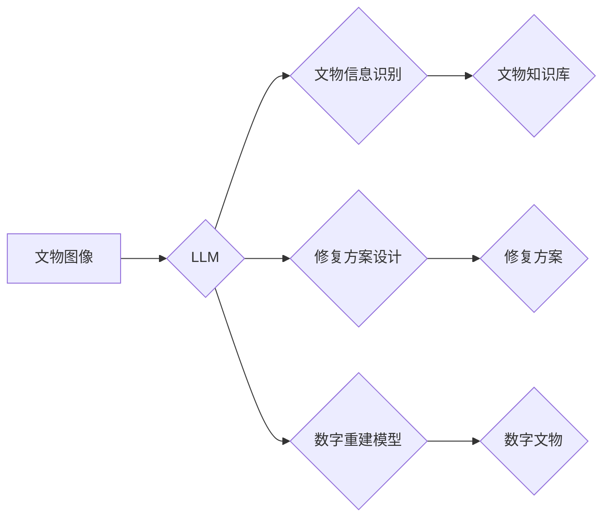

                 

## LLM在文物保护中的应用：AI修复专家

> 关键词：大型语言模型（LLM）、文物修复、人工智能、图像生成、历史文化遗产、数字重建、深度学习

## 1. 背景介绍

随着科技的飞速发展，人工智能（AI）已渗透到各个领域，为人类社会带来了前所未有的变革。其中，大型语言模型（LLM）作为AI领域的一颗璀璨明珠，凭借其强大的文本理解和生成能力，在自然语言处理、机器翻译、代码生成等方面取得了突破性进展。

文物保护作为一项重要的文化传承事业，一直面临着诸多挑战。历史悠久的文物由于年代久远、环境变化等原因，常常遭受损毁、褪色、丢失等问题。传统的修复方法耗时费力，且难以完全恢复原貌。而LLM的出现为文物保护带来了新的希望，其强大的文本理解和生成能力可以帮助我们更好地理解文物背后的历史文化信息，并利用图像生成技术实现文物修复和数字重建。

## 2. 核心概念与联系

### 2.1 文物修复与数字重建

文物修复是指对文物进行必要的处理，使其恢复原貌或接近原貌，并延长其使用寿命。数字重建则是利用计算机技术，根据文物残缺部分或相关资料，生成文物完整的数字模型。

### 2.2 LLM在文物保护中的应用

LLM可以应用于文物保护的多个环节，例如：

* **文物信息识别与分析:** LLM可以分析文物图像、文字描述等信息，识别文物类型、年代、制作工艺等关键信息。
* **文物修复方案设计:** LLM可以根据文物损坏情况，结合历史文献和修复经验，生成合理的修复方案。
* **文物数字重建:** LLM可以利用图像生成技术，根据文物残缺部分或相关资料，生成文物完整的数字模型。
* **文物知识库构建:** LLM可以帮助构建文物知识库，整合文物信息、修复技术、历史文化背景等，为文物保护提供更全面的支持。

### 2.3 架构图



## 3. 核心算法原理 & 具体操作步骤

### 3.1 算法原理概述

LLM在文物保护中的应用主要基于以下核心算法：

* **图像识别与分类:** 利用卷积神经网络（CNN）等深度学习算法，识别文物图像中的关键特征，并将其分类到不同的文物类型。
* **文本理解与生成:** 利用Transformer模型等LLM架构，理解文物相关的文本描述，并生成相应的修复方案、数字重建模型等。
* **图像生成:** 利用生成对抗网络（GAN）等算法，根据文物信息和修复方案，生成逼真的文物修复图像或数字重建模型。

### 3.2 算法步骤详解

**1. 文物图像采集与预处理:**

* 收集文物图像，并进行必要的预处理，例如图像裁剪、去噪、增强等。

**2. 文物信息识别与分析:**

* 利用CNN模型对文物图像进行识别，提取文物类型、年代、制作工艺等关键信息。
* 利用LLM模型分析文物相关的文本描述，提取文物历史背景、修复技术等信息。

**3. 修复方案设计:**

* 根据文物损坏情况、历史文献和修复经验，利用LLM模型生成合理的修复方案。

**4. 数字重建模型生成:**

* 利用GAN模型，根据文物残缺部分或相关资料，生成文物完整的数字模型。

**5. 模型评估与优化:**

* 对生成的修复方案和数字重建模型进行评估，并根据评估结果进行优化。

### 3.3 算法优缺点

**优点:**

* **自动化程度高:** LLM可以自动识别文物信息、生成修复方案和数字重建模型，提高文物保护效率。
* **精准度高:** LLM可以利用深度学习算法和海量数据训练，实现高精准度的文物信息识别和修复方案设计。
* **可扩展性强:** LLM可以根据需要扩展到不同的文物类型和修复场景。

**缺点:**

* **数据依赖性强:** LLM的训练需要大量的文物图像和文本数据，数据质量直接影响模型性能。
* **解释性弱:** LLM的决策过程较为复杂，难以解释其生成的修复方案和数字重建模型背后的逻辑。
* **伦理问题:** LLM在文物修复中的应用可能引发伦理问题，例如文物真实性、文化传承等。

### 3.4 算法应用领域

LLM在文物保护领域的应用前景广阔，可以应用于以下领域：

* **博物馆文物修复:** 帮助博物馆修复馆藏文物，延长其使用寿命。
* **古迹保护:** 利用LLM对古迹进行数字重建，帮助人们更好地了解历史文化。
* **文物考古:** 利用LLM分析文物信息，辅助考古学家进行文物研究。
* **文物教育:** 利用LLM生成文物互动体验，提高文物教育的趣味性和互动性。

## 4. 数学模型和公式 & 详细讲解 & 举例说明

### 4.1 数学模型构建

LLM的训练过程本质上是一个优化问题，目标是找到一个模型参数，使得模型在训练数据上的预测结果与真实标签尽可能接近。常用的数学模型包括：

* **交叉熵损失函数:** 用于衡量模型预测结果与真实标签之间的差异。

$$
Loss = - \sum_{i=1}^{N} y_i \log(p_i)
$$

其中：

* $N$ 是样本数量
* $y_i$ 是真实标签
* $p_i$ 是模型预测结果

* **梯度下降算法:** 用于更新模型参数，使得损失函数最小化。

### 4.2 公式推导过程

梯度下降算法的核心思想是迭代更新模型参数，每次更新的方向是损失函数梯度的负方向。

$$
\theta_{t+1} = \theta_t - \alpha \nabla Loss(\theta_t)
$$

其中：

* $\theta$ 是模型参数
* $t$ 是迭代次数
* $\alpha$ 是学习率
* $\nabla Loss(\theta_t)$ 是损失函数在当前参数下的梯度

### 4.3 案例分析与讲解

假设我们训练一个LLM模型用于识别文物类型，训练数据包含了不同类型文物图像和对应的标签。

* 模型输入：文物图像
* 模型输出：不同类型文物概率分布

通过训练，模型会学习到不同文物类型图像的特征，并能够根据输入图像预测其类型概率分布。

## 5. 项目实践：代码实例和详细解释说明

### 5.1 开发环境搭建

* 操作系统：Windows/macOS/Linux
* Python版本：3.7+
* 必要的库：TensorFlow/PyTorch、OpenCV、transformers等

### 5.2 源代码详细实现

```python
# 导入必要的库
import tensorflow as tf
from tensorflow.keras.models import Sequential
from tensorflow.keras.layers import Conv2D, MaxPooling2D, Flatten, Dense

# 定义模型结构
model = Sequential()
model.add(Conv2D(32, (3, 3), activation='relu', input_shape=(img_height, img_width, 3)))
model.add(MaxPooling2D((2, 2)))
model.add(Conv2D(64, (3, 3), activation='relu'))
model.add(MaxPooling2D((2, 2)))
model.add(Flatten())
model.add(Dense(10, activation='softmax'))

# 编译模型
model.compile(optimizer='adam',
              loss='categorical_crossentropy',
              metrics=['accuracy'])

# 训练模型
model.fit(train_images, train_labels, epochs=10)

# 评估模型
loss, accuracy = model.evaluate(test_images, test_labels)
print('Loss:', loss)
print('Accuracy:', accuracy)
```

### 5.3 代码解读与分析

* 代码首先导入必要的库，包括TensorFlow、OpenCV等。
* 然后定义一个卷积神经网络模型，包含多个卷积层、池化层和全连接层。
* 模型使用Adam优化器、交叉熵损失函数和准确率作为评估指标。
* 最后，代码训练模型，并评估模型性能。

### 5.4 运行结果展示

训练完成后，可以将模型应用于新的文物图像识别任务。模型的输出结果是一个概率分布，表示图像属于不同类型文物的概率。

## 6. 实际应用场景

### 6.1 文物修复案例

例如，利用LLM可以分析修复古代陶瓷器皿的裂纹，并根据历史修复技术生成合理的修复方案。

### 6.2 数字重建案例

例如，利用LLM可以根据残缺的古建筑模型，生成完整的数字重建模型，帮助人们更好地了解古建筑的结构和历史文化背景。

### 6.3 文物知识库案例

例如，利用LLM可以构建一个文物知识库，整合文物信息、修复技术、历史文化背景等，为文物保护提供更全面的支持。

### 6.4 未来应用展望

随着LLM技术的不断发展，其在文物保护领域的应用将更加广泛和深入。例如，未来可以利用LLM实现文物虚拟展示、文物互动体验、文物修复机器人等应用。

## 7. 工具和资源推荐

### 7.1 学习资源推荐

* **论文:**

* **书籍:**

* **在线课程:**

### 7.2 开发工具推荐

* **TensorFlow:** https://www.tensorflow.org/
* **PyTorch:** https://pytorch.org/
* **OpenCV:** https://opencv.org/

### 7.3 相关论文推荐

* **BERT: Pre-training of Deep Bidirectional Transformers for Language Understanding**
* **GPT-3: Language Models are Few-Shot Learners**
* **DALL-E: Creating Images from Text**

## 8. 总结：未来发展趋势与挑战

### 8.1 研究成果总结

LLM在文物保护领域的应用取得了显著成果，例如文物信息识别、修复方案设计、数字重建等方面取得了突破性进展。

### 8.2 未来发展趋势

未来LLM在文物保护领域的应用将更加智能化、个性化和交互式。例如，可以利用LLM实现文物虚拟展示、文物互动体验、文物修复机器人等应用。

### 8.3 面临的挑战

LLM在文物保护领域的应用还面临着一些挑战，例如数据标注困难、模型解释性弱、伦理问题等。

### 8.4 研究展望

未来研究将重点关注以下几个方面：

* 构建更完善的文物数据标注体系。
* 研究更有效的LLM模型解释方法。
* 探索LLM在文物保护领域的伦理问题。


## 9. 附录：常见问题与解答

**1. LLM在文物修复中是否会改变文物本身？**

LLM本身不会直接改变文物本身，它只是生成修复方案和数字重建模型，需要人工根据方案进行实际操作。

**2. LLM生成的修复方案是否一定准确？**

LLM生成的修复方案需要人工评估和验证，并非绝对准确。

**3. LLM在文物保护中是否会引发伦理问题？**

LLM在文物保护中的应用可能引发伦理问题，例如文物真实性、文化传承等，需要谨慎对待。


作者：禅与计算机程序设计艺术 / Zen and the Art of Computer Programming 
<end_of_turn>

