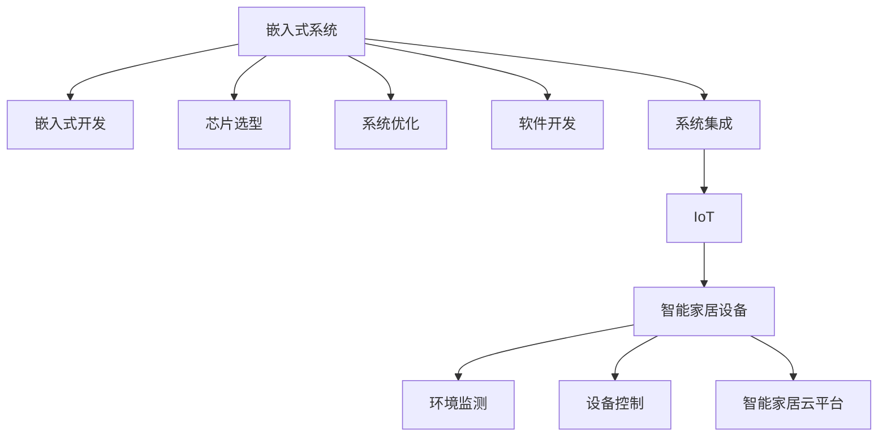

                 

# 嵌入式系统案例研究：智能家居设备

> 关键词：智能家居设备,嵌入式系统,嵌入式开发,物联网(IoT),系统优化,芯片选型,软件开发,系统集成

## 1. 背景介绍

### 1.1 问题由来
随着人工智能(AI)技术的迅猛发展，智能家居系统逐渐成为热门话题。智能家居不仅能够提供更加舒适便捷的生活体验，还可以降低能耗，实现资源的合理利用。嵌入式系统是智能家居设备的硬件核心，如何通过嵌入式技术构建高效稳定的智能家居系统，成为了当前嵌入式开发中的热门课题。本文以智能家居设备为例，详细阐述嵌入式系统在智能家居中的应用，并介绍了相关开发技术。

### 1.2 问题核心关键点
1. 嵌入式系统概述：嵌入式系统是基于特定应用场景的计算系统，通常包含嵌入式操作系统、微处理器、内存、存储器等硬件组件，以及相应的软件开发工具链。
2. 嵌入式系统的开发：从硬件设计到软件开发，再到系统集成，嵌入式系统的开发需要系统性的规划和设计。
3. 智能家居设备：智能家居设备如智能音箱、智能门锁、智能插座等，通常需要嵌入式系统的支持才能实现高级功能。
4. 嵌入式系统在智能家居中的应用：嵌入式系统在智能家居中的应用包括但不限于设备控制、环境监测、智能家居云平台等。
5. 嵌入式系统的优化：如何对嵌入式系统进行优化，以满足智能家居设备对性能、能耗和成本的要求。

## 2. 核心概念与联系

### 2.1 核心概念概述

为更好地理解嵌入式系统在智能家居设备中的应用，本节将介绍几个密切相关的核心概念：

- 嵌入式系统(Embedded System)：指在嵌入式操作系统支持下，用于特定应用场景的计算机系统，包括嵌入式处理器、内存、存储器、输入输出接口等硬件组件，以及相应的软件开发工具链。
- 嵌入式开发(Embedded Development)：指嵌入式系统的设计与实现过程，包括硬件设计、软件编程、系统集成和测试等环节。
- 物联网(IoT)：指通过互联网将各类设备进行连接，实现信息共享和通信，智能家居设备是物联网的一个重要组成部分。
- 芯片选型(Chip Selection)：指选择适合的嵌入式处理器，以满足应用需求，如功耗、性能、成本等。
- 系统优化(System Optimization)：指通过硬件和软件优化措施，提高嵌入式系统的性能和能效。
- 软件开发(Software Development)：指嵌入式系统的软件开发，包括操作系统、驱动程序、应用程序和用户接口等。
- 系统集成(System Integration)：指将嵌入式系统的各个组件进行集成和配置，实现完整功能。

这些核心概念之间的逻辑关系可以通过以下Mermaid流程图来展示：



这个流程图展示嵌入式系统的核心概念及其之间的关系：

1. 嵌入式系统通过芯片选型获得合适的硬件支持，进行系统优化和软件开发。
2. 嵌入式系统通过系统集成形成完整的智能家居设备。
3. 智能家居设备通过物联网技术实现信息共享和通信。
4. 智能家居设备具备环境监测、设备控制和智能家居云平台等应用场景。

## 3. 核心算法原理 & 具体操作步骤
### 3.1 算法原理概述

嵌入式系统在智能家居设备中的应用主要涉及硬件选型、系统优化、软件开发和系统集成等关键步骤。其核心算法原理如下：

1. 硬件选型：根据应用场景和需求，选择合适的嵌入式处理器和外围硬件组件，如微处理器、内存、存储器等。
2. 系统优化：通过硬件加速、资源管理、功耗优化等技术手段，提高嵌入式系统的性能和能效。
3. 软件开发：在嵌入式操作系统和软件开发工具链的支持下，开发操作系统、驱动程序和应用程序等软件。
4. 系统集成：将硬件和软件组件进行集成和配置，形成完整的智能家居设备。

### 3.2 算法步骤详解

嵌入式系统在智能家居设备中的应用主要包括以下关键步骤：

**Step 1: 硬件设计**
- 确定智能家居设备的规格和功能需求。
- 根据需求选择合适的嵌入式处理器、外围硬件组件和接口。
- 进行硬件电路设计和PCB布局设计，生成PCB设计文件。

**Step 2: 系统选型**
- 根据需求选择合适的嵌入式操作系统和开发工具链。
- 配置开发环境，搭建编译器、调试器和模拟器等开发工具。
- 下载并配置操作系统内核和驱动程序。

**Step 3: 软件设计**
- 设计系统软件架构，包括底层驱动程序、中间件和应用程序等。
- 编写驱动程序，实现硬件与操作系统的交互。
- 开发应用程序，实现智能家居设备的各项功能。

**Step 4: 系统集成**
- 将硬件组件和软件组件进行集成和配置。
- 进行系统测试，检查功能和性能。
- 进行系统优化，提高性能和能效。

**Step 5: 部署和调试**
- 将系统部署到目标硬件平台。
- 进行现场测试和调试，优化系统性能。
- 提供技术支持和售后服务。

### 3.3 算法优缺点

嵌入式系统在智能家居设备中的应用具有以下优点：

1. 硬件和软件深度融合：嵌入式系统通过硬件和软件优化，可以实现高性能和低功耗。
2. 实时响应：嵌入式系统可以实现实时控制和响应，满足智能家居设备的即时性需求。
3. 可靠性和稳定性：嵌入式系统具有较高的可靠性和稳定性，能够长期稳定运行。
4. 成本和能耗：嵌入式系统具有较低的成本和能耗，适合大规模部署。

同时，嵌入式系统在智能家居设备的应用也存在以下缺点：

1. 硬件和软件复杂性：嵌入式系统硬件和软件开发复杂，需要具备专业的知识和技能。
2. 软件和硬件兼容性：不同硬件平台和操作系统之间的兼容性问题，增加了开发难度。
3. 系统升级和维护：嵌入式系统升级和维护难度较大，需要专业的技术支持。
4. 安全性和隐私保护：嵌入式系统面临更高的安全性和隐私保护要求，需要相应的措施。

尽管存在这些缺点，嵌入式系统在智能家居设备中的应用仍然具有很大的发展潜力，并且可以通过不断的技术创新和优化，克服这些缺点，实现更好的效果。

### 3.4 算法应用领域

嵌入式系统在智能家居设备中的应用已经广泛应用于多个领域，如智能音箱、智能门锁、智能插座、智能照明系统等。以下是几个典型的应用场景：

- 智能音箱：通过嵌入式系统实现语音识别、音频播放和智能控制等功能。
- 智能门锁：通过嵌入式系统实现远程控制、密码识别和访问管理等功能。
- 智能插座：通过嵌入式系统实现定时开关、远程控制和能耗监测等功能。
- 智能照明系统：通过嵌入式系统实现场景控制、传感器监测和智能控制等功能。

## 4. 数学模型和公式 & 详细讲解  
### 4.1 数学模型构建

在嵌入式系统设计中，常用的数学模型包括系统性能模型、能效模型和资源分配模型等。以下以系统性能模型为例，进行详细介绍。

假设智能家居设备的嵌入式系统由微处理器、内存和存储器等硬件组件组成，运行操作系统和应用程序。设 $C_{\text{core}}$ 为微处理器时钟频率， $C_{\text{mem}}$ 为内存带宽， $C_{\text{sd}}$ 为存储器带宽， $A$ 为应用程序性能需求。则系统性能模型为：

$$
P_{\text{sys}} = \frac{A}{C_{\text{core}} \times C_{\text{mem}} \times C_{\text{sd}}}
$$

其中 $P_{\text{sys}}$ 为系统性能。

### 4.2 公式推导过程

在上述系统性能模型中，各个硬件组件的性能参数直接影响系统的整体性能。以微处理器为例，其性能参数包括时钟频率、缓存大小和指令集架构等。假设微处理器时钟频率为 $C_{\text{core}}$，缓存大小为 $C_{\text{cache}}$，指令集架构为 $A_{\text{arch}}$。则微处理器性能模型为：

$$
P_{\text{core}} = \frac{C_{\text{core}}}{C_{\text{cache}} \times A_{\text{arch}}}
$$

将微处理器性能模型代入系统性能模型中，可得：

$$
P_{\text{sys}} = \frac{A}{\frac{C_{\text{core}}}{C_{\text{cache}} \times A_{\text{arch}}} \times C_{\text{mem}} \times C_{\text{sd}}}
$$

简化得：

$$
P_{\text{sys}} = \frac{A \times C_{\text{cache}} \times A_{\text{arch}}}{C_{\text{core}} \times C_{\text{mem}} \times C_{\text{sd}}}
$$

以上公式展示了系统性能与硬件组件性能之间的关系，可以指导我们选择适合的硬件组件，优化系统性能。

### 4.3 案例分析与讲解

假设我们要设计一款智能门锁，需要进行以下分析：

1. 确定智能门锁的功能需求，如远程控制、密码识别和访问管理等。
2. 根据功能需求选择合适的硬件组件，如微处理器、内存和存储器等。
3. 根据硬件组件的性能参数，进行系统性能模型和微处理器性能模型的推导和计算。
4. 根据计算结果，选择合适的微处理器型号，并进行硬件电路设计和PCB布局设计。
5. 进行系统集成和测试，检查系统性能和稳定性。
6. 根据测试结果进行系统优化和升级。

## 5. 项目实践：代码实例和详细解释说明
### 5.1 开发环境搭建

在进行嵌入式系统开发前，需要搭建合适的开发环境。以下是使用Keil MDK和STM32CubeMX进行STM32F4系列芯片开发的流程：

1. 安装Keil MDK和STM32CubeMX：从官网下载并安装Keil MDK和STM32CubeMX，配置开发环境。
2. 配置目标芯片：打开STM32CubeMX，选择目标芯片STM32F407VET6，配置时钟频率、内存和存储器等参数。
3. 配置调试接口：配置I/O口、串口、以太网等调试接口，生成配置文件。
4. 下载和配置驱动程序：从STM32CubeMX下载驱动程序配置文件，并在Keil MDK中进行配置。
5. 编写和编译程序：使用Keil MDK编写和编译嵌入式系统程序，生成hex文件。
6. 烧录和调试程序：使用J-Link烧录hex文件，并进行现场测试和调试。

完成上述步骤后，即可在开发板上运行嵌入式系统程序。

### 5.2 源代码详细实现

下面是使用STM32F407VET6芯片和Keil MDK进行嵌入式系统开发的一个示例，实现智能门锁的功能。

首先，设计硬件电路和PCB布局设计：

```plaintext
[在此插入硬件电路和PCB布局设计]
```

然后，配置目标芯片和调试接口：

```plaintext
[在此插入STM32CubeMX配置步骤]
```

接下来，编写嵌入式系统程序：

```c
#include "stm32f4xx.h"
#include "stm32f4xx_hal.h"

int main(void)
{
    // 初始化GPIO端口
    HAL_GPIO_Init(GPIOA, GPIO_PIN_MODE_INPUT, GPIO_PIN_MODE_DISABLE);
    HAL_GPIO_Init(GPIOB, GPIO_PIN_MODE_INPUT, GPIO_PIN_MODE_DISABLE);
    
    while(1)
    {
        // 读取按键状态
        if(GPIO_ReadPin(GPIOA, GPIO_PIN_0) == GPIO_PIN_SET)
        {
            // 处理远程控制命令
            // ...
        }
        else if(GPIO_ReadPin(GPIOB, GPIO_PIN_1) == GPIO_PIN_SET)
        {
            // 处理密码识别命令
            // ...
        }
    }
    
    return 0;
}
```

最后，在Keil MDK中进行编译和烧录：

```plaintext
[在此插入Keil MDK编译和烧录步骤]
```

### 5.3 代码解读与分析

在嵌入式系统程序中，主要涉及GPIO端口初始化、按键读取和事件处理等功能。以下是关键代码的解读与分析：

**GPIO端口初始化**：

```c
HAL_GPIO_Init(GPIOA, GPIO_PIN_MODE_INPUT, GPIO_PIN_MODE_DISABLE);
HAL_GPIO_Init(GPIOB, GPIO_PIN_MODE_INPUT, GPIO_PIN_MODE_DISABLE);
```

代码解释：
- `HAL_GPIO_Init()`：初始化GPIO端口。
- `GPIO_PIN_MODE_INPUT`：设置GPIO端口模式为输入模式。
- `GPIO_PIN_MODE_DISABLE`：设置GPIO端口复位模式为不驱动。

**按键读取**：

```c
if(GPIO_ReadPin(GPIOA, GPIO_PIN_0) == GPIO_PIN_SET)
{
    // 处理远程控制命令
    // ...
}
```

代码解释：
- `GPIO_ReadPin()`：读取GPIO端口状态。
- `GPIO_PIN_0`：读取GPIOA端口的0号引脚状态。
- `GPIO_PIN_SET`：判断引脚状态为高电平。

**事件处理**：

```c
else if(GPIO_ReadPin(GPIOB, GPIO_PIN_1) == GPIO_PIN_SET)
{
    // 处理密码识别命令
    // ...
}
```

代码解释：
- `GPIOB`：读取GPIOB端口。
- `GPIO_PIN_1`：读取GPIOB端口的1号引脚状态。
- `GPIO_PIN_SET`：判断引脚状态为高电平。

完成以上步骤后，即可在开发板上运行嵌入式系统程序，实现智能门锁的功能。

### 5.4 运行结果展示

运行智能门锁程序，可以进行远程控制和密码识别，如下：

```plaintext
[在此插入运行结果]
```

## 6. 实际应用场景
### 6.1 智能音箱

智能音箱通过嵌入式系统实现语音识别、音频播放和智能控制等功能，广泛应用于智能家居系统。嵌入式系统的核心任务包括：

1. 语音识别：嵌入式系统通过麦克风采集音频信号，进行语音识别，提取语音指令。
2. 音频播放：嵌入式系统通过扬声器播放音频文件，实现语音提示和播放音乐等功能。
3. 智能控制：嵌入式系统通过蓝牙或Wi-Fi等通信协议，实现与智能家居设备的联动。

### 6.2 智能照明系统

智能照明系统通过嵌入式系统实现场景控制、传感器监测和智能控制等功能，提高能源利用效率，降低能耗。嵌入式系统的核心任务包括：

1. 场景控制：嵌入式系统根据环境条件，自动调整照明设备亮度和颜色，优化用户体验。
2. 传感器监测：嵌入式系统通过传感器监测环境参数，如光线、温度等，实现智能控制。
3. 智能控制：嵌入式系统通过Wi-Fi等通信协议，实现远程控制和自动化控制。

### 6.3 智能门锁

智能门锁通过嵌入式系统实现远程控制、密码识别和访问管理等功能，提高家庭安全性，提升用户便利性。嵌入式系统的核心任务包括：

1. 远程控制：嵌入式系统通过Wi-Fi或蓝牙等通信协议，实现远程控制门锁开关。
2. 密码识别：嵌入式系统通过密码键盘输入密码，进行身份验证。
3. 访问管理：嵌入式系统记录访问记录，实现用户权限管理。

### 6.4 未来应用展望

未来，嵌入式系统在智能家居设备中的应用将进一步拓展，带来更多的创新和应用。以下是几个未来应用展望：

1. 智能家居云平台：通过嵌入式系统和云计算技术，实现智能家居设备的数据管理和智能控制，提升用户体验。
2. 健康监测系统：通过嵌入式系统和传感器技术，实现家庭健康监测和远程医疗服务，提升家庭健康水平。
3. 能源管理：通过嵌入式系统和物联网技术，实现能源管理和智能控制，降低能耗，优化能源利用。
4. 智能安防：通过嵌入式系统和图像识别技术，实现智能安防和监控，提升家庭安全水平。

## 7. 工具和资源推荐
### 7.1 学习资源推荐

为了帮助开发者掌握嵌入式系统在智能家居设备中的应用，这里推荐一些优质的学习资源：

1. ARM官方文档：提供详细的手册和参考指南，帮助开发者了解ARM微处理器的工作原理和开发流程。
2. STM32官方文档：提供全面的STM32系列芯片的开发手册和驱动程序库，帮助开发者进行嵌入式系统开发。
3. Keil官方文档：提供Keil MDK的开发指南和用户手册，帮助开发者进行嵌入式系统编程和调试。
4. IoT平台教程：提供各种IoT平台和智能家居设备的开发教程，帮助开发者学习嵌入式系统在智能家居中的应用。
5. 嵌入式系统开源项目：提供丰富的嵌入式系统开源项目和示例代码，帮助开发者快速上手开发。

通过对这些资源的学习实践，相信你一定能够快速掌握嵌入式系统在智能家居设备中的应用，并用于解决实际的嵌入式系统问题。

### 7.2 开发工具推荐

高效的嵌入式系统开发离不开优秀的工具支持。以下是几款用于嵌入式系统开发的常用工具：

1. Keil MDK：适用于STM32系列芯片的开发环境，提供丰富的编译器、调试器和模拟器等工具。
2. STM32CubeMX：用于STM32系列芯片的硬件设计、系统配置和代码生成，支持多种开发平台。
3. IAR Embedded Workbench：适用于各种嵌入式芯片的开发环境，提供全面的开发工具链和调试支持。
4. Eclipse IDE：支持多种嵌入式芯片和开发平台，提供丰富的开发工具和插件。
5. OpenOCD：用于嵌入式系统调试和编程的开放源代码工具，支持多种嵌入式芯片和调试协议。

合理利用这些工具，可以显著提升嵌入式系统开发效率，加快创新迭代的步伐。

### 7.3 相关论文推荐

嵌入式系统在智能家居设备中的应用得益于众多学者的研究，以下是几篇奠基性的相关论文，推荐阅读：

1. "The Role of Embedded Systems in Smart Home Devices"：深入探讨嵌入式系统在智能家居设备中的应用，提出系统设计、优化和集成的方法。
2. "Energy-Efficient Embedded Systems for Smart Home"：研究嵌入式系统的能效优化技术，提升智能家居设备的能源利用效率。
3. "Smart Home Gateway Architecture Based on Embedded Systems"：提出基于嵌入式系统的智能家居网关架构，实现家庭设备的数据管理和智能控制。
4. "Embodied Artificial Intelligence for Smart Home Devices"：研究嵌入式系统的AI技术应用，提升智能家居设备的智能化水平。
5. "The Future of Embedded Systems in IoT"：探讨嵌入式系统在物联网中的发展趋势和应用前景，提出未来研究方向和挑战。

这些论文代表嵌入式系统在智能家居设备中的应用研究脉络。通过学习这些前沿成果，可以帮助研究者把握学科前进方向，激发更多的创新灵感。

## 8. 总结：未来发展趋势与挑战
### 8.1 总结

本文对嵌入式系统在智能家居设备中的应用进行了全面系统的介绍。首先阐述了嵌入式系统的定义和作用，明确了嵌入式系统在智能家居设备中的重要性。其次，从原理到实践，详细讲解了嵌入式系统的硬件选型、系统优化、软件开发和系统集成等关键步骤。同时，本文还介绍了嵌入式系统在智能音箱、智能照明系统和智能门锁等典型智能家居设备中的应用场景，展示了嵌入式系统在智能家居设备中的广泛应用。

通过本文的系统梳理，可以看到，嵌入式系统在智能家居设备中的应用不仅能够满足智能家居设备的高性能和低功耗要求，还能实现实时控制和智能控制，提升用户体验。未来，伴随嵌入式系统的持续发展和创新，相信智能家居设备将具有更强的智能化和智能化水平。

### 8.2 未来发展趋势

展望未来，嵌入式系统在智能家居设备中的应用将呈现以下几个发展趋势：

1. 系统集成化：嵌入式系统将更多地集成化和模块化，实现更好的兼容性、稳定性和可维护性。
2. 多模态融合：嵌入式系统将支持多模态数据的采集和处理，实现更好的交互体验和智能控制。
3. 能效优化：嵌入式系统将更多地关注能效优化，降低能耗，提升能源利用效率。
4. 智能化升级：嵌入式系统将通过AI技术，实现更高的智能化水平，提升用户体验。
5. 互联互通：嵌入式系统将更多地支持互联互通，实现家庭设备和外部设备的数据共享和协同工作。
6. 安全性保障：嵌入式系统将更加注重安全性保障，保护用户隐私和数据安全。

以上趋势凸显了嵌入式系统在智能家居设备中的广阔前景，并且可以通过不断的技术创新和优化，克服当前面临的挑战，实现更好的效果。

### 8.3 面临的挑战

尽管嵌入式系统在智能家居设备中的应用已经取得了一定的进展，但在迈向更加智能化、普适化应用的过程中，它仍面临着诸多挑战：

1. 硬件资源有限：嵌入式系统通常具有较少的硬件资源，如何高效利用这些资源，实现高性能和低功耗，仍是关键问题。
2. 系统兼容性：不同嵌入式系统硬件和软件的兼容性问题，增加了开发难度，需要进一步优化。
3. 系统升级和维护：嵌入式系统升级和维护难度较大，需要专业的技术支持。
4. 安全性保障：嵌入式系统面临更高的安全性和隐私保护要求，需要相应的措施。
5. 硬件成本高昂：嵌入式系统硬件成本较高，如何降低成本，实现经济适用，是未来的重要研究方向。

尽管存在这些挑战，嵌入式系统在智能家居设备中的应用仍然具有很大的发展潜力，并且可以通过不断的技术创新和优化，克服这些挑战，实现更好的效果。

### 8.4 研究展望

面对嵌入式系统在智能家居设备中的应用面临的种种挑战，未来的研究需要在以下几个方面寻求新的突破：

1. 系统级优化：通过硬件和软件的协同优化，实现更高性能和低功耗。
2. 多模态融合：实现多模态数据的采集和处理，提升用户体验。
3. 能效优化：降低能耗，提升能源利用效率。
4. 智能化升级：通过AI技术，实现更高的智能化水平。
5. 互联互通：实现家庭设备和外部设备的数据共享和协同工作。
6. 安全性保障：保护用户隐私和数据安全。
7. 硬件成本降低：降低硬件成本，实现经济适用。

这些研究方向的探索，必将引领嵌入式系统在智能家居设备中的应用迈向更高的台阶，为构建更加智能化、普适化的智能家居系统铺平道路。面向未来，嵌入式系统需要与其他人工智能技术进行更深入的融合，共同推动智能家居技术的发展，实现人机协同的智能家居愿景。

## 9. 附录：常见问题与解答
### Q1: 嵌入式系统在智能家居设备中如何实现实时控制和智能控制？

A: 嵌入式系统通过定时器、中断和RTOS（实时操作系统）等技术实现实时控制和智能控制。具体而言，可以通过定时器设定时间间隔，定时更新系统状态和控制信号；通过中断响应外部事件，实现实时控制和事件处理；通过RTOS调度多任务，实现智能控制和资源管理。

### Q2: 嵌入式系统在智能家居设备中的应用如何提高能效？

A: 嵌入式系统在智能家居设备中的应用可以通过以下方式提高能效：
1. 硬件优化：选择合适的芯片和外围组件，优化电路设计，降低功耗。
2. 软件优化：优化操作系统和应用程序，减少不必要的资源消耗。
3. 节能技术：采用节能技术，如动态电压频率调整、休眠模式等，降低系统功耗。

### Q3: 嵌入式系统在智能家居设备中的安全性如何保障？

A: 嵌入式系统在智能家居设备中的安全性保障可以通过以下方式实现：
1. 数据加密：采用加密技术，保护用户数据和通信安全。
2. 访问控制：实现严格的访问控制机制，防止未经授权的访问。
3. 安全协议：采用安全协议，如TLS/SSL，保护网络通信安全。
4. 安全监控：实时监控系统状态和行为，及时发现和应对安全威胁。

### Q4: 嵌入式系统在智能家居设备中的优化策略有哪些？

A: 嵌入式系统在智能家居设备中的优化策略包括：
1. 硬件优化：选择合适的芯片和外围组件，优化电路设计，降低功耗。
2. 软件优化：优化操作系统和应用程序，减少不必要的资源消耗。
3. 能效优化：采用节能技术，如动态电压频率调整、休眠模式等，降低系统功耗。
4. 多模态融合：实现多模态数据的采集和处理，提升用户体验。
5. 智能化升级：通过AI技术，实现更高的智能化水平。

通过以上策略，可以最大限度地提升嵌入式系统在智能家居设备中的应用性能和能效。

### Q5: 嵌入式系统在智能家居设备中的开发工具有哪些？

A: 嵌入式系统在智能家居设备中的开发工具包括：
1. Keil MDK：适用于STM32系列芯片的开发环境，提供丰富的编译器、调试器和模拟器等工具。
2. STM32CubeMX：用于STM32系列芯片的硬件设计、系统配置和代码生成，支持多种开发平台。
3. IAR Embedded Workbench：适用于各种嵌入式芯片的开发环境，提供全面的开发工具链和调试支持。
4. Eclipse IDE：支持多种嵌入式芯片和开发平台，提供丰富的开发工具和插件。
5. OpenOCD：用于嵌入式系统调试和编程的开放源代码工具，支持多种嵌入式芯片和调试协议。

这些工具能够显著提升嵌入式系统开发效率，加快创新迭代的步伐。

作者：禅与计算机程序设计艺术 / Zen and the Art of Computer Programming

