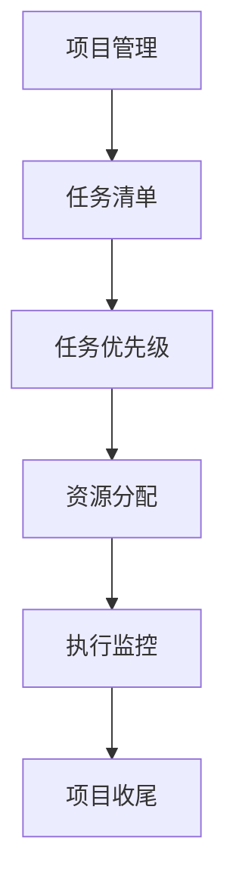

                 

# 巴菲特清单法则在项目管理中的应用

## 1. 背景介绍

在项目管理领域，巴菲特（沃伦·巴菲特）的经典清单法则，即“要事第一”，已经成为了众多管理者和企业家的必修课。巴菲特本人曾公开分享，他每天的工作都围绕着一个只包含五条项目的清单：

1. **投资**：花尽可能多的时间分析和投资于真正有价值的公司。
2. **阅读**：每天花一定的时间阅读公司报告、行业新闻等，了解市场动态。
3. **健身**：保持身体健康，坚持运动。
4. **家庭**：花时间与家人相处，关注家庭生活的各个方面。
5. **有效决策**：在做出重大决策前，进行充分的信息收集和评估，确保决策的准确性。

巴菲特的清单法则强调了优先级管理和时间管理的重要性，其核心思想是“要把时间和精力集中在最重要的事项上”。这一思想不仅适用于投资领域，同样可以应用于项目管理。本文将探讨如何将巴菲特的清单法则应用到项目管理中，提升项目的成功率和管理效率。

## 2. 核心概念与联系

### 2.1 核心概念概述

项目管理是指对项目的计划、执行、监控和收尾等全过程进行科学管理，确保项目目标的实现。项目管理涉及多方面的技能和工具，如时间管理、风险管理、沟通协调、团队建设等。巴菲特的清单法则通过优先级管理这一核心概念，为项目管理提供了新的视角和方法。

在项目管理中，优先级管理是指根据项目的目标和需求，将任务或活动按重要性和紧急性排序，确保关键任务和活动优先完成。这与巴菲特的清单法则中的“要事第一”原则不谋而合。通过合理分配时间和资源，项目经理可以更高效地推进项目，提升项目成功的可能性。

### 2.2 核心概念原理和架构的 Mermaid 流程图



这个流程图展示了项目管理中的任务清单和优先级管理的架构：

1. **任务清单**：列出项目中的所有任务和活动。
2. **任务优先级**：根据任务的重要性和紧急性对任务进行排序。
3. **资源分配**：根据优先级分配资源，确保关键任务得到充分的关注和支持。
4. **执行监控**：在项目执行过程中，持续监控任务进展，确保项目按计划进行。
5. **项目收尾**：项目结束后，进行总结和评估，积累经验教训。

## 3. 核心算法原理 & 具体操作步骤

### 3.1 算法原理概述

巴菲特的清单法则在项目管理中的应用，主要涉及任务优先级排序和资源分配两个方面。其核心思想是通过优先级管理，确保关键任务和活动得到优先处理，从而提升项目整体的成功率。

具体而言，项目管理中任务优先级的排序通常采用四象限法则（重要-紧急矩阵），将任务分为四类：

1. **紧急且重要**：这类任务需要立即处理，通常是项目的核心任务或关键事件。
2. **重要但不紧急**：这类任务虽然不急需处理，但长远来看对项目成功至关重要。
3. **紧急但不重要**：这类任务通常是突发事件或临时任务，虽然紧急但不值得过多投入。
4. **不紧急也不重要**：这类任务可以延后处理，甚至可以忽略。

通过四象限法则，项目管理团队可以清晰地识别出项目中的关键任务，合理安排时间和资源，提升项目管理效率。

### 3.2 算法步骤详解

以下是一个基于巴菲特清单法则的项目管理步骤详解：

1. **任务清单建立**：
   - 列出项目中的所有任务和活动，确保清单详尽全面。
   - 每个任务描述应包括任务目标、预期成果、所需资源和时间。

2. **任务优先级排序**：
   - 使用四象限法则对任务进行分类和排序，识别出紧急且重要、重要但不紧急的任务。
   - 关键任务和活动通常位于四象限矩阵的左上方，是项目管理中的重点。

3. **资源分配**：
   - 根据任务优先级，合理分配项目资源，如人力、时间、资金等。
   - 关键任务应优先分配资源，确保其按时完成。

4. **执行监控**：
   - 在项目执行过程中，持续监控任务进展，及时调整优先级和资源分配。
   - 使用项目管理工具如JIRA、Trello等进行任务跟踪和进度管理。

5. **项目收尾**：
   - 项目结束后，进行总结和评估，收集项目经验教训，为未来的项目提供参考。
   - 撰写项目报告，分享项目成果和经验，提升团队的学习能力。

### 3.3 算法优缺点

基于巴菲特清单法则的项目管理方法具有以下优点：

1. **提升项目成功率**：通过优先级管理，确保关键任务和活动得到优先处理，提升项目的成功率。
2. **提高团队效率**：明确任务优先级和资源分配，提升团队的工作效率和目标一致性。
3. **灵活应对变化**：通过持续监控和调整，灵活应对项目执行过程中的各种变化和挑战。

同时，该方法也存在一定的局限性：

1. **依赖管理层决策**：优先级排序和资源分配依赖管理层的判断，容易出现主观偏差。
2. **任务描述不清**：任务清单中描述不清的任务可能被错误排序，影响项目进度。
3. **缺乏自动化工具支持**：手动排序和分配资源，效率较低，容易出现遗漏和错误。

### 3.4 算法应用领域

巴菲特的清单法则在项目管理中的应用广泛，适用于各种类型的项目，包括软件开发、产品发布、市场营销、基础设施建设等。其核心思想“要事第一”，不仅能提升项目管理的效率和成功率，还能帮助团队在复杂多变的环境中做出更明智的决策。

## 4. 数学模型和公式 & 详细讲解 & 举例说明

### 4.1 数学模型构建

基于巴菲特清单法则的项目管理模型可以构建如下：

- **任务列表**：$T=\{t_1, t_2, ..., t_n\}$，其中 $t_i$ 表示项目中的第 $i$ 个任务。
- **任务优先级**：$P=\{p_1, p_2, ..., p_n\}$，其中 $p_i$ 表示任务 $t_i$ 的优先级，$0 \leq p_i \leq 1$。
- **资源向量**：$R=\{r_1, r_2, ..., r_n\}$，其中 $r_i$ 表示任务 $t_i$ 所需的资源量。

### 4.2 公式推导过程

在四象限法则中，任务优先级可以通过以下公式计算：

$$
p_i = 
\begin{cases}
1 & \text{如果 } t_i \text{ 是紧急且重要} \\
\frac{1}{2} & \text{如果 } t_i \text{ 是重要但不紧急} \\
0 & \text{如果 } t_i \text{ 是紧急但不重要} \\
0 & \text{如果 } t_i \text{ 是不紧急也不重要}
\end{cases}
$$

根据任务优先级和资源向量，可以计算每个任务的总资源需求：

$$
\text{Total Resource}_i = p_i \times r_i
$$

为了确保关键任务得到充分的资源支持，可以设置一个资源分配阈值 $R_{max}$：

$$
R_{max} = \sum_{i=1}^{n} \max(0, \text{Total Resource}_i)
$$

最后，可以计算项目中所有任务的总资源需求：

$$
\text{Total Project Resource} = \sum_{i=1}^{n} \text{Total Resource}_i
$$

### 4.3 案例分析与讲解

假设一个软件开发项目的任务清单和资源需求如下：

| 任务编号 | 任务描述 | 资源需求 | 优先级 |
|---------|---------|---------|--------|
| 1       | 需求分析 | 3       | 1      |
| 2       | UI设计   | 4       | 1      |
| 3       | 后端开发 | 5       | 1      |
| 4       | 测试     | 2       | 0.5    |
| 5       | 部署     | 1       | 0.5    |

根据四象限法则，任务1、2、3是紧急且重要的，任务4、5是重要但不紧急的。

设资源分配阈值为 $R_{max}=10$，则：

- 任务1、2、3的总资源需求为 $3+4+5=12$，超过 $R_{max}$，因此需要调整优先级或资源分配。
- 任务4、5的总资源需求为 $2+1=3$，小于 $R_{max}$，可以按照原优先级继续执行。

## 5. 项目实践：代码实例和详细解释说明

### 5.1 开发环境搭建

在进行项目管理时，我们需要一个高效的项目管理工具来辅助我们进行任务清单的建立、优先级排序和资源分配。这里推荐使用JIRA和Trello。

**JIRA**：
- 使用Java开发的项目管理软件，功能强大，支持敏捷开发、缺陷管理、项目计划等。
- 支持RESTful API，可以通过Python脚本与JIRA进行集成。

**Trello**：
- 基于Web的项目管理工具，界面简洁，支持看板式任务管理。
- 支持与Google Drive、Slack等工具集成，方便团队协作。

在JIRA中创建一个项目，并创建任务和子任务，每个任务可指定优先级和资源需求。

### 5.2 源代码详细实现

以下是一个简单的Python代码示例，演示如何使用JIRA API创建和更新任务：

```python
import requests

# JIRA API credentials
api_url = 'https://your-jira-instance.com/rest/api/3'
api_token = 'your-jira-api-token'

# Create a new issue (task)
issue_data = {
    "fields": {
        "summary": "新任务: 需求分析",
        "description": "需求分析任务描述",
        "priority": "1",
        "assignee": "张三",
        "status": "To Do"
    }
}
issue = requests.post(api_url + '/issue', auth=(api_token, ''), json=issue_data)
print('Issue created:', issue.json())

# Update an existing issue (task)
task_id = '12345'
task_data = {
    "fields": {
        "status": "In Progress"
    }
}
update = requests.put(api_url + '/issue/' + task_id, auth=(api_token, ''), json=task_data)
print('Task updated:', update.json())
```

使用Trello进行任务管理时，可以使用其提供的看板和标签功能，方便地进行任务分类和优先级标记。

### 5.3 代码解读与分析

**JIRA代码解释**：
- `requests`模块用于发送HTTP请求，与JIRA API进行交互。
- `api_url`和`api_token`为JIRA API的URL和认证令牌。
- `issue_data`和`task_data`为任务和子任务的JSON格式数据，包括摘要、描述、优先级、责任人、状态等信息。
- `requests.post`和`requests.put`方法分别用于创建和更新任务。

**Trello代码解释**：
- 使用Trello的看板和标签功能，将任务按照优先级和状态进行分类。
- 可以使用Trello的API进行自动化任务管理，如创建任务、更新状态等。

### 5.4 运行结果展示

运行上述代码后，可以在JIRA和Trello中查看创建和更新任务的结果。例如，在JIRA中可以看到新创建的任务和更新后的任务状态，在Trello中可以直观地看到任务分类和优先级标记。

## 6. 实际应用场景

巴菲特的清单法则在多个实际应用场景中都有显著的效果。以下是几个典型应用案例：

### 6.1 软件开发项目

在软件开发项目中，需求分析、架构设计、编码实现、测试和部署等任务都至关重要。通过巴菲特的清单法则，可以优先处理关键任务，确保项目按时完成。例如，一个电子商务网站的开发项目，需求分析和UI设计是关键任务，应优先安排时间和资源，确保这两个任务的顺利完成。

### 6.2 市场营销活动

市场营销活动的任务繁多，包括市场调研、广告投放、内容创作、客户服务等。通过优先处理关键任务，如市场调研和广告投放，可以提升活动的整体效果。例如，一个新产品上市的市场推广活动，市场调研和广告投放是关键任务，应优先安排，确保活动效果最大化。

### 6.3 产品发布流程

产品发布流程包含多个环节，如需求收集、设计、开发、测试、发布等。通过优先处理关键任务，可以确保产品在规定时间内顺利发布。例如，一款新的移动应用发布，需求收集和设计是关键任务，应优先处理，确保产品功能满足用户需求。

### 6.4 未来应用展望

巴菲特的清单法则不仅适用于项目管理，还可以扩展到其他领域，如个人时间管理、团队协作等。其核心思想“要事第一”可以应用于任何需要优先处理的任务管理中。未来，随着项目管理工具和技术的不断进步，巴菲特的清单法则将更加深入人心，成为项目管理中的重要参考。

## 7. 工具和资源推荐

### 7.1 学习资源推荐

1. **《项目管理之美》**：张小龙的著作，详细介绍了项目管理的理论和实践，特别是任务优先级管理和团队协作。
2. **Coursera的《项目管理》课程**：斯坦福大学的课程，涵盖项目管理的各个方面，包括时间管理、风险管理、沟通协调等。
3. **Project Management Institute (PMI)**：项目管理专业人士协会，提供全球认可的项目管理认证和培训课程。

### 7.2 开发工具推荐

1. **JIRA**：功能强大的项目管理软件，支持敏捷开发、缺陷管理、项目计划等。
2. **Trello**：基于Web的项目管理工具，界面简洁，支持看板式任务管理。
3. **Asana**：灵活的项目管理工具，支持任务分类、日历视图等。

### 7.3 相关论文推荐

1. **《项目管理中的优先级管理研究》**：研究项目管理的优先级管理和任务排序方法，提出基于四象限法则的优先级排序算法。
2. **《敏捷项目管理中的任务优先级管理》**：介绍敏捷开发中的任务优先级管理方法，以及如何利用看板工具进行任务分类和监控。

## 8. 总结：未来发展趋势与挑战

### 8.1 研究成果总结

巴菲特的清单法则在项目管理中的应用，通过优先级管理和任务排序，显著提升了项目管理的效率和成功率。其核心思想“要事第一”不仅适用于项目管理，还能应用于个人时间管理和团队协作中。未来，随着项目管理工具和技术的不断进步，巴菲特的清单法则将更加深入人心，成为项目管理中的重要参考。

### 8.2 未来发展趋势

1. **自动化和智能化**：未来项目管理工具将更多地采用自动化和智能化技术，如AI驱动的任务推荐、资源分配等，进一步提升项目管理效率。
2. **跨领域应用**：巴菲特的清单法则不仅适用于项目管理，还可以扩展到其他领域，如个人时间管理、团队协作等。
3. **数据驱动决策**：通过数据分析和机器学习技术，提升任务优先级排序的准确性和科学性。

### 8.3 面临的挑战

尽管巴菲特的清单法则在项目管理中效果显著，但也面临一些挑战：

1. **任务描述不清**：任务清单中描述不清的任务可能被错误排序，影响项目进度。
2. **主观偏见**：优先级排序和资源分配依赖管理层的判断，容易出现主观偏差。
3. **缺乏数据支持**：在没有充分的数据支持情况下，优先级排序的准确性难以保证。

### 8.4 研究展望

未来研究可以从以下几个方向进行：

1. **任务优先级自动排序**：利用机器学习和大数据分析技术，自动生成任务优先级排序，减少主观偏差。
2. **跨领域应用研究**：研究巴菲特的清单法则在个人时间管理、团队协作等领域的应用，拓展其适用范围。
3. **数据驱动决策**：构建基于数据的任务优先级模型，提升优先级排序的科学性和准确性。

## 9. 附录：常见问题与解答

### 9.1 常见问题

**Q1：什么是巴菲特清单法则？**

A: 巴菲特清单法则是一种时间管理和优先级管理的方法，强调“要事第一”，即优先处理最重要的任务，提升工作效率和项目管理成功率。

**Q2：如何使用巴菲特清单法则进行任务优先级排序？**

A: 巴菲特清单法则通过四象限法则对任务进行分类和排序，识别出紧急且重要、重要但不紧急的任务。将关键任务和活动放置在四象限矩阵的左上方，确保其优先处理。

**Q3：巴菲特清单法则在项目管理中如何应用？**

A: 在项目管理中，通过建立任务清单、进行任务优先级排序和资源分配，确保关键任务和活动得到优先处理，提升项目管理的效率和成功率。

**Q4：巴菲特清单法则的优缺点有哪些？**

A: 优点包括提升项目成功率、提高团队效率、灵活应对变化等。缺点包括依赖管理层决策、任务描述不清、缺乏自动化工具支持等。

### 9.2 解答

通过以上分析和解答，可以看出巴菲特清单法则在项目管理中具有重要的指导意义，其核心思想“要事第一”可以应用于各种场景中。通过合理利用巴菲特的清单法则，我们可以更加高效地管理项目，提升工作效率和项目管理成功率。

---

作者：禅与计算机程序设计艺术 / Zen and the Art of Computer Programming

