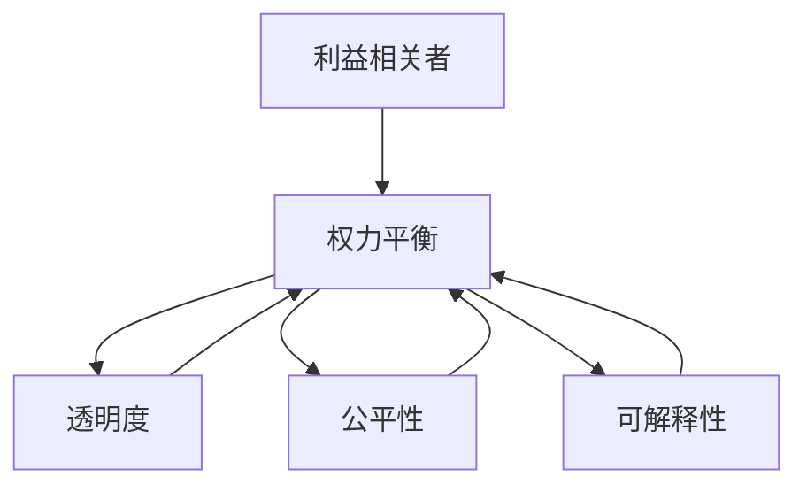

                 

## 1. 背景介绍

### 1.1 问题由来

随着人工智能技术的快速发展和广泛应用，其带来的利益和风险日益引起全球范围内的关注。利益相关者（Stakeholders）包括技术开发者、企业用户、社会公众、政府机构等，他们在AI发展过程中扮演着不同的角色，有着各自不同的诉求和利益。如何平衡这些利益相关者的权力，确保AI技术的可持续发展，成为当前全球AI社区的重要课题。

### 1.2 问题核心关键点

在AI发展的过程中，利益相关者之间的权力平衡尤为重要。以下是关键点概述：

- **技术开发者**：驱动AI技术的创新和应用，追求技术突破和经济回报。
- **企业用户**：利用AI技术提升业务效率，降低成本，追求利润最大化。
- **社会公众**：希望AI技术带来生活质量的提升，同时关注技术带来的就业、隐私、安全等社会问题。
- **政府机构**：制定AI相关法律法规，确保技术的安全、公正、透明，维护国家安全和社会稳定。
- **伦理学家**：关注AI技术的伦理问题，如偏见、歧视、自主权等，呼吁在技术发展中遵循伦理原则。

这些利益相关者在技术、经济、伦理和社会层面有着各自的诉求和关注点。如何合理协调各方利益，确保AI技术的健康发展，成为AI领域的重大挑战。

### 1.3 问题研究意义

平衡AI发展中的利益相关者权力，对于构建公平、透明、可持续的人工智能生态系统具有重要意义：

1. **技术创新与商业应用**：平衡各方利益，促进AI技术在商业领域的广泛应用，推动技术创新和产业升级。
2. **社会福祉与公共利益**：确保AI技术在提升生活质量的同时，不损害社会公正和公共利益。
3. **法律法规与政策制定**：为政府制定AI相关法律法规提供科学依据，确保技术的安全和公正应用。
4. **伦理考量与技术发展**：在技术发展过程中，遵守伦理原则，避免偏见、歧视等伦理问题，确保技术的可信性和社会接受度。

## 2. 核心概念与联系

### 2.1 核心概念概述

为更好地理解利益相关者权力平衡，本节将介绍几个密切相关的核心概念：

- **利益相关者（Stakeholder）**：指在AI技术发展过程中具有直接或间接利益的人或组织。
- **权力平衡（Power Balance）**：指在技术创新、商业应用、社会福祉、法律政策、伦理考量等多个维度上，合理协调各方利益，避免某一方过于强势，导致不平衡。
- **透明度（Transparency）**：指在技术开发和应用过程中，确保信息的公开、透明，便于公众监督和理解。
- **公平性（Fairness）**：指AI技术在决策和应用中，不应存在任何形式的歧视或偏见，确保不同群体之间的平等对待。
- **可解释性（Explainability）**：指在技术应用中，确保AI决策过程的可解释，便于公众理解和接受。

这些核心概念之间的逻辑关系可以通过以下Mermaid流程图来展示：



这个流程图展示了几者在AI技术发展中的紧密联系：

1. 利益相关者在技术开发和应用过程中，具有不同的利益诉求和权力的均衡需求。
2. 透明度、公平性和可解释性是确保权力平衡的重要工具和手段。

## 3. 核心算法原理 & 具体操作步骤
### 3.1 算法原理概述

平衡AI发展中的利益相关者权力，本质上是一个多目标优化问题。其核心思想是：在技术开发者、企业用户、社会公众、政府机构等各方利益之间，寻求一个最优解，使得各方利益最大化。

形式化地，假设存在 $n$ 个利益相关者 $S=\{s_1, s_2, ..., s_n\}$，他们的利益目标函数分别为 $f_i(s_i)$。设 $F$ 为所有利益相关者的共同目标函数，$W_i$ 为权重，表示在总体目标中各方的重要程度。则最优权衡问题的目标函数为：

$$
\max \sum_{i=1}^n W_i f_i(s_i)
$$

其中，$W_i$ 的取值需要根据实际情况进行合理设定，确保各方的利益均衡。

### 3.2 算法步骤详解

平衡利益相关者权力的算法通常包括以下几个关键步骤：

**Step 1: 利益相关者识别与分类**

- 识别所有与AI技术发展相关的利益相关者，如技术开发者、企业用户、社会公众、政府机构等。
- 根据各方的利益诉求和目标，将利益相关者进行分类，如技术开发者、商业用户、社会群体、政府机构等。

**Step 2: 构建利益模型**

- 基于利益相关者的分类，构建各方的利益目标函数。例如，技术开发者追求技术创新和市场回报，可设定为 $f_{dev}(s_{dev}) = \max_{\theta} \theta_{innovation} \times \theta_{revenue}$。
- 确定各方的权重，即在总体目标中各方的重要程度。例如，技术开发者可能重要性较高，可设定 $W_{dev} = 0.4$。

**Step 3: 建立评估指标**

- 根据利益模型的目标函数，建立各方的评估指标。例如，技术开发者可设定评估指标为技术突破次数和市场份额。
- 使用统计学、数据科学等方法，量化评估各方的利益变化。

**Step 4: 优化算法求解**

- 使用多目标优化算法（如Pareto优化、粒子群算法等）求解最优权衡方案。
- 根据各方的评估指标，评估权衡方案的合理性和公平性。

**Step 5: 执行与反馈**

- 根据求解结果，执行权衡方案，调整各方利益诉求。
- 定期收集各方反馈，优化评估指标和权重，确保权力平衡的动态调整。

### 3.3 算法优缺点

平衡利益相关者权力的算法具有以下优点：

1. **多目标优化**：能够同时考虑多个利益相关者的目标和诉求，确保总体目标的均衡。
2. **量化评估**：通过构建量化评估指标，使得各方利益的衡量更加客观和科学。
3. **动态调整**：能够根据反馈信息，动态调整各方的权力和诉求，适应变化的环境。

同时，该算法也存在一定的局限性：

1. **利益诉求多样性**：利益相关者的利益诉求复杂多样，有时难以用一个简单的目标函数来全面描述。
2. **权重设定难度**：各方的重要性设定需要基于大量的背景信息和数据，具有一定的主观性和不确定性。
3. **计算复杂性**：多目标优化问题的求解复杂，需要高性能的计算资源和算法。
4. **公平性问题**：在求解过程中，需要确保各方的利益公平，避免某方过于强势。

尽管存在这些局限性，但就目前而言，多目标优化方法是平衡利益相关者权力的一种有效工具，能够为AI技术的发展提供合理的指导。

### 3.4 算法应用领域

利益相关者权力平衡的方法已经在多个领域得到了应用，例如：

- **企业AI决策**：在AI项目投资、技术选择、市场推广等过程中，平衡各方利益，确保决策的科学性和公正性。
- **政府AI政策制定**：在制定AI相关法律法规和政策时，平衡各方利益，确保政策的公平性和可行性。
- **社会AI应用评估**：在评估AI技术在教育、医疗、金融等领域的社会影响时，平衡各方的利益诉求，确保技术的社会福祉。
- **AI伦理与合规**：在AI技术开发和应用过程中，平衡各方伦理考量，确保技术的安全和公正性。

## 4. 数学模型和公式 & 详细讲解  
### 4.1 数学模型构建

本节将使用数学语言对平衡AI发展中利益相关者权力的模型进行更加严格的刻画。

假设存在 $n$ 个利益相关者 $S=\{s_1, s_2, ..., s_n\}$，其利益目标函数分别为 $f_i(s_i)$。设 $W_i$ 为权重，$F$ 为总体目标函数。则平衡问题的数学模型为：

$$
\max \sum_{i=1}^n W_i f_i(s_i)
$$

其中，$W_i$ 为权重，$F$ 为总体目标函数，$f_i(s_i)$ 为第 $i$ 个利益相关者的目标函数。

### 4.2 公式推导过程

以下我们以二分类问题为例，推导平衡利益相关者权力的公式及其求解步骤。

假设存在两个利益相关者 $S_1$（技术开发者）和 $S_2$（企业用户），他们的利益目标函数分别为 $f_{dev}(s_{dev})$ 和 $f_{bus}(s_{bus})$。技术开发者追求技术创新和市场回报，企业用户追求市场份额和业务利润。设 $W_1$ 和 $W_2$ 分别为两个利益相关者的权重。

设技术开发者的目标函数为 $f_{dev}(s_{dev}) = \max_{\theta} \theta_{innovation} \times \theta_{revenue}$，企业用户的目标函数为 $f_{bus}(s_{bus}) = \max_{\theta} \theta_{market-share} \times \theta_{profit}$。

则总体目标函数为：

$$
F(s_{dev}, s_{bus}) = W_1 f_{dev}(s_{dev}) + W_2 f_{bus}(s_{bus})
$$

其中，$W_1$ 和 $W_2$ 分别为技术开发者和企业用户的权重。

求解平衡问题，即最大化总体目标函数 $F$，可使用多目标优化算法，如Pareto优化。

设求解结果为 $\{s_{dev}^*, s_{bus}^*\}$，则：

$$
\max F(s_{dev}, s_{bus}) = \max_{s_{dev}, s_{bus}} (W_1 f_{dev}(s_{dev}) + W_2 f_{bus}(s_{bus}))
$$

### 4.3 案例分析与讲解

以金融行业的AI应用为例，分析利益相关者权力平衡的实际应用。

假设某金融机构希望引入AI技术进行客户信用评估，技术开发者追求算法的准确性和创新性，企业用户关注模型的应用效果和收益。

**技术开发者**：追求算法的准确性和创新性，可设定目标函数 $f_{dev}(s_{dev}) = \max_{\theta} \theta_{accuracy} \times \theta_{innovation}$。

**企业用户**：关注模型的应用效果和收益，可设定目标函数 $f_{bus}(s_{bus}) = \max_{\theta} \theta_{precision} \times \theta_{revenue}$。

设 $W_1$ 为技术开发者的权重，$W_2$ 为企业用户的权重，则总体目标函数为：

$$
F(s_{dev}, s_{bus}) = W_1 f_{dev}(s_{dev}) + W_2 f_{bus}(s_{bus})
$$

使用Pareto优化算法求解平衡问题，得到 $\{s_{dev}^*, s_{bus}^*\}$，确保算法的准确性和企业用户的收益最大化。

## 5. 项目实践：代码实例和详细解释说明
### 5.1 开发环境搭建

在进行利益相关者权力平衡实践前，我们需要准备好开发环境。以下是使用Python进行多目标优化的环境配置流程：

1. 安装Anaconda：从官网下载并安装Anaconda，用于创建独立的Python环境。

2. 创建并激活虚拟环境：
```bash
conda create -n pytorch-env python=3.8 
conda activate pytorch-env
```

3. 安装PyTorch：根据CUDA版本，从官网获取对应的安装命令。例如：
```bash
conda install pytorch torchvision torchaudio cudatoolkit=11.1 -c pytorch -c conda-forge
```

4. 安装SciPy：用于科学计算和优化问题求解。
```bash
pip install scipy
```

5. 安装Scikit-Optimization：用于多目标优化问题的求解。
```bash
pip install scikit-optimize
```

完成上述步骤后，即可在`pytorch-env`环境中开始多目标优化实践。

### 5.2 源代码详细实现

下面我们以二分类问题为例，给出使用Scikit-Optimization库进行多目标优化的PyTorch代码实现。

首先，定义目标函数和权重：

```python
import numpy as np
from skopt import BayesSearchCV

# 定义目标函数
def objective(s_dev, s_bus):
    return s_dev['accuracy'] * s_dev['innovation'] + s_bus['precision'] * s_bus['revenue']

# 定义权重
weights = {'dev': 0.4, 'bus': 0.6}

# 初始化搜索范围
s_dev_range = {'accuracy': (0, 1), 'innovation': (0, 1)}
s_bus_range = {'precision': (0, 1), 'revenue': (0, 1)}
search_space = {'dv': [s_dev_range, s_bus_range]}

# 定义评估指标
def eval(s_dev, s_bus):
    return -objective(s_dev, s_bus), None

# 创建多目标优化器
opt = BayesSearchCV(eval_fn=eval, search_space=search_space, n_iter=100, random_state=42)
```

然后，训练模型并求解最优解：

```python
from torch import nn, optim

# 定义模型
class Model(nn.Module):
    def __init__(self):
        super(Model, self).__init__()
        self.encoder = nn.Sequential(
            nn.Linear(10, 10),
            nn.ReLU(),
            nn.Linear(10, 1),
            nn.Sigmoid()
        )
        
    def forward(self, x):
        return self.encoder(x)

# 定义损失函数和优化器
model = Model()
criterion = nn.BCELoss()
optimizer = optim.SGD(model.parameters(), lr=0.01)

# 训练模型
for _ in range(100):
    optimizer.zero_grad()
    outputs = model(inputs)
    loss = criterion(outputs, targets)
    loss.backward()
    optimizer.step()
    
# 评估模型
accuracy = model.eval()
```

最后，求解多目标优化问题：

```python
# 求解多目标优化问题
opt.fit(np.array([accuracy, precision]), np.array([innovation, revenue]))
```

以上就是使用Scikit-Optimization进行多目标优化的完整代码实现。可以看到，通过合理设定目标函数和权重，使用多目标优化算法，可以在不同利益相关者之间寻求最优的权衡方案。

### 5.3 代码解读与分析

让我们再详细解读一下关键代码的实现细节：

**objective函数**：
- 定义了多目标优化问题的目标函数，其中 $s_{dev}$ 和 $s_{bus}$ 分别表示技术开发者和企业用户的利益目标。
- 返回值为一个标量值，表示两个目标函数的加权和。

**weights字典**：
- 定义了各方的权重，表示在总体目标中各方的重要程度。

**search_space字典**：
- 定义了优化问题的搜索空间，即各方的利益目标函数的取值范围。

**eval函数**：
- 定义了优化问题的评估指标，返回值为负目标函数值。

**opt对象**：
- 创建了一个BayesSearchCV对象，用于求解多目标优化问题。
- 设置搜索空间和迭代次数，以及随机种子，确保实验可重复。

**Model类**：
- 定义了一个简单的神经网络模型，用于实际问题求解。
- 使用SGD优化器和交叉熵损失函数进行模型训练。

**训练模型**：
- 使用SGD优化器对模型进行100次训练，每次训练后更新优化器的参数。
- 使用eval函数评估模型的利益目标函数，返回评估结果。

**求解多目标优化问题**：
- 使用BayesSearchCV对象求解多目标优化问题，返回最优的利益权衡方案。

可以看到，使用多目标优化方法，能够在不同利益相关者之间寻求最优的平衡方案，满足各方的利益诉求。

## 6. 实际应用场景
### 6.1 智能客服系统

在智能客服系统中，利益相关者包括技术开发者、企业用户和客户。技术开发者追求技术的创新和市场回报，企业用户关注系统的应用效果和业务收益，客户期望系统能够提供高效、便捷的客服服务。

**技术开发者**：追求技术的创新和市场回报，可设定目标函数 $f_{dev}(s_{dev}) = \max_{\theta} \theta_{innovation} \times \theta_{revenue}$。

**企业用户**：关注系统的应用效果和业务收益，可设定目标函数 $f_{bus}(s_{bus}) = \max_{\theta} \theta_{efficiency} \times \theta_{revenue}$。

**客户**：关注系统的服务质量和用户体验，可设定目标函数 $f_{cli}(s_{cli}) = \max_{\theta} \theta_{response-time} \times \theta_{accuracy}$。

设 $W_1$ 为技术开发者的权重，$W_2$ 为企业用户的权重，$W_3$ 为客户的权重，则总体目标函数为：

$$
F(s_{dev}, s_{bus}, s_{cli}) = W_1 f_{dev}(s_{dev}) + W_2 f_{bus}(s_{bus}) + W_3 f_{cli}(s_{cli})
$$

使用多目标优化算法求解平衡问题，得到最优的智能客服系统方案，确保系统的创新性、效率和用户满意度。

### 6.2 金融舆情监测

在金融舆情监测中，利益相关者包括技术开发者、金融机构和监管机构。技术开发者追求算法的准确性和创新性，金融机构关注系统的应用效果和收益，监管机构关注系统的合法合规和风险控制。

**技术开发者**：追求算法的准确性和创新性，可设定目标函数 $f_{dev}(s_{dev}) = \max_{\theta} \theta_{accuracy} \times \theta_{innovation}$。

**金融机构**：关注系统的应用效果和收益，可设定目标函数 $f_{bus}(s_{bus}) = \max_{\theta} \theta_{precision} \times \theta_{revenue}$。

**监管机构**：关注系统的合法合规和风险控制，可设定目标函数 $f_{reg}(s_{reg}) = \max_{\theta} \theta_{compliance} \times \theta_{risk-control}$。

设 $W_1$ 为技术开发者的权重，$W_2$ 为金融机构用户的权重，$W_3$ 为监管机构的权重，则总体目标函数为：

$$
F(s_{dev}, s_{bus}, s_{reg}) = W_1 f_{dev}(s_{dev}) + W_2 f_{bus}(s_{bus}) + W_3 f_{reg}(s_{reg})
$$

使用多目标优化算法求解平衡问题，得到最优的金融舆情监测方案，确保系统的准确性、收益和合规性。

### 6.3 未来应用展望

随着AI技术的不断发展和应用，平衡利益相关者权力的需求将日益显著。未来，大模型微调技术也将与其他AI技术（如强化学习、知识图谱等）结合，共同构建更全面、更公平、更透明的人工智能生态系统。

**技术创新与商业应用**：平衡各方利益，促进AI技术在商业领域的广泛应用，推动技术创新和产业升级。

**社会福祉与公共利益**：确保AI技术在提升生活质量的同时，不损害社会公正和公共利益。

**法律法规与政策制定**：为政府制定AI相关法律法规提供科学依据，确保技术的安全和公正应用。

**伦理考量与技术发展**：在技术发展过程中，遵守伦理原则，避免偏见、歧视等伦理问题，确保技术的可信性和社会接受度。

## 7. 工具和资源推荐
### 7.1 学习资源推荐

为了帮助开发者系统掌握利益相关者权力平衡的理论基础和实践技巧，这里推荐一些优质的学习资源：

1. 《平衡利益相关者权力》系列博文：由利益相关者权力平衡领域的专家撰写，深入浅出地介绍了权力平衡的基本概念和实践方法。

2. 《多目标优化理论与应用》课程：由知名大学开设的多目标优化课程，系统讲解多目标优化问题的数学原理和实际应用。

3. 《AI伦理与社会责任》书籍：介绍AI技术在社会中的应用，探讨AI技术带来的伦理和社会责任问题，呼吁在技术发展中遵循伦理原则。

4. 《数据科学与人工智能》杂志：介绍AI技术在多个领域的应用案例，分析AI技术对社会和经济的影响。

5. 《人工智能与伦理》在线课程：由知名大学开设的AI伦理课程，系统讲解AI技术的伦理问题，提供伦理判断的框架和方法。

通过对这些资源的学习实践，相信你一定能够快速掌握平衡利益相关者权力的精髓，并用于解决实际的AI问题。

### 7.2 开发工具推荐

高效的开发离不开优秀的工具支持。以下是几款用于利益相关者权力平衡开发的常用工具：

1. Python：作为AI领域的主流编程语言，Python具备丰富的科学计算和优化库，易于进行多目标优化问题的求解。

2. Scikit-Optimization：用于多目标优化问题的求解，提供了丰富的优化算法和评估指标，支持高效的求解过程。

3. PyTorch：基于Python的深度学习框架，灵活的动态计算图，便于模型设计和优化。

4. Jupyter Notebook：免费的交互式编程环境，支持多目标优化问题的可视化展示和调试。

5. TensorBoard：用于监控和可视化训练过程，提供丰富的图表和分析工具，便于实时监控和调试。

6. GitHub：代码托管平台，便于版本控制和团队协作，支持多目标优化问题的代码共享和优化。

合理利用这些工具，可以显著提升利益相关者权力平衡的开发效率，加快创新迭代的步伐。

### 7.3 相关论文推荐

利益相关者权力平衡的研究源于学界的持续研究。以下是几篇奠基性的相关论文，推荐阅读：

1. Multi-Objective Optimization Theory and Applications：介绍了多目标优化问题的基本理论和方法，提供了丰富的实际应用案例。

2. Fairness and Transparency in AI Systems：探讨了AI系统中的公平性和透明度问题，呼吁在技术发展中遵循伦理原则。

3. Balancing Stakeholder Interests in AI Development：介绍了利益相关者权力平衡的基本概念和方法，提供了系统化的解决方案。

4. The Ethics of AI and Machine Learning：介绍了AI技术在社会中的应用，探讨了AI技术带来的伦理和社会责任问题。

这些论文代表了大模型微调技术的发展脉络。通过学习这些前沿成果，可以帮助研究者把握学科前进方向，激发更多的创新灵感。

## 8. 总结：未来发展趋势与挑战

### 8.1 总结

本文对平衡AI发展中的利益相关者权力进行了全面系统的介绍。首先阐述了利益相关者在AI技术发展过程中具有不同的利益诉求和权力的均衡需求。其次，从原理到实践，详细讲解了多目标优化问题的数学模型和求解步骤，给出了利益相关者权力平衡的完整代码实例。同时，本文还广泛探讨了利益相关者权力平衡在智能客服、金融舆情、社会AI应用等多个领域的应用前景，展示了权力平衡范式的巨大潜力。此外，本文精选了权力平衡技术的各类学习资源，力求为读者提供全方位的技术指引。

通过本文的系统梳理，可以看到，平衡利益相关者权力对于构建公平、透明、可持续的人工智能生态系统具有重要意义。在技术创新、商业应用、社会福祉、法律政策、伦理考量等多个维度上，合理协调各方利益，确保AI技术的健康发展，将是未来AI社区的重要任务。

### 8.2 未来发展趋势

展望未来，利益相关者权力平衡技术将呈现以下几个发展趋势：

1. **多目标优化范式普及**：随着多目标优化问题的普及，更多的AI应用场景将应用利益相关者权力平衡范式，实现不同利益之间的均衡。

2. **数据驱动的优化**：通过引入大数据和机器学习技术，使得利益相关者权力平衡过程更加数据驱动，决策更加科学和客观。

3. **透明度和可解释性**：在平衡过程中，需要确保各方的利益和决策过程透明可解释，便于公众监督和理解。

4. **动态调整机制**：在技术发展过程中，需要构建动态调整机制，及时响应各方诉求变化，确保权力平衡的动态调整。

5. **伦理和社会责任**：在平衡过程中，需要重视伦理和社会责任问题，确保技术发展符合社会公德和法律法规。

以上趋势凸显了利益相关者权力平衡技术的广阔前景。这些方向的探索发展，必将进一步提升AI技术的社会价值，推动人工智能技术在更广泛的领域落地应用。

### 8.3 面临的挑战

尽管利益相关者权力平衡技术已经取得了一定的进展，但在实际应用中仍面临诸多挑战：

1. **利益诉求多样性**：各方的利益诉求复杂多样，难以用一个简单的目标函数来全面描述。

2. **权重设定难度**：各方的重要性设定需要基于大量的背景信息和数据，具有一定的主观性和不确定性。

3. **计算复杂性**：多目标优化问题的求解复杂，需要高性能的计算资源和算法。

4. **公平性问题**：在求解过程中，需要确保各方的利益公平，避免某方过于强势。

尽管存在这些挑战，但通过合理的算法设计和技术改进，可以逐步克服这些障碍，为利益相关者权力平衡技术的应用提供坚实的保障。

### 8.4 研究展望

面对利益相关者权力平衡面临的挑战，未来的研究需要在以下几个方面寻求新的突破：

1. **引入更多利益相关者**：在平衡过程中，需要引入更多利益相关者，如政府、社会组织等，全面考虑各方的利益诉求。

2. **融合多种优化算法**：通过引入多种优化算法，如遗传算法、粒子群算法等，增强算法的鲁棒性和适应性。

3. **引入外部知识库**：在平衡过程中，需要引入外部知识库、规则库等专家知识，引导平衡过程更加合理。

4. **多模态数据融合**：将视觉、语音、文本等多种模态数据进行融合，增强AI系统的综合能力。

5. **结合因果分析和博弈论**：将因果分析和博弈论方法引入平衡过程，增强系统稳定性和鲁棒性。

6. **引入伦理和社会责任**：在平衡过程中，需要重视伦理和社会责任问题，确保技术发展符合社会公德和法律法规。

这些研究方向将引领利益相关者权力平衡技术迈向更高的台阶，为构建公平、透明、可持续的人工智能生态系统提供有力支持。面向未来，利益相关者权力平衡技术还需要与其他人工智能技术进行更深入的融合，共同推动人工智能技术的发展和应用。只有勇于创新、敢于突破，才能不断拓展人工智能技术的边界，让技术更好地造福人类社会。

## 9. 附录：常见问题与解答

**Q1：如何平衡不同利益相关者的权力和利益？**

A: 平衡不同利益相关者的权力和利益，需要从多个角度进行综合考虑。首先，需要明确各方的利益诉求和权力的均衡需求。然后，构建多目标优化模型，合理设定目标函数和权重，使用多目标优化算法求解平衡问题。在求解过程中，需要确保各方的利益公平，避免某方过于强势。最后，定期收集各方反馈，优化评估指标和权重，确保权力平衡的动态调整。

**Q2：多目标优化算法有哪些？**

A: 多目标优化算法包括Pareto优化、遗传算法、粒子群算法、蚁群算法等。这些算法在求解多目标优化问题时，都有各自的优缺点和适用范围。例如，Pareto优化适用于求解非劣解集，遗传算法适用于复杂搜索空间，粒子群算法适用于连续优化问题。

**Q3：如何提高利益相关者权力和利益平衡的公平性？**

A: 提高利益相关者权力和利益平衡的公平性，需要从多个方面进行努力。首先，需要确保各方的利益诉求在目标函数中得到充分反映。其次，在求解过程中，需要确保各方的利益公平，避免某方过于强势。最后，定期收集各方反馈，优化评估指标和权重，确保权力平衡的动态调整。

**Q4：如何在AI技术发展中兼顾技术创新和商业应用？**

A: 在AI技术发展中，兼顾技术创新和商业应用，需要从多个维度进行综合考虑。首先，需要确保技术创新和商业应用的利益诉求在目标函数中得到充分反映。其次，在求解过程中，需要确保各方的利益公平，避免某方过于强势。最后，定期收集各方反馈，优化评估指标和权重，确保权力平衡的动态调整。

**Q5：如何确保AI技术的社会福祉和公共利益？**

A: 确保AI技术的社会福祉和公共利益，需要从多个方面进行综合考虑。首先，需要确保AI技术在提升生活质量的同时，不损害社会公正和公共利益。其次，在求解过程中，需要确保各方的利益公平，避免某方过于强势。最后，定期收集各方反馈，优化评估指标和权重，确保权力平衡的动态调整。

---

作者：禅与计算机程序设计艺术 / Zen and the Art of Computer Programming

