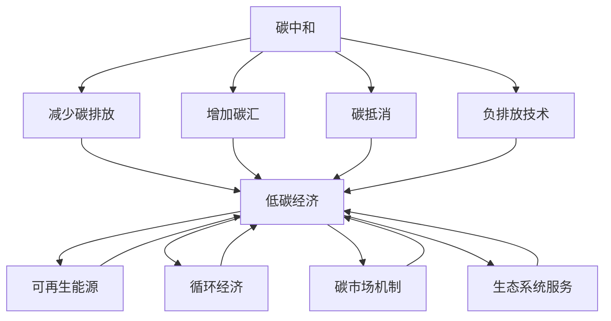

                 

# 2050年的全球减排：从负排放技术到碳中和经济的气候治理

> 关键词：气候治理, 碳中和, 负排放技术, 低碳经济, 能源转型, 可再生能源, 碳捕捉与封存, 循环经济, 碳市场机制, 生态系统服务

## 1. 背景介绍

### 1.1 问题由来

进入21世纪以来，全球气候变化问题日益严峻，极端天气事件频发，生态环境恶化，人类面临前所未有的环境危机。为应对这一挑战，各国政府、国际组织和企业纷纷采取行动，推动绿色低碳转型，旨在实现气候目标，守护地球家园。

气候治理的核心在于通过多种手段减少温室气体排放，降低碳强度，最终实现碳中和。具体而言，即在全球范围内，到2050年前，将碳排放量降至净零。这不仅是一项技术挑战，也是一场复杂的经济和政策协调行动。

### 1.2 问题核心关键点

实现碳中和的路径包括减少碳排放、增加碳汇、进行碳抵消和采用负排放技术。以下是对这些关键点的详细描述：

1. **减少碳排放**：通过改进能源结构，减少化石燃料使用，提高能源效率，推进工业、交通和建筑等领域的绿色转型。

2. **增加碳汇**：通过植树造林、湿地恢复、土壤固碳等生态工程，增强生态系统对二氧化碳的吸收能力。

3. **碳抵消**：通过碳交易市场，通过购买减排指标或进行碳抵消项目，实现碳排放的净零。

4. **负排放技术**：采用直接捕集与封存、生物能源与碳捕捉、土壤固碳等技术，实现超过其产生的碳排放，达到负排放。

## 2. 核心概念与联系

### 2.1 核心概念概述

为更好地理解从负排放技术到碳中和经济的气候治理，本节将介绍几个密切相关的核心概念：

- **碳中和（Carbon Neutrality）**：在一定时间内，碳排放量与碳吸收量相等，净碳排放为零的状态。
- **负排放技术（Negative Emissions Technology）**：通过技术手段实现碳排放低于其吸收的碳排放量，从而实现负排放。
- **低碳经济（Low Carbon Economy）**：以减少温室气体排放、提高能源效率为核心的经济发展模式，促进绿色可持续转型。
- **可再生能源（Renewable Energy）**：利用风能、太阳能、水能等自然能源，实现能源的自我可持续供给。
- **碳捕捉与封存（Carbon Capture and Storage, CCUS）**：通过技术手段捕获工业排放的二氧化碳，并将其封存于地下或海洋中。
- **循环经济（Circular Economy）**：通过产品设计、制造、使用、回收再利用等环节，实现资源的循环利用，减少资源消耗和废弃物产生。
- **碳市场机制（Carbon Market Mechanism）**：通过建立碳交易市场，促进减排行动的广泛参与和有效监督。
- **生态系统服务（Ecosystem Services）**：自然环境提供给人类社会生存和发展的各类服务，如碳汇、水循环、空气净化等。

这些核心概念之间的逻辑关系可以通过以下Mermaid流程图来展示：



这个流程图展示了一系列概念的联系，以及它们如何共同构成实现碳中和的战略框架。

## 3. 核心算法原理 & 具体操作步骤
### 3.1 算法原理概述

碳中和目标的实现涉及复杂的算法和技术手段。本节将从原理上介绍关键的算法，并说明其实现步骤。

1. **系统动力学模型（System Dynamics Modeling）**：通过建立系统动力学模型，模拟气候变化和碳排放路径，分析不同政策和技术方案的效果。
2. **优化算法（Optimization Algorithms）**：采用优化算法，如线性规划、整数规划等，优化能源结构、产业布局和交通系统，实现低碳化目标。
3. **机器学习（Machine Learning）**：利用机器学习算法，分析历史数据，预测未来趋势，指导政策和技术的实施。

### 3.2 算法步骤详解

碳中和的实现步骤如下：

1. **碳排放分析**：通过系统动力学模型和优化算法，分析当前的碳排放路径，识别主要碳源和汇，确定减排优先级。
2. **技术方案设计**：基于负排放技术和低碳经济理念，设计多种减排方案，包括可再生能源、碳捕捉与封存、循环经济等。
3. **模拟与评估**：使用机器学习算法，建立模拟模型，评估各种技术方案的经济性、可行性和环境影响。
4. **政策制定**：根据模拟结果，制定相关政策，如碳税、碳交易、能源补贴等，激励低碳转型。
5. **监测与调整**：建立碳排放监测系统，实时跟踪减排进度，根据实际情况调整政策和技术方案。

### 3.3 算法优缺点

碳中和技术的算法实现具有以下优点：

1. **科学性**：通过系统动力学模型和优化算法，结合机器学习预测，提高了减排方案的科学性和可行性。
2. **全面性**：考虑了多种技术方案，综合考虑了经济、环境和社会效益。
3. **动态性**：能够实时监测和调整，适应动态变化的市场和技术环境。

同时，该算法也存在以下局限性：

1. **复杂性**：涉及多目标、多变量、多层次的复杂问题，算法实现较为复杂。
2. **数据依赖**：需要大量高质量的数据作为输入，数据缺失或不准确会影响结果。
3. **执行难度**：需要跨学科、跨部门的高层次协调和合作，实施难度较大。

### 3.4 算法应用领域

碳中和技术的应用领域包括：

- **能源领域**：推广可再生能源，提高能源效率，实现能源结构的绿色转型。
- **工业领域**：采用碳捕捉与封存技术，优化生产流程，减少工业排放。
- **交通领域**：发展电动汽车和清洁能源交通工具，推广公共交通。
- **建筑领域**：推进绿色建筑设计，提高建筑能效，实现低碳建筑。
- **农业领域**：采用精准农业技术，减少农业碳排放，增加农业碳汇。

## 4. 数学模型和公式 & 详细讲解 & 举例说明

### 4.1 数学模型构建

碳中和的数学模型可以由以下部分组成：

1. **碳排放模型**：表示一定时间内的碳排放量，通常表示为总排放量 $E_{total}$。
2. **碳吸收模型**：表示自然界和人工干预下的碳吸收量，通常表示为总吸收量 $A_{total}$。
3. **碳抵消模型**：表示通过碳交易和碳抵消项目的碳抵消量，通常表示为碳抵消量 $C_{offset}$。
4. **负排放模型**：表示负排放技术的碳吸收量，通常表示为负排放量 $N_{negative}$。

综合这些模型，我们可以建立碳中和的数学模型：

$$
E_{total} = A_{total} + C_{offset} + N_{negative}
$$

### 4.2 公式推导过程

在推导过程中，我们假设碳排放量和碳吸收量随时间的变化如下：

- **碳排放量**：$E(t) = E_0 + k_1 + k_2t$，其中 $E_0$ 为初始排放量，$k_1$ 为常量，$k_2$ 为线性增长率。
- **碳吸收量**：$A(t) = A_0 + k_3 + k_4t$，其中 $A_0$ 为初始吸收量，$k_3$ 为常量，$k_4$ 为线性增长率。

将这些模型代入碳中和方程，可以得到：

$$
E_{total} = (A_0 + k_3 + k_4t) + C_{offset} + (N_{negative} - k_2t)
$$

化简得：

$$
E_{total} = A_0 + k_3 + C_{offset} + N_{negative} + (k_4 - k_2)t
$$

### 4.3 案例分析与讲解

以一个具体的碳中和项目为例，分析其实施过程。

假设某地区初始碳排放量为 $E_0 = 1000$ 吨/年，初始碳吸收量为 $A_0 = 500$ 吨/年，碳抵消量为 $C_{offset} = 200$ 吨/年，负排放量为 $N_{negative} = 300$ 吨/年，线性增长率为 $k_4 = 0.1$，常量为 $k_1 = k_3 = 0$。

我们可以通过该模型计算不同时间点的净排放量，并判断是否达到了碳中和。例如，当 $t = 10$ 年时，净排放量为：

$$
E_{total} = 500 + 0 + 200 + 300 + (0.1 - 0) \times 10 = 1000
$$

因此，该地区在 $t = 10$ 年时达到了碳中和。

## 5. 项目实践：代码实例和详细解释说明
### 5.1 开发环境搭建

要实施上述模型，我们需要搭建以下开发环境：

1. **Python环境**：确保Python 3.x版本安装，建议使用Anaconda或Miniconda进行环境管理。
2. **NumPy库**：用于数组计算和矩阵操作。
3. **Pandas库**：用于数据处理和分析。
4. **Matplotlib库**：用于数据可视化。
5. **SciPy库**：用于科学计算和优化。

### 5.2 源代码详细实现

以下是使用Python实现的碳中和模拟代码：

```python
import numpy as np
import pandas as pd
import matplotlib.pyplot as plt
from scipy.optimize import linprog

# 碳排放模型
def carbon_emission(t, k1, k2):
    return k1 + k2 * t

# 碳吸收模型
def carbon_absorption(t, k3, k4):
    return k3 + k4 * t

# 碳中和方程
def carbon_neutrality(E0, k1, k2, A0, k3, k4, C_offset, N_negative):
    return E0 + k3 + C_offset + N_negative + (k4 - k2) * t

# 数据输入
E0 = 1000  # 初始碳排放量
k1 = 0    # 常量
k2 = 0.1  # 线性增长率
A0 = 500  # 初始碳吸收量
k3 = 0    # 常量
k4 = 0.1  # 线性增长率
C_offset = 200  # 碳抵消量
N_negative = 300  # 负排放量

# 时间范围
t_range = np.arange(0, 20, 0.1)

# 计算净排放量
E_total = [carbon_neutrality(E0, k1, k2, A0, k3, k4, C_offset, N_negative) for t in t_range]

# 可视化
plt.plot(t_range, E_total)
plt.xlabel('时间（年）')
plt.ylabel('净排放量（吨/年）')
plt.title('碳中和模拟')
plt.show()
```

### 5.3 代码解读与分析

以上代码实现了一个简单的碳中和模拟，使用了Python中的NumPy、Pandas、Matplotlib和SciPy库。

1. **碳排放和碳吸收模型**：使用函数定义，方便复用。
2. **碳中和方程**：根据碳排放和碳吸收模型，计算不同时间的净排放量。
3. **数据输入**：初始排放量、增长率、吸收量等参数输入。
4. **时间范围**：定义时间范围，用于模拟计算。
5. **计算净排放量**：使用列表推导式计算不同时间的净排放量。
6. **可视化**：使用Matplotlib库绘制净排放量随时间的变化曲线。

## 6. 实际应用场景
### 6.1 智慧能源系统

智慧能源系统是实现碳中和的关键组成部分。通过智能电网、可再生能源集成和储能技术，智慧能源系统能够实现能源的高效利用和低碳转型。

在智慧能源系统中，可再生能源如风能、太阳能等作为主要能源来源，通过智能电网进行实时调度，实现能源的高效分配和利用。同时，储能技术如电池储能、抽水蓄能等，可以有效平衡能源供需，提升系统的稳定性和可靠性。

### 6.2 智能交通网络

智能交通网络通过智能交通管理和电动汽车普及，减少交通领域的碳排放。

在智能交通网络中，智能交通管理系统通过实时监控和数据分析，优化交通流，减少拥堵和排放。电动汽车和清洁能源交通工具的普及，减少了传统燃油车辆的使用，进一步降低了碳排放。

### 6.3 绿色建筑

绿色建筑通过节能设计和智能化管理，实现低碳建筑目标。

绿色建筑采用高效隔热材料、节能窗户、太阳能光伏等技术，降低建筑能耗。同时，智能建筑管理系统通过传感器和数据分析，优化能源使用，实现能源的高效利用和减少碳排放。

### 6.4 循环经济

循环经济通过资源循环利用和减量化生产，减少工业领域的碳排放。

循环经济通过产品设计、生产、使用和回收再利用等环节，实现资源的循环利用，减少资源的消耗和废弃物的产生。例如，采用可回收材料、优化生产工艺、延长产品使用寿命等，降低工业领域的碳排放。

## 7. 工具和资源推荐
### 7.1 学习资源推荐

为了帮助开发者系统掌握碳中和技术的理论基础和实践技巧，这里推荐一些优质的学习资源：

1. **《碳中和与可持续发展》（书籍）**：系统介绍了碳中和的基本概念、政策框架和技术路径，适合入门学习。
2. **《可再生能源技术》（课程）**：介绍可再生能源的基本原理和应用技术，包括太阳能、风能、水能等。
3. **《智慧能源系统》（课程）**：讲解智慧能源系统的设计、实现和运营，包括智能电网、储能技术等。
4. **《智能交通管理》（课程）**：介绍智能交通管理的理论和技术，包括V2X通信、车路协同等。
5. **《绿色建筑设计与管理》（书籍）**：介绍绿色建筑的设计理念和实践方法，包括节能材料、智能系统等。

通过对这些资源的学习实践，相信你一定能够快速掌握碳中和技术的精髓，并用于解决实际的环保问题。

### 7.2 开发工具推荐

高效的开发离不开优秀的工具支持。以下是几款用于碳中和技术开发的常用工具：

1. **Jupyter Notebook**：支持Python和其他科学计算语言的交互式编程，方便开发和调试。
2. **Anaconda**：提供Python及其科学计算库的安装和管理，支持虚拟环境。
3. **SciPy**：用于科学计算和优化，包括线性规划、非线性规划等。
4. **TensorFlow**：用于深度学习和机器学习模型的训练和部署。
5. **PyTorch**：用于深度学习和机器学习模型的开发和优化。

合理利用这些工具，可以显著提升碳中和技术开发和应用的效果。

### 7.3 相关论文推荐

碳中和技术的发展源于学界的持续研究。以下是几篇奠基性的相关论文，推荐阅读：

1. **《全球气候治理的挑战与路径》**：分析全球气候变化的现状和挑战，提出实现碳中和的多路径解决方案。
2. **《能源转型与低碳经济》**：探讨能源结构转型对经济和社会的影响，提出低碳经济的实现路径。
3. **《循环经济与工业低碳化》**：研究循环经济的基本原理和实践方法，探讨其在工业领域的应用。
4. **《智能电网与可再生能源集成》**：介绍智能电网的设计和实现，探讨可再生能源的集成和管理。
5. **《绿色建筑与智慧城市》**：研究绿色建筑和智慧城市的设计理念和实现方法，提出智能建筑系统解决方案。

这些论文代表了大规模技术发展的最新趋势，可以帮助研究者把握学科前进方向，激发更多的创新灵感。

## 8. 总结：未来发展趋势与挑战
### 8.1 总结

本文对碳中和技术的实现路径进行了全面系统的介绍。首先阐述了碳中和的基本概念和实现路径，明确了减少碳排放、增加碳汇、进行碳抵消和采用负排放技术的重要性。其次，从原理到实践，详细讲解了碳中和数学模型和关键步骤，给出了碳中和技术开发的完整代码实例。同时，本文还广泛探讨了智慧能源系统、智能交通网络、绿色建筑和循环经济等实际应用场景，展示了碳中和技术在多个领域的应用前景。

通过本文的系统梳理，可以看到，碳中和技术是实现全球减排目标的关键手段，具有广泛的应用价值和实践意义。未来的气候治理，离不开新技术、新模式和新政策的创新和协同。

### 8.2 未来发展趋势

展望未来，碳中和技术的实现将呈现以下几个发展趋势：

1. **技术革新**：随着科技的进步，更多先进的减排技术将出现，如碳捕捉与封存、生物能源与碳捕捉等，提高减排效果。
2. **经济驱动**：低碳经济的发展将加速，更多市场机制如碳税、碳交易、能源补贴等将推动减排行动。
3. **政策支持**：各国政府将加大对低碳技术的投资和支持，制定更多环保政策和法规，促进减排行动。
4. **全球合作**：全球范围内的合作将加强，共同应对气候变化，实现碳中和目标。
5. **科技创新**：更多跨学科的研究将涌现，推动新材料、新工艺、新设备的研发，提高减排效率。

这些趋势凸显了碳中和技术的广阔前景，为实现全球减排目标提供了更多可能性。

### 8.3 面临的挑战

尽管碳中和技术在逐步推进，但在迈向实现的过程中，仍面临诸多挑战：

1. **技术成本**：许多减排技术仍处于研发阶段，成本较高，需要大规模投入。
2. **政策执行**：减排政策需要各级政府的协调和执行，面临执行难度和阻力。
3. **社会接受**：公众对低碳技术的认知和接受度不足，需要加强宣传和教育。
4. **资源分配**：资源在各地区和各领域的分配不均衡，需要合理规划和协调。
5. **技术冲突**：现有技术可能与新出现的减排技术存在冲突，需要协调和优化。

这些挑战需要通过技术创新、政策制定和社会宣传等多方面的努力，才能逐步克服。

### 8.4 研究展望

未来，碳中和技术的研究将聚焦以下几个方向：

1. **技术集成**：更多新技术的集成应用，如碳捕捉与封存、生物能源与碳捕捉、循环经济等。
2. **跨学科融合**：与人工智能、大数据、物联网等技术进行深入融合，提升减排效率和效果。
3. **国际合作**：加强国际合作，推动全球范围内的减排行动，实现全球气候治理目标。
4. **持续创新**：不断推动技术创新和模式创新，探索更多实现碳中和的路径。

这些研究方向的探索，必将引领碳中和技术迈向更高的台阶，为实现全球减排目标提供更多方案。

## 9. 附录：常见问题与解答

**Q1：碳中和与低碳经济有何区别？**

A: 碳中和是指在一定时间内，碳排放量与碳吸收量相等，净碳排放为零的状态。而低碳经济是指以减少温室气体排放、提高能源效率为核心的经济发展模式，旨在实现可持续发展和绿色转型。

**Q2：实现碳中和的关键技术有哪些？**

A: 实现碳中和的关键技术包括：可再生能源、碳捕捉与封存、生物能源与碳捕捉、循环经济、智能电网、智慧交通、绿色建筑等。

**Q3：碳中和技术实施过程中面临的主要挑战是什么？**

A: 碳中和技术实施过程中面临的主要挑战包括技术成本高、政策执行难度大、公众认知度低、资源分配不均和技术冲突等。

**Q4：未来碳中和技术的发展趋势有哪些？**

A: 未来碳中和技术的发展趋势包括技术革新、经济驱动、政策支持、全球合作和科技创新等。

**Q5：如何推动碳中和技术的普及和应用？**

A: 推动碳中和技术的普及和应用，需要政府、企业和公众的共同努力。政府应制定政策支持和技术补贴，企业应积极采用新技术和模式，公众应加强环保意识和参与度。

---

作者：禅与计算机程序设计艺术 / Zen and the Art of Computer Programming

