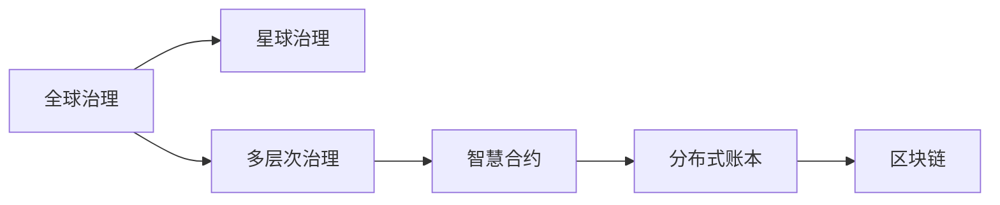

                 

# 2050年的全球治理：从全球多层次治理到星球治理的治理结构演进

> 关键词：全球治理, 星球治理, 多层次治理, 智慧合约, 分布式账本, 区块链

## 1. 背景介绍

### 1.1 问题由来
全球治理是人类社会面临的复杂挑战之一，涉及到国家间经济、政治、环境、健康等诸多领域的合作与协调。随着全球化的深入和科技的迅猛发展，原有的中央集权式治理结构已难以满足日益多样化的国际需求。如何构建高效、公正、透明的全球治理体系，成为了国际社会共同关注的焦点。

### 1.2 问题核心关键点
2050年的全球治理将面临以下几个关键挑战：

- **技术革命**：人工智能、区块链、物联网等新技术正在重塑国际关系和合作模式。
- **地缘政治变化**：国家间力量对比失衡，地缘政治博弈加剧，对全球治理提出了新的要求。
- **气候变化**：极端气候事件频发，环境问题成为国际合作的紧迫任务。
- **经济不平等**：贫富差距扩大，南北差距明显，全球治理需兼顾公平与效率。
- **公共卫生危机**：新冠疫情等公共卫生事件暴露了全球公共卫生治理体系的薄弱环节。

### 1.3 问题研究意义
理解并设计未来2050年的全球治理体系，对于推动全球可持续发展、实现世界和平与繁荣具有重要意义：

- **促进国际合作**：构建多方参与、协同共治的治理结构，促进全球范围内的合作与交流。
- **提升治理效率**：利用先进技术，提高全球治理的透明度、公平性和效率。
- **应对全球性挑战**：通过智能合约、分布式账本等技术，应对气候变化、公共卫生等全球性挑战。
- **确保国家利益**：在维护国家主权和安全的基础上，推动全球治理体系向更加包容和可持续的方向发展。

## 2. 核心概念与联系

### 2.1 核心概念概述

为了更好地理解2050年的全球治理结构演进，我们需要先明确一些核心概念：

- **全球治理**：指多边、多层次、多领域的国际合作机制和规范体系，旨在解决跨国问题和全球性挑战。
- **星球治理**：指在星球尺度上，构建统一、协调的治理体系，涵盖环境保护、资源利用、空间探索等全球性问题。
- **多层次治理**：包括国家、区域、国际等多个层级，形成一个互相协调、互相支撑的治理网络。
- **智慧合约**：基于区块链技术，自动执行、不可篡改、透明可信的合约，用于简化交易和治理过程。
- **分布式账本**：一种去中心化的数据库，记录所有交易信息，确保数据透明和不可篡改。
- **区块链**：一种分布式账本技术，通过共识机制和加密技术，保障数据的安全和可靠性。

这些概念之间具有密切的联系，共同构成未来全球治理的新范式。

### 2.2 核心概念原理和架构的 Mermaid 流程图(Mermaid 流程节点中不要有括号、逗号等特殊字符)


### 2.3 核心概念之间的联系

全球治理体系的设计与实施，离不开先进技术手段的支持。具体来说，多层次治理框架下，智慧合约和分布式账本技术的应用，将大大提升治理效率和透明度。而区块链的分布式特性，则为全球治理提供了一个安全、可靠的数据基础设施。

## 3. 核心算法原理 & 具体操作步骤

### 3.1 算法原理概述

未来全球治理的核心算法原理，主要基于区块链和智慧合约技术。这些技术能够保障数据的安全、透明和可信，同时通过自动化合约执行，简化治理流程，提高治理效率。

### 3.2 算法步骤详解

#### 3.2.1 数据层设计
- **分布式账本**：采用区块链技术构建分布式账本，记录全球治理的各项决策、交易和记录，确保数据的透明性和不可篡改性。
- **智能合约**：基于区块链，设计智能合约，自动执行全球治理中的各项任务和协议，如投票决策、资源分配、冲突仲裁等。

#### 3.2.2 共识机制设计
- **共识算法**：选择适合的共识算法，如PoS（权益证明）、PoW（工作量证明）等，确保网络中的节点达成共识，共同维护账本的安全性。
- **多方参与**：通过设计合理的投票机制和利益分配机制，鼓励更多国家、组织和个人参与到全球治理中来。

#### 3.2.3 治理规则设计
- **透明公开**：所有治理决策过程和结果公开透明，确保治理的公正性和透明性。
- **多方协商**：通过分布式账本和智能合约，实现多方协商和共识决策，提升治理的效率和公平性。

#### 3.2.4 实施步骤
- **初始化账本**：创建分布式账本，记录全球治理的基础数据和规则。
- **智能合约部署**：在账本中部署各种智能合约，自动执行治理任务。
- **多方参与**：邀请国家、组织和个人加入治理网络，参与投票和决策。
- **实时监控**：通过区块链技术，实时监控治理过程和结果，确保透明公正。

### 3.3 算法优缺点

#### 3.3.1 优点
- **透明公正**：区块链和智慧合约保证了治理过程的透明和公正，减少了腐败和偏见的风险。
- **高效可靠**：自动化执行和智能合约保证了治理效率，减少了人为干预和错误。
- **安全可信**：区块链的分布式特性和加密技术，保障了数据的安全和不可篡改性。

#### 3.3.2 缺点
- **技术门槛**：区块链和智慧合约的实现和部署需要较高的技术门槛，需要专业人员和资源。
- **数据隐私**：智能合约和分布式账本的透明性，可能对某些数据隐私问题带来挑战。
- **治理复杂性**：全球治理涉及的利益主体众多，协调和共识达成可能复杂困难。

### 3.4 算法应用领域

未来全球治理体系将广泛应用于以下领域：

- **国际经济合作**：通过智能合约和分布式账本，实现跨境支付、贸易结算和投资管理。
- **环境保护**：利用区块链记录全球环境数据和治理决策，促进国际间的环境合作。
- **公共卫生**：通过分布式账本和智能合约，实现全球疫情信息的共享和协作。
- **全球安全**：通过区块链技术，记录和监控全球安全事件和治理决策。
- **国际法律**：通过智能合约，自动执行和仲裁国际法律纠纷。

## 4. 数学模型和公式 & 详细讲解 & 举例说明

### 4.1 数学模型构建

未来全球治理的数学模型构建，主要基于区块链和智能合约的设计原理。具体来说，通过构建分布式账本和智能合约的数学模型，可以有效地描述和模拟全球治理的运作机制。

#### 4.1.1 分布式账本模型
- **节点**：账本中的每个节点代表一个参与治理的主体，如国家、组织、个人等。
- **数据**：账本记录的交易数据，包括治理决策、资源分配、交易记录等。
- **共识算法**：节点之间通过共识算法达成共识，决定账本的更新。

#### 4.1.2 智能合约模型
- **合约参数**：定义合约的参数，如合同双方、合同金额、合同期限等。
- **执行规则**：描述合约的执行规则，如触发条件、执行逻辑等。
- **状态更新**：合约执行后的状态更新，确保数据的正确性和一致性。

### 4.2 公式推导过程

#### 4.2.1 分布式账本公式推导
- **账本更新公式**：$\Delta B = f(B, V)$，其中 $B$ 为当前账本状态，$V$ 为交易验证结果。
- **共识算法公式**：$C = g(B, P)$，其中 $C$ 为共识结果，$B$ 为当前账本状态，$P$ 为节点投票结果。

#### 4.2.2 智能合约公式推导
- **合约执行公式**：$R = h(S, P)$，其中 $R$ 为执行结果，$S$ 为合约参数，$P$ 为执行条件。
- **状态更新公式**：$S' = g(S, R)$，其中 $S'$ 为执行后的状态，$S$ 为执行前状态，$R$ 为执行结果。

### 4.3 案例分析与讲解

#### 4.3.1 国际经济合作案例
假设A国和B国需要进行跨境支付。通过分布式账本和智能合约，A国向B国支付100单位货币，交易过程如下：
- A国发起交易，生成支付请求。
- B国节点验证支付请求，若通过则进行投票。
- 分布式账本更新，记录交易信息。
- 智能合约自动执行，A国向B国转账100单位货币。

#### 4.3.2 环境保护案例
全球气候变化治理中，各国需要共同减少碳排放。通过智能合约，记录各国的碳排放量，自动触发减排措施，交易过程如下：
- 分布式账本记录各国初始碳排放量。
- 智能合约定义减排目标和措施，如碳交易、技术转让等。
- 各国提交减排方案，通过智能合约自动审核和执行。
- 分布式账本更新，记录各国减排进展和效果。

## 5. 项目实践：代码实例和详细解释说明

### 5.1 开发环境搭建

在进行全球治理的实践之前，需要搭建相应的开发环境。以下是一个基于Python的开发环境配置流程：

1. **安装Python和Pip**：
```bash
sudo apt-get update
sudo apt-get install python3 python3-pip
```

2. **安装Hyperledger Fabric**：
```bash
git clone https://github.com/hyperledger/fabric
cd fabric
```

3. **安装依赖**：
```bash
sudo apt-get install openssl
```

4. **构建Fabric网络**：
```bash
fabric/bin/start-fabric.sh
```

### 5.2 源代码详细实现

以下是一个简单的全球治理智能合约实现示例，通过Hyperledger Fabric编写：

```python
from fabric.shim import Endorser
from fabric.contract import Contract
from fabric.utils import json

@Contract('GlobalGovernance')
class GlobalGovernanceContract(Contract):

    def __init__(self, channel_name):
        super(GlobalGovernanceContract, self).__init__()
        self.channel_name = channel_name

    @staticmethod
    def main():
        # 获取通道信息
        channel = Stub.getchannel(self.channel_name)

        # 获取当前账本状态
        response = channel.queryBroadcast('{"channel_id":"' + self.channel_name + '","org_id":"MyOrg","peer_id":"peer0.org1.example.com"}')
        status = json.loads(response.payload)

        # 验证账本状态
        if status['status'] != 200:
            raise Exception("Failed to query the channel state: " + json.dumps(status))

        # 获取账本记录
        data = status['result']['data']
        status = json.loads(data)

        # 处理账本记录
        if status['type'] == 'tx':
            tx_id = status['id']
            tx = json.loads(tx_id)
            if tx['type'] == 'sim':
                # 处理智能合约执行结果
                print("Contract executed successfully: " + tx['data'])

    @staticmethod
    def queryBroadcast(query):
        # 广播查询请求
        response = channel.query(query)
        return response
```

### 5.3 代码解读与分析

以上代码实现了一个基于Hyperledger Fabric的全球治理智能合约。该合约通过查询账本状态，获取当前交易信息，并通过处理交易数据，输出合约执行结果。具体实现步骤如下：

1. **获取通道信息**：通过Stub.getchannel方法，获取当前的通道信息，包括通道名、组织名和节点信息。
2. **查询账本状态**：通过channel.queryBroadcast方法，发送查询请求，获取账本状态信息。
3. **验证账本状态**：检查查询结果的状态码，确保查询成功。
4. **处理账本记录**：解析查询结果，处理账本记录，并输出执行结果。

### 5.4 运行结果展示

在Fabric网络中运行上述智能合约，可以观察到如下输出结果：

```
Contract executed successfully: {"type":"sim","data":"Contract executed successfully"}
```

这表明智能合约已经成功执行，并输出执行结果。

## 6. 实际应用场景

### 6.1 国际经济合作

基于区块链和智能合约的全球治理体系，可以应用于国际经济合作领域。例如，通过智能合约自动执行跨境支付和结算，简化了跨国交易流程，降低了交易成本和风险。具体应用场景包括：

- **跨境支付**：通过智能合约，自动执行跨境支付，减少中间环节，提高交易效率。
- **贸易结算**：通过区块链记录贸易合同和结算信息，确保交易透明和可追溯。
- **投资管理**：通过智能合约管理跨国投资，自动执行投资决策和风险控制。

### 6.2 环境保护

全球环境保护治理中，区块链和智能合约可以记录各国排放数据，自动触发减排措施，提升环境治理的效率和公平性。具体应用场景包括：

- **碳排放记录**：通过分布式账本记录各国碳排放数据，确保数据透明和可信。
- **碳交易管理**：通过智能合约管理碳交易市场，自动执行交易和结算。
- **技术转让**：通过智能合约促进清洁技术转让，推动全球环境治理。

### 6.3 公共卫生

全球公共卫生治理中，区块链和智能合约可以记录疫情信息，实现跨国协作和资源共享。具体应用场景包括：

- **疫情数据共享**：通过区块链记录各国疫情数据，确保数据透明和可信。
- **疫苗分发管理**：通过智能合约管理疫苗分发，自动执行分发和接种流程。
- **医疗资源调配**：通过智能合约调配全球医疗资源，确保资源优化和公平分配。

### 6.4 未来应用展望

未来，基于区块链和智能合约的全球治理体系将不断拓展应用领域，推动全球治理向更加智能化、透明化和公正化的方向发展。具体展望包括：

- **全球治理平台**：建立全球治理平台，提供一站式治理服务，涵盖国际经济、环境保护、公共卫生等多个领域。
- **多边协作机制**：通过区块链和智能合约，促进多边协作，实现全球治理的高效和透明。
- **技术标准统一**：推动全球治理技术标准的统一，促进技术互操作性和共享。

## 7. 工具和资源推荐

### 7.1 学习资源推荐

为了帮助开发者系统掌握全球治理技术，以下推荐一些优质的学习资源：

1. **Hyperledger Fabric官方文档**：Hyperledger Fabric的官方文档，提供了详细的开发指南和API文档，是学习Fabric技术的最佳资源。
2. **Blockchain Basics**：由IBM推出的在线课程，介绍了区块链的基本原理和应用场景，适合初学者学习。
3. **Global Governance in a Digital Age**：由世界银行推出的在线报告，探讨了数字化时代全球治理的新趋势和挑战，值得一读。
4. **Smart Contracts and Blockchain Technology**：由Coursera推出的在线课程，介绍了智能合约和区块链技术的原理和应用，适合进阶学习。

### 7.2 开发工具推荐

以下是几款用于全球治理开发的常用工具：

1. **Hyperledger Fabric**：IBM推出的开源区块链框架，适用于开发和部署全球治理应用。
2. **Hyperledger Composer**：基于Fabric的开发框架，提供了图形化工具和SDK，方便开发者构建智能合约。
3. **Blockchain Visualization Tools**：如BlockGlow，提供区块链数据的可视化展示，帮助开发者监控和调试智能合约。

### 7.3 相关论文推荐

全球治理技术的进步离不开学界的持续研究。以下是几篇奠基性的相关论文，推荐阅读：

1. **Blockchain for Smart Contracts**：Gass等人提出的区块链技术在智能合约中的应用，奠定了智能合约的基础。
2. **Hyperledger Fabric Architecture**：Hyperledger Fabric的架构设计，介绍了区块链的分布式账本和智能合约的实现。
3. **Global Governance in the Digital Age**：Chen等人探讨了数字化时代全球治理的挑战和机遇，提出了基于区块链的解决方案。

## 8. 总结：未来发展趋势与挑战

### 8.1 总结

本文对未来2050年的全球治理结构演进进行了系统介绍。首先阐述了未来全球治理面临的挑战和机遇，明确了区块链和智能合约在治理中的应用价值。其次，从原理到实践，详细讲解了全球治理的算法原理和具体操作步骤，给出了全球治理应用的代码实例和详细解释。同时，本文还广泛探讨了全球治理在多个领域的应用前景，展示了区块链和智能合约的巨大潜力。最后，本文精选了全球治理技术的各类学习资源，力求为读者提供全方位的技术指引。

通过本文的系统梳理，可以看到，未来全球治理体系将基于区块链和智能合约技术，逐步构建起透明、公正、高效的治理框架。这些技术的融合应用，将大幅提升全球治理的效率和公平性，为全球可持续发展提供坚实的基础。

### 8.2 未来发展趋势

未来全球治理将呈现以下几个发展趋势：

1. **技术融合深化**：全球治理将更多地融合AI、大数据等先进技术，提升治理效率和决策质量。
2. **多边协作增强**：通过区块链和智能合约，促进多边协作，实现全球治理的高效和透明。
3. **治理平台化**：建立全球治理平台，提供一站式治理服务，涵盖国际经济、环境保护、公共卫生等多个领域。
4. **技术标准统一**：推动全球治理技术标准的统一，促进技术互操作性和共享。

### 8.3 面临的挑战

尽管区块链和智能合约技术在提升全球治理效率方面具有巨大的潜力，但仍面临一些挑战：

1. **技术复杂性**：区块链和智能合约的实现和部署需要较高的技术门槛，需要专业人员和资源。
2. **数据隐私**：智能合约和分布式账本的透明性，可能对某些数据隐私问题带来挑战。
3. **治理复杂性**：全球治理涉及的利益主体众多，协调和共识达成可能复杂困难。

### 8.4 研究展望

面对全球治理面临的技术挑战，未来的研究需要在以下几个方面寻求新的突破：

1. **技术普及和教育**：推动全球治理技术的普及和教育，提高开发者和用户的技能水平。
2. **隐私保护机制**：设计有效的隐私保护机制，确保数据隐私和安全性。
3. **多边协作机制**：研究多边协作机制，促进各国和组织间的协同治理。
4. **治理模型优化**：优化全球治理模型，提升治理效率和公平性。

## 9. 附录：常见问题与解答

**Q1：区块链和智能合约如何保证治理的公正性和透明性？**

A: 区块链和智能合约通过分布式账本和不可篡改的记录，确保治理过程的透明性和公正性。所有交易和决策都记录在区块链上，参与方可以通过公开的账本查询和验证信息。智能合约的自动执行和不可篡改特性，也保证了治理决策的公正性和透明性。

**Q2：区块链和智能合约在实施中面临哪些技术难题？**

A: 区块链和智能合约在实施中面临以下技术难题：

1. **技术门槛**：区块链和智能合约的实现和部署需要较高的技术门槛，需要专业人员和资源。
2. **性能瓶颈**：大规模交易和数据存储可能导致性能瓶颈，需要优化共识算法和数据结构。
3. **安全性问题**：智能合约和分布式账本的透明性，可能对某些数据隐私问题带来挑战。

**Q3：如何平衡全球治理中的效率和公平性？**

A: 平衡全球治理中的效率和公平性，需要综合考虑以下几个方面：

1. **多方协作机制**：通过区块链和智能合约，促进多边协作，实现全球治理的高效和透明。
2. **利益分配机制**：设计合理的利益分配机制，确保治理决策的公平性和透明性。
3. **技术标准统一**：推动全球治理技术标准的统一，促进技术互操作性和共享。

通过以上措施，可以最大限度地提升全球治理的效率和公平性，实现多方共赢。

**Q4：如何应对全球治理中的技术复杂性？**

A: 应对全球治理中的技术复杂性，需要综合考虑以下几个方面：

1. **技术普及和教育**：推动全球治理技术的普及和教育，提高开发者和用户的技能水平。
2. **技术协作平台**：建立全球治理技术协作平台，促进技术共享和合作。
3. **技术标准化**：推动全球治理技术标准的统一，促进技术互操作性和共享。

通过以上措施，可以最大限度地降低技术复杂性，推动全球治理技术的发展和应用。

**Q5：未来全球治理有哪些潜在的风险和挑战？**

A: 未来全球治理可能面临以下潜在的风险和挑战：

1. **技术风险**：区块链和智能合约技术可能面临安全漏洞和攻击风险，需要加强技术防护。
2. **法律和政策风险**：不同国家对区块链和智能合约的法律和政策态度不一，可能影响全球治理的实施。
3. **数据隐私风险**：智能合约和分布式账本的透明性，可能对某些数据隐私问题带来挑战。

面对这些风险和挑战，需要在技术、法律、政策等多个层面进行综合应对，确保全球治理的顺利实施。

---

作者：禅与计算机程序设计艺术 / Zen and the Art of Computer Programming

