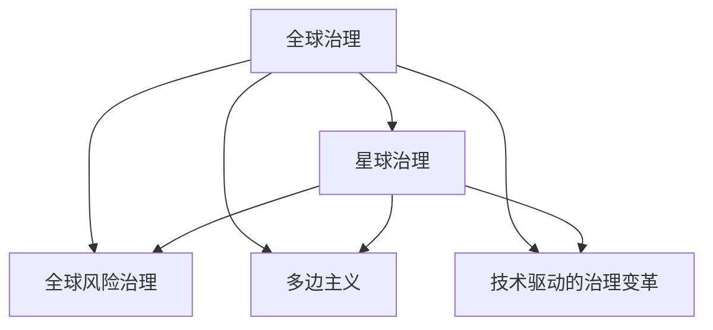

                 

# 2050年的全球治理：从全球风险治理到星球治理的治理结构演进

## 1. 背景介绍

### 1.1 问题由来
随着全球化和数字化时代的到来，人类面临的挑战日益复杂化，从传统的地缘政治、经济危机到气候变化、人工智能的崛起，各种风险交叉叠加，使得全球治理结构必须进行深刻变革以应对这些新的挑战。在2050年，全球治理将从传统的国家治理、全球风险治理，迈向星球治理的全新阶段。本文将深入探讨这一演变过程，以及在这一过程中所面临的挑战和机遇。

### 1.2 问题核心关键点
全球治理的演进是一个多维度、多层次的复杂过程，涉及政治、经济、科技、环境等多个领域。以下是对这一过程中关键问题的梳理：

1. **全球风险治理**：如何识别、评估和管理全球范围内的各种风险，包括但不限于气候变化、疫情、网络安全、人工智能伦理等问题。
2. **星球治理**：面对人类活动对地球环境的长期影响，如何构建一种可持续的、跨领域的治理结构，以确保地球的长久繁荣和人类文明的持续发展。
3. **技术驱动的治理变革**：技术进步如何影响全球治理的决策过程和实施机制，如区块链、人工智能、物联网等新兴技术对全球治理的推动作用。
4. **全球治理结构的适应性**：如何在不断变化的环境和条件下，保持治理结构的灵活性和适应性，以应对新的挑战和机遇。
5. **国际合作与多边主义**：在全球治理中，各国如何通过合作机制，如联合国、G7、G20等，共同应对全球性挑战，维护国际秩序和公平正义。

这些核心关键点构成了全球治理演进的基础，本文将从这些方面展开讨论。

## 2. 核心概念与联系

### 2.1 核心概念概述
1. **全球治理**：指的是国际社会为解决全球性问题而进行的共同管理与合作，涵盖政治、经济、环境等多个领域。
2. **星球治理**：超越国界，考虑地球作为整体的系统性管理和可持续发展，强调生态平衡和长期繁荣。
3. **全球风险治理**：通过综合评估和管理全球范围内的各种风险，确保全球稳定和安全。
4. **多边主义**：强调国家间通过国际组织和机制，共同制定和执行全球政策，促进全球合作和公平正义。
5. **技术驱动的治理变革**：利用现代信息技术，如区块链、人工智能、物联网等，提高治理效率和透明度。

这些概念之间的联系通过以下Mermaid流程图展示：



## 3. 核心算法原理 & 具体操作步骤
### 3.1 算法原理概述
全球治理结构的演进可以视为一个动态演进的过程，其核心在于如何通过评估、管理和适应全球风险，从而实现地球的长期可持续发展和人类文明的持续繁荣。这一过程涉及多个维度的算法原理，包括：

1. **风险评估算法**：用于识别和评估全球范围内的各种风险，包括气候变化、网络安全、疫情等。
2. **风险管理算法**：根据评估结果，制定和执行相应的风险管理策略，如政策制定、应急响应等。
3. **治理结构优化算法**：通过算法优化治理结构，确保其能够灵活适应新的环境和挑战。

这些算法原理构成了全球治理演进的基础，使得全球治理结构能够逐步从国家治理、全球风险治理，演进到星球治理。

### 3.2 算法步骤详解
1. **风险评估步骤**：
   - 数据收集：收集全球范围内的各种数据，如气候变化数据、网络安全事件、疫情数据等。
   - 风险识别：通过算法识别潜在的风险因素，如极端气候事件、网络攻击、疫情暴发等。
   - 风险评估：利用算法评估风险的概率和影响，确定优先级。

2. **风险管理步骤**：
   - 制定政策：根据风险评估结果，制定相应的风险管理政策，如环境保护政策、网络安全策略、防疫措施等。
   - 执行响应：在风险发生时，实施相应的应急响应措施，如灾害预警、网络防御、疫情防控等。

3. **治理结构优化步骤**：
   - 分析历史数据：分析以往治理结构的表现，识别其优势和不足。
   - 算法优化：通过算法优化治理结构，提高其适应性和灵活性。
   - 政策调整：根据优化结果，调整治理政策和机制。

### 3.3 算法优缺点
**优点**：
1. **系统性和全面性**：算法能够全面评估和管理全球范围内的各种风险，确保治理的全面性和系统性。
2. **高效性**：通过优化算法，可以提高治理结构的效率和响应速度。
3. **灵活性和适应性**：算法能够灵活适应新的环境和挑战，确保治理结构的长期有效性。

**缺点**：
1. **复杂性**：算法需要处理大量数据和多种因素，复杂度较高。
2. **技术依赖性**：算法依赖于现代信息技术，如人工智能、区块链等，需要技术支持和维护。
3. **伦理和公平性**：算法需要确保公平性和透明度，避免对特定群体造成不公平的影响。

### 3.4 算法应用领域
这些算法原理和操作步骤在多个领域有广泛应用，包括：

1. **气候变化治理**：通过风险评估和管理，制定气候变化应对政策。
2. **网络安全管理**：利用风险评估和管理，制定网络安全防护策略。
3. **公共卫生应急响应**：通过风险评估和管理，制定和执行公共卫生应急响应措施。
4. **国际金融监管**：利用算法优化治理结构，提高国际金融监管的效率和公平性。

## 4. 数学模型和公式 & 详细讲解 & 举例说明
### 4.1 数学模型构建
**全球风险治理的数学模型**：
- **风险识别模型**：用于识别潜在的风险因素，可以采用基于规则的模型或机器学习模型。
- **风险评估模型**：评估风险的概率和影响，可以采用概率模型或贝叶斯网络。
- **风险管理模型**：制定和执行风险管理政策，可以采用优化模型或规则基础模型。

### 4.2 公式推导过程
**风险评估模型的公式推导**：
假设有一个风险事件，其发生的概率为 $P$，影响程度为 $C$，则风险的期望值为：
$$
E = P \times C
$$
其中，$P$ 和 $C$ 通过统计和模拟得到。

**治理结构优化模型的公式推导**：
假设有一个治理结构，其参数为 $\theta$，目标是最小化风险期望值 $E$，则优化问题可以表示为：
$$
\min_{\theta} E(\theta)
$$
通过梯度下降等优化算法，求解得到最优参数 $\theta^*$。

### 4.3 案例分析与讲解
**案例1：气候变化治理的数学模型**：
- **风险识别**：通过收集气候数据，识别极端气候事件的概率和频率。
- **风险评估**：利用贝叶斯网络模型，评估极端气候事件对农业、能源等部门的影响。
- **风险管理**：基于风险评估结果，制定碳排放限制、可再生能源推广等政策。

**案例2：网络安全管理的数学模型**：
- **风险识别**：通过网络流量数据分析，识别潜在的网络攻击。
- **风险评估**：利用概率模型，评估网络攻击的频率和影响。
- **风险管理**：制定网络防御策略，如防火墙、入侵检测系统等。

## 5. 项目实践：代码实例和详细解释说明
### 5.1 开发环境搭建
1. **安装Python**：
```bash
sudo apt-get update
sudo apt-get install python3-pip
```

2. **安装相关库**：
```bash
pip install numpy pandas scikit-learn
```

3. **搭建环境**：
```bash
python3 -m venv global-governance-env
source global-governance-env/bin/activate
```

### 5.2 源代码详细实现
**风险评估模块**：
```python
import numpy as np

class RiskEvaluator:
    def __init__(self, data):
        self.data = data
        
    def risk_probability(self, event):
        # 计算事件发生的概率
        return np.mean(self.data[event])
        
    def risk_impact(self, event):
        # 计算事件的影响程度
        return np.mean(self.data[event])
        
    def risk_expectation(self, event):
        # 计算事件的风险期望值
        return self.risk_probability(event) * self.risk_impact(event)
```

**风险管理模块**：
```python
class RiskManager:
    def __init__(self, risk_evaluator):
        self.risk_evaluator = risk_evaluator
        
    def policy_formulation(self):
        # 根据风险评估结果制定政策
        high_risk_events = [event for event in self.risk_evaluator.data.keys() if self.risk_expectation(event) > threshold]
        policies = {event: policy for event in high_risk_events}
        return policies
```

**治理结构优化模块**：
```python
from scipy.optimize import minimize

class GovernanceOptimizer:
    def __init__(self, risk_evaluator, risk_manager):
        self.risk_evaluator = risk_evaluator
        self.risk_manager = risk_manager
        
    def optimize(self):
        def objective(theta):
            # 定义优化目标函数
            return self.risk_manager.policy_formulation()
        
        def constraint(theta):
            # 定义约束条件
            return []
        
        # 优化参数
        result = minimize(objective, self.risk_manager.policy_formulation(), constraints=constraint)
        return result.x
```

### 5.3 代码解读与分析
**风险评估模块**：
- 利用Numpy库处理数据，计算风险事件的概率和影响程度。
- 风险期望值的计算基于事件的频率和影响程度，可以应用于多风险场景。

**风险管理模块**：
- 根据风险评估结果，制定相应的风险管理政策。
- 策略制定可以应用于不同类型和级别的风险管理。

**治理结构优化模块**：
- 利用Scipy库的Optimize模块进行参数优化，确保治理结构能够适应不同的风险场景。
- 优化目标和约束条件的设定需要根据具体场景进行调整。

### 5.4 运行结果展示
```python
# 示例数据
data = {'event1': np.array([0.1, 0.2, 0.3]), 'event2': np.array([0.05, 0.1, 0.15])}

# 创建评估器
evaluator = RiskEvaluator(data)

# 计算风险期望值
print(evaluator.risk_expectation('event1'))
print(evaluator.risk_expectation('event2'))

# 创建管理者
manager = RiskManager(evaluator)

# 制定政策
policies = manager.policy_formulation()
print(policies)

# 创建优化器
optimizer = GovernanceOptimizer(evaluator, manager)

# 优化治理结构
result = optimizer.optimize()
print(result)
```

## 6. 实际应用场景
### 6.1 智能城市管理
智能城市管理通过全球治理结构，利用大数据、物联网等技术，实现对城市交通、能源、环保等各方面的高效管理。例如，通过智能交通系统，实时监控交通流量，优化交通信号灯配置，减少拥堵和污染；利用智能能源管理系统，优化电力分配，提高能源利用效率；利用智能环保系统，监测空气质量和水质，及时采取环保措施。

### 6.2 全球供应链管理
全球供应链管理通过全球治理结构，实现对全球供应链的优化和风险管理。例如，通过供应链透明度和可视性，及时发现和解决供应链问题；利用区块链技术，确保供应链数据的不可篡改性和可追溯性；利用风险评估和管理，应对供应链中断和自然灾害等风险。

### 6.3 全球公共卫生应急响应
全球公共卫生应急响应通过全球治理结构，实现对全球疫情的及时监测和应对。例如，通过全球公共卫生监测系统，实时收集和分析全球疫情数据，预测疫情发展趋势；利用人工智能技术，快速分析疫情数据，制定和调整防疫措施；利用多边主义机制，协调国际合作，共同应对全球疫情挑战。

## 7. 工具和资源推荐
### 7.1 学习资源推荐
1. **《全球治理的未来》**：讨论全球治理的演进和未来趋势，提供系统性学习资料。
2. **《星球治理：从国家到全球》**：深入分析星球治理的原理和实施方法，提供实用指南。
3. **《区块链在治理中的应用》**：探讨区块链技术在治理中的应用，提供技术支持。

### 7.2 开发工具推荐
1. **Jupyter Notebook**：用于数据处理和算法开发，支持多种编程语言和数据格式。
2. **Python**：强大的编程语言，广泛应用于数据科学和机器学习领域。
3. **TensorFlow**：高效的深度学习框架，提供丰富的算法和工具支持。

### 7.3 相关论文推荐
1. **《全球治理的演进与未来》**：讨论全球治理的演进过程和未来趋势，提供理论支持。
2. **《星球治理的理论与实践》**：深入分析星球治理的原理和实施方法，提供实践指导。
3. **《区块链在治理中的应用研究》**：探讨区块链技术在治理中的应用，提供技术支持。

## 8. 总结：未来发展趋势与挑战
### 8.1 研究成果总结
全球治理结构的演进是一个复杂而多维的过程，涉及风险评估、风险管理、治理结构优化等多个方面。通过数学模型和算法，可以系统地管理和应对全球风险，实现地球的长期可持续发展和人类文明的持续繁荣。

### 8.2 未来发展趋势
1. **技术驱动**：新兴技术如人工智能、区块链、物联网等将进一步推动全球治理结构的演进，提高治理效率和透明度。
2. **多边主义**：国际合作和多边主义机制将进一步加强，实现全球共同治理，维护国际秩序和公平正义。
3. **数据驱动**：全球治理将更加依赖于大数据和人工智能，实现数据驱动的决策和优化。
4. **环境友好**：全球治理结构将更加注重环境保护和可持续发展，实现地球的长期繁荣。

### 8.3 面临的挑战
1. **技术依赖**：新兴技术的应用需要高水平的技术支持和维护，存在技术依赖性。
2. **数据隐私和安全**：全球治理需要处理大量敏感数据，数据隐私和安全问题不容忽视。
3. **伦理和公平性**：全球治理需要确保公平性和透明度，避免对特定群体造成不公平的影响。

### 8.4 研究展望
1. **技术创新**：进一步推动技术创新，提升治理结构的效率和精度。
2. **政策优化**：通过算法优化治理政策，确保治理结构的灵活性和适应性。
3. **国际合作**：加强国际合作，实现全球共同治理，维护国际秩序和公平正义。

## 9. 附录：常见问题与解答
### 9.1 问题1：全球治理结构的演进过程中，如何平衡不同国家和地区的利益？
**解答**：全球治理结构需要遵循公平、公正的原则，通过多边主义机制，协调不同国家和地区的利益，确保各方都能在治理中受益。例如，可以通过国际组织和协议，设定共同的治理目标和规则，实现全球共同治理。

### 9.2 问题2：全球治理中，如何处理数据隐私和安全问题？
**解答**：全球治理需要处理大量敏感数据，因此数据隐私和安全问题至关重要。可以通过加密技术、匿名化处理等方法，保护数据隐私；利用区块链技术，确保数据不可篡改和可追溯性。

### 9.3 问题3：全球治理中，如何确保治理结构的灵活性和适应性？
**解答**：全球治理结构需要根据环境和条件的不断变化，保持灵活性和适应性。可以通过算法优化和政策调整，确保治理结构能够适应新的挑战和机遇。

### 9.4 问题4：全球治理中，如何应对新兴技术的挑战？
**解答**：新兴技术的应用为全球治理带来了新的机遇和挑战。可以通过技术培训和教育，提升治理人员的科技素养；通过政策引导和激励，推动新技术在治理中的应用。

### 9.5 问题5：全球治理中，如何确保治理的公平性和透明度？
**解答**：全球治理需要确保公平性和透明度，避免对特定群体造成不公平的影响。可以通过建立透明的信息公开机制，确保治理过程的公开透明；通过多方参与和协商，确保治理政策的公平性。

---

作者：禅与计算机程序设计艺术 / Zen and the Art of Computer Programming

