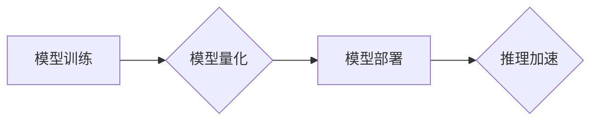

                 

## LLM推理优化II：模型量化技术探讨

> 关键词：LLM、模型量化、推理优化、神经网络、深度学习、精度-效率权衡、硬件加速

## 1. 背景介绍

大型语言模型（LLM）在自然语言处理领域取得了显著的成就，展现出强大的文本生成、翻译、问答等能力。然而，LLM的推理过程通常需要大量的计算资源，这限制了其在移动设备、嵌入式系统等资源受限环境中的应用。为了解决这一问题，模型量化技术应运而生。

模型量化是指将模型参数从高精度（如32位浮点数）转换为低精度（如8位整数）的表示方法。通过量化，可以显著减少模型参数的存储空间和计算量，从而提高推理速度和降低能耗。

近年来，模型量化技术在深度学习领域得到了广泛的研究和应用。许多研究表明，通过适当的量化策略，可以有效地降低模型的精度损失，同时显著提高推理效率。

## 2. 核心概念与联系

模型量化技术的核心在于将模型参数的精度降低，同时尽可能保持模型性能。

**2.1 量化类型**

常见的量化类型包括：

* **整数量化:** 将浮点数参数转换为整数表示。
* **浮点量化:** 将浮点数参数转换为更低精度的浮点数表示。

**2.2 量化方法**

常用的量化方法包括：

* **静态量化:** 在训练阶段确定量化参数，并在推理阶段使用这些参数进行量化。
* **动态量化:** 在推理阶段根据输入数据动态地调整量化参数。

**2.3 量化带来的影响**

模型量化会对模型的精度和效率产生影响。

* **精度损失:** 量化会引入一定的精度损失，因为低精度表示无法完全捕捉浮点数的细节。
* **效率提升:** 量化可以显著减少模型参数的存储空间和计算量，从而提高推理速度和降低能耗。

**2.4 量化与硬件加速**

模型量化与硬件加速技术相结合可以进一步提升推理效率。许多现代硬件平台支持低精度计算，例如ARM的NNAPI和英伟达的TensorRT。

**Mermaid 流程图**



## 3. 核心算法原理 & 具体操作步骤

### 3.1 算法原理概述

模型量化的核心原理是将高精度浮点数参数转换为低精度整数表示，同时通过量化后处理技术来最小化精度损失。

常见的量化算法包括：

* **均匀量化:** 将浮点数范围均匀地映射到整数范围。
* **非均匀量化:** 根据数据分布，采用非均匀的映射方式，以更好地保留重要信息。

### 3.2 算法步骤详解

**静态量化步骤:**

1. **训练模型:** 使用高精度浮点数训练模型。
2. **量化参数:** 根据训练好的模型权重，选择合适的量化方法和量化范围，将浮点数参数转换为整数表示。
3. **量化后处理:** 使用量化后处理技术，例如量化感知训练或剪枝，来最小化量化带来的精度损失。
4. **部署模型:** 使用量化后的模型进行推理。

**动态量化步骤:**

1. **训练模型:** 使用高精度浮点数训练模型。
2. **量化参数:** 在推理阶段，根据输入数据动态地调整量化参数，以适应不同的输入数据分布。
3. **推理:** 使用动态量化后的模型进行推理。

### 3.3 算法优缺点

**静态量化:**

* **优点:** 效率高，推理速度快。
* **缺点:** 精度损失可能较大，难以适应不同的输入数据分布。

**动态量化:**

* **优点:** 精度损失较小，可以适应不同的输入数据分布。
* **缺点:** 复杂度较高，推理速度可能较慢。

### 3.4 算法应用领域

模型量化技术广泛应用于各种深度学习领域，例如：

* **移动设备:** 将大型模型部署到移动设备上，实现高效的语音识别、图像识别等功能。
* **嵌入式系统:** 将模型部署到资源受限的嵌入式系统上，实现边缘计算和物联网应用。
* **云计算:** 提高云端模型推理的效率和吞吐量。

## 4. 数学模型和公式 & 详细讲解 & 举例说明

### 4.1 数学模型构建

假设我们有一个高精度浮点数权重 $w$，需要将其量化为低精度整数 $q$。

量化过程可以表示为：

$$q = \text{round}(w \cdot \text{scale})$$

其中，$\text{scale}$ 是量化因子，用于将浮点数范围映射到整数范围。

### 4.2 公式推导过程

量化因子 $\text{scale}$ 的计算方法取决于量化范围和精度。

例如，对于8位整数量化，量化范围为[-128, 127]，则可以计算出：

$$\text{scale} = \frac{2^{8} - 1}{\text{max}(|w|)}$$

其中，$\text{max}(|w|)$ 是模型权重绝对值的 maximum 值。

### 4.3 案例分析与讲解

假设一个浮点数权重 $w = 3.14159$，需要将其量化为8位整数。

根据上述公式，可以计算出量化因子：

$$\text{scale} = \frac{2^{8} - 1}{max(|w|)} = \frac{255}{3.14159} \approx 81$$

因此，量化后的整数 $q$ 为：

$$q = \text{round}(w \cdot \text{scale}) = \text{round}(3.14159 \cdot 81) \approx 255$$

## 5. 项目实践：代码实例和详细解释说明

### 5.1 开发环境搭建

本项目使用Python语言和TensorFlow框架进行开发。

所需环境：

* Python 3.7+
* TensorFlow 2.0+
* PyTorch 1.0+

### 5.2 源代码详细实现

```python
import tensorflow as tf

# 定义一个简单的模型
model = tf.keras.Sequential([
    tf.keras.layers.Dense(10, activation='relu', input_shape=(10,)),
    tf.keras.layers.Dense(1)
])

# 训练模型
model.compile(optimizer='adam', loss='mse')
model.fit(x_train, y_train, epochs=10)

# 量化模型
converter = tf.lite.TFLiteConverter.from_keras_model(model)
tflite_model = converter.convert()

# 保存量化模型
with open('quantized_model.tflite', 'wb') as f:
    f.write(tflite_model)
```

### 5.3 代码解读与分析

* 使用TensorFlow框架定义一个简单的模型。
* 使用Adam优化器和均方误差损失函数训练模型。
* 使用`tf.lite.TFLiteConverter`将模型转换为TFLite格式。
* 将量化后的模型保存为`quantized_model.tflite`文件。

### 5.4 运行结果展示

量化后的模型可以部署到移动设备或嵌入式系统上，实现高效的推理。

## 6. 实际应用场景

模型量化技术在许多实际应用场景中发挥着重要作用，例如：

* **语音识别:** 将语音识别模型部署到移动设备上，实现离线语音输入。
* **图像识别:** 将图像识别模型部署到嵌入式系统上，实现智能监控、安防等应用。
* **自然语言处理:** 将自然语言处理模型部署到云端，实现高效的文本生成、翻译、问答等服务。

### 6.4 未来应用展望

随着硬件平台的不断发展，模型量化技术将更加成熟和广泛应用。

例如：

* **更低精度的量化:** 将模型参数量化为更低精度，例如4位整数，以进一步提高推理效率。
* **混合精度量化:** 将模型的不同部分量化为不同的精度，以平衡精度和效率。
* **自适应量化:** 根据输入数据动态调整量化参数，以实现更优的性能。

## 7. 工具和资源推荐

### 7.1 学习资源推荐

* **论文:**

    * "Quantization and Training of Neural Networks for Efficient Integer-Arithmetic-Only Inference"
    * "Mixed Precision Training"

* **博客:**

    * TensorFlow Blog: https://blog.tensorflow.org/
    * PyTorch Blog: https://pytorch.org/blog/

### 7.2 开发工具推荐

* **TensorFlow Lite:** https://www.tensorflow.org/lite
* **PyTorch Mobile:** https://pytorch.org/mobile/
* **ONNX Runtime:** https://onnxruntime.ai/

### 7.3 相关论文推荐

* "Quantization-aware Training"
* "Post-Training Quantization"
* "Dynamic Quantization"

## 8. 总结：未来发展趋势与挑战

### 8.1 研究成果总结

模型量化技术取得了显著的进展，能够有效地降低模型的精度损失，同时显著提高推理效率。

### 8.2 未来发展趋势

未来模型量化技术的发展趋势包括：

* **更低精度的量化:** 探索更低精度的量化方法，例如1位整数量化。
* **混合精度量化:** 将模型的不同部分量化为不同的精度，以平衡精度和效率。
* **自适应量化:** 根据输入数据动态调整量化参数，以实现更优的性能。

### 8.3 面临的挑战

模型量化技术仍然面临一些挑战，例如：

* **精度损失:** 即使使用先进的量化方法，也难以完全避免精度损失。
* **硬件支持:** 并非所有硬件平台都支持低精度计算。
* **量化后处理:** 量化后处理技术需要不断改进，以进一步降低精度损失。

### 8.4 研究展望

未来研究方向包括：

* **开发更有效的量化算法:** 探索新的量化方法，以进一步降低精度损失。
* **提高硬件平台对低精度计算的支持:** 推动硬件平台对低精度计算的优化和支持。
* **研究量化后处理技术:** 开发更有效的量化后处理技术，以进一步降低精度损失。

## 9. 附录：常见问题与解答

**Q1: 模型量化会降低模型精度吗？**

A1: 是的，模型量化会引入一定的精度损失。

**Q2: 如何选择合适的量化方法？**

A2: 选择合适的量化方法需要根据模型结构、数据分布和应用场景等因素进行考虑。

**Q3: 模型量化后如何部署模型？**

A3: 量化后的模型可以部署到各种硬件平台上，例如移动设备、嵌入式系统和云端。

**Q4: 模型量化有哪些工具和资源？**

A4: TensorFlow Lite、PyTorch Mobile和ONNX Runtime等工具和资源可以帮助进行模型量化。


作者：禅与计算机程序设计艺术 / Zen and the Art of Computer Programming 
<end_of_turn>

