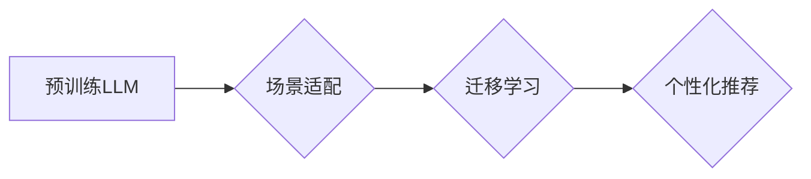

                 

## LLM推荐中的多场景适配技术研究

> 关键词：大型语言模型（LLM）、场景适配、推荐系统、迁移学习、个性化推荐

## 1. 背景介绍

大型语言模型（LLM）凭借其强大的文本理解和生成能力，在自然语言处理领域取得了突破性进展，并逐渐应用于推荐系统等多个领域。然而，现有的LLM通常在特定场景下进行训练，缺乏对不同场景的泛化能力。当应用于新的场景时，其性能往往会显著下降。因此，如何有效地将预训练的LLM适配到不同的场景，成为当前研究的热点问题。

推荐系统作为一种重要的信息过滤技术，旨在根据用户的历史行为、偏好等信息，推荐用户感兴趣的内容。传统的推荐系统主要依赖于基于内容的过滤、协同过滤等方法，但这些方法在面对长尾问题、数据稀疏性等挑战时表现不足。LLM的加入为推荐系统带来了新的机遇，例如：

* **理解用户需求:** LLM能够更好地理解用户的文本描述，例如用户评论、搜索词等，从而更准确地捕捉用户的意图和需求。
* **生成个性化推荐:** LLM可以根据用户的历史行为和偏好，生成个性化的推荐内容，例如推荐文章、商品、视频等。
* **跨模态推荐:** LLM可以结合图像、音频等多模态数据，进行更全面的用户理解和内容推荐。

然而，LLM在推荐系统中的应用也面临一些挑战：

* **数据适配:** LLM通常在海量文本数据上进行预训练，而推荐系统的训练数据往往规模较小，且数据分布与预训练数据可能存在差异。
* **场景泛化:** 预训练的LLM可能难以适应不同的推荐场景，例如电商推荐、新闻推荐、音乐推荐等。
* **效率问题:** LLM的推理速度相对较慢，在实时推荐场景中可能存在效率瓶颈。

## 2. 核心概念与联系

### 2.1 场景适配

场景适配是指将预训练的LLM模型调整到特定场景的应用，使其能够更好地适应场景的特定数据分布和任务需求。

### 2.2 迁移学习

迁移学习是一种机器学习范式，它利用预训练模型在源任务上的知识，迁移到目标任务中进行学习。在LLM推荐中，预训练的LLM模型可以看作是源任务，而不同的推荐场景可以看作是目标任务。

### 2.3 个性化推荐

个性化推荐是指根据用户的历史行为、偏好等信息，为用户提供个性化的推荐内容。LLM能够通过理解用户的文本描述，更好地捕捉用户的个性化需求，从而实现更精准的个性化推荐。

**Mermaid 流程图**



## 3. 核心算法原理 & 具体操作步骤

### 3.1 算法原理概述

场景适配的核心思想是利用迁移学习，将预训练的LLM模型迁移到目标场景中。具体来说，可以采用以下几种方法：

* **参数微调:** 将预训练的LLM模型的参数作为初始值，在目标场景的数据上进行微调，从而使模型更好地适应目标场景。
* **知识蒸馏:** 将预训练的LLM模型作为教师模型，训练一个更小的学生模型，学生模型可以继承教师模型的知识，并在目标场景中进行部署。
* **领域自适应:** 利用领域相关的知识或数据，对预训练的LLM模型进行调整，使其能够更好地理解目标领域的语义和知识。

### 3.2 算法步骤详解

以参数微调为例，具体步骤如下：

1. **数据准备:** 收集目标场景的数据，并进行预处理，例如文本清洗、分词、词向量化等。
2. **模型选择:** 选择合适的预训练的LLM模型作为基础模型。
3. **模型微调:** 将预训练的LLM模型的参数作为初始值，在目标场景的数据上进行训练，调整模型的参数，使其能够更好地适应目标场景。
4. **模型评估:** 使用目标场景的数据对微调后的模型进行评估，例如准确率、召回率、F1-score等指标。
5. **模型部署:** 将微调后的模型部署到实际应用场景中。

### 3.3 算法优缺点

**优点:**

* **效果较好:** 参数微调能够有效地将预训练的LLM模型迁移到目标场景，提升模型的性能。
* **操作简单:** 参数微调的步骤相对简单，易于实现。

**缺点:**

* **数据依赖:** 参数微调需要大量的目标场景数据，否则效果可能不佳。
* **计算成本高:** 微调大型LLM模型需要大量的计算资源，成本较高。

### 3.4 算法应用领域

参数微调在推荐系统、自然语言理解、机器翻译等多个领域都有广泛的应用。

## 4. 数学模型和公式 & 详细讲解 & 举例说明

### 4.1 数学模型构建

假设我们有一个预训练的LLM模型 $f_\theta$，其中 $\theta$ 表示模型的参数。目标场景的数据集为 $D = \{ (x_i, y_i) \}$，其中 $x_i$ 表示输入数据， $y_i$ 表示对应的标签。

我们希望通过参数微调，将模型 $f_\theta$ 调整到目标场景，使其能够更好地预测标签 $y_i$。

### 4.2 公式推导过程

参数微调的目标是找到最优的参数 $\theta^*$，使得模型在目标场景数据上的损失函数最小。

损失函数通常采用交叉熵损失函数，定义如下：

$$
L(\theta) = -\sum_{i=1}^{N} y_i \log(f_\theta(x_i)) + (1-y_i) \log(1-f_\theta(x_i))
$$

其中， $N$ 表示目标场景数据集中样本的数量。

通过梯度下降算法，不断更新模型参数 $\theta$，使得损失函数 $L(\theta)$ 最小化。

$$
\theta = \theta - \eta \nabla L(\theta)
$$

其中， $\eta$ 表示学习率， $\nabla L(\theta)$ 表示损失函数 $L(\theta)$ 的梯度。

### 4.3 案例分析与讲解

假设我们有一个预训练的LLM模型，用于进行电影推荐。我们希望将这个模型迁移到一个新的场景，用于推荐电视剧。

我们可以使用参数微调的方法，将预训练的LLM模型微调到电视剧推荐场景。

具体来说，我们可以收集电视剧相关的用户行为数据，例如用户观看记录、评分等，并将其作为目标场景的数据集。然后，我们将预训练的LLM模型的参数作为初始值，在电视剧数据集上进行训练，调整模型的参数，使其能够更好地预测用户对电视剧的兴趣。

## 5. 项目实践：代码实例和详细解释说明

### 5.1 开发环境搭建

* Python 3.7+
* PyTorch 1.7+
* Transformers 4.10+

### 5.2 源代码详细实现

```python
from transformers import AutoModelForSequenceClassification, AutoTokenizer

# 加载预训练模型和词典
model_name = "bert-base-uncased"
tokenizer = AutoTokenizer.from_pretrained(model_name)
model = AutoModelForSequenceClassification.from_pretrained(model_name)

# 数据加载和预处理
# ...

# 模型训练
optimizer = torch.optim.AdamW(model.parameters(), lr=2e-5)
for epoch in range(3):
    for batch in dataloader:
        inputs = tokenizer(batch["text"], padding=True, truncation=True)
        outputs = model(**inputs)
        loss = outputs.loss
        optimizer.zero_grad()
        loss.backward()
        optimizer.step()

# 模型评估
# ...

# 模型保存
model.save_pretrained("path/to/save/model")
```

### 5.3 代码解读与分析

* 代码首先加载预训练的BERT模型和词典。
* 然后，进行数据加载和预处理，将文本数据转换为模型可识别的格式。
* 接着，使用AdamW优化器对模型进行训练，并计算损失函数。
* 最后，评估模型性能，并保存训练好的模型。

### 5.4 运行结果展示

* 训练完成后，可以将模型应用于实际场景，例如预测用户对电影的兴趣。
* 可以通过评估指标，例如准确率、召回率、F1-score等，来衡量模型的性能。

## 6. 实际应用场景

### 6.1 电商推荐

LLM可以理解用户对商品的描述，例如“舒适的运动鞋”，“时尚的包包”，从而推荐更符合用户需求的商品。

### 6.2 新闻推荐

LLM可以理解用户的阅读偏好，例如新闻类型、主题、作者等，从而推荐更符合用户兴趣的新闻文章。

### 6.3 音乐推荐

LLM可以理解用户的音乐偏好，例如音乐风格、歌手、节奏等，从而推荐更符合用户口味的音乐。

### 6.4 未来应用展望

随着LLM技术的不断发展，其在推荐系统中的应用场景将会更加广泛，例如：

* **个性化内容创作:** LLM可以根据用户的喜好，生成个性化的内容，例如推荐文章、视频、音乐等。
* **跨模态推荐:** LLM可以结合图像、音频等多模态数据，进行更全面的用户理解和内容推荐。
* **对话式推荐:** LLM可以与用户进行对话，更深入地了解用户的需求，并提供更精准的推荐。

## 7. 工具和资源推荐

### 7.1 学习资源推荐

* **论文:**

    * Devlin, J., Chang, M. W., Lee, K., & Toutanova, K. (2018). Bert: Pre-training of deep bidirectional transformers for language understanding. arXiv preprint arXiv:1810.04805.
    * Radford, A., Wu, J., Child, R., Luan, D., Amodei, D., & Sutskever, I. (2019). Language models are few-shot learners. OpenAI blog.

* **书籍:**

    * Deep Learning with Python by Francois Chollet
    * Natural Language Processing with Python by Steven Bird, Ewan Klein, and Edward Loper

### 7.2 开发工具推荐

* **PyTorch:** https://pytorch.org/
* **Transformers:** https://huggingface.co/transformers/

### 7.3 相关论文推荐

* **Fine-tuning Language Models for Text Classification**
* **Transfer Learning for Natural Language Processing**
* **Few-Shot Learning with Large Language Models**

## 8. 总结：未来发展趋势与挑战

### 8.1 研究成果总结

LLM在推荐系统中的应用取得了显著的进展，能够有效地提升推荐系统的性能。

### 8.2 未来发展趋势

* **更强大的LLM模型:** 随着计算资源的不断发展，LLM模型将会更加强大，能够更好地理解用户需求和内容语义。
* **更有效的场景适配方法:** 研究人员将会开发出更有效的场景适配方法，使得LLM模型能够更快速、更准确地适应不同的推荐场景。
* **更个性化的推荐体验:** LLM将推动推荐系统的个性化程度进一步提升，为用户提供更精准、更符合其兴趣的推荐内容。

### 8.3 面临的挑战

* **数据隐私和安全:** LLM模型的训练需要大量的用户数据，如何保护用户数据隐私和安全是一个重要的挑战。
* **模型解释性和可控性:** LLM模型的决策过程往往是复杂的，难以解释和理解，如何提高模型的解释性和可控性是一个重要的研究方向。
* **计算资源和效率:** LLM模型的推理速度相对较慢，如何在保证模型性能的同时降低计算资源消耗是一个重要的挑战。

### 8.4 研究展望

未来，LLM在推荐系统领域的应用将会更加广泛，并带来更加个性化、智能化的推荐体验。

## 9. 附录：常见问题与解答

* **Q1: 如何选择合适的LLM模型？**

    A1: 选择合适的LLM模型需要根据具体的应用场景和数据特点进行选择。例如，对于文本分类任务，可以考虑使用BERT、RoBERTa等模型；对于对话系统，可以考虑使用GPT-3、LaMDA等模型。

* **Q2: 如何进行场景适配？**

    A2: 场景适配可以通过参数微调、知识蒸馏等方法进行。

* **Q3: 如何评估LLM模型的性能？**

    A3: 可以使用准确率、召回率、F1-score等指标来评估LLM模型的性能。

* **Q4: 如何解决LLM模型的计算成本问题？**

    A4: 可以使用模型压缩、量化等技术来降低LLM模型的计算成本。


作者：禅与计算机程序设计艺术 / Zen and the Art of Computer Programming 
<end_of_turn>

