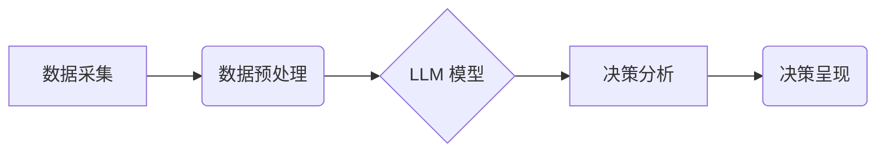

                 

## LLM辅助决策：商业战略和政策制定的新工具

> 关键词：LLM、决策支持系统、商业战略、政策制定、人工智能、自然语言处理、机器学习、数据分析

## 1. 背景介绍

在当今数据爆炸和信息繁杂的时代，企业和政府机构面临着越来越复杂的决策问题。传统的决策方法往往依赖于经验和直觉，难以应对快速变化的市场环境和多变的外部因素。而大型语言模型（LLM）的出现，为决策支持系统带来了新的机遇。

LLM 是一种基于深度学习的强大人工智能技术，能够理解和生成人类语言。它拥有海量文本数据训练，具备强大的文本理解、生成、翻译、总结等能力。将 LLM 应用于决策支持系统，可以有效提升决策效率、准确性和可解释性。

## 2. 核心概念与联系

### 2.1  LLM 决策支持系统

LLM 决策支持系统是指利用 LLM 技术辅助企业和政府机构进行决策的系统。它可以帮助用户分析大量数据、识别关键信息、生成决策方案、评估方案风险和效益，最终辅助用户做出更明智的决策。

### 2.2  系统架构

LLM 决策支持系统通常由以下几个模块组成：

* **数据采集模块:** 从各种数据源收集相关数据，例如市场数据、财务数据、客户数据、政策法规等。
* **数据预处理模块:** 对收集到的数据进行清洗、转换、格式化等处理，使其能够被 LLM 模型理解和处理。
* **LLM 模型模块:** 利用预训练的 LLM 模型进行文本理解、生成、分析等操作，例如提取关键信息、识别趋势、生成决策方案等。
* **决策分析模块:** 对 LLM 模型输出的结果进行分析和评估，例如计算方案风险和效益、比较不同方案优劣等。
* **决策呈现模块:** 将决策分析结果以可视化、易于理解的方式呈现给用户，例如生成决策报告、提供决策建议等。



## 3. 核心算法原理 & 具体操作步骤

### 3.1  算法原理概述

LLM 决策支持系统的核心算法是基于 Transformer 架构的深度学习模型。Transformer 模型通过自注意力机制能够捕捉文本序列中的长距离依赖关系，从而实现更精准的文本理解和生成。

### 3.2  算法步骤详解

1. **数据预处理:** 将原始数据清洗、转换、格式化，例如去除停用词、分词、词向量化等。
2. **模型训练:** 利用预训练的 LLM 模型，在准备好的数据上进行微调训练，使其能够适应特定的决策任务。
3. **数据输入:** 将用户输入的决策问题或相关数据输入到训练好的 LLM 模型中。
4. **模型推理:** LLM 模型对输入数据进行处理，生成决策建议、分析报告等输出结果。
5. **结果输出:** 将模型输出结果以可视化、易于理解的方式呈现给用户。

### 3.3  算法优缺点

**优点:**

* **强大的文本理解能力:** LLM 可以理解复杂的自然语言，并从文本中提取关键信息。
* **自动化的决策支持:** LLM 可以自动生成决策方案，减少人工干预。
* **数据驱动的决策:** LLM 基于海量数据进行决策，更加客观和科学。

**缺点:**

* **数据依赖性:** LLM 的性能取决于训练数据的质量和数量。
* **黑盒效应:** LLM 的决策过程难以解释，缺乏透明度。
* **伦理风险:** LLM 可能存在偏见和歧视，需要谨慎使用。

### 3.4  算法应用领域

LLM 决策支持系统可以应用于各个领域，例如：

* **商业战略:** 市场分析、竞争对手分析、产品开发、营销策略制定等。
* **政策制定:** 政策评估、风险预测、公共服务优化等。
* **金融投资:** 风险管理、投资组合优化、欺诈检测等。
* **医疗保健:** 疾病诊断、治疗方案推荐、药物研发等。

## 4. 数学模型和公式 & 详细讲解 & 举例说明

### 4.1  数学模型构建

LLM 决策支持系统通常采用基于概率的数学模型，例如贝叶斯网络、决策树等。这些模型可以将决策问题转化为概率计算问题，并利用统计方法进行决策分析。

### 4.2  公式推导过程

例如，在使用贝叶斯网络进行决策分析时，可以利用贝叶斯公式计算不同决策方案的概率：

$$P(A|B) = \frac{P(B|A)P(A)}{P(B)}$$

其中：

* $P(A|B)$ 是在已知事件 B 发生的情况下，事件 A 发生的概率。
* $P(B|A)$ 是在已知事件 A 发生的情况下，事件 B 发生的概率。
* $P(A)$ 是事件 A 发生的概率。
* $P(B)$ 是事件 B 发生的概率。

### 4.3  案例分析与讲解

假设我们想要利用 LLM 决策支持系统预测客户是否会购买某个产品。我们可以构建一个贝叶斯网络模型，其中节点代表客户特征、产品属性、购买行为等变量，边代表变量之间的依赖关系。

通过收集客户数据和产品信息，我们可以训练贝叶斯网络模型，并利用贝叶斯公式计算不同决策方案（例如，是否向客户推荐该产品）的概率。

## 5. 项目实践：代码实例和详细解释说明

### 5.1  开发环境搭建

LLM 决策支持系统开发环境通常需要以下软件和工具：

* Python 编程语言
* 深度学习框架（例如 TensorFlow、PyTorch）
* 自然语言处理库（例如 NLTK、spaCy）
* 数据分析工具（例如 Pandas、NumPy）
* 可视化工具（例如 Matplotlib、Seaborn）

### 5.2  源代码详细实现

以下是一个简单的 LLM 决策支持系统代码示例，使用 Python 和 HuggingFace Transformers 库：

```python
from transformers import pipeline

# 加载预训练的 LLM 模型
classifier = pipeline("text-classification", model="bert-base-uncased")

# 用户输入的决策问题
text = "我想要购买一款新的笔记本电脑，预算在 1000 美元以内。"

# 使用 LLM 模型进行分类
result = classifier(text)

# 打印结果
print(result)
```

### 5.3  代码解读与分析

这段代码首先加载了一个预训练的 BERT 模型，用于文本分类任务。然后，用户输入一个决策问题，例如“我想要购买一款新的笔记本电脑，预算在 1000 美元以内。”。

LLM 模型将对用户输入进行分析，并输出一个分类结果，例如“推荐购买笔记本电脑”。

### 5.4  运行结果展示

运行上述代码后，会输出一个包含分类结果的列表，例如：

```
[{'label': '推荐购买笔记本电脑', 'score': 0.95}]
```

结果表明，LLM 模型认为用户应该购买笔记本电脑，并且置信度很高。

## 6. 实际应用场景

### 6.1  商业战略案例

一家电商公司可以使用 LLM 决策支持系统分析市场趋势、客户需求和竞争对手情况，制定更有效的营销策略。例如，可以利用 LLM 分析客户评论数据，识别出用户对产品的喜好和不满，从而改进产品设计和营销文案。

### 6.2  政策制定案例

政府机构可以使用 LLM 决策支持系统评估政策的潜在影响，预测政策实施后的社会经济后果。例如，可以利用 LLM 分析政策法规文本，识别出可能存在的风险和漏洞，并提出相应的改进建议。

### 6.3  金融投资案例

金融机构可以使用 LLM 决策支持系统进行风险管理、投资组合优化和欺诈检测。例如，可以利用 LLM 分析市场数据和客户交易记录，识别出潜在的欺诈行为，并采取相应的措施进行防范。

### 6.4  未来应用展望

随着 LLM 技术的不断发展，其在决策支持系统中的应用场景将更加广泛。未来，LLM 决策支持系统可能能够：

* 更深入地理解用户需求，提供更个性化的决策建议。
* 更好地解释决策过程，提高决策透明度和可信度。
* 与其他人工智能技术结合，形成更强大的决策支持系统。

## 7. 工具和资源推荐

### 7.1  学习资源推荐

* **书籍:**

    * 《深度学习》 by Ian Goodfellow, Yoshua Bengio, and Aaron Courville
    * 《自然语言处理》 by Dan Jurafsky and James H. Martin

* **在线课程:**

    * Coursera: Deep Learning Specialization
    * edX: Artificial Intelligence

### 7.2  开发工具推荐

* **Python:** https://www.python.org/
* **TensorFlow:** https://www.tensorflow.org/
* **PyTorch:** https://pytorch.org/
* **HuggingFace Transformers:** https://huggingface.co/transformers/

### 7.3  相关论文推荐

* **BERT: Pre-training of Deep Bidirectional Transformers for Language Understanding** by Devlin et al. (2018)
* **Attention Is All You Need** by Vaswani et al. (2017)

## 8. 总结：未来发展趋势与挑战

### 8.1  研究成果总结

LLM 决策支持系统是一个新兴的领域，近年来取得了显著进展。预训练语言模型的性能不断提升，算法模型更加完善，应用场景也越来越广泛。

### 8.2  未来发展趋势

未来，LLM 决策支持系统的发展趋势包括：

* **模型规模和性能的提升:** 随着计算能力的增强，LLM 模型的规模和性能将进一步提升，能够处理更复杂的任务。
* **多模态决策支持:** 将文本、图像、音频等多模态数据融合到决策支持系统中，实现更全面的决策分析。
* **解释性决策:** 提高 LLM 决策过程的透明度和可解释性，帮助用户更好地理解决策结果。
* **个性化决策:** 基于用户个人特征和偏好，提供更个性化的决策建议。

### 8.3  面临的挑战

LLM 决策支持系统也面临着一些挑战：

* **数据质量和偏见:** LLM 模型的性能依赖于训练数据的质量，而数据中可能存在偏见和噪声，需要进行有效的数据清洗和处理。
* **黑盒效应:** LLM 决策过程难以解释，缺乏透明度，需要开发更有效的解释性方法。
* **伦理风险:** LLM 可能存在偏见和歧视，需要谨慎使用，并制定相应的伦理规范。

### 8.4  研究展望

未来，LLM 决策支持系统将继续是一个重要的研究方向。需要进一步探索新的算法模型、数据处理方法和解释性技术，以提高 LLM 决策支持系统的性能、可靠性和安全性。


## 9. 附录：常见问题与解答

### 9.1  LLM 决策支持系统与传统决策支持系统有什么区别？

传统决策支持系统通常基于规则或统计模型，而 LLM 决策支持系统则利用深度学习模型，能够更好地理解和处理复杂文本数据。

### 9.2  LLM 决策支持系统是否能够完全取代人类决策者？

LLM 决策支持系统可以辅助人类决策，但不能完全取代人类决策者。人类决策者仍然需要根据实际情况进行判断和决策。

### 9.3  如何评估 LLM 决策支持系统的性能？

LLM 决策支持系统的性能可以根据准确率、召回率、F1-score等指标进行评估。

### 9.4  LLM 决策支持系统有哪些伦理风险？

LLM 决策支持系统可能存在偏见和歧视，需要谨慎使用，并制定相应的伦理规范。

### 9.5  如何获取 LLM 决策支持系统的开发资源？

可以参考文章中的工具和资源推荐，获取 LLM 决策支持系统的开发资源。


作者：禅与计算机程序设计艺术 / Zen and the Art of Computer Programming 
<end_of_turn>

