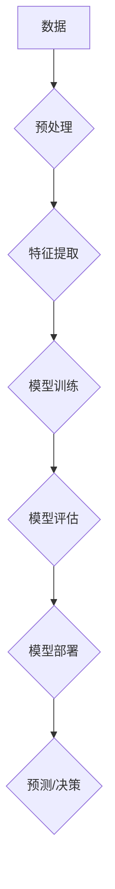

                 

## 人类知识的进步史：一部创新史

> 关键词：人工智能、算法、机器学习、深度学习、数据科学、知识图谱、自然语言处理

### 1. 背景介绍

人类文明的进步离不开对知识的不断探索和积累。从远古人类的火的使用到现代人工智能的兴起，每一次重大突破都代表着人类认知水平的提升和社会形态的改变。而技术的进步，正是推动人类知识进步的引擎。

本篇文章将以人工智能为切入点，探讨人类知识的进步史，并分析其背后的核心概念、算法原理、数学模型以及实际应用场景。

### 2. 核心概念与联系

人工智能（Artificial Intelligence，AI）是指模拟人类智能行为的计算机系统。它涵盖了多个领域，包括机器学习、深度学习、自然语言处理、计算机视觉等。

**核心概念：**

* **机器学习（Machine Learning，ML）：** 允许计算机从数据中学习，并根据学习到的知识进行预测或决策。
* **深度学习（Deep Learning，DL）：** 一种机器学习的子集，利用多层神经网络模拟人类大脑的学习过程。
* **自然语言处理（Natural Language Processing，NLP）：** 使计算机能够理解和处理人类语言。
* **计算机视觉（Computer Vision）：** 赋予计算机“看”的能力，使其能够识别、理解和解释图像和视频。

**架构：**



### 3. 核心算法原理 & 具体操作步骤

#### 3.1 算法原理概述

机器学习算法的核心在于从数据中学习规律，并将其转化为模型，以便对新数据进行预测或决策。常见的机器学习算法包括：

* **线性回归：** 用于预测连续数值，假设数据之间存在线性关系。
* **逻辑回归：** 用于分类问题，预测数据属于某个类别或不属于某个类别。
* **决策树：** 通过一系列规则进行分类或预测，易于理解和解释。
* **支持向量机：** 通过寻找最佳的分隔超平面，将数据分类。
* **k近邻：** 根据与新数据最近的k个数据的类别进行预测。

#### 3.2 算法步骤详解

以线性回归为例，其具体操作步骤如下：

1. **数据收集和预处理：** 收集相关数据，并进行清洗、转换、归一化等预处理操作。
2. **特征选择：** 选择与目标变量相关的特征。
3. **模型训练：** 使用训练数据训练线性回归模型，求解模型参数。
4. **模型评估：** 使用测试数据评估模型性能，例如计算均方误差。
5. **模型调优：** 根据评估结果，调整模型参数，提高模型性能。
6. **模型部署：** 将训练好的模型部署到实际应用场景中。

#### 3.3 算法优缺点

每个算法都有其优缺点，选择合适的算法取决于具体应用场景。

* **线性回归：** 优点：简单易懂，计算速度快；缺点：假设数据存在线性关系，对非线性关系的处理能力有限。
* **逻辑回归：** 优点：适用于分类问题，易于理解和解释；缺点：对复杂分类问题的处理能力有限。
* **决策树：** 优点：易于理解和解释，可以处理非线性关系；缺点：容易过拟合，对数据噪声敏感。
* **支持向量机：** 优点：可以处理高维数据，对非线性关系的处理能力强；缺点：训练时间长，参数选择较复杂。
* **k近邻：** 优点：简单易懂，无需训练模型；缺点：计算速度慢，对数据规模敏感。

#### 3.4 算法应用领域

机器学习算法广泛应用于各个领域，例如：

* **图像识别：** 人脸识别、物体检测、图像分类。
* **自然语言处理：** 机器翻译、文本摘要、情感分析。
* **推荐系统：** 商品推荐、音乐推荐、电影推荐。
* **医疗诊断：** 疾病预测、影像分析、药物研发。
* **金融风险控制：** 欺诈检测、信用评分、投资决策。

### 4. 数学模型和公式 & 详细讲解 & 举例说明

#### 4.1 数学模型构建

线性回归模型的数学模型如下：

$$
y = w_0 + w_1x_1 + w_2x_2 + ... + w_nx_n + \epsilon
$$

其中：

* $y$ 是目标变量
* $x_1, x_2, ..., x_n$ 是特征变量
* $w_0, w_1, w_2, ..., w_n$ 是模型参数
* $\epsilon$ 是误差项

#### 4.2 公式推导过程

模型参数的求解可以通过最小化误差平方和来实现。

$$
J(w) = \frac{1}{2} \sum_{i=1}^{m} (y_i - \hat{y}_i)^2
$$

其中：

* $J(w)$ 是误差平方和
* $m$ 是训练样本数量
* $y_i$ 是第 $i$ 个样本的目标变量
* $\hat{y}_i$ 是模型预测的第 $i$ 个样本的目标变量

通过梯度下降算法，可以迭代更新模型参数，使得误差平方和最小化。

#### 4.3 案例分析与讲解

假设我们想要预测房屋价格，特征变量包括房屋面积、房间数量、地理位置等。我们可以使用线性回归模型，将这些特征变量作为输入，预测房屋价格。

通过训练模型，我们可以得到模型参数，例如：

* $w_0 = 100000$
* $w_1 = 500$
* $w_2 = 10000$

这意味着，房屋面积每增加1平方米，价格会增加500元；房间数量每增加1个，价格会增加10000元。

### 5. 项目实践：代码实例和详细解释说明

#### 5.1 开发环境搭建

本项目使用Python语言进行开发，需要安装以下软件：

* Python 3.x
* NumPy
* Pandas
* Scikit-learn

#### 5.2 源代码详细实现

```python
import numpy as np
from sklearn.linear_model import LinearRegression

# 数据加载
data = np.loadtxt('housing_data.csv', delimiter=',')
X = data[:, :-1]  # 特征变量
y = data[:, -1]  # 目标变量

# 模型训练
model = LinearRegression()
model.fit(X, y)

# 模型预测
new_data = np.array([[100, 2, '市中心']])  # 新数据
predicted_price = model.predict(new_data)

# 结果展示
print(f'预测价格: {predicted_price[0]}')
```

#### 5.3 代码解读与分析

1. 导入必要的库函数。
2. 加载数据，并将特征变量和目标变量分离。
3. 创建线性回归模型对象。
4. 使用训练数据训练模型。
5. 使用新数据进行预测。
6. 展示预测结果。

#### 5.4 运行结果展示

运行代码后，会输出预测价格的值。

### 6. 实际应用场景

#### 6.1 医疗诊断

机器学习算法可以用于分析患者的医疗影像数据，辅助医生进行疾病诊断。例如，深度学习算法可以用于识别肺癌、乳腺癌等疾病。

#### 6.2 金融风险控制

机器学习算法可以用于分析客户的财务数据，识别潜在的欺诈行为或信用风险。例如，支持向量机算法可以用于检测信用卡欺诈。

#### 6.3 个性化推荐

机器学习算法可以根据用户的历史行为数据，推荐个性化的商品、音乐、电影等。例如，协同过滤算法可以用于推荐电影。

#### 6.4 未来应用展望

随着人工智能技术的不断发展，其应用场景将更加广泛。例如：

* **自动驾驶：** 机器学习算法可以用于训练自动驾驶汽车，使其能够感知周围环境并做出决策。
* **机器人技术：** 机器学习算法可以赋予机器人更强的学习和适应能力，使其能够完成更复杂的任务。
* **个性化教育：** 机器学习算法可以根据学生的学习情况，提供个性化的学习方案。

### 7. 工具和资源推荐

#### 7.1 学习资源推荐

* **在线课程：** Coursera、edX、Udacity 等平台提供丰富的机器学习课程。
* **书籍：** 《深入理解机器学习》、《Python机器学习实战》等书籍。
* **博客和论坛：** 机器学习相关的博客和论坛，例如机器之心、AI 算法等。

#### 7.2 开发工具推荐

* **Python：** 机器学习开发的常用语言。
* **Scikit-learn：** Python机器学习库。
* **TensorFlow：** 深度学习框架。
* **PyTorch：** 深度学习框架。

#### 7.3 相关论文推荐

* **《ImageNet Classification with Deep Convolutional Neural Networks》**
* **《Attention Is All You Need》**
* **《BERT: Pre-training of Deep Bidirectional Transformers for Language Understanding》**

### 8. 总结：未来发展趋势与挑战

#### 8.1 研究成果总结

人工智能技术取得了长足的进步，在各个领域都展现出巨大的应用潜力。

#### 8.2 未来发展趋势

* **模型规模和复杂度提升：** 模型参数数量和层数将继续增加，从而提高模型的性能。
* **数据驱动的发展：** 随着数据量的不断增长，人工智能模型将更加依赖于数据训练。
* **跨模态学习：** 模型将能够处理多种数据类型，例如文本、图像、音频等。
* **可解释性增强：** 研究人员将致力于提高人工智能模型的可解释性，使其决策过程更加透明。

#### 8.3 面临的挑战

* **数据质量和隐私问题：** 确保数据质量和保护用户隐私是人工智能发展面临的重要挑战。
* **算法偏见和公平性：** 人工智能算法可能存在偏见，需要研究如何消除算法偏见，确保公平性。
* **伦理和社会影响：** 人工智能技术的发展可能带来伦理和社会问题，需要进行深入的探讨和研究。

#### 8.4 研究展望

未来，人工智能技术将继续发展，并对人类社会产生更深远的影响。我们需要积极探索人工智能的应用潜力，同时也要关注其带来的挑战，确保人工智能技术能够造福人类。

### 9. 附录：常见问题与解答

* **什么是机器学习？**

机器学习是一种人工智能技术，它允许计算机从数据中学习，并根据学习到的知识进行预测或决策。

* **什么是深度学习？**

深度学习是一种机器学习的子集，它利用多层神经网络模拟人类大脑的学习过程。

* **如何选择合适的机器学习算法？**

选择合适的机器学习算法取决于具体应用场景，需要考虑数据类型、目标变量类型、数据规模等因素。

* **如何评估机器学习模型的性能？**

常用的评估指标包括准确率、召回率、F1-score等。

* **如何解决机器学习算法的偏见问题？**

可以通过数据预处理、算法设计、模型评估等方式来解决机器学习算法的偏见问题。


作者：禅与计算机程序设计艺术 / Zen and the Art of Computer Programming 
<end_of_turn>

