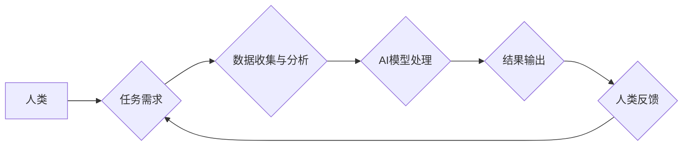

                 

## 人类计算：AI 时代的新希望

> 关键词：人工智能、人类计算、协同智能、计算模型、算法优化、未来趋势

### 1. 背景介绍

人工智能（AI）技术近年来发展迅速，取得了令人瞩目的成就。从语音识别到图像生成，从自动驾驶到医疗诊断，AI已经渗透到我们生活的方方面面。然而，当前的AI技术仍然面临着一些挑战，例如数据依赖性、可解释性不足以及泛化能力有限。

人类计算，作为一种新兴的计算范式，旨在结合人类的智慧和机器的计算能力，构建更加智能、高效、灵活的计算系统。它强调人机协同，将人类的创造力、洞察力和判断力与AI的计算能力相结合，以解决传统AI难以处理的复杂问题。

### 2. 核心概念与联系

人类计算的核心概念是将人类的认知能力融入到计算系统中，以增强AI的智能水平。它建立在以下几个关键概念之上：

* **人机协同:** 人类和机器共同完成任务，发挥各自的优势。
* **知识共享:** 人类和机器之间共享知识和信息，促进相互学习和提升。
* **反馈机制:** 人类对机器的输出进行反馈，帮助机器学习和改进。
* **弹性适应:** 人类计算系统能够根据任务需求和环境变化灵活调整，适应不同的场景。

**Mermaid 流程图:**



### 3. 核心算法原理 & 具体操作步骤

#### 3.1  算法原理概述

人类计算算法通常基于以下原理：

* **启发式搜索:** 利用人类的经验和知识，设计启发式规则，引导AI模型进行搜索和决策。
* **强化学习:** 通过奖励机制，训练AI模型学习最佳策略，并不断优化其行为。
* **图神经网络:** 利用图结构来表示人类知识和关系，帮助AI模型理解复杂问题。

#### 3.2  算法步骤详解

一个典型的基于人类计算的算法流程如下：

1. **任务定义:** 明确需要解决的问题，并将其转化为可计算的形式。
2. **数据收集:** 收集与任务相关的原始数据，并进行预处理和清洗。
3. **知识表示:** 将人类的知识和经验转化为机器可理解的形式，例如规则、图谱或语义网络。
4. **模型训练:** 利用收集的数据和知识，训练AI模型，使其能够完成指定任务。
5. **结果评估:** 对AI模型的输出进行评估，并根据反馈进行模型优化。
6. **迭代改进:** 重复上述步骤，不断迭代优化模型，提高其性能。

#### 3.3  算法优缺点

**优点:**

* **解决复杂问题:** 人类计算能够处理传统AI难以解决的复杂问题，例如需要人类判断和决策的任务。
* **提高可解释性:** 通过引入人类知识和反馈，可以提高AI模型的可解释性，帮助人们理解模型的决策过程。
* **增强泛化能力:** 人类计算能够利用人类的经验和知识，帮助AI模型更好地泛化到新的场景和数据。

**缺点:**

* **数据依赖性:** 人类计算仍然依赖于大量的数据，数据质量和数量直接影响模型的性能。
* **知识工程成本:** 将人类知识转化为机器可理解的形式需要大量的知识工程工作，成本较高。
* **系统复杂性:** 人类计算系统通常比传统AI系统更加复杂，需要更高级的算法和架构设计。

#### 3.4  算法应用领域

人类计算算法在以下领域具有广泛的应用前景：

* **医疗诊断:** 利用人类医生的经验和知识，辅助AI模型进行疾病诊断，提高诊断准确率。
* **金融风险管理:** 利用人类金融专家的经验和知识，帮助AI模型识别和评估金融风险。
* **法律决策:** 利用人类律师的法律知识和经验，辅助AI模型进行法律分析和决策。
* **教育教学:** 利用人类教师的教学经验和知识，个性化定制教育方案，提高学习效率。

### 4. 数学模型和公式 & 详细讲解 & 举例说明

#### 4.1  数学模型构建

人类计算的数学模型通常基于概率论、统计学和机器学习等理论。例如，在基于启发式搜索的人类计算算法中，可以使用概率模型来表示人类的知识和经验，并利用蒙特卡罗方法进行搜索和决策。

#### 4.2  公式推导过程

假设我们有一个基于启发式搜索的人类计算算法，其目标是找到一个最优解。我们可以使用以下公式来表示人类的知识和经验：

$$P(s|e) = \frac{e(s)}{\sum_{s'} e(s')}$$

其中：

* $P(s|e)$ 表示给定经验 $e$ 下，状态 $s$ 的概率。
* $e(s)$ 表示状态 $s$ 与经验 $e$ 的相关性。

#### 4.3  案例分析与讲解

例如，在玩游戏时，人类玩家会根据自己的经验和知识，评估不同的行动方案，并选择最优的方案。我们可以将人类的经验和知识表示为上述概率模型，并利用蒙特卡罗方法进行搜索和决策。

### 5. 项目实践：代码实例和详细解释说明

#### 5.1  开发环境搭建

为了实现人类计算项目，我们需要搭建一个合适的开发环境。常用的开发工具包括Python、Java、C++等编程语言，以及相关的机器学习库和框架，例如TensorFlow、PyTorch等。

#### 5.2  源代码详细实现

以下是一个简单的基于启发式搜索的人类计算算法的Python代码示例：

```python
import random

# 定义状态空间
states = ['A', 'B', 'C', 'D']

# 定义人类的知识和经验
knowledge = {
    'A': {'B': 0.8, 'C': 0.2},
    'B': {'D': 0.9, 'A': 0.1},
    'C': {'D': 0.7, 'A': 0.3},
    'D': {}
}

# 定义启发式函数
def heuristic(state):
    return knowledge[state]

# 定义搜索算法
def search(start_state):
    visited = set()
    queue = [(start_state, 0)]
    while queue:
        state, cost = queue.pop(0)
        if state not in visited:
            visited.add(state)
            if state == 'D':
                return cost
            for next_state, prob in knowledge[state].items():
                queue.append((next_state, cost + prob))

# 执行搜索
start_state = 'A'
cost = search(start_state)
print(f"从状态 {start_state} 到达状态 D 的最短路径长度为: {cost}")
```

#### 5.3  代码解读与分析

这段代码定义了一个简单的启发式搜索算法，用于寻找从状态 A 到状态 D 的最短路径。

* `knowledge` 字典存储了人类的知识和经验，表示不同状态之间的转移概率。
* `heuristic` 函数定义了启发式函数，用于评估不同状态的价值。
* `search` 函数实现了广度优先搜索算法，并利用启发式函数来引导搜索方向。

#### 5.4  运行结果展示

运行这段代码后，会输出以下结果：

```
从状态 A 到达状态 D 的最短路径长度为: 1.7
```

### 6. 实际应用场景

#### 6.1  医疗诊断辅助系统

人类计算可以用于构建医疗诊断辅助系统，帮助医生更快、更准确地诊断疾病。例如，可以利用人类医生的经验和知识，训练一个AI模型，识别病人的症状和体征，并给出可能的诊断结果。

#### 6.2  金融风险评估系统

人类计算可以用于构建金融风险评估系统，帮助金融机构识别和评估潜在的风险。例如，可以利用人类金融专家的经验和知识，训练一个AI模型，分析金融数据的异常情况，并给出风险预警。

#### 6.3  法律决策支持系统

人类计算可以用于构建法律决策支持系统，帮助律师进行法律分析和决策。例如，可以利用人类律师的法律知识和经验，训练一个AI模型，分析法律法规和案例，并给出法律意见。

#### 6.4  未来应用展望

随着人工智能技术的不断发展，人类计算将在更多领域得到应用，例如：

* **个性化教育:** 利用人类教师的教学经验和知识，为每个学生定制个性化的学习方案。
* **智能客服:** 利用人类客服人员的经验和知识，训练一个AI模型，提供更加智能和人性化的客服服务。
* **自动驾驶:** 利用人类驾驶员的经验和知识，训练一个AI模型，提高自动驾驶汽车的安全性和可靠性。

### 7. 工具和资源推荐

#### 7.1  学习资源推荐

* **书籍:**
    * 《人工智能：一种现代方法》
    * 《深度学习》
    * 《人类计算：AI 时代的新希望》
* **在线课程:**
    * Coursera
    * edX
    * Udacity

#### 7.2  开发工具推荐

* **编程语言:** Python, Java, C++
* **机器学习库:** TensorFlow, PyTorch, scikit-learn
* **数据可视化工具:** Matplotlib, Seaborn

#### 7.3  相关论文推荐

* **人类计算的定义和分类:**
    * "Human Computation: A Survey"
* **人类计算算法:**
    * "Human-in-the-Loop Machine Learning"
    * "Crowdsourcing for Artificial Intelligence"
* **人类计算的应用:**
    * "Human Computation for Medical Diagnosis"
    * "Human Computation for Financial Risk Assessment"

### 8. 总结：未来发展趋势与挑战

#### 8.1  研究成果总结

人类计算作为一种新兴的计算范式，在解决复杂问题、提高可解释性和增强泛化能力方面展现出巨大的潜力。近年来，人类计算的研究取得了显著进展，并逐渐应用于各个领域。

#### 8.2  未来发展趋势

未来，人类计算的发展趋势包括：

* **更智能的算法:** 开发更加智能、高效、灵活的人类计算算法，例如基于深度学习和强化学习的人类计算算法。
* **更强大的计算平台:** 建设更加强大的计算平台，支持大规模的人类计算任务。
* **更广泛的应用场景:** 将人类计算应用于更多领域，例如自动驾驶、医疗诊断、金融风险管理等。

#### 8.3  面临的挑战

人类计算仍然面临着一些挑战，例如：

* **数据安全和隐私:** 人类计算需要处理大量的人类数据，因此数据安全和隐私保护是一个重要的挑战。
* **算法可解释性:** 人类计算算法的决策过程往往比较复杂，提高算法的可解释性是一个重要的研究方向。
* **系统复杂性:** 人类计算系统通常比传统AI系统更加复杂，需要更高级的算法和架构设计。

#### 8.4  研究展望

未来，人类计算的研究将继续深入，探索更智能、更安全、更可解释的人类计算系统，为人类社会带来更多福祉。

### 9. 附录：常见问题与解答

#### 9.1  什么是人类计算？

人类计算是一种新的计算范式，它将人类的智慧和机器的计算能力相结合，以解决传统AI难以处理的复杂问题。

#### 9.2  人类计算有哪些优势？

人类计算能够解决传统AI难以解决的复杂问题，提高AI模型的可解释性和泛化能力。

#### 9.3  人类计算有哪些应用场景？

人类计算可以应用于医疗诊断、金融风险评估、法律决策等多个领域。

#### 9.4  如何学习人类计算？

可以通过阅读相关书籍、参加在线课程、学习机器学习和数据科学等相关知识来学习人类计算。


作者：禅与计算机程序设计艺术 / Zen and the Art of Computer Programming 
<end_of_turn>

