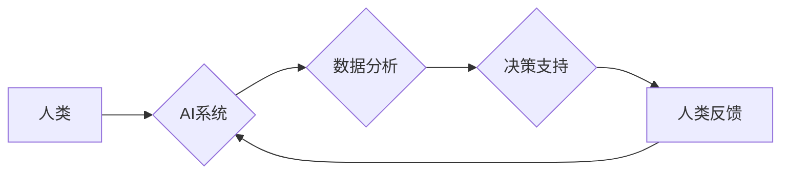

                 

## 人类计算：AI时代的未来就业趋势与技能发展分析

> 关键词：人工智能、人类计算、未来就业、技能发展、自动化、数据分析、机器学习、深度学习、跨学科合作

## 1. 背景介绍

人工智能（AI）技术近年来发展迅速，正在深刻地改变着我们的生活和工作方式。从自动驾驶汽车到智能语音助手，AI已经渗透到各个领域，并展现出巨大的潜力。然而，AI的发展也引发了人们对未来就业趋势和技能发展的新思考。

一方面，AI技术的自动化能力将替代一些传统工作岗位，例如数据录入、客服等。另一方面，AI也创造了大量新的工作机会，例如AI工程师、数据科学家、AI伦理学家等。因此，在AI时代，我们需要积极适应变化，不断提升自身技能，才能在竞争激烈的职场中立于不败之地。

## 2. 核心概念与联系

**2.1 人类计算**

人类计算是指利用人类的认知能力和创造力来辅助或增强人工智能系统。它强调人机协同，将人类的智慧与AI技术的优势相结合，以实现更高效、更智能的计算。

**2.2 AI时代的影响**

AI技术的快速发展对未来就业趋势和技能发展产生了深远影响：

* **自动化替代:** AI可以自动化许多重复性、规则性工作，例如数据录入、客服等，这将导致一些传统工作岗位被取代。
* **新岗位涌现:** AI技术的发展也催生了大量新的工作机会，例如AI工程师、数据科学家、AI伦理学家等，这些岗位需要具备专门的AI知识和技能。
* **技能升级:**  未来职场将更加重视具备批判性思维、解决问题能力、创造力等跨学科技能的人才。

**2.3 人类计算的优势**

* **创造力和创新:** 人类拥有独特的创造力和创新能力，可以提出新的想法和解决方案，而AI目前还难以完全模拟。
* **复杂问题解决:** 人类擅长处理复杂、多变的场景，可以根据上下文和经验做出更灵活的判断，而AI在处理复杂问题时仍然存在局限性。
* **伦理和社会责任:** 人类可以考虑AI技术的伦理和社会责任问题，确保AI技术的发展符合人类的利益和价值观。

**2.4 人类计算的架构**



## 3. 核心算法原理 & 具体操作步骤

**3.1 算法原理概述**

人类计算的核心算法原理是将人类的认知能力和AI技术的优势相结合，通过人机协同的方式来完成计算任务。常见的算法包括：

* **强化学习:**  通过奖励和惩罚机制，训练AI模型学习最佳策略。
* **迁移学习:**  利用已训练好的模型，在新的任务上进行微调。
* **生成对抗网络 (GAN):**  通过两个神经网络的对抗训练，生成逼真的数据。

**3.2 算法步骤详解**

1. **数据收集和预处理:**  收集相关数据，并进行清洗、转换等预处理操作。
2. **模型选择和训练:**  根据任务需求选择合适的AI模型，并进行训练。
3. **人类反馈和迭代:**  人类对AI模型的输出进行评估和反馈，并根据反馈进行模型调整和迭代。
4. **部署和应用:**  将训练好的模型部署到实际应用场景中。

**3.3 算法优缺点**

**优点:**

* 能够解决AI算法难以处理的复杂问题。
* 能够提高AI模型的准确性和可靠性。
* 能够促进人机协作，提升工作效率。

**缺点:**

* 需要人类参与，成本较高。
* 需要人类对AI模型进行训练和评估，需要专业知识。
* 存在伦理和安全风险。

**3.4 算法应用领域**

* **医疗诊断:**  利用人类计算辅助医生进行疾病诊断。
* **金融风险管理:**  利用人类计算识别和评估金融风险。
* **法律决策:**  利用人类计算辅助律师进行法律分析和决策。
* **教育教学:**  利用人类计算个性化教学，提高学习效率。

## 4. 数学模型和公式 & 详细讲解 & 举例说明

**4.1 数学模型构建**

人类计算可以利用数学模型来描述人机协作过程。例如，可以构建一个基于强化学习的模型，其中人类扮演着奖励机制的角色，AI模型则通过学习人类的反馈来优化其行为。

**4.2 公式推导过程**

假设一个强化学习模型，其状态空间为S，动作空间为A，奖励函数为R(s,a)。人类对AI模型的奖励可以表示为一个概率分布P(r|s,a)，其中r表示奖励值。

AI模型的目标是最大化累积奖励，可以使用Bellman方程来描述其优化过程：

$$
V(s) = \max_a \left[ R(s,a) + \gamma \sum_{s'} P(s'|s,a) V(s') \right]
$$

其中，V(s)表示状态s的价值函数，γ表示折扣因子。

**4.3 案例分析与讲解**

例如，在医疗诊断领域，可以使用人类计算来辅助医生进行疾病诊断。AI模型可以学习大量的医学影像数据，并识别出潜在的疾病特征。

人类医生则可以根据AI模型的输出，结合自身的临床经验和患者的病史，做出最终的诊断。

在这个案例中，人类扮演着奖励机制的角色，通过对AI模型的诊断结果进行评估和反馈，来指导AI模型的学习和优化。

## 5. 项目实践：代码实例和详细解释说明

**5.1 开发环境搭建**

* Python 3.x
* TensorFlow 或 PyTorch
* Jupyter Notebook

**5.2 源代码详细实现**

```python
import tensorflow as tf

# 定义模型结构
model = tf.keras.models.Sequential([
    tf.keras.layers.Dense(128, activation='relu', input_shape=(784,)),
    tf.keras.layers.Dense(10, activation='softmax')
])

# 编译模型
model.compile(optimizer='adam',
              loss='sparse_categorical_crossentropy',
              metrics=['accuracy'])

# 加载数据
(x_train, y_train), (x_test, y_test) = tf.keras.datasets.mnist.load_data()

# 训练模型
model.fit(x_train, y_train, epochs=5)

# 评估模型
loss, accuracy = model.evaluate(x_test, y_test)
print('Test loss:', loss)
print('Test accuracy:', accuracy)
```

**5.3 代码解读与分析**

这段代码实现了简单的图像分类模型。

* 使用 TensorFlow 库构建模型结构。
* 使用 Adam 优化器和交叉熵损失函数进行模型训练。
* 使用 MNIST 数据集进行训练和评估。

**5.4 运行结果展示**

训练完成后，模型可以对新的图像进行分类。

## 6. 实际应用场景

**6.1 医疗诊断**

* AI辅助医生进行疾病诊断，提高诊断准确率。
* 自动识别医学影像中的异常区域，辅助医生进行治疗方案制定。

**6.2 金融风险管理**

* 利用AI识别和评估金融风险，降低金融机构的损失。
* 自动化金融交易，提高交易效率。

**6.3 法律决策**

* 利用AI分析法律文件，辅助律师进行法律研究和决策。
* 自动化法律文书的生成，提高效率。

**6.4 未来应用展望**

* 人类计算将与其他新兴技术，例如区块链、物联网等相结合，创造更多新的应用场景。
* 人类计算将更加注重个性化和定制化，满足不同用户的需求。
* 人类计算将更加注重伦理和社会责任，确保AI技术的发展符合人类的利益和价值观。

## 7. 工具和资源推荐

**7.1 学习资源推荐**

* **在线课程:** Coursera、edX、Udacity 等平台提供丰富的AI课程。
* **书籍:** 《深度学习》、《人工智能：一种现代方法》等书籍。
* **开源项目:** TensorFlow、PyTorch 等开源项目可以帮助你学习和实践AI技术。

**7.2 开发工具推荐**

* **Python:**  AI开发的常用编程语言。
* **TensorFlow:**  开源深度学习框架。
* **PyTorch:**  开源深度学习框架。
* **Jupyter Notebook:**  交互式编程环境，方便进行AI模型开发和调试。

**7.3 相关论文推荐**

* **AlphaGo论文:**  介绍了DeepMind开发的AlphaGo人工智能系统，该系统能够战胜人类围棋世界冠军。
* **GPT-3论文:**  介绍了OpenAI开发的GPT-3语言模型，该模型能够生成逼真的文本内容。

## 8. 总结：未来发展趋势与挑战

**8.1 研究成果总结**

人类计算在AI领域取得了显著成果，例如在医疗诊断、金融风险管理、法律决策等领域取得了突破。

**8.2 未来发展趋势**

* 人类计算将更加注重个性化和定制化，满足不同用户的需求。
* 人类计算将更加注重伦理和社会责任，确保AI技术的发展符合人类的利益和价值观。
* 人类计算将与其他新兴技术，例如区块链、物联网等相结合，创造更多新的应用场景。

**8.3 面临的挑战**

* 如何更好地融合人类的认知能力和AI技术的优势。
* 如何确保人类计算的安全性、可靠性和可解释性。
* 如何解决人类计算带来的伦理和社会问题。

**8.4 研究展望**

未来，人类计算的研究将更加注重以下几个方面：

* 开发更先进的人机交互算法，提高人类计算的效率和准确性。
* 研究人类计算的伦理和社会影响，确保AI技术的发展符合人类的利益和价值观。
* 探索人类计算在更多领域的新应用场景，推动社会进步。

## 9. 附录：常见问题与解答

**9.1 如何学习人类计算？**

学习人类计算需要掌握AI基础知识、数据分析、编程等技能。可以参考上述学习资源推荐进行学习。

**9.2 人类计算会取代人类工作吗？**

人类计算不会完全取代人类工作，而是会与人类协同工作，提高工作效率和质量。

**9.3 人类计算有哪些伦理问题？**

人类计算可能会带来一些伦理问题，例如数据隐私、算法偏见等。需要加强伦理研究和监管，确保AI技术的发展符合人类的利益和价值观。


作者：禅与计算机程序设计艺术 / Zen and the Art of Computer Programming 
<end_of_turn>

