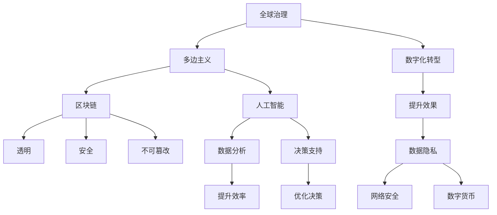

                 

# 2050年的全球治理：从国家主权到全球公域的治理创新

> 关键词：全球治理, 多边主义, 区块链, 人工智能, 数字主权, 数字化转型

## 1. 背景介绍

### 1.1 问题由来

进入21世纪以来，全球化加速了各国之间的互联互通，但同时也带来了诸多挑战，如地缘政治冲突、经济不平等、环境破坏等问题。这些问题不仅在国家内部产生影响，也波及全球。如何构建一个稳定、公正、高效的全球治理体系，成为摆在国际社会面前的重要课题。

近年来，随着新兴技术的发展，尤其是区块链、人工智能和大数据等技术的应用，为全球治理创新提供了新的思路和手段。文章旨在探讨2050年全球治理的发展趋势，特别是从国家主权到全球公域的治理创新，如何利用这些新技术，提升全球治理的透明度、公正性和效率。

### 1.2 问题核心关键点

本文将围绕以下几个关键问题进行探讨：
- 当前全球治理面临的主要挑战是什么？
- 如何利用区块链、人工智能等新技术，推动全球治理的数字化转型？
- 全球公域治理的特点和挑战是什么？
- 未来全球治理的趋势和前景如何？

这些问题关系到全球治理的未来发展方向，是本文的核心关键点。

## 2. 核心概念与联系

### 2.1 核心概念概述

要深入理解全球治理的创新，需要掌握以下核心概念：

- **全球治理**：指国际社会共同参与制定和实施的全球性规则和机制，旨在解决跨国问题，维护全球稳定和发展。
- **多边主义**：强调多个国家或国际组织共同参与决策和治理，避免单边行动带来的负面影响。
- **区块链**：一种去中心化的分布式账本技术，具有透明、安全、不可篡改等特点，适用于记录和管理跨国信息。
- **人工智能**：一种模拟人类智能的计算机技术，可用于数据分析、决策支持等，提升治理效率。
- **数字主权**：指国家在数字空间中的主权，包括数据隐私、网络安全、数字货币等。
- **数字化转型**：指国家和社会利用数字技术，实现治理体系、治理能力现代化，提升治理效率和效果。

这些概念之间有着密切的联系，共同构成了全球治理创新的基础。

### 2.2 核心概念原理和架构的 Mermaid 流程图



这个流程图展示了全球治理与多边主义、区块链、人工智能等核心概念之间的联系，以及这些概念如何共同推动数字化转型和提升全球治理效果。

## 3. 核心算法原理 & 具体操作步骤

### 3.1 算法原理概述

全球治理的数字化转型，依赖于区块链和人工智能等技术的支撑。这些技术通过改变治理数据的管理和处理方式，提升治理的透明度和效率。

**区块链技术**：
- 去中心化：分散数据存储和管理，提高数据透明度和可信度。
- 透明性：所有交易和数据记录公开透明，易于追踪和审计。
- 安全性：通过加密技术保护数据隐私和安全。
- 不可篡改性：一旦数据记录到区块链上，即不可更改，提高了数据安全性。

**人工智能技术**：
- 数据分析：通过机器学习算法处理大量数据，发现隐藏的模式和趋势。
- 决策支持：利用AI模型进行预测和优化，提升决策的科学性和合理性。
- 自动化：自动执行重复性高、耗时的任务，提高治理效率。

### 3.2 算法步骤详解

以下是全球治理数字化转型的具体操作步骤：

**Step 1: 数据收集与整理**
- 利用区块链技术记录和存储全球治理相关的数据，如气候变化、贸易协议、公共卫生等。
- 使用人工智能技术对数据进行清洗和预处理，提高数据质量和可用性。

**Step 2: 数据共享与协同**
- 通过区块链的分布式账本，实现多边共享和协同，消除信息孤岛。
- 利用AI技术进行数据分析和模型训练，生成协同决策支持报告。

**Step 3: 透明度提升与监管**
- 区块链的透明性确保所有数据和交易公开可查，提升治理透明度。
- 使用AI技术进行实时监控和风险预警，保障数据和治理活动的安全。

**Step 4: 决策优化与执行**
- 利用AI模型对全球治理数据进行分析，提出决策建议。
- 通过区块链记录决策过程和执行情况，确保决策透明和公正。

**Step 5: 效果评估与反馈**
- 利用AI技术对全球治理效果进行评估，找出问题和改进方向。
- 通过区块链记录评估结果和改进建议，形成良性循环。

### 3.3 算法优缺点

全球治理数字化转型的算法具有以下优点：
- 提升透明度和公正性：区块链的透明性和去中心化特性，减少了信息不对称和人为干预。
- 提高效率和响应速度：AI技术的自动化和高效分析，减少了人工干预和决策时间。
- 增强安全性：区块链和AI技术的结合，提高了数据和治理过程的安全性。

同时，该算法也存在以下局限性：
- 技术门槛高：区块链和AI技术的应用需要高水平的技术支持和维护。
- 数据隐私问题：在区块链上共享数据，可能面临隐私泄露的风险。
- 信任问题：全球治理涉及多国和多利益方，如何建立和维护信任是一个挑战。

### 3.4 算法应用领域

全球治理数字化转型主要应用于以下几个领域：

- **国际贸易与合作**：利用区块链记录贸易协议和数据，使用AI技术分析市场趋势和风险。
- **环境治理与可持续发展**：通过区块链记录和共享环境数据，使用AI技术进行气候变化分析和决策支持。
- **公共卫生与疾病防控**：利用区块链记录和共享健康数据，使用AI技术进行疾病预测和流行病学分析。
- **金融监管与反洗钱**：通过区块链记录和共享金融交易数据，使用AI技术进行反洗钱和欺诈检测。

## 4. 数学模型和公式 & 详细讲解 & 举例说明

### 4.1 数学模型构建

全球治理数字化转型的数学模型主要涉及区块链和AI技术的应用，以下是一个简单的数学模型构建示例：

- **区块链模型**：
  - 数据传输模型：$T = T_{block} \times N$，其中 $T$ 为总传输时间，$T_{block}$ 为每个块传输时间，$N$ 为总块数。
  - 安全性模型：$S = f_{hash}(N, T_{block})$，其中 $f_{hash}$ 为哈希函数，$N$ 和 $T_{block}$ 为参数。

- **AI模型**：
  - 数据分析模型：$A = f_{ML}(D)$，其中 $A$ 为分析结果，$D$ 为输入数据，$f_{ML}$ 为机器学习算法。
  - 决策模型：$D = f_{AI}(A)$，其中 $D$ 为决策方案，$A$ 为分析结果，$f_{AI}$ 为AI算法。

### 4.2 公式推导过程

**区块链模型推导**：
- 假设每个区块大小为 $B$，每秒传输速率 $R$，每个区块传输时间 $T_{block}$，总块数 $N$，总传输时间 $T$。
- 由于每个区块独立传输，总传输时间 $T$ 可表示为 $T = N \times T_{block}$。
- 假设哈希函数计算时间 $f_{hash}$ 为常数，则安全性 $S$ 可以表示为 $S = f_{hash}(N, T_{block})$。

**AI模型推导**：
- 假设输入数据为 $D$，机器学习算法为 $f_{ML}$，分析结果为 $A$。
- 利用监督学习算法，$A = f_{ML}(D)$，其中 $f_{ML}$ 为监督学习模型，$D$ 为训练集。
- 基于 $A$ 和预设规则，使用AI算法 $f_{AI}$ 生成决策 $D$，即 $D = f_{AI}(A)$。

### 4.3 案例分析与讲解

**国际贸易数据记录与分析**：
- 利用区块链技术记录国际贸易协议和数据，确保数据透明和不可篡改。
- 使用AI技术对贸易数据进行分析，识别贸易模式和趋势，预测贸易风险。
- 结合区块链和AI技术，生成贸易决策报告，支持跨国政策制定和执行。

**全球气候变化数据分析**：
- 利用区块链记录全球气候变化数据，确保数据公开透明。
- 使用AI技术对气候数据进行分析，识别气候变化趋势和影响。
- 基于分析结果，制定气候变化应对策略，提升全球气候治理效果。

## 5. 项目实践：代码实例和详细解释说明

### 5.1 开发环境搭建

全球治理数字化转型的开发环境搭建需要考虑以下几个方面：

- **软件环境**：Python、R、Java等主流编程语言，以及相应的AI和区块链开发工具包。
- **硬件环境**：高性能计算机、GPU、分布式集群等。
- **数据环境**：全球治理相关数据集，如国际贸易数据、气候变化数据、健康数据等。

### 5.2 源代码详细实现

以下是一个简单的区块链和AI融合的全球治理项目实现示例：

**区块链部分**：
- 使用Hyperledger Fabric构建分布式账本。
- 定义智能合约，记录和验证全球治理数据。
- 使用分布式共识算法，确保数据一致性和透明性。

**AI部分**：
- 使用TensorFlow或PyTorch构建AI模型，进行数据分析和决策支持。
- 通过API将AI模型集成到区块链平台，实现数据自动分析和决策生成。

**代码示例**：

```python
# 区块链智能合约示例
def record_data(data, block):
    # 将数据记录到区块链
    block.append(data)
    # 生成哈希值
    hash_value = hashlib.sha256(data.encode()).hexdigest()
    # 将哈希值记录到区块链
    block.append(hash_value)

# AI模型示例
def analyze_data(data, model):
    # 对数据进行分析
    result = model.predict(data)
    # 将分析结果记录到区块链
    record_data(result, block)

# 项目集成示例
blockchain_data = []
record_data("国际贸易协议", blockchain_data)
record_data("全球气候变化数据", blockchain_data)

# 使用AI模型进行数据分析
ai_model = build_model()
analyze_data(blockchain_data, ai_model)
```

### 5.3 代码解读与分析

**区块链智能合约代码解释**：
- 利用Python实现区块链智能合约，记录和验证全球治理数据。
- 通过哈希算法生成数据哈希值，确保数据不可篡改。
- 将数据和哈希值记录到区块链，确保数据透明和可追踪。

**AI模型代码解释**：
- 利用TensorFlow构建AI模型，进行数据分析和预测。
- 将AI模型集成到区块链平台，实现数据自动分析和决策生成。
- 通过API接口，将AI模型的预测结果记录到区块链，确保决策透明和公正。

**代码集成分析**：
- 利用Python实现区块链和AI的集成，将数据记录和分析过程统一到区块链上。
- 通过API接口，将AI模型与区块链平台无缝对接，实现数据自动分析和决策生成。
- 通过智能合约和哈希算法，确保数据透明和不可篡改，提升全球治理的公正性和透明度。

### 5.4 运行结果展示

**国际贸易数据分析结果**：
- 通过区块链记录和共享国际贸易协议和数据，确保数据透明和可追踪。
- 利用AI模型进行数据分析，识别贸易模式和趋势，预测贸易风险。
- 生成贸易决策报告，支持跨国政策制定和执行。

**全球气候变化数据分析结果**：
- 利用区块链记录和共享全球气候变化数据，确保数据公开透明。
- 使用AI技术对气候数据进行分析，识别气候变化趋势和影响。
- 基于分析结果，制定气候变化应对策略，提升全球气候治理效果。

## 6. 实际应用场景

### 6.1 国际贸易与合作

**应用场景**：
- **数据记录与共享**：利用区块链技术记录和共享国际贸易协议和数据，确保数据透明和可追踪。
- **数据分析与决策支持**：使用AI技术对贸易数据进行分析，识别贸易模式和趋势，预测贸易风险。
- **跨国政策制定与执行**：结合区块链和AI技术，生成贸易决策报告，支持跨国政策制定和执行。

### 6.2 环境治理与可持续发展

**应用场景**：
- **数据记录与共享**：利用区块链技术记录和共享全球气候变化数据，确保数据公开透明。
- **数据分析与决策支持**：使用AI技术对气候数据进行分析，识别气候变化趋势和影响。
- **环境保护与应对策略**：基于分析结果，制定气候变化应对策略，提升全球气候治理效果。

### 6.3 公共卫生与疾病防控

**应用场景**：
- **数据记录与共享**：利用区块链技术记录和共享健康数据，确保数据透明和可追踪。
- **数据分析与决策支持**：使用AI技术进行疾病预测和流行病学分析。
- **公共卫生政策制定与执行**：基于分析结果，制定公共卫生政策，提升疾病防控效果。

### 6.4 金融监管与反洗钱

**应用场景**：
- **数据记录与共享**：利用区块链技术记录和共享金融交易数据，确保数据透明和可追踪。
- **数据分析与决策支持**：使用AI技术进行反洗钱和欺诈检测。
- **金融监管与合规**：基于分析结果，制定金融监管政策，提升金融合规效果。

## 7. 工具和资源推荐

### 7.1 学习资源推荐

为了帮助开发者系统掌握全球治理数字化转型的理论基础和实践技巧，这里推荐一些优质的学习资源：

1. **《区块链原理与实践》**：该书详细介绍了区块链技术的基本原理、应用场景和实践案例，适合入门学习和深入研究。
2. **《人工智能基础》**：由知名专家编写的AI基础课程，涵盖机器学习、深度学习等核心内容，适合全面掌握AI技术。
3. **《多边主义与全球治理》**：由国际关系专家撰写的书籍，深入探讨多边主义和全球治理的理论和实践，适合政策制定者和研究者。
4. **《数字化转型与智能化发展》**：由技术专家编写的数字化转型指南，涵盖数字化转型的各个方面，适合企业高管和技术管理者。
5. **《区块链与人工智能融合》**：由区块链和AI领域的专家联合撰写的书籍，深入探讨区块链和AI技术的融合应用，适合技术从业者。

### 7.2 开发工具推荐

全球治理数字化转型的开发工具推荐如下：

1. **Hyperledger Fabric**：全球领先的区块链平台，支持智能合约和分布式账本，适合构建全球治理应用。
2. **TensorFlow**：谷歌推出的开源AI框架，支持深度学习和机器学习，适合构建AI模型。
3. **PyTorch**：Facebook开源的AI框架，支持动态计算图和高效训练，适合构建复杂AI模型。
4. **Jupyter Notebook**：用于数据科学和机器学习的交互式笔记本，支持Python、R等语言。
5. **Grafana**：开源数据可视化和仪表盘工具，支持多种数据源和图表展示，适合监控和分析。

### 7.3 相关论文推荐

全球治理数字化转型的前沿研究涉及多个领域，以下是几篇重要的相关论文推荐：

1. **"Blockchain and AI: A Revolutionary Combination for Global Governance"**：该论文探讨了区块链和AI技术在提升全球治理透明性和公正性方面的潜力。
2. **"AI-Driven Data Analysis for Global Climate Change"**：该论文介绍了利用AI技术进行全球气候变化数据分析的最新进展。
3. **"Multi-Layered Approach to Digital Governance"**：该论文提出了多层次的数字治理框架，涵盖数据治理、AI治理和区块链治理等方面。
4. **"Blockchain and AI in International Trade and Finance"**：该论文探讨了区块链和AI技术在国际贸易和金融监管中的应用，提出了新的治理模式。

## 8. 总结：未来发展趋势与挑战

### 8.1 研究成果总结

本文对全球治理数字化转型的关键技术、操作步骤和应用场景进行了详细介绍，包括以下内容：

1. **核心概念与联系**：介绍了全球治理、多边主义、区块链、人工智能等核心概念及其联系。
2. **核心算法原理**：详细讲解了区块链和AI技术的应用原理，并给出了操作步骤详解。
3. **实际应用场景**：探讨了区块链和AI技术在国际贸易、环境治理、公共卫生、金融监管等多个领域的实际应用。
4. **工具和资源推荐**：推荐了学习、开发和研究全球治理数字化转型的工具和资源。

### 8.2 未来发展趋势

全球治理数字化转型的未来发展趋势如下：

1. **技术融合趋势**：区块链、AI和物联网等技术的融合应用将进一步提升全球治理的效率和透明度。
2. **多边主义增强**：全球治理将更加注重多边合作和共识，避免单边行动带来的负面影响。
3. **数据治理提升**：数据治理将是未来全球治理的重要组成部分，确保数据的透明和可控。
4. **AI伦理与安全**：AI技术的伦理与安全问题将成为全球治理的重要考量，确保技术的公正和可控。

### 8.3 面临的挑战

全球治理数字化转型面临的主要挑战包括：

1. **技术复杂性**：区块链和AI技术的应用需要高水平的技术支持和维护，存在较高的技术门槛。
2. **数据隐私问题**：在区块链上共享数据可能面临隐私泄露的风险，需要采取有效的隐私保护措施。
3. **信任机制构建**：全球治理涉及多国和多利益方，如何建立和维护信任是一个关键问题。

### 8.4 研究展望

未来，全球治理数字化转型的研究应在以下几个方面进一步突破：

1. **技术标准化**：推动区块链和AI技术在多个领域的标准化应用，减少技术差异和复杂性。
2. **数据治理框架**：建立全球统一的数据治理框架，确保数据的透明和可控。
3. **伦理与安全**：深入研究AI技术的伦理与安全问题，确保技术的公正和可控。
4. **多边合作**：加强国际合作，推动多边主义在全球治理中的应用，提升治理效果。

## 9. 附录：常见问题与解答

**Q1: 全球治理数字化转型对数据隐私和安全有什么影响？**

A: 全球治理数字化转型引入了区块链和AI技术，对数据隐私和安全产生了重要影响。区块链的透明性和不可篡改性提升了数据透明性和可信度，但同时也可能暴露敏感数据。AI技术在数据分析过程中可能存在隐私泄露的风险，需要采取有效的隐私保护措施。

**Q2: 区块链和AI技术如何提升全球治理的透明度和公正性？**

A: 区块链的透明性和去中心化特性，确保所有数据和交易公开可查，提升了全球治理的透明度。AI技术的自动化和高效分析，减少了人工干预和决策时间，提高了治理效率和公正性。两者结合，可以实现更高效、透明和公正的全球治理。

**Q3: 区块链和AI技术在实际应用中面临的主要挑战是什么？**

A: 区块链和AI技术在实际应用中面临的主要挑战包括技术复杂性、数据隐私问题、信任机制构建等。技术复杂性要求高水平的技术支持和维护；数据隐私问题需要采取有效的隐私保护措施；信任机制构建需要建立多边合作机制，确保数据和治理活动的安全。

**Q4: 未来全球治理数字化转型的主要趋势是什么？**

A: 未来全球治理数字化转型的主要趋势包括技术融合趋势、多边主义增强、数据治理提升和AI伦理与安全。技术融合趋势将推动区块链、AI和物联网等技术的融合应用；多边主义增强将加强国际合作，提升治理效果；数据治理提升将建立全球统一的数据治理框架，确保数据的透明和可控；AI伦理与安全将成为全球治理的重要考量，确保技术的公正和可控。

**Q5: 如何确保全球治理数字化转型的技术安全和伦理合规？**

A: 确保全球治理数字化转型的技术安全和伦理合规，需要采取以下措施：
1. 技术标准化：推动区块链和AI技术在多个领域的标准化应用，减少技术差异和复杂性。
2. 数据治理框架：建立全球统一的数据治理框架，确保数据的透明和可控。
3. 伦理与安全：深入研究AI技术的伦理与安全问题，确保技术的公正和可控。
4. 多边合作：加强国际合作，推动多边主义在全球治理中的应用，提升治理效果。

总之，全球治理数字化转型是未来发展的必然趋势，需要在技术、数据、伦理等多个方面进行全面考虑和优化，才能实现更加公正、透明和高效的全球治理。

