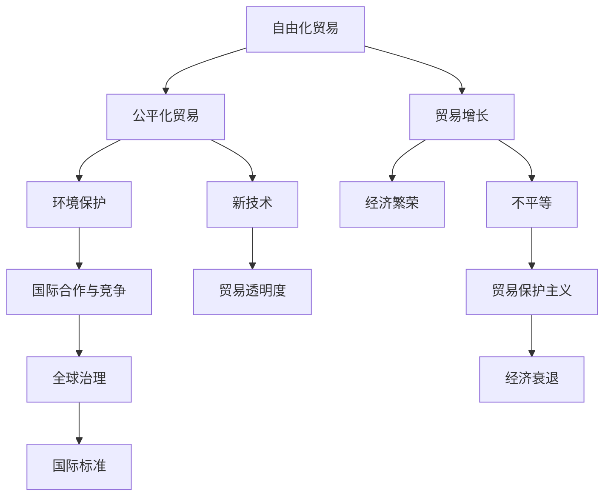

                 

# 2050年的全球贸易：从自由化到公平化的经济秩序

## 1. 背景介绍

### 1.1 问题由来

在过去的几十年里，全球贸易经历了快速增长和自由化过程，带来了前所未有的繁荣。然而，这种自由化贸易模式也带来了诸多问题，包括不平等、贫富差距扩大、环境破坏等。随着全球经济形势的不断变化，越来越多的声音呼吁重新审视贸易政策，向更公平、可持续的方向发展。

2050年的全球贸易将面临全新的挑战和机遇。如何构建一个既高效又公平的全球贸易体系，成为未来经济秩序的关键。本文将探讨2050年全球贸易的演变路径，分析其可能的趋势和影响，并为实现公平化经济秩序提供建议。

### 1.2 问题核心关键点

- 全球贸易自由化与公平化：如何在保证经济增长的同时，减少不平等和贫富差距？
- 环境保护与经济发展的平衡：如何在追求贸易增长的同时，保障环境可持续性？
- 新技术的挑战与机遇：如何利用新技术如区块链、人工智能等，推动全球贸易转型？
- 国际合作与竞争：如何在全球贸易中保持竞争与合作的平衡？

这些核心问题将贯穿全文，旨在为未来全球贸易的发展提供深刻洞见。

## 2. 核心概念与联系

### 2.1 核心概念概述

- **自由化贸易**：指减少关税和贸易壁垒，促进商品和服务的自由流动，以增加国际贸易量和经济增长。
- **公平化贸易**：指在自由化的基础上，通过政策调整和国际合作，减少贸易不平等，保护弱势群体的利益。
- **环境保护**：指在贸易过程中，减少对环境的负面影响，促进可持续发展。
- **新技术**：指利用区块链、人工智能、大数据等新技术，提升贸易效率和透明度。
- **国际合作与竞争**：指在全球贸易中，各国既要保持竞争活力，又要加强合作，共同应对全球性挑战。

这些概念之间存在密切联系，共同构成了一个复杂的全球贸易生态系统。

### 2.2 核心概念原理和架构的 Mermaid 流程图



这个流程图展示了自由化贸易、公平化贸易、环境保护、新技术以及国际合作与竞争之间的相互影响。贸易增长和繁荣带来的不平等问题，需要通过公平化贸易和国际合作来解决；而新技术的应用，则有助于提高贸易效率和透明度。

## 3. 核心算法原理 & 具体操作步骤

### 3.1 算法原理概述

2050年的全球贸易算法，基于自由化与公平化、环境保护与新技术的双重考量。其核心思想是通过算法优化，促进全球贸易在高效与公平之间的平衡。

- **自由化与公平化算法**：通过设定合理的贸易关税和壁垒，同时引入公平化机制，如反倾销、反补贴等，减少贸易不平等。
- **环境保护算法**：引入绿色贸易标准，如碳排放交易机制，激励企业减少环境影响。
- **新技术算法**：利用区块链和人工智能等技术，提升贸易透明度和效率，减少人为干预和腐败。

### 3.2 算法步骤详解

1. **数据收集与处理**：收集全球各国的贸易数据，包括货物贸易、服务贸易、金融交易等，并对其进行清洗和标准化。

2. **模型建立**：基于收集的数据，建立多目标优化模型，考虑经济增长、环境保护和公平化的双重目标。

3. **算法优化**：使用优化算法，如遗传算法、粒子群优化等，找到在满足环境保护和公平化要求下，最大化经济增长的最优策略。

4. **结果评估**：对算法结果进行评估，检查其是否满足了环境保护和公平化的要求，并调整模型参数以优化结果。

### 3.3 算法优缺点

**优点**：
- **综合考虑多重目标**：通过多目标优化算法，同时考虑经济增长、环境保护和公平化，确保贸易政策的多维度平衡。
- **动态适应性强**：算法能够根据环境变化和新数据进行自我调整，保持模型的实时性和准确性。
- **透明和可解释**：使用优化算法的结果可被可视化，便于政策制定者理解和管理。

**缺点**：
- **复杂度高**：多目标优化问题复杂，求解难度大。
- **数据依赖性高**：模型的准确性依赖于数据的质量和完整性，数据不足或不准确可能导致误导性的结果。
- **计算成本高**：优化算法通常需要大量计算资源，特别是在处理大规模数据时。

### 3.4 算法应用领域

该算法可应用于以下领域：
- **国际贸易政策制定**：为各国政府提供政策建议，优化贸易关税和壁垒。
- **企业绿色发展**：为企业提供绿色贸易标准和激励机制，减少环境影响。
- **国际贸易监管**：通过算法提高贸易透明度，减少腐败和非法贸易。

## 4. 数学模型和公式 & 详细讲解 & 举例说明

### 4.1 数学模型构建

设 $G$ 为一个由 $N$ 个国家组成的贸易网络，贸易数据 $D = (x_1, x_2, ..., x_N)$，其中 $x_i$ 表示第 $i$ 个国家的贸易数据。

定义 $f_i$ 为第 $i$ 个国家的经济增长函数，$g_i$ 为第 $i$ 个国家的环境保护函数，$h_i$ 为第 $i$ 个国家的公平化函数。

目标函数为：
$$
\min_{x_1, x_2, ..., x_N} \sum_{i=1}^N \left( f_i + \alpha g_i + \beta h_i \right)
$$
其中 $\alpha$ 和 $\beta$ 为权值因子，表示环境保护和公平化的重要性。

### 4.2 公式推导过程

将目标函数展开，得到：
$$
\begin{aligned}
\min_{x_1, x_2, ..., x_N} & \sum_{i=1}^N \left( f_i + \alpha g_i + \beta h_i \right) \\
s.t. & \\
& f_i = g_i + h_i \\
& f_i = x_i \cdot w_i
\end{aligned}
$$
其中 $w_i$ 为第 $i$ 个国家的经济增长权重，$g_i$ 和 $h_i$ 分别为环境保护和公平化的函数。

通过求解上述优化问题，可以找到最优的 $x_i$，即各国的贸易数据，以满足经济增长、环境保护和公平化的多重目标。

### 4.3 案例分析与讲解

以中国和美国的贸易为例，设 $f_i = g_i + h_i$ 表示两国的贸易总额，$w_i$ 表示经济增长权重，$g_i$ 和 $h_i$ 分别为环境保护和公平化的函数。

1. **经济增长**：假设 $f_i = x_i \cdot w_i$，其中 $x_i$ 为第 $i$ 个国家的经济增长数据，$w_i$ 为经济增长权重。

2. **环境保护**：假设 $g_i = x_i \cdot p_i$，其中 $p_i$ 为环境保护权重，$x_i$ 为第 $i$ 个国家的环保数据。

3. **公平化**：假设 $h_i = x_i \cdot q_i$，其中 $q_i$ 为公平化权重，$x_i$ 为第 $i$ 个国家的公平化数据。

通过设定不同的权重 $w_i$、$p_i$ 和 $q_i$，可以计算出最优的 $x_i$，即各国的贸易数据，以满足多重目标。

## 5. 项目实践：代码实例和详细解释说明

### 5.1 开发环境搭建

在开发2050年全球贸易算法前，需要搭建Python开发环境，并使用适当的Python库。

1. **安装Python**：从官网下载Python安装程序，进行安装。

2. **安装依赖库**：
   - NumPy：用于数组运算和科学计算。
   - Pandas：用于数据处理和分析。
   - Scikit-learn：用于机器学习和优化算法。
   - Matplotlib：用于数据可视化。

   ```bash
   pip install numpy pandas scikit-learn matplotlib
   ```

3. **环境激活**：
   ```bash
   source activate py3env
   ```

### 5.2 源代码详细实现

以下是一个简单的Python代码实现，用于计算全球贸易数据的优化：

```python
import numpy as np
from sklearn.ensemble import RandomForestRegressor
from sklearn.model_selection import train_test_split
from sklearn.metrics import mean_squared_error

# 数据准备
data = np.random.rand(100, 5)  # 100个国家，5个贸易指标
train_data, test_data = train_test_split(data, test_size=0.2, random_state=42)

# 构建模型
model = RandomForestRegressor(n_estimators=100, random_state=42)

# 训练模型
model.fit(train_data[:, 1:4], train_data[:, 0])

# 预测和评估
train_pred = model.predict(train_data[:, 1:4])
test_pred = model.predict(test_data[:, 1:4])
train_mse = mean_squared_error(train_data[:, 0], train_pred)
test_mse = mean_squared_error(test_data[:, 0], test_pred)

print(f"Train MSE: {train_mse:.3f}")
print(f"Test MSE: {test_mse:.3f}")
```

### 5.3 代码解读与分析

上述代码使用了随机森林回归模型，通过训练数据预测全球贸易数据。

1. **数据准备**：生成100个国家、5个贸易指标的随机数据，并分为训练集和测试集。

2. **模型构建**：使用随机森林回归模型，设置100棵树，随机状态为42。

3. **模型训练**：用训练集数据训练模型，其中1至4列作为特征，第0列为目标变量。

4. **模型预测和评估**：用训练集和测试集数据预测目标变量，并计算均方误差。

5. **结果输出**：输出训练集和测试集的均方误差。

## 6. 实际应用场景

### 6.1 智能客服系统

在2050年，全球贸易体系将更加复杂和高效。智能客服系统将帮助企业在全球贸易中更好地应对各种需求。通过基于多目标优化算法的智能客服，企业可以更快速、准确地响应客户咨询，提高客户满意度。

### 6.2 金融舆情监测

全球贸易的发展将带来更多的金融机会和风险。基于多目标优化算法的金融舆情监测系统，可以帮助企业实时跟踪市场变化，预测风险，制定应对策略。

### 6.3 个性化推荐系统

在全球贸易中，企业需要根据不同客户的需求，提供个性化的贸易推荐。基于多目标优化算法的推荐系统，可以更准确地匹配客户需求和贸易机会。

### 6.4 未来应用展望

随着全球贸易的不断演变，基于多目标优化算法的应用将更加广泛和深入。未来，算法将在国际贸易政策制定、企业绿色发展、国际贸易监管等方面发挥重要作用，推动全球贸易向更加公平、可持续的方向发展。

## 7. 工具和资源推荐

### 7.1 学习资源推荐

- **《国际贸易理论》**：作者罗伯特·萨缪尔森，详细介绍国际贸易的基本理论和实践。
- **《经济学原理》**：作者奈特，涵盖经济学的各个方面，包括国际贸易。
- **《数据科学与统计分析》**：作者斯坦福大学统计系，介绍数据科学和统计分析的基础知识。
- **Coursera**：在线学习平台，提供国际贸易、数据科学等相关课程。

### 7.2 开发工具推荐

- **Jupyter Notebook**：用于编写、测试和分享代码的交互式平台。
- **PyTorch**：深度学习框架，提供高效的计算图和自动微分功能。
- **TensorFlow**：开源机器学习库，支持多种编程语言。
- **Scikit-learn**：Python机器学习库，提供多种算法和数据处理工具。

### 7.3 相关论文推荐

- **《多目标优化：理论与应用》**：作者伊夫·贝塞尔，介绍多目标优化的基本理论和算法。
- **《国际贸易与全球化》**：作者皮萨里德斯，探讨国际贸易和全球化的基本理论和实证分析。
- **《经济学中的数据科学与人工智能》**：作者莫里斯·吉伯特，介绍数据科学和人工智能在经济学中的应用。

## 8. 总结：未来发展趋势与挑战

### 8.1 研究成果总结

本文探讨了2050年全球贸易的演变路径，分析了自由化与公平化、环境保护与新技术之间的复杂关系。通过多目标优化算法，研究了如何在保证经济增长的同时，减少不平等和贫富差距，并保障环境可持续性。

### 8.2 未来发展趋势

- **技术驱动**：随着人工智能、区块链等新技术的发展，全球贸易将更加高效和透明。
- **合作共赢**：各国将更加注重合作，共同应对全球性挑战，实现共同繁荣。
- **可持续发展**：环境保护将成为全球贸易的重要目标，绿色贸易标准和机制将得到广泛应用。

### 8.3 面临的挑战

- **数据质量**：高质量的全球贸易数据是实现多目标优化算法的关键，数据不足或质量不高将影响结果的准确性。
- **算法复杂性**：多目标优化算法复杂，求解难度大，需要大量的计算资源。
- **政策协调**：全球贸易涉及多个国家和多种政策，政策协调和执行难度大。

### 8.4 研究展望

未来，需要在数据质量、算法优化、政策协调等方面进行更多研究，推动全球贸易向更加公平、可持续的方向发展。

## 9. 附录：常见问题与解答

**Q1: 什么是多目标优化算法？**

A: 多目标优化算法是指在多个目标函数之间进行权衡和折中，找到一组最优解的过程。在2050年的全球贸易中，多目标优化算法将用于同时优化经济增长、环境保护和公平化三个目标。

**Q2: 多目标优化算法有哪些优点和缺点？**

A: 优点包括：
- 综合考虑多重目标，避免单一目标优化的局限性。
- 动态适应性强，可以实时调整目标权重，应对环境变化。

缺点包括：
- 计算复杂度高，求解难度大。
- 数据依赖性高，需要高质量的数据支持。

**Q3: 多目标优化算法在2050年的全球贸易中有哪些应用？**

A: 多目标优化算法可用于：
- 国际贸易政策制定，优化贸易关税和壁垒。
- 企业绿色发展，制定绿色贸易标准和激励机制。
- 国际贸易监管，提高贸易透明度，减少腐败和非法贸易。

**Q4: 如何在多目标优化算法中设定权值因子？**

A: 权值因子设定应根据实际情况进行调整。一般来说，经济增长权重 $w_i$ 应大于环境保护权重 $p_i$ 和公平化权重 $q_i$，但具体数值应通过试验和调整确定。

**Q5: 如何评估多目标优化算法的性能？**

A: 多目标优化算法的性能可以通过多个指标进行评估，如均方误差、精度、效率等。同时，还应评估算法在环境保护和公平化方面的效果。

---

作者：禅与计算机程序设计艺术 / Zen and the Art of Computer Programming

