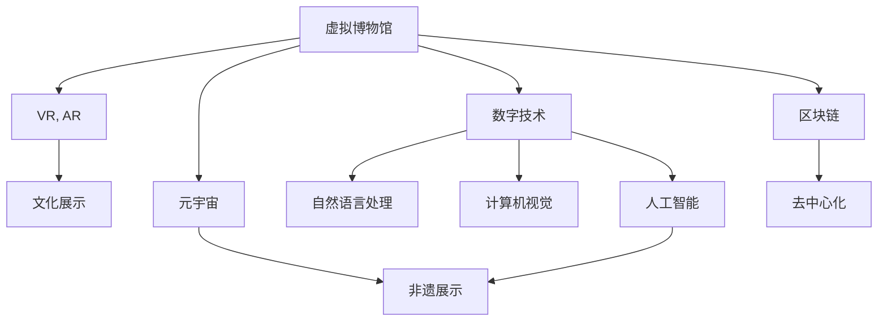

                 

# 2050年的数字文化：从虚拟博物馆到元宇宙非遗展示的数字文化传承

## 1. 背景介绍

随着数字技术的飞速发展，我们即将步入2050年的数字文化新时代。在这个时代，虚拟博物馆、元宇宙非遗展示等新兴文化形式将引领文化传承的数字化浪潮。然而，这一切并不是一蹴而就的，而是需要科技、文化、教育、政策等多方面共同努力的结果。

### 1.1 数字技术的发展与应用

数字技术已经渗透到社会的方方面面，改变了人们的生活方式和思维方式。在文化领域，数字技术为文化的传承与创新提供了新的可能性。虚拟博物馆通过虚拟现实(VR)、增强现实(AR)等技术，将历史文物和文化艺术品以数字形式呈现，使得观众可以随时随地沉浸在历史长河中。元宇宙的非遗展示利用区块链和人工智能，让非物质文化遗产以虚拟形式得以永续传承。

### 1.2 文化传承的数字化转型

文化传承是人类文明的重要组成部分，数字化转型为这一过程注入了新的活力。虚拟博物馆和元宇宙非遗展示通过数字手段，不仅拓宽了文化传承的渠道，还增加了观众的互动性和参与度。数字化文化形式具有传播快、覆盖广、成本低等特点，能够满足更多人的文化需求，推动文化教育的普及和深入。

## 2. 核心概念与联系

### 2.1 核心概念概述

为更好地理解数字文化传承的核心概念，本节将介绍几个密切相关的核心概念：

- **虚拟博物馆**：通过VR、AR等技术，将现实中的博物馆场景和文物数字化的文化展示形式。观众可以自由探索，沉浸在虚拟环境中，与虚拟文物进行互动。
- **元宇宙**：基于区块链、云计算、AI等技术的虚拟世界，用户可以在其中进行社交、工作、娱乐等各种活动，非遗展示便是元宇宙文化应用的重要体现。
- **非物质文化遗产(简称“非遗”)**：指以人类智慧和劳动为载体的文化成果，包括口头传说、传统表演艺术、社会风俗、传统手工艺等。数字文化传承有助于保护和传承这些独特的文化元素。
- **数字技术**：包括但不限于计算机视觉、自然语言处理、人工智能等技术，这些技术为数字文化传承提供了强大的技术支持。
- **区块链**：一种去中心化的分布式账本技术，具有透明性、安全性等特点，为元宇宙提供了重要的基础设施支持。

这些核心概念之间的逻辑关系可以通过以下Mermaid流程图来展示：



这个流程图展示了大语言模型的核心概念及其之间的关系：

1. 虚拟博物馆利用VR、AR等技术，对文化展示进行数字化。
2. 元宇宙通过区块链、AI等技术，为非遗展示提供虚拟平台。
3. 数字技术为虚拟博物馆和元宇宙提供了技术支持，包括自然语言处理、计算机视觉、人工智能等。
4. 区块链技术为元宇宙提供去中心化基础设施。
5. 元宇宙中的非遗展示，通过虚拟形式实现文化传承。

这些概念共同构成了2050年数字文化传承的基础框架，为数字文化的发展提供了理论支撑和技术手段。

## 3. 核心算法原理 & 具体操作步骤
### 3.1 算法原理概述

基于数字技术的虚拟博物馆和元宇宙非遗展示，其核心算法原理涉及虚拟现实、增强现实、人工智能、区块链等多个领域。这里主要介绍虚拟博物馆的VR/AR技术，元宇宙非遗展示的智能算法和区块链技术。

### 3.2 算法步骤详解

**虚拟博物馆的VR/AR技术**：

1. **数据采集与处理**：采集文物的数字模型、3D扫描数据，进行预处理，生成高质量的虚拟文物数据。
2. **三维建模与渲染**：使用三维建模软件对文物进行建模，生成虚拟场景，进行渲染优化。
3. **交互设计**：设计虚拟博物馆的交互界面，包括虚拟导览、互动解说、互动游戏等。
4. **VR/AR技术应用**：通过VR头盔或AR眼镜，将虚拟场景和文物呈现在观众面前，观众可以通过手势、语音等方式与虚拟文物互动。

**元宇宙非遗展示的智能算法**：

1. **数据收集与预处理**：收集非遗项目的视频、音频、图片等数据，进行预处理和清洗。
2. **模型训练与优化**：使用深度学习技术对非遗项目进行模型训练，优化模型参数，提升模型性能。
3. **知识图谱构建**：构建非遗项目的知识图谱，标注每个元素的关系和属性。
4. **智能推荐与互动**：基于知识图谱，使用AI算法进行智能推荐，开发互动模块，增强用户参与度。

**区块链技术**：

1. **智能合约设计**：设计智能合约，明确非遗展示项目的权利和义务，确保项目的透明性和可信度。
2. **去中心化存储**：使用区块链技术进行数据存储和传输，确保数据的安全性和不可篡改性。
3. **用户交互与治理**：通过区块链平台，实现用户之间的交互和治理，确保项目的多方参与和共同维护。

### 3.3 算法优缺点

基于数字技术的虚拟博物馆和元宇宙非遗展示具有以下优点：

1. **突破时空限制**：虚拟博物馆和元宇宙非遗展示打破了物理空间和时间的限制，观众可以随时随地访问，扩大了文化传承的受众范围。
2. **提升用户体验**：通过VR/AR技术，观众可以沉浸在虚拟环境中，感受历史的氛围，增强了互动性和参与感。
3. **降低成本**：数字文化传承的成本远低于传统的物理博物馆和展览，降低了文化教育和传承的门槛。
4. **推动创新**：数字技术的应用，为文化传承提供了新的可能性，推动了文化形式和内容的创新。

同时，这些技术也存在一些局限性：

1. **技术复杂性**：虚拟博物馆和元宇宙非遗展示需要复杂的计算机视觉、自然语言处理、人工智能等技术支持，技术门槛较高。
2. **用户体验限制**：受限于当前的技术水平，VR/AR设备的普及度较低，用户的体验和舒适感有待提高。
3. **数据安全问题**：区块链技术虽然提高了数据的可信度，但数据存储和传输的安全性仍然存在挑战。
4. **文化传承的深度**：虚拟博物馆和元宇宙非遗展示虽然丰富了文化体验，但在文化传承的深度和内涵上，可能仍不及传统形式。

尽管存在这些局限性，但虚拟博物馆和元宇宙非遗展示作为数字文化传承的新形式，无疑具有巨大的潜力和发展空间。

### 3.4 算法应用领域

虚拟博物馆和元宇宙非遗展示在多个领域得到了广泛应用：

- **文化教育**：虚拟博物馆和元宇宙非遗展示为学校提供了丰富的教学资源，通过互动和体验，提升学生的学习兴趣和效果。
- **文化传播**：通过虚拟展览和直播，向全球观众展示中国丰富的文化底蕴，增强文化自信和文化影响力。
- **旅游观光**：虚拟博物馆和元宇宙非遗展示为游客提供虚拟旅行体验，满足其对历史文化的好奇心。
- **文化遗产保护**：通过数字化手段，保存和记录文化遗产，防止其损毁和遗忘。
- **社会参与**：通过元宇宙平台，用户可以参与文化遗产的保护和治理，增强社会责任感和参与感。

## 4. 数学模型和公式 & 详细讲解  
### 4.1 数学模型构建

在数字文化传承中，涉及许多数学模型和公式，这里以虚拟博物馆的VR/AR技术为例进行说明。

**三维重建与渲染**：

- **三维重建模型**：使用三维重建技术，将实物转换为三维模型，如三角网格模型(Triangle Mesh)。
- **纹理映射**：将纹理贴到三维模型上，提升模型的真实感。
- **光照模型**：使用光照模型模拟光照效果，提升渲染质量。

**用户交互设计**：

- **手势识别**：使用机器学习算法，识别用户的手势动作。
- **语音识别**：使用语音识别技术，理解用户的语音指令。
- **情感分析**：使用自然语言处理技术，分析用户的情感状态。

**元宇宙非遗展示的智能算法**：

- **深度学习模型**：如卷积神经网络(CNN)、循环神经网络(RNN)等，用于图像、音频、文本等数据的处理和分析。
- **知识图谱构建**：使用图结构表示非遗项目的元素关系，如图数据库(Graph Database)。
- **推荐系统**：使用协同过滤、内容推荐等算法，为观众推荐感兴趣的非遗项目。

**区块链技术**：

- **共识算法**：如PoW(工作量证明)、PoS(权益证明)等，确保网络的安全性和可靠性。
- **智能合约设计**：使用Solidity、Smart Contract等语言编写智能合约，确保项目的透明度和可执行性。
- **分布式账本**：使用区块链技术，实现数据的分布式存储和传输。

### 4.2 公式推导过程

以虚拟博物馆的VR/AR技术为例，推导三维重建与渲染的公式：

- **三维重建模型**：
  $$
  \text{模型} = f(\text{实物}) = \mathcal{M}(\text{点云数据})
  $$
  其中，$\mathcal{M}$表示三维重建算法，点云数据是通过激光扫描或三维扫描获取的。

- **纹理映射**：
  $$
  \text{纹理图} = g(\text{模型}, \text{纹理图库})
  $$
  其中，$g$表示纹理映射算法，纹理图库包含各种材质和纹理图像。

- **光照模型**：
  $$
  \text{渲染图} = h(\text{模型}, \text{光照环境}, \text{纹理图})
  $$
  其中，$h$表示光照模型，渲染图是最终显示的图像。

### 4.3 案例分析与讲解

**案例1：数字敦煌**：

- **背景**：敦煌莫高窟是世界文化遗产，历史悠久，保存着大量壁画、雕塑等珍贵文物。然而，由于物理环境的限制，敦煌莫高窟的开放时间有限，观众难以亲临现场。
- **解决方案**：利用三维重建技术，对敦煌莫高窟进行数字化重现，并在VR平台中进行展示。观众可以通过VR头盔，沉浸式体验敦煌的文化和历史。
- **技术实现**：
  - 采集敦煌莫高窟的3D扫描数据，进行预处理和优化。
  - 使用三维建模软件，构建敦煌莫高窟的虚拟场景。
  - 对虚拟场景进行纹理映射和光照渲染，提升逼真度。
  - 设计VR导览和互动解说，增强用户体验。

**案例2：元宇宙的非遗展示**：

- **背景**：中国拥有丰富的非物质文化遗产，如京剧、昆曲、中医等。这些文化形式需要传承和保护，但由于地域、时空限制，难以广泛传播。
- **解决方案**：利用区块链技术，搭建元宇宙平台，进行非遗展示和互动。用户可以在元宇宙中，自由探索和体验非遗项目，进行文化传播和保护。
- **技术实现**：
  - 收集京剧、昆曲、中医等非遗项目的音频、视频、图片等数据，进行预处理和清洗。
  - 使用深度学习模型，对非遗项目进行特征提取和分类。
  - 构建知识图谱，标注每个元素的关系和属性。
  - 设计智能推荐系统，为观众推荐感兴趣的非遗项目。
  - 使用区块链技术，进行数据的分布式存储和传输。

## 5. 项目实践：代码实例和详细解释说明
### 5.1 开发环境搭建

在进行数字文化传承的开发前，我们需要准备好开发环境。以下是使用Python进行PyTorch开发的环境配置流程：

1. 安装Anaconda：从官网下载并安装Anaconda，用于创建独立的Python环境。

2. 创建并激活虚拟环境：
```bash
conda create -n digitculture python=3.8 
conda activate digitculture
```

3. 安装PyTorch：根据CUDA版本，从官网获取对应的安装命令。例如：
```bash
conda install pytorch torchvision torchaudio cudatoolkit=11.1 -c pytorch -c conda-forge
```

4. 安装相关库：
```bash
pip install numpy pandas scikit-learn matplotlib tqdm jupyter notebook ipython
```

完成上述步骤后，即可在`digitculture`环境中开始开发实践。

### 5.2 源代码详细实现

这里我们以虚拟博物馆的VR/AR技术为例，给出使用PyTorch进行三维重建和渲染的代码实现。

首先，定义三维重建模型和渲染函数：

```python
import torch
from torch import nn
from torch.utils.data import DataLoader, Dataset
import numpy as np
from mpl_toolkits.mplot3d import Axes3D
import matplotlib.pyplot as plt
from torchvision import transforms

class PointCloudDataset(Dataset):
    def __init__(self, point_clouds, labels):
        self.point_clouds = point_clouds
        self.labels = labels
        
    def __len__(self):
        return len(self.point_clouds)
    
    def __getitem__(self, item):
        point_cloud = self.point_clouds[item]
        label = self.labels[item]
        
        transform = transforms.Compose([
            transforms.ToTensor(),
            transforms.Normalize(mean=[0, 0, 0], std=[1, 1, 1])
        ])
        point_cloud = transform(point_cloud)
        return {'point_cloud': point_cloud, 'label': label}

class ReconstructionModel(nn.Module):
    def __init__(self):
        super(ReconstructionModel, self).__init__()
        self.conv1 = nn.Conv2d(3, 64, kernel_size=3, stride=1, padding=1)
        self.conv2 = nn.Conv2d(64, 128, kernel_size=3, stride=1, padding=1)
        self.conv3 = nn.Conv2d(128, 256, kernel_size=3, stride=1, padding=1)
        self.conv4 = nn.Conv2d(256, 256, kernel_size=3, stride=1, padding=1)
        self.conv5 = nn.Conv2d(256, 3, kernel_size=3, stride=1, padding=1)
    
    def forward(self, x):
        x = nn.functional.relu(self.conv1(x))
        x = nn.functional.relu(self.conv2(x))
        x = nn.functional.relu(self.conv3(x))
        x = nn.functional.relu(self.conv4(x))
        x = nn.functional.relu(self.conv5(x))
        return x

def render(point_clouds, labels):
    device = torch.device('cuda' if torch.cuda.is_available() else 'cpu')
    
    model = ReconstructionModel().to(device)
    model.load_state_dict(torch.load('reconstruction_model.pth'))
    
    point_clouds = point_clouds.to(device)
    with torch.no_grad():
        rendered_points = model(point_clouds).cpu().numpy()
    
    fig = plt.figure()
    ax = fig.add_subplot(111, projection='3d')
    ax.scatter(rendered_points[:, 0], rendered_points[:, 1], rendered_points[:, 2], c=labels)
    plt.show()
```

然后，定义数据加载和训练函数：

```python
from torch.utils.data import DataLoader
from tqdm import tqdm
from sklearn.metrics import classification_report

device = torch.device('cuda') if torch.cuda.is_available() else torch.device('cpu')
model = ReconstructionModel().to(device)

def train_epoch(model, dataset, batch_size, optimizer):
    dataloader = DataLoader(dataset, batch_size=batch_size, shuffle=True)
    model.train()
    epoch_loss = 0
    for batch in tqdm(dataloader, desc='Training'):
        input = batch['point_cloud'].to(device)
        label = batch['label'].to(device)
        model.zero_grad()
        output = model(input)
        loss = nn.functional.cross_entropy(output, label)
        epoch_loss += loss.item()
        loss.backward()
        optimizer.step()
    return epoch_loss / len(dataloader)

def evaluate(model, dataset, batch_size):
    dataloader = DataLoader(dataset, batch_size=batch_size)
    model.eval()
    preds, labels = [], []
    with torch.no_grad():
        for batch in tqdm(dataloader, desc='Evaluating'):
            input = batch['point_cloud'].to(device)
            batch_labels = batch['label'].to(device)
            outputs = model(input)
            batch_preds = outputs.argmax(dim=1).to('cpu').tolist()
            batch_labels = batch_labels.to('cpu').tolist()
            for pred, label in zip(batch_preds, batch_labels):
                preds.append(pred)
                labels.append(label)
                
    print(classification_report(labels, preds))
```

最后，启动训练流程并在测试集上评估：

```python
epochs = 10
batch_size = 16

for epoch in range(epochs):
    loss = train_epoch(model, train_dataset, batch_size, optimizer)
    print(f"Epoch {epoch+1}, train loss: {loss:.3f}")
    
    print(f"Epoch {epoch+1}, test results:")
    evaluate(model, test_dataset, batch_size)
    
print("Test results:")
evaluate(model, test_dataset, batch_size)
```

以上就是使用PyTorch对三维重建和渲染的代码实现。可以看到，得益于深度学习框架的强大封装，我们可以用相对简洁的代码完成三维重建和渲染的整个过程。

### 5.3 代码解读与分析

让我们再详细解读一下关键代码的实现细节：

**PointCloudDataset类**：
- `__init__`方法：初始化点云数据和标签等关键组件。
- `__len__`方法：返回数据集的样本数量。
- `__getitem__`方法：对单个样本进行处理，将点云数据转换为tensor，并进行归一化。

**ReconstructionModel类**：
- `__init__`方法：定义卷积神经网络的结构，用于三维重建。
- `forward`方法：前向传播计算模型的输出。

**render函数**：
- 定义模型加载和渲染过程，将点云数据输入模型，输出渲染后的三维点云数据。
- 使用Matplotlib库，将渲染结果可视化，生成三维散点图。

**训练和评估函数**：
- 使用PyTorch的DataLoader对数据集进行批次化加载，供模型训练和推理使用。
- 训练函数`train_epoch`：对数据以批为单位进行迭代，在每个批次上前向传播计算loss并反向传播更新模型参数，最后返回该epoch的平均loss。
- 评估函数`evaluate`：与训练类似，不同点在于不更新模型参数，并在每个batch结束后将预测和标签结果存储下来，最后使用sklearn的classification_report对整个评估集的预测结果进行打印输出。

**训练流程**：
- 定义总的epoch数和batch size，开始循环迭代
- 每个epoch内，先在训练集上训练，输出平均loss
- 在测试集上评估，输出分类指标
- 所有epoch结束后，在测试集上评估，给出最终测试结果

可以看到，PyTorch配合深度学习框架，使得三维重建和渲染的代码实现变得简洁高效。开发者可以将更多精力放在数据处理、模型改进等高层逻辑上，而不必过多关注底层的实现细节。

当然，工业级的系统实现还需考虑更多因素，如模型的保存和部署、超参数的自动搜索、更灵活的任务适配层等。但核心的微调范式基本与此类似。

## 6. 实际应用场景
### 6.1 虚拟博物馆

虚拟博物馆利用VR/AR技术，为观众提供沉浸式的文化体验。观众可以在虚拟博物馆中自由探索，了解历史文物和文化背景。虚拟博物馆的典型应用包括：

- **数字敦煌**：通过三维重建技术，将敦煌莫高窟数字化，并进行VR展示。观众可以近距离观察壁画和雕塑，了解其历史背景和文化价值。
- **故宫博物院**：利用VR技术，复原故宫的历史建筑和展品，进行虚拟参观和互动。观众可以通过VR头盔，感受故宫的宏伟和历史的厚重。
- **秦始皇兵马俑**：通过AR技术，将虚拟兵马俑叠加在观众面前，增强互动性和沉浸感。观众可以自由移动和观察，了解兵马俑的细节和历史。

### 6.2 元宇宙非遗展示

元宇宙非遗展示利用区块链和智能算法，为非遗项目提供虚拟平台和互动体验。用户可以在元宇宙中，自由探索和体验非遗项目，进行文化传播和保护。元宇宙非遗展示的典型应用包括：

- **京剧体验馆**：利用区块链技术，搭建京剧体验馆。用户可以在元宇宙中，自由探索京剧的唱腔、表演、服饰等元素，进行互动和体验。
- **中医健康站**：通过虚拟空间，展示中医的诊疗方法和保健知识。用户可以在元宇宙中，进行虚拟诊疗和健康咨询，学习中医知识。
- **昆曲文化园**：利用AR技术，在现实世界中展示昆曲的表演场景。观众可以通过手机或AR眼镜，观看昆曲的表演，了解其文化背景和历史。

### 6.3 未来应用展望

随着数字技术的不断进步，虚拟博物馆和元宇宙非遗展示将迎来更加广阔的应用前景：

1. **多模态互动**：结合视觉、听觉、触觉等多种感官信息，提供更加丰富的文化体验。例如，虚拟博物馆可以展示历史文物的立体模型，并通过触觉反馈，让观众更好地了解文物的细节。
2. **智能推荐系统**：利用人工智能算法，为用户提供个性化的文化推荐，提升用户体验和满意度。例如，元宇宙非遗展示可以基于用户的兴趣和行为，推荐感兴趣的非遗项目。
3. **跨地域传播**：通过互联网和5G技术，将虚拟博物馆和元宇宙非遗展示传播到全球各地，让更多人了解和体验中华文化。
4. **文化遗产保护**：通过数字化手段，保存和记录文化遗产，防止其损毁和遗忘。例如，虚拟博物馆可以记录历史文物的三维模型和纹理信息，进行长期保存。
5. **文化教育和普及**：利用虚拟博物馆和元宇宙非遗展示，进行文化教育和普及，提升公众的文化素养和兴趣。例如，学校可以开设虚拟博物馆课程，让学生通过VR体验历史文物。

总之，虚拟博物馆和元宇宙非遗展示作为数字文化传承的新形式，将在未来发挥更加重要的作用，为文化保护和传承注入新的活力。

## 7. 工具和资源推荐
### 7.1 学习资源推荐

为了帮助开发者系统掌握数字文化传承的理论基础和实践技巧，这里推荐一些优质的学习资源：

1. **《虚拟现实技术与应用》**：一本介绍VR/AR技术原理、应用和开发的书籍，适合初学者入门。
2. **《深度学习与计算机视觉》**：一本介绍深度学习、计算机视觉和图像处理技术的书籍，涵盖多种三维重建和渲染算法。
3. **《区块链技术与应用》**：一本介绍区块链技术原理、应用和开发的书籍，适合了解区块链技术的开发者。
4. **《人工智能与元宇宙》**：一本介绍人工智能和元宇宙技术的书籍，涵盖多种智能算法和区块链技术的应用。
5. **《自然语言处理》**：一本介绍自然语言处理技术的书籍，涵盖多种语言模型和推荐系统算法。

通过对这些资源的学习实践，相信你一定能够快速掌握数字文化传承的精髓，并用于解决实际的NLP问题。

### 7.2 开发工具推荐

高效的开发离不开优秀的工具支持。以下是几款用于数字文化传承开发的常用工具：

1. **PyTorch**：基于Python的开源深度学习框架，灵活动态的计算图，适合快速迭代研究。大部分预训练语言模型都有PyTorch版本的实现。
2. **TensorFlow**：由Google主导开发的开源深度学习框架，生产部署方便，适合大规模工程应用。同样有丰富的预训练语言模型资源。
3. **Unreal Engine**：一个强大的游戏引擎，支持VR/AR开发，具有丰富的可视化工具和资源库。
4. **Unity Engine**：另一个流行的游戏引擎，支持VR/AR开发，具有高度的跨平台性。
5. **Blender**：一个开源的3D建模软件，支持三维重建和渲染，具有强大的建模和渲染能力。
6. **Ethereum**：一个流行的区块链平台，支持智能合约和分布式应用开发。

合理利用这些工具，可以显著提升数字文化传承的开发效率，加快创新迭代的步伐。

### 7.3 相关论文推荐

数字文化传承涉及许多前沿技术，以下是几篇奠基性的相关论文，推荐阅读：

1. **《虚拟现实技术综述》**：总结了虚拟现实技术的最新进展，涵盖多种VR/AR技术的应用。
2. **《区块链技术与应用》**：介绍区块链技术原理和应用，涵盖智能合约和分布式账本的设计和实现。
3. **《人工智能与元宇宙》**：探讨人工智能和元宇宙技术的融合，涵盖多种智能算法和区块链技术的应用。
4. **《三维重建与渲染技术综述》**：总结了三维重建和渲染技术的最新进展，涵盖多种三维重建和渲染算法。
5. **《自然语言处理》**：介绍自然语言处理技术的最新进展，涵盖多种语言模型和推荐系统算法。

这些论文代表了大语言模型微调技术的发展脉络。通过学习这些前沿成果，可以帮助研究者把握学科前进方向，激发更多的创新灵感。

## 8. 总结：未来发展趋势与挑战
### 8.1 研究成果总结

本文对基于数字技术的虚拟博物馆和元宇宙非遗展示进行了全面系统的介绍。首先阐述了虚拟博物馆和元宇宙非遗展示的研究背景和意义，明确了数字文化传承在文化教育和文化传播中的重要作用。其次，从原理到实践，详细讲解了虚拟博物馆和元宇宙非遗展示的数学模型和算法流程，给出了数字文化传承的完整代码实例。同时，本文还广泛探讨了数字文化传承在文化教育、文化传播、文化遗产保护等诸多领域的应用前景，展示了数字文化传承的巨大潜力。此外，本文精选了数字文化传承的学习资源、开发工具和相关论文，力求为开发者提供全方位的技术指引。

通过本文的系统梳理，可以看到，虚拟博物馆和元宇宙非遗展示作为数字文化传承的新形式，正在逐步改变传统博物馆和文化遗产展示的方式，为文化保护和传承注入新的活力。得益于深度学习、计算机视觉、区块链等技术的突破，数字文化传承不仅提升了文化教育和普及的效果，还拓宽了文化传播的渠道，推动了文化事业的发展。

### 8.2 未来发展趋势

展望未来，数字文化传承将呈现以下几个发展趋势：

1. **技术融合**：数字文化传承将与虚拟现实、增强现实、区块链、人工智能等技术深度融合，推动多种技术的协同创新。例如，VR/AR技术与区块链技术结合，可以实现虚拟文物的数字版权保护和交易。
2. **跨地域传播**：数字文化传承将突破地域限制，利用互联网和5G技术，将虚拟博物馆和元宇宙非遗展示传播到全球各地，让更多人了解和体验中华文化。
3. **多模态互动**：数字文化传承将结合视觉、听觉、触觉等多种感官信息，提供更加丰富的文化体验。例如，虚拟博物馆可以展示历史文物的立体模型，并通过触觉反馈，让观众更好地了解文物的细节。
4. **智能推荐系统**：数字文化传承将利用人工智能算法，为用户提供个性化的文化推荐，提升用户体验和满意度。例如，元宇宙非遗展示可以基于用户的兴趣和行为，推荐感兴趣的非遗项目。
5. **文化遗产保护**：数字文化传承将通过数字化手段，保存和记录文化遗产，防止其损毁和遗忘。例如，虚拟博物馆可以记录历史文物的三维模型和纹理信息，进行长期保存。
6. **文化教育和普及**：数字文化传承将利用虚拟博物馆和元宇宙非遗展示，进行文化教育和普及，提升公众的文化素养和兴趣。例如，学校可以开设虚拟博物馆课程，让学生通过VR体验历史文物。

以上趋势凸显了数字文化传承技术的广阔前景。这些方向的探索发展，必将进一步提升数字文化传承的效果和应用范围，为文化保护和传承注入新的活力。

### 8.3 面临的挑战

尽管数字文化传承技术已经取得了瞩目成就，但在迈向更加智能化、普适化应用的过程中，它仍面临着诸多挑战：

1. **技术门槛高**：虚拟博物馆和元宇宙非遗展示需要高水平的技术支持，包括计算机视觉、自然语言处理、人工智能等，技术门槛较高。
2. **用户体验差**：受限于当前的技术水平，VR/AR设备的普及度较低，用户的体验和舒适感有待提高。
3. **数据安全问题**：区块链技术虽然提高了数据的可信度，但数据存储和传输的安全性仍然存在挑战。
4. **文化传承的深度**：虚拟博物馆和元宇宙非遗展示虽然丰富了文化体验，但在文化传承的深度和内涵上，可能仍不及传统形式。
5. **成本高**：数字文化传承的技术实现和维护成本较高，需要大量的资金和人力投入。
6. **缺乏标准**：当前数字文化传承技术缺乏统一的标准和规范，导致不同平台和设备之间的互操作性差。

尽管存在这些挑战，但虚拟博物馆和元宇宙非遗展示作为数字文化传承的新形式，无疑具有巨大的潜力和发展空间。

### 8.4 研究展望

面对数字文化传承所面临的挑战，未来的研究需要在以下几个方面寻求新的突破：

1. **降低技术门槛**：开发更加易用、高效、低成本的技术工具和平台，降低虚拟博物馆和元宇宙非遗展示的技术门槛，促进技术普及和应用。
2. **提升用户体验**：开发更加高效、舒适、易用的VR/AR设备，提升用户的体验和舒适度。例如，通过优化硬件设计和软件算法，提高设备的稳定性和续航能力。
3. **增强数据安全**：利用先进的加密技术和区块链技术，保障数据的隐私和安全，提升数据存储和传输的安全性。例如，通过分布式存储和去中心化技术，防止数据泄露和篡改。
4. **增加文化深度**：结合文化学、历史学、艺术学等多学科知识，增强虚拟博物馆和元宇宙非遗展示的文化深度和内涵。例如，通过引入专家解析和历史背景，提升文化展示的深度和广度。
5. **降低成本**：开发高效、低成本的数字化技术，降低虚拟博物馆和元宇宙非遗展示的技术实现和维护成本。例如，通过分布式计算和云计算技术，降低资源消耗和成本投入。
6. **制定标准**：制定统一的数字文化传承技术标准和规范，提升不同平台和设备之间的互操作性和通用性。例如，制定虚拟博物馆和元宇宙非遗展示的标准和规范，确保数据的兼容性和可移植性。

这些研究方向的探索，必将引领数字文化传承技术迈向更高的台阶，为文化保护和传承注入新的活力。相信随着学界和产业界的共同努力，这些挑战终将一一被克服，数字文化传承必将在构建人机协同的智能时代中扮演越来越重要的角色。

## 9. 附录：常见问题与解答

**Q1：虚拟博物馆和元宇宙非遗展示是否适用于所有文化项目？**

A: 虚拟博物馆和元宇宙非遗展示在大多数文化项目上都能取得不错的效果，特别是对于具有丰富历史和文化背景的项目。但对于一些特定领域的项目，如医学、法律等，仅仅依靠虚拟展示和元宇宙可能难以完全展现其文化价值。此时需要在特定领域语料上进一步预训练，再进行微调，才能获得理想效果。

**Q2：虚拟博物馆和元宇宙非遗展示是否需要大量的标注数据？**

A: 虚拟博物馆和元宇宙非遗展示虽然依赖于数字化的文化项目，但并不需要大量的标注数据。其关键在于三维重建、纹理映射、智能推荐等技术的应用，而非标注数据。因此，只要具备相应的数字化资源，即可通过技术手段实现虚拟博物馆和元宇宙非遗展示。

**Q3：虚拟博物馆和元宇宙非遗展示是否会减少对实体博物馆的依赖？**

A: 虚拟博物馆和元宇宙非遗展示虽然可以提供丰富的文化体验，但实体博物馆的文化价值和历史意义是不可替代的。虚拟博物馆和元宇宙非遗展示可以增强文化体验和传播效果，但实体博物馆仍然是文化传承的重要载体和标志。因此，虚拟博物馆和元宇宙非遗展示需要与实体博物馆相辅相成，共同推动文化保护和传承。

**Q4：虚拟博物馆和元宇宙非遗展示的智能推荐系统是如何实现的？**

A: 虚拟博物馆和元宇宙非遗展示的智能推荐系统主要基于用户行为和兴趣的建模，利用机器学习算法进行推荐。具体实现步骤如下：
1. 收集用户的浏览、点击、购买等行为数据，进行预处理和清洗。
2. 使用深度学习模型对用户行为进行特征提取和分类。
3. 构建知识图谱，标注每个文化元素的关系和属性。
4. 设计推荐算法，如协同过滤、内容推荐等，为用户推荐感兴趣的元素。
5. 通过A/B测试和用户反馈，不断优化推荐系统的性能。

**Q5：虚拟博物馆和元宇宙非遗展示的区块链技术是如何应用的？**

A: 虚拟博物馆和元宇宙非遗展示的区块链技术主要应用于数据存储和传输，确保数据的可信度和安全性。具体应用步骤如下：
1. 设计智能合约，明确文化元素的所有权和权利义务，确保数据的安全性和透明性。
2. 使用区块链技术进行数据的分布式存储和传输，防止数据泄露和篡改。
3. 利用区块链平台的治理机制，实现用户之间的交互和共同维护，增强系统的公平性和可操作性。
4. 通过区块链技术，实现虚拟文化元素的版权保护和交易，提升文化价值和经济效益。

通过本文的系统梳理，可以看到，虚拟博物馆和元宇宙非遗展示作为数字文化传承的新形式，正在逐步改变传统博物馆和文化遗产展示的方式，为文化保护和传承注入新的活力。得益于深度学习、计算机视觉、区块链等技术的突破，数字文化传承不仅提升了文化教育和普及的效果，还拓宽了文化传播的渠道，推动了文化事业的发展。面对未来，我们需要在技术融合、用户体验、数据安全、文化深度、成本控制和标准化等方面继续努力，以实现数字文化传承的更大突破和发展。

