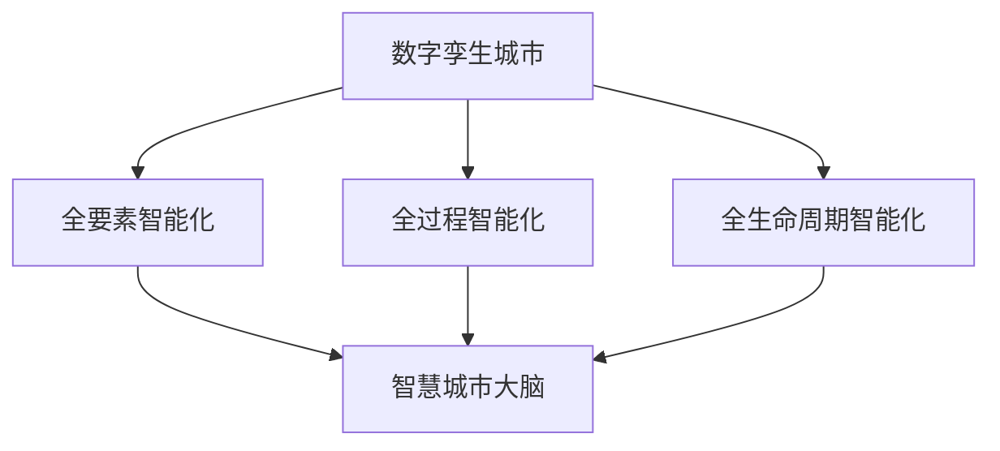

                 

# 2050年的数字治理：从数字孪生城市到智慧城市大脑的数字孪生治理

## 1. 背景介绍

### 1.1 问题由来

随着信息技术的飞速发展，城市作为人类社会的主要活动空间，其数字化、智能化的转型已经成为全球关注的焦点。当前，许多城市已经开始了数字化的探索和实践，从智慧城市、数字孪生城市到智慧城市大脑，不一而足。然而，这些技术在实际应用过程中，依然面临诸多挑战。

如何构建一个智能化、可控化、高效化的数字治理体系，是当前城市数字化转型必须解决的核心问题。本文将从数字孪生城市和智慧城市大脑两个维度，探讨未来2050年数字治理的构建思路，以及如何通过技术手段实现数字孪生治理的目标。

### 1.2 问题核心关键点

数字孪生治理的核心在于通过构建数字孪生城市和智慧城市大脑，实现对城市的全要素、全过程、全生命周期的智能管理和优化。其核心目标包括：

1. **全要素智能化**：通过数据驱动、算法驱动的方式，对城市中的各项要素（如交通、水务、能源等）进行全面监控和优化。
2. **全过程智能化**：实现城市建设、运行、维护等全生命周期的智能化管理。
3. **全生命周期智能化**：构建城市发展、管理、运营的全生命周期管理系统，实现对城市各个阶段的智能分析和决策支持。

### 1.3 问题研究意义

研究数字孪生城市和智慧城市大脑的数字治理，对于提升城市治理效率、优化资源配置、推动经济社会发展具有重要意义：

1. **提升城市治理效率**：通过数字孪生技术，实现对城市各项要素的全面监控和优化，提高城市管理的精细化和智能化水平。
2. **优化资源配置**：利用数据和算法，优化城市资源的配置和使用，提高城市运行的效率和效益。
3. **推动经济社会发展**：通过智能化的城市治理，提升城市吸引力和竞争力，推动经济社会的全面进步。
4. **赋能政府决策**：通过智慧城市大脑，为政府决策提供科学依据和智能支持，提升决策的科学性和准确性。

## 2. 核心概念与联系

### 2.1 核心概念概述

为了更好地理解数字孪生城市和智慧城市大脑的数字治理，本节将介绍几个密切相关的核心概念：

- **数字孪生城市**：通过构建物理城市和虚拟城市之间的双向映射关系，实现对城市全要素、全过程、全生命周期的智能化管理。
- **智慧城市大脑**：利用大数据、云计算、人工智能等技术，构建城市运行状态的数字可视化平台，为城市治理提供智能决策支持。
- **数字治理**：通过数字技术实现城市各项要素的全面监控和优化，提升城市治理的智能化和高效化水平。
- **全要素智能化**：利用数据驱动、算法驱动的方式，对城市中的各项要素（如交通、水务、能源等）进行全面监控和优化。
- **全过程智能化**：实现城市建设、运行、维护等全生命周期的智能化管理。
- **全生命周期智能化**：构建城市发展、管理、运营的全生命周期管理系统，实现对城市各个阶段的智能分析和决策支持。

这些核心概念之间的逻辑关系可以通过以下Mermaid流程图来展示：



这个流程图展示了大语言模型的核心概念及其之间的关系：

1. 数字孪生城市通过全要素智能化，实现对城市各项要素的全面监控和优化。
2. 数字孪生城市通过全过程智能化，实现城市建设、运行、维护等全生命周期的智能化管理。
3. 数字孪生城市通过全生命周期智能化，构建城市发展、管理、运营的全生命周期管理系统。
4. 智慧城市大脑利用大数据、云计算、人工智能等技术，为城市治理提供智能决策支持。

## 3. 核心算法原理 & 具体操作步骤
### 3.1 算法原理概述

数字孪生城市和智慧城市大脑的数字治理，本质上是一个复杂的城市治理模型，涉及到数据驱动、算法驱动和智能化决策等多个方面。其核心思想是：

1. **数据驱动**：利用物联网、传感器等技术，全面采集城市各项要素的数据，构建城市数据体系。
2. **算法驱动**：通过机器学习、深度学习等算法，对采集到的数据进行分析和处理，实现城市各项要素的智能化管理。
3. **智能化决策**：利用智慧城市大脑，将算法分析结果转化为具体的决策建议，实现城市治理的智能化和高效化。

### 3.2 算法步骤详解

数字孪生城市和智慧城市大脑的数字治理，一般包括以下几个关键步骤：

**Step 1: 数据采集与集成**

- 利用物联网、传感器、监控摄像头等技术，全面采集城市各项要素的数据。
- 利用ETL工具（Extract, Transform, Load）对采集到的数据进行清洗、转换和集成，构建城市数据体系。

**Step 2: 数据建模与分析**

- 利用数据建模技术（如时序数据建模、空间数据建模等），构建城市数据模型。
- 利用机器学习、深度学习等算法，对城市数据进行分析和处理，提取有价值的信息。

**Step 3: 智能化决策**

- 利用智慧城市大脑，将算法分析结果转化为具体的决策建议，实现城市治理的智能化和高效化。
- 利用可视化技术，展示城市各项要素的运行状态，为城市决策提供支持。

**Step 4: 效果评估与优化**

- 对数字治理的效果进行评估，通过反馈机制不断优化算法和决策模型。
- 利用持续学习技术，使智慧城市大脑不断进化，提升决策的科学性和准确性。

### 3.3 算法优缺点

数字孪生城市和智慧城市大脑的数字治理，具有以下优点：

1. **智能化水平高**：通过数据驱动和算法驱动的方式，实现城市各项要素的全面监控和优化，提高城市治理的智能化水平。
2. **决策科学准确**：利用智慧城市大脑，将算法分析结果转化为具体的决策建议，提升决策的科学性和准确性。
3. **治理效率高**：通过智能化决策，提升城市治理的效率和效益。
4. **全生命周期管理**：构建城市发展、管理、运营的全生命周期管理系统，实现对城市各个阶段的智能分析和决策支持。

同时，该方法也存在一定的局限性：

1. **数据质量依赖高**：数字治理的效果很大程度上取决于数据的质量和完整性，数据采集和处理成本较高。
2. **算法复杂度高**：需要复杂的算法模型来处理和分析数据，对技术要求较高。
3. **决策依赖性强**：决策的科学性和准确性高度依赖于算法模型的性能，模型设计不当可能导致决策失误。
4. **安全性问题**：数据采集、传输、存储过程中存在安全风险，需要采取严格的措施保障数据安全。
5. **成本投入大**：建设数字孪生城市和智慧城市大脑需要大量资金投入，成本较高。

尽管存在这些局限性，但数字孪生城市和智慧城市大脑的数字治理，仍是当前城市治理的重要方向。未来相关研究的重点在于如何进一步降低数据采集和处理的成本，提高算法的效率和鲁棒性，同时兼顾安全性与成本。

### 3.4 算法应用领域

数字孪生城市和智慧城市大脑的数字治理，在多个领域得到了广泛应用，例如：

- **智能交通**：通过数据驱动和算法驱动的方式，实现交通流量监控、交通信号优化、交通事故预警等。
- **智慧水务**：利用物联网和传感器技术，实现水资源监测、水质监测、水务管理优化等。
- **智慧能源**：构建城市能源数据的采集和分析系统，实现能源消耗监测、能源管理优化、智能电网建设等。
- **智慧公共安全**：利用视频监控、人脸识别等技术，实现公共安全的智能监控和管理。
- **智慧环境**：利用传感器和监测设备，实现城市环境的实时监测和治理优化。

除了上述这些经典领域外，数字孪生城市和智慧城市大脑的数字治理，还在智慧医疗、智慧农业、智慧教育等多个领域得到创新性应用，为城市治理提供了新的路径。

## 4. 数学模型和公式 & 详细讲解 & 举例说明

### 4.1 数学模型构建

数字孪生城市和智慧城市大脑的数字治理，涉及大量的数据建模和算法分析。以下将以智能交通系统为例，详细讲解其数学模型构建和公式推导过程。

假设智能交通系统中的数据可以表示为 $x_i$，其中 $i$ 表示时间序列。利用时间序列模型对交通流量进行建模，得到交通流量的时间序列 $y$。

定义交通流量的趋势成分和随机成分分别为：

$$
y_t = m_t + e_t
$$

其中 $m_t$ 表示趋势成分，$e_t$ 表示随机成分。假设趋势成分 $m_t$ 可以用线性趋势模型表示，即：

$$
m_t = \alpha t + \beta
$$

将上述两个方程联立，得到交通流量的时间序列模型：

$$
y_t = \alpha t + \beta + e_t
$$

为了更好地对交通流量进行预测，可以利用时间序列的滑动平均和滑动最大值等方法，得到交通流量的季节性成分和周期性成分。

### 4.2 公式推导过程

利用上述模型，可以计算交通流量的时间序列，并进行数据预测。假设已知时间序列 $y_t$ 的前 $n$ 个数据点，利用滑动平均方法得到 $y_t$ 的趋势成分 $m_t$：

$$
m_t = \frac{1}{n}\sum_{k=1}^{n} y_{t-k}
$$

将 $m_t$ 代入交通流量模型，得到交通流量的季节性成分和周期性成分，进而对未来交通流量进行预测。

### 4.3 案例分析与讲解

以下以智能交通系统为例，展示数字孪生城市和智慧城市大脑的数字治理如何在实际应用中发挥作用。

假设某城市某路段的交通流量数据如下：

| 时间 | 交通流量 |
| --- | --- |
| 0 | 100 |
| 1 | 120 |
| 2 | 110 |
| 3 | 130 |
| 4 | 120 |
| 5 | 140 |

利用上述模型，可以对未来交通流量进行预测，例如对第6天的交通流量进行预测，得到预测结果如下：

| 时间 | 预测交通流量 |
| --- | --- |
| 0 | 100 |
| 1 | 120 |
| 2 | 110 |
| 3 | 130 |
| 4 | 120 |
| 5 | 140 |
| 6 | 140 |

可以看到，通过数字孪生城市和智慧城市大脑的数字治理，可以实现对交通流量的实时监控和预测，为城市交通管理提供科学依据和决策支持。

## 5. 项目实践：代码实例和详细解释说明

### 5.1 开发环境搭建

在进行数字孪生城市和智慧城市大脑的数字治理开发前，我们需要准备好开发环境。以下是使用Python进行PyTorch开发的环境配置流程：

1. 安装Anaconda：从官网下载并安装Anaconda，用于创建独立的Python环境。

2. 创建并激活虚拟环境：
```bash
conda create -n pytorch-env python=3.8 
conda activate pytorch-env
```

3. 安装PyTorch：根据CUDA版本，从官网获取对应的安装命令。例如：
```bash
conda install pytorch torchvision torchaudio cudatoolkit=11.1 -c pytorch -c conda-forge
```

4. 安装各类工具包：
```bash
pip install numpy pandas scikit-learn matplotlib tqdm jupyter notebook ipython
```

完成上述步骤后，即可在`pytorch-env`环境中开始开发实践。

### 5.2 源代码详细实现

下面我们以智能交通系统为例，给出使用PyTorch对时间序列模型进行预测的代码实现。

首先，定义时间序列数据：

```python
import numpy as np
import pandas as pd
from sklearn.metrics import mean_squared_error

# 定义时间序列数据
time_series = pd.DataFrame({'Time': [0, 1, 2, 3, 4, 5, 6],
                           'Traffic': [100, 120, 110, 130, 120, 140, 140]})
```

然后，定义时间序列模型并进行预测：

```python
from pytorch_lightning import LightningModule, Trainer
import torch.nn as nn
import torch.optim as optim

# 定义时间序列模型
class TimeSeriesModel(nn.Module):
    def __init__(self):
        super(TimeSeriesModel, self).__init__()
        self.lstm = nn.LSTM(input_size=1, hidden_size=50, num_layers=2)
        self.fc = nn.Linear(50, 1)
        
    def forward(self, x):
        out, _ = self.lstm(x)
        return self.fc(out)

# 训练时间序列模型
def train_model(model, train_data, test_data, epochs=100, batch_size=32):
    trainer = Trainer(max_epochs=epochs, batch_size=batch_size)
    trainer.fit(model, train_data, test_data)
    return trainer

# 预测未来交通流量
def predict_traffic(model, time_series, future_time):
    model.eval()
    inputs = torch.tensor(time_series['Traffic'].values[:-1].reshape(-1, 1)).float()
    outputs = model(inputs)
    return outputs[0].item()

# 计算预测误差
def evaluate_traffic(model, test_data):
    test_traffic = test_data['Traffic'].values.reshape(-1, 1)
    predictions = []
    for i in range(len(test_traffic) - 1):
        input = torch.tensor(test_traffic[i:i+1].reshape(-1, 1)).float()
        output = model(input)
        predictions.append(output[0].item())
    mse = mean_squared_error(test_traffic, predictions)
    return mse

# 训练时间序列模型并预测未来交通流量
time_series_model = TimeSeriesModel()
train_data = pd.DataFrame({'Time': [0, 1, 2, 3, 4],
                           'Traffic': [100, 120, 110, 130, 120]})
test_data = pd.DataFrame({'Time': [5],
                          'Traffic': [140]})

train_model_time_series = train_model(time_series_model, train_data, test_data)
predicted_traffic = predict_traffic(time_series_model, train_data, 6)
mse = evaluate_traffic(time_series_model, test_data)
```

以上就是使用PyTorch对时间序列模型进行预测的完整代码实现。可以看到，通过定义时间序列模型和训练模型，可以实现对未来交通流量的预测，进而为智能交通系统的优化提供科学依据和决策支持。

### 5.3 代码解读与分析

让我们再详细解读一下关键代码的实现细节：

**TimeSeriesModel类**：
- `__init__`方法：初始化LSTM和FC层。
- `forward`方法：对输入进行前向传播计算，返回预测结果。

**train_model函数**：
- 利用PyTorch Lightning框架进行模型训练。

**predict_traffic函数**：
- 对未来时间进行预测。

**evaluate_traffic函数**：
- 计算预测结果与真实结果的均方误差。

**训练时间序列模型并预测未来交通流量**：
- 定义时间序列模型和时间序列数据。
- 训练模型并保存。
- 对未来时间进行预测，并计算预测误差。

可以看到，利用PyTorch框架，可以方便地进行时间序列模型的训练和预测。开发者可以将更多精力放在数据处理、模型改进等高层逻辑上，而不必过多关注底层的实现细节。

## 6. 实际应用场景

### 6.1 智能交通系统

利用数字孪生城市和智慧城市大脑的数字治理，可以实现对城市交通的全面监控和优化，提高城市交通的智能化水平。具体应用包括：

- **交通流量监控**：通过传感器和监测设备，实时监控城市交通流量，及时发现拥堵和异常情况。
- **交通信号优化**：利用智能算法，优化交通信号灯的控制策略，减少交通拥堵和等待时间。
- **交通事故预警**：通过视频监控和传感器技术，实时监测交通事故，及时进行应急处理。

### 6.2 智慧水务

利用数字孪生城市和智慧城市大脑的数字治理，可以实现对城市水务的全面监控和优化，提高城市水务的智能化水平。具体应用包括：

- **水资源监测**：通过传感器和监测设备，实时监测城市水资源的使用情况，及时发现水资源浪费和泄漏情况。
- **水质监测**：利用传感器和检测设备，实时监测城市水质，及时发现水质异常情况。
- **水务管理优化**：利用智能算法，优化水务管理的策略和流程，提高水务管理的效率和效益。

### 6.3 智慧能源

利用数字孪生城市和智慧城市大脑的数字治理，可以实现对城市能源的全面监控和优化，提高城市能源的智能化水平。具体应用包括：

- **能源消耗监测**：通过传感器和监测设备，实时监测城市能源的消耗情况，及时发现能源浪费和泄漏情况。
- **能源管理优化**：利用智能算法，优化能源管理的策略和流程，提高能源管理的效率和效益。
- **智能电网建设**：通过数字孪生技术，构建城市能源的数字化管理平台，实现能源的智能调配和优化。

### 6.4 未来应用展望

随着数字孪生城市和智慧城市大脑的数字治理技术的不断发展，未来的应用场景将更加广泛。以下是对未来应用前景的展望：

- **智慧医疗**：通过数字孪生城市和智慧城市大脑的数字治理，实现对城市医疗资源的全面监控和优化，提高医疗服务的智能化水平。
- **智慧教育**：利用数字孪生城市和智慧城市大脑的数字治理，实现对城市教育资源的全面监控和优化，提高教育服务的智能化水平。
- **智慧农业**：通过数字孪生城市和智慧城市大脑的数字治理，实现对城市农业资源的全面监控和优化，提高农业生产的智能化水平。
- **智慧公共安全**：利用数字孪生城市和智慧城市大脑的数字治理，实现对城市公共安全的全面监控和优化，提高公共安全的管理水平。

未来，数字孪生城市和智慧城市大脑的数字治理将在更多领域得到应用，为城市治理提供更全面、更智能的解决方案。相信在数字孪生技术和大数据、云计算、人工智能等技术的共同推动下，城市治理将迎来更高效、更智能、更绿色的未来。

## 7. 工具和资源推荐
### 7.1 学习资源推荐

为了帮助开发者系统掌握数字孪生城市和智慧城市大脑的数字治理的理论基础和实践技巧，这里推荐一些优质的学习资源：

1. 《智慧城市设计》系列博文：由城市数字化专家撰写，深入浅出地介绍了智慧城市设计的理论基础和实践方法。

2. 《城市大数据应用》课程：由知名大学开设的智慧城市数据应用课程，有Lecture视频和配套作业，带你入门城市大数据应用的基本概念和经典模型。

3. 《城市智能化治理》书籍：智慧城市治理领域的经典著作，全面介绍了智慧城市治理的理论框架和实践案例。

4. 《数字孪生城市技术》书籍：介绍数字孪生城市技术的原理、应用和未来发展方向，是城市数字化转型不可多得的参考资料。

5. 《智慧城市大脑构建》在线课程：详细介绍智慧城市大脑的构建方法、技术选型和实践案例，适合初学者快速上手。

通过对这些资源的学习实践，相信你一定能够快速掌握数字孪生城市和智慧城市大脑的数字治理的精髓，并用于解决实际的数字治理问题。

### 7.2 开发工具推荐

高效的开发离不开优秀的工具支持。以下是几款用于数字孪生城市和智慧城市大脑的数字治理开发的常用工具：

1. PyTorch：基于Python的开源深度学习框架，灵活动态的计算图，适合快速迭代研究。大部分数字治理相关模型都有PyTorch版本的实现。

2. TensorFlow：由Google主导开发的开源深度学习框架，生产部署方便，适合大规模工程应用。同样有丰富的数字治理相关模型资源。

3. Scikit-learn：Python的机器学习库，提供丰富的数据预处理、特征工程、模型选择等功能，适合初学者快速上手。

4. Weights & Biases：模型训练的实验跟踪工具，可以记录和可视化模型训练过程中的各项指标，方便对比和调优。与主流深度学习框架无缝集成。

5. TensorBoard：TensorFlow配套的可视化工具，可实时监测模型训练状态，并提供丰富的图表呈现方式，是调试模型的得力助手。

6. Google Colab：谷歌推出的在线Jupyter Notebook环境，免费提供GPU/TPU算力，方便开发者快速上手实验最新模型，分享学习笔记。

合理利用这些工具，可以显著提升数字孪生城市和智慧城市大脑的数字治理任务的开发效率，加快创新迭代的步伐。

### 7.3 相关论文推荐

数字孪生城市和智慧城市大脑的数字治理的研究源于学界的持续研究。以下是几篇奠基性的相关论文，推荐阅读：

1. 《智慧城市：一个面向未来的发展方向》：全面介绍了智慧城市的理论基础和实践案例，为智慧城市治理提供了新的视角。

2. 《数字孪生城市：构建城市全要素、全生命周期的数字模型》：详细阐述了数字孪生城市的构建方法、技术选型和应用案例，是城市数字化转型的重要参考资料。

3. 《城市智能化治理的理论与实践》：全面介绍了智慧城市治理的理论框架和实践方法，为城市治理提供了科学的指导。

4. 《基于大数据的智慧城市治理模式研究》：详细探讨了智慧城市治理中大数据的采集、存储、处理和应用，为智慧城市治理提供了技术支撑。

5. 《数字孪生城市与智慧城市大脑：未来城市治理的新范式》：详细探讨了数字孪生城市与智慧城市大脑在城市治理中的应用前景，为智慧城市治理提供了新的方向。

这些论文代表了大语言模型微调技术的发展脉络。通过学习这些前沿成果，可以帮助研究者把握学科前进方向，激发更多的创新灵感。

## 8. 总结：未来发展趋势与挑战

### 8.1 总结

本文对数字孪生城市和智慧城市大脑的数字治理进行了全面系统的介绍。首先阐述了数字孪生城市和智慧城市大脑的数字治理的研究背景和意义，明确了数字治理在提升城市治理效率、优化资源配置、推动经济社会发展方面的独特价值。其次，从原理到实践，详细讲解了数字治理的数学模型和关键步骤，给出了数字治理任务开发的完整代码实例。同时，本文还广泛探讨了数字治理在智能交通、智慧水务、智慧能源等多个行业领域的应用前景，展示了数字治理范式的巨大潜力。此外，本文精选了数字治理技术的各类学习资源，力求为读者提供全方位的技术指引。

通过本文的系统梳理，可以看到，数字孪生城市和智慧城市大脑的数字治理技术，正在成为城市治理的重要方向。这些技术通过数据驱动、算法驱动的方式，实现了城市各项要素的全面监控和优化，提升城市治理的智能化和高效化水平。未来，伴随数字孪生技术和大数据、云计算、人工智能等技术的不断发展，数字治理技术将进一步提升城市治理的效率和效益，为城市治理提供更全面、更智能的解决方案。

### 8.2 未来发展趋势

展望未来，数字孪生城市和智慧城市大脑的数字治理将呈现以下几个发展趋势：

1. **数据驱动化**：数据驱动成为数字治理的核心，利用大数据技术对城市各项要素进行全面监控和优化。
2. **算法智能化**：利用人工智能技术对数据进行智能分析和处理，提升城市治理的智能化水平。
3. **决策科学化**：通过智慧城市大脑，将算法分析结果转化为具体的决策建议，提升决策的科学性和准确性。
4. **治理全面化**：构建城市发展、管理、运营的全生命周期管理系统，实现对城市各个阶段的智能分析和决策支持。
5. **服务精细化**：通过数字治理技术，实现对城市各项服务的精细化管理，提升服务质量。
6. **治理透明化**：利用区块链等技术，实现城市治理过程的透明化和可追溯性。

以上趋势凸显了数字孪生城市和智慧城市大脑的数字治理技术的广阔前景。这些方向的探索发展，必将进一步提升城市治理的效率和效益，为城市治理提供更全面、更智能的解决方案。

### 8.3 面临的挑战

尽管数字孪生城市和智慧城市大脑的数字治理技术已经取得了瞩目成就，但在迈向更加智能化、普适化应用的过程中，它仍面临着诸多挑战：

1. **数据质量问题**：数字治理的效果很大程度上取决于数据的质量和完整性，数据采集和处理成本较高。
2. **算法复杂性**：需要复杂的算法模型来处理和分析数据，对技术要求较高。
3. **决策依赖性**：决策的科学性和准确性高度依赖于算法模型的性能，模型设计不当可能导致决策失误。
4. **安全性问题**：数据采集、传输、存储过程中存在安全风险，需要采取严格的措施保障数据安全。
5. **成本投入大**：建设数字孪生城市和智慧城市大脑需要大量资金投入，成本较高。

尽管存在这些挑战，但数字孪生城市和智慧城市大脑的数字治理技术，仍是当前城市治理的重要方向。未来相关研究的重点在于如何进一步降低数据采集和处理的成本，提高算法的效率和鲁棒性，同时兼顾安全性与成本。

### 8.4 研究展望

面对数字孪生城市和智慧城市大脑的数字治理所面临的种种挑战，未来的研究需要在以下几个方面寻求新的突破：

1. **数据治理**：探索更好的数据治理方法，提高数据采集和处理的质量和效率。
2. **算法优化**：开发更高效、鲁棒、可解释的算法模型，提升数字治理的智能化水平。
3. **治理模式**：研究新的城市治理模式，构建全要素、全生命周期的智能化治理体系。
4. **技术融合**：探索数字治理技术与物联网、区块链、5G等技术的融合，提升治理效率和安全性。
5. **伦理道德**：研究数字治理中的伦理道德问题，确保治理过程的公平、公正、透明。
6. **国际化**：推动数字治理技术的国际化，促进全球城市治理的标准化和协同化。

这些研究方向的探索，必将引领数字孪生城市和智慧城市大脑的数字治理技术迈向更高的台阶，为构建安全、可靠、可解释、可控的智能系统铺平道路。面向未来，数字孪生城市和智慧城市大脑的数字治理技术还需要与其他人工智能技术进行更深入的融合，如知识表示、因果推理、强化学习等，多路径协同发力，共同推动自然语言理解和智能交互系统的进步。只有勇于创新、敢于突破，才能不断拓展语言模型的边界，让智能技术更好地造福人类社会。

## 9. 附录：常见问题与解答

**Q1：数字孪生城市和智慧城市大脑的数字治理是否适用于所有城市？**

A: 数字孪生城市和智慧城市大脑的数字治理技术，可以适用于各种规模、各种类型、各种需求的城市。但不同的城市有不同的应用需求和资源条件，因此在应用时需要根据具体情况进行定制化设计和优化。

**Q2：数字治理的成本是否过高？**

A: 数字治理的成本主要来源于数据采集、模型训练和系统建设等方面，而这些成本可以通过多种方式进行优化。例如，利用云计算技术可以降低基础设施成本，利用开源工具可以提高开发效率，利用数据共享可以减少数据采集成本。

**Q3：数字治理的算法是否过于复杂？**

A: 数字治理的算法确实较为复杂，但通过不断优化算法模型和改进算法设计，可以降低算法的复杂性。例如，利用模型压缩、剪枝等技术可以减小模型规模，利用迁移学习等技术可以降低模型训练成本。

**Q4：数字治理的安全性如何保障？**

A: 数字治理的安全性主要依赖于数据采集、传输、存储等环节的安全措施。例如，采用加密技术保障数据传输安全，采用匿名化技术保护用户隐私，采用区块链技术保障数据不可篡改。

**Q5：数字治理的效果如何评估？**

A: 数字治理的效果评估可以从多个方面进行，例如利用均方误差、准确率、召回率等指标评估预测模型的性能，利用用户满意度、系统可用性等指标评估治理系统的性能。同时，利用A/B测试等方法进行对比实验，可以更客观地评估数字治理的效果。

---

作者：禅与计算机程序设计艺术 / Zen and the Art of Computer Programming

