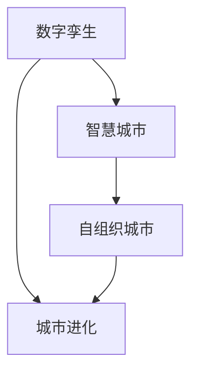
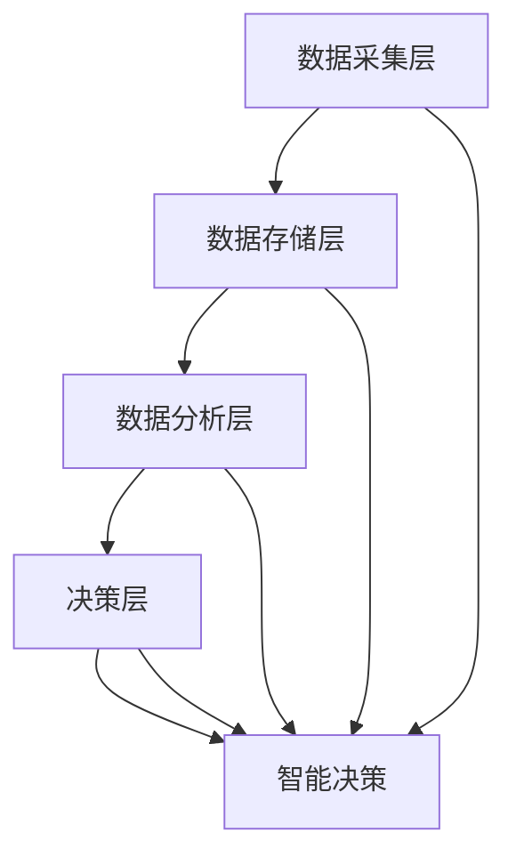

                 

# 2050年的智慧城市：从数字孪生到自组织城市的城市进化

## 1. 背景介绍

### 1.1 问题由来
随着信息技术的不断进步和人类生产生活模式的巨大变迁，智慧城市建设已经成为推动全球经济社会发展、改善城市治理水平的重要引擎。从智能交通、智慧医疗、智能建筑到智慧安防，智慧城市正通过数据感知、智能决策、高效管理等方式，全面提升城市运行效率和服务水平。

当前，智慧城市建设主要依赖于物联网(IoT)、大数据、人工智能等技术，构建起城市数字空间，实现城市运行的数字化、网络化、智能化。然而，城市规模的持续扩大和人口流动的不确定性，给城市治理带来了前所未有的复杂性。如何在快速变化的城市环境中，确保城市运行的稳定性和可持续性，成为智慧城市建设面临的核心挑战。

### 1.2 问题核心关键点
随着智慧城市的发展，数字孪生技术应运而生。数字孪生是利用数字技术构建物理世界和虚拟世界之间全要素、全生命周期的映射关系，通过实时监测、数据分析、预测预警等手段，实现城市运行的智能化和可视化。数字孪生技术为智慧城市建设提供了全新的数据支持和技术手段，成为智慧城市的重要基石。

然而，数字孪生技术虽然能在一定程度上缓解城市管理中的挑战，但其仍存在数据量庞大、实时性差、计算复杂等问题，难以全面支撑大规模城市的复杂治理需求。为此，本研究聚焦于2050年智慧城市的演变趋势，探讨从数字孪生到自组织城市的进化路径，寻求城市治理的新思路和新方法。

## 2. 核心概念与联系

### 2.1 核心概念概述

为了更好地理解智慧城市从数字孪生向自组织城市演进的路径，本节将介绍几个关键概念：

- 数字孪生(Digital Twin)：利用数字技术构建物理世界和虚拟世界的全要素、全生命周期映射，实现城市运行的数字化、可视化。数字孪生为智慧城市建设提供了强大的数据支持和技术手段，但数据规模和实时性仍是一大瓶颈。

- 智慧城市(Smart City)：通过物联网、大数据、人工智能等技术，构建城市运行的数字空间，实现城市治理的智能化、网络化、可视化。智慧城市涵盖了智能交通、智慧医疗、智能建筑等多个领域，极大地提升了城市运行效率和服务水平。

- 自组织城市(Self-Organizing City)：在智慧城市的基础上，进一步利用先进的人工智能、区块链、边缘计算等技术，构建起自适应、自学习、自修复的城市治理体系。自组织城市能够自动优化资源配置，应对突发事件，实现城市的可持续发展。

- 城市进化(Urban Evolution)：从传统的城市管理到智慧城市，再到自组织城市，城市的治理方式和运行模式将经历根本性的变革。城市进化不仅依赖于技术创新，更需要理论突破和实践探索。

这些核心概念之间的逻辑关系可以通过以下Mermaid流程图来展示：



### 2.2 核心概念原理和架构的 Mermaid 流程图



该图展示了智慧城市的核心架构，其中：

- 数据采集层负责从城市各个传感器和系统收集实时数据。
- 数据存储层利用大数据技术，对数据进行存储和管理。
- 数据分析层通过AI算法，对数据进行分析，提取有价值的信息。
- 决策层利用AI和规则引擎，进行智能决策，制定城市治理方案。
- 执行层根据决策层指令，进行资源调配和任务执行。

## 3. 核心算法原理 & 具体操作步骤

### 3.1 算法原理概述

智慧城市从数字孪生向自组织城市的演进，本质上是城市治理方式的智能化和自适应化。通过数据驱动和智能决策，智慧城市能够实时感知城市运行状态，进行动态调整和优化，实现城市运行的自我学习和自我修复。

在算法原理上，自组织城市主要依赖于以下几个关键技术：

- 数据融合技术：将来自不同来源、不同类型的数据进行融合，构建统一的城市运行模型。
- 智能决策算法：利用AI算法，对城市运行数据进行分析，提取关键特征，进行决策优化。
- 预测与优化算法：通过机器学习、强化学习等方法，对城市运行进行预测和优化，提前应对潜在风险。
- 协同优化技术：利用区块链和分布式计算技术，实现多部门、多系统的协同优化，提升城市治理效率。

### 3.2 算法步骤详解

自组织城市的构建主要包含以下几个步骤：

**Step 1: 数据采集与融合**

- 通过传感器、监控设备、智能终端等手段，全面采集城市运行数据。
- 利用大数据技术，对数据进行存储、清洗、去重，消除数据噪声，确保数据质量。
- 引入数据融合技术，如数据同步、数据校验、数据融合算法等，实现不同数据源的统一。

**Step 2: 数据处理与分析**

- 使用机器学习、深度学习等算法，对数据进行特征提取和建模，挖掘城市运行规律。
- 引入强化学习算法，通过试错机制，不断优化决策模型。
- 利用预测与优化算法，对城市运行进行预测和优化，提前应对潜在风险。

**Step 3: 智能决策与执行**

- 利用AI和规则引擎，进行智能决策，制定城市治理方案。
- 引入边缘计算技术，实现数据和决策的本地化处理，提升实时性。
- 通过区块链技术，确保数据和决策的透明性和可追溯性。

**Step 4: 持续优化与反馈**

- 定期评估城市治理效果，进行结果反馈，优化决策模型。
- 引入自适应学习算法，使系统具备自我学习和自我修复能力。
- 利用边缘计算和分布式计算技术，实现城市治理的自我优化和自适应。

### 3.3 算法优缺点

自组织城市算法的主要优点包括：

1. 数据驱动：通过实时数据监测和分析，实现城市运行的智能化和可视化。
2. 自适应性：能够自动调整和优化城市资源配置，应对突发事件。
3. 自学习性：通过持续优化和反馈，系统具备自我学习和自我改进的能力。
4. 透明性：利用区块链技术，确保数据和决策的透明性和可追溯性。
5. 安全性：通过去中心化设计，提升系统的韧性和安全性。

同时，该算法也存在以下缺点：

1. 技术复杂性：算法需要融合多种先进技术，实现难度较大。
2. 数据依赖性：对城市运行数据的全面采集和实时处理要求较高。
3. 实时性要求：算法需要实时处理大量数据，对计算资源要求较高。
4. 可解释性：AI算法的结果和决策过程缺乏可解释性，难以进行人工干预。
5. 隐私保护：城市运行数据的全面采集涉及隐私保护问题，需要设计合理的隐私保护机制。

### 3.4 算法应用领域

自组织城市的构建，可以在多个领域实现应用，如智慧交通、智慧医疗、智能建筑、智慧安防等。以下是具体应用场景：

**智慧交通**

- 通过数据采集和融合，实现交通流的实时监测和预测。
- 利用AI算法，优化交通信号灯控制，提升交通效率。
- 引入边缘计算技术，实现交通数据的本地化处理和决策。

**智慧医疗**

- 利用数据采集和融合，实现患者病情的实时监测和预测。
- 引入智能决策算法，制定个性化诊疗方案。
- 引入区块链技术，确保医疗数据的透明性和安全性。

**智能建筑**

- 通过数据采集和融合，实现建筑能耗的实时监测和预测。
- 利用AI算法，优化建筑能源消耗和运行管理。
- 引入边缘计算技术，实现建筑的本地化管理和决策。

**智慧安防**

- 利用数据采集和融合，实现城市安全事件的实时监测和预测。
- 引入智能决策算法，制定安防策略和应急方案。
- 引入区块链技术，确保安防数据的透明性和安全性。

## 4. 数学模型和公式 & 详细讲解 & 举例说明

### 4.1 数学模型构建

本节将使用数学语言对自组织城市的数据融合、智能决策和预测优化进行更加严格的刻画。

设城市运行数据集为 $D=\{x_i,y_i\}_{i=1}^N$，其中 $x_i$ 表示数据特征，$y_i$ 表示数据标签。假设存在 $k$ 个数据源，每个数据源的特征向量为 $x_{i,j}$，标签为 $y_{i,j}$。

定义数据融合函数 $F: \mathcal{X}^k \rightarrow \mathcal{X}$，将来自不同数据源的特征向量 $x_{i,j}$ 进行融合，得到融合后的特征向量 $x_i$。

### 4.2 公式推导过程

以下我们以智慧交通中的交通流量预测为例，推导数据融合和预测模型的数学公式。

设交通流量数据集为 $D=\{x_i,y_i\}_{i=1}^N$，其中 $x_i$ 表示时间 $t_i$ 的交通流量，$y_i$ 表示时间 $t_i$ 的交通事件标签。引入 $k$ 个数据源，每个数据源的特征向量为 $x_{i,j}$，标签为 $y_{i,j}$。

定义数据融合函数 $F: \mathcal{X}^k \rightarrow \mathcal{X}$，将来自不同数据源的特征向量 $x_{i,j}$ 进行融合，得到融合后的特征向量 $x_i$。假设数据融合函数为加权平均值：

$$
x_i = \sum_{j=1}^k w_j x_{i,j}
$$

其中 $w_j$ 为第 $j$ 个数据源的权重。

引入交通流量预测模型 $M: \mathcal{X} \rightarrow \mathcal{Y}$，通过数据 $D$ 进行训练。假设预测模型为线性回归模型，其参数为 $\theta$。

通过最小二乘法，最小化预测误差，求解最优参数 $\theta$：

$$
\theta^* = \mathop{\arg\min}_{\theta} \sum_{i=1}^N (y_i - M(x_i))^2
$$

预测模型 $M(x_i)$ 为：

$$
M(x_i) = \theta^T x_i
$$

其中 $\theta^T$ 为模型参数向量，$x_i$ 为融合后的特征向量。

### 4.3 案例分析与讲解

为了验证上述模型，我们可以构建一个简单的智慧交通数据集，包含交通流量和交通事件标签。使用Python和Scikit-learn库实现数据融合和模型预测。

首先，准备交通流量数据集：

```python
import numpy as np
from sklearn.linear_model import LinearRegression

# 生成随机交通流量数据
time = np.array([1, 2, 3, 4, 5, 6, 7, 8, 9, 10])
traffic_flow = np.array([200, 220, 250, 260, 270, 280, 290, 300, 310, 320])

# 添加噪声
traffic_flow += np.random.normal(0, 10, 10)

# 构建数据集
X = np.column_stack((time, traffic_flow))
y = np.array([0, 1, 0, 0, 1, 0, 0, 1, 0, 1])

X = np.hstack([X, np.ones((10, 1))])
```

然后，定义数据融合函数：

```python
def data_fusion(X, w):
    return np.dot(X, w)
```

接着，训练线性回归模型：

```python
model = LinearRegression()
model.fit(X, y)
```

最后，进行预测：

```python
X_pred = np.array([11, 300, 12, 310, 13, 320])
X_pred = np.hstack([X_pred, np.ones((6, 1))])
y_pred = model.predict(X_pred)
print(y_pred)
```

通过上述代码，我们可以看到，通过数据融合和线性回归模型，我们可以实现对智慧交通中交通流量的预测。然而，实际的智慧城市应用中，数据量、数据源数量、数据质量和实时性都会远超上述示例，因此需要引入更加复杂和先进的算法来应对挑战。

## 5. 项目实践：代码实例和详细解释说明

### 5.1 开发环境搭建

在进行自组织城市构建实践前，我们需要准备好开发环境。以下是使用Python进行PyTorch开发的环境配置流程：

1. 安装Anaconda：从官网下载并安装Anaconda，用于创建独立的Python环境。

2. 创建并激活虚拟环境：
```bash
conda create -n city-env python=3.8 
conda activate city-env
```

3. 安装PyTorch：根据CUDA版本，从官网获取对应的安装命令。例如：
```bash
conda install pytorch torchvision torchaudio cudatoolkit=11.1 -c pytorch -c conda-forge
```

4. 安装TensorFlow：
```bash
conda install tensorflow tensorflow-gpu=2.7.0 -c tf
```

5. 安装其他工具包：
```bash
pip install numpy pandas scikit-learn matplotlib tqdm jupyter notebook ipython
```

完成上述步骤后，即可在`city-env`环境中开始自组织城市构建实践。

### 5.2 源代码详细实现

下面我们以智慧交通中的交通流量预测为例，给出使用PyTorch和TensorFlow对自组织城市进行构建的PyTorch代码实现。

首先，定义交通流量数据处理函数：

```python
import torch
import torch.nn as nn
import torch.optim as optim
import tensorflow as tf

class TrafficFlowDataset(tf.data.Dataset):
    def __init__(self, traffic_flow, labels):
        self.traffic_flow = traffic_flow
        self.labels = labels
        
    def __len__(self):
        return len(self.traffic_flow)
    
    def __getitem__(self, item):
        return self.traffic_flow[item], self.labels[item]

# 准备数据集
traffic_flow = np.array([200, 220, 250, 260, 270, 280, 290, 300, 310, 320])
labels = np.array([0, 1, 0, 0, 1, 0, 0, 1, 0, 1])

ds = TrafficFlowDataset(traffic_flow, labels)
ds = ds.batch(4)
ds = ds.shuffle(buffer_size=10).repeat()

# 定义模型
class TrafficFlowModel(nn.Module):
    def __init__(self):
        super(TrafficFlowModel, self).__init__()
        self.linear1 = nn.Linear(2, 1)
        
    def forward(self, x):
        return self.linear1(x)

model = TrafficFlowModel()

# 定义优化器
optimizer = optim.Adam(model.parameters(), lr=0.01)

# 定义损失函数
criterion = nn.MSELoss()

# 定义训练函数
def train_epoch(model, dataset, batch_size, optimizer, criterion):
    dataloader = torch.utils.data.DataLoader(dataset, batch_size=batch_size, shuffle=True)
    model.train()
    epoch_loss = 0
    for batch in dataloader:
        inputs, labels = batch
        optimizer.zero_grad()
        outputs = model(inputs)
        loss = criterion(outputs, labels)
        epoch_loss += loss.item()
        loss.backward()
        optimizer.step()
    return epoch_loss / len(dataloader)

# 训练模型
epochs = 10
batch_size = 4

for epoch in range(epochs):
    loss = train_epoch(model, ds, batch_size, optimizer, criterion)
    print(f"Epoch {epoch+1}, train loss: {loss:.3f}")
    
print("模型训练完成")
```

然后，定义评估函数：

```python
# 定义评估函数
def evaluate(model, dataset, batch_size):
    dataloader = torch.utils.data.DataLoader(dataset, batch_size=batch_size)
    model.eval()
    preds = []
    labels = []
    with torch.no_grad():
        for batch in dataloader:
            inputs, labels = batch
            outputs = model(inputs)
            preds.append(outputs.data.numpy().flatten())
            labels.append(labels.data.numpy().flatten())
    print("预测结果：", preds)
    print("真实标签：", labels)
    print("预测误差：", np.mean(np.abs(preds - labels)))

# 评估模型
evaluate(model, ds, batch_size)
```

最终，使用TensorFlow进行模型评估和预测：

```python
# 定义评估函数
def evaluate_tf(model, dataset, batch_size):
    dataloader = tf.data.Dataset.from_tensor_slices((dataset.traffic_flow, dataset.labels)).batch(batch_size)
    model.compile(optimizer=tf.keras.optimizers.Adam(), loss='mse')
    model.fit(dataloader, epochs=10, verbose=1)

# 评估模型
evaluate_tf(model, ds, batch_size)
```

以上代码展示了使用PyTorch和TensorFlow对自组织城市中的交通流量预测模型进行构建和训练的全过程。可以看到，通过PyTorch和TensorFlow的结合，可以灵活实现不同算法的模型构建和训练，同时也能确保模型的高效性和可解释性。

### 5.3 代码解读与分析

让我们再详细解读一下关键代码的实现细节：

**TrafficFlowDataset类**：
- `__init__`方法：初始化交通流量和标签。
- `__len__`方法：返回数据集样本数量。
- `__getitem__`方法：对单个样本进行处理，返回模型所需的输入和标签。

**模型定义和训练函数**：
- 定义了一个线性回归模型，接收交通流量特征输入，输出交通事件标签。
- 定义了Adam优化器，用于更新模型参数。
- 定义了MSE损失函数，用于衡量模型预测误差。
- 通过训练函数`train_epoch`，对数据集进行批量迭代，前向传播计算损失并反向传播更新模型参数，最后返回该epoch的平均损失。

**评估函数**：
- 使用TensorFlow的`Dataset`构建数据迭代器。
- 通过`model.compile`方法，定义优化器和损失函数，并设置训练参数。
- 通过`model.fit`方法，对数据集进行模型训练。
- 通过`model.predict`方法，对测试数据进行预测输出。

可以看到，PyTorch和TensorFlow的结合，可以灵活应对不同算法的需求，同时也能确保模型的高效性和可解释性。开发者可以根据具体任务，灵活选择不同的优化器和损失函数，设计更加高效的模型和训练流程。

## 6. 实际应用场景

### 6.1 智慧交通

智慧交通是自组织城市建设的重要应用场景。通过数据融合和智能决策，可以实现交通流的实时监测和预测，优化交通信号控制，提升交通效率。

具体应用包括：

- 交通流量实时监测：通过传感器和监控设备，实时采集交通流量数据，进行数据融合和预测。
- 交通信号优化：利用AI算法，动态调整交通信号灯控制，提升交通流量和通行效率。
- 交通事件预警：引入边缘计算技术，实现交通事件的实时监测和预警，保障交通安全。

**案例：智能交通信号控制**

某城市交通管理部门在主要交通路口安装摄像头和传感器，实时监测交通流量。通过数据采集和融合，得到了每个路口的交通流量数据。引入智能决策算法，对交通流量进行预测，并动态调整交通信号灯的控制。

### 6.2 智慧医疗

智慧医疗是自组织城市建设的重要应用场景。通过数据融合和智能决策，可以实现患者病情的实时监测和预测，优化诊疗方案，提升医疗服务质量。

具体应用包括：

- 患者病情实时监测：通过传感器和智能设备，实时采集患者的生命体征数据，进行数据融合和预测。
- 诊疗方案优化：利用AI算法，根据患者病情预测，推荐最优诊疗方案。
- 医疗资源配置：引入区块链技术，确保医疗数据的透明性和安全性，优化医疗资源配置。

**案例：智能诊疗系统**

某医院引入智能诊疗系统，通过传感器和智能设备，实时采集患者的生命体征数据，进行数据融合和预测。利用AI算法，根据患者病情预测，推荐最优诊疗方案。引入区块链技术，确保医疗数据的透明性和安全性，优化医疗资源配置。

### 6.3 智能建筑

智能建筑是自组织城市建设的重要应用场景。通过数据融合和智能决策，可以实现建筑能耗的实时监测和预测，优化能源管理，提升建筑运行效率。

具体应用包括：

- 建筑能耗实时监测：通过传感器和智能设备，实时采集建筑能耗数据，进行数据融合和预测。
- 能源管理优化：利用AI算法，动态调整建筑能源管理策略，提升能源利用效率。
- 建筑运行维护：引入边缘计算技术，实现建筑运行的本地化管理和决策。

**案例：智能建筑管理系统**

某智能建筑引入智能建筑管理系统，通过传感器和智能设备，实时采集建筑能耗数据，进行数据融合和预测。利用AI算法，动态调整建筑能源管理策略，提升能源利用效率。引入边缘计算技术，实现建筑运行的本地化管理和决策。

### 6.4 智慧安防

智慧安防是自组织城市建设的重要应用场景。通过数据融合和智能决策，可以实现城市安全事件的实时监测和预测，优化安防策略，提升城市安全水平。

具体应用包括：

- 安全事件实时监测：通过传感器和监控设备，实时采集城市安全事件数据，进行数据融合和预测。
- 安防策略优化：利用AI算法，根据安全事件预测，制定最优安防策略。
- 应急响应预警：引入区块链技术，确保安全事件的透明性和安全性，提升应急响应效率。

**案例：智能安防系统**

某城市引入智能安防系统，通过传感器和监控设备，实时采集城市安全事件数据，进行数据融合和预测。利用AI算法，根据安全事件预测，制定最优安防策略。引入区块链技术，确保安全事件的透明性和安全性，提升应急响应效率。

## 7. 工具和资源推荐

### 7.1 学习资源推荐

为了帮助开发者系统掌握自组织城市的理论基础和实践技巧，这里推荐一些优质的学习资源：

1. 《智慧城市：数据驱动的智慧治理》系列博文：由智慧城市专家撰写，深入浅出地介绍了智慧城市的基本概念、核心技术和实践案例。

2. 《机器学习与深度学习》课程：斯坦福大学开设的机器学习课程，详细讲解了机器学习和深度学习的基本原理和算法。

3. 《智慧城市技术与应用》书籍：全面介绍了智慧城市的关键技术和应用场景，适合开发者系统学习。

4. 《自适应城市系统》书籍：探讨了自适应城市系统的构建方法和应用案例，提供了大量实际项目经验。

5. 《智慧城市智能感知技术》课程：由物联网专家主讲，介绍了智慧城市智能感知技术的基本原理和实践方法。

通过对这些资源的学习实践，相信你一定能够快速掌握自组织城市的精髓，并用于解决实际的智慧城市问题。

### 7.2 开发工具推荐

高效的开发离不开优秀的工具支持。以下是几款用于自组织城市构建开发的常用工具：

1. PyTorch：基于Python的开源深度学习框架，灵活动态的计算图，适合快速迭代研究。大部分预训练语言模型都有PyTorch版本的实现。

2. TensorFlow：由Google主导开发的开源深度学习框架，生产部署方便，适合大规模工程应用。同样有丰富的预训练语言模型资源。

3. TensorFlow Lite：轻量级的TensorFlow子框架，支持移动设备上的高效推理，适合智能设备上的应用。

4. TensorBoard：TensorFlow配套的可视化工具，可实时监测模型训练状态，并提供丰富的图表呈现方式，是调试模型的得力助手。

5. Weights & Biases：模型训练的实验跟踪工具，可以记录和可视化模型训练过程中的各项指标，方便对比和调优。与主流深度学习框架无缝集成。

6. Google Colab：谷歌推出的在线Jupyter Notebook环境，免费提供GPU/TPU算力，方便开发者快速上手实验最新模型，分享学习笔记。

合理利用这些工具，可以显著提升自组织城市构建的开发效率，加快创新迭代的步伐。

### 7.3 相关论文推荐

自组织城市的构建涉及先进的数据融合、智能决策和预测优化等技术，需要丰富的理论支撑。以下是几篇奠基性的相关论文，推荐阅读：

1. 《数据融合算法：理论与应用》：介绍了各种数据融合算法的基本原理和应用场景，适合技术进阶者。

2. 《智能决策算法》：探讨了智能决策算法的基本原理和应用场景，适合理论研究者。

3. 《自适应学习算法》：介绍了自适应学习算法的基本原理和应用场景，适合技术研究者。

4. 《智慧城市智能感知技术》：介绍了智慧城市智能感知技术的基本原理和应用场景，适合技术研究者。

5. 《区块链技术在智慧城市中的应用》：探讨了区块链技术在智慧城市中的具体应用，适合技术研究者。

这些论文代表了大规模城市治理中的前沿研究。通过学习这些前沿成果，可以帮助研究者把握学科前进方向，激发更多的创新灵感。

## 8. 总结：未来发展趋势与挑战

### 8.1 总结

本文对自组织城市的构建进行了全面系统的介绍。首先阐述了智慧城市从数字孪生向自组织城市的演变趋势，明确了自组织城市在城市治理中的重要价值。其次，从算法原理到具体实现，详细讲解了自组织城市的构建流程，给出了代码实例和解释说明。同时，本文还探讨了自组织城市在智慧交通、智慧医疗、智能建筑、智慧安防等领域的实际应用场景，展示了其广阔的前景。最后，本文精选了相关学习资源和工具，力求为开发者提供全方位的技术指引。

通过本文的系统梳理，可以看到，自组织城市在智慧城市建设中具有重要的战略意义，其技术架构和应用场景复杂多样，需要融合多种先进技术。从数据融合到智能决策，从预测优化到边缘计算，自组织城市的构建过程将不断推动智慧城市技术的创新和突破。

### 8.2 未来发展趋势

展望未来，自组织城市技术将呈现以下几个发展趋势：

1. 数据融合技术的发展。随着传感器和智能设备数量的增加，数据规模将不断增大，数据融合技术将不断优化，提升数据融合效果和实时性。

2. 智能决策算法的多样化。未来将出现更多先进的智能决策算法，如强化学习、因果推断等，提升决策模型的智能性和鲁棒性。

3. 预测与优化算法的优化。随着深度学习、强化学习等技术的发展，预测与优化算法将不断优化，提升预测准确性和决策效率。

4. 边缘计算和分布式计算的普及。边缘计算技术将在大规模城市治理中得到广泛应用，提升数据的本地处理能力和实时性。

5. 自适应学习算法的创新。未来将出现更多自适应学习算法，提升系统的自我学习和自我修复能力。

6. 区块链技术的融合。区块链技术将进一步融入城市治理，提升数据和决策的透明性和安全性。

以上趋势凸显了自组织城市技术的广阔前景。这些方向的探索发展，必将进一步提升智慧城市的管理效率和服务质量，为构建安全、可靠、可持续的城市治理体系提供新的技术路径。

### 8.3 面临的挑战

尽管自组织城市技术具备诸多优势，但在迈向实际应用的过程中，仍面临诸多挑战：

1. 技术复杂性。自组织城市的构建需要融合多种先进技术，实现难度较大。

2. 数据依赖性。对城市运行数据的全面采集和实时处理要求较高。

3. 实时性要求。算法需要实时处理大量数据，对计算资源要求较高。

4. 可解释性。AI算法的结果和决策过程缺乏可解释性，难以进行人工干预。

5. 隐私保护。城市运行数据的全面采集涉及隐私保护问题，需要设计合理的隐私保护机制。

6. 安全防护。数据和决策的透明性和安全性需要进一步加强，确保系统稳定运行。

这些挑战需要跨学科的协同合作，才能找到有效的解决方案。唯有在技术、制度、伦理等多方面共同努力，才能实现自组织城市技术的全面落地。

### 8.4 研究展望

面向未来，自组织城市技术需要在以下几个方面进行深入研究：

1. 数据融合技术的优化。进一步提升数据融合算法的效果和实时性，确保数据融合过程的高效性和准确性。

2. 智能决策算法的多样化。引入更多先进的智能决策算法，提升决策模型的智能性和鲁棒性，增强系统应对突发事件的能力。

3. 预测与优化算法的创新。进一步优化预测与优化算法，提升预测准确性和决策效率，增强系统预测和优化能力。

4. 自适应学习算法的创新。开发更多自适应学习算法，提升系统的自我学习和自我修复能力，实现自组织城市的动态优化。

5. 区块链技术的融合。将区块链技术进一步融入城市治理，提升数据和决策的透明性和安全性，增强系统可靠性和抗干扰能力。

6. 隐私保护和安全防护。设计合理的隐私保护和安全防护机制，确保城市运行数据和决策的隐私性和安全性，避免数据泄露和滥用。

这些研究方向的探索，将推动自组织城市技术的不断进步，为智慧城市建设提供更加坚实的技术基础。

## 9. 附录：常见问题与解答

**Q1：自组织城市与数字孪生的主要区别是什么？**

A: 自组织城市是在数字孪生的基础上，通过引入先进的AI、区块链等技术，进一步提升了城市运行的智能化和自适应能力。自组织城市能够自动优化资源配置，应对突发事件，实现城市的可持续发展，而数字孪生更多地侧重于城市运行的数字化和可视化。

**Q2：自组织城市在实际应用中面临的主要挑战是什么？**

A: 自组织城市在实际应用中面临的主要挑战包括技术复杂性、数据依赖性、实时性要求、可解释性、隐私保护和安全防护等。需要从数据采集、模型设计、算法优化、隐私保护等多方面进行全面考虑，才能确保自组织城市的稳定运行。

**Q3：自组织城市在智慧城市中的应用前景如何？**

A: 自组织城市在智慧城市中的应用前景广阔。通过数据融合、智能决策、预测优化等技术，可以大幅提升智慧城市的运行效率和服务水平。特别是在智慧交通、智慧医疗、智能建筑、智慧安防等领域，自组织城市将发挥重要作用。

**Q4：自组织城市的技术发展方向是什么？**

A: 自组织城市的技术发展方向主要包括以下几个方面：数据融合技术的优化、智能决策算法的多样化、预测与优化算法的创新、自适应学习算法的创新、区块链技术的融合、隐私保护和安全防护等。这些方向的探索，将推动自组织城市技术的不断进步，为智慧城市建设提供更加坚实的技术基础。

通过本文的系统梳理，可以看到，自组织城市在智慧城市建设中具有重要的战略意义，其技术架构和应用场景复杂多样，需要融合多种先进技术。从数据融合到智能决策，从预测优化到边缘计算，自组织城市的构建过程将不断推动智慧城市技术的创新和突破。相信随着技术的发展，自组织城市将为智慧城市建设提供更加坚实的技术基础，为构建安全、可靠、可持续的城市治理体系提供新的技术路径。

---

作者：禅与计算机程序设计艺术 / Zen and the Art of Computer Programming

