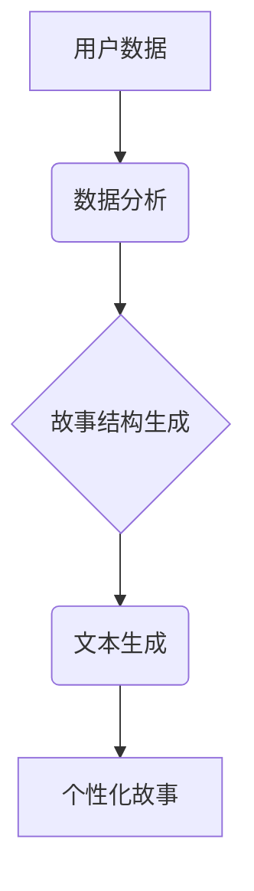

                 

## 体验的个人化叙事：AI驱动的生活故事

> 关键词：人工智能、个性化叙事、生活故事、机器学习、自然语言处理、数据分析、体验设计、未来趋势

## 1. 背景介绍

在信息爆炸的时代，我们每个人都沉浸在海量数据中。从社交媒体的动态到购物网站的浏览记录，从健康监测的数据到智能家居的交互记录，我们的生活轨迹无时无刻不在被记录和分析。而人工智能（AI）技术的飞速发展，为我们解读和利用这些数据提供了强大的工具。

传统的叙事方式往往是宏观的、标准化的，难以满足人们日益增长的个性化需求。而AI驱动的个性化叙事，则能够根据用户的独特经历、偏好和情感，构建出独一无二、富有情感共鸣的故事。

想象一下，一个AI系统能够根据你的生活数据，为你编织出你人生的精彩故事。它可以从你的照片、视频、文字记录中提取关键信息，并将其融入到一个引人入胜的叙事框架中。它可以根据你的性格特点和兴趣爱好，选择合适的叙事风格和情感基调。它甚至可以根据你的情绪状态，实时调整故事的节奏和内容，为你带来更加沉浸式的体验。

## 2. 核心概念与联系

**2.1 核心概念**

* **个性化叙事:**  是指根据用户的个人特征、喜好和需求，定制化生成的故事内容和表达方式。
* **AI驱动:**  利用人工智能技术，例如机器学习、自然语言处理等，自动分析数据、生成文本、构建故事结构。
* **生活故事:**  是指记录个人经历、情感、思想和价值观的故事，涵盖了生活的各个方面，例如成长、爱情、友情、工作、旅行等。

**2.2 架构图**



**2.3 联系**

AI驱动的个性化叙事将用户数据作为输入，通过数据分析、故事结构生成和文本生成等环节，最终输出个性化的生活故事。

## 3. 核心算法原理 & 具体操作步骤

**3.1 算法原理概述**

AI驱动的个性化叙事主要依赖于以下核心算法：

* **机器学习:** 用于从用户数据中学习用户特征、偏好和行为模式。
* **自然语言处理:** 用于理解和生成自然语言文本，构建故事的叙事结构和语言风格。
* **知识图谱:** 用于构建故事背景知识和人物关系，确保故事的逻辑性和可信度。

**3.2 算法步骤详解**

1. **数据收集和预处理:** 收集用户的各种数据，例如社交媒体记录、购物记录、健康数据、阅读记录等，并进行清洗、格式化和标注。
2. **特征提取和建模:** 利用机器学习算法，从用户数据中提取关键特征，例如兴趣爱好、性格特点、生活习惯等，并构建用户画像模型。
3. **故事结构生成:** 根据用户画像和故事类型，利用规则引擎或生成式模型，构建故事的框架、情节和人物关系。
4. **文本生成:** 利用自然语言处理技术，根据故事结构和用户偏好，生成富有情感共鸣的文本内容。
5. **故事评估和优化:** 利用用户反馈和算法评估指标，对生成的个性化故事进行评估和优化，不断提升故事质量和用户体验。

**3.3 算法优缺点**

* **优点:** 能够根据用户的个性化需求生成独一无二的故事，提升用户体验和情感共鸣。
* **缺点:** 算法依赖于海量数据和强大的计算能力，数据隐私和算法偏见等问题也需要得到有效解决。

**3.4 算法应用领域**

* **教育:** 个性化学习故事，提升学生的学习兴趣和效果。
* **娱乐:** 生成个性化游戏剧情和互动体验，增强用户参与度。
* **营销:**  定制化广告和营销内容，提升用户转化率。
* **医疗:**  生成患者的健康故事，帮助患者更好地理解自己的病情和治疗方案。

## 4. 数学模型和公式 & 详细讲解 & 举例说明

**4.1 数学模型构建**

个性化叙事可以看作是一个多变量优化问题，目标是找到最能满足用户需求的故事结构和文本内容。我们可以使用以下数学模型来表示：

$$
Story = argmax_{S} Utility(S, User)
$$

其中：

* $Story$ 代表生成的个性化故事。
* $User$ 代表用户的个人特征、偏好和需求。
* $Utility(S, User)$ 代表故事 $S$ 对用户 $User$ 的效用函数。

**4.2 公式推导过程**

效用函数 $Utility(S, User)$ 可以根据用户的不同需求和偏好进行设计。例如，我们可以使用以下公式来衡量故事的吸引力和情感共鸣：

$$
Utility(S, User) = \alpha * Engagement(S) + \beta * Emotion(S)
$$

其中：

* $Engagement(S)$ 代表故事 $S$ 的吸引力和用户参与度。
* $Emotion(S)$ 代表故事 $S$ 能够唤起用户的不同情感。
* $\alpha$ 和 $\beta$ 是权重参数，可以根据用户的不同需求进行调整。

**4.3 案例分析与讲解**

假设我们有一个用户，他喜欢冒险故事，并且希望故事能够带给他兴奋和刺激的感觉。我们可以将 $\beta$ 设为较高的值，以强调故事的情感共鸣。同时，我们可以使用一些冒险元素和刺激场景，来提高故事的 $Engagement(S)$ 值。

## 5. 项目实践：代码实例和详细解释说明

**5.1 开发环境搭建**

* Python 3.x
* TensorFlow 或 PyTorch
* NLTK 或 spaCy
* Jupyter Notebook

**5.2 源代码详细实现**

```python
# 数据预处理
import nltk
from nltk.corpus import stopwords
from nltk.tokenize import word_tokenize

# 加载用户数据
user_data = load_user_data()

# 去除停用词和分词
processed_data = []
for text in user_data:
    tokens = word_tokenize(text)
    filtered_tokens = [word for word in tokens if word.lower() not in stopwords.words('english')]
    processed_data.append(' '.join(filtered_tokens))

# 模型训练
from tensorflow.keras.models import Sequential
from tensorflow.keras.layers import Embedding, LSTM, Dense

model = Sequential()
model.add(Embedding(input_dim=vocab_size, output_dim=embedding_dim))
model.add(LSTM(units=128))
model.add(Dense(units=vocab_size, activation='softmax'))

model.compile(loss='categorical_crossentropy', optimizer='adam', metrics=['accuracy'])
model.fit(processed_data, processed_data, epochs=10)

# 故事生成
def generate_story(seed_text, num_words):
    for _ in range(num_words):
        token_list = word_tokenize(seed_text)
        sequence = model.predict(token_list)
        predicted_word = decode_sequence(sequence)
        seed_text += ' ' + predicted_word

    return seed_text
```

**5.3 代码解读与分析**

* 代码首先进行数据预处理，去除停用词和分词，以便于模型训练。
* 然后使用 TensorFlow 或 PyTorch 构建一个 LSTM 模型，用于学习用户数据中的语言模式和故事结构。
* 最后，使用训练好的模型生成个性化故事，可以根据用户的输入文本和期望长度进行定制。

**5.4 运行结果展示**

运行代码后，可以根据用户的输入文本生成一个个性化的故事。例如，如果用户输入“我是一个喜欢冒险的人”，模型可以生成一个关于冒险的精彩故事。

## 6. 实际应用场景

**6.1 教育领域**

* 个性化学习故事：根据学生的学习进度、兴趣爱好和知识点，生成个性化的学习故事，提升学生的学习兴趣和效果。
* 虚拟导师：利用AI技术，构建虚拟导师角色，为学生提供个性化的学习指导和陪伴。

**6.2 娱乐领域**

* 个性化游戏剧情：根据玩家的游戏行为和喜好，生成个性化的游戏剧情和任务，增强玩家的参与度和游戏体验。
* 智能小说创作：利用AI技术，辅助作家创作个性化的小说，例如根据用户的输入，生成不同类型的爱情故事、悬疑故事或科幻故事。

**6.3 营销领域**

* 定制化广告：根据用户的兴趣爱好和消费习惯，生成个性化的广告内容，提升广告的点击率和转化率。
* 情感营销：利用AI技术，分析用户的情感状态，并根据用户的不同情绪，生成相应的营销内容，例如在用户感到悲伤时，推荐一些温暖治愈的商品。

**6.4 未来应用展望**

* **沉浸式体验:**  结合虚拟现实和增强现实技术，为用户提供更加沉浸式的个性化叙事体验。
* **跨媒体融合:**  将文本、图像、音频、视频等多种媒体元素融合在一起，构建更加丰富多彩的个性化故事。
* **情感计算:**  更加深入地理解用户的情感需求，并根据用户的不同情绪状态，生成更加精准和有效的个性化故事。

## 7. 工具和资源推荐

**7.1 学习资源推荐**

* **书籍:**
    * 《深度学习》
    * 《自然语言处理》
    * 《机器学习实战》
* **在线课程:**
    * Coursera: 深度学习、自然语言处理
    * edX: 机器学习、数据科学
* **开源项目:**
    * TensorFlow
    * PyTorch
    * NLTK
    * spaCy

**7.2 开发工具推荐**

* **编程语言:** Python
* **机器学习框架:** TensorFlow, PyTorch
* **自然语言处理库:** NLTK, spaCy
* **数据可视化工具:** Matplotlib, Seaborn

**7.3 相关论文推荐**

* **生成式对抗网络 (GAN):** Goodfellow et al. (2014)
* **Transformer模型:** Vaswani et al. (2017)
* **BERT模型:** Devlin et al. (2018)

## 8. 总结：未来发展趋势与挑战

**8.1 研究成果总结**

AI驱动的个性化叙事技术取得了显著的进展，能够根据用户的个人特征和需求，生成独一无二、富有情感共鸣的故事。

**8.2 未来发展趋势**

* **更加个性化和智能化:**  利用更先进的机器学习算法和知识图谱技术，生成更加个性化、智能化的故事。
* **跨媒体融合:**  将文本、图像、音频、视频等多种媒体元素融合在一起，构建更加丰富多彩的个性化故事。
* **情感计算:**  更加深入地理解用户的情感需求，并根据用户的不同情绪状态，生成更加精准和有效的个性化故事。

**8.3 面临的挑战**

* **数据隐私和安全:**  个性化叙事技术依赖于海量用户数据，如何保护用户隐私和数据安全是一个重要的挑战。
* **算法偏见:**  机器学习算法可能会受到训练数据的影响，导致算法偏见，从而生成不公平或不准确的故事。
* **伦理问题:**  AI驱动的个性化叙事可能会引发一些伦理问题，例如虚假信息传播、情感操控等，需要进行深入的伦理探讨和规范。

**8.4 研究展望**

未来，AI驱动的个性化叙事技术将继续发展，并应用于越来越多的领域。我们需要加强对算法的安全性、公平性和伦理性的研究，确保这项技术能够真正为人类社会带来福祉。

## 9. 附录：常见问题与解答

**9.1 如何保护用户数据隐私？**

* 使用加密技术保护用户数据，防止未经授权的访问。
* 采用匿名化技术，将用户数据进行脱敏处理，保护用户的个人信息。
* 明确告知用户数据的使用目的和方式，并获得用户的同意。

**9.2 如何避免算法偏见？**

* 使用更加多样化的训练数据，减少算法对特定群体或观点的偏好。
* 开发算法公平性评估指标，定期评估算法的公平性，并进行必要的调整。
* 鼓励多方参与算法的开发和评估，避免单一团队的偏见。


作者：禅与计算机程序设计艺术 / Zen and the Art of Computer Programming 
<end_of_turn>

