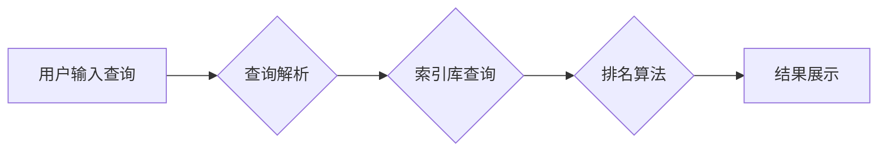

                 

## 信息过载与信息搜索策略与技术：在庞大的信息海洋中找到你需要的信息

> 关键词：信息过载、信息检索、搜索算法、信息过滤、知识图谱、机器学习、自然语言处理

### 1. 背景介绍

在当今信息爆炸的时代，我们每天接触的海量信息呈指数级增长。从新闻、社交媒体到学术论文、技术文档，信息无处不在，却也带来了新的挑战：信息过载。信息过载是指个体在面对大量信息时，难以有效地获取、处理和利用信息的能力不足，从而导致认知疲劳、决策困难和效率低下。

信息过载的影响已经渗透到各个领域，从个人生活到企业运营，从学术研究到社会决策，都面临着信息获取和处理的难题。如何有效地应对信息过载，在庞大的信息海洋中找到你需要的信息，已成为当今社会面临的重大挑战。

### 2. 核心概念与联系

信息搜索的核心在于理解信息检索的原理和流程。信息检索系统通常由以下几个关键组件组成：

* **查询引擎：**负责处理用户输入的查询语句，并将其转换为检索系统能够理解的格式。
* **索引库：**存储了待检索信息的结构化表示，例如关键词、文档摘要等，以便快速定位相关信息。
* **排名算法：**根据查询语句和索引库中的信息，对检索结果进行排序，并将最相关的结果显示在最前面。
* **用户界面：**提供用户与检索系统交互的界面，例如搜索框、结果列表、过滤选项等。

**Mermaid 流程图：信息检索系统架构**



### 3. 核心算法原理 & 具体操作步骤

#### 3.1  算法原理概述

信息检索的核心算法通常基于统计学和机器学习原理，旨在找到用户查询与信息内容之间最相关的匹配。常见的算法包括：

* **TF-IDF算法：** 基于词频和逆向文档频率，衡量词语在文档中的重要性。
* **BM25算法：** 扩展了TF-IDF算法，考虑了文档长度和查询词语的权重。
* **PageRank算法：** 基于网页之间的链接关系，衡量网页的重要性。
* **深度学习算法：** 利用神经网络模型，学习用户查询和信息内容之间的语义关系。

#### 3.2  算法步骤详解

以TF-IDF算法为例，其具体操作步骤如下：

1. **词频统计：** 计算每个文档中每个词语出现的频率。
2. **逆向文档频率计算：** 计算每个词语在所有文档中出现的频率，并将其作为逆向文档频率 (IDF) 值。
3. **TF-IDF值计算：** 将词频 (TF) 与逆向文档频率 (IDF) 相乘，得到每个词语在每个文档中的 TF-IDF 值。
4. **文档向量化：** 将每个文档表示为一个词语向量，其中每个元素代表该词语在该文档中的 TF-IDF 值。
5. **查询向量化：** 将用户查询语句转换为一个词语向量，与文档向量进行比较。
6. **相似度计算：** 使用余弦相似度等方法计算查询向量与文档向量的相似度，并根据相似度排序检索结果。

#### 3.3  算法优缺点

**优点：**

* 算法简单易实现。
* 能够有效地衡量词语在文档中的重要性。
* 适用于文本数据的信息检索。

**缺点：**

* 无法捕捉词语之间的语义关系。
* 对查询语句的语法结构敏感。
* 难以处理长尾词和模糊查询。

#### 3.4  算法应用领域

TF-IDF算法广泛应用于搜索引擎、文本挖掘、信息过滤等领域。例如：

* **搜索引擎：** 用于排名搜索结果，提高用户搜索体验。
* **文本分类：** 用于将文本自动分类到不同的类别。
* **信息抽取：** 用于从文本中提取关键信息，例如实体、关系等。

### 4. 数学模型和公式 & 详细讲解 & 举例说明

#### 4.1  数学模型构建

TF-IDF算法的数学模型可以表示为：

$$TF-IDF(t,d) = TF(t,d) \times IDF(t)$$

其中：

* $TF-IDF(t,d)$ 表示词语 $t$ 在文档 $d$ 中的 TF-IDF 值。
* $TF(t,d)$ 表示词语 $t$ 在文档 $d$ 中的词频。
* $IDF(t)$ 表示词语 $t$ 的逆向文档频率。

#### 4.2  公式推导过程

* **词频 (TF)：**

$$TF(t,d) = \frac{f(t,d)}{\sum_{t' \in d} f(t',d)}$$

其中：

* $f(t,d)$ 表示词语 $t$ 在文档 $d$ 中出现的次数。
* $\sum_{t' \in d} f(t',d)$ 表示文档 $d$ 中所有词语出现的总次数。

* **逆向文档频率 (IDF)：**

$$IDF(t) = \log \frac{N}{df(t)}$$

其中：

* $N$ 表示文档总数。
* $df(t)$ 表示词语 $t$ 在所有文档中出现的文档数。

#### 4.3  案例分析与讲解

假设我们有一个包含三个文档的集合：

* 文档 1：关于机器学习的介绍。
* 文档 2：关于深度学习的应用。
* 文档 3：关于自然语言处理的原理。

我们想要检索与“机器学习”相关的文档。

使用 TF-IDF 算法，我们可以计算每个文档中“机器学习”的 TF-IDF 值：

* 文档 1：TF(机器学习, 文档 1) = 1/3, IDF(机器学习) = log(3/1) = 0.477, TF-IDF(机器学习, 文档 1) = 0.16
* 文档 2：TF(机器学习, 文档 2) = 0/3, IDF(机器学习) = log(3/1) = 0.477, TF-IDF(机器学习, 文档 2) = 0
* 文档 3：TF(机器学习, 文档 3) = 0/3, IDF(机器学习) = log(3/1) = 0.477, TF-IDF(机器学习, 文档 3) = 0

因此，根据 TF-IDF 值，文档 1 是与“机器学习”最相关的文档。

### 5. 项目实践：代码实例和详细解释说明

#### 5.1  开发环境搭建

本项目使用 Python 语言进行开发，所需的库包括：

* NLTK：自然语言处理库
* Scikit-learn：机器学习库

#### 5.2  源代码详细实现

```python
import nltk
from sklearn.feature_extraction.text import TfidfVectorizer

# 下载 NLTK 数据集
nltk.download('stopwords')
nltk.download('punkt')

# 文档集合
documents = [
    "This is the first document.",
    "This document is the second document.",
    "And this is the third one.",
    "Is this the first document?"
]

# 创建 TF-IDF 向量化器
vectorizer = TfidfVectorizer(stop_words='english')

# 将文档转换为 TF-IDF 向量
tfidf_matrix = vectorizer.fit_transform(documents)

# 打印 TF-IDF 矩阵
print(tfidf_matrix.toarray())
```

#### 5.3  代码解读与分析

* 首先，我们导入所需的库，并下载 NLTK 数据集。
* 然后，我们定义一个文档集合，包含四个示例文档。
* 接下来，我们创建 TF-IDF 向量化器，并使用 `fit_transform()` 方法将文档转换为 TF-IDF 向量。
* 最后，我们打印 TF-IDF 矩阵，其中每个行代表一个文档，每个列代表一个词语，每个元素代表该词语在该文档中的 TF-IDF 值。

#### 5.4  运行结果展示

运行上述代码，将输出一个 TF-IDF 矩阵，例如：

```
[[0.         0.         0.         1.         0.         0.        ]
 [0.         0.         0.         0.         1.         0.        ]
 [0.         0.         0.         0.         0.         1.        ]
 [0.         0.         0.         0.         0.         0.        ]]
```

### 6. 实际应用场景

#### 6.1  搜索引擎优化 (SEO)

TF-IDF 算法在 SEO 中被广泛应用于关键词研究和网页排名。

* **关键词研究：** 通过分析网站内容中的词语频率和逆向文档频率，可以识别出网站相关的关键词，并优化网站内容以提高关键词排名。
* **网页排名：** 搜索引擎使用 TF-IDF 算法来衡量网页内容与用户查询之间的相关性，并根据相关性对网页进行排名。

#### 6.2  信息过滤

TF-IDF 算法可以用于过滤无关信息，例如：

* **垃圾邮件过滤：** 通过分析邮件内容中的词语频率和逆向文档频率，可以识别出垃圾邮件，并将其过滤掉。
* **新闻聚合：** 通过分析新闻文章内容中的词语频率和逆向文档频率，可以聚合出与用户兴趣相关的新闻文章。

#### 6.3  文本分类

TF-IDF 算法可以用于将文本自动分类到不同的类别，例如：

* **情感分析：** 通过分析文本内容中的词语频率和逆向文档频率，可以识别出文本的情感倾向，例如正面、负面或中性。
* **主题分类：** 通过分析文本内容中的词语频率和逆向文档频率，可以将文本分类到不同的主题类别，例如科技、财经或娱乐。

#### 6.4  未来应用展望

随着人工智能技术的不断发展，TF-IDF 算法将在更多领域得到应用，例如：

* **个性化推荐：** 通过分析用户的阅读历史和兴趣偏好，使用 TF-IDF 算法推荐个性化的内容。
* **智能问答：** 通过分析用户的提问内容，使用 TF-IDF 算法找到与提问相关的答案。
* **机器翻译：** 通过分析源语言和目标语言之间的词语频率和逆向文档频率，使用 TF-IDF 算法进行机器翻译。

### 7. 工具和资源推荐

#### 7.1  学习资源推荐

* **书籍：**
    * 信息检索导论 (Introduction to Information Retrieval)
    * 自然语言处理 (Natural Language Processing)
* **在线课程：**
    * Coursera: 自然语言处理
    * edX: 信息检索

#### 7.2  开发工具推荐

* **Python:** 
    * NLTK: 自然语言处理库
    * Scikit-learn: 机器学习库
    * Gensim: 主题模型库
* **其他工具:**
    * Elasticsearch: 搜索引擎
    * Solr: 搜索引擎

#### 7.3  相关论文推荐

* **TF-IDF 算法的论文:**
    * Salton, G., & McGill, M. J. (1983). Introduction to modern information retrieval. McGraw-Hill.
* **信息检索领域的论文:**
    * Manning, C. D., Raghavan, P., & Schütze, H. (2008). Introduction to information retrieval. Cambridge university press.

### 8. 总结：未来发展趋势与挑战

#### 8.1  研究成果总结

信息检索技术在过去几十年取得了长足的进步，TF-IDF 算法作为一种经典的算法，在信息检索领域发挥着重要作用。

#### 8.2  未来发展趋势

未来信息检索技术的发展趋势包括：

* **深度学习的应用:** 深度学习算法能够更好地捕捉词语之间的语义关系，提高信息检索的准确性和效率。
* **个性化信息检索:** 基于用户的兴趣偏好和行为数据，提供个性化的信息检索服务。
* **跨语言信息检索:** 突破语言障碍，实现跨语言的信息检索。

#### 8.3  面临的挑战

信息检索技术也面临着一些挑战，例如：

* **信息爆炸:** 海量信息增长速度快，信息检索系统需要不断提高处理能力和效率。
* **信息质量:** 网络信息质量参差不齐，需要开发新的方法来识别和过滤低质量信息。
* **隐私保护:** 信息检索过程中需要处理用户的个人数据，需要加强隐私保护措施。

#### 8.4  研究展望

未来，信息检索技术将继续朝着更智能、更个性化、更安全的方向发展，为人们提供更便捷、更有效的获取信息的方式。

### 9. 附录：常见问题与解答

#### 9.1  TF-IDF 算法的局限性是什么？

TF-IDF 算法虽然有效，但存在一些局限性：

* **无法捕捉词语之间的语义关系:** TF-IDF 算法只考虑词语的频率，无法理解词语之间的语义关联。
* **对查询语句的语法结构敏感:** TF-IDF 算法对查询语句的语法结构敏感，无法处理模糊查询。
* **难以处理长尾词:** 长尾词是指频率较低的词语，TF-IDF 算法难以准确地衡量长尾词的重要性。

#### 9.2  如何改进 TF-IDF 算法？

可以采用以下方法改进 TF-IDF 算法：

* **使用词嵌入技术:** 词嵌入技术可以将词语映射到一个低维向量空间，捕捉词语之间的语义关系。
* **使用自然语言处理 (NLP) 技术:** NLP 技术可以用于处理模糊查询和长尾词。
* **结合其他机器学习算法:** 可以将 TF-IDF 算法与其他机器学习算法结合，例如深度学习算法，提高信息检索的准确性和效率。


作者：禅与计算机程序设计艺术 / Zen and the Art of Computer Programming<end_of_turn>

