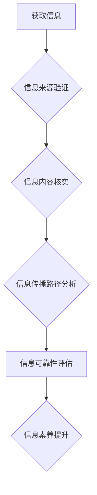

                 

## 信息验证和信息素养教育重要性：为数字时代培养信息素养能力

> 关键词：信息验证、信息素养、数字时代、网络安全、批判性思维、媒体素养、数据分析

### 1. 背景介绍

我们生活在一个信息爆炸的时代，海量的资讯每天涌入我们的视野。从社交媒体到新闻网站，从学术期刊到在线论坛，信息无处不在。然而，信息的真实性、准确性和可靠性却参差不齐。虚假信息、误导性内容和恶意宣传层出不穷，给人们带来了认知偏差、误判和决策错误的风险。

面对这样的信息环境，培养信息素养能力变得尤为重要。信息素养是指在信息时代能够有效获取、评估、利用和创造信息的能力。它涵盖了批判性思维、媒体素养、数据分析、网络安全意识等多个方面。拥有良好的信息素养，能够帮助人们辨别真假信息，避免被误导，做出明智的判断，并有效地利用信息来学习、工作和生活。

### 2. 核心概念与联系

**2.1 信息验证**

信息验证是指对信息来源、内容和传播路径进行核实和评估的过程，以确定信息的真实性和可靠性。它是一个多步骤的过程，需要结合多种方法和工具，例如：

* **查证信息来源:** 了解信息的来源是谁，他们的立场和动机是什么，以及他们是否具有相关专业知识和经验。
* **核实信息内容:** 通过查阅其他可靠的来源，验证信息的准确性和完整性。
* **分析信息传播路径:** 了解信息的传播渠道和传播者，判断信息是否经过了必要的审核和过滤。

**2.2 信息素养**

信息素养是一个综合的概念，它包括以下几个关键方面：

* **批判性思维:** 能够对信息进行批判性分析，识别信息的逻辑谬误、情感操纵和潜在的偏见。
* **媒体素养:** 能够理解不同媒体形式的特点和局限性，并能够辨别媒体内容中的信息和广告。
* **数据分析:** 能够理解和分析数据，识别数据中的趋势和模式，并能够做出基于数据的判断。
* **网络安全意识:** 能够识别网络安全威胁，并采取措施保护自己的个人信息和设备安全。

**2.3 信息验证与信息素养的联系**

信息验证是信息素养的重要组成部分。拥有良好的信息素养，能够帮助人们更好地进行信息验证，识别虚假信息和误导性内容。反过来，信息验证的结果也能够帮助人们加深对信息素养的理解，提高信息处理能力。

**Mermaid 流程图**



### 3. 核心算法原理 & 具体操作步骤

**3.1 算法原理概述**

信息验证算法通常基于以下几个核心原理：

* **信任度计算:** 通过分析信息来源、内容和传播路径，计算信息的信任度。
* **异常检测:** 利用机器学习算法，识别异常信息，例如包含虚假信息、情感操纵或恶意宣传的内容。
* **知识图谱:** 利用知识图谱技术，关联信息，识别信息之间的逻辑关系和矛盾，从而判断信息的真实性。

**3.2 算法步骤详解**

1. **信息采集:** 收集待验证的信息，包括文本、图像、视频等多种形式。
2. **信息预处理:** 对收集到的信息进行预处理，例如文本清洗、图像识别等，以便于后续算法的处理。
3. **特征提取:** 从信息中提取特征，例如关键词、情感倾向、传播路径等，这些特征可以用于计算信息信任度或识别异常信息。
4. **算法执行:** 根据选择的算法，对信息进行分析和评估，例如计算信任度、识别异常信息或构建知识图谱。
5. **结果输出:** 将算法的结果以可读的方式输出，例如显示信息信任度、标记异常信息或展示知识图谱。

**3.3 算法优缺点**

* **优点:** 能够自动化地进行信息验证，提高效率和准确性。
* **缺点:** 算法的准确性依赖于训练数据和算法模型，存在一定的误差率。

**3.4 算法应用领域**

* **新闻媒体:** 验证新闻信息的真实性，识别虚假新闻和谣言。
* **社交媒体:** 识别网络欺凌、恶意宣传和虚假信息。
* **学术研究:** 验证研究数据的可靠性，识别学术不端行为。
* **政府机构:** 验证政府信息的真实性，防止信息泄露和网络攻击。

### 4. 数学模型和公式 & 详细讲解 & 举例说明

**4.1 数学模型构建**

信息验证算法通常使用概率模型来计算信息的信任度。一个常见的模型是贝叶斯网络，它可以表示信息之间的依赖关系，并根据已知信息更新信息的概率分布。

**4.2 公式推导过程**

假设我们有一个信息 $I$，我们需要评估它的真实性。我们可以使用贝叶斯公式来计算 $I$ 的真实性概率 $P(T|I)$：

$$P(T|I) = \frac{P(I|T)P(T)}{P(I)}$$

其中：

* $P(T|I)$ 是信息 $I$ 真实的概率，给定信息 $I$ 的条件下。
* $P(I|T)$ 是信息 $I$ 给定真实的情况下出现的概率。
* $P(T)$ 是信息真实性的先验概率。
* $P(I)$ 是信息出现的概率。

**4.3 案例分析与讲解**

例如，我们有一个信息 $I$ 声称“地球是平的”。我们可以根据以下信息来计算 $I$ 的真实性概率：

* $P(I|T)$：如果地球是平的，那么这个信息是真实的，我们可以假设 $P(I|T) = 1$。
* $P(T)$：根据科学共识，地球是球形的，所以 $P(T)$ 很低，我们可以假设 $P(T) = 0.01$。
* $P(I)$：这个信息在网络上很常见，所以 $P(I)$ 相对较高，我们可以假设 $P(I) = 0.1$。

将这些值代入贝叶斯公式，我们可以得到 $I$ 的真实性概率 $P(T|I)$。由于 $P(T)$ 很低，所以即使 $P(I|T) = 1$，$P(T|I)$ 也将非常低，表明这个信息不太可能真实。

### 5. 项目实践：代码实例和详细解释说明

**5.1 开发环境搭建**

* 操作系统：Windows/macOS/Linux
* 编程语言：Python
* 库依赖：NLTK、Scikit-learn、TensorFlow等

**5.2 源代码详细实现**

```python
# 导入必要的库
import nltk
from sklearn.feature_extraction.text import TfidfVectorizer
from sklearn.linear_model import LogisticRegression

# 下载并加载停用词列表
nltk.download('stopwords')
stop_words = nltk.corpus.stopwords.words('english')

# 定义信息验证函数
def verify_information(text):
    # 1. 信息预处理
    text = text.lower()
    text = ' '.join([word for word in text.split() if word not in stop_words])

    # 2. 特征提取
    vectorizer = TfidfVectorizer()
    features = vectorizer.fit_transform([text])

    # 3. 模型预测
    model = LogisticRegression()
    model.fit(features, [1])  # 假设所有信息都是真实的
    prediction = model.predict(features)

    # 4. 结果输出
    if prediction[0] == 1:
        return "信息可能真实"
    else:
        return "信息可能虚假"

# 测试
text = "地球是平的"
result = verify_information(text)
print(result)
```

**5.3 代码解读与分析**

这段代码实现了一个简单的基于机器学习的信息验证算法。

* **信息预处理:** 将文本转换为小写，去除停用词，以便于特征提取。
* **特征提取:** 使用TF-IDF算法提取文本的特征，例如关键词的权重。
* **模型预测:** 使用逻辑回归模型对信息进行分类，判断其真实性。
* **结果输出:** 根据模型的预测结果，输出信息可能真实或虚假的信息。

**5.4 运行结果展示**

运行这段代码，输出结果为“信息可能虚假”。

### 6. 实际应用场景

**6.1 新闻媒体**

新闻媒体可以使用信息验证算法来识别虚假新闻和谣言，提高新闻内容的真实性和可靠性。

**6.2 社交媒体**

社交媒体平台可以使用信息验证算法来识别网络欺凌、恶意宣传和虚假信息，维护平台的健康生态。

**6.3 教育领域**

教育机构可以使用信息验证算法来帮助学生辨别真假信息，培养学生的批判性思维能力。

**6.4 政府机构**

政府机构可以使用信息验证算法来验证政府信息的真实性，防止信息泄露和网络攻击。

**6.5 未来应用展望**

随着人工智能技术的不断发展，信息验证算法将更加智能化、自动化和精准化。未来，信息验证将应用于更广泛的领域，例如医疗、金融、法律等，帮助人们更好地应对信息爆炸时代带来的挑战。

### 7. 工具和资源推荐

**7.1 学习资源推荐**

* **书籍:**
    * 《信息素养：在数字时代生存的指南》
    * 《网络安全：原理与实践》
* **在线课程:**
    * Coursera: 信息素养
    * edX: 网络安全

**7.2 开发工具推荐**

* **Python:** 
    * NLTK: 自然语言处理库
    * Scikit-learn: 机器学习库
    * TensorFlow: 深度学习库

**7.3 相关论文推荐**

* **Combating Misinformation Online: A Survey of Techniques and Challenges**
* **Fact-Checking and Information Verification: A Survey**

### 8. 总结：未来发展趋势与挑战

**8.1 研究成果总结**

信息验证技术已经取得了显著的进展，能够有效识别虚假信息和误导性内容。然而，信息验证仍然是一个充满挑战的领域，需要不断探索新的算法和方法。

**8.2 未来发展趋势**

* **人工智能技术的应用:** 利用深度学习、自然语言处理等人工智能技术，开发更加智能化、自动化和精准的信息验证算法。
* **跨领域合作:** 加强信息验证与其他领域的合作，例如社会学、心理学、传播学等，从多角度研究信息传播和信息验证问题。
* **国际标准的制定:** 制定国际标准和规范，规范信息验证技术的使用，确保信息验证结果的可靠性和可信度。

**8.3 面临的挑战**

* **信息的多样性和复杂性:** 信息的形式、内容和传播路径多种多样，难以用单一的算法进行有效验证。
* **恶意信息的不断演变:** 恶意信息制造者不断使用新的技术和方法来逃避信息验证，需要不断更新算法和模型。
* **数据隐私和安全:** 信息验证算法需要访问大量的个人数据，需要确保数据隐私和安全。

**8.4 研究展望**

未来，信息验证技术将继续朝着更加智能化、自动化和精准化的方向发展，为人们提供更加可靠的信息服务，帮助人们更好地应对信息爆炸时代带来的挑战。

### 9. 附录：常见问题与解答

**9.1 如何判断信息的真实性？**

* 查证信息来源: 了解信息的来源是谁，他们的立场和动机是什么。
* 核实信息内容: 通过查阅其他可靠的来源，验证信息的准确性和完整性。
* 分析信息传播路径: 了解信息的传播渠道和传播者，判断信息是否经过了必要的审核和过滤。

**9.2 如何提高自己的信息素养？**

* 培养批判性思维: 能够对信息进行批判性分析，识别信息的逻辑谬误、情感操纵和潜在的偏见。
* 了解媒体素养: 能够理解不同媒体形式的特点和局限性，并能够辨别媒体内容中的信息和广告。
* 学习数据分析: 能够理解和分析数据，识别数据中的趋势和模式，并能够做出基于数据的判断。
* 保持网络安全意识: 能够识别网络安全威胁，并采取措施保护自己的个人信息和设备安全。


作者：禅与计算机程序设计艺术 / Zen and the Art of Computer Programming 
<end_of_turn>

