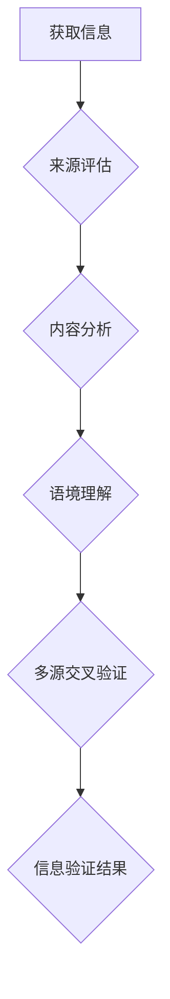

                 

## 信息验证和批判性阅读指南：在假新闻和媒体操纵的时代导航

> 关键词：信息验证、批判性阅读、假新闻、媒体操纵、深度学习、自然语言处理、信息素养、网络安全

### 1. 背景介绍

在信息爆炸的时代，我们每天都被海量的信息淹没。从社交媒体到新闻网站，从搜索引擎到电子邮件，信息无处不在。然而，这些信息并非都真实可靠。假新闻、谣言、误导性内容泛滥，严重影响着人们的判断力和决策。面对信息洪流，如何有效地验证信息，培养批判性阅读能力，成为当今社会不可或缺的技能。

近年来，随着人工智能技术的快速发展，深度学习和自然语言处理（NLP）等技术在信息验证领域发挥着越来越重要的作用。这些技术能够自动识别和分析文本内容，帮助我们识别假新闻、谣言和误导性信息。同时，人们也更加意识到信息素养的重要性，学习如何批判性地阅读和评估信息，成为抵御信息操纵和维护自身认知安全的重要手段。

### 2. 核心概念与联系

**2.1 信息验证的概念**

信息验证是指通过多种手段和方法，对信息的真实性、准确性和可靠性进行评估和确认的过程。它涉及到对信息来源、内容、结构、语境等多方面的分析和判断。

**2.2 关键概念**

* **真伪识别:**  区分真实信息和虚假信息。
* **来源评估:**  判断信息的来源可靠性，包括网站、作者、机构等。
* **内容分析:**  分析信息的结构、逻辑、语言风格等特征，识别潜在的误导或虚假信息。
* **语境理解:**  根据信息的上下文环境，判断其真实性和意图。
* **多源交叉验证:**  通过参考多个可靠来源，验证信息的真实性。

**2.3 信息验证流程图**



### 3. 核心算法原理 & 具体操作步骤

**3.1 算法原理概述**

信息验证算法通常基于深度学习和自然语言处理技术，利用机器学习模型识别和分析文本内容，判断其真实性。常见的算法包括：

* **文本分类算法:**  将文本分类为真实、虚假、谣言等类别。
* **情感分析算法:**  分析文本的情感倾向，识别潜在的误导性信息。
* **事实核查算法:**  利用知识图谱和事实数据库，验证文本中提到的事实是否真实。
* **生成对抗网络 (GAN):**  利用生成模型和判别模型，生成真实和虚假文本，训练模型识别虚假信息。

**3.2 算法步骤详解**

1. **数据收集和预处理:**  收集大量真实和虚假文本数据，并进行清洗、标注和格式化处理。
2. **特征提取:**  提取文本中的关键特征，例如词语、短语、语法结构、情感倾向等。
3. **模型训练:**  利用深度学习算法，训练模型识别和分类文本。
4. **模型评估:**  使用测试数据评估模型的准确率、召回率和F1-score等指标。
5. **模型部署:**  将训练好的模型部署到实际应用场景中，例如新闻网站、社交媒体平台等。

**3.3 算法优缺点**

* **优点:**  能够自动识别和分析大量文本数据，提高信息验证效率。
* **缺点:**  算法模型需要大量数据进行训练，训练成本高；算法模型容易受到数据偏差的影响，存在识别误差；虚假信息不断更新，算法模型需要持续更新和改进。

**3.4 算法应用领域**

* **新闻媒体:**  识别和过滤假新闻，维护新闻的真实性和可靠性。
* **社交媒体平台:**  识别和删除虚假信息和谣言，维护平台的健康生态。
* **搜索引擎:**  提高搜索结果的准确性和可靠性，避免用户误信虚假信息。
* **教育领域:**  帮助学生培养批判性阅读能力，识别和应对信息操纵。

### 4. 数学模型和公式 & 详细讲解 & 举例说明

**4.1 数学模型构建**

信息验证算法通常基于概率模型，例如贝叶斯网络、隐马尔可夫模型等。这些模型将文本特征和类别标签之间的关系建模为概率分布，通过计算概率来判断文本的真实性。

**4.2 公式推导过程**

例如，假设我们使用贝叶斯网络模型进行文本分类，其中文本特征为X，类别标签为Y。贝叶斯定理可以表示为：

$$P(Y|X) = \frac{P(X|Y)P(Y)}{P(X)}$$

其中：

* $P(Y|X)$ 是给定特征X情况下类别Y的概率。
* $P(X|Y)$ 是给定类别Y情况下特征X的概率。
* $P(Y)$ 是类别Y的先验概率。
* $P(X)$ 是特征X的边缘概率。

通过训练数据，我们可以估计上述概率分布，并利用贝叶斯定理计算出文本的类别概率。

**4.3 案例分析与讲解**

假设我们有一个文本分类任务，需要判断文本是真实新闻还是虚假新闻。我们可以使用贝叶斯网络模型，将文本特征（例如词语、短语、语法结构）作为输入，输出真实新闻或虚假新闻的概率。

例如，如果文本中包含关键词“假新闻”、“谣言”等，那么其被分类为虚假新闻的概率会更高。反之，如果文本中包含关键词“权威机构”、“事实依据”等，那么其被分类为真实新闻的概率会更高。

### 5. 项目实践：代码实例和详细解释说明

**5.1 开发环境搭建**

* Python 3.x
* TensorFlow 或 PyTorch 深度学习框架
* NLTK 自然语言处理库
* Scikit-learn 机器学习库

**5.2 源代码详细实现**

```python
# 导入必要的库
import tensorflow as tf
from tensorflow.keras.models import Sequential
from tensorflow.keras.layers import Embedding, LSTM, Dense

# 数据预处理
# ...

# 模型构建
model = Sequential()
model.add(Embedding(input_dim=vocab_size, output_dim=embedding_dim, input_length=max_length))
model.add(LSTM(units=128))
model.add(Dense(units=1, activation='sigmoid'))

# 模型编译
model.compile(optimizer='adam', loss='binary_crossentropy', metrics=['accuracy'])

# 模型训练
model.fit(X_train, y_train, epochs=10, batch_size=32)

# 模型评估
loss, accuracy = model.evaluate(X_test, y_test)
print('Loss:', loss)
print('Accuracy:', accuracy)

# 模型预测
predictions = model.predict(X_new)
```

**5.3 代码解读与分析**

* 代码首先导入必要的库，包括 TensorFlow、NLTK 和 Scikit-learn。
* 然后进行数据预处理，例如文本分词、词向量化、数据标签化等。
* 接着构建一个深度学习模型，使用 Embedding、LSTM 和 Dense 层。
* 模型使用 Adam 优化器、二元交叉熵损失函数和精度指标进行编译和训练。
* 最后评估模型性能，并使用模型对新文本进行预测。

**5.4 运行结果展示**

运行结果将显示模型的训练损失、精度以及对测试数据的预测结果。

### 6. 实际应用场景

**6.1 新闻媒体**

新闻媒体可以使用信息验证算法识别和过滤假新闻，维护新闻的真实性和可靠性。例如，一些新闻网站已经开始使用 AI 技术自动识别和标记虚假新闻，并提供相关事实核查信息。

**6.2 社交媒体平台**

社交媒体平台可以使用信息验证算法识别和删除虚假信息和谣言，维护平台的健康生态。例如，Facebook 和 Twitter 等平台已经开始使用 AI 技术识别和标记虚假信息，并限制其传播范围。

**6.3 搜索引擎**

搜索引擎可以使用信息验证算法提高搜索结果的准确性和可靠性，避免用户误信虚假信息。例如，Google 等搜索引擎已经开始使用 AI 技术识别和过滤虚假信息，并将真实信息排在搜索结果的前列。

**6.4 教育领域**

教育领域可以使用信息验证算法帮助学生培养批判性阅读能力，识别和应对信息操纵。例如，一些学校已经开始使用 AI 技术开发信息素养课程，帮助学生学习如何识别和评估信息来源、内容和语境。

**6.5 未来应用展望**

随着人工智能技术的不断发展，信息验证算法将更加智能化、自动化和精准化。未来，信息验证技术将应用于更广泛的领域，例如医疗、金融、法律等，帮助人们更好地应对信息爆炸时代带来的挑战。

### 7. 工具和资源推荐

**7.1 学习资源推荐**

* **在线课程:** Coursera、edX、Udacity 等平台提供深度学习和自然语言处理相关的在线课程。
* **书籍:** 《深度学习》、《自然语言处理》等书籍可以帮助你深入了解相关知识。
* **博客和论坛:**  许多技术博客和论坛提供关于信息验证和人工智能的最新资讯和讨论。

**7.2 开发工具推荐**

* **TensorFlow:**  Google 开发的开源深度学习框架。
* **PyTorch:**  Facebook 开发的开源深度学习框架。
* **NLTK:**  Python 自然语言处理库。
* **Scikit-learn:**  Python 机器学习库。

**7.3 相关论文推荐**

* **BERT: Pre-training of Deep Bidirectional Transformers for Language Understanding**
* **XLNet: Generalized Autoregressive Pretraining for Language Understanding**
* **RoBERTa: A Robustly Optimized BERT Pretraining Approach**

### 8. 总结：未来发展趋势与挑战

**8.1 研究成果总结**

近年来，信息验证领域取得了显著进展，深度学习和自然语言处理技术在识别和分类虚假信息方面取得了令人瞩目的成果。

**8.2 未来发展趋势**

* **模型更加智能化:**  未来信息验证模型将更加智能化，能够理解更复杂的文本语义，识别更加隐蔽的虚假信息。
* **跨语言信息验证:**  未来信息验证技术将扩展到多语言领域，能够识别和验证不同语言的虚假信息。
* **解释性 AI:**  未来信息验证模型将更加透明和可解释，能够解释其识别虚假信息的依据，提高用户信任度。

**8.3 面临的挑战**

* **数据偏差:**  信息验证算法容易受到训练数据偏差的影响，需要不断收集和更新高质量的数据。
* **对抗性攻击:**  攻击者可能会设计对抗性文本，绕过信息验证模型的识别，需要开发更加鲁棒的模型。
* **伦理问题:**  信息验证技术可能会引发伦理问题，例如隐私泄露、信息操控等，需要谨慎考虑其社会影响。

**8.4 研究展望**

未来，信息验证领域的研究将更加注重模型的鲁棒性、解释性和伦理性，并探索更加有效的技术手段，帮助人们在信息爆炸时代更好地导航和应对信息挑战。

### 9. 附录：常见问题与解答

**9.1 如何判断一个信息来源的可靠性？**

* 关注信息来源的权威性和声誉。
* 查看网站的域名、作者信息和联系方式。
* 比较不同来源的信息，寻找一致性。
* 注意信息内容的逻辑性和证据支持。

**9.2 如何识别虚假新闻的特征？**

* 标题过于耸动或情绪化。
* 内容缺乏事实依据或引用来源。
* 语气偏激、充满偏见或攻击性。
* 使用虚假图片、视频或音频。
* 链接指向不可信的网站。

**9.3 如何培养批判性阅读能力？**

* 质疑信息来源和内容。
* 寻找多方信息，进行交叉验证。
* 分析信息结构、逻辑和语境。
* 识别信息中的潜在偏见和误导。
* 独立思考，形成自己的判断。


作者：禅与计算机程序设计艺术 / Zen and the Art of Computer Programming 
<end_of_turn>

