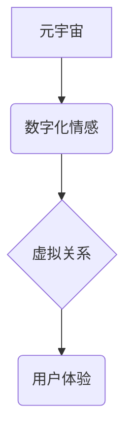

                 

## 元宇宙中的数字化情感:虚拟关系的深度探索

> 关键词：元宇宙、数字化情感、虚拟关系、人工智能、情感计算、自然语言处理、深度学习、交互设计

## 1. 背景介绍

元宇宙概念的兴起，标志着人类社会迈向一个全新的数字交互时代。在这个虚拟世界中，人们将能够以更加沉浸式的方式体验生活、工作和娱乐。然而，元宇宙的魅力不仅仅在于其逼真的虚拟环境，更在于其对人际关系的重塑。虚拟角色、虚拟社区、虚拟情感，这些元素将为我们带来前所未有的社交体验。

数字化情感，作为元宇宙中虚拟关系的核心要素，正在逐渐成为研究的热点。它涉及到如何让虚拟角色能够感知、理解和表达人类的情感，以及如何构建能够支持真实情感交流的虚拟环境。

## 2. 核心概念与联系

**2.1  元宇宙**

元宇宙是一个由虚拟现实、增强现实和互联网技术融合而成的沉浸式虚拟世界。它拥有以下关键特征：

* **沉浸式体验:**  通过VR/AR技术，用户可以身临其境地体验虚拟世界。
* **持久性:** 元宇宙是一个持续运行的虚拟世界，即使用户离开，虚拟世界也会继续存在。
* **去中心化:** 元宇宙由多个平台和开发者共同构建，而不是由单一实体控制。
* **经济系统:** 元宇宙拥有自己的经济系统，用户可以通过虚拟货币进行交易。

**2.2  数字化情感**

数字化情感是指在虚拟环境中模拟和表达人类情感的一种技术。它通过人工智能、自然语言处理和情感计算等技术，使虚拟角色能够感知、理解和回应用户的感情。

**2.3  虚拟关系**

虚拟关系是指在虚拟环境中建立的人际关系。它可以是朋友、恋人、同事，甚至是虚拟角色与用户的互动关系。

**2.4  核心概念关系图**



## 3. 核心算法原理 & 具体操作步骤

**3.1  算法原理概述**

数字化情感的核心算法原理是基于人工智能和情感计算。它主要包括以下几个步骤：

* **情感识别:** 通过分析用户的语言、表情、语音等信息，识别用户的当前情感状态。
* **情感理解:** 对识别出的情感进行分析和解释，理解用户的意图和需求。
* **情感表达:** 根据用户的意图和需求，使虚拟角色能够以语言、表情、动作等方式表达相应的虚拟情感。

**3.2  算法步骤详解**

1. **数据采集:** 收集用户的语言、表情、语音等多模态数据。
2. **数据预处理:** 对收集到的数据进行清洗、格式化和特征提取。
3. **情感分类模型训练:** 使用深度学习算法，训练情感分类模型，能够识别用户的不同情感状态。
4. **情感理解模型训练:** 使用自然语言处理技术，训练情感理解模型，能够理解用户的意图和需求。
5. **情感表达模型训练:** 使用机器学习算法，训练情感表达模型，能够使虚拟角色以语言、表情、动作等方式表达相应的虚拟情感。
6. **系统集成:** 将上述模型集成到元宇宙平台中，实现数字化情感的实时交互。

**3.3  算法优缺点**

**优点:**

* 可以使虚拟角色更加人性化，提升用户体验。
* 可以促进用户与虚拟角色之间的情感连接，增强用户参与度。
* 可以为用户提供更加个性化和定制化的虚拟体验。

**缺点:**

* 现有的算法仍然难以完全模拟人类的情感复杂性。
* 数据安全和隐私保护是一个需要认真考虑的问题。
* 如何避免虚拟情感对用户现实生活造成负面影响是一个伦理挑战。

**3.4  算法应用领域**

* **游戏:** 使游戏角色更加生动和人性化，提升玩家的游戏体验。
* **教育:** 为学生提供更加沉浸式的学习体验，提高学习兴趣和效果。
* **医疗:** 用于治疗心理疾病，例如社交焦虑症和抑郁症。
* **客服:** 提供更加人性化的客户服务体验。

## 4. 数学模型和公式 & 详细讲解 & 举例说明

**4.1  数学模型构建**

数字化情感的数学模型通常基于情感分类和情感理解的机器学习算法。

* **情感分类模型:** 通常使用支持向量机 (SVM)、随机森林 (RF) 或深度神经网络 (DNN) 等算法。

* **情感理解模型:** 通常使用循环神经网络 (RNN) 或 transformers 等深度学习算法。

**4.2  公式推导过程**

由于篇幅限制，这里只列举一个简单的例子，即使用 SVM 进行情感分类。

* **目标函数:**

$$
min_{w,b} \frac{1}{2}||w||^2 + C \sum_{i=1}^{N} \xi_i
$$

其中：

* $w$ 是模型参数向量。
* $b$ 是模型偏置项。
* $C$ 是惩罚参数，控制模型的复杂度。
* $\xi_i$ 是松弛变量，用于容忍模型训练过程中出现的误分类。

* **约束条件:**

$$
y_i (w^T x_i + b) \geq 1 - \xi_i, \quad i = 1, 2, ..., N
$$

其中：

* $x_i$ 是第 $i$ 个样本的特征向量。
* $y_i$ 是第 $i$ 个样本的标签 (正类或负类)。

**4.3  案例分析与讲解**

假设我们想要训练一个情感分类模型，用于识别用户评论中的情感倾向 (正面、负面或中性)。我们可以使用 SVM 算法，将用户评论的文本特征作为输入，训练模型识别评论的情感类别。

## 5. 项目实践：代码实例和详细解释说明

**5.1  开发环境搭建**

* 操作系统: Ubuntu 20.04
* Python 版本: 3.8
* 必要的库: TensorFlow, Keras, NLTK, scikit-learn

**5.2  源代码详细实现**

```python
# 导入必要的库
import tensorflow as tf
from tensorflow.keras.models import Sequential
from tensorflow.keras.layers import Embedding, LSTM, Dense

# 数据预处理
# ...

# 定义模型结构
model = Sequential()
model.add(Embedding(input_dim=vocab_size, output_dim=embedding_dim, input_length=max_length))
model.add(LSTM(units=128))
model.add(Dense(units=3, activation='softmax'))

# 编译模型
model.compile(optimizer='adam', loss='sparse_categorical_crossentropy', metrics=['accuracy'])

# 模型训练
model.fit(x_train, y_train, epochs=10, batch_size=32)

# 模型评估
loss, accuracy = model.evaluate(x_test, y_test)
print('Test Loss:', loss)
print('Test Accuracy:', accuracy)
```

**5.3  代码解读与分析**

* 该代码示例使用 TensorFlow 和 Keras 库构建了一个情感分类模型。
* 模型结构包括 Embedding 层、LSTM 层和 Dense 层。
* Embedding 层将文本单词转换为稠密的向量表示。
* LSTM 层用于捕捉文本序列中的长距离依赖关系。
* Dense 层用于输出情感类别。
* 模型使用 Adam 优化器、稀疏类别交叉熵损失函数和精度指标进行训练。

**5.4  运行结果展示**

运行结果将显示模型在测试集上的损失值和精度值。

## 6. 实际应用场景

**6.1  游戏**

* **角色对话:** 使游戏角色能够根据玩家的情感状态进行更加自然和人性化的对话。
* **剧情发展:** 根据玩家的情感选择，调整游戏剧情的发展方向。
* **游戏体验:** 提升玩家的游戏沉浸感和代入感。

**6.2  教育**

* **个性化学习:** 根据学生的学习情绪和状态，提供个性化的学习内容和教学方式。
* **情感支持:** 为学生提供情感支持和心理辅导。
* **互动式学习:** 通过虚拟角色和情景模拟，提高学生的学习兴趣和参与度。

**6.3  医疗**

* **心理治疗:** 用于治疗社交焦虑症、抑郁症等心理疾病。
* **情绪监测:** 通过分析用户的语言、表情等信息，监测用户的精神状态。
* **疾病预防:** 通过情感分析，识别潜在的心理健康问题，进行早期干预。

**6.4  未来应用展望**

随着人工智能技术的不断发展，数字化情感将在元宇宙中发挥更加重要的作用。未来，我们可能会看到：

* **更加逼真的虚拟情感:** 虚拟角色能够更加准确地识别和表达人类的情感。
* **更加个性化的虚拟体验:** 元宇宙平台能够根据用户的个人喜好和情感需求，提供更加个性化的虚拟体验。
* **虚拟情感与现实情感的融合:** 虚拟情感能够与现实情感相互影响，为用户提供更加丰富和深刻的体验。

## 7. 工具和资源推荐

**7.1  学习资源推荐**

* **书籍:**
    * 《深度学习》 by Ian Goodfellow, Yoshua Bengio, and Aaron Courville
    * 《自然语言处理》 by Jurafsky and Martin
* **在线课程:**
    * Coursera: Deep Learning Specialization
    * edX: Artificial Intelligence
* **博客和论坛:**
    * Towards Data Science
    * Reddit: r/MachineLearning

**7.2  开发工具推荐**

* **TensorFlow:** 开源深度学习框架
* **PyTorch:** 开源深度学习框架
* **Keras:** 高级深度学习API
* **NLTK:** 自然语言处理工具包

**7.3  相关论文推荐**

* **Generating Emotionally Intelligent Dialogue Agents with Deep Reinforcement Learning**
* **A Survey on Emotion Recognition in Text**
* **Towards a Unified Framework for Emotion Recognition in Text**

## 8. 总结：未来发展趋势与挑战

**8.1  研究成果总结**

数字化情感的研究取得了显著进展，已经能够实现对用户情感的识别、理解和表达。然而，现有的算法仍然存在一些局限性，例如难以模拟人类情感的复杂性和多层次性。

**8.2  未来发展趋势**

* **更加精准的情感识别:** 利用多模态数据和更先进的机器学习算法，提高情感识别的准确性和细粒度。
* **更深层次的情感理解:** 研究人类情感的认知机制，开发能够理解情感背后的意图和需求的算法。
* **更加自然的情感表达:** 开发能够更加自然和逼真地表达虚拟情感的算法，例如使用语音合成、表情动画等技术。

**8.3  面临的挑战**

* **数据安全和隐私保护:** 数字化情感技术需要处理大量用户情感数据，因此数据安全和隐私保护是一个重要的挑战。
* **伦理问题:** 如何避免虚拟情感对用户现实生活造成负面影响是一个需要认真考虑的伦理问题。
* **技术瓶颈:** 现有的算法仍然难以完全模拟人类情感的复杂性和多层次性，需要进一步的研究和突破。

**8.4  研究展望**

数字化情感技术的发展将对元宇宙的构建和发展产生深远的影响。未来，我们期待看到更加人性化、更加沉浸式的虚拟世界，为用户提供更加丰富和深刻的体验。


## 9. 附录：常见问题与解答

**9.1  如何确保虚拟情感的真实性？**

虚拟情感的真实性取决于算法的复杂性和训练数据的质量。

**9.2  如何避免虚拟情感对用户造成负面影响？**

需要制定相应的伦理规范和安全机制，避免虚拟情感过度依赖或产生负面情绪。

**9.3  数字化情感技术的发展前景如何？**

数字化情感技术的发展前景广阔，将在元宇宙、游戏、教育、医疗等领域发挥重要作用。


作者：禅与计算机程序设计艺术 / Zen and the Art of Computer Programming 
<end_of_turn>

