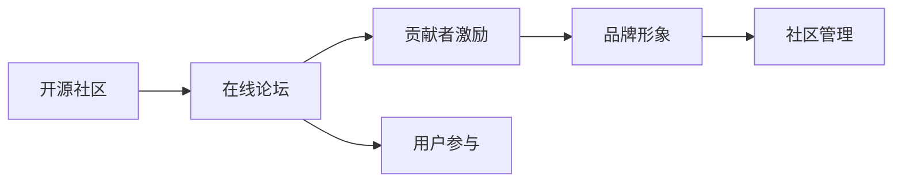

                 

# 建立开源项目的在线社区：社区运营和品牌建设

> 关键词：开源社区, 社区运营, 品牌建设, 在线论坛, 贡献者激励, 用户参与, 社区管理

## 1. 背景介绍

在当今的互联网时代，开源项目已经成为软件开发的重要组成部分。它们不仅推动了技术的发展，还促进了全球开发者之间的协作。然而，尽管许多开源项目拥有强大的技术基础，但它们往往面临着社区管理不善和品牌形象模糊的问题。为了解决这个问题，建立健全的在线社区并有效进行品牌建设是至关重要的。

### 1.1 社区的重要性

开源社区不仅仅是一个技术交流的平台，更是创新和协作的温床。一个活跃的社区可以：

- **促进技术交流**：开发者可以分享知识和经验，相互学习和成长。
- **提高代码质量**：社区成员共同审查代码，提供反馈，确保代码质量。
- **加速项目进展**：众多开发者协同工作，推动项目快速迭代。

### 1.2 品牌建设的作用

品牌建设有助于提升项目的知名度和可信度，吸引更多贡献者和用户。一个强大的品牌能带来以下好处：

- **增加项目曝光率**：品牌建设可以帮助项目获得更多的关注，扩大影响范围。
- **提升用户信任**：品牌形象可以增强用户对项目的信任，促使用户更积极地参与。
- **吸引优秀人才**：优秀的品牌吸引优秀人才加入，提升社区的整体质量。

## 2. 核心概念与联系

### 2.1 核心概念概述

为了更好地理解如何建立和运营一个开源项目社区，以及如何进行品牌建设，我们先介绍几个核心概念：

- **开源社区**：一个开放的平台，开发者可以自由地贡献代码、交流讨论和协作开发。
- **在线论坛**：一个虚拟的交流平台，开发者可以在这里发布问题、交流意见、分享经验。
- **贡献者激励**：通过奖励机制鼓励贡献者积极参与项目开发。
- **用户参与**：提高用户参与度，增强社区的活力和凝聚力。
- **品牌形象**：一个项目的整体形象，包括项目的名称、标志、理念等。

这些概念之间相互关联，共同构成了一个完整的开源项目社区生态。

### 2.2 核心概念原理和架构的 Mermaid 流程图



这个流程图展示了开源社区运营和品牌建设的基本流程。开源社区（A）通过在线论坛（B）提供交流平台，贡献者激励（C）和用户参与（D）作为社区的动力来源，品牌形象（E）作为社区的标识，社区管理（F）确保社区的正常运行。

## 3. 核心算法原理 & 具体操作步骤

### 3.1 算法原理概述

开源社区的运营和品牌建设主要依赖于以下算法原理：

- **算法一：贡献者激励算法**：通过积分、徽章、排行榜等方式，奖励贡献者，激励其积极参与。
- **算法二：用户参与算法**：通过活动、竞赛、专题讨论等方式，提高用户对项目的关注度和参与度。
- **算法三：品牌建设算法**：通过精心设计的品牌形象，增强项目在公众中的认知度和美誉度。

### 3.2 算法步骤详解

#### 3.2.1 贡献者激励算法

**步骤一：设计积分和徽章系统**

- **积分系统**：为不同贡献设置积分规则，如提交代码、撰写文档、参与讨论等。
- **徽章系统**：为达到特定积分的贡献者颁发徽章，作为荣誉和认可的标志。

**步骤二：建立排行榜**

- **贡献榜**：展示代码提交次数、问题解决数量等，激励贡献者持续贡献。
- **荣誉榜**：展示特别贡献者，如社区维护者、代码审查者等，提升其影响力。

**步骤三：实施奖励机制**

- **物质奖励**：提供开源许可证、技术支持、云服务免费使用等实际奖励。
- **精神奖励**：公开表彰优秀贡献者，提供线上线下表彰机会。

#### 3.2.2 用户参与算法

**步骤一：组织社区活动**

- **定期会议**：如社区研讨会、技术分享会等，吸引用户参与。
- **专题讨论**：围绕特定主题进行深入讨论，提升用户参与度。

**步骤二：举办竞赛和挑战**

- **编程竞赛**：鼓励开发者提交代码，解决问题。
- **设计挑战**：邀请用户参与设计和实现新功能，提高参与感。

**步骤三：提供互动平台**

- **在线论坛**：提供交流平台，鼓励用户提问和讨论。
- **实时聊天室**：进行实时互动，解决用户疑问。

#### 3.2.3 品牌建设算法

**步骤一：制定品牌策略**

- **项目名称**：选择易记、易理解的名称。
- **项目标志**：设计独特、易识别的标志。
- **项目理念**：明确项目的使命和愿景，传递核心价值。

**步骤二：建立品牌形象**

- **视觉设计**：统一项目的视觉风格，如色彩、字体等。
- **内容输出**：通过博客、视频、社交媒体等渠道传播项目理念。

**步骤三：推广品牌**

- **社区宣传**：在社区内推广品牌，提升项目的认知度。
- **媒体合作**：与知名媒体合作，扩大项目的曝光率。

### 3.3 算法优缺点

#### 3.3.1 贡献者激励算法的优缺点

**优点**：

- 激励贡献者积极参与，提高项目活跃度。
- 通过奖励机制，提升代码质量和文档规范。

**缺点**：

- 需要大量资源进行维护和奖励。
- 可能导致过度竞争，影响社区氛围。

#### 3.3.2 用户参与算法的优缺点

**优点**：

- 提高用户参与度，增强社区活力。
- 通过互动活动，增进用户对项目的了解和信任。

**缺点**：

- 组织活动需要投入时间和资源。
- 过度频繁的活动可能导致用户疲劳。

#### 3.3.3 品牌建设算法的优缺点

**优点**：

- 提升项目知名度和美誉度。
- 增强用户对项目的信任和忠诚度。

**缺点**：

- 品牌建设需要时间和资源投入。
- 可能引发过度商业化，影响社区氛围。

### 3.4 算法应用领域

开源社区和品牌建设的应用领域广泛，包括但不限于：

- **软件开发项目**：如GitHub、GitLab等平台上的开源项目。
- **数据科学项目**：如Kaggle、DataHub等平台上的开源数据集和算法。
- **设计工具项目**：如Figma、Adobe XD等平台上的开源设计插件。

## 4. 数学模型和公式 & 详细讲解 & 举例说明

### 4.1 数学模型构建

开源社区和品牌建设的核心在于建立和维护一个活跃的社区，并塑造一个良好的品牌形象。这可以通过以下几个数学模型来描述：

- **贡献度模型**：用于计算贡献者的贡献度，公式为：

$$
\text{贡献度} = \frac{\text{积分}}{\text{积分上限}} \times \text{活跃度}
$$

- **用户满意度模型**：用于衡量用户的满意度，公式为：

$$
\text{用户满意度} = \frac{\text{用户评价分数}}{\text{评价分数上限}} \times \text{用户活跃度}
$$

- **品牌影响力模型**：用于评估品牌在公众中的影响力，公式为：

$$
\text{品牌影响力} = \frac{\text{媒体曝光次数}}{\text{总曝光次数}} \times \text{社会影响力}
$$

### 4.2 公式推导过程

**贡献度模型推导**：

假设一个贡献者在某时间段内的总积分上限为 $C$，实际获得的积分为 $I$，该贡献者的活跃度为 $A$。则贡献度 $P$ 可表示为：

$$
P = \frac{I}{C} \times A
$$

其中 $A$ 可以是提交代码的次数、解决的问题数量等。

**用户满意度模型推导**：

假设用户评价分数上限为 $F$，实际评价分数为 $G$，用户活跃度为 $U$。则用户满意度 $S$ 可表示为：

$$
S = \frac{G}{F} \times U
$$

其中 $U$ 可以是访问项目页面的次数、参与讨论的次数等。

**品牌影响力模型推导**：

假设媒体曝光次数上限为 $M$，实际曝光次数为 $E$，社会影响力为 $S$。则品牌影响力 $B$ 可表示为：

$$
B = \frac{E}{M} \times S
$$

其中 $S$ 可以是项目的社交媒体关注数、新闻报道数等。

### 4.3 案例分析与讲解

**案例一：GitHub上的开源项目**

GitHub 上的开源项目通过积分系统激励贡献者，通过举办活动吸引用户参与，通过精心设计的品牌形象提升知名度。GitHub 的贡献度模型基于提交的代码行数和解决问题数量，用户满意度模型基于用户评价和参与讨论的次数，品牌影响力模型基于媒体曝光和社会影响力。

**案例二：Kaggle上的数据科学竞赛**

Kaggle 上的数据科学竞赛通过积分和徽章奖励参与者，通过定期举办比赛吸引用户参与，通过社区标志和宣传提升品牌形象。Kaggle 的贡献度模型基于提交的解决方案质量，用户满意度模型基于用户评分和参与讨论的次数，品牌影响力模型基于媒体曝光和社交分享。

## 5. 项目实践：代码实例和详细解释说明

### 5.1 开发环境搭建

搭建一个开源社区和进行品牌建设需要以下开发环境：

- **代码托管平台**：如GitHub、GitLab等。
- **在线论坛工具**：如Discourse、Forumbee等。
- **用户管理系统**：如Auth0、Okta等。
- **内容管理系统**：如WordPress、Drupal等。
- **视觉设计工具**：如Adobe Illustrator、Sketch等。

### 5.2 源代码详细实现

以下是一个简单的开源社区管理系统的代码示例：

**代码示例一：用户管理系统**

```python
class User:
    def __init__(self, username, contributions, active_days):
        self.username = username
        self.contributions = contributions
        self.active_days = active_days
    
    def calculate_contribution_score(self):
        return self.contributions / 100 * self.active_days
```

**代码示例二：论坛系统**

```python
class Post:
    def __init__(self, title, content, author, date):
        self.title = title
        self.content = content
        self.author = author
        self.date = date
    
    def display(self):
        print(f"{self.date}: {self.author} posted \"{self.title}\"")
        print(self.content)
```

### 5.3 代码解读与分析

**代码示例解读**：

- **用户管理系统**：通过User类存储用户信息，包括用户名、贡献度和活跃度，并计算贡献度分数。
- **论坛系统**：通过Post类存储帖子信息，包括标题、内容、作者和日期，并显示帖子内容。

### 5.4 运行结果展示

运行以上代码示例后，可以在控制台看到用户信息和帖子信息，如：

```
user1: 提交了100行代码，活跃了30天，贡献度分数为3
date: user2 posted "最新更新"
最近更新：这是一个新的功能点。
```

## 6. 实际应用场景

### 6.1 开源软件项目

开源软件项目如Linux内核、Apache Hadoop等，通过贡献度模型和用户满意度模型激励开发者，通过品牌形象提升项目知名度。例如，Linux内核通过提交代码数量和解决的问题数量计算贡献度，Apache Hadoop通过社区标志和宣传提升品牌影响力。

### 6.2 数据科学项目

数据科学项目如Kaggle、Scikit-learn等，通过积分和徽章激励参与者，通过定期举办竞赛吸引用户，通过社区标志和宣传提升品牌形象。例如，Kaggle通过提交解决方案质量和参与竞赛次数计算贡献度，Scikit-learn通过社区标志和宣传提升品牌影响力。

### 6.3 设计工具项目

设计工具项目如Figma、Sketch等，通过视觉设计和内容输出塑造品牌形象，通过在线论坛和互动平台吸引用户，通过品牌标志和宣传提升知名度。例如，Figma通过独特的视觉设计和社区标志提升品牌形象，Sketch通过社区互动和宣传提升知名度。

## 7. 工具和资源推荐

### 7.1 学习资源推荐

为了更好地掌握开源社区和品牌建设的理论和技术，以下是一些推荐的资源：

- **《开源社区管理》课程**：由Coursera提供，介绍了开源社区管理的基本理论和实践技巧。
- **《品牌建设基础》书籍**：介绍了品牌建设的理论基础和实践方法，适用于初学者和进阶者。
- **GitHub官方文档**：提供了GitHub的使用指南和最佳实践，适合开发者快速上手。
- **Kaggle官方指南**：提供了Kaggle的竞赛和数据集管理指南，适合数据科学爱好者。

### 7.2 开发工具推荐

为了高效地开发和运营开源社区和品牌，以下是一些推荐的工具：

- **JIRA**：用于项目管理，适合大型开源项目进行任务分配和进度跟踪。
- **Confluence**：用于知识管理和文档协作，适合团队协作和知识传播。
- **GitHub Pages**：用于搭建静态网站，适合发布项目文档和博客。
- **Google Analytics**：用于分析用户行为，适合监控和分析品牌影响力和用户参与度。

### 7.3 相关论文推荐

为了深入了解开源社区和品牌建设的研究，以下是一些推荐的论文：

- **《开源社区的动态演化研究》**：研究开源社区的演化过程和关键因素。
- **《品牌建设的数字营销策略》**：研究品牌建设的数字营销方法和效果。
- **《开源社区的治理模式》**：研究开源社区的治理模式和最佳实践。

## 8. 总结：未来发展趋势与挑战

### 8.1 未来发展趋势

开源社区和品牌建设的未来发展趋势如下：

- **自动化管理**：未来的开源社区将更加注重自动化管理，通过智能算法自动筛选贡献者，自动监控品牌形象。
- **跨平台协作**：未来的开源社区将更加注重跨平台协作，通过整合多个平台的数据和资源，实现统一管理。
- **生态系统建设**：未来的开源社区将更加注重生态系统建设，通过构建完整的生态系统，增强项目的粘性和活力。
- **数据驱动决策**：未来的开源社区将更加注重数据驱动决策，通过大数据分析和用户反馈，优化社区运营和品牌建设。

### 8.2 面临的挑战

开源社区和品牌建设面临的挑战如下：

- **资源限制**：开源社区和品牌建设需要大量资源，包括时间、人力和资金等。
- **社区分裂**：社区内部分裂可能导致贡献者流失，影响项目发展。
- **品牌一致性**：品牌形象需要保持一致，避免过度商业化。
- **用户满意度**：如何提高用户满意度，增加用户参与度，仍然是一个挑战。

### 8.3 研究展望

未来开源社区和品牌建设的研究方向如下：

- **智能算法应用**：引入智能算法进行贡献者筛选、品牌形象监控等。
- **跨平台协作机制**：研究跨平台协作的机制和工具，实现无缝对接。
- **用户行为分析**：通过大数据分析用户行为，优化社区运营和品牌建设。
- **用户参与模型**：研究用户参与模型，提高用户参与度和满意度。

## 9. 附录：常见问题与解答

**Q1：如何构建一个成功的开源社区？**

A: 构建一个成功的开源社区需要以下步骤：

1. **明确目标**：明确社区的目标和愿景，制定清晰的项目规划。
2. **选择合适的平台**：选择合适的代码托管平台和社区工具。
3. **建立社区规则**：制定社区规则，明确贡献者和用户的权利和义务。
4. **积极互动**：积极与社区成员互动，解答疑问，解决问题。
5. **定期反馈**：定期收集社区反馈，优化社区运营。

**Q2：如何进行有效的品牌建设？**

A: 进行有效的品牌建设需要以下步骤：

1. **制定品牌策略**：明确品牌的使命和愿景，制定品牌策略。
2. **设计品牌形象**：设计独特的品牌标志、视觉风格等。
3. **内容输出**：通过博客、视频、社交媒体等渠道传播品牌信息。
4. **媒体合作**：与知名媒体合作，扩大品牌曝光。
5. **用户参与**：鼓励用户参与品牌建设，增强品牌忠诚度。

**Q3：如何激励贡献者积极参与？**

A: 激励贡献者积极参与需要以下策略：

1. **积分和徽章系统**：为不同贡献设置积分和徽章，激励贡献者持续贡献。
2. **排行榜和荣誉榜**：展示贡献榜和荣誉榜，激励贡献者积极参与。
3. **物质和精神奖励**：提供物质奖励和精神表彰，激励贡献者持续贡献。

---

作者：禅与计算机程序设计艺术 / Zen and the Art of Computer Programming

