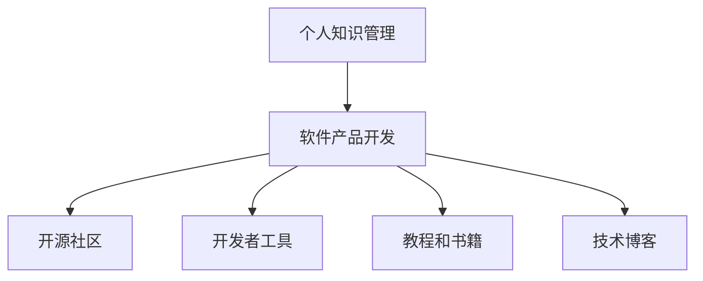

                 

# 开发个人品牌产品：将知识转化为实体产品

> 关键词：个人品牌、知识管理、软件产品、开源社区、开发者工具、教程书籍、技术博客

## 1. 背景介绍

### 1.1 问题由来
随着互联网时代的到来，个人品牌建设已成为越来越多专业人士的重要课题。在信息过载、知识快速更新的今天，如何有效地组织、分享、应用自己的知识，成为提升职业竞争力的关键。

个人品牌产品的开发，旨在帮助开发者将个人的专业知识转化为可视化的、可操作的软件实体产品。通过构建基于知识的产品，不仅能够展示个人的技术实力和创意思维，还能够为他人提供实际的帮助和价值。

### 1.2 问题核心关键点
个人品牌产品的开发，涉及将个人知识进行结构化整理，并通过软件工具实现自动化处理。关键点在于：
- **知识管理**：如何将个人的经验、见解和成果进行有效的整理和分类。
- **软件实现**：如何将整理好的知识转化为可用的实体产品，如应用程序、插件、教程等。
- **开源社区**：如何通过开源社区平台，实现知识的共享和互动。
- **开发者工具**：开发个人品牌产品所需要的工具和框架。
- **教程和书籍**：如何将知识转化为易于理解和应用的文档和教程。

## 2. 核心概念与联系

### 2.1 核心概念概述

为更好地理解个人品牌产品的开发过程，本节将介绍几个密切相关的核心概念：

- **个人知识管理**：指对个人学习、工作、生活等方面的知识进行系统的收集、整理、分享和应用的过程。个人知识管理的目的在于提升个人效率，促进知识增值，强化职业竞争力。

- **软件产品开发**：指通过编程、设计和测试等手段，将概念化的产品想法转化为可用的软件实体产品。软件产品开发强调需求分析、功能设计、技术实现和用户体验等环节的综合考虑。

- **开源社区**：指通过互联网平台聚集的开发者社区，其成员共享代码、工具、知识等资源，促进技术交流和创新。开源社区的积极参与能够加速个人品牌产品的开发和推广。

- **开发者工具**：指在个人品牌产品开发过程中所使用的编程语言、框架、库等软件工具。开发者工具的选择和配置直接影响产品的质量和开发效率。

- **教程和书籍**：指将个人知识转化为文档、视频、代码示例等形式，以便他人学习和应用的文档资料。教程和书籍的编写和发布是个人品牌产品的重要输出形式。

- **技术博客**：指通过互联网平台发布个人技术见解、项目经验、产品评价等内容的博客形式。技术博客能够提升个人品牌的知名度和影响力。

这些核心概念之间的逻辑关系可以通过以下Mermaid流程图来展示：



这个流程图展示了一系列概念之间的逻辑关系：

1. 个人知识管理为软件产品开发提供了素材。
2. 软件产品开发是知识管理的实现手段。
3. 开源社区为产品提供了交流和反馈的平台。
4. 开发者工具为产品开发提供了技术支持。
5. 教程和书籍为知识共享提供了内容。
6. 技术博客为知识传播提供了渠道。

## 3. 核心算法原理 & 具体操作步骤
### 3.1 算法原理概述

个人品牌产品的开发，本质上是一个将知识转化为软件产品的系统工程。其核心思想是：将个人的知识系统整理为模块化、标准化的代码和文档，通过软件工具和开源社区进行协同开发和推广，最终实现知识的商业化和价值最大化。

形式化地，假设个人知识库为 $K=\{k_i\}_{i=1}^N$，其中 $k_i$ 为知识单元，包括文章、项目、代码片段等。知识产品开发的目标是将 $K$ 转化为软件产品 $P$，使得 $P$ 能够满足用户需求，提供实用价值。

通过知识抽取、产品设计和开发、测试和部署等环节，逐步将 $K$ 转化为 $P$。最终，通过开源社区和开发者工具，广泛传播和应用 $P$，实现个人品牌产品的推广和价值体现。

### 3.2 算法步骤详解

个人品牌产品开发的算法步骤主要包括以下几个关键步骤：

**Step 1: 知识整理与分类**
- 收集整理个人在学习、工作、生活中的各种知识，包括技术文章、代码库、项目文档等。
- 对知识进行分类，按照技术领域、应用场景、主题等维度进行划分。

**Step 2: 知识提取与抽象**
- 将整理好的知识提取关键信息，转化为可复用的代码模块、算法、API等抽象单元。
- 编写单元测试和文档，确保每个知识模块独立可复用。

**Step 3: 产品设计**
- 根据用户需求和自身知识库，设计产品功能和架构，确定核心功能模块和技术栈。
- 编写需求文档和设计图，进行详细的功能设计。

**Step 4: 代码实现**
- 根据设计文档，使用所选的开发者工具进行代码实现。
- 实现代码后，进行单元测试和集成测试，确保代码质量和稳定性。

**Step 5: 测试与部署**
- 对实现好的软件产品进行全面测试，包括功能测试、性能测试、安全性测试等。
- 将测试通过的软件产品部署到生产环境，提供用户使用。

**Step 6: 开源与社区推广**
- 将产品源代码和文档上传到开源社区平台，如GitHub、GitLab等。
- 发布产品的使用手册和API文档，吸引社区用户下载和使用。
- 在社区中积极参与讨论，解答用户问题，提升产品知名度和用户满意度。

### 3.3 算法优缺点

个人品牌产品开发方法具有以下优点：
1. **系统化知识管理**：通过整理和分类，使个人知识结构化，便于查找和应用。
2. **提高开发效率**：通过复用已有的知识模块，减少重复开发，提高开发速度。
3. **增强社区互动**：通过开源社区的参与，获取反馈和建议，促进产品迭代。
4. **提升影响力**：通过发布教程和博客，展示技术实力，提升个人品牌知名度。
5. **促进知识传播**：通过文档和代码分享，将个人知识推广到更广泛的群体。

同时，该方法也存在一些局限性：
1. **前期投入较大**：知识整理和产品设计需要花费大量时间和精力。
2. **依赖社区支持**：开源社区的活跃度和参与度直接影响产品的推广效果。
3. **知识版权问题**：个人知识转化为开源产品的过程中，需要注意版权归属和保护。
4. **产品推广难度**：高质量的软件产品也需要有效的市场推广策略才能被更多用户认可。

尽管存在这些局限性，但就目前而言，个人品牌产品的开发方法仍是最为系统化和高效的方法，尤其适合技术积累丰富的专业人士。

### 3.4 算法应用领域

个人品牌产品的开发方法在多个领域得到了广泛应用，例如：

- **技术博客与教程**：将个人的技术见解、项目经验、工具推荐等转化为博客和教程，帮助他人学习技术。
- **开源项目与插件**：开发和发布开源项目或插件，供社区成员使用和改进，展示个人技术实力。
- **应用程序开发**：将个人知识转化为应用程序，解决实际问题，提升个人品牌影响力。
- **企业内部应用**：将个人知识应用于企业内部的软件开发、项目管理等，提升企业技术水平和效率。

除了上述这些经典应用外，个人品牌产品开发方法还被创新性地应用于更多场景中，如数据可视化工具、智能助手、在线教育平台等，为个人品牌价值提供了新的展示平台。

## 4. 数学模型和公式 & 详细讲解 & 举例说明

### 4.1 数学模型构建

本节将使用数学语言对个人品牌产品的开发过程进行更加严格的刻画。

假设个人知识库为 $K=\{k_i\}_{i=1}^N$，其中 $k_i$ 为知识单元，包括文章、项目、代码片段等。知识产品开发的目标是将 $K$ 转化为软件产品 $P$，使得 $P$ 能够满足用户需求，提供实用价值。

知识产品的开发过程可以形式化表示为：

$$
P = f(K)
$$

其中 $f$ 为知识到产品的映射函数，包含知识提取、产品设计和开发、测试和部署等步骤。

### 4.2 公式推导过程

以下我们以技术博客的开发为例，推导知识到博客的映射过程：

假设个人知识库 $K$ 中有一篇技术文章 $k$，其包含的知识点 $K(k)$ 为：
$$
K(k) = \{A_1, A_2, \cdots, A_n\}
$$

其中 $A_i$ 为文章中的知识点，包括代码片段、技术要点、实例演示等。

文章被转化为技术博客 $P$ 的过程可以表示为：
$$
P = \text{Blog}(K(k))
$$

其中 $\text{Blog}$ 为知识到博客的映射函数。技术博客的构成可以分解为：
$$
P = \{Title, Abstract, Content, Code Snippet, Example\}
$$

- **Title**：文章的标题，需要简明扼要地概括文章主题。
- **Abstract**：文章的摘要，需要简洁地介绍文章内容和结构。
- **Content**：文章的主体内容，需要详细阐述技术要点和实现思路。
- **Code Snippet**：文章的代码片段，需要展示关键代码的实现方式。
- **Example**：文章的应用示例，需要提供具体的应用场景和效果展示。

通过以上映射函数，个人知识库中的文章 $k$ 可以被转化为技术博客 $P$，供社区成员学习参考。

### 4.3 案例分析与讲解

以某知名开发者“A君”为例，分析其个人品牌产品的开发过程：

1. **知识整理与分类**：A君定期收集其在学习、工作和项目中的技术文章、代码片段和项目文档，将其按照技术领域和应用场景进行分类。例如，将前端开发相关的知识整理为前端基础、React、Vue等子分类。

2. **知识提取与抽象**：A君将整理好的知识提取关键信息，转化为可复用的代码模块、算法、API等抽象单元。例如，将React的某个组件抽象为一个独立模块，编写单元测试和文档。

3. **产品设计**：A君根据社区用户反馈和技术趋势，设计技术博客的内容结构和形式。例如，使用Markdown编写文章，使用GitHub Pages发布博客，吸引更多用户访问。

4. **代码实现**：A君使用开发者工具（如VS Code、Git等）编写技术博客的代码和文档，并进行测试和调试。

5. **测试与部署**：A君对实现好的博客进行全面测试，确保代码质量和文档完整性，然后将博客发布到GitHub Pages。

6. **开源与社区推广**：A君在GitHub、Medium等社区平台发布博客，积极参与讨论，解答用户问题，提升博客的曝光率和用户满意度。

通过以上步骤，A君成功地将个人知识转化为有价值的开源博客产品，不仅展示了其技术实力，还获得了社区用户的认可和支持，进一步提升了个人品牌的影响力。

## 5. 项目实践：代码实例和详细解释说明

### 5.1 开发环境搭建

在进行个人品牌产品开发前，我们需要准备好开发环境。以下是使用Python进行开发的环境配置流程：

1. 安装Anaconda：从官网下载并安装Anaconda，用于创建独立的Python环境。

2. 创建并激活虚拟环境：
```bash
conda create -n pypro-env python=3.8 
conda activate pypro-env
```

3. 安装PyTorch：根据CUDA版本，从官网获取对应的安装命令。例如：
```bash
conda install pytorch torchvision torchaudio cudatoolkit=11.1 -c pytorch -c conda-forge
```

4. 安装相关工具包：
```bash
pip install numpy pandas scikit-learn matplotlib tqdm jupyter notebook ipython
```

完成上述步骤后，即可在`pypro-env`环境中开始个人品牌产品的开发。

### 5.2 源代码详细实现

下面以开源技术博客的开发为例，给出使用Python和Markdown工具进行技术博客开发的代码实现。

首先，创建一个Markdown文件，编写博客内容：

```python
from markdown import Markdown

# 博客内容
markdown_content = '''# 如何使用Python实现垃圾分类

## 引言
随着城市化进程的加快，垃圾分类已经成为城市管理的重要环节。本博客将介绍如何使用Python实现垃圾分类的自动化处理。

## 环境搭建
```

然后，使用Markdown工具将博客内容转换为HTML格式，并部署到GitHub Pages：

```python
from markdown import Markdown

# 博客内容
markdown_content = '''# 如何使用Python实现垃圾分类

## 引言
随着城市化进程的加快，垃圾分类已经成为城市管理的重要环节。本博客将介绍如何使用Python实现垃圾分类的自动化处理。

## 环境搭建
```

接着，使用GitHub Pages发布博客：

1. 在GitHub上创建一个新的仓库，并将博客文件上传至该仓库。
2. 在仓库的设置中启用GitHub Pages功能，选择源文件夹为博客文件所在的目录。
3. 将博客文件推送到GitHub仓库，GitHub Pages会自动生成静态网页，并部署到GitHub Pages域名上。

### 5.3 代码解读与分析

让我们再详细解读一下关键代码的实现细节：

**Markdown文件**：
- `markdown_content`变量存储博客内容，使用Markdown语法编写，包含了博客的标题、引言和环境搭建等部分。
- Markdown语法简单易学，支持丰富的格式和功能，如粗体、链接、代码块等。

**Markdown工具**：
- `Markdown()`函数将Markdown文件转换为HTML格式，方便在网页上展示。
- Markdown工具能够自动解析Markdown语法，生成HTML代码，减少了手动编码的工作量。

**GitHub Pages**：
- 通过GitHub Pages，开发者可以将Markdown文件部署为静态网页，供用户访问。
- GitHub Pages的域名由GitHub提供，免费且稳定，能够快速实现博客发布和访问。

**代码实现**：
- 使用Python和Markdown工具编写博客内容，生成HTML代码。
- 通过GitHub Pages部署博客，实现快速发布和访问。

通过以上步骤，我们成功地将技术博客开发为一个完整的项目，实现了知识的在线共享和传播。

### 5.4 运行结果展示

博客发布后，可以在GitHub Pages上查看效果，如下：

```
# 如何使用Python实现垃圾分类

## 引言
随着城市化进程的加快，垃圾分类已经成为城市管理的重要环节。本博客将介绍如何使用Python实现垃圾分类的自动化处理。

## 环境搭建
```

博客内容简洁明了，包含了代码片段和详细说明，便于读者理解和应用。

## 6. 实际应用场景
### 6.1 技术博客与教程
个人品牌产品的开发，最典型的应用场景之一是技术博客和教程的发布。技术博客能够展示个人的技术见解和实践经验，吸引社区用户学习和交流。

以某知名开发者“B君”为例，他通过发布一系列关于深度学习、机器学习的技术博客，吸引了大量关注，并建立了自己的技术社区，提升了个人品牌的影响力。

### 6.2 开源项目与插件
个人品牌产品的开发，另一个重要的应用场景是开源项目的发布。开源项目能够展示个人的技术实力和创新能力，促进社区的技术交流和合作。

以某知名开发者“C君”为例，他通过发布开源项目“AI代码生成器”，帮助开发者快速生成AI代码，大大提升了开发效率，获得了社区的高度认可和应用。

### 6.3 应用程序开发
个人品牌产品的开发，还可以用于开发满足实际需求的应用程序。应用程序能够提供实用的解决方案，帮助用户解决实际问题，提升个人品牌的影响力。

以某知名开发者“D君”为例，他通过开发一款“智能文档生成器”，实现了自动生成技术文档的功能，大大提升了文档生成的效率和质量，赢得了用户的广泛好评。

### 6.4 未来应用展望
随着个人品牌产品的不断发展和完善，其在各个领域的应用前景将更加广阔。未来，个人品牌产品将在以下几个方面发挥更大的作用：

1. **技术培训**：通过开发在线课程和实践项目，帮助更多人学习技术，提升个人品牌的影响力。
2. **商业应用**：将个人知识转化为商业解决方案，解决实际问题，提升品牌价值。
3. **社区建设**：通过组织技术活动、举办线上线下交流会，提升社区的用户粘性和活跃度。
4. **产品创新**：通过不断创新和优化，推出更优秀的技术产品，赢得更多的市场认可和用户支持。

## 7. 工具和资源推荐
### 7.1 学习资源推荐

为了帮助开发者系统掌握个人品牌产品的开发技巧，这里推荐一些优质的学习资源：

1. **《Python编程：从入门到实践》**：一本系统介绍Python编程语言的入门书籍，适合初学者学习。
2. **《深度学习入门：基于TensorFlow》**：一本介绍深度学习基础知识和实践的书籍，适合进阶学习。
3. **Coursera的《机器学习》课程**：由斯坦福大学开设的机器学习课程，涵盖了机器学习的基础理论和应用实例。
4. **Udacity的《人工智能工程师》纳米学位**：通过在线课程和项目实践，系统学习人工智能技术。
5. **Kaggle数据科学竞赛平台**：通过参加数据科学竞赛，提升数据处理和建模能力。

通过这些资源的学习实践，相信你一定能够快速掌握个人品牌产品的开发技巧，并用于解决实际的NLP问题。

### 7.2 开发工具推荐

高效的开发离不开优秀的工具支持。以下是几款用于个人品牌产品开发的常用工具：

1. **PyTorch**：基于Python的开源深度学习框架，灵活动态的计算图，适合快速迭代研究。
2. **GitHub**：开源代码托管平台，支持版本控制、代码审查、社区协作等功能。
3. **VS Code**：功能强大的代码编辑器，支持Python、Git等开发环境配置。
4. **Markdown**：轻量级的标记语言，支持丰富的格式和功能，适合编写技术文档和博客。
5. **Jupyter Notebook**：交互式的笔记本环境，支持代码和文档的混合编辑，适合进行研究实验。

合理利用这些工具，可以显著提升个人品牌产品开发的效率，加快创新迭代的步伐。

### 7.3 相关论文推荐

个人品牌产品的发展源于学界的持续研究。以下是几篇奠基性的相关论文，推荐阅读：

1. **《基于知识管理的个人品牌建设》**：提出知识管理在个人品牌建设中的重要性，强调知识整理和分享的作用。
2. **《开源软件工程：原理、模式和实践》**：介绍了开源软件开发的原理和模式，适用于个人品牌产品的开发。
3. **《通过技术博客提升个人影响力》**：研究了技术博客对个人品牌影响力的提升作用，提供了具体的实现方法。
4. **《开源社区的生态建设与治理》**：探讨了开源社区的生态建设和治理机制，为个人品牌产品的社区推广提供了参考。

这些论文代表了大语言模型微调技术的发展脉络。通过学习这些前沿成果，可以帮助研究者把握学科前进方向，激发更多的创新灵感。

## 8. 总结：未来发展趋势与挑战
### 8.1 总结

本文对个人品牌产品的开发方法进行了全面系统的介绍。首先阐述了个人品牌产品开发的重要性，明确了知识管理、软件产品开发、开源社区、开发者工具、教程和书籍等概念之间的联系。其次，从原理到实践，详细讲解了知识到软件产品的映射过程，给出了个人品牌产品开发的完整代码实例。同时，本文还广泛探讨了个人品牌产品在技术博客、开源项目、应用程序等领域的实际应用，展示了个人品牌产品开发的前景。此外，本文精选了个人品牌产品的各类学习资源，力求为读者提供全方位的技术指引。

通过本文的系统梳理，可以看到，个人品牌产品的开发方法在NLP领域已经得到了广泛的应用，具有广阔的市场前景和应用价值。个人品牌产品的开发，不仅能够提升个人的技术水平和知名度，还能够通过开源社区和开发者工具，实现技术的共享和创新。未来，伴随着技术的发展和市场的成熟，个人品牌产品必将在更多的应用场景中发挥重要作用，推动技术进步和产业升级。

### 8.2 未来发展趋势

展望未来，个人品牌产品的开发方法将呈现以下几个发展趋势：

1. **知识管理的智能化**：随着自然语言处理和机器学习技术的发展，个人知识管理的智能化水平将不断提升。通过知识抽取、分类和关联等技术，实现知识库的自动更新和优化。
2. **产品设计的个性化**：随着个性化推荐和用户体验设计的进步，个人品牌产品的设计将更加注重用户需求和体验，提供定制化的解决方案。
3. **社区协作的智能化**：通过智能化的社区协作工具，实现知识共享和反馈的自动化，提升社区的用户粘性和互动性。
4. **产品推广的多样化**：除了技术博客和开源项目，个人品牌产品还可以通过社交媒体、视频平台等多种渠道进行推广，扩大影响力。
5. **知识应用的多样化**：随着知识图谱和知识表示技术的进步，个人知识将能够应用于更广泛的领域，如教育、医疗、金融等，提升社会的综合知识水平。

以上趋势凸显了个人品牌产品开发技术的广阔前景。这些方向的探索发展，必将进一步提升个人品牌产品的开发效率和效果，为技术创新和社会进步带来更多价值。

### 8.3 面临的挑战

尽管个人品牌产品的开发方法已经取得了一定的成就，但在迈向更加智能化、个性化和多样化的应用过程中，仍面临以下挑战：

1. **数据质量和标注成本**：个人知识管理的质量和效率很大程度上依赖于数据的质量和标注成本。高质量数据的获取和标注需要大量时间和人力投入。
2. **社区协作和互动**：开源社区的活跃度和参与度直接影响个人品牌产品的推广效果。如何激励社区成员积极参与，提升社区互动质量，仍需进一步优化。
3. **知识传播的广度和深度**：个人知识转化为产品后，如何通过多样化的渠道进行传播，提升知识的广度和深度，仍需不断探索和改进。
4. **知识版权和隐私保护**：个人知识转化为开源产品时，需要注意版权归属和隐私保护，避免侵权和泄露。
5. **技术壁垒和市场竞争**：技术产品的开发和推广面临激烈的市场竞争，如何在市场中脱颖而出，仍需不断提升技术和产品的竞争力。

正视这些挑战，积极应对并寻求突破，将是大语言模型微调技术迈向成熟的必由之路。相信随着学界和产业界的共同努力，这些挑战终将一一被克服，个人品牌产品必将在构建人机协同的智能时代中扮演越来越重要的角色。

### 8.4 研究展望

面对个人品牌产品开发所面临的种种挑战，未来的研究需要在以下几个方面寻求新的突破：

1. **知识抽取和关联**：通过自然语言处理技术，自动从大量文本中抽取和关联知识点，提升知识整理的效率和质量。
2. **社区协作机制**：通过智能化的社区协作工具，实现知识共享和反馈的自动化，提升社区的用户粘性和互动性。
3. **知识表示和图谱**：通过知识图谱和符号化的知识表示，实现知识的高效存储和应用，提升知识的应用广度和深度。
4. **知识传播和推广**：通过多样化的知识传播渠道，如社交媒体、视频平台等，提升知识的传播效果和广度。
5. **知识版权和隐私保护**：通过合理的版权保护和隐私保护机制，确保个人知识的安全和合理应用。

这些研究方向的研究突破，必将引领个人品牌产品开发技术迈向更高的台阶，为技术创新和社会进步带来更多价值。面向未来，个人品牌产品开发技术还需要与其他人工智能技术进行更深入的融合，如知识表示、因果推理、强化学习等，多路径协同发力，共同推动知识传播和创新的进步。只有勇于创新、敢于突破，才能不断拓展个人品牌产品开发的边界，让知识传播和技术创新为社会带来更多的价值和进步。

## 9. 附录：常见问题与解答

**Q1：个人品牌产品的开发是否需要庞大的数据支持？**

A: 个人品牌产品的开发，特别是知识管理和社区协作，需要一定的数据支持。数据质量和多样性对知识的整理和社区的活跃度都有重要影响。但不必追求庞大的数据量，重点在于数据的质量和数据的结构化整理。

**Q2：如何选择合适的开发者工具？**

A: 开发者工具的选择应根据个人品牌产品的需求和开发环境进行合理配置。常用的开发者工具包括Python、GitHub、VS Code、Markdown等，其中Python和GitHub在个人品牌产品的开发中应用最广泛。需要根据具体需求选择合适的工具和配置，提升开发效率和质量。

**Q3：如何实现个人知识的管理和分类？**

A: 个人知识的管理和分类可以借助专业工具，如Notion、Evernote、Trello等，实现知识的系统化和结构化整理。同时，可以通过标签、分类、搜索等手段，提升知识的管理效率。

**Q4：如何提升个人品牌产品的推广效果？**

A: 个人品牌产品的推广需要多渠道协同发力，包括技术博客、开源项目、应用程序、社交媒体、视频平台等。通过多样化的渠道，提升产品的曝光率和用户粘性，是推广的关键。

**Q5：如何平衡个人品牌产品的商业价值和社区贡献？**

A: 个人品牌产品的开发应注重商业价值和社区贡献的平衡。可以通过开源项目、技术博客等方式，与社区共享知识和技术成果，提升个人品牌的影响力。同时，也可以通过商业应用和产品销售，实现商业价值的最大化。

通过本文的系统梳理，可以看到，个人品牌产品的开发在NLP领域已经得到了广泛的应用，具有广阔的市场前景和应用价值。个人品牌产品的开发，不仅能够提升个人的技术水平和知名度，还能够通过开源社区和开发者工具，实现技术的共享和创新。未来，伴随着技术的发展和市场的成熟，个人品牌产品必将在更多的应用场景中发挥重要作用，推动技术进步和产业升级。相信随着学界和产业界的共同努力，这些挑战终将一一被克服，个人品牌产品必将在构建人机协同的智能时代中扮演越来越重要的角色。

