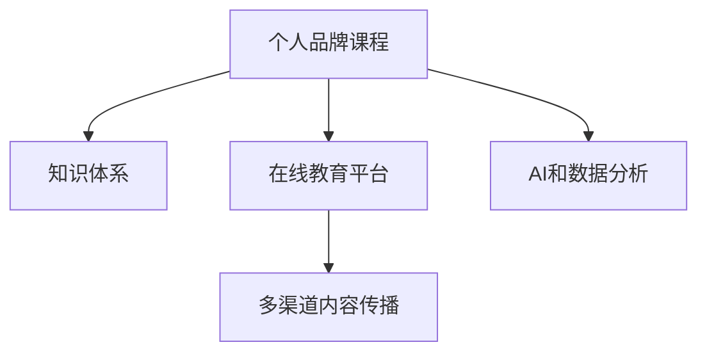

                 

# 开发个人品牌课程：系统化你的知识体系

> 关键词：
个人品牌课程，知识体系，在线教育，AI教育，技术传播

## 1. 背景介绍

### 1.1 问题由来
在当今快速发展的信息时代，个人品牌的建设已经成为个体在职场和社交网络中获得竞争优势的关键。特别是在技术领域，拥有系统化、结构化的知识体系，能够帮助技术专家更有效地展示自己的专业能力和深度思考。然而，如何系统化、结构化地呈现知识体系，并使之易于理解和学习，对许多人来说仍然是一个挑战。

在线教育平台和虚拟课堂的兴起，为个人品牌的课程开发提供了新的机会。传统的课程设计往往依赖于书籍、视频和讲座等单一媒介，难以提供全面的、互动式的学习体验。利用技术手段，如AI和数据科学，可以构建更为丰富、个性化的课程内容，帮助学员更高效地掌握知识。

### 1.2 问题核心关键点
个人品牌课程开发的核心在于如何构建一个系统化的知识体系，并将其通过线上平台传授给学员。这不仅需要深入理解课程内容和教育目标，还需要采用先进的技术手段，实现内容的结构化呈现和动态交互。

具体而言，核心关键点包括：
- 知识体系的构建：将复杂的概念和知识点，以逻辑清晰、层次分明的方式组织起来。
- 在线平台的搭建：利用先进的技术工具和框架，搭建易于使用的在线学习平台。
- 交互式学习的设计：通过AI和数据分析，提供个性化的学习路径和反馈，增强学员的参与度和学习效果。
- 内容传播的优化：采用多渠道、多形式的内容传播策略，扩大课程覆盖面，吸引更多学员。

## 2. 核心概念与联系

### 2.1 核心概念概述

为了更好地理解个人品牌课程开发的方法和步骤，本节将介绍几个关键概念：

- **个人品牌课程**：指以个人专长为核心，通过课程形式系统化呈现知识的在线教育产品。个人品牌课程不仅要传授知识，还要展示课程创作者的深度思考和专业能力。

- **知识体系**：指将一系列知识模块以逻辑结构化的方式组织起来，形成完整的知识框架。知识体系应具有连贯性和可扩展性，能够随着学科发展和技术进步而不断更新。

- **在线教育平台**：指利用互联网技术，提供在线课程学习的平台。这些平台通常支持多种交互方式，如视频讲座、文本笔记、讨论区等。

- **AI和数据分析**：指利用人工智能和数据分析技术，提升课程内容的个性化和互动性。AI可以用于推荐系统，数据分析可以用于评估学习效果和优化课程设计。

- **多渠道内容传播**：指通过多种渠道，如社交媒体、电子邮件、社区论坛等，扩大课程的影响力和覆盖面。多渠道传播有助于吸引更多学员，并提高课程的参与度和完成率。

这些核心概念之间的逻辑关系可以通过以下Mermaid流程图来展示：



这个流程图展示了几者之间的逻辑关系：

1. 个人品牌课程以知识体系为核心内容。
2. 在线教育平台提供课程的呈现和交互环境。
3. AI和数据分析用于提升课程的个性化和互动性。
4. 多渠道内容传播帮助课程覆盖更广的受众。

## 3. 核心算法原理 & 具体操作步骤

### 3.1 算法原理概述

个人品牌课程开发的核心在于如何构建一个系统化的知识体系，并将其通过线上平台传授给学员。具体来说，可以分为以下几个步骤：

- **知识体系的构建**：从课程目标出发，将知识点和概念以逻辑结构化的方式组织起来。
- **在线平台的搭建**：选择合适的技术栈和框架，搭建易于使用的在线学习平台。
- **AI和数据分析的应用**：利用AI和数据分析技术，提升课程内容的个性化和互动性。
- **多渠道内容传播**：通过多种渠道传播课程内容，扩大覆盖面。

### 3.2 算法步骤详解

#### 3.2.1 知识体系的构建

1. **确定课程目标**：明确课程旨在解决的问题或达成的目标，如掌握某种编程语言、理解机器学习的基本原理等。

2. **模块划分**：将课程内容划分为若干模块，每个模块聚焦于一个或多个相关知识点。模块之间应具有逻辑上的连贯性。

3. **知识点细化**：将每个模块进一步细化为具体的知识点，如编程语言的语法、机器学习的基本算法等。

4. **构建知识网络**：将知识点以图的形式表示，展示知识点之间的关联和依赖关系。

#### 3.2.2 在线平台的搭建

1. **选择技术栈**：根据课程需求，选择合适的技术栈，如React、Flask等。

2. **设计课程结构**：根据知识体系，设计课程的逻辑结构，包括课程章节、子章节等。

3. **开发前端界面**：开发课程的前端界面，实现课程的展示和交互功能。

4. **搭建后端服务**：搭建课程的后端服务，负责课程内容的管理、学员信息的存储和交互数据的处理。

#### 3.2.3 AI和数据分析的应用

1. **个性化推荐系统**：利用AI技术，根据学员的学习历史和行为数据，推荐个性化的学习路径和内容。

2. **学习效果分析**：利用数据分析技术，评估学员的学习效果，识别学习难点，优化课程内容。

3. **情感分析与反馈**：利用自然语言处理技术，分析学员在学习过程中的反馈，及时调整课程内容和教学方法。

#### 3.2.4 多渠道内容传播

1. **社交媒体推广**：在社交媒体平台发布课程相关信息，吸引潜在学员。

2. **邮件营销**：向潜在学员发送课程介绍邮件，提供免费试听或优惠折扣。

3. **社区论坛互动**：在技术论坛或社区发布课程内容，吸引学员讨论和参与。

### 3.3 算法优缺点

**优点**：
- 系统化、结构化的知识体系，有助于学员快速掌握课程内容。
- 利用AI和数据分析，提供个性化和互动性强的学习体验。
- 多渠道内容传播，有助于扩大课程覆盖面，吸引更多学员。

**缺点**：
- 开发周期长，技术要求高。
- 课程内容和呈现形式可能受限于平台技术。
- 学员的学习效果和反馈收集需要持续优化。

### 3.4 算法应用领域

个人品牌课程开发技术广泛应用于多个领域，例如：

- **技术教育**：为编程、数据科学、机器学习等技术课程提供系统化的学习路径。
- **职业培训**：提供面向特定职业技能的课程，如项目管理、产品设计等。
- **在线辅导**：通过实时互动和个性化推荐，提升在线辅导的效果。
- **企业内部培训**：为内部员工提供系统的专业知识培训，提升团队整体能力。

除了以上领域，个人品牌课程开发技术还在企业培训、学术教育、科普传播等多个场景中得到应用。随着在线教育市场的不断扩大，个人品牌课程开发将具有更广阔的应用前景。

## 4. 数学模型和公式 & 详细讲解 & 举例说明

### 4.1 数学模型构建

为更好地理解个人品牌课程开发的方法和步骤，本节将从数学模型的角度对课程开发过程进行详细讲解。

- **知识体系的数学模型**：可以将知识点表示为节点，知识点之间的依赖关系表示为边，构建知识图谱。
- **课程结构的数学模型**：可以采用树形结构或图结构表示课程章节和子章节的关系。
- **学员学习效果的数学模型**：可以采用时间序列分析或分类模型评估学员的学习效果，识别学习难点。

### 4.2 公式推导过程

以下是知识体系构建和课程结构设计的数学模型推导过程：

1. **知识图谱构建**：
   - 知识点表示为节点：$N=\{n_1, n_2, \ldots, n_m\}$
   - 知识点之间的关系表示为边：$E=\{e_{ij}\}$
   - 知识点之间的关系权重表示为$w_{ij}$

2. **课程结构设计**：
   - 课程章节表示为节点：$C=\{c_1, c_2, \ldots, c_k\}$
   - 章节之间的关系表示为边：$E=\{e_{cij}\}$
   - 章节之间的关系权重表示为$w_{cij}$

3. **学员学习效果分析**：
   - 学员学习进度表示为时间序列：$S=\{s_1, s_2, \ldots, s_n\}$
   - 学员学习效果表示为分类：$L=\{l_1, l_2, \ldots, l_n\}$
   - 学习效果和进度之间的关系表示为回归模型或分类模型：$f(S, L)$

### 4.3 案例分析与讲解

以一个面向数据科学课程为例，分析其知识体系的构建和课程结构的设计：

1. **知识体系的构建**：
   - 课程目标：掌握Python编程、数据预处理、机器学习算法等。
   - 模块划分：分为数据预处理、基础算法、高级算法等模块。
   - 知识点细化：每个模块包含多个具体知识点，如Python基本语法、数据清洗技巧、线性回归算法等。
   - 知识网络：构建知识图谱，展示各知识点之间的依赖关系。

2. **课程结构的数学模型**：
   - 课程章节：第一章数据预处理、第二章基础算法、第三章高级算法等。
   - 章节之间的关系：第一章包含数据清洗、数据可视化等内容，第二章介绍基础算法如线性回归、决策树等，第三章深入学习深度学习算法。
   - 章节之间的关系权重：根据知识点难度和相关性，设定不同章节之间的权重关系。

## 5. 项目实践：代码实例和详细解释说明

### 5.1 开发环境搭建

在进行个人品牌课程开发前，我们需要准备好开发环境。以下是使用Python和React进行前端开发的开发环境配置流程：

1. **安装Node.js和React**：
   - 下载并安装Node.js和React。
   - 安装React相关的依赖库，如ReactDOM、React Router等。

2. **安装Python和Flask**：
   - 下载并安装Python和Flask。
   - 安装Flask相关的依赖库，如SQLAlchemy、Flask-WTF等。

3. **搭建开发环境**：
   - 配置Git版本控制。
   - 使用IDE如PyCharm或VS Code进行开发。
   - 搭建虚拟服务器，运行开发环境。

完成上述步骤后，即可在虚拟服务器上开始课程开发实践。

### 5.2 源代码详细实现

以下是一个简单的个人品牌课程开发项目示例，包括前端和后端的部分代码实现：

**前端代码实现**：
```javascript
import React from 'react';
import ReactDOM from 'react-dom';
import { BrowserRouter, Route, Switch } from 'react-router-dom';
import Home from './components/Home';
import About from './components/About';
import Contact from './components/Contact';

ReactDOM.render(
  <BrowserRouter>
    <div>
      <Switch>
        <Route exact path="/" component={Home} />
        <Route exact path="/about" component={About} />
        <Route exact path="/contact" component={Contact} />
      </Switch>
    </div>
  </BrowserRouter>,
  document.getElementById('root')
);
```

**后端代码实现**：
```python
from flask import Flask, render_template
app = Flask(__name__)

@app.route('/')
def home():
    return render_template('home.html')

@app.route('/about')
def about():
    return render_template('about.html')

@app.route('/contact')
def contact():
    return render_template('contact.html')

if __name__ == '__main__':
    app.run(debug=True)
```

### 5.3 代码解读与分析

让我们再详细解读一下关键代码的实现细节：

**前端代码**：
- 使用React组件化的方式，搭建前端页面。
- 利用React Router进行路由管理，实现页面跳转功能。

**后端代码**：
- 使用Flask框架搭建后端服务，提供路由和模板渲染功能。
- 定义了三个路由，分别对应课程的首页、关于页和联系页。
- 通过模板渲染功能，输出对应的HTML页面。

通过以上代码示例，可以看到React和Flask的组合，可以构建一个基本的个人品牌课程的前端和后端系统。实际开发中，还需要进一步扩展和优化，以满足课程的复杂需求。

### 5.4 运行结果展示

以下是运行以上代码后的预期结果：

- 首页：展示课程介绍和目录。
- 关于页：展示课程开发者和课程目标。
- 联系页：提供课程联系信息和反馈渠道。

## 6. 实际应用场景

### 6.1 技术教育

个人品牌课程开发技术在技术教育领域具有广泛的应用前景。通过系统化的知识体系和互动式的学习体验，能够帮助学员更高效地掌握编程、数据科学等技术知识。例如，Google的在线编程课程、Udacity的机器学习课程等，都是利用个人品牌课程开发技术实现的。

### 6.2 职业培训

个人品牌课程开发技术可以应用于职业培训，帮助学员提升特定职业技能。例如，Coursera和edX等在线教育平台提供的各种职业认证课程，通过系统化的课程设计，帮助学员顺利通过职业资格考试，提升职场竞争力。

### 6.3 在线辅导

个人品牌课程开发技术可以用于在线辅导，通过实时互动和个性化推荐，提升辅导效果。例如，Khan Academy和Coursera等平台提供的一对一在线辅导课程，利用课程开发技术实现学员和导师之间的互动和反馈。

### 6.4 企业内部培训

个人品牌课程开发技术可以用于企业内部培训，提升员工的专业技能。例如，阿里巴巴和华为等企业提供的技术培训课程，通过系统化的课程设计和互动学习，提升团队的整体技术水平。

### 6.5 学术教育

个人品牌课程开发技术可以应用于学术教育，提供高质量的在线课程。例如，MIT和斯坦福大学等名校的公开课，通过系统化的课程设计和互动学习，帮助全球学员获取高质量的教育资源。

## 7. 工具和资源推荐

### 7.1 学习资源推荐

为了帮助开发者系统掌握个人品牌课程开发的方法和工具，这里推荐一些优质的学习资源：

1. **《在线教育设计与开发》**：一本系统介绍在线教育设计原理和实践的书籍，涵盖课程设计、学习体验设计等方面。

2. **《Python编程：从入门到实践》**：一本介绍Python编程语言基础和高级编程技巧的书籍，是开发技术课程的必备参考资料。

3. **《数据科学实战》**：一本涵盖数据预处理、机器学习算法等数据科学基础知识的书籍，适合开发数据科学课程。

4. **Coursera、edX等在线教育平台**：这些平台提供丰富的课程资源和开发工具，可以帮助开发者更好地掌握课程开发技术。

5. **Google开发者社区**：一个丰富的开发者资源平台，提供最新的编程语言、框架和工具的介绍和使用指南。

通过学习这些资源，相信你一定能够快速掌握个人品牌课程开发的方法和技巧，并用于解决实际的课程开发问题。

### 7.2 开发工具推荐

高效的开发离不开优秀的工具支持。以下是几款用于个人品牌课程开发的常用工具：

1. **Visual Studio Code**：一款轻量级、功能强大的IDE，支持多种编程语言和框架。
2. **Git**：一款版本控制系统，帮助开发者进行代码管理和版本控制。
3. **Docker**：一个容器化技术，帮助开发者构建和部署应用。
4. **Jupyter Notebook**：一个支持Python、R等多种编程语言的交互式开发环境，适合数据科学课程开发。
5. **Loomio**：一个协作工具，支持团队成员之间的实时互动和反馈。

合理利用这些工具，可以显著提升个人品牌课程开发的效率和质量，加快创新迭代的步伐。

### 7.3 相关论文推荐

个人品牌课程开发技术的发展源于学界的持续研究。以下是几篇奠基性的相关论文，推荐阅读：

1. **《基于知识图谱的在线教育系统》**：探讨了基于知识图谱的在线教育系统设计，介绍了如何利用知识图谱提高课程的连贯性和可扩展性。

2. **《交互式学习系统的设计与实现》**：介绍了交互式学习系统的设计和实现方法，利用AI技术提升学员的学习效果。

3. **《多渠道内容传播的策略研究》**：探讨了多渠道内容传播的策略和方法，帮助课程覆盖更广泛的受众。

4. **《基于推荐系统的个性化学习》**：介绍了一种基于推荐系统的个性化学习算法，帮助学员找到最适合自己的学习路径。

这些论文代表了大规模在线教育系统的研究方向，通过学习这些前沿成果，可以帮助研究者把握学科前进方向，激发更多的创新灵感。

## 8. 总结：未来发展趋势与挑战

### 8.1 总结

本文对个人品牌课程开发的方法和步骤进行了详细讲解。从知识体系的构建到在线平台的搭建，再到AI和数据分析的应用，系统化地介绍了个人品牌课程开发的完整过程。通过具体的代码示例和实际应用场景，展示了个人品牌课程开发技术的广泛应用前景。

通过本文的系统梳理，可以看到，个人品牌课程开发技术正在成为教育技术的重要范式，极大地拓展了在线教育的应用边界，为技术专家提供了一个展示专业能力和深度思考的平台。未来，伴随技术的不断进步，个人品牌课程开发技术必将迎来更多创新，为教育产业带来更深刻的变革。

### 8.2 未来发展趋势

展望未来，个人品牌课程开发技术将呈现以下几个发展趋势：

1. **技术自动化和智能化**：未来的课程开发将更加依赖自动化工具和智能化系统，提升开发效率和课程质量。
2. **个性化和互动性**：通过AI和数据分析，提供更加个性化和互动性的学习体验，提升学员的学习效果。
3. **多模态学习**：利用多模态学习技术，结合文本、视频、音频等多种形式的内容，丰富课程内容。
4. **实时反馈与评估**：利用实时反馈和评估技术，及时调整课程内容和教学方法，提高课程效果。
5. **全球化和本地化**：结合全球和本地需求，提供差异化的课程内容，适应不同文化和教育需求。

这些趋势展示了个人品牌课程开发技术的未来发展方向，必将推动在线教育向更加高效、个性化、多模态的方向发展。

### 8.3 面临的挑战

尽管个人品牌课程开发技术已经取得了瞩目成就，但在迈向更加智能化、普适化应用的过程中，它仍面临着诸多挑战：

1. **技术门槛高**：课程开发需要深入理解课程内容和教育目标，掌握多种技术和工具，对开发者要求较高。
2. **内容质量控制**：课程内容需要持续更新和优化，以适应学科发展和技术进步，这对课程开发者提出了更高的要求。
3. **学员参与度低**：学员的参与度和学习效果需要持续优化，如何提升互动性和参与度，仍需更多探索。
4. **数据隐私和安全**：在多渠道传播过程中，如何保护学员的隐私和数据安全，仍需更多技术和政策保障。

这些挑战需要开发者和教育专家共同努力，通过持续优化课程设计、技术手段和教学方法，逐步克服这些难题。

### 8.4 研究展望

面向未来，个人品牌课程开发技术的研究方向包括：

1. **AI驱动的个性化学习**：利用AI技术，提供更加个性化和自适应的学习路径。
2. **多模态学习的融合**：结合文本、视频、音频等多种形式的内容，丰富课程形式。
3. **实时反馈和动态调整**：利用实时反馈和数据分析，动态调整课程内容和教学方法。
4. **全球化和本地化结合**：提供差异化的课程内容，适应不同文化和教育需求。
5. **开源课程的开发与共享**：鼓励开发者开放源代码，共同构建全球开放课程平台。

这些研究方向将引领个人品牌课程开发技术的持续进步，推动在线教育技术的普及和发展。

## 9. 附录：常见问题与解答

**Q1：开发个人品牌课程需要哪些关键技术？**

A: 开发个人品牌课程需要以下关键技术：
- 前端技术：如React、Vue等，用于搭建课程界面。
- 后端技术：如Flask、Django等，用于管理课程数据和处理请求。
- 数据库技术：如SQL、NoSQL等，用于存储课程内容和学员信息。
- 数据分析技术：如Python、R等，用于评估学员学习效果和优化课程内容。
- AI技术：如自然语言处理、推荐系统等，用于提升课程的个性化和互动性。

**Q2：如何评估学员的学习效果？**

A: 评估学员学习效果的方法包括：
- 时间序列分析：通过学员的学习进度和时间节点，评估学习效果。
- 分类模型：利用机器学习算法，预测学员是否掌握了特定知识点。
- 情感分析：利用自然语言处理技术，分析学员在学习过程中的反馈和情感。
- 多维评价：结合知识测试、项目作业等多种评价方式，全面评估学员学习效果。

**Q3：如何提高学员的参与度和学习效果？**

A: 提高学员参与度和学习效果的方法包括：
- 交互式学习：利用AI和数据分析，提供个性化推荐和实时反馈。
- 社区互动：在课程论坛或社交媒体上鼓励学员讨论和交流。
- 视频讲解：利用高质量的课程视频，提升学员的理解和兴趣。
- 互动活动：通过小测验、竞赛等互动活动，提升学员的参与度。

**Q4：个人品牌课程开发的难点有哪些？**

A: 个人品牌课程开发的难点包括：
- 课程设计：需要深入理解课程内容和教育目标，设计合理的知识体系和课程结构。
- 技术实现：需要掌握多种技术和工具，如前端框架、后端框架、数据库等。
- 内容更新：需要持续更新和优化课程内容，以适应学科发展和技术进步。
- 学员反馈：需要及时收集和分析学员反馈，优化课程设计和技术实现。

这些难点需要开发者和教育专家共同努力，通过不断优化和创新，逐步克服这些难题。

---

作者：禅与计算机程序设计艺术 / Zen and the Art of Computer Programming

