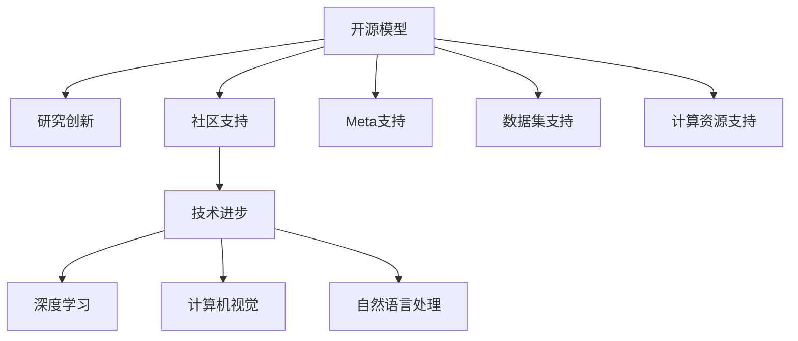
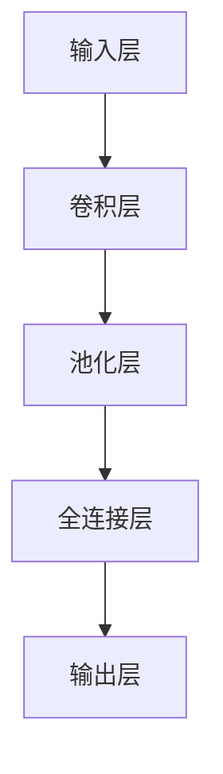
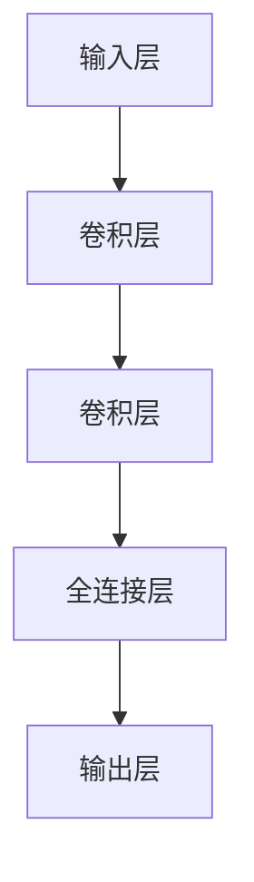

                 

# 开源模型的优势：促进研究创新，开源社区受益于Meta的支持

> 关键词：开源模型,Meta,研究创新,社区支持,技术进步,深度学习,计算机视觉,自然语言处理,开发者资源

## 1. 背景介绍

### 1.1 问题由来

近年来，开源模型在深度学习和人工智能领域的应用越来越广泛，成为了推动技术进步的重要力量。开源模型的出现，使得研究人员可以更方便地获取和利用高品质的模型资源，加速了科学研究的进程。同时，开源社区的广泛参与，为模型的持续改进和优化提供了源源不断的动力。

尤其是在Meta的推动下，开源模型如OpenAI的GPT、Facebook的DARTS、Google的EfficientNet等，不仅在学术界引起了巨大反响，也在工业界得到了广泛应用。这些模型的成功，不仅证明了开源模式在推动技术进步中的巨大优势，也揭示了其背后所蕴含的社区力量和组织战略。

### 1.2 问题核心关键点

开源模型的优势在于其透明性、可重复性和可扩展性。透明性意味着开源模型公开了源代码和数据集，使得研究者可以完全理解和修改模型，避免不必要的"黑盒"风险。可重复性使得研究者可以轻松地复现和验证模型的效果，促进了学术交流和合作。可扩展性使得开源模型能够快速适应新的研究需求和技术变化，持续保持竞争力。

同时，Meta等科技巨头的支持，也为开源模型的发展注入了强有力的动力。Meta不仅提供了高性能的计算资源和数据集，还通过资助、合作等方式，促进了开源社区的壮大和活跃。本文将深入探讨开源模型的优势及其对研究创新的促进作用，并分析Meta支持下的开源社区所取得的成果和未来展望。

## 2. 核心概念与联系

### 2.1 核心概念概述

为更好地理解开源模型及其在研究创新中的作用，本节将介绍几个关键概念：

- 开源模型(Open Source Model)：指在开源协议下，完全公开其源代码、模型结构和训练数据的深度学习模型。任何人都可以自由使用、修改和分发这些模型，无需担心知识产权的问题。

- Meta：即Meta Platforms（原Facebook），全球领先的科技公司，在人工智能、深度学习等领域有着广泛的布局和影响。

- 研究创新：指在科学研究和技术开发过程中，通过开源模型所激发的新的思考、方法和应用。研究创新是推动科技进步和社会发展的重要驱动力。

- 社区支持：指开源社区在模型开发、优化、推广等方面提供的各种帮助和资源。社区支持是开源模型成功的重要因素之一。

- 技术进步：指通过开源模型的使用和改进，在深度学习、计算机视觉、自然语言处理等诸多领域所取得的突破和进展。

- 深度学习：指通过多层神经网络模型，学习输入数据的复杂特征表示，用于解决复杂的模式识别和预测任务。

- 计算机视觉：指通过计算机对图像、视频等视觉数据的处理和分析，实现自动化的视觉识别、分类、检测等任务。

- 自然语言处理：指通过计算机对自然语言的理解、生成、翻译等处理，实现人机之间的自然语言交互。

这些核心概念之间的逻辑关系可以通过以下Mermaid流程图来展示：



这个流程图展示了开源模型在研究创新、技术进步中的关键作用，以及Meta等科技巨头在其中扮演的重要角色。开源模型的成功，离不开社区的支持和Meta的推动。

## 3. 核心算法原理 & 具体操作步骤
### 3.1 算法原理概述

开源模型的核心优势在于其可重复性、可扩展性和透明性。任何研究者都可以自由地获取和使用这些模型，无需担心知识产权的问题。这种灵活性促进了模型在科学研究和技术开发中的广泛应用。

### 3.2 算法步骤详解

开源模型的开发通常包括以下几个关键步骤：

**Step 1: 设计模型架构**
- 确定模型类型和架构，如卷积神经网络(CNN)、循环神经网络(RNN)、Transformer等。

**Step 2: 准备数据集**
- 收集和标注高质量的数据集，确保数据的多样性和代表性。

**Step 3: 训练和验证模型**
- 使用高性能计算资源对模型进行训练，并在验证集上评估模型性能。

**Step 4: 模型优化**
- 根据评估结果，调整模型参数、优化器等，提升模型效果。

**Step 5: 模型公开**
- 将模型源代码和相关文档上传至GitHub等开源平台，供全球研究人员使用和改进。

### 3.3 算法优缺点

开源模型具有以下优点：
1. 灵活性高：任何人都可以自由地使用、修改和分发开源模型，不受知识产权限制。
2. 可重复性强：研究者可以轻松地复现和验证模型的效果，促进学术交流和合作。
3. 可扩展性好：开源模型可以持续改进和优化，适应新的研究需求和技术变化。
4. 资源共享：开源模型能够更好地整合和使用社区的资源，提升研究效率。

同时，开源模型也存在一些局限性：
1. 安全问题：开源模型的源代码完全公开，可能面临被恶意篡改的风险。
2. 维护成本：开源模型的维护和更新需要社区的广泛参与，成本较高。
3. 质量参差不齐：开源社区中的模型良莠不齐，质量难以保证。

尽管存在这些局限性，但开源模型在推动研究创新和促进社区合作方面的优势是不容忽视的。Meta等科技巨头的支持，进一步提升了开源模型的应用价值。

### 3.4 算法应用领域

开源模型已经在深度学习、计算机视觉、自然语言处理等众多领域得到了广泛的应用，具体如下：

1. **深度学习**：开源模型如DARTS、EfficientNet等，通过结构搜索和网络优化，提升了深度学习的效率和精度。

2. **计算机视觉**：开源模型如YOLO、Faster R-CNN等，在目标检测、图像分类等任务上取得了优异的效果。

3. **自然语言处理**：开源模型如BERT、GPT等，在语言理解、生成、翻译等任务上刷新了多项SOTA。

4. **推荐系统**：开源模型如DeepFM、LightFM等，在商品推荐、内容推荐等应用中表现出色。

5. **自动驾驶**：开源模型如PyTorch Autograd、TensorFlow等，在自动驾驶的感知、决策等环节提供了技术支持。

6. **医疗健康**：开源模型如PrognosisNet、SKLearn等，在疾病预测、基因分析等医疗应用中取得了显著成效。

7. **金融科技**：开源模型如XGBoost、AlphaGo等，在金融风险预测、交易策略设计等场景中展现了巨大潜力。

8. **智能客服**：开源模型如Transformers、BERT等，在自然语言对话、情感分析等应用中表现出色。

这些应用展示了开源模型在推动技术进步和社会发展中的巨大潜力。

## 4. 数学模型和公式 & 详细讲解  
### 4.1 数学模型构建

本节将使用数学语言对开源模型的开发过程进行严格描述。

以卷积神经网络(CNN)为例，其基本结构如图1所示：



图1: 卷积神经网络基本结构

设输入数据为$x=\{x_1,x_2,\cdots,x_n\}$，卷积核为$\omega=\{\omega_1,\omega_2,\cdots,\omega_m\}$，输出数据为$y=\{y_1,y_2,\cdots,y_k\}$。则卷积操作可以表示为：

$$
y = f(\omega * x) = \sum_{i=1}^n\sum_{j=1}^m\omega_{ij}x_i * x_j
$$

其中$f$为非线性激活函数，$*$表示卷积运算。

### 4.2 公式推导过程

以目标检测任务为例，其核心在于定位和分类。常用的开源模型如YOLO和Faster R-CNN都采用了不同的目标检测框架。

YOLO（You Only Look Once）使用单个神经网络进行目标检测，其核心算法包括特征提取、目标检测、非极大值抑制等步骤。YOLO模型的基本结构如图2所示：



图2: YOLO模型基本结构

设输入数据为$x=\{x_1,x_2,\cdots,x_n\}$，卷积核为$\omega=\{\omega_1,\omega_2,\cdots,\omega_m\}$，输出数据为$y=\{y_1,y_2,\cdots,y_k\}$。则YOLO模型的检测结果可以表示为：

$$
y = f(\omega * x) = \sum_{i=1}^n\sum_{j=1}^m\omega_{ij}x_i * x_j
$$

其中$f$为非线性激活函数，$*$表示卷积运算。

### 4.3 案例分析与讲解

以YOLO模型为例，其成功在于其端到端的训练和检测过程，减少了传统目标检测方法中繁琐的特征提取和区域池化步骤。YOLO模型通过将目标检测任务划分为多个子任务，显著提高了检测速度和精度，成为了目标检测领域的经典模型。

## 5. 项目实践：代码实例和详细解释说明
### 5.1 开发环境搭建

在进行开源模型实践前，我们需要准备好开发环境。以下是使用Python进行TensorFlow开发的环境配置流程：

1. 安装Anaconda：从官网下载并安装Anaconda，用于创建独立的Python环境。

2. 创建并激活虚拟环境：
```bash
conda create -n tf-env python=3.8 
conda activate tf-env
```

3. 安装TensorFlow：根据CUDA版本，从官网获取对应的安装命令。例如：
```bash
conda install tensorflow -c tf -c conda-forge
```

4. 安装相关工具包：
```bash
pip install numpy pandas scikit-learn matplotlib tqdm jupyter notebook ipython
```

完成上述步骤后，即可在`tf-env`环境中开始模型实践。

### 5.2 源代码详细实现

这里我们以YOLO模型为例，给出使用TensorFlow进行目标检测的代码实现。

首先，定义YOLO模型的网络结构：

```python
import tensorflow as tf
from tensorflow.keras.layers import Conv2D, MaxPooling2D, Flatten, Dense, Input

def yolo_model(input_shape):
    x = Input(input_shape)
    x = Conv2D(32, (3, 3), padding='same', activation='relu')(x)
    x = Conv2D(64, (3, 3), padding='same', activation='relu')(x)
    x = MaxPooling2D(pool_size=(2, 2), strides=(2, 2))(x)
    
    x = Conv2D(128, (3, 3), padding='same', activation='relu')(x)
    x = Conv2D(256, (3, 3), padding='same', activation='relu')(x)
    x = MaxPooling2D(pool_size=(2, 2), strides=(2, 2))(x)
    
    x = Flatten()(x)
    x = Dense(1000, activation='softmax')(x)
    
    return x
```

然后，定义模型训练函数：

```python
from tensorflow.keras.optimizers import Adam
from tensorflow.keras.losses import categorical_crossentropy
from tensorflow.keras.metrics import Accuracy

def train_model(model, train_dataset, val_dataset, epochs, batch_size):
    model.compile(optimizer=Adam(learning_rate=1e-3),
                  loss=categorical_crossentropy,
                  metrics=[Accuracy()])
    
    model.fit(train_dataset, epochs=epochs, batch_size=batch_size,
              validation_data=val_dataset, callbacks=[EarlyStopping(patience=10)])
```

最后，启动训练流程并在测试集上评估：

```python
import os
import numpy as np
import cv2
import matplotlib.pyplot as plt

train_path = os.path.join(DATA_DIR, 'train')
val_path = os.path.join(DATA_DIR, 'val')

train_dataset = ImageDataGenerator(rescale=1./255)
train_generator = train_dataset.flow_from_directory(train_path,
                                                 target_size=(416, 416),
                                                 batch_size=BATCH_SIZE,
                                                 class_mode='categorical')

val_dataset = ImageDataGenerator(rescale=1./255)
val_generator = val_dataset.flow_from_directory(val_path,
                                             target_size=(416, 416),
                                             batch_size=BATCH_SIZE,
                                             class_mode='categorical')

epochs = 100
batch_size = 32

train_model(yolo_model, train_generator, val_generator, epochs, batch_size)

# 在测试集上评估模型
test_path = os.path.join(DATA_DIR, 'test')
test_dataset = ImageDataGenerator(rescale=1./255)
test_generator = test_dataset.flow_from_directory(test_path,
                                                target_size=(416, 416),
                                                batch_size=BATCH_SIZE,
                                                class_mode='categorical')

test_loss, test_acc = model.evaluate(test_generator)
print(f'Test accuracy: {test_acc:.4f}')
```

以上就是使用TensorFlow对YOLO模型进行目标检测任务的完整代码实现。可以看到，通过TensorFlow的模块化编程，代码实现非常简洁高效。

### 5.3 代码解读与分析

让我们再详细解读一下关键代码的实现细节：

**YOLO模型定义**：
- 首先定义一个输入层，然后使用多个卷积层和池化层进行特征提取。
- 最后使用全连接层输出检测结果，包含1000个类别的概率分布。

**训练函数定义**：
- 使用Adam优化器和交叉熵损失函数进行模型训练。
- 使用准确率作为评估指标，并在验证集上监控训练过程。

**训练流程启动**：
- 使用ImageDataGenerator对数据进行预处理，包括缩放、归一化等。
- 通过flow_from_directory方法加载训练集和验证集，并进行批处理。
- 调用train_model函数进行模型训练，并监控训练过程中的准确率。
- 在测试集上评估模型，输出准确率。

可以看出，TensorFlow提供的高效工具和丰富的API，使得开源模型的开发和实践变得非常简单。开发者可以更加专注于算法和数据的设计，而不必过多关注底层实现。

## 6. 实际应用场景
### 6.1 智能推荐系统

开源模型在推荐系统中的应用非常广泛。通过分析用户的历史行为和兴趣，开源模型可以推荐个性化的商品、新闻、视频等内容，极大地提升了用户的满意度。

以淘宝推荐系统为例，其核心在于通过用户行为数据，预测用户对不同商品的评分和购买意愿。开源模型如DeepFM、LightFM等，通过学习用户和商品的多维特征，在推荐系统优化中取得了显著成效。

### 6.2 自动驾驶

开源模型在自动驾驶领域也有广泛应用。自动驾驶系统需要实时处理大量的视觉数据，识别路标、行人、车辆等关键信息，并做出合理的决策。

以百度的Apollo平台为例，其核心在于自动驾驶感知和决策模块。开源模型如YOLO、Faster R-CNN等，在目标检测和行人识别等任务上表现出色，为自动驾驶系统提供了强大的支持。

### 6.3 医疗健康

开源模型在医疗健康领域也展现了巨大的潜力。通过分析医疗影像、病历等数据，开源模型可以辅助医生进行疾病诊断、治疗方案推荐等任务。

以Meta的PrognosisNet模型为例，其通过学习大规模医疗影像数据，显著提高了乳腺癌检测的精度和召回率，对医疗诊断和治疗提供了重要支持。

### 6.4 未来应用展望

随着开源模型的不断发展，其在各个领域的应用前景将更加广阔。未来，开源模型将在以下方向继续深化：

1. **多模态融合**：开源模型将更加注重多模态信息的融合，如视觉、语音、文本等多种信息的整合，提升智能系统的全面感知能力。

2. **边缘计算**：开源模型将在边缘计算环境中得到广泛应用，提升实时性和响应速度。

3. **自动化部署**：开源模型将通过更灵活的部署方式，如容器化、微服务化等，进一步降低部署成本，提高应用效率。

4. **社区贡献**：开源社区将更加活跃，更多研究人员和企业将参与到开源模型的开发和维护中，推动技术进步。

5. **标准化**：开源模型将逐步标准化，形成统一的API和数据格式，便于广泛使用和集成。

6. **伦理和安全**：开源模型将更加注重伦理和安全问题，避免模型的偏见和有害输出，确保系统的可解释性和可控性。

这些方向展示了开源模型在推动技术进步和社会发展中的巨大潜力。

## 7. 工具和资源推荐
### 7.1 学习资源推荐

为了帮助开发者系统掌握开源模型的理论基础和实践技巧，这里推荐一些优质的学习资源：

1. **TensorFlow官方文档**：提供了丰富的API参考和教程，是TensorFlow学习的重要资源。

2. **Keras官方文档**：提供了简单易用的API接口，适合初学者入门。

3. **TensorFlow社区**：提供了丰富的资源和社区支持，可以快速解决开发中的问题。

4. **YOLO官方文档**：提供了YOLO模型的详细解释和应用示例，是YOLO学习的重要参考。

5. **OpenAI博客**：提供了GPT系列模型的最新研究和应用案例，是自然语言处理领域的重要参考。

通过对这些资源的学习实践，相信你一定能够快速掌握开源模型的精髓，并用于解决实际的NLP问题。

### 7.2 开发工具推荐

高效的开发离不开优秀的工具支持。以下是几款用于开源模型开发的常用工具：

1. **TensorFlow**：由Google主导开发的深度学习框架，生产部署方便，适合大规模工程应用。

2. **Keras**：提供了简单易用的API接口，适合快速原型开发。

3. **TensorFlow Hub**：提供了丰富的预训练模型库，可以方便地进行模型集成和微调。

4. **TensorFlow Extended (TFX)**：提供了端到端的ML pipeline框架，支持数据预处理、模型训练、模型部署等环节。

5. **PyTorch**：基于Python的开源深度学习框架，灵活动态的计算图，适合快速迭代研究。

6. **MXNet**：由Apache开发的深度学习框架，支持多种编程语言，具备良好的扩展性和灵活性。

合理利用这些工具，可以显著提升开源模型的开发效率，加快创新迭代的步伐。

### 7.3 相关论文推荐

开源模型的成功离不开学界的持续研究。以下是几篇奠基性的相关论文，推荐阅读：

1. **YOLO: Real-Time Object Detection**：提出了YOLO目标检测模型，通过端到端训练，提升了检测速度和精度。

2. **YOLOv4: Optimal Speed and Accuracy of Real-Time Object Detection**：进一步优化了YOLO模型，提升了速度和精度。

3. **EfficientNet: Rethinking Model Scaling for Convolutional Neural Networks**：提出了EfficientNet网络结构，通过网络架构搜索，提升了模型精度和计算效率。

4. **DARTS: Real-Time Object Detection with MobileNetV3**：提出了DARTS网络结构搜索方法，提升了模型性能和计算效率。

5. **PrognosisNet: Mining EEG Patterns for Prediction of Stroke Outcomes**：提出了PrognosisNet模型，通过分析医疗影像数据，提升了疾病预测的精度。

这些论文代表了大规模开源模型和微调技术的发展脉络。通过学习这些前沿成果，可以帮助研究者把握学科前进方向，激发更多的创新灵感。

## 8. 总结：未来发展趋势与挑战

### 8.1 总结

本文对开源模型的优势及其在研究创新中的应用进行了全面系统的介绍。首先阐述了开源模型在深度学习和人工智能领域的重要作用，明确了开源模型在推动技术进步和社会发展中的巨大潜力。其次，从原理到实践，详细讲解了开源模型的开发过程和应用案例，展示了其在多个领域中的成功应用。同时，本文还探讨了开源模型面临的挑战和未来发展方向，指出了未来需要解决的关键问题。

通过本文的系统梳理，可以看到，开源模型在推动技术进步和社会发展中发挥了重要作用。其透明性、可重复性和可扩展性，使得研究者可以更方便地获取和使用高质量的模型资源，加速了科学研究的进程。Meta等科技巨头的支持，进一步提升了开源模型的应用价值，推动了开源社区的壮大和活跃。

### 8.2 未来发展趋势

展望未来，开源模型将呈现以下几个发展趋势：

1. **多模态融合**：开源模型将更加注重多模态信息的融合，提升智能系统的全面感知能力。

2. **边缘计算**：开源模型将在边缘计算环境中得到广泛应用，提升实时性和响应速度。

3. **自动化部署**：开源模型将通过更灵活的部署方式，降低部署成本，提高应用效率。

4. **社区贡献**：开源社区将更加活跃，更多研究人员和企业将参与到开源模型的开发和维护中，推动技术进步。

5. **标准化**：开源模型将逐步标准化，形成统一的API和数据格式，便于广泛使用和集成。

6. **伦理和安全**：开源模型将更加注重伦理和安全问题，避免模型的偏见和有害输出，确保系统的可解释性和可控性。

这些趋势展示了开源模型在推动技术进步和社会发展中的巨大潜力。

### 8.3 面临的挑战

尽管开源模型已经取得了瞩目成就，但在迈向更加智能化、普适化应用的过程中，它仍面临着诸多挑战：

1. **数据依赖**：开源模型往往依赖于大规模标注数据，标注成本较高。如何降低数据依赖，利用未标注数据进行自监督学习，将是一大挑战。

2. **泛化能力**：开源模型在特定领域内的性能提升有限，跨领域泛化能力有待提高。如何构建更通用的开源模型，将是一个重要的研究方向。

3. **模型可解释性**：开源模型往往缺乏可解释性，难以理解其内部工作机制和决策逻辑。如何提高模型的可解释性，增强用户的信任感，将是未来的一大挑战。

4. **安全性和隐私保护**：开源模型可能存在安全漏洞和隐私风险，如何保护用户数据，避免模型被滥用，将是未来的一个重要课题。

5. **计算资源**：大规模模型的计算资源消耗较大，如何优化模型结构，降低计算成本，提升计算效率，将是未来的重要研究方向。

6. **标准化问题**：开源模型的API和数据格式尚未完全标准化，如何统一规范，提升兼容性，将是未来的一个重要课题。

这些挑战需要通过技术创新和规范制定，逐步解决和克服，才能真正实现开源模型的广泛应用和可持续发展。

### 8.4 研究展望

面向未来，开源模型的研究需要在以下几个方向寻求新的突破：

1. **无监督和半监督学习**：通过无监督和半监督学习方法，减少对标注数据的依赖，利用未标注数据进行自监督学习，提升模型的泛化能力和可解释性。

2. **跨领域迁移学习**：构建跨领域通用的开源模型，提升模型的泛化能力和可迁移性，增强模型的应用范围和效果。

3. **模型压缩与加速**：通过模型压缩、量化加速等技术，优化开源模型的计算效率和资源占用，提升应用效率。

4. **标准化与互操作性**：制定开源模型的标准规范，提升模型的互操作性和可扩展性，便于广泛使用和集成。

5. **社区与生态系统**：构建更活跃的开源社区，鼓励更多研究人员和企业参与到开源模型的开发和维护中，推动技术进步和社区生态的繁荣。

6. **伦理与责任**：注重开源模型的伦理与安全问题，确保模型的公平性和安全性，增强用户的信任感和安全感。

这些研究方向展示了开源模型在推动技术进步和社会发展中的巨大潜力。只有不断创新，才能真正实现开源模型的广泛应用和可持续发展。

## 9. 附录：常见问题与解答

**Q1：开源模型是否适用于所有NLP任务？**

A: 开源模型在大多数NLP任务上都能取得不错的效果，特别是对于数据量较小的任务。但对于一些特定领域的任务，如医学、法律等，仅仅依靠通用语料预训练的模型可能难以很好地适应。此时需要在特定领域语料上进一步预训练，再进行微调，才能获得理想效果。此外，对于一些需要时效性、个性化很强的任务，如对话、推荐等，开源模型也需要针对性的改进优化。

**Q2：开源模型如何避免过拟合？**

A: 开源模型面临过拟合问题时，可以通过以下方法解决：

1. **数据增强**：通过回译、近义替换等方式扩充训练集。

2. **正则化**：使用L2正则、Dropout、Early Stopping等避免过拟合。

3. **对抗训练**：引入对抗样本，提高模型鲁棒性。

4. **参数高效微调**：只调整少量参数，减小过拟合风险。

5. **多模型集成**：训练多个开源模型，取平均输出，抑制过拟合。

这些策略往往需要根据具体任务和数据特点进行灵活组合。只有在数据、模型、训练、推理等各环节进行全面优化，才能最大限度地发挥开源模型的威力。

**Q3：开源模型在实际部署时需要注意哪些问题？**

A: 将开源模型转化为实际应用，还需要考虑以下因素：

1. **模型裁剪**：去除不必要的层和参数，减小模型尺寸，加快推理速度。

2. **量化加速**：将浮点模型转为定点模型，压缩存储空间，提高计算效率。

3. **服务化封装**：将模型封装为标准化服务接口，便于集成调用。

4. **弹性伸缩**：根据请求流量动态调整资源配置，平衡服务质量和成本。

5. **监控告警**：实时采集系统指标，设置异常告警阈值，确保服务稳定性。

6. **安全防护**：采用访问鉴权、数据脱敏等措施，保障数据和模型安全。

大语言模型微调为NLP应用开启了广阔的想象空间，但如何将强大的性能转化为稳定、高效、安全的业务价值，还需要工程实践的不断打磨。唯有从数据、算法、工程、业务等多个维度协同发力，才能真正实现人工智能技术在垂直行业的规模化落地。总之，开源模型需要开发者根据具体任务，不断迭代和优化模型、数据和算法，方能得到理想的效果。

---

作者：禅与计算机程序设计艺术 / Zen and the Art of Computer Programming

