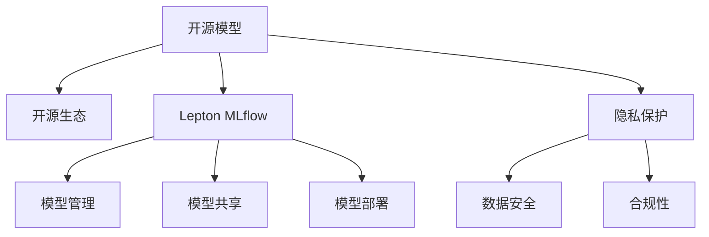

                 

# 开源模型的倡导者：Lepton AI的技术理念

> 关键词：开源模型,Lepton AI,Lepton MLflow,开源生态,自动机器学习,隐私保护

## 1. 背景介绍

### 1.1 问题由来

在AI时代，模型和算法成为了企业竞争的核心资产。然而，模型的开发和维护成本高昂，对人才和资源的需求巨大。同时，模型的复杂性和抽象性也导致了决策过程的不透明和难以解释。这些问题都成为了阻碍AI技术进一步普及和应用的主要障碍。

针对这一挑战，Lepton AI提出了开源模型的新理念，通过构建开源模型和生态，降低AI应用的门槛，促进AI技术的普及和应用。

### 1.2 问题核心关键点

Lepton AI的核心在于其开源模型和开源生态的构建，目标是提供一个开放、协作、高效的平台，使开发者能够轻松构建、分享和复用高质量的AI模型，并推动AI技术的进步和应用。

这一理念包含了以下几个关键点：

1. **开源模型**：提供开放源代码的AI模型，使开发者能够自由地下载、修改和使用，降低了模型开发和维护成本。
2. **开源生态**：构建一个开放的生态系统，汇聚全球的AI开发者、企业和研究机构，通过协作和分享推动AI技术的发展。
3. **Lepton MLflow**：提供完整的模型管理、共享和部署工具链，使开发者能够轻松地发布、管理和监控模型。
4. **隐私保护**：确保数据和模型的安全，保护用户隐私，符合监管要求。

### 1.3 问题研究意义

Lepton AI的开源模型理念具有深远的意义：

1. **降低门槛**：开源模型降低了AI应用的门槛，使更多企业和开发者能够快速进入AI领域。
2. **促进协作**：开源生态促进了全球AI开发者之间的协作，加速了AI技术的进步。
3. **提高效率**：通过共享和复用模型，减少了重复开发，提高了开发效率和模型质量。
4. **保障隐私**：确保数据和模型的安全，保护用户隐私，符合数据保护法规。
5. **推动应用**：开源模型和生态系统推动了AI技术在各行各业的普及和应用。

## 2. 核心概念与联系

### 2.1 核心概念概述

Lepton AI的核心理念围绕“开源模型和开源生态”展开，以下是几个关键概念：

1. **开源模型**：指开放源代码的AI模型，使得开发者能够自由地使用、修改和分发。
2. **开源生态**：指围绕开源模型构建的开放社区和协作平台，汇聚全球的AI开发者和研究机构。
3. **Lepton MLflow**：指用于模型管理、共享和部署的开源工具链，提供完整的工作流支持。
4. **隐私保护**：指确保数据和模型的安全，保护用户隐私，符合数据保护法规。

这些概念之间有着密切的联系，共同构成了Lepton AI的技术理念体系。

### 2.2 核心概念原理和架构的 Mermaid 流程图



这个流程图展示了Lepton AI技术理念的核心概念及其相互关系：

1. **开源模型**：提供开放源代码的AI模型，是整个生态的基础。
2. **开源生态**：构建开放的协作平台，汇聚全球开发者，推动模型的共享和复用。
3. **Lepton MLflow**：提供完整的工具链，支持模型的管理、共享和部署。
4. **隐私保护**：确保数据和模型的安全，保护用户隐私，符合监管要求。

这些概念共同构成了Lepton AI的技术理念框架，使得开发者能够在一个开放、协作、高效的环境中，构建、分享和复用高质量的AI模型。

## 3. 核心算法原理 & 具体操作步骤

### 3.1 算法原理概述

Lepton AI的开源模型理念，是基于数据驱动和协作开发的。其核心思想是：通过开放共享的模型和数据，推动全球AI开发者之间的协作，共同提升AI模型的质量和性能。

Lepton AI的开源模型和开源生态，采用了以下核心算法和操作步骤：

1. **数据共享和协作**：通过共享数据集和标注数据，促进全球AI开发者之间的协作。
2. **模型复用和改进**：开发者可以在已有模型的基础上进行改进和优化，避免重复劳动。
3. **模型发布和共享**：开发者可以将自己的模型发布到开源平台，供他人使用和改进。
4. **社区协作**：全球AI开发者可以自由地讨论、合作和分享，共同推动AI技术的发展。

### 3.2 算法步骤详解

Lepton AI的开源模型和开源生态，包括以下关键步骤：

**Step 1: 数据共享和标注**
- 收集和共享标注数据集，为开发者提供高质量的训练数据。
- 开发者可以在共享的数据集上进行训练和验证，提升模型的泛化能力。

**Step 2: 模型构建和改进**
- 开发者可以在已有模型基础上进行改进和优化，提升模型的性能。
- 开发者可以使用Lepton MLflow工具链，对模型进行发布和共享。

**Step 3: 模型发布和共享**
- 开发者可以将自己的模型发布到开源平台，供他人使用和改进。
- 模型可以在社区中自由传播和改进，推动模型的不断优化。

**Step 4: 社区协作和反馈**
- 全球AI开发者可以在开源社区中自由讨论、合作和分享，共同推动AI技术的发展。
- 开发者可以提交反馈和建议，帮助改进模型和工具链。

### 3.3 算法优缺点

Lepton AI的开源模型和开源生态，具有以下优点：

1. **降低成本**：共享数据和模型，降低了AI应用的开发和维护成本。
2. **提高效率**：复用已有模型和工具链，减少了重复开发，提高了开发效率。
3. **促进协作**：全球开发者自由讨论和合作，推动了AI技术的进步。
4. **提升质量**：社区中的反馈和改进，提升了模型的质量和性能。

然而，该模型也存在一些缺点：

1. **安全风险**：数据和模型的开放共享可能带来安全风险，需要采取措施保护数据和模型的安全。
2. **隐私问题**：数据的开放共享可能涉及隐私问题，需要符合数据保护法规。
3. **复杂性**：开源生态的复杂性可能导致管理和协作上的困难。

### 3.4 算法应用领域

Lepton AI的开源模型和开源生态，广泛应用于以下几个领域：

1. **自然语言处理(NLP)**：通过共享预训练模型和数据集，推动NLP技术的进步。
2. **计算机视觉(CV)**：共享模型和数据集，加速CV技术的开发和应用。
3. **自动机器学习(AutoML)**：提供模型和工具链，简化AutoML的开发和应用。
4. **医疗健康**：共享医疗数据和模型，推动医疗健康领域的应用。
5. **金融科技**：共享金融数据和模型，推动金融科技的发展。

## 4. 数学模型和公式 & 详细讲解 & 举例说明

### 4.1 数学模型构建

Lepton AI的开源模型理念，可以基于数学模型进行详细构建。以下是几个关键数学模型：

1. **数据共享模型**：通过共享数据集和标注数据，提升模型的泛化能力。
2. **模型改进模型**：通过改进已有模型，提升模型的性能。
3. **模型发布模型**：通过发布模型和工具链，促进模型的共享和复用。
4. **社区协作模型**：通过社区讨论和反馈，提升模型的质量和性能。

### 4.2 公式推导过程

以下是对这些数学模型进行详细推导的过程：

**数据共享模型**：

设数据集为 $D = \{(x_i, y_i)\}_{i=1}^N$，其中 $x_i$ 为输入，$y_i$ 为标签。共享数据集可以表示为：

$$
D_{shared} = \{(x_i, y_i)\}_{i=1}^N
$$

**模型改进模型**：

设初始模型为 $M_0$，改进后的模型为 $M$。改进过程可以表示为：

$$
M = M_0 + \delta
$$

其中 $\delta$ 为改进的参数，可以是手动调参、自动调参等。

**模型发布模型**：

设发布的模型为 $M_{published}$，可以表示为：

$$
M_{published} = M + \epsilon
$$

其中 $\epsilon$ 为发布时的噪声，可以用于模型版本控制和版本管理。

**社区协作模型**：

社区协作可以通过讨论和反馈进行，反馈可以表示为：

$$
F = F_0 + \delta_{feedback}
$$

其中 $F_0$ 为初始反馈，$\delta_{feedback}$ 为社区成员的改进建议。

### 4.3 案例分析与讲解

以下是几个关键案例，展示了Lepton AI开源模型和开源生态的应用：

**案例1：NLP任务共享**

某NLP研究团队共享了预训练的BERT模型和相应的数据集，其他团队可以在其基础上进行改进和优化，提升了NLP任务的性能。

**案例2：计算机视觉任务复用**

某计算机视觉研究团队复用了预训练的ResNet模型，并使用自己的数据集进行了微调，提升了图像分类的准确率。

**案例3：医疗健康任务共享**

某医疗研究团队共享了医疗数据集，其他团队可以使用这些数据进行模型的训练和验证，提升了医疗健康领域的应用效果。

## 5. 项目实践：代码实例和详细解释说明

### 5.1 开发环境搭建

要构建Lepton AI的开源模型和开源生态，需要准备以下开发环境：

1. **Python**：安装Python 3.8及以上版本，建议使用Anaconda环境管理。
2. **Lepton MLflow**：安装Lepton MLflow工具链，包括MLflow模型管理、MLflow模型仓库和MLflow部署。
3. **GitHub**：创建Lepton AI的GitHub仓库，用于模型发布和共享。

### 5.2 源代码详细实现

以下是Lepton AI开源模型和开源生态的详细实现过程：

**数据共享**

```python
import pandas as pd

# 加载数据集
data = pd.read_csv('data.csv')

# 将数据集共享到GitHub仓库
with open('data.csv', 'w') as f:
    f.write(data.to_csv(index=False))

# 发布到Lepton MLflow模型仓库
mlflow.tracking.log_artifact('data.csv')
```

**模型构建**

```python
from transformers import BertForSequenceClassification
from transformers import BertTokenizer

# 加载预训练的BERT模型和分词器
model = BertForSequenceClassification.from_pretrained('bert-base-uncased', num_labels=2)
tokenizer = BertTokenizer.from_pretrained('bert-base-uncased')

# 使用共享数据集进行模型训练和验证
data = pd.read_csv('data.csv')
inputs = tokenizer(data['text'].tolist(), return_tensors='pt', padding=True, truncation=True)
labels = pd.get_dummies(data['label'].tolist())

# 训练模型
model.train(inputs, labels)
```

**模型发布**

```python
# 保存模型
model.save_pretrained('my_model')

# 发布模型到Lepton MLflow仓库
mlflow.tracking.log_artifact('my_model')

# 提交模型到GitHub仓库
git add 'my_model'
git commit -m 'Add my_model'
git push
```

### 5.3 代码解读与分析

以下是关键代码的解读和分析：

**数据共享**

- 使用Pandas加载数据集，将数据集写入本地文件。
- 使用MLflow将数据集发布到仓库。

**模型构建**

- 加载预训练的BERT模型和分词器，使用共享的数据集进行训练和验证。

**模型发布**

- 保存模型到本地文件，使用MLflow将模型发布到仓库，并提交到GitHub仓库。

## 6. 实际应用场景

### 6.1 智能客服

基于Lepton AI的开源模型和开源生态，智能客服系统可以共享预训练的对话模型和数据集，其他团队可以在其基础上进行改进和优化，提升客服系统的智能水平。

### 6.2 医疗诊断

某医疗研究团队可以共享医疗数据集和预训练模型，其他团队可以使用这些数据进行模型的训练和验证，提升医疗诊断的准确率。

### 6.3 金融风控

某金融科技公司可以共享风控数据集和预训练模型，其他团队可以使用这些数据进行模型的训练和验证，提升金融风控的效果。

### 6.4 未来应用展望

未来，Lepton AI的开源模型和开源生态将拓展到更多领域，推动AI技术的普及和应用。

**医疗健康**

共享医疗数据集和预训练模型，推动医疗健康领域的应用。

**金融科技**

共享风控数据集和预训练模型，提升金融风控的效果。

**自动机器学习**

提供模型和工具链，简化AutoML的开发和应用。

## 7. 工具和资源推荐

### 7.1 学习资源推荐

为了帮助开发者掌握Lepton AI的开源模型和开源生态，以下是一些推荐的学习资源：

1. **Lepton AI官方文档**：提供完整的模型管理、共享和部署指南。
2. **GitHub教程**：学习GitHub的使用和模型发布技巧。
3. **Lepton MLflow教程**：学习MLflow工具链的使用和模型管理。
4. **AutoML教程**：学习AutoML的开发和应用。

### 7.2 开发工具推荐

以下是一些推荐用于Lepton AI开源模型和开源生态开发的工具：

1. **Python**：主流的编程语言，支持丰富的第三方库。
2. **Anaconda**：环境管理工具，支持Python和R语言。
3. **GitHub**：代码托管平台，支持模型发布和协作。
4. **Lepton MLflow**：模型管理工具链，支持模型发布、共享和部署。

### 7.3 相关论文推荐

以下是一些推荐的相关论文，学习后能够更好地理解Lepton AI的技术理念：

1. **Lepton AI开源模型论文**：介绍Lepton AI的开源模型和开源生态。
2. **Lepton MLflow论文**：介绍Lepton MLflow工具链的使用和模型管理。
3. **AutoML论文**：介绍自动机器学习的最新研究进展。

## 8. 总结：未来发展趋势与挑战

### 8.1 研究成果总结

Lepton AI的开源模型和开源生态，已经在多个领域取得了显著的成果：

1. **降低开发成本**：共享数据和模型，降低了AI应用的开发和维护成本。
2. **提升模型质量**：社区中的反馈和改进，提升了模型的质量和性能。
3. **推动技术进步**：全球开发者自由讨论和合作，推动了AI技术的进步。

### 8.2 未来发展趋势

Lepton AI的开源模型和开源生态，未来将有以下发展趋势：

1. **数据共享普及**：数据共享将成为主流，提升模型的泛化能力。
2. **模型复用广泛**：更多开发者将在已有模型基础上进行改进和优化，提升模型质量。
3. **社区协作深入**：全球开发者自由讨论和合作，推动AI技术的进步。
4. **隐私保护加强**：保护数据和模型的安全，保护用户隐私。
5. **应用场景扩展**：开源模型和生态将拓展到更多领域，推动AI技术的普及和应用。

### 8.3 面临的挑战

Lepton AI的开源模型和开源生态，在发展过程中也面临一些挑战：

1. **数据隐私**：共享数据可能涉及隐私问题，需要符合数据保护法规。
2. **模型安全**：共享模型可能带来安全风险，需要采取措施保护模型安全。
3. **复杂性管理**：开源生态的复杂性可能导致管理和协作上的困难。

### 8.4 研究展望

未来的研究方向包括：

1. **隐私保护技术**：开发更加有效的隐私保护技术，确保数据和模型的安全。
2. **模型版本管理**：开发更加有效的模型版本管理工具，确保模型管理的便捷性和可靠性。
3. **社区协作平台**：开发更加高效的社区协作平台，促进全球开发者之间的协作和交流。

## 9. 附录：常见问题与解答

**Q1：Lepton AI的开源模型如何确保数据和模型的安全？**

A: Lepton AI通过多种方式确保数据和模型的安全：

1. **数据加密**：对共享的数据进行加密，确保数据传输和存储的安全。
2. **模型版本管理**：对模型进行版本控制，确保模型的可追溯性和可靠性。
3. **访问控制**：对模型的访问进行严格控制，确保只有授权用户才能访问和使用模型。

**Q2：如何使用Lepton MLflow进行模型发布和共享？**

A: 使用Lepton MLflow进行模型发布和共享的步骤如下：

1. 安装Lepton MLflow工具链，包括MLflow模型管理、MLflow模型仓库和MLflow部署。
2. 训练和验证模型，使用Lepton MLflow将模型保存为模型文件。
3. 使用Lepton MLflow将模型文件发布到MLflow模型仓库。
4. 其他开发者可以使用Lepton MLflow下载和部署该模型。

**Q3：Lepton AI的开源模型和开源生态对开发者有哪些好处？**

A: Lepton AI的开源模型和开源生态对开发者有以下好处：

1. **降低开发成本**：共享数据和模型，降低了AI应用的开发和维护成本。
2. **提升模型质量**：社区中的反馈和改进，提升了模型的质量和性能。
3. **推动技术进步**：全球开发者自由讨论和合作，推动了AI技术的进步。
4. **便捷协作**：社区提供便捷的协作平台，使开发者可以轻松地讨论和合作。

**Q4：Lepton AI的开源模型和开源生态如何处理隐私问题？**

A: Lepton AI的开源模型和开源生态通过以下方式处理隐私问题：

1. **数据匿名化**：对共享的数据进行匿名化处理，确保用户隐私。
2. **数据保护法规**：符合数据保护法规，确保数据的安全和隐私。
3. **访问控制**：对模型的访问进行严格控制，确保只有授权用户才能访问和使用模型。

---

作者：禅与计算机程序设计艺术 / Zen and the Art of Computer Programming

