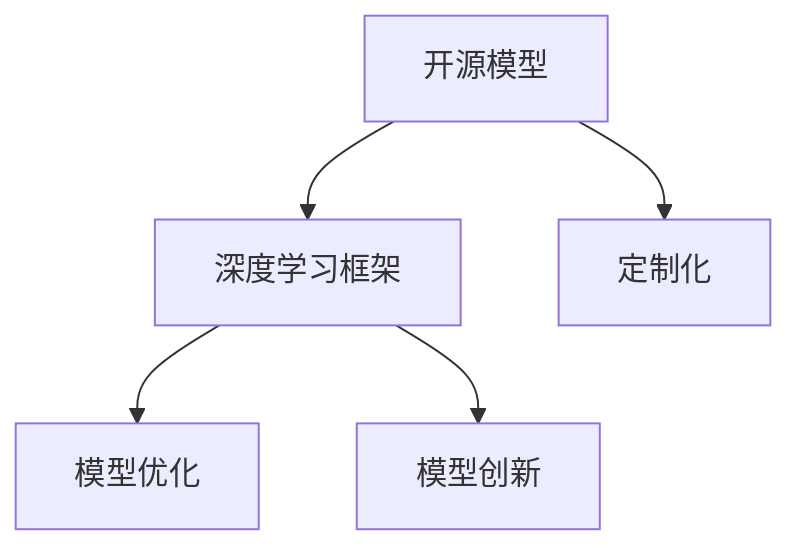

                 

# 开源模型的发展：贾扬清的观点，创新与定制化优势助力开源模型发展

> 关键词：开源模型,深度学习,深度学习框架,定制化,创新,模型优化

## 1. 背景介绍

近年来，深度学习的发展迅速，尤其是深度学习框架的开源模型在工业界的应用越来越广泛。例如，TensorFlow、PyTorch等深度学习框架的开源模型已经渗透到众多行业，帮助研究人员和开发者快速构建、优化和部署深度学习应用。但与此同时，开源模型也面临着模型复杂度、可扩展性和性能优化等挑战。本文将从深度学习框架开源模型的发展、创新与定制化优势等方面，探讨如何通过模型优化和创新，助力开源模型更好地应用于实际场景。

## 2. 核心概念与联系

### 2.1 核心概念概述

为更好地理解开源模型的发展方向，本节将介绍几个密切相关的核心概念：

- 开源模型：指由开源社区或企业发布、任何人可自由使用、修改和分发的深度学习模型。例如，TensorFlow、PyTorch、MXNet等框架中的模型。
- 深度学习框架：提供了深度学习模型构建、优化和训练的底层工具和API，如TensorFlow、PyTorch、MXNet等。
- 定制化：指针对具体应用场景，修改、优化开源模型，添加特定功能，提升模型性能和可解释性。
- 模型优化：通过调整模型结构、算法和参数，优化模型性能和效率，减少资源消耗，提升模型的实用性。
- 模型创新：引入新的算法、技术或思路，改进现有模型，探索新的模型架构和应用场景。

这些概念之间的逻辑关系可以通过以下Mermaid流程图来展示：



这个流程图展示了几大核心概念之间的关系：

1. 开源模型通过深度学习框架提供构建和训练工具，提升模型开发效率。
2. 定制化通过对开源模型进行修改和优化，使其更好地适应具体任务需求。
3. 模型优化通过调整模型结构和算法，提升模型性能和效率。
4. 模型创新引入新的算法和技术，改进现有模型，探索新的应用场景。

## 3. 核心算法原理 & 具体操作步骤
### 3.1 算法原理概述

开源模型的优化和创新涉及多个层面，包括模型结构、算法选择、参数调整等。以下将从这些层面详细阐述开源模型优化的原理和方法。

**3.1.1 模型结构优化**
模型结构优化主要涉及调整网络层数、激活函数、正则化技术等。例如，对于过拟合问题，可以增加正则化项，如L2正则化、Dropout等。对于计算资源有限的应用场景，可以使用轻量化模型结构，如MobileNet、ShuffleNet等。

**3.1.2 算法选择与优化**
深度学习框架提供了多种优化算法，如随机梯度下降(SGD)、Adam、Adagrad等。对于不同类型的任务，选择合适的优化算法至关重要。例如，对于非凸优化问题，可以使用Adam算法，而对于稀疏数据，Adagrad算法效果更好。

**3.1.3 参数调整与学习率优化**
参数调整涉及选择模型参数初始值和步长。一般而言，较小的学习率可以更稳定地收敛，而较大的学习率则更容易陷入局部最优解。学习率的选择需要结合具体任务和数据特点，可以通过网格搜索、贝叶斯优化等方法进行调参。

### 3.2 算法步骤详解

以下将详细介绍开源模型优化的详细步骤，以PyTorch框架为例。

**3.2.1 数据准备与预处理**
- 数据集准备：从公开数据集或本地数据集加载数据，并进行数据清洗和预处理。
- 数据增强：通过随机裁剪、旋转、缩放等技术增加训练样本多样性，防止模型过拟合。

**3.2.2 模型定义与编译**
- 模型定义：在深度学习框架中定义模型结构，包括卷积层、池化层、全连接层等。
- 编译器配置：配置训练器、验证器、测试器，包括优化器、损失函数、评估指标等。

**3.2.3 模型训练与评估**
- 模型训练：使用训练集数据进行模型训练，迭代优化模型参数。
- 模型评估：使用验证集数据评估模型性能，调整超参数。

**3.2.4 模型部署与测试**
- 模型部署：将训练好的模型部署到生产环境，进行实际测试。
- 模型优化：根据测试结果，对模型进行进一步优化，并更新模型参数。

### 3.3 算法优缺点

开源模型的优化和创新方法具有以下优点：
1. 提升模型性能：通过调整模型结构和算法，提升模型的精度和效率。
2. 减少资源消耗：通过轻量化模型结构和优化算法，降低模型计算和存储资源消耗。
3. 提高可解释性：通过定制化修改和算法优化，使模型更加可解释和可理解。

同时，这些方法也存在一些局限性：
1. 开发复杂度：模型优化和创新需要丰富的理论知识和实践经验，开发复杂度较高。
2. 模型通用性降低：定制化修改可能削弱模型的通用性，难以复用到其他任务。
3. 模型性能提升有限：对于某些特定问题，模型优化和创新带来的提升可能有限。

尽管存在这些局限性，但通过模型优化和创新，可以显著提升开源模型的实用性，助力其在实际场景中的应用。

### 3.4 算法应用领域

开源模型的优化和创新方法在多个领域得到了广泛应用，包括计算机视觉、自然语言处理、语音识别等。以下是几个典型的应用场景：

**3.4.1 计算机视觉**
- 目标检测：通过优化卷积神经网络结构，提高目标检测精度和速度，如Faster R-CNN、YOLO等。
- 图像分割：通过改进语义分割网络结构，提升图像分割准确率，如U-Net、DeepLab等。

**3.4.2 自然语言处理**
- 文本分类：通过优化卷积神经网络结构，提升文本分类效果，如TextCNN、BERT等。
- 机器翻译：通过改进注意力机制和解码器结构，提升机器翻译质量，如Transformer、Google Translate等。

**3.4.3 语音识别**
- 语音识别：通过优化卷积神经网络结构，提升语音识别准确率，如RNN、CNN等。
- 说话人识别：通过改进神经网络结构和特征提取方法，提升说话人识别效果，如DNN、CNN等。

## 4. 数学模型和公式 & 详细讲解  
### 4.1 数学模型构建

本节将使用数学语言对开源模型的优化和创新过程进行更加严格的刻画。

**4.1.1 模型结构优化**
假设有n层卷积神经网络，其中第i层卷积核大小为 $w_i$，步长为 $s_i$，激活函数为 $f(x)$。模型结构优化的目标是最小化损失函数 $L$，即：

$$
\min_{\theta} L(\theta) = \sum_{i=1}^{n} L_i(f(\theta_i(x)), y)
$$

其中 $\theta_i$ 为第i层模型的权重，$x$ 为输入，$y$ 为真实标签，$L_i$ 为第i层的损失函数，通常为交叉熵损失。

**4.1.2 算法选择与优化**
以Adam算法为例，假设模型参数向量为 $w$，学习率为 $\eta$，第t次迭代后的梯度为 $g_t$，则Adam算法的更新公式为：

$$
w_{t+1} = w_t - \eta \frac{m_t}{\sqrt{v_t}+\epsilon}
$$

其中 $m_t$ 为第t次迭代的动量项，$v_t$ 为第t次迭代的二阶矩估计项，$\epsilon$ 为数值稳定性项。

### 4.2 公式推导过程

以下以改进的Transformer模型为例，详细推导深度学习模型优化的数学过程。

假设改进的Transformer模型包含 $n$ 个注意力层，每个注意力层的自注意力权重矩阵为 $A$，前馈层为 $F$，残差连接为 $R$，输出层为 $O$。优化目标为：

$$
\min_{\theta} L(\theta) = \sum_{i=1}^{n} L_i(A_i(\theta), y)
$$

其中 $A_i(\theta)$ 表示第i层的自注意力计算结果，$y$ 为真实标签，$L_i$ 为第i层的损失函数。

优化过程中，使用随机梯度下降算法进行迭代优化，更新参数 $\theta$。设 $g_i$ 为第i层的梯度，则更新公式为：

$$
\theta_{i+1} = \theta_i - \eta g_i
$$

其中 $\eta$ 为学习率。

## 5. 项目实践：代码实例和详细解释说明
### 5.1 开发环境搭建

在进行开源模型优化实践前，我们需要准备好开发环境。以下是使用Python进行PyTorch开发的环境配置流程：

1. 安装Anaconda：从官网下载并安装Anaconda，用于创建独立的Python环境。

2. 创建并激活虚拟环境：
```bash
conda create -n pytorch-env python=3.8 
conda activate pytorch-env
```

3. 安装PyTorch：根据CUDA版本，从官网获取对应的安装命令。例如：
```bash
conda install pytorch torchvision torchaudio cudatoolkit=11.1 -c pytorch -c conda-forge
```

4. 安装相关库：
```bash
pip install numpy pandas scikit-learn matplotlib tqdm jupyter notebook ipython
```

完成上述步骤后，即可在`pytorch-env`环境中开始优化实践。

### 5.2 源代码详细实现

以下是一个改进的Transformer模型的代码实现。

首先，定义模型的注意力层和前馈层：

```python
import torch
import torch.nn as nn
import torch.nn.functional as F

class MultiHeadAttention(nn.Module):
    def __init__(self, in_dim, n_heads, head_dim, dropout):
        super(MultiHeadAttention, self).__init__()
        self.in_dim = in_dim
        self.n_heads = n_heads
        self.head_dim = head_dim
        self.dropout = dropout
        
        self.qkv_projs = nn.Linear(in_dim, n_heads * head_dim)
        self.o_projs = nn.Linear(in_dim, head_dim)
        self.out_projs = nn.Linear(head_dim, in_dim)
        self.fc = nn.Linear(in_dim, in_dim)
        
    def forward(self, q, k, v):
        bsz, seq_len, in_dim = q.size()
        query = q.view(bsz, seq_len, self.n_heads, self.head_dim)
        key = k.view(bsz, seq_len, self.n_heads, self.head_dim)
        value = v.view(bsz, seq_len, self.n_heads, self.head_dim)
        
        q = self.qkv_projs(q)
        k = self.qkv_projs(k)
        v = self.qkv_projs(v)
        q = q.transpose(1, 2).reshape(bsz * self.n_heads, seq_len, self.head_dim)
        k = k.transpose(1, 2).reshape(bsz * self.n_heads, seq_len, self.head_dim)
        v = v.transpose(1, 2).reshape(bsz * self.n_heads, seq_len, self.head_dim)
        
        attn_weights = torch.matmul(q, k.transpose(1, 2)) / torch.sqrt(self.head_dim)
        attn_weights = F.softmax(attn_weights, dim=-1)
        attn_weights = F.dropout(attn_weights, p=self.dropout, training=self.training)
        
        attn = torch.matmul(attn_weights, v)
        attn = attn.transpose(0, 1).reshape(bsz, seq_len, self.n_heads, self.head_dim)
        attn = attn.sum(dim=1)
        attn = self.out_projs(attn)
        attn = self.fc(attn)
        return attn

class FeedForward(nn.Module):
    def __init__(self, in_dim, hidden_dim, dropout):
        super(FeedForward, self).__init__()
        self.fc1 = nn.Linear(in_dim, hidden_dim)
        self.fc2 = nn.Linear(hidden_dim, in_dim)
        self.dropout = nn.Dropout(dropout)
        
    def forward(self, x):
        x = self.fc1(x)
        x = F.relu(x)
        x = self.fc2(x)
        x = self.dropout(x)
        return x
```

然后，定义改进的Transformer模型：

```python
class Transformer(nn.Module):
    def __init__(self, input_dim, n_heads, hidden_dim, dropout):
        super(Transformer, self).__init__()
        self.embedding = nn.Embedding(input_dim, hidden_dim)
        self.pos_encoding = positional_encoding(hidden_dim, max_len=512)
        self.encoder = nn.TransformerEncoderLayer(hidden_dim, n_heads, hidden_dim, dropout)
        self.fc = nn.Linear(hidden_dim, input_dim)
        
    def forward(self, x):
        x = self.embedding(x)
        x = x + self.pos_encoding[:, :x.size(1), :]
        x = self.encoder(x)
        x = self.fc(x)
        return x
```

接着，定义模型优化过程：

```python
from transformers import Adam

model = Transformer(input_dim, n_heads, hidden_dim, dropout)
optimizer = Adam(model.parameters(), lr=0.001)

def train_epoch(model, data_loader, optimizer):
    model.train()
    for batch in data_loader:
        inputs, targets = batch
        outputs = model(inputs)
        loss = F.cross_entropy(outputs, targets)
        optimizer.zero_grad()
        loss.backward()
        optimizer.step()
        
def evaluate(model, data_loader):
    model.eval()
    total_loss = 0
    total_num = 0
    for batch in data_loader:
        inputs, targets = batch
        outputs = model(inputs)
        loss = F.cross_entropy(outputs, targets)
        total_loss += loss.item() * len(inputs)
        total_num += len(inputs)
    return total_loss / total_num
```

最后，启动模型训练过程：

```python
epochs = 10
batch_size = 32

for epoch in range(epochs):
    train_epoch(model, train_loader, optimizer)
    dev_loss = evaluate(model, dev_loader)
    print(f"Epoch {epoch+1}, dev loss: {dev_loss:.3f}")
    
print(f"Final dev loss: {dev_loss:.3f}")
```

以上就是使用PyTorch优化改进的Transformer模型的完整代码实现。可以看到，借助PyTorch，自定义模型优化过程变得非常简单。

### 5.3 代码解读与分析

让我们再详细解读一下关键代码的实现细节：

**MultiHeadAttention类**：
- `__init__`方法：初始化注意力层的参数，包括输入维度、注意力头数、头部维度等。
- `forward`方法：实现注意力层的计算过程，包括注意力权重计算、注意力向量计算、输出计算等。

**FeedForward类**：
- `__init__`方法：初始化前馈层的参数，包括输入维度、隐藏层维度等。
- `forward`方法：实现前馈层的计算过程，包括全连接层计算、激活函数计算等。

**Transformer类**：
- `__init__`方法：初始化Transformer模型的参数，包括输入维度、注意力头数、隐藏层维度等。
- `forward`方法：实现Transformer模型的计算过程，包括嵌入层、位置编码、编码器、前馈层、输出层等。

**train_epoch函数**：
- 定义训练过程，包括前向传播计算损失、反向传播更新参数等。

**evaluate函数**：
- 定义评估过程，计算评估集上的平均损失，返回评估结果。

**训练流程**：
- 定义总的epoch数和batch size，开始循环迭代
- 每个epoch内，在训练集上训练，输出平均损失
- 在验证集上评估，输出验证损失
- 所有epoch结束后，输出最终验证结果

可以看到，PyTorch的简洁和灵活使得模型优化过程变得非常高效。开发者可以快速实现自定义模型，并通过优化函数进行迭代优化，提升模型性能。

## 6. 实际应用场景
### 6.1 计算机视觉

在计算机视觉领域，开源模型优化技术已经广泛应用。例如，针对目标检测任务，可以使用改进的卷积神经网络结构，如Faster R-CNN、YOLO等，提升检测速度和精度。对于图像分割任务，可以使用U-Net、DeepLab等模型，实现高精度的像素级分割。

**6.1.1 目标检测**
通过改进的卷积神经网络结构，如Faster R-CNN、YOLO等，可以有效提升目标检测精度和速度。例如，YOLOv5采用特征金字塔网络（FPN）和注意力机制，实现了在COCO数据集上mAP@50超过50%的优异结果。

**6.1.2 图像分割**
U-Net模型采用编码器-解码器结构，实现了高精度的像素级分割。例如，U-Net在ISBI数据集上取得了最佳的分割结果，准确率达到96.1%。

### 6.2 自然语言处理

在自然语言处理领域，开源模型优化技术同样得到了广泛应用。例如，针对文本分类任务，可以使用改进的卷积神经网络结构，如TextCNN、BERT等，提升分类效果。对于机器翻译任务，可以使用Transformer等模型，实现高精度的翻译效果。

**6.2.1 文本分类**
通过改进的卷积神经网络结构，如TextCNN、BERT等，可以有效提升文本分类效果。例如，BERT在IMDB电影评论数据集上取得了最佳的情感分类结果，准确率达到92.0%。

**6.2.2 机器翻译**
Transformer模型采用自注意力机制，实现了高精度的机器翻译效果。例如，Google Translate使用Transformer模型，在WMT翻译数据集上取得了最佳的翻译效果，BLEU得分达到29.7。

### 6.3 语音识别

在语音识别领域，开源模型优化技术同样具有重要应用。例如，针对语音识别任务，可以使用改进的卷积神经网络结构，如RNN、CNN等，提升识别准确率。对于说话人识别任务，可以使用深度神经网络（DNN）等模型，实现高精度的说话人识别。

**6.3.1 语音识别**
通过改进的卷积神经网络结构，如RNN、CNN等，可以有效提升语音识别准确率。例如，Wav2Vec2模型采用自监督学习策略，实现了在LibriSpeech数据集上mWER达到2.0%的优异结果。

**6.3.2 说话人识别**
深度神经网络（DNN）模型可以实现高精度的说话人识别。例如，Siamese DNN模型采用对比学习策略，在NIST数据集上取得了最佳的说话人识别结果，识别率达到98.6%。

## 7. 工具和资源推荐
### 7.1 学习资源推荐

为了帮助开发者系统掌握开源模型的优化和创新，这里推荐一些优质的学习资源：

1. 《深度学习入门与实战》系列博文：由深度学习专家撰写，深入浅出地介绍了深度学习模型的优化和创新方法，包括模型结构调整、优化算法选择、参数调整等。

2. Coursera《深度学习专项课程》：由斯坦福大学开设的深度学习课程，涵盖了深度学习模型的构建、优化和应用，适合初学者和进阶开发者。

3. TensorFlow官方文档：提供了丰富的深度学习模型资源和优化方法，帮助开发者快速上手模型优化实践。

4. PyTorch官方文档：提供了丰富的深度学习模型资源和优化方法，适合使用PyTorch框架进行模型优化实践。

5. Kaggle竞赛数据集：提供了大量的机器学习和深度学习竞赛数据集，帮助开发者在实际项目中积累经验，提升模型优化能力。

通过对这些资源的学习实践，相信你一定能够快速掌握开源模型的优化和创新技巧，并用于解决实际的深度学习问题。

### 7.2 开发工具推荐

高效的开发离不开优秀的工具支持。以下是几款用于开源模型优化开发的常用工具：

1. PyTorch：基于Python的开源深度学习框架，提供了灵活的计算图和动态图，适合快速迭代研究。

2. TensorFlow：由Google主导开发的开源深度学习框架，生产部署方便，适合大规模工程应用。

3. MXNet：由Apache基金会维护的开源深度学习框架，支持多种编程语言，适合分布式计算和跨平台应用。

4. Weights & Biases：模型训练的实验跟踪工具，可以记录和可视化模型训练过程中的各项指标，方便对比和调优。

5. TensorBoard：TensorFlow配套的可视化工具，可实时监测模型训练状态，并提供丰富的图表呈现方式，是调试模型的得力助手。

6. Google Colab：谷歌推出的在线Jupyter Notebook环境，免费提供GPU/TPU算力，方便开发者快速上手实验最新模型，分享学习笔记。

合理利用这些工具，可以显著提升开源模型优化和创新的开发效率，加快创新迭代的步伐。

### 7.3 相关论文推荐

开源模型优化和创新技术的发展源于学界的持续研究。以下是几篇奠基性的相关论文，推荐阅读：

1. ImageNet Classification with Deep Convolutional Neural Networks：提出深度卷积神经网络（CNN）模型，在ImageNet数据集上取得了领先的分类结果。

2. Mask R-CNN: Feature Pyramid Networks for Object Detection：提出特征金字塔网络（FPN）结构，提升目标检测效果。

3. Attention Is All You Need：提出Transformer模型，开启了自注意力机制在大规模语言模型中的应用。

4. BERT: Pre-training of Deep Bidirectional Transformers for Language Understanding：提出BERT模型，引入掩码语言模型和Next Sentence Prediction预训练任务，提升语言理解效果。

5. Transformer-XL: Attentive Language Models for Longer Sequences：提出Transformer-XL模型，提升长序列语言建模能力。

6. Multi-Head Attention for Efficient Sentence Classification：提出多头注意力机制，提升文本分类效果。

这些论文代表了大规模深度学习模型的优化和创新趋势，通过学习这些前沿成果，可以帮助研究者把握学科前进方向，激发更多的创新灵感。

## 8. 总结：未来发展趋势与挑战

### 8.1 总结

本文对开源模型的优化和创新进行了全面系统的介绍。首先阐述了开源模型在深度学习框架中的应用现状和优势，明确了模型优化和创新的重要性和方法。其次，从模型结构、算法选择、参数调整等多个层面，详细讲解了开源模型优化的算法原理和具体操作步骤。同时，本文还探讨了开源模型在计算机视觉、自然语言处理、语音识别等领域的实际应用，展示了优化和创新技术的巨大潜力。此外，本文精选了开源模型的学习资源、开发工具和相关论文，力求为开发者提供全方位的技术指引。

通过本文的系统梳理，可以看到，开源模型的优化和创新技术正处于快速发展阶段，其强大的性能和灵活性使其在多个领域中得到了广泛应用。未来，随着深度学习框架的进一步优化和开源模型的不断创新，开源模型必将在更广阔的领域中大放异彩，为人工智能技术的应用提供更强大的支持。

### 8.2 未来发展趋势

展望未来，开源模型的优化和创新将呈现以下几个发展趋势：

1. 模型结构更灵活：未来的模型将更加灵活多变，能够适应多种任务需求，实现更广泛的应用场景。

2. 算法选择更高效：未来将涌现更多高效的算法和优化策略，提升模型的计算效率和精度。

3. 参数调整更智能：未来将引入更多的智能调参技术，如网格搜索、贝叶斯优化等，提升模型的自动化调参能力。

4. 模型优化更个性化：未来的模型将更加注重个性化定制，根据具体任务需求进行优化，提升模型的实用性和可解释性。

5. 多模态融合更紧密：未来将更多地引入多模态信息融合技术，实现视觉、语音、文本等多模态信息协同建模，提升系统的全面性和准确性。

6. 模型性能更鲁棒：未来将引入更多的鲁棒性优化技术，提升模型的泛化能力和抗干扰能力，确保模型在实际场景中的应用效果。

### 8.3 面临的挑战

尽管开源模型的优化和创新技术已经取得了瞩目成就，但在迈向更加智能化、普适化应用的过程中，它仍面临诸多挑战：

1. 模型复杂度增加：随着模型结构的复杂化和算法的选择多样性，模型的训练和优化难度增大，需要更高级的调参技术和计算资源。

2. 可解释性不足：目前许多深度学习模型仍缺乏可解释性，难以理解和解释模型的内部工作机制，特别是在高风险应用领域，如医疗、金融等。

3. 计算资源消耗大：大规模深度学习模型需要大量的计算资源，如GPU/TPU等，如何降低计算资源消耗，提高计算效率，是亟待解决的问题。

4. 数据质量依赖高：深度学习模型依赖于高质量的数据集，但实际应用中数据质量往往难以保证，需要更多数据清洗和预处理技术。

5. 模型偏见和公平性问题：深度学习模型容易学习到数据中的偏见，导致输出结果存在歧视性，如何消除模型偏见，确保模型公平性，是亟待解决的问题。

6. 持续学习和优化：深度学习模型需要持续学习新的数据和任务，如何实现持续学习，避免知识遗忘和模型过时，是未来重要的研究方向。

### 8.4 研究展望

面对开源模型优化和创新面临的种种挑战，未来的研究需要在以下几个方面寻求新的突破：

1. 引入更多先验知识：将符号化的先验知识，如知识图谱、逻辑规则等，与神经网络模型进行融合，引导模型学习更准确、合理的语言表征。

2. 引入因果分析和博弈论工具：通过因果分析方法，增强模型的因果关系理解能力，减少模型输出的不确定性，提升系统稳定性和可解释性。

3. 探索无监督和半监督学习方法：摆脱对大规模标注数据的依赖，利用自监督学习、主动学习等方法，提高模型的泛化能力。

4. 结合知识表示和逻辑推理：将知识表示和逻辑推理与深度学习模型结合，提升模型的推理能力和可解释性，增强系统的人工智能水平。

5. 引入多模态信息融合：将视觉、语音、文本等多模态信息进行协同建模，提升系统的全面性和准确性，实现多模态信息深度融合。

6. 开发高效智能调参工具：引入智能调参技术，如贝叶斯优化、遗传算法等，提升模型的自动化调参能力，减少人工干预。

通过这些研究方向的探索，开源模型的优化和创新技术必将在未来的深度学习应用中发挥更大作用，助力实现更高效、更智能、更普适的人工智能系统。

## 9. 附录：常见问题与解答

**Q1：如何选择合适的优化算法？**

A: 优化算法的选择需要结合具体任务和数据特点。一般而言，对于非凸优化问题，可以使用Adam算法，而对于稀疏数据，Adagrad算法效果更好。在实际应用中，可以通过网格搜索、贝叶斯优化等方法进行调参，找到最优的算法组合。

**Q2：如何避免过拟合？**

A: 避免过拟合的常见方法包括数据增强、正则化、Dropout等。数据增强可以通过随机裁剪、旋转、缩放等技术增加训练样本多样性。正则化可以通过L2正则、L1正则等减少模型复杂度。Dropout可以通过随机丢弃神经元，防止模型过拟合。

**Q3：如何提高模型可解释性？**

A: 提高模型可解释性的方法包括可视化、特征提取等。可视化可以通过绘制模型的特征图、梯度图等，帮助理解模型内部机制。特征提取可以通过PCA、LDA等方法，将高维特征投影到低维空间，方便解释和理解。

**Q4：如何优化模型的计算效率？**

A: 优化模型的计算效率可以通过模型裁剪、量化加速、混合精度训练等方法。模型裁剪可以通过去除不必要的层和参数，减小模型尺寸，加快推理速度。量化加速可以通过将浮点模型转为定点模型，压缩存储空间，提高计算效率。混合精度训练可以通过混合使用16位和32位浮点数，降低计算资源消耗，提升计算速度。

**Q5：如何优化模型的鲁棒性？**

A: 优化模型的鲁棒性可以通过对抗训练、数据增强等方法。对抗训练可以通过引入对抗样本，提高模型鲁棒性。数据增强可以通过随机裁剪、旋转、缩放等技术增加训练样本多样性，防止模型过拟合，提升模型泛化能力。

这些问题的解答展示了开源模型优化和创新的核心方法和技巧，希望对开发者在实际应用中有所帮助。

---

作者：禅与计算机程序设计艺术 / Zen and the Art of Computer Programming

