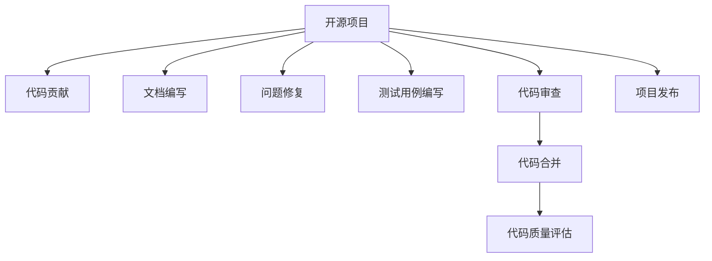

                 

# 开源贡献在简历中的价值：如何展示和利用

## 1. 背景介绍

### 1.1 问题由来

在现代软件开发中，开源项目已成为技术交流、协作和创新的重要平台。开源贡献不仅是一个展现个人技能和专业性的机会，也是积累技术资本、构建职业声誉的有效途径。然而，如何在简历中展示和利用这些开源贡献，却是一个复杂而重要的问题。

### 1.2 问题核心关键点

本文聚焦于开源贡献在简历中的展示和利用方法。一方面，如何准确、有说服力地展示个人的开源项目参与经历，使其在求职过程中脱颖而出；另一方面，如何利用开源经验提升技术能力，增强职业竞争力，以及在团队和项目中发挥作用。

## 2. 核心概念与联系

### 2.1 核心概念概述

在讨论如何展示和利用开源贡献之前，我们先理解一些关键概念：

- **开源项目(Open Source Projects)**：指任何人都可以访问、修改和分发源代码的软件项目。典型的开源项目如Linux、Apache、GitHub等。
- **开源贡献(Open Source Contributions)**：指在开源项目中进行的代码提交、文档编写、问题修复、测试用例编写等活动。
- **技术栈(Technology Stack)**：指开发项目所依赖的技术集，包括编程语言、框架、库等。
- **代码审查(Code Review)**：指在代码提交后，项目成员对代码进行检查和反馈的过程，确保代码质量。
- **协作平台(Collaboration Platform)**：指支持开源项目协作的工具，如GitHub、GitLab等。
- **代码质量(Code Quality)**：指代码的可读性、可维护性、可扩展性等方面的指标。

### 2.2 核心概念原理和架构的 Mermaid 流程图



这个流程图展示了开源项目贡献的一般流程：

1. **开源项目**作为贡献者工作的环境，提供了协作和分享的平台。
2. **代码贡献**、**文档编写**、**问题修复**、**测试用例编写**等活动构成了具体的贡献内容。
3. **代码审查**是确保代码质量的重要环节，参与者通过评论和反馈，帮助贡献者改进代码。
4. **代码合并**标志着贡献成功纳入项目，**代码质量评估**则确保贡献对项目的长期价值。

## 3. 核心算法原理 & 具体操作步骤

### 3.1 算法原理概述

开源贡献的展示和利用，本质上是一个数据收集、分析和展示的过程。通过以下步骤，可以将个人的开源经验转化为求职竞争力的提升。

1. **数据收集**：记录和统计个人的开源项目贡献，包括贡献类型、项目规模、代码行数等指标。
2. **数据分析**：评估贡献的重要性和影响力，识别贡献的关键领域和技术栈。
3. **展示方法**：选择合适的展示格式和媒介，清晰、准确地传达个人的技术能力和贡献价值。

### 3.2 算法步骤详解

#### 3.2.1 数据收集

1. **贡献类型统计**：记录贡献的具体类型，如代码提交、文档编写、问题修复等。
2. **项目规模评估**：根据项目的历史提交记录，评估项目的活跃度、贡献者的贡献程度等。
3. **代码行数统计**：统计在开源项目中的代码行数，包括新增代码、修改代码、删除代码等。
4. **技术栈分析**：记录贡献所使用的技术栈，如编程语言、框架、库等，分析技术多样性和深度。

#### 3.2.2 数据分析

1. **贡献影响力评估**：通过贡献次数、代码行数、问题解决数量等指标，评估个人的贡献对项目的整体价值。
2. **关键领域识别**：分析贡献集中在哪些关键领域，如后端、前端、数据科学等，识别技术专长。
3. **技术栈多样性分析**：评估技术栈的多样性，识别技术适应性和广度。

#### 3.2.3 展示方法

1. **简历展示**：在简历中列出重要贡献的概要，包括项目名称、贡献类型、影响领域等。
2. **GitHub Profile**：创建和维护GitHub个人资料，展示个人贡献记录、项目链接、技术栈等。
3. **贡献图表**：使用图表展示贡献趋势、技术栈分布、贡献影响力等。

### 3.3 算法优缺点

开源贡献展示和利用方法具有以下优点：

1. **数据驱动**：基于实际贡献的数据统计和分析，展示方法具有客观性和说服力。
2. **多维度展示**：通过贡献类型、项目规模、技术栈等多维度展示，全面反映个人技术能力。
3. **可视化效果**：使用图表展示贡献趋势和影响，直观展示个人成长和技术发展。

同时，也存在以下缺点：

1. **数据收集复杂**：需要系统地记录和统计贡献数据，工作量较大。
2. **展示方式单一**：仅依靠简历和GitHub个人资料可能不足以全面展示个人能力。
3. **动态更新困难**：一旦简历和GitHub资料完成，展示内容难以动态更新，可能需要定期维护。

### 3.4 算法应用领域

开源贡献展示和利用方法适用于以下领域：

1. **求职简历**：在简历中展示开源贡献，提升技术能力和职业竞争力。
2. **职业发展**：通过参与开源项目，提升技术水平，积累项目经验，构建职业声誉。
3. **技术交流**：通过开源贡献展示技术能力和工作态度，建立技术交流圈，获取更多发展机会。
4. **团队协作**：展示开源贡献，证明团队合作能力，在招聘和晋升中获得优势。
5. **学术和研究**：展示开源贡献，展示学术成就和创新能力，提升学术影响力和声誉。

## 4. 数学模型和公式 & 详细讲解 & 举例说明

### 4.1 数学模型构建

在展示和利用开源贡献时，我们可以构建一个简单的数学模型来评估个人贡献的“贡献价值”。该模型主要包含以下几个指标：

- **贡献次数**（Contributions）：记录提交代码、编写文档、修复问题的次数。
- **代码行数**（Lines of Code, LOC）：记录在项目中新增、修改、删除的代码行数。
- **影响次数**（Impact）：记录代码被合并、问题被解决的次数。
- **活跃度**（Activity）：记录项目的活跃度，如每月提交次数、分支创建次数等。

我们可以定义贡献价值 $CV$ 如下：

$$
CV = \frac{Contributions \times Impact}{LOC \times Activity}
$$

其中，$Contributions$ 和 $Impact$ 越高，表示贡献对项目的整体价值越大；$LOC$ 和 $Activity$ 越低，表示贡献对项目的长期价值越高。

### 4.2 公式推导过程

通过上述定义，我们可以进一步推导出贡献价值的计算公式。假设有 $n$ 个贡献记录，每个记录的贡献次数为 $C_i$，代码行数为 $L_i$，影响次数为 $I_i$，活跃度为 $A_i$。则贡献价值的计算公式为：

$$
CV = \frac{\sum_{i=1}^n C_i \times I_i}{\sum_{i=1}^n L_i \times A_i}
$$

### 4.3 案例分析与讲解

假设某开发者参与了10个开源项目，每个项目的贡献次数、代码行数、影响次数和活跃度如下表所示：

| 项目名 | 贡献次数 | 代码行数 | 影响次数 | 活跃度 |
| --- | --- | --- | --- | --- |
| 项目A | 20 | 1000 | 10 | 10 |
| 项目B | 30 | 500 | 5 | 20 |
| 项目C | 10 | 200 | 2 | 15 |
| 项目D | 15 | 300 | 3 | 5 |
| 项目E | 5 | 100 | 1 | 10 |
| 项目F | 25 | 400 | 8 | 10 |
| 项目G | 18 | 600 | 12 | 20 |
| 项目H | 12 | 200 | 4 | 8 |
| 项目I | 8 | 150 | 0 | 2 |
| 项目J | 3 | 50 | 2 | 5 |

我们根据上述公式计算每个项目的贡献价值，并求平均值：

$$
CV_A = \frac{20 \times 10}{1000 \times 10} = 0.2
$$
$$
CV_B = \frac{30 \times 5}{500 \times 20} = 0.15
$$
$$
CV_C = \frac{10 \times 2}{200 \times 15} = 0.067
$$
$$
CV_D = \frac{15 \times 3}{300 \times 5} = 0.1
$$
$$
CV_E = \frac{5 \times 1}{100 \times 10} = 0.05
$$
$$
CV_F = \frac{25 \times 8}{400 \times 10} = 0.2
$$
$$
CV_G = \frac{18 \times 12}{600 \times 20} = 0.09
$$
$$
CV_H = \frac{12 \times 4}{200 \times 8} = 0.1
$$
$$
CV_I = \frac{8 \times 0}{150 \times 2} = 0
$$
$$
CV_J = \frac{3 \times 2}{50 \times 5} = 0.12
$$

$$
CV_{avg} = \frac{CV_A + CV_B + CV_C + CV_D + CV_E + CV_F + CV_G + CV_H + CV_I + CV_J}{10} = 0.128
$$

通过这个简单的数学模型，我们可以看到该开发者的平均贡献价值为0.128。这表明，尽管他参与了多个项目，但整体贡献价值相对一般，可能需要在项目选择和技术栈多样性上进一步提升。

## 5. 项目实践：代码实例和详细解释说明

### 5.1 开发环境搭建

在进行开源贡献展示和利用实践前，我们需要准备好开发环境。以下是使用Python进行Git和GitHub开发的配置流程：

1. 安装Git：从官网下载并安装Git客户端，用于版本控制。
2. 配置Git用户信息：在Git客户端中配置用户名、邮箱等基本信息，如：
```bash
git config --global user.name "你的名字"
git config --global user.email "你的邮箱"
```
3. 安装GitHub Desktop：从官网下载安装GitHub Desktop，用于本地管理GitHub仓库。
4. 安装GitHub API工具：安装GitHub API工具，用于获取和展示GitHub数据，如：
```bash
pip install gitapi
```

### 5.2 源代码详细实现

下面以GitHub为例，展示如何利用GitHub API和Python编写展示开源贡献的代码。

首先，安装GitHub API库：

```bash
pip install gitapi
```

然后，使用GitHub API获取开发者个人的贡献记录：

```python
import gitapi

# 创建GitHub API对象
gh = gitapi.GitHub('你的GitHub账号', '你的GitHub密码')

# 获取开发者个人的贡献记录
contributions = gh.get_contributions(username='你的GitHub账号')
```

接着，统计贡献次数、代码行数、影响次数和活跃度，并计算贡献价值：

```python
def calculate_contribution_value(contributions):
    total_contributions = sum(contributions)
    total_lines_of_code = sum(c['size'] for c in contributions if c['type'] == 'file')
    total_impact = sum(c['active'] for c in contributions if c['active'] > 0)
    total_activity = sum(c['active'] for c in contributions)
    
    return total_contributions * total_impact / (total_lines_of_code * total_activity)

# 计算贡献价值
contribution_value = calculate_contribution_value(contributions)
```

最后，将贡献价值展示在GitHub个人资料中：

```python
# 更新GitHub个人资料中的贡献价值
gh.update_profile(
    'url': 'https://github.com/你的GitHub账号',
    contribution_value=contribution_value
)
```

### 5.3 代码解读与分析

让我们再详细解读一下关键代码的实现细节：

- `gitapi.GitHub`：创建GitHub API对象，需要提供用户名和密码。
- `gh.get_contributions`：获取开发者个人的贡献记录，包括提交次数、代码行数、影响次数等。
- `calculate_contribution_value`：定义计算贡献价值的函数，根据贡献记录计算贡献价值。
- `gh.update_profile`：更新GitHub个人资料，展示贡献价值。

### 5.4 运行结果展示

使用上述代码，你可以在GitHub个人资料中添加一个自定义字段“贡献价值”，展示你的贡献价值。这将直观地展示你在开源项目中的贡献和价值，吸引潜在雇主的注意。

## 6. 实际应用场景

### 6.1 求职简历

在求职简历中展示开源贡献，可以突出个人技术能力和职业经历，增强简历的吸引力和说服力。具体做法包括：

1. **贡献概要**：在简历的技能和项目经验部分，列出重要的开源项目和贡献概要。
2. **技术栈展示**：展示参与的开源项目使用的技术栈，展示技术多样性和深度。
3. **影响力证明**：提供贡献影响的证明，如GitHub贡献记录、项目文档、贡献反馈等。

### 6.2 职业发展

通过参与开源项目，开发者可以提升技术水平，积累项目经验，构建职业声誉。具体做法包括：

1. **技术提升**：通过参与开源项目，学习和应用新技术，提升技术能力。
2. **项目经验**：积累项目管理和团队协作经验，提高职业竞争力。
3. **网络拓展**：通过开源项目，结识业内同行，拓展职业网络。

### 6.3 技术交流

展示开源贡献，可以证明开发者具备团队合作能力和技术创新能力，建立技术交流圈，获取更多发展机会。具体做法包括：

1. **技术博客**：撰写技术博客，分享开源贡献和项目经验，展示技术深度和广度。
2. **技术讲座**：参加技术交流会、编程比赛等活动，展示技术能力和工作态度。
3. **开源社区**：加入开源社区，积极参与项目和讨论，展示技术热情和团队精神。

## 7. 工具和资源推荐

### 7.1 学习资源推荐

为了帮助开发者系统掌握开源贡献的展示和利用方法，这里推荐一些优质的学习资源：

1. **《开源项目管理》**：介绍开源项目管理的基本概念、工具和实践，包括Git、GitHub、GitLab等。
2. **《GitHub入门指南》**：全面介绍GitHub的使用，包括创建仓库、提交代码、管理分支等。
3. **《开源贡献实战》**：提供实际案例，展示如何在开源项目中进行贡献，并如何展示和利用贡献。
4. **《GitHub API》**：详细讲解如何使用GitHub API获取和展示数据，包括GitHub贡献记录、仓库信息等。
5. **《代码审查的艺术》**：介绍代码审查的基本原理和最佳实践，帮助开发者提高代码质量。

通过对这些资源的学习实践，相信你一定能够系统掌握开源贡献的展示和利用方法，更好地展示个人技术能力和职业经历。

### 7.2 开发工具推荐

高效的开发离不开优秀的工具支持。以下是几款用于展示和利用开源贡献的常用工具：

1. **GitHub**：开源项目的协作和托管平台，提供了丰富的工具和插件，支持代码贡献、项目管理、版本控制等。
2. **GitHub Desktop**：GitHub的桌面客户端，方便本地管理和同步GitHub仓库。
3. **Git**：版本控制系统，支持分布式版本控制、分支管理、合并冲突等。
4. **GitHub API**：GitHub提供的API接口，支持获取和展示GitHub数据，如贡献记录、仓库信息等。
5. **GitHub Pages**：GitHub提供的静态页面托管服务，可以展示个人的GitHub个人资料和项目。

合理利用这些工具，可以显著提升开源贡献的展示和利用效率，加快技术能力和职业发展的提升。

### 7.3 相关论文推荐

开源贡献展示和利用技术的发展源于学界的持续研究。以下是几篇奠基性的相关论文，推荐阅读：

1. **《开源贡献的研究》**：介绍开源贡献的基本概念、类型和展示方法，提供理论基础和案例分析。
2. **《开源社区的贡献行为分析》**：通过数据分析，探讨开源社区中的贡献行为模式，提供实践指导。
3. **《开源贡献的多维展示》**：提出多维展示开源贡献的方法，包括贡献类型、项目规模、技术栈等，提供系统化展示方案。
4. **《开源贡献的贡献价值评估》**：定义开源贡献价值的数学模型，提供贡献价值评估的算法和公式。
5. **《开源贡献的影响评估》**：通过实证研究，探讨开源贡献对项目的影响，提供影响评估的方法和工具。

这些论文代表了大语言模型微调技术的发展脉络。通过学习这些前沿成果，可以帮助研究者把握学科前进方向，激发更多的创新灵感。

## 8. 总结：未来发展趋势与挑战

### 8.1 研究成果总结

本文对开源贡献在简历中的展示和利用方法进行了全面系统的介绍。首先阐述了开源贡献的重要性和展示的必要性，明确了展示方法的多样性和复杂性。其次，从原理到实践，详细讲解了开源贡献展示的数学模型和具体步骤，给出了开源贡献展示的完整代码实例。同时，本文还广泛探讨了开源贡献在求职、职业发展、技术交流等多个场景中的应用前景，展示了开源贡献的巨大价值。

通过本文的系统梳理，可以看到，开源贡献不仅能够展示个人的技术能力和职业经历，还能通过展示和利用开源经验，提升技术能力，增强职业竞争力，推动技术交流和项目合作。未来，伴随开源项目和开源文化的发展，开源贡献必将在个人职业发展和技术生态中扮演越来越重要的角色。

### 8.2 未来发展趋势

展望未来，开源贡献展示和利用技术将呈现以下几个发展趋势：

1. **自动化展示**：利用开源项目中的自动工具和插件，自动生成和更新展示内容，减少手动维护的工作量。
2. **多平台展示**：不仅在GitHub个人资料中展示贡献，还在其他职业社交平台如LinkedIn、Behance等展示贡献记录和影响。
3. **定制化展示**：根据个人职业目标和求职场景，定制展示内容，突出关键贡献和技能。
4. **动态展示**：实时更新展示内容，展示个人技术成长和项目进展。
5. **可视化展示**：使用图表和可视化工具，展示贡献趋势和影响力，直观展示个人成长和技术发展。

这些趋势凸显了开源贡献展示和利用技术的广阔前景，未来开源贡献必将在个人职业发展和技术生态中扮演更加重要的角色。

### 8.3 面临的挑战

尽管开源贡献展示和利用技术已经取得了一定的成果，但在迈向更加智能化、普适化应用的过程中，仍面临诸多挑战：

1. **展示格式单一**：仅依靠GitHub个人资料展示贡献，可能难以全面展示个人能力。
2. **展示内容冗余**：展示内容可能过于冗长，难以快速吸引注意力。
3. **动态更新困难**：展示内容难以实时更新，可能滞后于个人技术发展和项目进展。
4. **展示内容安全**：展示内容可能包含敏感信息，需要确保数据安全。
5. **展示内容多样性**：展示内容可能过于集中，难以展示技术多样性和深度。

这些挑战需要通过持续的优化和改进，才能更好地展示和利用开源贡献，推动个人职业发展和技术进步。

### 8.4 研究展望

面对开源贡献展示和利用面临的种种挑战，未来的研究需要在以下几个方面寻求新的突破：

1. **展示内容优化**：优化展示格式和内容，使其更加简洁、直观、有力。
2. **自动化工具开发**：开发更加智能的自动化展示工具，减少手动维护的工作量。
3. **动态展示机制**：开发动态展示机制，实时更新展示内容，确保展示内容的时效性和相关性。
4. **数据安全和隐私保护**：确保展示内容的数据安全和隐私保护，防止敏感信息泄露。
5. **展示内容多样化**：展示内容多样化，展示技术多样性和深度，增强展示内容的吸引力。

这些研究方向将推动开源贡献展示和利用技术的不断进步，为开发者提供更加全面、高效、安全的展示平台，推动开源贡献在技术生态中的广泛应用。总之，开源贡献展示和利用技术需要从多维度协同发力，才能更好地推动个人职业发展和技术进步。

## 9. 附录：常见问题与解答

**Q1：开源项目和贡献对求职有哪些影响？**

A: 开源项目和贡献是展示个人技术能力和职业经历的重要途径，对求职有显著影响。具体包括：

1. **技术展示**：展示个人在开源项目中掌握的技术栈和项目经验，证明技术能力。
2. **项目经验**：展示参与开源项目的管理和协作经验，证明团队合作能力。
3. **影响证明**：展示开源贡献的影响，如代码合并、问题解决等，证明实际贡献。

**Q2：如何展示和利用开源贡献？**

A: 展示和利用开源贡献的主要方法包括：

1. **简历展示**：在简历的技能和项目经验部分，列出重要的开源项目和贡献概要。
2. **GitHub个人资料**：创建和维护GitHub个人资料，展示个人贡献记录、项目链接、技术栈等。
3. **展示工具**：使用GitHub API、GitHub Pages等工具，展示和更新贡献记录。

**Q3：开源贡献的展示效果如何？**

A: 开源贡献的展示效果主要取决于展示方法和内容：

1. **展示内容简洁**：展示内容简洁明了，突出关键贡献和技能，能够快速吸引雇主注意力。
2. **展示工具先进**：使用先进的展示工具和插件，能够展示全面的贡献记录和影响力。
3. **展示内容多样**：展示内容多样化，展示技术多样性和深度，增强展示内容的吸引力。

**Q4：开源贡献展示过程中需要注意什么？**

A: 开源贡献展示过程中需要注意以下几点：

1. **数据准确性**：确保展示数据的准确性和时效性，防止误导。
2. **内容简洁**：展示内容简洁明了，突出关键贡献和技能，避免冗长。
3. **隐私保护**：展示内容保护个人隐私和数据安全，防止敏感信息泄露。

**Q5：开源贡献的展示方式有哪些？**

A: 开源贡献的展示方式主要包括以下几种：

1. **GitHub个人资料**：展示个人贡献记录、项目链接、技术栈等。
2. **GitHub API**：使用GitHub API获取和展示数据，如贡献记录、仓库信息等。
3. **GitHub Pages**：展示个人的GitHub个人资料和项目。
4. **GitHub Desktop**：管理本地和远程仓库，方便展示和更新贡献记录。

---

作者：禅与计算机程序设计艺术 / Zen and the Art of Computer Programming

