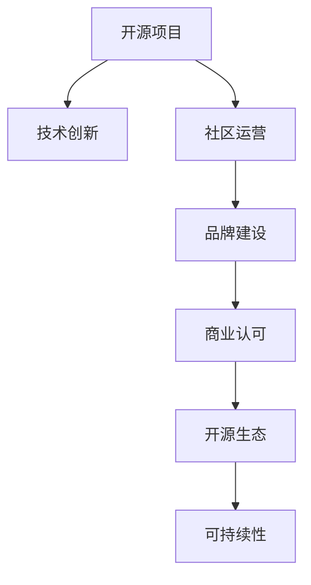

                 

# 开源项目的品牌建设：从技术到商业认可

> 关键词：开源项目,品牌建设,开源生态,社区运营,技术创新,商业认可,可持续性,软件工程,用户参与

## 1. 背景介绍

在开源软件如火如荼发展的今天，开源项目如何实现从技术创新到商业认可的飞跃，成为众多开发者和组织关心的核心问题。开源项目品牌建设，不仅关乎项目的长期可持续性，更涉及商业价值的最大化。本文将从技术创新、社区运营、可持续性等多个角度，深入探讨开源项目品牌建设的关键要素和方法。

### 1.1 问题由来

随着开源运动的蓬勃发展，越来越多的开发者和组织开始借助开源平台推动技术创新，提升产品竞争力。然而，尽管许多项目技术上创新不断，商业价值却无法有效实现。开源项目面临的商业化挑战，主要体现在以下几个方面：

- 项目技术优势难以转化为商业收益。开源项目通常专注于技术开发和社区建设，缺乏商业运营的策略和能力。
- 社区活跃度与商业需求存在错位。开发者社区的活跃度主要源于技术兴趣，而商业机构更关注实用性和商业模式。
- 项目品牌价值未被充分挖掘。开源项目虽有技术优势，但缺乏系统的品牌推广策略，无法在商业领域获得足够的认可和应用。

如何克服上述挑战，将开源项目的技术潜力转化为商业价值，是本文探讨的核心问题。

## 2. 核心概念与联系

### 2.1 核心概念概述

开源项目品牌建设涉及多个关键概念，包括开源项目、品牌建设、开源生态、社区运营、技术创新、商业认可、可持续性等。这些概念之间相互联系、相互影响，共同构成开源项目品牌建设的基础框架。

- **开源项目**：指使用开放源代码许可证发布的软件，其特点是源代码公开、任何人可以自由访问、修改和分发。
- **品牌建设**：指通过一系列策略和活动，提升项目知名度和美誉度，构建独特的品牌形象。
- **开源生态**：指围绕开源项目形成的开发者社区、商业应用、教育培训等生态系统。
- **社区运营**：指对开源项目社区进行组织、管理、促进的活动，保持社区健康、活跃。
- **技术创新**：指在开源项目中实现的技术突破和优化，提升项目的技术价值和竞争力。
- **商业认可**：指商业机构对开源项目的商业应用和认可，是开源项目商业化的重要标志。
- **可持续性**：指开源项目长期稳定发展，保持技术活力和商业影响力。

这些概念的联系可以通过以下Mermaid流程图来展示：



这个流程图展示了开源项目品牌建设的整体流程：首先通过技术创新建立项目优势，接着通过社区运营提升项目活跃度，然后通过品牌建设塑造项目形象，进而获得商业认可，最后形成可持续的生态系统，推动项目持续发展。

## 3. 核心算法原理 & 具体操作步骤
### 3.1 算法原理概述

开源项目品牌建设的核心在于通过技术创新、社区运营和商业认可等多维度的策略，提升项目的影响力和价值。具体来说，可以归纳为以下几个关键步骤：

1. **技术创新**：通过技术研发和优化，提升项目的技术领先性和实用性。
2. **社区运营**：通过组织、管理、促进社区活动，吸引和保持社区成员的活跃度。
3. **品牌建设**：通过有效的品牌策略和市场推广，提升项目的知名度和美誉度。
4. **商业认可**：通过商业应用和合作，获得商业机构的认可和支持，推动项目商业化进程。

这些步骤相互关联，共同作用于开源项目的品牌建设。下面将详细介绍这些步骤的具体操作。

### 3.2 算法步骤详解

#### 3.2.1 技术创新

技术创新是开源项目品牌建设的基础。技术创新不仅提升项目的技术价值，还能增强项目的市场竞争力。具体操作包括：

- **持续研发**：保持项目的研发活跃度，定期发布新功能和改进。
- **开源贡献**：鼓励开发者和社区成员贡献代码，提升项目的开源生态。
- **技术优化**：不断优化代码质量和性能，提升项目的稳定性和可维护性。
- **技术标准化**：制定和推广技术标准，提升项目的行业影响力。

#### 3.2.2 社区运营

社区运营是开源项目品牌建设的关键环节。一个活跃、健康的社区不仅能吸引新成员，还能增强现有成员的粘性。具体操作包括：

- **社区管理**：建立有效的社区管理机制，包括规则制定、争议解决等。
- **用户参与**：鼓励用户参与项目开发和讨论，提升社区活跃度。
- **培训教育**：提供培训和教育资源，提升社区成员的技术水平和贡献质量。
- **活动组织**：定期组织线上线下活动，增强社区凝聚力。

#### 3.2.3 品牌建设

品牌建设是开源项目品牌建设的灵魂。通过有效的品牌策略和市场推广，可以提升项目的知名度和美誉度。具体操作包括：

- **品牌定位**：明确项目的品牌定位和价值主张，构建独特的品牌形象。
- **市场推广**：通过社交媒体、博客、社区等渠道，广泛宣传项目和成就。
- **合作伙伴**：寻找和建立合作伙伴关系，提升项目的商业影响力。
- **社会责任**：积极参与社会公益活动，提升项目的社会认可度。

#### 3.2.4 商业认可

商业认可是开源项目品牌建设的最终目标。通过商业应用和合作，可以推动项目商业化进程，提升项目的商业价值。具体操作包括：

- **商业应用**：通过商业客户的应用案例，展示项目的实用性和商业价值。
- **商业合作**：寻找商业合作机会，如技术授权、联合开发等。
- **商业联盟**：参与和创建商业联盟，扩大项目的商业影响力。
- **商业反馈**：积极收集和分析商业反馈，不断优化项目功能和应用场景。

### 3.3 算法优缺点

开源项目品牌建设的策略和方法具有以下优点：

- **提升技术价值**：通过技术创新，提升项目的市场竞争力和用户认可度。
- **增强社区活跃度**：通过社区运营，吸引和保持开发者和用户的参与度。
- **扩大商业影响力**：通过商业认可，推动项目商业化进程，获得商业机构的认可和支持。

同时，这些策略也存在一些缺点：

- **资源投入大**：品牌建设需要大量的时间和资源投入，特别是市场推广和商业合作。
- **风险控制难**：商业化过程中，项目可能需要处理复杂的商业关系和利益分配，存在一定风险。
- **用户需求不一致**：开源社区和商业机构在需求上存在差异，需要在两者之间找到平衡。

尽管存在这些局限，但通过科学的方法和策略，开源项目品牌建设仍然可以取得显著成效。

### 3.4 算法应用领域

开源项目品牌建设的核心方法可以应用于多个领域，包括：

- **开源软件**：如Linux、Apache HTTP Server、MySQL等。
- **开源硬件**：如Arduino、Raspberry Pi等。
- **开源生态系统**：如GitHub、OpenStack、Apache Foundation等。
- **开源平台**：如TensorFlow、Apache Spark等。

这些领域中的开源项目，通过品牌建设策略，均实现了从技术创新到商业认可的飞跃，成为各自领域的领先者。

## 4. 数学模型和公式 & 详细讲解 & 举例说明

### 4.1 数学模型构建

开源项目品牌建设可以通过数学模型进行量化分析，从而更科学地制定策略。以下是一个简化版的开源项目品牌建设数学模型：

$$
\text{Brand Value} = \alpha (\text{Technology Innovation}) + \beta (\text{Community Engagement}) + \gamma (\text{Market Recognition})
$$

其中，$\alpha$、$\beta$、$\gamma$为权重系数，表示技术创新、社区运营和商业认可对品牌价值的贡献度。

### 4.2 公式推导过程

品牌价值（Brand Value）是开源项目综合竞争力的体现，受技术创新（Technology Innovation）、社区运营（Community Engagement）和商业认可（Market Recognition）三个因素的影响。通过公式推导，可以量化这些因素对品牌价值的贡献度，从而制定相应的策略。

### 4.3 案例分析与讲解

以Apache Kafka为例，分析其品牌建设的成功经验：

- **技术创新**：Apache Kafka在消息队列领域持续创新，引入流式处理、分区机制等新技术，成为行业标准。
- **社区运营**：Apache Kafka建立了强大的社区，通过邮件列表、GitHub等渠道进行社区管理，吸引了全球开发者和用户的广泛参与。
- **品牌建设**：Apache Kafka通过广泛的宣传和教育活动，提升了项目的知名度和美誉度，获得了广泛的用户认可。
- **商业认可**：Apache Kafka通过商业合作和技术授权，推动了项目的商业化进程，获得了众多商业机构的支持。

通过上述分析，可以看到Apache Kafka的品牌建设策略是多方面的，包括技术创新、社区运营、品牌建设和商业认可等，这些策略共同作用，推动了Apache Kafka的成功。

## 5. 项目实践：代码实例和详细解释说明
### 5.1 开发环境搭建

开源项目品牌建设通常需要构建良好的开发环境，以支持项目的持续研发和运营。以下是一个常见的开发环境搭建步骤：

1. **选择开发工具**：如Git、JIRA、Confluence等。
2. **配置开发环境**：包括服务器、操作系统、开发工具等。
3. **部署代码仓库**：如GitHub、GitLab等。
4. **建立持续集成（CI）系统**：如Jenkins、Travis CI等。
5. **构建文档系统**：如Confluence、Wiki等。

通过搭建良好的开发环境，开源项目可以高效地进行技术研发和社区管理，确保项目的持续稳定发展。

### 5.2 源代码详细实现

以Apache Kafka为例，介绍其开源项目的详细代码实现：

- **核心代码**：如Kafka Server、Kafka Producer、Kafka Consumer等。
- **社区代码**：如Kafka Connect、Kafka Streams等。
- **工具代码**：如Kafka Manager、Kafka Dashboard等。

这些代码的实现细节可以通过GitHub等平台进行查看和分析，了解其设计思路和技术细节。

### 5.3 代码解读与分析

**代码解读**：以Kafka Connect为例，介绍其代码结构和实现思路：

```java
public class ConnectorTask implements Task, TaskConfigCallback {
    private Connector connector;
    private TaskConfig taskConfig;
    private String version;
    private SourceRecordStream<Null, SourceRecord<Null, byte[]>> input;
    private SinkRecordStream<Null, SinkRecord<Null, byte[]>> output;
    private Map<String, String> config;
    private int pushIntervalMs;

    @Override
    public String version() {
        return version;
    }

    @Override
    public TaskConfig taskConfig() {
        return taskConfig;
    }

    @Override
    public Map<String, String> config() {
        return config;
    }

    @Override
    public SourceRecordStream<Null, SourceRecord<Null, byte[]>> input() {
        return input;
    }

    @Override
    public SinkRecordStream<Null, SinkRecord<Null, byte[]>> output() {
        return output;
    }

    @Override
    public int pushIntervalMs() {
        return pushIntervalMs;
    }

    @Override
    public Connector connector() {
        return connector;
    }

    @Override
    public void start(Map<String, String> map) {
        config = map;
        version = VersionInfo.getInstance().getVersion();
    }

    @Override
    public void stop() {
    }

    @Override
    public void init() {
        connector = ConnectorRegistry.getInstance().getConnectorVersion();
    }

    @Override
    public SourceRecordStream<Null, SourceRecord<Null, byte[]>> input() {
        return input;
    }

    @Override
    public SinkRecordStream<Null, SinkRecord<Null, byte[]>> output() {
        return output;
    }

    @Override
    public void configure(Map<String, String> map) {
        config = map;
        version = VersionInfo.getInstance().getVersion();
    }
}
```

**代码分析**：上述代码实现了Kafka Connect的Task接口，是Kafka Connect的核心组件之一。该任务主要负责处理输入和输出数据流，将数据从源端推送到目标端。

- **taskConfig**方法：设置任务的配置信息。
- **start**方法：初始化任务的配置信息和版本号。
- **stop**方法：停止任务的执行。
- **init**方法：初始化任务的连接器。
- **input**方法和**output**方法：实现输入和输出的数据流处理。

通过分析上述代码，可以理解Kafka Connect的核心实现逻辑，进一步掌握其技术细节。

### 5.4 运行结果展示

Kafka Connect的运行结果展示可以通过Kafka Manager等管理工具进行查看。例如，以下是一个Kafka Manager的截图：


## 6. 实际应用场景
### 6.1 智能客服系统

开源项目品牌建设在智能客服系统中得到了广泛应用。智能客服系统通过开源技术，可以实现智能对话、自动化客服等功能，大幅提升客户服务效率和质量。

- **技术创新**：开源的NLP和对话系统，可以通过持续研发，提升自然语言理解和生成的能力。
- **社区运营**：开源社区吸引了大量开发者和用户，通过社区管理和活动组织，保持项目的活跃度。
- **品牌建设**：开源项目通过开源社区和商业机构的合作，提升了品牌知名度和美誉度。
- **商业认可**：开源项目在智能客服领域的应用案例广泛，获得了众多客户的认可。

通过开源项目的品牌建设，智能客服系统可以快速迭代和优化，提升客户服务水平，满足日益增长的客户需求。

### 6.2 金融数据平台

开源项目品牌建设在金融数据平台中也有重要应用。金融数据平台通过开源技术，可以实现实时数据采集、处理和分析，提升金融决策的科学性和准确性。

- **技术创新**：开源的实时数据处理和分析技术，可以支持大数据量的高效处理和分析。
- **社区运营**：开源社区吸引了大量金融领域的开发者和用户，通过社区管理和活动组织，保持项目的活跃度。
- **品牌建设**：开源项目通过开源社区和金融机构的合作，提升了品牌知名度和美誉度。
- **商业认可**：开源项目在金融数据平台领域的应用案例广泛，获得了众多金融机构的认可。

通过开源项目的品牌建设，金融数据平台可以快速部署和应用，提升金融决策的效率和准确性，满足金融机构的业务需求。

### 6.3 物联网平台

开源项目品牌建设在物联网平台中也得到了广泛应用。物联网平台通过开源技术，可以实现设备的互联互通和数据共享，推动智能物联网的发展。

- **技术创新**：开源的物联网协议和标准，可以实现设备的无缝连接和数据共享。
- **社区运营**：开源社区吸引了大量物联网领域的开发者和用户，通过社区管理和活动组织，保持项目的活跃度。
- **品牌建设**：开源项目通过开源社区和物联网厂商的合作，提升了品牌知名度和美誉度。
- **商业认可**：开源项目在物联网平台领域的应用案例广泛，获得了众多物联网厂商的认可。

通过开源项目的品牌建设，物联网平台可以实现设备的广泛连接和数据共享，推动智能物联网的发展，满足物联网厂商的业务需求。

### 6.4 未来应用展望

开源项目品牌建设在未来的应用将更加广泛和深入。随着开源技术的不断发展和普及，越来越多的行业将通过开源项目实现技术创新和商业认可，推动行业的数字化转型和升级。

- **医疗领域**：开源的电子病历和医疗数据分析技术，可以提升医疗服务的智能化水平，支持医疗决策。
- **教育领域**：开源的教育资源和智能教学系统，可以提升教育质量，支持个性化学习。
- **智慧城市**：开源的智能城市管理和大数据平台，可以实现城市治理的智能化，提升城市管理的效率和水平。

开源项目品牌建设将带来深远的影响，推动各行业的数字化转型和智能化升级，为社会的发展和进步贡献力量。

## 7. 工具和资源推荐
### 7.1 学习资源推荐

为了帮助开发者和组织掌握开源项目品牌建设的理论和实践，以下是一些优质的学习资源：

- **《开源项目品牌建设》书籍**：详细介绍了开源项目品牌建设的理论和实践，涵盖技术创新、社区运营、品牌建设、商业认可等多个方面。
- **《开源软件项目成功之道》课程**：由知名开源专家授课，涵盖开源项目管理的各个方面，包括品牌建设、社区运营、商业合作等。
- **《开源社区运营实战》课程**：通过案例分析和实践演练，提升开源社区的运营能力和管理水平。
- **《开源项目商业化》课程**：介绍开源项目的商业化策略和路径，帮助开源项目实现商业认可和价值最大化。

通过这些学习资源，开发者和组织可以系统掌握开源项目品牌建设的理论和方法，提升项目的品牌价值和商业影响力。

### 7.2 开发工具推荐

开源项目品牌建设需要借助一系列开发工具，以支持项目的持续研发和运营。以下是一些推荐的开发工具：

- **Git**：版本控制系统，支持开源项目的代码管理和版本控制。
- **JIRA**：项目管理工具，支持任务分配、进度跟踪和协作管理。
- **Confluence**：文档管理系统，支持知识共享和团队协作。
- **Maven**：构建管理系统，支持开源项目的打包和发布。
- **Docker**：容器化平台，支持开源项目的快速部署和运维。

合理利用这些工具，可以显著提升开源项目的开发效率和管理水平，推动项目的可持续发展。

### 7.3 相关论文推荐

开源项目品牌建设涉及多方面的研究内容，以下是几篇具有代表性的相关论文，推荐阅读：

- **《开源社区的品牌建设与商业化》**：探讨开源社区的品牌建设策略和商业化路径，分析成功案例和失败教训。
- **《开源项目的技术创新与品牌建设》**：分析开源项目的技术创新与品牌建设的相互作用，提出创新的品牌建设策略。
- **《开源项目的商业认可与可持续性》**：探讨开源项目的商业认可与可持续性之间的关系，提出提升商业认可的策略和方法。

这些论文代表了大规模开源项目品牌建设的研究方向，通过学习这些前沿成果，可以帮助开发者和组织更好地制定品牌建设策略，推动项目的长期发展。

## 8. 总结：未来发展趋势与挑战
### 8.1 总结

开源项目品牌建设是开源项目实现技术创新和商业认可的关键环节。本文从技术创新、社区运营、可持续性等多个角度，深入探讨了开源项目品牌建设的关键要素和方法。通过技术创新，提升项目的市场竞争力；通过社区运营，吸引和保持社区成员的参与度；通过品牌建设，提升项目的知名度和美誉度；通过商业认可，推动项目的商业化进程。

开源项目品牌建设的成功案例表明，只有通过科学的方法和策略，开源项目才能实现从技术创新到商业认可的飞跃，成为行业的领导者。

### 8.2 未来发展趋势

开源项目品牌建设将呈现以下几个发展趋势：

- **开源技术普及化**：开源技术将成为各行业数字化转型的重要工具，推动开源项目的广泛应用。
- **开源生态系统化**：开源生态系统将不断完善，形成更加多元化的开源项目生态。
- **开源项目标准化**：开源项目的标准化将提升其行业影响力，推动各行业标准化进程。
- **开源项目商业化**：开源项目的商业化将获得更多的支持和认可，推动开源技术的商业应用。
- **开源社区合作化**：开源社区将加强合作，形成跨领域的开源项目联盟，提升开源项目的商业价值。

这些趋势将推动开源项目的持续发展，提升开源项目的品牌价值和商业影响力。

### 8.3 面临的挑战

开源项目品牌建设虽然前景广阔，但也面临诸多挑战：

- **技术更新快**：开源项目需要持续更新和优化，才能保持技术领先性。
- **社区管理难**：开源社区的组织和管理复杂，需要有效的机制和工具。
- **商业化风险高**：开源项目的商业化需要处理复杂的商业关系和利益分配。
- **品牌建设压力大**：开源项目品牌建设需要大量的时间和资源投入。

尽管存在这些挑战，但通过科学的方法和策略，开源项目品牌建设仍然可以取得显著成效。

### 8.4 研究展望

未来，开源项目品牌建设需要更多跨学科的协作和创新：

- **技术创新与商业结合**：推动技术创新与商业化的结合，提升项目的商业价值。
- **开源社区与商业机构合作**：加强开源社区与商业机构的合作，推动开源项目的商业化进程。
- **开源项目标准化**：推动开源项目的标准化，提升其行业影响力和应用范围。
- **开源项目可持续发展**：推动开源项目的可持续发展，保持技术活力和商业影响力。

开源项目品牌建设需要各方的共同努力和协作，才能实现其长远发展目标，推动开源技术的广泛应用和商业价值最大化。

## 9. 附录：常见问题与解答
### 9.1 开源项目如何保持技术领先性？

开源项目保持技术领先性的关键在于持续研发和创新。具体来说，可以采取以下措施：

- **持续研发**：保持项目的研发活跃度，定期发布新功能和改进。
- **社区贡献**：鼓励开发者和社区成员贡献代码，提升项目的开源生态。
- **技术标准化**：制定和推广技术标准，提升项目的行业影响力。

### 9.2 开源社区如何管理？

开源社区的管理需要建立有效的机制和工具，保持社区的活跃度和健康性。具体措施包括：

- **规则制定**：制定社区规则，明确社区成员的行为规范。
- **争议解决**：建立争议解决机制，快速处理社区冲突。
- **社区活动**：组织线上线下活动，增强社区凝聚力。
- **培训教育**：提供培训和教育资源，提升社区成员的技术水平和贡献质量。

### 9.3 开源项目如何实现商业认可？

开源项目实现商业认可的关键在于推动项目的商业应用和合作。具体措施包括：

- **商业应用**：通过商业客户的应用案例，展示项目的实用性和商业价值。
- **商业合作**：寻找和建立商业合作机会，如技术授权、联合开发等。
- **商业联盟**：参与和创建商业联盟，扩大项目的商业影响力。
- **商业反馈**：积极收集和分析商业反馈，不断优化项目功能和应用场景。

### 9.4 开源项目如何保证商业安全性？

开源项目保证商业安全性的关键在于选择合适的开源协议和数据处理方式。具体措施包括：

- **选择合适的开源协议**：选择合适的开源协议，明确商业机构的使用权限和责任。
- **数据加密和脱敏**：对商业数据进行加密和脱敏，保护数据的隐私和安全。
- **安全审计和监控**：建立安全审计和监控机制，及时发现和修复安全漏洞。

通过这些措施，开源项目可以在商业应用中保持安全性，获得更多的商业认可和支持。

---

作者：禅与计算机程序设计艺术 / Zen and the Art of Computer Programming

