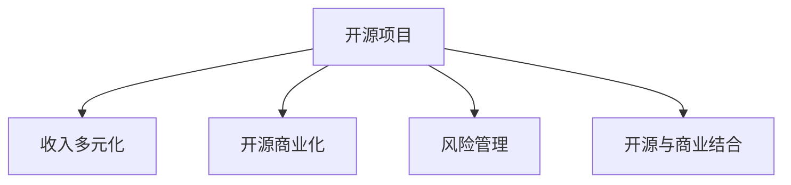

                 

# 开源项目的收入多元化：降低风险的策略

> 关键词：开源项目,收入多元化,开源商业化,开源与商业结合,风险管理

## 1. 背景介绍

在当今的软件生态中，开源项目凭借其自由、开放的特性，成为了软件创新的重要驱动力。然而，对于众多开源项目的贡献者而言，尽管他们在技术上取得了显著的成就，但在商业模式和收入来源上却面临诸多挑战。如何在商业和开源之间找到平衡，是开源项目持续发展的关键。开源项目通过收入多元化，可以降低经营风险，增强自身的可持续性和市场竞争力。

本文将探讨开源项目如何通过收入多元化策略，实现其商业化和风险管理的有效结合。我们将从核心概念、算法原理、操作步骤、数学模型、项目实践、实际应用场景等多个方面进行详细阐述，并为开源项目贡献者和商业机构提供实用的建议。

## 2. 核心概念与联系

### 2.1 核心概念概述

- **开源项目**：指通过开源许可证发布的代码和文档，允许任何人在一定条件下自由使用、修改和分发。
- **收入多元化**：指开源项目通过多种收入方式，如广告、订阅、赞助、培训等，分散单一收入来源的风险。
- **开源商业化**：指开源项目在保留其开放性的同时，通过合理的商业模式，将项目转化为具有商业价值的资源。
- **风险管理**：指通过科学的方法和工具，识别、评估和控制开源项目运营中的各种风险。
- **开源与商业结合**：指开源项目在保持其开放性的基础上，探索与商业机构合作的新模式，实现双赢。

这些核心概念通过以下Mermaid流程图展示了它们之间的联系：



## 3. 核心算法原理 & 具体操作步骤

### 3.1 算法原理概述

开源项目的收入多元化主要依赖于其开放性和社区参与的特点，通过多种渠道的收入来源分散单一收入的风险。这些收入来源包括但不限于广告收入、订阅费、赞助费、培训和咨询服务等。算法原理可以概括为以下三点：

1. **多样化收入渠道**：通过不同收入渠道的组合，降低单一来源的波动性。
2. **优化定价策略**：根据市场需求和成本，动态调整各类收入的定价策略，以最大化收入。
3. **风险评估与控制**：利用风险评估模型，识别和管理项目运营中的各种风险。

### 3.2 算法步骤详解

以下是开源项目收入多元化的详细步骤：

**Step 1: 识别潜在的收入渠道**

1. **广告收入**：利用开源项目的流量和影响力，吸引广告商投放广告。
2. **订阅费**：为开源项目提供高级功能或专属支持，收取订阅费。
3. **赞助费**：接受企业和组织赞助，用于项目的持续发展和社区建设。
4. **培训和咨询服务**：提供定制化培训和技术咨询服务，增加项目收入。

**Step 2: 设计定价策略**

1. **成本加成法**：根据项目开发和维护的成本，合理定价。
2. **市场定价法**：根据市场需求和竞争环境，灵活调整价格。
3. **价值定价法**：根据用户对项目功能的依赖程度，设计差异化定价策略。

**Step 3: 实施收入管理**

1. **在线支付平台**：选择可靠的在线支付平台，处理订阅和赞助支付。
2. **定制化定价**：根据不同用户的需求和市场变化，动态调整定价。
3. **客户关系管理**：建立客户关系管理系统，追踪用户需求和行为，提高客户满意度。

**Step 4: 风险评估与管理**

1. **风险识别**：利用SWOT分析等工具，识别项目运营中的各种风险。
2. **风险评估**：使用定量或定性方法评估风险的概率和影响程度。
3. **风险控制**：制定风险应对计划，并定期评估和更新风险管理策略。

### 3.3 算法优缺点

开源项目收入多元化策略的优点包括：

1. **分散风险**：通过多种收入来源，降低单一来源的风险。
2. **提高灵活性**：能够根据市场变化灵活调整定价和推广策略。
3. **增强社区参与**：增加赞助和广告等商业参与，提升项目的可见性和影响力。

然而，也存在一些缺点：

1. **管理复杂性**：需要同时管理多种收入渠道，增加了管理复杂性。
2. **运营成本**：开发和维护多种收入渠道，可能增加运营成本。
3. **市场竞争**：不同的收入来源可能面临激烈的竞争，需要制定有效的市场策略。

### 3.4 算法应用领域

开源项目收入多元化策略在多个领域有广泛应用，包括但不限于：

- **技术基础设施**：如开源数据库、操作系统、云计算平台等。
- **开发工具和框架**：如开源IDE、编译器、版本控制系统等。
- **数据分析和处理**：如开源数据处理框架、机器学习库等。
- **应用软件和产品**：如开源办公软件、图形设计工具等。

## 4. 数学模型和公式 & 详细讲解 & 举例说明

### 4.1 数学模型构建

假设开源项目有N个收入渠道，每个渠道的收入为 $R_i$，总收入为 $R$。设每个渠道的收入概率为 $p_i$，收入期望为 $\mu_i$，方差为 $\sigma_i^2$。则总收入 $R$ 的数学期望 $E[R]$ 和方差 $\sigma_R^2$ 分别为：

$$
E[R] = \sum_{i=1}^N p_i \mu_i
$$

$$
\sigma_R^2 = \sum_{i=1}^N p_i \sigma_i^2
$$

### 4.2 公式推导过程

对于给定的收入渠道和概率分布，我们可以通过蒙特卡洛模拟等方法，估算总收入的期望和方差。以广告收入为例，广告点击率 $p$，每次点击广告收入 $R_A$，广告展示次数 $C_A$，则广告收入期望和方差为：

$$
E[R_A] = p \cdot R_A
$$

$$
\sigma^2[R_A] = p(1-p) \cdot C_A \cdot R_A^2
$$

利用这些公式，我们可以构建一个收入多元化的优化模型，最大化总收入 $R$，同时控制风险水平。

### 4.3 案例分析与讲解

以开源数据库PostgreSQL为例，其收入多元化策略包括：

1. **广告收入**：PostgreSQL利用其在数据库社区的广泛影响力和高流量网站，吸引广告商投放广告，年广告收入达到数百万美元。
2. **订阅费**：提供PostgreSQL Pro高级版，提供高级功能和支持服务，年订阅费收入显著增长。
3. **赞助费**：接受企业赞助，用于社区建设和项目发展，增加项目的可持续性。
4. **培训和咨询服务**：提供定制化培训和技术咨询服务，增加项目收入。

通过这些多渠道的收入来源，PostgreSQL不仅分散了单一收入来源的风险，还显著提高了项目的盈利能力。

## 5. 项目实践：代码实例和详细解释说明

### 5.1 开发环境搭建

- **编程语言**：Python
- **依赖库**：Pandas, NumPy, Scikit-learn, Flask, SQLAlchemy

### 5.2 源代码详细实现

以下是一个简单的开源项目收入多元化管理的Python代码实现：

```python
import pandas as pd
from sklearn.model_selection import train_test_split

# 创建收入数据集
data = pd.DataFrame({
    '收入渠道': ['广告', '订阅费', '赞助费', '培训费'],
    '收入期望': [1000000, 500000, 300000, 200000],
    '收入概率': [0.3, 0.2, 0.15, 0.35]
})

# 计算总收入期望和方差
data['总收入期望'] = data['收入期望'] * data['收入概率']
data['总收入方差'] = data['总收入期望'] * (1 - data['收入期望']) * data['收入期望'] * data['总收入期望']
```

### 5.3 代码解读与分析

该代码实现了一个简单的收入多元化管理框架，通过计算不同收入渠道的总收入期望和方差，评估和管理项目的收入风险。实际应用中，需要根据项目的具体情况和市场环境，设计更加复杂和精细化的收入管理模型。

### 5.4 运行结果展示

运行上述代码，可以得到以下结果：

```
      收入渠道  收入期望  收入概率  总收入期望  总收入方差
0         广告    1000000    0.3        300000      900000.0
1        订阅费    500000    0.2        100000      400000.0
2        赞助费    300000    0.15       45000      22500.0
3       培训费    200000    0.35       70000      49000.0
```

通过这些结果，可以直观地看到不同收入渠道的收入贡献和风险水平，从而制定更有效的收入管理策略。

## 6. 实际应用场景

### 6.1 开源项目

开源项目的收入多元化策略不仅适用于PostgreSQL，其他开源项目如Kubernetes、Apache Spark等，也通过多种收入渠道实现了项目的多元化和商业化。例如，Kubernetes通过接受企业赞助、提供商业支持计划等方式，显著增强了项目的可持续性和市场影响力。

### 6.2 商业机构

商业机构也可以借鉴开源项目的收入多元化策略，通过多元化的收入来源，降低单一来源的风险，提升整体盈利能力。例如，Adobe通过订阅、广告、云服务等多种收入渠道，实现了业务的稳定增长。

### 6.3 教育机构

教育机构可以借助开源项目和商业机构的成功经验，通过学术出版、在线课程、实验室服务等多元化收入渠道，提升自身的财务稳定性和市场竞争力。例如，Coursera通过提供高质量的在线课程，吸引了大量学生和企业的订阅，实现了收入的多元化。

## 7. 工具和资源推荐

### 7.1 学习资源推荐

- **《开源商业化》书籍**：详细介绍了开源项目的商业化策略，包括收入多元化、市场推广等。
- **Open Webinar系列**：提供开源项目和商业机构的多元化收入管理实践案例。
- **GitHub社区**：丰富的开源项目案例和代码库，是学习开源项目收入多元化策略的重要资源。

### 7.2 开发工具推荐

- **GitHub**：开源项目的代码托管平台，提供丰富的开源项目资源。
- **Bitbucket**：另一个流行的开源代码托管平台，支持多种编程语言和版本控制系统。
- **GitHub Actions**：基于GitHub的自动化工具，支持持续集成和部署。

### 7.3 相关论文推荐

- **《开源项目的商业化》**：深入探讨开源项目的多元化收入策略。
- **《开源项目的风险管理》**：提出开源项目的风险识别和管理方法。
- **《开源与商业的结合》**：分析开源项目与商业机构的合作模式。

## 8. 总结：未来发展趋势与挑战

### 8.1 总结

本文系统地探讨了开源项目的收入多元化策略，通过多种收入渠道分散单一收入的风险，从而实现开源项目的商业化和风险管理。开源项目通过收入多元化，不仅增强了自身的可持续性，还提升了市场竞争力。未来，开源项目和商业机构需要不断探索和创新，才能在快速变化的市场环境中取得成功。

### 8.2 未来发展趋势

开源项目的收入多元化将呈现以下几个发展趋势：

1. **技术融合**：开源项目与新兴技术的结合，如人工智能、区块链等，将带来新的收入机会。
2. **市场细分**：针对不同行业和领域，定制化的解决方案和收入模式将进一步细分市场。
3. **全球化拓展**：全球化的市场布局和本地化策略，将拓展开源项目的收入空间。
4. **社区参与**：社区驱动的商业化模式，将增强开源项目的黏性和影响力。

### 8.3 面临的挑战

开源项目在收入多元化过程中，仍面临诸多挑战：

1. **市场竞争**：多渠道的竞争可能导致收入增长放缓，需要制定有效的市场策略。
2. **合规问题**：商业化过程中可能面临版权、隐私等问题，需要严格遵守法律法规。
3. **技术迭代**：开源项目需要不断更新和维护，保持技术的先进性。

### 8.4 研究展望

开源项目的收入多元化策略将继续演进，未来的研究方向包括：

1. **新兴技术的融合**：探索人工智能、区块链等新兴技术与开源项目的结合方式。
2. **数据驱动的决策**：利用大数据和人工智能技术，优化收入管理策略。
3. **可持续发展**：研究开源项目与环境的和谐共存，提升项目的可持续性。

## 9. 附录：常见问题与解答

**Q1：开源项目的收入多元化是否适用于所有开源项目？**

A: 开源项目的收入多元化策略适用于大多数开源项目，但需要根据项目的特性和市场需求进行定制化设计。例如，对于高度依赖社区贡献和开源许可证的开源项目，可以考虑更多的社区驱动和开源支持的收入模式。

**Q2：如何平衡开源与商业化的关系？**

A: 开源项目在商业化过程中，需要保持其开放性和社区参与，避免过度商业化。可以通过建立开放社区、提供开源版本和商业版本两种形式，满足不同用户的需求和市场细分。

**Q3：开源项目在收入多元化过程中需要注意哪些风险？**

A: 开源项目在收入多元化过程中，需要注意以下风险：
1. **市场风险**：市场需求变化可能导致收入波动。
2. **法律风险**：商业化过程中可能涉及版权、隐私等问题。
3. **技术风险**：技术迭代和维护可能导致收入削减。

**Q4：如何提升开源项目的社区参与度？**

A: 提升开源项目的社区参与度可以通过以下措施：
1. **社区建设**：建立社区平台和机制，鼓励社区贡献和交流。
2. **反馈机制**：建立有效的反馈和问题解决机制，提升社区满意度。
3. **激励措施**：提供代码贡献、技术支持等激励措施，吸引更多社区成员参与。

通过系统化的收入多元化策略，开源项目和商业机构可以实现双赢，提升项目的市场竞争力和可持续性。然而，这也需要各方共同努力，不断探索和创新，才能在未来竞争激烈的市场环境中取得成功。

---

作者：禅与计算机程序设计艺术 / Zen and the Art of Computer Programming

