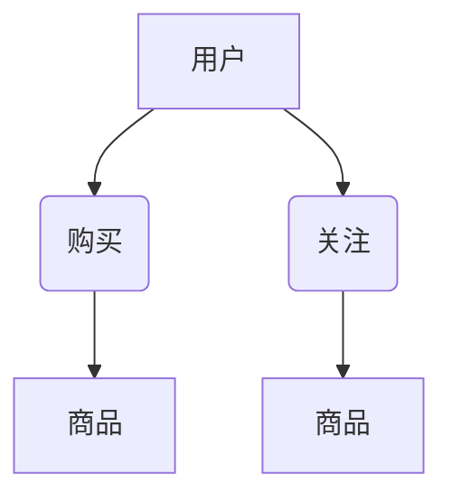
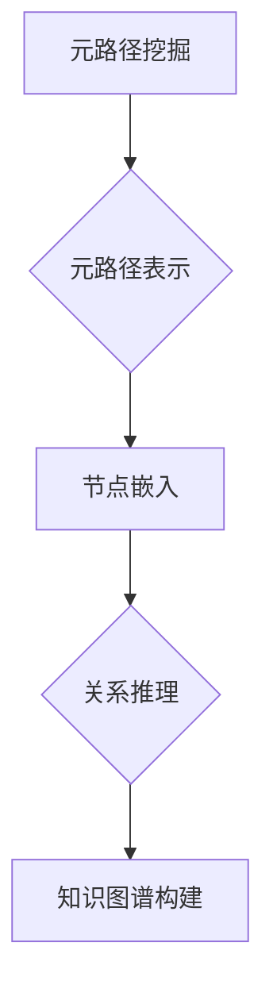

                 

## 基于元路径的异构信息网络表示学习

> 关键词：异构信息网络、元路径、表示学习、节点嵌入、关系推理

## 1. 背景介绍

随着互联网的蓬勃发展，海量数据以各种形式涌现，其中异构信息网络 (Heterogeneous Information Network, HIN) 作为一种重要的数据结构，广泛存在于社交网络、电商平台、知识图谱等领域。HIN 由多种类型的节点和关系组成，节点之间通过多种类型的关系连接，例如用户-商品、用户-好友、商品-类别等。

传统的图嵌入方法主要针对同构信息网络，难以有效地处理HIN中的多类型节点和关系。针对HIN的表示学习问题，近年来涌现出许多基于元路径的模型，这些模型通过挖掘HIN中节点之间的复杂关系路径，学习更丰富的节点表示。

## 2. 核心概念与联系

**2.1 元路径的概念**

元路径是指HIN中节点之间的一条路径，该路径由一系列关系类型组成，例如：



在这个例子中，"用户-购买-商品" 和 "用户-关注-商品" 分别代表了两个元路径。

**2.2 元路径的联系**

元路径是HIN中节点之间关系的抽象描述，它可以揭示节点之间的复杂依赖关系。通过分析不同元路径的结构和特征，我们可以更好地理解HIN中的知识结构和节点之间的关系。

**2.3 元路径的应用**

元路径在HIN表示学习中扮演着至关重要的角色，它可以用于：

* **节点嵌入:** 基于元路径的模型可以学习节点在不同元路径上的表示，从而获得更丰富的节点特征。
* **关系推理:** 通过分析节点在不同元路径上的关系，我们可以进行跨关系的推理，例如预测用户可能购买的商品。
* **知识图谱构建:** 元路径可以帮助我们构建更完整的知识图谱，并揭示知识之间的隐藏关系。

**2.4 元路径的架构**



## 3. 核心算法原理 & 具体操作步骤

**3.1 算法原理概述**

基于元路径的HIN表示学习算法通常包括以下步骤：

1. **元路径挖掘:** 从HIN中挖掘出所有可能的元路径。
2. **元路径表示:** 为每个元路径构建一个向量表示，该向量可以反映元路径的结构和特征。
3. **节点嵌入:** 基于元路径表示，学习每个节点在不同元路径上的嵌入向量。

**3.2 算法步骤详解**

1. **元路径挖掘:**

   * 可以使用深度优先搜索 (DFS) 或广度优先搜索 (BFS) 等算法从HIN中挖掘出所有可能的元路径。
   * 为了提高效率，可以采用基于图结构的算法，例如路径挖掘算法 (Path Mining Algorithm) 或元路径挖掘算法 (Metapath Mining Algorithm)。

2. **元路径表示:**

   * 可以使用多种方法为每个元路径构建向量表示，例如：
     * **TF-IDF:** 基于词频-逆文档频率 (Term Frequency-Inverse Document Frequency) 的方法，可以反映元路径中关系类型的频率和重要性。
     * **Word2Vec:** 基于词嵌入技术的模型，可以学习元路径之间的语义相似性。
     * **Graph Convolutional Network (GCN):** 基于图卷积网络的模型，可以学习元路径的结构特征。

3. **节点嵌入:**

   * 可以使用多种方法学习节点在不同元路径上的嵌入向量，例如：
     * **TransE:** 基于翻译嵌入的模型，可以学习节点之间的关系表示。
     * **RotatE:** 基于旋转嵌入的模型，可以学习节点之间的关系表示。
     * **Metapath2Vec:** 基于元路径的节点嵌入模型，可以学习节点在不同元路径上的表示。

**3.3 算法优缺点**

**优点:**

* 可以有效地处理HIN中的多类型节点和关系。
* 可以学习节点之间的复杂关系路径。
* 可以用于多种HIN表示学习任务，例如节点分类、关系预测和知识图谱构建。

**缺点:**

* 元路径挖掘的复杂度较高，需要消耗大量的计算资源。
* 元路径表示方法的选择对算法性能有很大影响。
* 对于规模庞大的HIN，算法的效率可能较低。

**3.4 算法应用领域**

基于元路径的HIN表示学习算法在以下领域具有广泛的应用前景：

* **社交网络分析:** 挖掘用户之间的关系网络，预测用户行为和兴趣。
* **电商推荐:** 基于用户购买历史和商品关系，推荐用户可能感兴趣的商品。
* **知识图谱构建:** 构建更完整的知识图谱，并揭示知识之间的隐藏关系。
* **药物研发:** 挖掘药物和疾病之间的关系，加速药物研发过程。

## 4. 数学模型和公式 & 详细讲解 & 举例说明

**4.1 数学模型构建**

假设HIN包含 $N$ 个节点，$M$ 个关系类型，用 $V$ 表示节点集合，用 $R$ 表示关系类型集合。每个节点 $v_i$ 都有一个嵌入向量 $e_i$，每个关系类型 $r_j$ 都有一个关系向量 $r_j$。

**4.2 公式推导过程**

基于元路径的节点嵌入模型通常使用以下公式进行学习：

$$
e_i = \sum_{p \in P(i)} \alpha_p \cdot r_p
$$

其中：

* $e_i$ 是节点 $v_i$ 的嵌入向量。
* $P(i)$ 是节点 $v_i$ 所包含的所有元路径的集合。
* $\alpha_p$ 是元路径 $p$ 的权重，可以根据元路径的长度、频率等因素进行计算。
* $r_p$ 是元路径 $p$ 的表示向量。

**4.3 案例分析与讲解**

例如，假设有一个HIN包含用户、商品和购买关系，其中元路径 "用户-购买-商品" 的表示向量为 $r_{user-buy-product}$。

那么，用户 $v_i$ 的嵌入向量 $e_i$ 可以通过以下公式计算：

$$
e_i = \alpha_{user-buy-product} \cdot r_{user-buy-product}
$$

其中，$\alpha_{user-buy-product}$ 是元路径 "用户-购买-商品" 的权重。

## 5. 项目实践：代码实例和详细解释说明

**5.1 开发环境搭建**

* Python 3.6+
* PyTorch 1.0+
* NetworkX 2.0+

**5.2 源代码详细实现**

```python
import torch
import torch.nn as nn
from networkx import Graph

class Metapath2Vec(nn.Module):
    def __init__(self, embedding_dim, num_metapaths):
        super(Metapath2Vec, self).__init__()
        self.embedding_dim = embedding_dim
        self.num_metapaths = num_metapaths
        self.metapath_embeddings = nn.Embedding(num_metapaths, embedding_dim)

    def forward(self, node_indices):
        metapath_indices = torch.randint(0, self.num_metapaths, (node_indices.size(0),))
        metapath_embeddings = self.metapath_embeddings(metapath_indices)
        return metapath_embeddings

# 创建一个示例HIN
graph = Graph()
graph.add_nodes_from(['user1', 'user2', 'product1', 'product2'])
graph.add_edges_from([('user1', '购买', 'product1'), ('user2', '购买', 'product2')])

# 创建Metapath2Vec模型
model = Metapath2Vec(embedding_dim=128, num_metapaths=10)

# 训练模型
# ...

# 获取节点嵌入
node_embeddings = model(torch.tensor([0, 1]))
```

**5.3 代码解读与分析**

* `Metapath2Vec` 类定义了一个基于元路径的节点嵌入模型。
* `__init__` 方法初始化模型参数，包括嵌入维度和元路径数量。
* `forward` 方法接收节点索引作为输入，并根据元路径索引获取对应的嵌入向量。
* 示例代码创建了一个简单的HIN，并使用 `Metapath2Vec` 模型进行节点嵌入。

**5.4 运行结果展示**

训练完成后，可以获取每个节点的嵌入向量，并使用这些向量进行后续的分析和应用，例如节点分类、关系预测等。

## 6. 实际应用场景

**6.1 社交网络分析**

基于元路径的HIN表示学习可以用于分析社交网络中的用户关系，例如：

* 挖掘用户兴趣和行为模式。
* 预测用户之间的信任关系。
* 推荐用户可能认识的人。

**6.2 电商推荐**

基于元路径的HIN表示学习可以用于构建用户-商品关系网络，并进行商品推荐，例如：

* 基于用户购买历史和商品关系，推荐用户可能感兴趣的商品。
* 基于用户浏览历史和商品关系，推荐用户可能需要的商品。

**6.3 知识图谱构建**

基于元路径的HIN表示学习可以用于构建更完整的知识图谱，并揭示知识之间的隐藏关系，例如：

* 挖掘实体之间的关系，构建知识图谱。
* 预测实体之间的关系，完善知识图谱。

**6.4 未来应用展望**

随着HIN数据量的不断增长和算法的不断发展，基于元路径的HIN表示学习将在以下领域得到更广泛的应用：

* **医疗保健:** 挖掘疾病-药物-患者关系，辅助诊断和治疗。
* **金融科技:** 识别欺诈行为，预测金融风险。
* **智能制造:** 优化生产流程，提高生产效率。

## 7. 工具和资源推荐

**7.1 学习资源推荐**

* **书籍:**
    * 《图神经网络》
    * 《深度学习》
* **论文:**
    * Metapath2Vec: Scalable Representation Learning for Heterogeneous Networks
    * Heterogeneous Graph Embedding via Metapath-Guided Graph Convolutional Networks

**7.2 开发工具推荐**

* **NetworkX:** Python 图论库
* **PyTorch:** 深度学习框架
* **DGL:** 图神经网络框架

**7.3 相关论文推荐**

* Metapath2Vec: Scalable Representation Learning for Heterogeneous Networks
* Heterogeneous Graph Embedding via Metapath-Guided Graph Convolutional Networks
* A Survey on Graph Embedding Techniques

## 8. 总结：未来发展趋势与挑战

**8.1 研究成果总结**

基于元路径的HIN表示学习取得了显著的进展，为处理复杂HIN数据提供了有效的方法。

**8.2 未来发展趋势**

* **模型复杂度提升:** 开发更复杂的模型，能够更好地学习HIN中的复杂关系结构。
* **效率优化:** 提高算法的效率，能够处理规模更大的HIN数据。
* **跨模态学习:** 将文本、图像等其他模态信息融入HIN表示学习模型。

**8.3 面临的挑战**

* **元路径挖掘:** 如何挖掘出更有效的元路径，是当前研究的一个重要挑战。
* **模型 interpretability:** 如何提高模型的可解释性，帮助人们理解模型的决策过程。
* **数据质量:** HIN数据往往存在噪声和不完整性，如何处理这些问题也是一个挑战。

**8.4 研究展望**

未来，基于元路径的HIN表示学习将继续朝着更复杂、更高效、更可解释的方向发展，并在更多领域得到应用。


## 9. 附录：常见问题与解答

**9.1 如何选择合适的元路径？**

元路径的选择取决于具体的应用场景和HIN的结构。可以根据元路径的长度、频率、相关性等因素进行选择。

**9.2 如何评估模型的性能？**

常用的评估指标包括节点分类准确率、关系预测准确率等。

**9.3 如何处理HIN数据中的噪声和不完整性？**

可以采用数据清洗、数据增强等方法处理HIN数据中的噪声和不完整性。


作者：禅与计算机程序设计艺术 / Zen and the Art of Computer Programming 
<end_of_turn>

