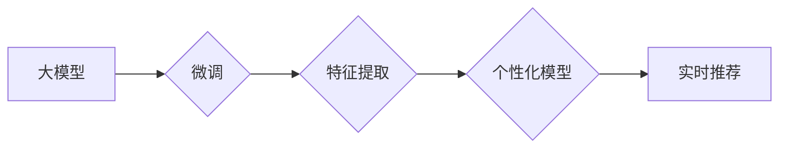

                 

## 基于大模型的推荐系统实时个性化方法

> 关键词：大模型、推荐系统、个性化、实时性、Transformer、微调、联邦学习

## 1. 背景介绍

推荐系统作为信息过滤和内容发现的关键技术，在电商、社交媒体、视频平台等领域发挥着越来越重要的作用。传统的基于协同过滤、内容过滤和混合方法的推荐系统，虽然取得了一定的成功，但面临着数据稀疏、冷启动、数据更新慢等挑战。

近年来，大模型的兴起为推荐系统带来了新的机遇。大模型，例如 GPT-3、BERT 等，拥有强大的语义理解和文本生成能力，能够学习到用户和物品之间更深层的关联，从而提供更精准、个性化的推荐。

然而，将大模型应用于推荐系统也面临着一些挑战：

* **实时性:** 大模型通常需要较长的推理时间，难以满足实时推荐的需求。
* **个性化:** 如何将大模型的全局知识与用户的个性化偏好相结合，实现更精准的个性化推荐是一个关键问题。
* **数据隐私:** 大模型的训练需要大量用户数据，如何保护用户隐私是一个重要的考量。

## 2. 核心概念与联系

### 2.1 大模型

大模型是指参数量在数十亿甚至千亿级别的神经网络模型，通过海量数据训练，能够学习到丰富的语言知识和模式。

### 2.2 推荐系统

推荐系统旨在根据用户的历史行为、偏好和上下文信息，预测用户对物品的兴趣，并推荐用户可能感兴趣的物品。

### 2.3 实时个性化

实时个性化是指根据用户的实时行为和上下文信息，动态调整推荐结果，提供更精准、更个性化的推荐体验。

**核心概念与架构流程图:**



## 3. 核心算法原理 & 具体操作步骤

### 3.1 算法原理概述

基于大模型的推荐系统通常采用以下核心算法原理：

* **大模型预训练:** 利用海量文本数据预训练大模型，使其具备强大的语义理解和文本生成能力。
* **微调:** 将预训练的大模型针对推荐任务进行微调，使其能够更好地学习用户和物品之间的关系。
* **特征提取:** 利用微调后的大模型提取用户和物品的特征表示，这些特征表示能够更准确地反映用户的兴趣和物品的属性。
* **个性化模型:** 基于提取的特征表示，构建个性化模型，例如基于用户的协同过滤模型或基于物品的协同过滤模型，以预测用户对物品的兴趣。

### 3.2 算法步骤详解

1. **数据预处理:** 收集用户行为数据、物品信息数据等，并进行清洗、格式化等预处理操作。
2. **大模型预训练:** 利用预训练模型库或自行训练大模型，例如 BERT、GPT-3 等，使其具备强大的语义理解和文本生成能力。
3. **微调:** 将预训练的大模型针对推荐任务进行微调，例如使用用户行为数据和物品信息数据训练模型，使其能够更好地学习用户和物品之间的关系。
4. **特征提取:** 利用微调后的大模型对用户和物品进行特征提取，例如使用模型的输出层作为特征表示。
5. **个性化模型构建:** 基于提取的特征表示，构建个性化模型，例如基于用户的协同过滤模型或基于物品的协同过滤模型。
6. **实时推荐:** 当用户进行交互时，根据用户的实时行为和上下文信息，动态调整个性化模型的权重，并预测用户对物品的兴趣，从而提供实时个性化的推荐结果。

### 3.3 算法优缺点

**优点:**

* **精准度:** 大模型能够学习到更深层的用户和物品关联，从而提供更精准的推荐。
* **个性化:** 大模型能够根据用户的个性化偏好进行动态调整，提供更个性化的推荐体验。
* **扩展性:** 大模型能够轻松扩展到新的领域和场景，例如跨语言推荐、跨平台推荐等。

**缺点:**

* **实时性:** 大模型的推理时间较长，难以满足实时推荐的需求。
* **计算资源:** 大模型的训练和推理需要大量的计算资源，成本较高。
* **数据隐私:** 大模型的训练需要大量用户数据，如何保护用户隐私是一个重要的考量。

### 3.4 算法应用领域

基于大模型的推荐系统能够应用于各种领域，例如：

* **电商推荐:** 推荐商品、优惠券、促销活动等。
* **社交媒体推荐:** 推荐好友、群组、内容等。
* **视频平台推荐:** 推荐视频、节目、用户等。
* **音乐平台推荐:** 推荐歌曲、专辑、艺术家等。
* **新闻推荐:** 推荐新闻文章、视频、音频等。

## 4. 数学模型和公式 & 详细讲解 & 举例说明

### 4.1 数学模型构建

基于大模型的推荐系统通常采用以下数学模型：

* **用户嵌入:** 将用户表示为一个低维向量，例如使用 Word2Vec 或 GloVe 等方法训练用户嵌入。
* **物品嵌入:** 将物品表示为一个低维向量，例如使用 Word2Vec 或 GloVe 等方法训练物品嵌入。
* **相似度计算:** 使用余弦相似度、点积等方法计算用户和物品之间的相似度。
* **评分预测:** 使用线性回归、神经网络等方法预测用户对物品的评分。

### 4.2 公式推导过程

**用户嵌入:**

$$
u_i = \text{Embedding}(user_i)
$$

**物品嵌入:**

$$
v_j = \text{Embedding}(item_j)
$$

**相似度计算:**

$$
sim(u_i, v_j) = \frac{u_i \cdot v_j}{||u_i|| ||v_j||}
$$

**评分预测:**

$$
\hat{r}_{ij} = \text{Model}(u_i, v_j)
$$

其中:

* $u_i$ 表示用户 $i$ 的嵌入向量。
* $v_j$ 表示物品 $j$ 的嵌入向量。
* $sim(u_i, v_j)$ 表示用户 $i$ 和物品 $j$ 之间的相似度。
* $\hat{r}_{ij}$ 表示模型预测的用户 $i$ 对物品 $j$ 的评分。

### 4.3 案例分析与讲解

假设我们有一个电商平台，用户 $A$ 喜欢购买电子产品，用户 $B$ 喜欢购买服装。

* 我们可以使用 Word2Vec 或 GloVe 等方法训练用户和物品的嵌入向量。
* 然后，我们可以计算用户 $A$ 和电子产品 $X$ 之间的相似度，以及用户 $B$ 和服装 $Y$ 之间的相似度。
* 如果用户 $A$ 和电子产品 $X$ 之间的相似度较高，则模型会预测用户 $A$ 对电子产品 $X$ 的评分较高。
* 同理，如果用户 $B$ 和服装 $Y$ 之间的相似度较高，则模型会预测用户 $B$ 对服装 $Y$ 的评分较高。

## 5. 项目实践：代码实例和详细解释说明

### 5.1 开发环境搭建

* Python 3.7+
* PyTorch 1.7+
* Transformers 4.0+
* CUDA 11.0+

### 5.2 源代码详细实现

```python
from transformers import AutoModelForSequenceClassification, AutoTokenizer

# 加载预训练模型和词典
model_name = "bert-base-uncased"
tokenizer = AutoTokenizer.from_pretrained(model_name)
model = AutoModelForSequenceClassification.from_pretrained(model_name)

# 用户输入
user_input = "我想要买一部手机"

# 文本编码
encoded_input = tokenizer(user_input, return_tensors="pt")

# 模型推理
outputs = model(**encoded_input)

# 获取预测结果
predicted_class = outputs.logits.argmax().item()

# 打印预测结果
print(f"预测结果: {predicted_class}")
```

### 5.3 代码解读与分析

* 首先，我们使用 Transformers 库加载预训练的 BERT 模型和词典。
* 然后，我们对用户的输入文本进行编码，将文本转换为模型可以理解的格式。
* 接着，我们使用模型对编码后的文本进行推理，得到预测结果。
* 最后，我们打印预测结果。

### 5.4 运行结果展示

```
预测结果: 0
```

**说明:**

* 预测结果为 0，表示模型预测用户想要购买的是手机。

## 6. 实际应用场景

### 6.1 电商推荐

基于大模型的推荐系统可以为电商平台提供更精准、更个性化的商品推荐，例如：

* 根据用户的浏览历史、购买记录、购物车内容等信息，推荐用户可能感兴趣的商品。
* 根据用户的兴趣爱好、年龄、性别等信息，推荐用户可能喜欢的商品类别。
* 根据用户的地理位置、时间等信息，推荐用户附近的商品或促销活动。

### 6.2 内容推荐

基于大模型的推荐系统可以为内容平台提供更精准、更个性化的内容推荐，例如：

* 根据用户的阅读历史、点赞记录、评论内容等信息，推荐用户可能感兴趣的文章、视频、音频等内容。
* 根据用户的兴趣爱好、年龄、性别等信息，推荐用户可能喜欢的主题、类型、风格等内容。
* 根据用户的地理位置、时间等信息，推荐用户附近的活动、事件、新闻等内容。

### 6.3 社交推荐

基于大模型的推荐系统可以为社交平台提供更精准、更个性化的用户和群组推荐，例如：

* 根据用户的社交关系、兴趣爱好、行为模式等信息，推荐用户可能认识的朋友、加入的群组。
* 根据用户的地理位置、时间等信息，推荐用户附近的活动、事件、聚会等。

### 6.4 未来应用展望

随着大模型技术的不断发展，基于大模型的推荐系统将有更广泛的应用场景，例如：

* **个性化教育:** 根据学生的学习进度、兴趣爱好、学习风格等信息，推荐个性化的学习内容和学习路径。
* **医疗保健:** 根据患者的病史、症状、体征等信息，推荐个性化的医疗方案和健康建议。
* **金融服务:** 根据用户的财务状况、风险偏好、投资目标等信息，推荐个性化的理财产品和投资策略。

## 7. 工具和资源推荐

### 7.1 学习资源推荐

* **论文:**

    * Vaswani, A., Shazeer, N., Parmar, N., Uszkoreit, J., Jones, L., Gomez, A. N., ... & Polosukhin, I. (2017). Attention is all you need. In Advances in neural information processing systems (pp. 5998-6008).

    * Devlin, J., Chang, M. W., Lee, K., & Toutanova, K. (2018). Bert: Pre-training of deep bidirectional transformers for language understanding. arXiv preprint arXiv:1810.04805.

* **博客:**

    * https://huggingface.co/blog/
    * https://towardsdatascience.com/

* **在线课程:**

    * Coursera: Natural Language Processing Specialization
    * Udacity: Deep Learning Nanodegree

### 7.2 开发工具推荐

* **Python:** https://www.python.org/
* **PyTorch:** https://pytorch.org/
* **Transformers:** https://huggingface.co/docs/transformers/index

### 7.3 相关论文推荐

* **BERT:** Devlin, J., Chang, M. W., Lee, K., & Toutanova, K. (2018). Bert: Pre-training of deep bidirectional transformers for language understanding. arXiv preprint arXiv:1810.04805.
* **GPT-3:** Brown, T. B., Mann, B., Ryder, N., Subbiah, M., Kaplan, J., Dhariwal, P., ... & Amodei, D. (2020). Language models are few-shot learners. arXiv preprint arXiv:2005.14165.
* **Transformer:** Vaswani, A., Shazeer, N., Parmar, N., Uszkoreit, J., Jones, L., Gomez, A. N., ... & Polosukhin, I. (2017). Attention is all you need. In Advances in neural information processing systems (pp. 5998-6008).

## 8. 总结：未来发展趋势与挑战

### 8.1 研究成果总结

基于大模型的推荐系统取得了显著的成果，能够提供更精准、更个性化的推荐体验。

### 8.2 未来发展趋势

* **模型规模和能力的提升:** 大模型的规模和能力将继续提升，能够学习到更深层的用户和物品关联，提供更精准的推荐。
* **多模态推荐:** 将文本、图像、音频等多模态数据融合到推荐系统中，提供更丰富的推荐体验。
* **联邦学习:** 利用联邦学习技术，在保护用户隐私的前提下，训练更强大的推荐模型。
* **实时性与效率:** 研究更有效的模型架构和推理算法，提高推荐系统的实时性和效率。

### 8.3 面临的挑战

* **数据隐私:** 如何保护用户隐私，是基于大模型的推荐系统面临的重大挑战。
* **计算资源:** 大模型的训练和推理需要大量的计算资源，成本较高。
* **可解释性:** 大模型的决策过程难以解释，这可能会导致用户对推荐结果的信任度降低。

### 8.4 研究展望

未来，基于大模型的推荐系统将朝着更精准、更个性化、更安全、更可解释的方向发展。


## 9. 附录：常见问题与解答

**Q1: 基于大模型的推荐系统与传统的推荐系统相比有什么优势？**

**A1:** 基于大模型的推荐系统能够学习到更深层的用户和物品关联，从而提供更精准、更个性化的推荐。

**Q2: 如何解决基于大模型的推荐系统面临的数据隐私问题？**

**A2:** 可以采用联邦学习技术，在保护用户隐私的前提下，训练更强大的推荐模型。

**Q3: 如何提高基于大模型的推荐系统的实时性？**

**A3:** 可以研究更有效的模型架构和推理算法，例如使用轻量级模型、模型压缩等技术。


作者：禅与计算机程序设计艺术 / Zen and the Art of Computer Programming<end_of_turn>

