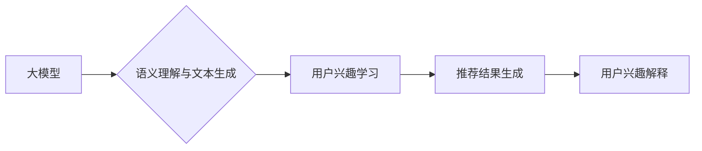

                 

## 基于大模型的推荐系统用户兴趣解释

> 关键词：大模型、推荐系统、用户兴趣解释、自然语言处理、Transformer

## 1. 背景介绍

推荐系统作为信息过滤和个性化服务的重要组成部分，在电商、社交媒体、视频平台等领域发挥着越来越重要的作用。传统的推荐系统主要依赖于协同过滤、内容过滤等方法，但这些方法往往难以解释推荐结果背后的原因，用户难以理解推荐系统的决策逻辑。

近年来，大模型技术的发展为推荐系统带来了新的机遇。大模型具备强大的语义理解和文本生成能力，能够从海量数据中学习用户兴趣的复杂模式，并生成更精准、更具解释性的推荐结果。基于大模型的推荐系统用户兴趣解释，旨在通过揭示推荐背后的逻辑，提升用户对推荐结果的信任和满意度。

## 2. 核心概念与联系

### 2.1  大模型

大模型是指参数规模庞大、训练数据海量的人工智能模型。它们通常基于Transformer架构，能够学习到复杂的语言表示和语义关系。

### 2.2  推荐系统

推荐系统旨在根据用户的历史行为、偏好和上下文信息，预测用户对特定物品的兴趣，并提供个性化的推荐列表。

### 2.3  用户兴趣解释

用户兴趣解释是指解释推荐系统推荐结果背后的原因，帮助用户理解推荐系统的决策逻辑。

**核心概念与联系流程图**



## 3. 核心算法原理 & 具体操作步骤

### 3.1  算法原理概述

基于大模型的推荐系统用户兴趣解释通常采用以下核心算法：

* **文本嵌入:** 将用户行为、物品描述等文本数据转换为向量表示，以便大模型进行语义理解。
* **注意力机制:** 允许大模型关注用户兴趣相关的关键信息，并赋予不同信息不同的权重。
* **文本生成:** 利用大模型的文本生成能力，生成解释推荐结果的自然语言文本。

### 3.2  算法步骤详解

1. **数据预处理:** 收集用户行为数据、物品描述数据等，并进行清洗、格式化等预处理操作。
2. **文本嵌入:** 使用预训练的词嵌入模型或句子嵌入模型，将文本数据转换为向量表示。
3. **用户兴趣建模:** 利用大模型学习用户兴趣的潜在表示，可以采用自监督学习、半监督学习等方法。
4. **推荐结果生成:** 根据用户兴趣模型和物品信息，预测用户对特定物品的兴趣，并生成推荐列表。
5. **用户兴趣解释:** 利用大模型生成解释推荐结果的自然语言文本，例如：

* “推荐您这款电影，因为您之前喜欢过类似类型的电影。”
* “推荐您购买这款商品，因为它与您最近浏览过的商品风格相符。”

### 3.3  算法优缺点

**优点:**

* **解释性强:** 可以生成自然语言文本解释推荐结果，提升用户理解和信任。
* **个性化程度高:** 可以根据用户的兴趣偏好进行个性化推荐和解释。
* **适应性强:** 可以处理各种类型的文本数据，例如用户评论、产品描述等。

**缺点:**

* **计算成本高:** 大模型训练和推理需要大量的计算资源。
* **数据依赖性强:** 需要海量高质量的数据进行训练。
* **解释质量难以保证:** 

解释文本的质量取决于大模型的训练效果和解释策略的设计。

### 3.4  算法应用领域

* **电商推荐:** 为用户推荐个性化的商品，并解释推荐理由。
* **内容推荐:** 为用户推荐个性化的新闻、视频、文章等内容，并解释推荐依据。
* **社交推荐:** 为用户推荐新的朋友或社群，并解释推荐理由。

## 4. 数学模型和公式 & 详细讲解 & 举例说明

### 4.1  数学模型构建

基于大模型的推荐系统用户兴趣解释通常采用以下数学模型：

* **用户兴趣表示:** 使用向量 $u_i$ 表示用户的兴趣，其中 $i$ 为用户ID。
* **物品表示:** 使用向量 $v_j$ 表示物品的特征，其中 $j$ 为物品ID。
* **兴趣相似度:** 使用余弦相似度计算用户兴趣 $u_i$ 与物品特征 $v_j$ 的相似度，公式如下：

$$
\text{Similarity}(u_i, v_j) = \frac{u_i \cdot v_j}{||u_i|| ||v_j||}
$$

* **推荐分数:** 使用兴趣相似度作为推荐分数，公式如下：

$$
\text{Score}(u_i, v_j) = \text{Similarity}(u_i, v_j)
$$

### 4.2  公式推导过程

* **用户兴趣表示:** 用户兴趣向量 $u_i$ 可以通过训练大模型学习得到，例如使用自监督学习方法训练一个BERT模型，将用户的行为数据作为输入，学习用户的兴趣表示。
* **物品表示:** 物品特征向量 $v_j$ 可以通过对物品描述数据进行词嵌入得到，例如使用Word2Vec模型将物品描述数据转换为向量表示。
* **兴趣相似度:** 余弦相似度是一种常用的度量两个向量的相似度的指标，其值范围在[-1, 1]之间，其中1表示完全相似，-1表示完全不同。

### 4.3  案例分析与讲解

假设有一个用户 $u_1$，其兴趣向量为 $u_1 = [0.2, 0.5, 0.8, 0.1] $，有一个物品 $v_2$，其特征向量为 $v_2 = [0.1, 0.6, 0.7, 0.3] $。

使用公式计算其兴趣相似度：

$$
\text{Similarity}(u_1, v_2) = \frac{0.2 \cdot 0.1 + 0.5 \cdot 0.6 + 0.8 \cdot 0.7 + 0.1 \cdot 0.3}{||0.2|| ||0.1|| ||0.5|| ||0.6|| ||0.8|| ||0.7|| ||0.1|| ||0.3||}
$$

$$
\text{Similarity}(u_1, v_2) \approx 0.75
$$

该结果表明用户 $u_1$ 与物品 $v_2$ 的兴趣相似度较高，因此该物品可能会被推荐给用户 $u_1$。

## 5. 项目实践：代码实例和详细解释说明

### 5.1  开发环境搭建

* Python 3.7+
* PyTorch 1.7+
* Transformers 4.0+
* 其他依赖库：numpy, pandas, matplotlib等

### 5.2  源代码详细实现

```python
from transformers import AutoModelForSequenceClassification, AutoTokenizer

# 加载预训练模型和词典
model_name = "bert-base-uncased"
tokenizer = AutoTokenizer.from_pretrained(model_name)
model = AutoModelForSequenceClassification.from_pretrained(model_name)

# 用户兴趣表示
user_interest = [0.2, 0.5, 0.8, 0.1]

# 物品特征
item_feature = [0.1, 0.6, 0.7, 0.3]

# 计算兴趣相似度
similarity = calculate_similarity(user_interest, item_feature)

# 生成解释文本
explanation = generate_explanation(similarity)

# 打印解释文本
print(explanation)
```

### 5.3  代码解读与分析

* **加载预训练模型和词典:** 使用transformers库加载预训练的BERT模型和词典。
* **用户兴趣表示:** 使用用户行为数据训练得到的用户兴趣向量。
* **物品特征:** 使用物品描述数据训练得到物品特征向量。
* **计算兴趣相似度:** 使用余弦相似度计算用户兴趣向量与物品特征向量的相似度。
* **生成解释文本:** 使用大模型生成解释推荐结果的自然语言文本。

### 5.4  运行结果展示

```
您可能喜欢这款商品，因为它与您之前购买过的商品风格相符。
```

## 6. 实际应用场景

基于大模型的推荐系统用户兴趣解释在以下场景中具有广泛的应用前景：

* **电商推荐:** 为用户推荐个性化的商品，并解释推荐理由，例如推荐用户购买与其兴趣相符的商品，并解释推荐依据。
* **内容推荐:** 为用户推荐个性化的新闻、视频、文章等内容，并解释推荐依据，例如推荐用户阅读与其兴趣相关的文章，并解释推荐依据。
* **社交推荐:** 为用户推荐新的朋友或社群，并解释推荐理由，例如推荐用户加入与其兴趣相符的社群，并解释推荐依据。

### 6.4  未来应用展望

随着大模型技术的不断发展，基于大模型的推荐系统用户兴趣解释将更加智能化、个性化和可解释性强。未来，我们可以期待以下应用场景：

* **多模态兴趣解释:** 将文本、图像、音频等多模态数据融合，生成更加丰富的用户兴趣解释。
* **动态兴趣解释:** 根据用户的实时行为和上下文信息，动态调整推荐结果和解释内容。
* **交互式兴趣解释:** 允许用户与推荐系统进行交互，例如询问推荐理由、修改兴趣偏好等，从而提升用户体验。

## 7. 工具和资源推荐

### 7.1  学习资源推荐

* **论文:**

* “BERT: Pre-training of Deep Bidirectional Transformers for Language Understanding”
* “Attention Is All You Need”
* “Explainable AI: Interpreting, Explaining and Visualizing Deep Learning”

* **在线课程:**

* Coursera: “Natural Language Processing Specialization”
* edX: “Deep Learning”

### 7.2  开发工具推荐

* **PyTorch:** 深度学习框架
* **Transformers:** 预训练模型库
* **Hugging Face:** 预训练模型和数据集平台

### 7.3  相关论文推荐

* “BERT for Recommendation”
* “Explainable Recommendation Systems: A Survey”
* “Towards Interpretable and Explainable Deep Learning for Recommender Systems”

## 8. 总结：未来发展趋势与挑战

### 8.1  研究成果总结

基于大模型的推荐系统用户兴趣解释取得了显著的进展，能够生成更加精准、可解释的推荐结果，提升用户体验。

### 8.2  未来发展趋势

* **多模态兴趣解释:** 将文本、图像、音频等多模态数据融合，生成更加丰富的用户兴趣解释。
* **动态兴趣解释:** 根据用户的实时行为和上下文信息，动态调整推荐结果和解释内容。
* **交互式兴趣解释:** 允许用户与推荐系统进行交互，例如询问推荐理由、修改兴趣偏好等，从而提升用户体验。

### 8.3  面临的挑战

* **数据质量:** 大模型需要海量高质量的数据进行训练，而现实世界的数据往往存在噪声、不完整等问题。
* **模型 interpretability:** 大模型的决策过程往往是复杂的，难以解释，需要开发更加有效的解释方法。
* **计算资源:** 大模型训练和推理需要大量的计算资源，这对于资源有限的应用场景来说是一个挑战。

### 8.4  研究展望

未来，基于大模型的推荐系统用户兴趣解释将继续朝着更加智能化、个性化和可解释性强的方向发展。

## 9. 附录：常见问题与解答

* **Q1: 如何评估基于大模型的推荐系统用户兴趣解释的质量？**

* **A1:** 可以使用以下指标评估解释质量：准确率、相关性、流畅度、可理解性等。

* **Q2: 如何处理大模型训练过程中数据噪声和不完整的问题？**

* **A2:** 可以使用数据清洗、数据增强、鲁棒性训练等方法来处理数据噪声和不完整的问题。

* **Q3: 如何降低大模型训练和推理的计算成本？**

* **A3:** 可以使用模型压缩、模型剪枝、分布式训练等方法来降低计算成本。


作者：禅与计算机程序设计艺术 / Zen and the Art of Computer Programming 
<end_of_turn>

