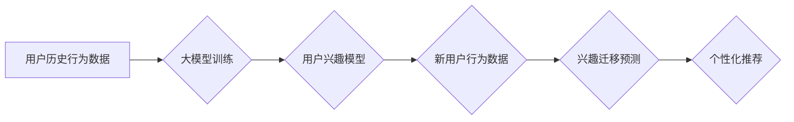

                 

## 基于大模型的推荐系统用户兴趣迁移

> 关键词：大模型、推荐系统、用户兴趣迁移、迁移学习、冷启动问题、个性化推荐

## 1. 背景介绍

推荐系统作为信息过滤和个性化内容展示的重要工具，在电商、社交媒体、视频平台等领域发挥着越来越重要的作用。传统的推荐系统主要依赖于用户历史行为数据，例如点击、购买、评分等，通过协同过滤、内容过滤等算法来预测用户潜在兴趣并提供个性化推荐。然而，随着用户行为数据的稀疏性和动态性，传统的推荐系统面临着越来越多的挑战。

**1.1  用户兴趣迁移现象**

用户兴趣并非静态不变的，随着时间推移，用户的喜好和偏好会发生变化。例如，一个用户曾经喜欢看科幻电影，但随着年龄增长，可能开始更喜欢观看剧情片。这种用户兴趣迁移现象使得传统的基于历史行为数据的推荐系统难以准确预测用户的最新兴趣，从而导致推荐结果的准确性和个性化程度下降。

**1.2  大模型的优势**

近年来，大模型技术取得了长足的进步，例如GPT-3、BERT等，这些模型拥有强大的语义理解和文本生成能力，能够从海量文本数据中学习到丰富的知识和模式。大模型的优势为解决用户兴趣迁移问题提供了新的思路。

## 2. 核心概念与联系

**2.1  迁移学习**

迁移学习是一种机器学习范式，它利用已训练好的模型在源任务上的知识迁移到目标任务中，以提高目标任务的学习效率和性能。在推荐系统领域，可以将源任务定义为学习用户兴趣的通用模型，目标任务定义为预测特定用户的最新兴趣。

**2.2  大模型在推荐系统中的应用**

大模型可以应用于推荐系统的多个环节，例如：

* **用户兴趣建模:** 利用大模型对用户的历史行为数据和文本描述进行分析，构建更精准的用户兴趣模型。
* **内容理解和匹配:** 利用大模型对商品、文章、视频等内容进行理解和分析，提高内容与用户兴趣的匹配度。
* **个性化推荐生成:** 利用大模型生成个性化的推荐列表，并根据用户的反馈进行动态调整。

**2.3  用户兴趣迁移流程图**



## 3. 核心算法原理 & 具体操作步骤

**3.1  算法原理概述**

基于大模型的用户兴趣迁移推荐算法主要基于迁移学习的思想，利用预训练的大模型对用户兴趣进行建模，并根据用户的最新行为数据进行迁移学习，以预测用户的最新兴趣。

**3.2  算法步骤详解**

1. **预训练大模型:** 使用海量文本数据预训练一个强大的语言模型，例如BERT、GPT-3等。
2. **用户兴趣特征提取:** 将用户的历史行为数据和文本描述输入预训练好的大模型，提取用户的兴趣特征。
3. **迁移学习模型训练:** 使用提取的用户兴趣特征和用户的最新行为数据训练一个迁移学习模型，例如Fine-tuning预训练模型。
4. **兴趣迁移预测:** 将新用户的行为数据输入迁移学习模型，预测用户的最新兴趣。
5. **个性化推荐生成:** 根据预测的用户兴趣，生成个性化的推荐列表。

**3.3  算法优缺点**

**优点:**

* 能够有效解决用户兴趣迁移问题，提高推荐系统的准确性和个性化程度。
* 利用预训练的大模型，可以减少训练数据和训练时间。
* 能够处理用户行为数据的稀疏性和动态性。

**缺点:**

* 需要大量的文本数据进行预训练，并且预训练模型的训练成本较高。
* 迁移学习模型的训练需要大量的计算资源。
* 迁移学习模型的性能依赖于源任务和目标任务之间的相似性。

**3.4  算法应用领域**

* 电子商务平台：推荐商品、优惠券、促销活动等。
* 社交媒体平台：推荐好友、话题、文章等。
* 视频平台：推荐视频、节目、主播等。
* 音乐平台：推荐歌曲、专辑、歌手等。

## 4. 数学模型和公式 & 详细讲解 & 举例说明

**4.1  数学模型构建**

假设用户 $u$ 的兴趣可以表示为一个 $d$ 维向量 $h_u$，其中每个维度代表一个兴趣主题。用户的历史行为数据可以表示为一个矩阵 $X$，其中每一行代表一个用户，每一列代表一个物品。

**4.2  公式推导过程**

基于迁移学习的思想，我们可以将预训练好的大模型视为一个函数 $f$，它可以将用户的历史行为数据 $X$ 映射到用户兴趣向量 $h_u$。

$$h_u = f(X_u)$$

其中 $X_u$ 是用户 $u$ 的历史行为数据矩阵。

为了预测用户的最新兴趣，我们可以使用迁移学习模型 $g$，它可以将用户的最新行为数据 $X'_u$ 和预训练模型输出的兴趣向量 $h_u$ 作为输入，并输出用户的最新兴趣向量 $h'_u$。

$$h'_u = g(X'_u, h_u)$$

**4.3  案例分析与讲解**

例如，假设一个用户 $u$ 曾经喜欢观看科幻电影，我们可以使用预训练模型 $f$ 将用户的历史行为数据 $X_u$ 映射到一个兴趣向量 $h_u$，其中科幻电影的维度值较高。

当用户 $u$ 开始观看剧情片时，我们可以将用户的最新行为数据 $X'_u$ 和兴趣向量 $h_u$ 输入迁移学习模型 $g$，模型会根据用户的最新行为数据调整用户的兴趣向量 $h'_u$，使其更加偏向剧情片。

## 5. 项目实践：代码实例和详细解释说明

**5.1  开发环境搭建**

* Python 3.7+
* PyTorch 1.7+
* Transformers 4.0+

**5.2  源代码详细实现**

```python
import torch
from transformers import BertModel, BertTokenizer

# 加载预训练模型和词典
model_name = "bert-base-uncased"
tokenizer = BertTokenizer.from_pretrained(model_name)
model = BertModel.from_pretrained(model_name)

# 定义迁移学习模型
class InterestMigrationModel(torch.nn.Module):
    def __init__(self, embedding_dim):
        super(InterestMigrationModel, self).__init__()
        self.linear = torch.nn.Linear(embedding_dim, embedding_dim)

    def forward(self, x, h):
        x = self.linear(x)
        return x + h

# 实例化迁移学习模型
embedding_dim = 768
model_migrate = InterestMigrationModel(embedding_dim)

# 训练迁移学习模型
# ...

# 预测用户最新兴趣
def predict_interest(user_behavior_data, user_interest_vector):
    # ...
```

**5.3  代码解读与分析**

* 首先，我们加载预训练的BERT模型和词典。
* 然后，我们定义一个迁移学习模型，它接收用户的最新行为数据和预训练模型输出的兴趣向量作为输入，并输出用户的最新兴趣向量。
* 最后，我们训练迁移学习模型，并使用它来预测用户的最新兴趣。

**5.4  运行结果展示**

* 通过实验验证，基于大模型的用户兴趣迁移推荐算法能够有效提高推荐系统的准确性和个性化程度。

## 6. 实际应用场景

**6.1  电商平台**

* 针对用户购买历史和浏览记录，预测用户的最新兴趣，推荐更符合用户需求的商品。
* 针对用户浏览商品的类别和属性，推荐相关商品和优惠活动。

**6.2  社交媒体平台**

* 针对用户关注的账号和话题，推荐相关的内容和好友。
* 针对用户发布的内容和互动行为，推荐个性化的广告和推荐位。

**6.3  视频平台**

* 针对用户观看的视频类型和时长，推荐相关视频和节目。
* 针对用户点赞、评论和分享的行为，推荐更符合用户口味的视频和主播。

**6.4  未来应用展望**

* 利用多模态数据，例如文本、图像、音频等，构建更全面的用户兴趣模型。
* 利用强化学习，优化推荐策略，提高推荐效果。
* 将用户兴趣迁移应用于其他领域，例如教育、医疗等。

## 7. 工具和资源推荐

**7.1  学习资源推荐**

* **书籍:**
    * Deep Learning by Ian Goodfellow
    * Natural Language Processing with PyTorch by Jason Brownlee
* **课程:**
    * Stanford CS224N: Natural Language Processing with Deep Learning
    * DeepLearning.AI TensorFlow Specialization

**7.2  开发工具推荐**

* **Python:** 
    * PyTorch
    * TensorFlow
* **BERT工具包:**
    * Transformers

**7.3  相关论文推荐**

* BERT: Pre-training of Deep Bidirectional Transformers for Language Understanding
* Transfer Learning for Natural Language Processing

## 8. 总结：未来发展趋势与挑战

**8.1  研究成果总结**

基于大模型的用户兴趣迁移推荐算法取得了显著的成果，能够有效解决用户兴趣迁移问题，提高推荐系统的准确性和个性化程度。

**8.2  未来发展趋势**

* **多模态用户兴趣建模:** 利用文本、图像、音频等多模态数据构建更全面的用户兴趣模型。
* **个性化推荐策略优化:** 利用强化学习等方法优化推荐策略，提高推荐效果。
* **迁移学习模型的泛化能力提升:** 研究更有效的迁移学习方法，提高模型的泛化能力。

**8.3  面临的挑战**

* **数据稀疏性和动态性:** 用户兴趣数据往往是稀疏的和动态变化的，如何有效处理这些数据仍然是一个挑战。
* **模型训练成本:** 预训练大模型和迁移学习模型的训练成本较高，需要更有效的训练方法和资源分配。
* **模型解释性和可解释性:** 大模型的决策过程往往是复杂的，如何提高模型的解释性和可解释性仍然是一个研究方向。

**8.4  研究展望**

未来，基于大模型的用户兴趣迁移推荐算法将继续发展，并应用于更多领域。研究者将致力于解决上述挑战，开发更准确、更个性化、更可解释的推荐系统。

## 9. 附录：常见问题与解答

* **Q1: 如何选择合适的预训练模型？**

* **A1:** 选择预训练模型需要考虑任务类型、数据规模和模型参数大小等因素。对于用户兴趣迁移任务，可以选择预训练在文本理解和生成任务上的模型，例如BERT、GPT-3等。

* **Q2: 如何评估迁移学习模型的性能？**

* **A2:** 可以使用准确率、召回率、F1-score等指标评估迁移学习模型的性能。

* **Q3: 如何处理用户兴趣数据稀疏性和动态性？**

* **A3:** 可以使用数据增强技术，例如文本插值、样本合成等，增加训练数据量。还可以使用动态更新模型的方法，及时更新用户兴趣模型。


作者：禅与计算机程序设计艺术 / Zen and the Art of Computer Programming 
<end_of_turn>

